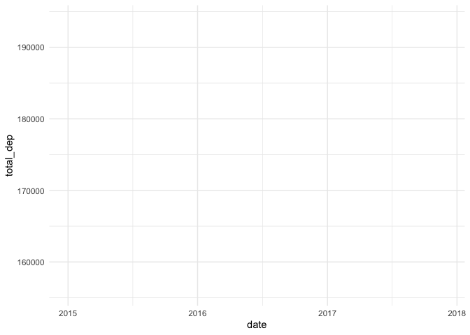

```r
library(tidyverse)     # for data cleaning and plotting
library(googlesheets4) # for reading googlesheet data
library(lubridate)     # for date manipulation
library(openintro)     # for the abbr2state() function
library(palmerpenguins)# for Palmer penguin data
library(maps)          # for map data
library(ggmap)         # for mapping points on maps
library(gplots)        # for col2hex() function
library(RColorBrewer)  # for color palettes
library(gifski)
library(ggimage)
library(sf)            # for working with spatial data
library(leaflet)       # for highly customizable mapping
library(ggthemes)      # for more themes (including theme_map())
library(plotly)        # for the ggplotly() - basic interactivity
library(gganimate)     # for adding animation layers to ggplots
library(transformr)    # for "tweening" (gganimate)
library(shiny)         # for creating interactive apps
gs4_deauth()           # To not have to authorize each time you knit.
theme_set(theme_minimal())
```


```r
# SNCF Train data
small_trains <- read_csv("https://raw.githubusercontent.com/rfordatascience/tidytuesday/master/data/2019/2019-02-26/small_trains.csv") 

# Lisa's garden data
garden_harvest <- read_sheet("https://docs.google.com/spreadsheets/d/1DekSazCzKqPS2jnGhKue7tLxRU3GVL1oxi-4bEM5IWw/edit?usp=sharing") %>% 
  mutate(date = ymd(date))

# Lisa's Mallorca cycling data
mallorca_bike_day7 <- read_csv("https://www.dropbox.com/s/zc6jan4ltmjtvy0/mallorca_bike_day7.csv?dl=1") %>% 
  select(1:4, speed)

# Heather Lendway's Ironman 70.3 Pan Am championships Panama data
panama_swim <- read_csv("https://raw.githubusercontent.com/llendway/gps-data/master/data/panama_swim_20160131.csv")

panama_bike <- read_csv("https://raw.githubusercontent.com/llendway/gps-data/master/data/panama_bike_20160131.csv")

panama_run <- read_csv("https://raw.githubusercontent.com/llendway/gps-data/master/data/panama_run_20160131.csv")

#COVID-19 data from the New York Times
covid19 <- read_csv("https://raw.githubusercontent.com/nytimes/covid-19-data/master/us-states.csv")
```

## Put your homework on GitHub!

Go [here](https://github.com/llendway/github_for_collaboration/blob/master/github_for_collaboration.md) or to previous homework to remind yourself how to get set up. 

Once your repository is created, you should always open your **project** rather than just opening an .Rmd file. You can do that by either clicking on the .Rproj file in your repository folder on your computer. Or, by going to the upper right hand corner in R Studio and clicking the arrow next to where it says Project: (None). You should see your project come up in that list if you've used it recently. You could also go to File --> Open Project and navigate to your .Rproj file. 

## Instructions

* Put your name at the top of the document. 

* **For ALL graphs, you should include appropriate labels.** 

* Feel free to change the default theme, which I currently have set to `theme_minimal()`. 

* Use good coding practice. Read the short sections on good code with [pipes](https://style.tidyverse.org/pipes.html) and [ggplot2](https://style.tidyverse.org/ggplot2.html). **This is part of your grade!**

* **NEW!!** With animated graphs, add `eval=FALSE` to the code chunk that creates the animation and saves it using `anim_save()`. Add another code chunk to reread the gif back into the file. See the [tutorial](https://animation-and-interactivity-in-r.netlify.app/) for help. 

* When you are finished with ALL the exercises, uncomment the options at the top so your document looks nicer. Don't do it before then, or else you might miss some important warnings and messages.

## Warm-up exercises from tutorial

  1. Choose 2 graphs you have created for ANY assignment in this class and add interactivity using the `ggplotly()` function.

```r
penguin_bill_dist_graph <- ggplot(data = penguins, 
       mapping = aes(x = bill_length_mm, 
                     y = bill_depth_mm,
                     color = species))+
  geom_point()+
  theme_minimal() +
  ggtitle("Bill Depth vs. Bill Length")

ggplotly(penguin_bill_dist_graph)
```

<!--html_preserve--><div id="htmlwidget-1fd32ddc4f01f6bb1086" style="width:672px;height:480px;" class="plotly html-widget"></div>
<script type="application/json" data-for="htmlwidget-1fd32ddc4f01f6bb1086">{"x":{"data":[{"x":[39.1,39.5,40.3,null,36.7,39.3,38.9,39.2,34.1,42,37.8,37.8,41.1,38.6,34.6,36.6,38.7,42.5,34.4,46,37.8,37.7,35.9,38.2,38.8,35.3,40.6,40.5,37.9,40.5,39.5,37.2,39.5,40.9,36.4,39.2,38.8,42.2,37.6,39.8,36.5,40.8,36,44.1,37,39.6,41.1,37.5,36,42.3,39.6,40.1,35,42,34.5,41.4,39,40.6,36.5,37.6,35.7,41.3,37.6,41.1,36.4,41.6,35.5,41.1,35.9,41.8,33.5,39.7,39.6,45.8,35.5,42.8,40.9,37.2,36.2,42.1,34.6,42.9,36.7,35.1,37.3,41.3,36.3,36.9,38.3,38.9,35.7,41.1,34,39.6,36.2,40.8,38.1,40.3,33.1,43.2,35,41,37.7,37.8,37.9,39.7,38.6,38.2,38.1,43.2,38.1,45.6,39.7,42.2,39.6,42.7,38.6,37.3,35.7,41.1,36.2,37.7,40.2,41.4,35.2,40.6,38.8,41.5,39,44.1,38.5,43.1,36.8,37.5,38.1,41.1,35.6,40.2,37,39.7,40.2,40.6,32.1,40.7,37.3,39,39.2,36.6,36,37.8,36,41.5],"y":[18.7,17.4,18,null,19.3,20.6,17.8,19.6,18.1,20.2,17.1,17.3,17.6,21.2,21.1,17.8,19,20.7,18.4,21.5,18.3,18.7,19.2,18.1,17.2,18.9,18.6,17.9,18.6,18.9,16.7,18.1,17.8,18.9,17,21.1,20,18.5,19.3,19.1,18,18.4,18.5,19.7,16.9,18.8,19,18.9,17.9,21.2,17.7,18.9,17.9,19.5,18.1,18.6,17.5,18.8,16.6,19.1,16.9,21.1,17,18.2,17.1,18,16.2,19.1,16.6,19.4,19,18.4,17.2,18.9,17.5,18.5,16.8,19.4,16.1,19.1,17.2,17.6,18.8,19.4,17.8,20.3,19.5,18.6,19.2,18.8,18,18.1,17.1,18.1,17.3,18.9,18.6,18.5,16.1,18.5,17.9,20,16,20,18.6,18.9,17.2,20,17,19,16.5,20.3,17.7,19.5,20.7,18.3,17,20.5,17,18.6,17.2,19.8,17,18.5,15.9,19,17.6,18.3,17.1,18,17.9,19.2,18.5,18.5,17.6,17.5,17.5,20.1,16.5,17.9,17.1,17.2,15.5,17,16.8,18.7,18.6,18.4,17.8,18.1,17.1,18.5],"text":["bill_length_mm: 39.1<br />bill_depth_mm: 18.7<br />species: Adelie","bill_length_mm: 39.5<br />bill_depth_mm: 17.4<br />species: Adelie","bill_length_mm: 40.3<br />bill_depth_mm: 18.0<br />species: Adelie","bill_length_mm:   NA<br />bill_depth_mm:   NA<br />species: Adelie","bill_length_mm: 36.7<br />bill_depth_mm: 19.3<br />species: Adelie","bill_length_mm: 39.3<br />bill_depth_mm: 20.6<br />species: Adelie","bill_length_mm: 38.9<br />bill_depth_mm: 17.8<br />species: Adelie","bill_length_mm: 39.2<br />bill_depth_mm: 19.6<br />species: Adelie","bill_length_mm: 34.1<br />bill_depth_mm: 18.1<br />species: Adelie","bill_length_mm: 42.0<br />bill_depth_mm: 20.2<br />species: Adelie","bill_length_mm: 37.8<br />bill_depth_mm: 17.1<br />species: Adelie","bill_length_mm: 37.8<br />bill_depth_mm: 17.3<br />species: Adelie","bill_length_mm: 41.1<br />bill_depth_mm: 17.6<br />species: Adelie","bill_length_mm: 38.6<br />bill_depth_mm: 21.2<br />species: Adelie","bill_length_mm: 34.6<br />bill_depth_mm: 21.1<br />species: Adelie","bill_length_mm: 36.6<br />bill_depth_mm: 17.8<br />species: Adelie","bill_length_mm: 38.7<br />bill_depth_mm: 19.0<br />species: Adelie","bill_length_mm: 42.5<br />bill_depth_mm: 20.7<br />species: Adelie","bill_length_mm: 34.4<br />bill_depth_mm: 18.4<br />species: Adelie","bill_length_mm: 46.0<br />bill_depth_mm: 21.5<br />species: Adelie","bill_length_mm: 37.8<br />bill_depth_mm: 18.3<br />species: Adelie","bill_length_mm: 37.7<br />bill_depth_mm: 18.7<br />species: Adelie","bill_length_mm: 35.9<br />bill_depth_mm: 19.2<br />species: Adelie","bill_length_mm: 38.2<br />bill_depth_mm: 18.1<br />species: Adelie","bill_length_mm: 38.8<br />bill_depth_mm: 17.2<br />species: Adelie","bill_length_mm: 35.3<br />bill_depth_mm: 18.9<br />species: Adelie","bill_length_mm: 40.6<br />bill_depth_mm: 18.6<br />species: Adelie","bill_length_mm: 40.5<br />bill_depth_mm: 17.9<br />species: Adelie","bill_length_mm: 37.9<br />bill_depth_mm: 18.6<br />species: Adelie","bill_length_mm: 40.5<br />bill_depth_mm: 18.9<br />species: Adelie","bill_length_mm: 39.5<br />bill_depth_mm: 16.7<br />species: Adelie","bill_length_mm: 37.2<br />bill_depth_mm: 18.1<br />species: Adelie","bill_length_mm: 39.5<br />bill_depth_mm: 17.8<br />species: Adelie","bill_length_mm: 40.9<br />bill_depth_mm: 18.9<br />species: Adelie","bill_length_mm: 36.4<br />bill_depth_mm: 17.0<br />species: Adelie","bill_length_mm: 39.2<br />bill_depth_mm: 21.1<br />species: Adelie","bill_length_mm: 38.8<br />bill_depth_mm: 20.0<br />species: Adelie","bill_length_mm: 42.2<br />bill_depth_mm: 18.5<br />species: Adelie","bill_length_mm: 37.6<br />bill_depth_mm: 19.3<br />species: Adelie","bill_length_mm: 39.8<br />bill_depth_mm: 19.1<br />species: Adelie","bill_length_mm: 36.5<br />bill_depth_mm: 18.0<br />species: Adelie","bill_length_mm: 40.8<br />bill_depth_mm: 18.4<br />species: Adelie","bill_length_mm: 36.0<br />bill_depth_mm: 18.5<br />species: Adelie","bill_length_mm: 44.1<br />bill_depth_mm: 19.7<br />species: Adelie","bill_length_mm: 37.0<br />bill_depth_mm: 16.9<br />species: Adelie","bill_length_mm: 39.6<br />bill_depth_mm: 18.8<br />species: Adelie","bill_length_mm: 41.1<br />bill_depth_mm: 19.0<br />species: Adelie","bill_length_mm: 37.5<br />bill_depth_mm: 18.9<br />species: Adelie","bill_length_mm: 36.0<br />bill_depth_mm: 17.9<br />species: Adelie","bill_length_mm: 42.3<br />bill_depth_mm: 21.2<br />species: Adelie","bill_length_mm: 39.6<br />bill_depth_mm: 17.7<br />species: Adelie","bill_length_mm: 40.1<br />bill_depth_mm: 18.9<br />species: Adelie","bill_length_mm: 35.0<br />bill_depth_mm: 17.9<br />species: Adelie","bill_length_mm: 42.0<br />bill_depth_mm: 19.5<br />species: Adelie","bill_length_mm: 34.5<br />bill_depth_mm: 18.1<br />species: Adelie","bill_length_mm: 41.4<br />bill_depth_mm: 18.6<br />species: Adelie","bill_length_mm: 39.0<br />bill_depth_mm: 17.5<br />species: Adelie","bill_length_mm: 40.6<br />bill_depth_mm: 18.8<br />species: Adelie","bill_length_mm: 36.5<br />bill_depth_mm: 16.6<br />species: Adelie","bill_length_mm: 37.6<br />bill_depth_mm: 19.1<br />species: Adelie","bill_length_mm: 35.7<br />bill_depth_mm: 16.9<br />species: Adelie","bill_length_mm: 41.3<br />bill_depth_mm: 21.1<br />species: Adelie","bill_length_mm: 37.6<br />bill_depth_mm: 17.0<br />species: Adelie","bill_length_mm: 41.1<br />bill_depth_mm: 18.2<br />species: Adelie","bill_length_mm: 36.4<br />bill_depth_mm: 17.1<br />species: Adelie","bill_length_mm: 41.6<br />bill_depth_mm: 18.0<br />species: Adelie","bill_length_mm: 35.5<br />bill_depth_mm: 16.2<br />species: Adelie","bill_length_mm: 41.1<br />bill_depth_mm: 19.1<br />species: Adelie","bill_length_mm: 35.9<br />bill_depth_mm: 16.6<br />species: Adelie","bill_length_mm: 41.8<br />bill_depth_mm: 19.4<br />species: Adelie","bill_length_mm: 33.5<br />bill_depth_mm: 19.0<br />species: Adelie","bill_length_mm: 39.7<br />bill_depth_mm: 18.4<br />species: Adelie","bill_length_mm: 39.6<br />bill_depth_mm: 17.2<br />species: Adelie","bill_length_mm: 45.8<br />bill_depth_mm: 18.9<br />species: Adelie","bill_length_mm: 35.5<br />bill_depth_mm: 17.5<br />species: Adelie","bill_length_mm: 42.8<br />bill_depth_mm: 18.5<br />species: Adelie","bill_length_mm: 40.9<br />bill_depth_mm: 16.8<br />species: Adelie","bill_length_mm: 37.2<br />bill_depth_mm: 19.4<br />species: Adelie","bill_length_mm: 36.2<br />bill_depth_mm: 16.1<br />species: Adelie","bill_length_mm: 42.1<br />bill_depth_mm: 19.1<br />species: Adelie","bill_length_mm: 34.6<br />bill_depth_mm: 17.2<br />species: Adelie","bill_length_mm: 42.9<br />bill_depth_mm: 17.6<br />species: Adelie","bill_length_mm: 36.7<br />bill_depth_mm: 18.8<br />species: Adelie","bill_length_mm: 35.1<br />bill_depth_mm: 19.4<br />species: Adelie","bill_length_mm: 37.3<br />bill_depth_mm: 17.8<br />species: Adelie","bill_length_mm: 41.3<br />bill_depth_mm: 20.3<br />species: Adelie","bill_length_mm: 36.3<br />bill_depth_mm: 19.5<br />species: Adelie","bill_length_mm: 36.9<br />bill_depth_mm: 18.6<br />species: Adelie","bill_length_mm: 38.3<br />bill_depth_mm: 19.2<br />species: Adelie","bill_length_mm: 38.9<br />bill_depth_mm: 18.8<br />species: Adelie","bill_length_mm: 35.7<br />bill_depth_mm: 18.0<br />species: Adelie","bill_length_mm: 41.1<br />bill_depth_mm: 18.1<br />species: Adelie","bill_length_mm: 34.0<br />bill_depth_mm: 17.1<br />species: Adelie","bill_length_mm: 39.6<br />bill_depth_mm: 18.1<br />species: Adelie","bill_length_mm: 36.2<br />bill_depth_mm: 17.3<br />species: Adelie","bill_length_mm: 40.8<br />bill_depth_mm: 18.9<br />species: Adelie","bill_length_mm: 38.1<br />bill_depth_mm: 18.6<br />species: Adelie","bill_length_mm: 40.3<br />bill_depth_mm: 18.5<br />species: Adelie","bill_length_mm: 33.1<br />bill_depth_mm: 16.1<br />species: Adelie","bill_length_mm: 43.2<br />bill_depth_mm: 18.5<br />species: Adelie","bill_length_mm: 35.0<br />bill_depth_mm: 17.9<br />species: Adelie","bill_length_mm: 41.0<br />bill_depth_mm: 20.0<br />species: Adelie","bill_length_mm: 37.7<br />bill_depth_mm: 16.0<br />species: Adelie","bill_length_mm: 37.8<br />bill_depth_mm: 20.0<br />species: Adelie","bill_length_mm: 37.9<br />bill_depth_mm: 18.6<br />species: Adelie","bill_length_mm: 39.7<br />bill_depth_mm: 18.9<br />species: Adelie","bill_length_mm: 38.6<br />bill_depth_mm: 17.2<br />species: Adelie","bill_length_mm: 38.2<br />bill_depth_mm: 20.0<br />species: Adelie","bill_length_mm: 38.1<br />bill_depth_mm: 17.0<br />species: Adelie","bill_length_mm: 43.2<br />bill_depth_mm: 19.0<br />species: Adelie","bill_length_mm: 38.1<br />bill_depth_mm: 16.5<br />species: Adelie","bill_length_mm: 45.6<br />bill_depth_mm: 20.3<br />species: Adelie","bill_length_mm: 39.7<br />bill_depth_mm: 17.7<br />species: Adelie","bill_length_mm: 42.2<br />bill_depth_mm: 19.5<br />species: Adelie","bill_length_mm: 39.6<br />bill_depth_mm: 20.7<br />species: Adelie","bill_length_mm: 42.7<br />bill_depth_mm: 18.3<br />species: Adelie","bill_length_mm: 38.6<br />bill_depth_mm: 17.0<br />species: Adelie","bill_length_mm: 37.3<br />bill_depth_mm: 20.5<br />species: Adelie","bill_length_mm: 35.7<br />bill_depth_mm: 17.0<br />species: Adelie","bill_length_mm: 41.1<br />bill_depth_mm: 18.6<br />species: Adelie","bill_length_mm: 36.2<br />bill_depth_mm: 17.2<br />species: Adelie","bill_length_mm: 37.7<br />bill_depth_mm: 19.8<br />species: Adelie","bill_length_mm: 40.2<br />bill_depth_mm: 17.0<br />species: Adelie","bill_length_mm: 41.4<br />bill_depth_mm: 18.5<br />species: Adelie","bill_length_mm: 35.2<br />bill_depth_mm: 15.9<br />species: Adelie","bill_length_mm: 40.6<br />bill_depth_mm: 19.0<br />species: Adelie","bill_length_mm: 38.8<br />bill_depth_mm: 17.6<br />species: Adelie","bill_length_mm: 41.5<br />bill_depth_mm: 18.3<br />species: Adelie","bill_length_mm: 39.0<br />bill_depth_mm: 17.1<br />species: Adelie","bill_length_mm: 44.1<br />bill_depth_mm: 18.0<br />species: Adelie","bill_length_mm: 38.5<br />bill_depth_mm: 17.9<br />species: Adelie","bill_length_mm: 43.1<br />bill_depth_mm: 19.2<br />species: Adelie","bill_length_mm: 36.8<br />bill_depth_mm: 18.5<br />species: Adelie","bill_length_mm: 37.5<br />bill_depth_mm: 18.5<br />species: Adelie","bill_length_mm: 38.1<br />bill_depth_mm: 17.6<br />species: Adelie","bill_length_mm: 41.1<br />bill_depth_mm: 17.5<br />species: Adelie","bill_length_mm: 35.6<br />bill_depth_mm: 17.5<br />species: Adelie","bill_length_mm: 40.2<br />bill_depth_mm: 20.1<br />species: Adelie","bill_length_mm: 37.0<br />bill_depth_mm: 16.5<br />species: Adelie","bill_length_mm: 39.7<br />bill_depth_mm: 17.9<br />species: Adelie","bill_length_mm: 40.2<br />bill_depth_mm: 17.1<br />species: Adelie","bill_length_mm: 40.6<br />bill_depth_mm: 17.2<br />species: Adelie","bill_length_mm: 32.1<br />bill_depth_mm: 15.5<br />species: Adelie","bill_length_mm: 40.7<br />bill_depth_mm: 17.0<br />species: Adelie","bill_length_mm: 37.3<br />bill_depth_mm: 16.8<br />species: Adelie","bill_length_mm: 39.0<br />bill_depth_mm: 18.7<br />species: Adelie","bill_length_mm: 39.2<br />bill_depth_mm: 18.6<br />species: Adelie","bill_length_mm: 36.6<br />bill_depth_mm: 18.4<br />species: Adelie","bill_length_mm: 36.0<br />bill_depth_mm: 17.8<br />species: Adelie","bill_length_mm: 37.8<br />bill_depth_mm: 18.1<br />species: Adelie","bill_length_mm: 36.0<br />bill_depth_mm: 17.1<br />species: Adelie","bill_length_mm: 41.5<br />bill_depth_mm: 18.5<br />species: Adelie"],"type":"scatter","mode":"markers","marker":{"autocolorscale":false,"color":"rgba(248,118,109,1)","opacity":1,"size":5.66929133858268,"symbol":"circle","line":{"width":1.88976377952756,"color":"rgba(248,118,109,1)"}},"hoveron":"points","name":"Adelie","legendgroup":"Adelie","showlegend":true,"xaxis":"x","yaxis":"y","hoverinfo":"text","frame":null},{"x":[46.5,50,51.3,45.4,52.7,45.2,46.1,51.3,46,51.3,46.6,51.7,47,52,45.9,50.5,50.3,58,46.4,49.2,42.4,48.5,43.2,50.6,46.7,52,50.5,49.5,46.4,52.8,40.9,54.2,42.5,51,49.7,47.5,47.6,52,46.9,53.5,49,46.2,50.9,45.5,50.9,50.8,50.1,49,51.5,49.8,48.1,51.4,45.7,50.7,42.5,52.2,45.2,49.3,50.2,45.6,51.9,46.8,45.7,55.8,43.5,49.6,50.8,50.2],"y":[17.9,19.5,19.2,18.7,19.8,17.8,18.2,18.2,18.9,19.9,17.8,20.3,17.3,18.1,17.1,19.6,20,17.8,18.6,18.2,17.3,17.5,16.6,19.4,17.9,19,18.4,19,17.8,20,16.6,20.8,16.7,18.8,18.6,16.8,18.3,20.7,16.6,19.9,19.5,17.5,19.1,17,17.9,18.5,17.9,19.6,18.7,17.3,16.4,19,17.3,19.7,17.3,18.8,16.6,19.9,18.8,19.4,19.5,16.5,17,19.8,18.1,18.2,19,18.7],"text":["bill_length_mm: 46.5<br />bill_depth_mm: 17.9<br />species: Chinstrap","bill_length_mm: 50.0<br />bill_depth_mm: 19.5<br />species: Chinstrap","bill_length_mm: 51.3<br />bill_depth_mm: 19.2<br />species: Chinstrap","bill_length_mm: 45.4<br />bill_depth_mm: 18.7<br />species: Chinstrap","bill_length_mm: 52.7<br />bill_depth_mm: 19.8<br />species: Chinstrap","bill_length_mm: 45.2<br />bill_depth_mm: 17.8<br />species: Chinstrap","bill_length_mm: 46.1<br />bill_depth_mm: 18.2<br />species: Chinstrap","bill_length_mm: 51.3<br />bill_depth_mm: 18.2<br />species: Chinstrap","bill_length_mm: 46.0<br />bill_depth_mm: 18.9<br />species: Chinstrap","bill_length_mm: 51.3<br />bill_depth_mm: 19.9<br />species: Chinstrap","bill_length_mm: 46.6<br />bill_depth_mm: 17.8<br />species: Chinstrap","bill_length_mm: 51.7<br />bill_depth_mm: 20.3<br />species: Chinstrap","bill_length_mm: 47.0<br />bill_depth_mm: 17.3<br />species: Chinstrap","bill_length_mm: 52.0<br />bill_depth_mm: 18.1<br />species: Chinstrap","bill_length_mm: 45.9<br />bill_depth_mm: 17.1<br />species: Chinstrap","bill_length_mm: 50.5<br />bill_depth_mm: 19.6<br />species: Chinstrap","bill_length_mm: 50.3<br />bill_depth_mm: 20.0<br />species: Chinstrap","bill_length_mm: 58.0<br />bill_depth_mm: 17.8<br />species: Chinstrap","bill_length_mm: 46.4<br />bill_depth_mm: 18.6<br />species: Chinstrap","bill_length_mm: 49.2<br />bill_depth_mm: 18.2<br />species: Chinstrap","bill_length_mm: 42.4<br />bill_depth_mm: 17.3<br />species: Chinstrap","bill_length_mm: 48.5<br />bill_depth_mm: 17.5<br />species: Chinstrap","bill_length_mm: 43.2<br />bill_depth_mm: 16.6<br />species: Chinstrap","bill_length_mm: 50.6<br />bill_depth_mm: 19.4<br />species: Chinstrap","bill_length_mm: 46.7<br />bill_depth_mm: 17.9<br />species: Chinstrap","bill_length_mm: 52.0<br />bill_depth_mm: 19.0<br />species: Chinstrap","bill_length_mm: 50.5<br />bill_depth_mm: 18.4<br />species: Chinstrap","bill_length_mm: 49.5<br />bill_depth_mm: 19.0<br />species: Chinstrap","bill_length_mm: 46.4<br />bill_depth_mm: 17.8<br />species: Chinstrap","bill_length_mm: 52.8<br />bill_depth_mm: 20.0<br />species: Chinstrap","bill_length_mm: 40.9<br />bill_depth_mm: 16.6<br />species: Chinstrap","bill_length_mm: 54.2<br />bill_depth_mm: 20.8<br />species: Chinstrap","bill_length_mm: 42.5<br />bill_depth_mm: 16.7<br />species: Chinstrap","bill_length_mm: 51.0<br />bill_depth_mm: 18.8<br />species: Chinstrap","bill_length_mm: 49.7<br />bill_depth_mm: 18.6<br />species: Chinstrap","bill_length_mm: 47.5<br />bill_depth_mm: 16.8<br />species: Chinstrap","bill_length_mm: 47.6<br />bill_depth_mm: 18.3<br />species: Chinstrap","bill_length_mm: 52.0<br />bill_depth_mm: 20.7<br />species: Chinstrap","bill_length_mm: 46.9<br />bill_depth_mm: 16.6<br />species: Chinstrap","bill_length_mm: 53.5<br />bill_depth_mm: 19.9<br />species: Chinstrap","bill_length_mm: 49.0<br />bill_depth_mm: 19.5<br />species: Chinstrap","bill_length_mm: 46.2<br />bill_depth_mm: 17.5<br />species: Chinstrap","bill_length_mm: 50.9<br />bill_depth_mm: 19.1<br />species: Chinstrap","bill_length_mm: 45.5<br />bill_depth_mm: 17.0<br />species: Chinstrap","bill_length_mm: 50.9<br />bill_depth_mm: 17.9<br />species: Chinstrap","bill_length_mm: 50.8<br />bill_depth_mm: 18.5<br />species: Chinstrap","bill_length_mm: 50.1<br />bill_depth_mm: 17.9<br />species: Chinstrap","bill_length_mm: 49.0<br />bill_depth_mm: 19.6<br />species: Chinstrap","bill_length_mm: 51.5<br />bill_depth_mm: 18.7<br />species: Chinstrap","bill_length_mm: 49.8<br />bill_depth_mm: 17.3<br />species: Chinstrap","bill_length_mm: 48.1<br />bill_depth_mm: 16.4<br />species: Chinstrap","bill_length_mm: 51.4<br />bill_depth_mm: 19.0<br />species: Chinstrap","bill_length_mm: 45.7<br />bill_depth_mm: 17.3<br />species: Chinstrap","bill_length_mm: 50.7<br />bill_depth_mm: 19.7<br />species: Chinstrap","bill_length_mm: 42.5<br />bill_depth_mm: 17.3<br />species: Chinstrap","bill_length_mm: 52.2<br />bill_depth_mm: 18.8<br />species: Chinstrap","bill_length_mm: 45.2<br />bill_depth_mm: 16.6<br />species: Chinstrap","bill_length_mm: 49.3<br />bill_depth_mm: 19.9<br />species: Chinstrap","bill_length_mm: 50.2<br />bill_depth_mm: 18.8<br />species: Chinstrap","bill_length_mm: 45.6<br />bill_depth_mm: 19.4<br />species: Chinstrap","bill_length_mm: 51.9<br />bill_depth_mm: 19.5<br />species: Chinstrap","bill_length_mm: 46.8<br />bill_depth_mm: 16.5<br />species: Chinstrap","bill_length_mm: 45.7<br />bill_depth_mm: 17.0<br />species: Chinstrap","bill_length_mm: 55.8<br />bill_depth_mm: 19.8<br />species: Chinstrap","bill_length_mm: 43.5<br />bill_depth_mm: 18.1<br />species: Chinstrap","bill_length_mm: 49.6<br />bill_depth_mm: 18.2<br />species: Chinstrap","bill_length_mm: 50.8<br />bill_depth_mm: 19.0<br />species: Chinstrap","bill_length_mm: 50.2<br />bill_depth_mm: 18.7<br />species: Chinstrap"],"type":"scatter","mode":"markers","marker":{"autocolorscale":false,"color":"rgba(0,186,56,1)","opacity":1,"size":5.66929133858268,"symbol":"circle","line":{"width":1.88976377952756,"color":"rgba(0,186,56,1)"}},"hoveron":"points","name":"Chinstrap","legendgroup":"Chinstrap","showlegend":true,"xaxis":"x","yaxis":"y","hoverinfo":"text","frame":null},{"x":[46.1,50,48.7,50,47.6,46.5,45.4,46.7,43.3,46.8,40.9,49,45.5,48.4,45.8,49.3,42,49.2,46.2,48.7,50.2,45.1,46.5,46.3,42.9,46.1,44.5,47.8,48.2,50,47.3,42.8,45.1,59.6,49.1,48.4,42.6,44.4,44,48.7,42.7,49.6,45.3,49.6,50.5,43.6,45.5,50.5,44.9,45.2,46.6,48.5,45.1,50.1,46.5,45,43.8,45.5,43.2,50.4,45.3,46.2,45.7,54.3,45.8,49.8,46.2,49.5,43.5,50.7,47.7,46.4,48.2,46.5,46.4,48.6,47.5,51.1,45.2,45.2,49.1,52.5,47.4,50,44.9,50.8,43.4,51.3,47.5,52.1,47.5,52.2,45.5,49.5,44.5,50.8,49.4,46.9,48.4,51.1,48.5,55.9,47.2,49.1,47.3,46.8,41.7,53.4,43.3,48.1,50.5,49.8,43.5,51.5,46.2,55.1,44.5,48.8,47.2,null,46.8,50.4,45.2,49.9],"y":[13.2,16.3,14.1,15.2,14.5,13.5,14.6,15.3,13.4,15.4,13.7,16.1,13.7,14.6,14.6,15.7,13.5,15.2,14.5,15.1,14.3,14.5,14.5,15.8,13.1,15.1,14.3,15,14.3,15.3,15.3,14.2,14.5,17,14.8,16.3,13.7,17.3,13.6,15.7,13.7,16,13.7,15,15.9,13.9,13.9,15.9,13.3,15.8,14.2,14.1,14.4,15,14.4,15.4,13.9,15,14.5,15.3,13.8,14.9,13.9,15.7,14.2,16.8,14.4,16.2,14.2,15,15,15.6,15.6,14.8,15,16,14.2,16.3,13.8,16.4,14.5,15.6,14.6,15.9,13.8,17.3,14.4,14.2,14,17,15,17.1,14.5,16.1,14.7,15.7,15.8,14.6,14.4,16.5,15,17,15.5,15,13.8,16.1,14.7,15.8,14,15.1,15.2,15.9,15.2,16.3,14.1,16,15.7,16.2,13.7,null,14.3,15.7,14.8,16.1],"text":["bill_length_mm: 46.1<br />bill_depth_mm: 13.2<br />species: Gentoo","bill_length_mm: 50.0<br />bill_depth_mm: 16.3<br />species: Gentoo","bill_length_mm: 48.7<br />bill_depth_mm: 14.1<br />species: Gentoo","bill_length_mm: 50.0<br />bill_depth_mm: 15.2<br />species: Gentoo","bill_length_mm: 47.6<br />bill_depth_mm: 14.5<br />species: Gentoo","bill_length_mm: 46.5<br />bill_depth_mm: 13.5<br />species: Gentoo","bill_length_mm: 45.4<br />bill_depth_mm: 14.6<br />species: Gentoo","bill_length_mm: 46.7<br />bill_depth_mm: 15.3<br />species: Gentoo","bill_length_mm: 43.3<br />bill_depth_mm: 13.4<br />species: Gentoo","bill_length_mm: 46.8<br />bill_depth_mm: 15.4<br />species: Gentoo","bill_length_mm: 40.9<br />bill_depth_mm: 13.7<br />species: Gentoo","bill_length_mm: 49.0<br />bill_depth_mm: 16.1<br />species: Gentoo","bill_length_mm: 45.5<br />bill_depth_mm: 13.7<br />species: Gentoo","bill_length_mm: 48.4<br />bill_depth_mm: 14.6<br />species: Gentoo","bill_length_mm: 45.8<br />bill_depth_mm: 14.6<br />species: Gentoo","bill_length_mm: 49.3<br />bill_depth_mm: 15.7<br />species: Gentoo","bill_length_mm: 42.0<br />bill_depth_mm: 13.5<br />species: Gentoo","bill_length_mm: 49.2<br />bill_depth_mm: 15.2<br />species: Gentoo","bill_length_mm: 46.2<br />bill_depth_mm: 14.5<br />species: Gentoo","bill_length_mm: 48.7<br />bill_depth_mm: 15.1<br />species: Gentoo","bill_length_mm: 50.2<br />bill_depth_mm: 14.3<br />species: Gentoo","bill_length_mm: 45.1<br />bill_depth_mm: 14.5<br />species: Gentoo","bill_length_mm: 46.5<br />bill_depth_mm: 14.5<br />species: Gentoo","bill_length_mm: 46.3<br />bill_depth_mm: 15.8<br />species: Gentoo","bill_length_mm: 42.9<br />bill_depth_mm: 13.1<br />species: Gentoo","bill_length_mm: 46.1<br />bill_depth_mm: 15.1<br />species: Gentoo","bill_length_mm: 44.5<br />bill_depth_mm: 14.3<br />species: Gentoo","bill_length_mm: 47.8<br />bill_depth_mm: 15.0<br />species: Gentoo","bill_length_mm: 48.2<br />bill_depth_mm: 14.3<br />species: Gentoo","bill_length_mm: 50.0<br />bill_depth_mm: 15.3<br />species: Gentoo","bill_length_mm: 47.3<br />bill_depth_mm: 15.3<br />species: Gentoo","bill_length_mm: 42.8<br />bill_depth_mm: 14.2<br />species: Gentoo","bill_length_mm: 45.1<br />bill_depth_mm: 14.5<br />species: Gentoo","bill_length_mm: 59.6<br />bill_depth_mm: 17.0<br />species: Gentoo","bill_length_mm: 49.1<br />bill_depth_mm: 14.8<br />species: Gentoo","bill_length_mm: 48.4<br />bill_depth_mm: 16.3<br />species: Gentoo","bill_length_mm: 42.6<br />bill_depth_mm: 13.7<br />species: Gentoo","bill_length_mm: 44.4<br />bill_depth_mm: 17.3<br />species: Gentoo","bill_length_mm: 44.0<br />bill_depth_mm: 13.6<br />species: Gentoo","bill_length_mm: 48.7<br />bill_depth_mm: 15.7<br />species: Gentoo","bill_length_mm: 42.7<br />bill_depth_mm: 13.7<br />species: Gentoo","bill_length_mm: 49.6<br />bill_depth_mm: 16.0<br />species: Gentoo","bill_length_mm: 45.3<br />bill_depth_mm: 13.7<br />species: Gentoo","bill_length_mm: 49.6<br />bill_depth_mm: 15.0<br />species: Gentoo","bill_length_mm: 50.5<br />bill_depth_mm: 15.9<br />species: Gentoo","bill_length_mm: 43.6<br />bill_depth_mm: 13.9<br />species: Gentoo","bill_length_mm: 45.5<br />bill_depth_mm: 13.9<br />species: Gentoo","bill_length_mm: 50.5<br />bill_depth_mm: 15.9<br />species: Gentoo","bill_length_mm: 44.9<br />bill_depth_mm: 13.3<br />species: Gentoo","bill_length_mm: 45.2<br />bill_depth_mm: 15.8<br />species: Gentoo","bill_length_mm: 46.6<br />bill_depth_mm: 14.2<br />species: Gentoo","bill_length_mm: 48.5<br />bill_depth_mm: 14.1<br />species: Gentoo","bill_length_mm: 45.1<br />bill_depth_mm: 14.4<br />species: Gentoo","bill_length_mm: 50.1<br />bill_depth_mm: 15.0<br />species: Gentoo","bill_length_mm: 46.5<br />bill_depth_mm: 14.4<br />species: Gentoo","bill_length_mm: 45.0<br />bill_depth_mm: 15.4<br />species: Gentoo","bill_length_mm: 43.8<br />bill_depth_mm: 13.9<br />species: Gentoo","bill_length_mm: 45.5<br />bill_depth_mm: 15.0<br />species: Gentoo","bill_length_mm: 43.2<br />bill_depth_mm: 14.5<br />species: Gentoo","bill_length_mm: 50.4<br />bill_depth_mm: 15.3<br />species: Gentoo","bill_length_mm: 45.3<br />bill_depth_mm: 13.8<br />species: Gentoo","bill_length_mm: 46.2<br />bill_depth_mm: 14.9<br />species: Gentoo","bill_length_mm: 45.7<br />bill_depth_mm: 13.9<br />species: Gentoo","bill_length_mm: 54.3<br />bill_depth_mm: 15.7<br />species: Gentoo","bill_length_mm: 45.8<br />bill_depth_mm: 14.2<br />species: Gentoo","bill_length_mm: 49.8<br />bill_depth_mm: 16.8<br />species: Gentoo","bill_length_mm: 46.2<br />bill_depth_mm: 14.4<br />species: Gentoo","bill_length_mm: 49.5<br />bill_depth_mm: 16.2<br />species: Gentoo","bill_length_mm: 43.5<br />bill_depth_mm: 14.2<br />species: Gentoo","bill_length_mm: 50.7<br />bill_depth_mm: 15.0<br />species: Gentoo","bill_length_mm: 47.7<br />bill_depth_mm: 15.0<br />species: Gentoo","bill_length_mm: 46.4<br />bill_depth_mm: 15.6<br />species: Gentoo","bill_length_mm: 48.2<br />bill_depth_mm: 15.6<br />species: Gentoo","bill_length_mm: 46.5<br />bill_depth_mm: 14.8<br />species: Gentoo","bill_length_mm: 46.4<br />bill_depth_mm: 15.0<br />species: Gentoo","bill_length_mm: 48.6<br />bill_depth_mm: 16.0<br />species: Gentoo","bill_length_mm: 47.5<br />bill_depth_mm: 14.2<br />species: Gentoo","bill_length_mm: 51.1<br />bill_depth_mm: 16.3<br />species: Gentoo","bill_length_mm: 45.2<br />bill_depth_mm: 13.8<br />species: Gentoo","bill_length_mm: 45.2<br />bill_depth_mm: 16.4<br />species: Gentoo","bill_length_mm: 49.1<br />bill_depth_mm: 14.5<br />species: Gentoo","bill_length_mm: 52.5<br />bill_depth_mm: 15.6<br />species: Gentoo","bill_length_mm: 47.4<br />bill_depth_mm: 14.6<br />species: Gentoo","bill_length_mm: 50.0<br />bill_depth_mm: 15.9<br />species: Gentoo","bill_length_mm: 44.9<br />bill_depth_mm: 13.8<br />species: Gentoo","bill_length_mm: 50.8<br />bill_depth_mm: 17.3<br />species: Gentoo","bill_length_mm: 43.4<br />bill_depth_mm: 14.4<br />species: Gentoo","bill_length_mm: 51.3<br />bill_depth_mm: 14.2<br />species: Gentoo","bill_length_mm: 47.5<br />bill_depth_mm: 14.0<br />species: Gentoo","bill_length_mm: 52.1<br />bill_depth_mm: 17.0<br />species: Gentoo","bill_length_mm: 47.5<br />bill_depth_mm: 15.0<br />species: Gentoo","bill_length_mm: 52.2<br />bill_depth_mm: 17.1<br />species: Gentoo","bill_length_mm: 45.5<br />bill_depth_mm: 14.5<br />species: Gentoo","bill_length_mm: 49.5<br />bill_depth_mm: 16.1<br />species: Gentoo","bill_length_mm: 44.5<br />bill_depth_mm: 14.7<br />species: Gentoo","bill_length_mm: 50.8<br />bill_depth_mm: 15.7<br />species: Gentoo","bill_length_mm: 49.4<br />bill_depth_mm: 15.8<br />species: Gentoo","bill_length_mm: 46.9<br />bill_depth_mm: 14.6<br />species: Gentoo","bill_length_mm: 48.4<br />bill_depth_mm: 14.4<br />species: Gentoo","bill_length_mm: 51.1<br />bill_depth_mm: 16.5<br />species: Gentoo","bill_length_mm: 48.5<br />bill_depth_mm: 15.0<br />species: Gentoo","bill_length_mm: 55.9<br />bill_depth_mm: 17.0<br />species: Gentoo","bill_length_mm: 47.2<br />bill_depth_mm: 15.5<br />species: Gentoo","bill_length_mm: 49.1<br />bill_depth_mm: 15.0<br />species: Gentoo","bill_length_mm: 47.3<br />bill_depth_mm: 13.8<br />species: Gentoo","bill_length_mm: 46.8<br />bill_depth_mm: 16.1<br />species: Gentoo","bill_length_mm: 41.7<br />bill_depth_mm: 14.7<br />species: Gentoo","bill_length_mm: 53.4<br />bill_depth_mm: 15.8<br />species: Gentoo","bill_length_mm: 43.3<br />bill_depth_mm: 14.0<br />species: Gentoo","bill_length_mm: 48.1<br />bill_depth_mm: 15.1<br />species: Gentoo","bill_length_mm: 50.5<br />bill_depth_mm: 15.2<br />species: Gentoo","bill_length_mm: 49.8<br />bill_depth_mm: 15.9<br />species: Gentoo","bill_length_mm: 43.5<br />bill_depth_mm: 15.2<br />species: Gentoo","bill_length_mm: 51.5<br />bill_depth_mm: 16.3<br />species: Gentoo","bill_length_mm: 46.2<br />bill_depth_mm: 14.1<br />species: Gentoo","bill_length_mm: 55.1<br />bill_depth_mm: 16.0<br />species: Gentoo","bill_length_mm: 44.5<br />bill_depth_mm: 15.7<br />species: Gentoo","bill_length_mm: 48.8<br />bill_depth_mm: 16.2<br />species: Gentoo","bill_length_mm: 47.2<br />bill_depth_mm: 13.7<br />species: Gentoo","bill_length_mm:   NA<br />bill_depth_mm:   NA<br />species: Gentoo","bill_length_mm: 46.8<br />bill_depth_mm: 14.3<br />species: Gentoo","bill_length_mm: 50.4<br />bill_depth_mm: 15.7<br />species: Gentoo","bill_length_mm: 45.2<br />bill_depth_mm: 14.8<br />species: Gentoo","bill_length_mm: 49.9<br />bill_depth_mm: 16.1<br />species: Gentoo"],"type":"scatter","mode":"markers","marker":{"autocolorscale":false,"color":"rgba(97,156,255,1)","opacity":1,"size":5.66929133858268,"symbol":"circle","line":{"width":1.88976377952756,"color":"rgba(97,156,255,1)"}},"hoveron":"points","name":"Gentoo","legendgroup":"Gentoo","showlegend":true,"xaxis":"x","yaxis":"y","hoverinfo":"text","frame":null}],"layout":{"margin":{"t":43.7625570776256,"r":7.30593607305936,"b":40.1826484018265,"l":48.9497716894977},"font":{"color":"rgba(0,0,0,1)","family":"","size":14.6118721461187},"title":{"text":"Bill Depth vs. Bill Length","font":{"color":"rgba(0,0,0,1)","family":"","size":17.5342465753425},"x":0,"xref":"paper"},"xaxis":{"domain":[0,1],"automargin":true,"type":"linear","autorange":false,"range":[30.725,60.975],"tickmode":"array","ticktext":["40","50","60"],"tickvals":[40,50,60],"categoryorder":"array","categoryarray":["40","50","60"],"nticks":null,"ticks":"","tickcolor":null,"ticklen":3.65296803652968,"tickwidth":0,"showticklabels":true,"tickfont":{"color":"rgba(77,77,77,1)","family":"","size":11.689497716895},"tickangle":-0,"showline":false,"linecolor":null,"linewidth":0,"showgrid":true,"gridcolor":"rgba(235,235,235,1)","gridwidth":0.66417600664176,"zeroline":false,"anchor":"y","title":{"text":"bill_length_mm","font":{"color":"rgba(0,0,0,1)","family":"","size":14.6118721461187}},"hoverformat":".2f"},"yaxis":{"domain":[0,1],"automargin":true,"type":"linear","autorange":false,"range":[12.68,21.92],"tickmode":"array","ticktext":["15.0","17.5","20.0"],"tickvals":[15,17.5,20],"categoryorder":"array","categoryarray":["15.0","17.5","20.0"],"nticks":null,"ticks":"","tickcolor":null,"ticklen":3.65296803652968,"tickwidth":0,"showticklabels":true,"tickfont":{"color":"rgba(77,77,77,1)","family":"","size":11.689497716895},"tickangle":-0,"showline":false,"linecolor":null,"linewidth":0,"showgrid":true,"gridcolor":"rgba(235,235,235,1)","gridwidth":0.66417600664176,"zeroline":false,"anchor":"x","title":{"text":"bill_depth_mm","font":{"color":"rgba(0,0,0,1)","family":"","size":14.6118721461187}},"hoverformat":".2f"},"shapes":[{"type":"rect","fillcolor":null,"line":{"color":null,"width":0,"linetype":[]},"yref":"paper","xref":"paper","x0":0,"x1":1,"y0":0,"y1":1}],"showlegend":true,"legend":{"bgcolor":null,"bordercolor":null,"borderwidth":0,"font":{"color":"rgba(0,0,0,1)","family":"","size":11.689497716895},"y":0.913385826771654},"annotations":[{"text":"species","x":1.02,"y":1,"showarrow":false,"ax":0,"ay":0,"font":{"color":"rgba(0,0,0,1)","family":"","size":14.6118721461187},"xref":"paper","yref":"paper","textangle":-0,"xanchor":"left","yanchor":"bottom","legendTitle":true}],"hovermode":"closest","barmode":"relative"},"config":{"doubleClick":"reset","showSendToCloud":false},"source":"A","attrs":{"2b9814cd9e1e":{"x":{},"y":{},"colour":{},"type":"scatter"}},"cur_data":"2b9814cd9e1e","visdat":{"2b9814cd9e1e":["function (y) ","x"]},"highlight":{"on":"plotly_click","persistent":false,"dynamic":false,"selectize":false,"opacityDim":0.2,"selected":{"opacity":1},"debounce":0},"shinyEvents":["plotly_hover","plotly_click","plotly_selected","plotly_relayout","plotly_brushed","plotly_brushing","plotly_clickannotation","plotly_doubleclick","plotly_deselect","plotly_afterplot","plotly_sunburstclick"],"base_url":"https://plot.ly"},"evals":[],"jsHooks":[]}</script><!--/html_preserve-->

```r
kids <- readr::read_csv('https://raw.githubusercontent.com/rfordatascience/tidytuesday/master/data/2020/2020-09-15/kids.csv')

kids_graph <- kids %>%
  filter(variable == "PK12ed") %>%
  group_by(state) %>%
  mutate(avg_inf_adj_perchild = mean(inf_adj_perchild, na.rm = TRUE)) %>%
  ggplot(aes(y = fct_reorder(state, avg_inf_adj_perchild), 
             x = avg_inf_adj_perchild)) +
  geom_point()+
  geom_segment(aes(x = 0,
                   xend = avg_inf_adj_perchild,
                   y = fct_reorder(state, avg_inf_adj_perchild),
                   yend = fct_reorder(state, avg_inf_adj_perchild))) +
  labs(title = "Avg. Money Spent per Student on PK-12 Education Ranked by State",
       x = "Avg $ Spent in Thousands per Child on PK-12 Ed. Between 1997-2016 Inflation Adjusted",
       y = "State")

ggplotly(kids_graph)
```

<!--html_preserve--><div id="htmlwidget-c312fa5fd07f5b6e158d" style="width:672px;height:480px;" class="plotly html-widget"></div>
<script type="application/json" data-for="htmlwidget-c312fa5fd07f5b6e158d">{"x":{"data":[{"x":[5.27268333435059,9.70297572612762,4.26423749923706,5.37866089344025,6.02038974761963,5.46557011604309,8.77482063770294,7.09977126121521,13.4555758953094,5.30540606975555,5.83366479873657,5.59903248548508,4.36384936571121,6.40442328453064,5.33423099517822,6.06329300403595,5.65355131626129,5.13646235466003,5.59625180959702,7.42867844104767,6.86925082206726,7.92258167266846,6.68053283691406,6.45551223754883,4.68812066316605,5.53973317146301,5.98297555446625,6.05423047542572,5.0754002571106,7.53821556568146,9.87119402885437,5.42433842420578,10.3252015590668,5.07173688411713,6.04780838489532,6.39568057060242,5.07362802028656,6.05885066986084,7.32244873046875,8.47617084980011,5.68958594799042,4.90027072429657,4.84905337095261,5.37409608364105,3.87094674110413,9.25239596366882,6.69810307025909,5.86036756038666,6.83298907279968,6.87703456878662,8.58222742080688,5.27268333435059,9.70297572612762,4.26423749923706,5.37866089344025,6.02038974761963,5.46557011604309,8.77482063770294,7.09977126121521,13.4555758953094,5.30540606975555,5.83366479873657,5.59903248548508,4.36384936571121,6.40442328453064,5.33423099517822,6.06329300403595,5.65355131626129,5.13646235466003,5.59625180959702,7.42867844104767,6.86925082206726,7.92258167266846,6.68053283691406,6.45551223754883,4.68812066316605,5.53973317146301,5.98297555446625,6.05423047542572,5.0754002571106,7.53821556568146,9.87119402885437,5.42433842420578,10.3252015590668,5.07173688411713,6.04780838489532,6.39568057060242,5.07362802028656,6.05885066986084,7.32244873046875,8.47617084980011,5.68958594799042,4.90027072429657,4.84905337095261,5.37409608364105,3.87094674110413,9.25239596366882,6.69810307025909,5.86036756038666,6.83298907279968,6.87703456878662,8.58222742080688,5.27268333435059,9.70297572612762,4.26423749923706,5.37866089344025,6.02038974761963,5.46557011604309,8.77482063770294,7.09977126121521,13.4555758953094,5.30540606975555,5.83366479873657,5.59903248548508,4.36384936571121,6.40442328453064,5.33423099517822,6.06329300403595,5.65355131626129,5.13646235466003,5.59625180959702,7.42867844104767,6.86925082206726,7.92258167266846,6.68053283691406,6.45551223754883,4.68812066316605,5.53973317146301,5.98297555446625,6.05423047542572,5.0754002571106,7.53821556568146,9.87119402885437,5.42433842420578,10.3252015590668,5.07173688411713,6.04780838489532,6.39568057060242,5.07362802028656,6.05885066986084,7.32244873046875,8.47617084980011,5.68958594799042,4.90027072429657,4.84905337095261,5.37409608364105,3.87094674110413,9.25239596366882,6.69810307025909,5.86036756038666,6.83298907279968,6.87703456878662,8.58222742080688,5.27268333435059,9.70297572612762,4.26423749923706,5.37866089344025,6.02038974761963,5.46557011604309,8.77482063770294,7.09977126121521,13.4555758953094,5.30540606975555,5.83366479873657,5.59903248548508,4.36384936571121,6.40442328453064,5.33423099517822,6.06329300403595,5.65355131626129,5.13646235466003,5.59625180959702,7.42867844104767,6.86925082206726,7.92258167266846,6.68053283691406,6.45551223754883,4.68812066316605,5.53973317146301,5.98297555446625,6.05423047542572,5.0754002571106,7.53821556568146,9.87119402885437,5.42433842420578,10.3252015590668,5.07173688411713,6.04780838489532,6.39568057060242,5.07362802028656,6.05885066986084,7.32244873046875,8.47617084980011,5.68958594799042,4.90027072429657,4.84905337095261,5.37409608364105,3.87094674110413,9.25239596366882,6.69810307025909,5.86036756038666,6.83298907279968,6.87703456878662,8.58222742080688,5.27268333435059,9.70297572612762,4.26423749923706,5.37866089344025,6.02038974761963,5.46557011604309,8.77482063770294,7.09977126121521,13.4555758953094,5.30540606975555,5.83366479873657,5.59903248548508,4.36384936571121,6.40442328453064,5.33423099517822,6.06329300403595,5.65355131626129,5.13646235466003,5.59625180959702,7.42867844104767,6.86925082206726,7.92258167266846,6.68053283691406,6.45551223754883,4.68812066316605,5.53973317146301,5.98297555446625,6.05423047542572,5.0754002571106,7.53821556568146,9.87119402885437,5.42433842420578,10.3252015590668,5.07173688411713,6.04780838489532,6.39568057060242,5.07362802028656,6.05885066986084,7.32244873046875,8.47617084980011,5.68958594799042,4.90027072429657,4.84905337095261,5.37409608364105,3.87094674110413,9.25239596366882,6.69810307025909,5.86036756038666,6.83298907279968,6.87703456878662,8.58222742080688,5.27268333435059,9.70297572612762,4.26423749923706,5.37866089344025,6.02038974761963,5.46557011604309,8.77482063770294,7.09977126121521,13.4555758953094,5.30540606975555,5.83366479873657,5.59903248548508,4.36384936571121,6.40442328453064,5.33423099517822,6.06329300403595,5.65355131626129,5.13646235466003,5.59625180959702,7.42867844104767,6.86925082206726,7.92258167266846,6.68053283691406,6.45551223754883,4.68812066316605,5.53973317146301,5.98297555446625,6.05423047542572,5.0754002571106,7.53821556568146,9.87119402885437,5.42433842420578,10.3252015590668,5.07173688411713,6.04780838489532,6.39568057060242,5.07362802028656,6.05885066986084,7.32244873046875,8.47617084980011,5.68958594799042,4.90027072429657,4.84905337095261,5.37409608364105,3.87094674110413,9.25239596366882,6.69810307025909,5.86036756038666,6.83298907279968,6.87703456878662,8.58222742080688,5.27268333435059,9.70297572612762,4.26423749923706,5.37866089344025,6.02038974761963,5.46557011604309,8.77482063770294,7.09977126121521,13.4555758953094,5.30540606975555,5.83366479873657,5.59903248548508,4.36384936571121,6.40442328453064,5.33423099517822,6.06329300403595,5.65355131626129,5.13646235466003,5.59625180959702,7.42867844104767,6.86925082206726,7.92258167266846,6.68053283691406,6.45551223754883,4.68812066316605,5.53973317146301,5.98297555446625,6.05423047542572,5.0754002571106,7.53821556568146,9.87119402885437,5.42433842420578,10.3252015590668,5.07173688411713,6.04780838489532,6.39568057060242,5.07362802028656,6.05885066986084,7.32244873046875,8.47617084980011,5.68958594799042,4.90027072429657,4.84905337095261,5.37409608364105,3.87094674110413,9.25239596366882,6.69810307025909,5.86036756038666,6.83298907279968,6.87703456878662,8.58222742080688,5.27268333435059,9.70297572612762,4.26423749923706,5.37866089344025,6.02038974761963,5.46557011604309,8.77482063770294,7.09977126121521,13.4555758953094,5.30540606975555,5.83366479873657,5.59903248548508,4.36384936571121,6.40442328453064,5.33423099517822,6.06329300403595,5.65355131626129,5.13646235466003,5.59625180959702,7.42867844104767,6.86925082206726,7.92258167266846,6.68053283691406,6.45551223754883,4.68812066316605,5.53973317146301,5.98297555446625,6.05423047542572,5.0754002571106,7.53821556568146,9.87119402885437,5.42433842420578,10.3252015590668,5.07173688411713,6.04780838489532,6.39568057060242,5.07362802028656,6.05885066986084,7.32244873046875,8.47617084980011,5.68958594799042,4.90027072429657,4.84905337095261,5.37409608364105,3.87094674110413,9.25239596366882,6.69810307025909,5.86036756038666,6.83298907279968,6.87703456878662,8.58222742080688,5.27268333435059,9.70297572612762,4.26423749923706,5.37866089344025,6.02038974761963,5.46557011604309,8.77482063770294,7.09977126121521,13.4555758953094,5.30540606975555,5.83366479873657,5.59903248548508,4.36384936571121,6.40442328453064,5.33423099517822,6.06329300403595,5.65355131626129,5.13646235466003,5.59625180959702,7.42867844104767,6.86925082206726,7.92258167266846,6.68053283691406,6.45551223754883,4.68812066316605,5.53973317146301,5.98297555446625,6.05423047542572,5.0754002571106,7.53821556568146,9.87119402885437,5.42433842420578,10.3252015590668,5.07173688411713,6.04780838489532,6.39568057060242,5.07362802028656,6.05885066986084,7.32244873046875,8.47617084980011,5.68958594799042,4.90027072429657,4.84905337095261,5.37409608364105,3.87094674110413,9.25239596366882,6.69810307025909,5.86036756038666,6.83298907279968,6.87703456878662,8.58222742080688,5.27268333435059,9.70297572612762,4.26423749923706,5.37866089344025,6.02038974761963,5.46557011604309,8.77482063770294,7.09977126121521,13.4555758953094,5.30540606975555,5.83366479873657,5.59903248548508,4.36384936571121,6.40442328453064,5.33423099517822,6.06329300403595,5.65355131626129,5.13646235466003,5.59625180959702,7.42867844104767,6.86925082206726,7.92258167266846,6.68053283691406,6.45551223754883,4.68812066316605,5.53973317146301,5.98297555446625,6.05423047542572,5.0754002571106,7.53821556568146,9.87119402885437,5.42433842420578,10.3252015590668,5.07173688411713,6.04780838489532,6.39568057060242,5.07362802028656,6.05885066986084,7.32244873046875,8.47617084980011,5.68958594799042,4.90027072429657,4.84905337095261,5.37409608364105,3.87094674110413,9.25239596366882,6.69810307025909,5.86036756038666,6.83298907279968,6.87703456878662,8.58222742080688,5.27268333435059,9.70297572612762,4.26423749923706,5.37866089344025,6.02038974761963,5.46557011604309,8.77482063770294,7.09977126121521,13.4555758953094,5.30540606975555,5.83366479873657,5.59903248548508,4.36384936571121,6.40442328453064,5.33423099517822,6.06329300403595,5.65355131626129,5.13646235466003,5.59625180959702,7.42867844104767,6.86925082206726,7.92258167266846,6.68053283691406,6.45551223754883,4.68812066316605,5.53973317146301,5.98297555446625,6.05423047542572,5.0754002571106,7.53821556568146,9.87119402885437,5.42433842420578,10.3252015590668,5.07173688411713,6.04780838489532,6.39568057060242,5.07362802028656,6.05885066986084,7.32244873046875,8.47617084980011,5.68958594799042,4.90027072429657,4.84905337095261,5.37409608364105,3.87094674110413,9.25239596366882,6.69810307025909,5.86036756038666,6.83298907279968,6.87703456878662,8.58222742080688,5.27268333435059,9.70297572612762,4.26423749923706,5.37866089344025,6.02038974761963,5.46557011604309,8.77482063770294,7.09977126121521,13.4555758953094,5.30540606975555,5.83366479873657,5.59903248548508,4.36384936571121,6.40442328453064,5.33423099517822,6.06329300403595,5.65355131626129,5.13646235466003,5.59625180959702,7.42867844104767,6.86925082206726,7.92258167266846,6.68053283691406,6.45551223754883,4.68812066316605,5.53973317146301,5.98297555446625,6.05423047542572,5.0754002571106,7.53821556568146,9.87119402885437,5.42433842420578,10.3252015590668,5.07173688411713,6.04780838489532,6.39568057060242,5.07362802028656,6.05885066986084,7.32244873046875,8.47617084980011,5.68958594799042,4.90027072429657,4.84905337095261,5.37409608364105,3.87094674110413,9.25239596366882,6.69810307025909,5.86036756038666,6.83298907279968,6.87703456878662,8.58222742080688,5.27268333435059,9.70297572612762,4.26423749923706,5.37866089344025,6.02038974761963,5.46557011604309,8.77482063770294,7.09977126121521,13.4555758953094,5.30540606975555,5.83366479873657,5.59903248548508,4.36384936571121,6.40442328453064,5.33423099517822,6.06329300403595,5.65355131626129,5.13646235466003,5.59625180959702,7.42867844104767,6.86925082206726,7.92258167266846,6.68053283691406,6.45551223754883,4.68812066316605,5.53973317146301,5.98297555446625,6.05423047542572,5.0754002571106,7.53821556568146,9.87119402885437,5.42433842420578,10.3252015590668,5.07173688411713,6.04780838489532,6.39568057060242,5.07362802028656,6.05885066986084,7.32244873046875,8.47617084980011,5.68958594799042,4.90027072429657,4.84905337095261,5.37409608364105,3.87094674110413,9.25239596366882,6.69810307025909,5.86036756038666,6.83298907279968,6.87703456878662,8.58222742080688,5.27268333435059,9.70297572612762,4.26423749923706,5.37866089344025,6.02038974761963,5.46557011604309,8.77482063770294,7.09977126121521,13.4555758953094,5.30540606975555,5.83366479873657,5.59903248548508,4.36384936571121,6.40442328453064,5.33423099517822,6.06329300403595,5.65355131626129,5.13646235466003,5.59625180959702,7.42867844104767,6.86925082206726,7.92258167266846,6.68053283691406,6.45551223754883,4.68812066316605,5.53973317146301,5.98297555446625,6.05423047542572,5.0754002571106,7.53821556568146,9.87119402885437,5.42433842420578,10.3252015590668,5.07173688411713,6.04780838489532,6.39568057060242,5.07362802028656,6.05885066986084,7.32244873046875,8.47617084980011,5.68958594799042,4.90027072429657,4.84905337095261,5.37409608364105,3.87094674110413,9.25239596366882,6.69810307025909,5.86036756038666,6.83298907279968,6.87703456878662,8.58222742080688,5.27268333435059,9.70297572612762,4.26423749923706,5.37866089344025,6.02038974761963,5.46557011604309,8.77482063770294,7.09977126121521,13.4555758953094,5.30540606975555,5.83366479873657,5.59903248548508,4.36384936571121,6.40442328453064,5.33423099517822,6.06329300403595,5.65355131626129,5.13646235466003,5.59625180959702,7.42867844104767,6.86925082206726,7.92258167266846,6.68053283691406,6.45551223754883,4.68812066316605,5.53973317146301,5.98297555446625,6.05423047542572,5.0754002571106,7.53821556568146,9.87119402885437,5.42433842420578,10.3252015590668,5.07173688411713,6.04780838489532,6.39568057060242,5.07362802028656,6.05885066986084,7.32244873046875,8.47617084980011,5.68958594799042,4.90027072429657,4.84905337095261,5.37409608364105,3.87094674110413,9.25239596366882,6.69810307025909,5.86036756038666,6.83298907279968,6.87703456878662,8.58222742080688,5.27268333435059,9.70297572612762,4.26423749923706,5.37866089344025,6.02038974761963,5.46557011604309,8.77482063770294,7.09977126121521,13.4555758953094,5.30540606975555,5.83366479873657,5.59903248548508,4.36384936571121,6.40442328453064,5.33423099517822,6.06329300403595,5.65355131626129,5.13646235466003,5.59625180959702,7.42867844104767,6.86925082206726,7.92258167266846,6.68053283691406,6.45551223754883,4.68812066316605,5.53973317146301,5.98297555446625,6.05423047542572,5.0754002571106,7.53821556568146,9.87119402885437,5.42433842420578,10.3252015590668,5.07173688411713,6.04780838489532,6.39568057060242,5.07362802028656,6.05885066986084,7.32244873046875,8.47617084980011,5.68958594799042,4.90027072429657,4.84905337095261,5.37409608364105,3.87094674110413,9.25239596366882,6.69810307025909,5.86036756038666,6.83298907279968,6.87703456878662,8.58222742080688,5.27268333435059,9.70297572612762,4.26423749923706,5.37866089344025,6.02038974761963,5.46557011604309,8.77482063770294,7.09977126121521,13.4555758953094,5.30540606975555,5.83366479873657,5.59903248548508,4.36384936571121,6.40442328453064,5.33423099517822,6.06329300403595,5.65355131626129,5.13646235466003,5.59625180959702,7.42867844104767,6.86925082206726,7.92258167266846,6.68053283691406,6.45551223754883,4.68812066316605,5.53973317146301,5.98297555446625,6.05423047542572,5.0754002571106,7.53821556568146,9.87119402885437,5.42433842420578,10.3252015590668,5.07173688411713,6.04780838489532,6.39568057060242,5.07362802028656,6.05885066986084,7.32244873046875,8.47617084980011,5.68958594799042,4.90027072429657,4.84905337095261,5.37409608364105,3.87094674110413,9.25239596366882,6.69810307025909,5.86036756038666,6.83298907279968,6.87703456878662,8.58222742080688,5.27268333435059,9.70297572612762,4.26423749923706,5.37866089344025,6.02038974761963,5.46557011604309,8.77482063770294,7.09977126121521,13.4555758953094,5.30540606975555,5.83366479873657,5.59903248548508,4.36384936571121,6.40442328453064,5.33423099517822,6.06329300403595,5.65355131626129,5.13646235466003,5.59625180959702,7.42867844104767,6.86925082206726,7.92258167266846,6.68053283691406,6.45551223754883,4.68812066316605,5.53973317146301,5.98297555446625,6.05423047542572,5.0754002571106,7.53821556568146,9.87119402885437,5.42433842420578,10.3252015590668,5.07173688411713,6.04780838489532,6.39568057060242,5.07362802028656,6.05885066986084,7.32244873046875,8.47617084980011,5.68958594799042,4.90027072429657,4.84905337095261,5.37409608364105,3.87094674110413,9.25239596366882,6.69810307025909,5.86036756038666,6.83298907279968,6.87703456878662,8.58222742080688,5.27268333435059,9.70297572612762,4.26423749923706,5.37866089344025,6.02038974761963,5.46557011604309,8.77482063770294,7.09977126121521,13.4555758953094,5.30540606975555,5.83366479873657,5.59903248548508,4.36384936571121,6.40442328453064,5.33423099517822,6.06329300403595,5.65355131626129,5.13646235466003,5.59625180959702,7.42867844104767,6.86925082206726,7.92258167266846,6.68053283691406,6.45551223754883,4.68812066316605,5.53973317146301,5.98297555446625,6.05423047542572,5.0754002571106,7.53821556568146,9.87119402885437,5.42433842420578,10.3252015590668,5.07173688411713,6.04780838489532,6.39568057060242,5.07362802028656,6.05885066986084,7.32244873046875,8.47617084980011,5.68958594799042,4.90027072429657,4.84905337095261,5.37409608364105,3.87094674110413,9.25239596366882,6.69810307025909,5.86036756038666,6.83298907279968,6.87703456878662,8.58222742080688,5.27268333435059,9.70297572612762,4.26423749923706,5.37866089344025,6.02038974761963,5.46557011604309,8.77482063770294,7.09977126121521,13.4555758953094,5.30540606975555,5.83366479873657,5.59903248548508,4.36384936571121,6.40442328453064,5.33423099517822,6.06329300403595,5.65355131626129,5.13646235466003,5.59625180959702,7.42867844104767,6.86925082206726,7.92258167266846,6.68053283691406,6.45551223754883,4.68812066316605,5.53973317146301,5.98297555446625,6.05423047542572,5.0754002571106,7.53821556568146,9.87119402885437,5.42433842420578,10.3252015590668,5.07173688411713,6.04780838489532,6.39568057060242,5.07362802028656,6.05885066986084,7.32244873046875,8.47617084980011,5.68958594799042,4.90027072429657,4.84905337095261,5.37409608364105,3.87094674110413,9.25239596366882,6.69810307025909,5.86036756038666,6.83298907279968,6.87703456878662,8.58222742080688],"y":[11,48,2,15,26,17,46,39,51,12,23,20,3,32,13,30,21,10,19,41,37,43,34,33,4,18,25,28,9,42,49,16,50,7,27,31,8,29,40,44,22,6,5,14,1,47,35,24,36,38,45,11,48,2,15,26,17,46,39,51,12,23,20,3,32,13,30,21,10,19,41,37,43,34,33,4,18,25,28,9,42,49,16,50,7,27,31,8,29,40,44,22,6,5,14,1,47,35,24,36,38,45,11,48,2,15,26,17,46,39,51,12,23,20,3,32,13,30,21,10,19,41,37,43,34,33,4,18,25,28,9,42,49,16,50,7,27,31,8,29,40,44,22,6,5,14,1,47,35,24,36,38,45,11,48,2,15,26,17,46,39,51,12,23,20,3,32,13,30,21,10,19,41,37,43,34,33,4,18,25,28,9,42,49,16,50,7,27,31,8,29,40,44,22,6,5,14,1,47,35,24,36,38,45,11,48,2,15,26,17,46,39,51,12,23,20,3,32,13,30,21,10,19,41,37,43,34,33,4,18,25,28,9,42,49,16,50,7,27,31,8,29,40,44,22,6,5,14,1,47,35,24,36,38,45,11,48,2,15,26,17,46,39,51,12,23,20,3,32,13,30,21,10,19,41,37,43,34,33,4,18,25,28,9,42,49,16,50,7,27,31,8,29,40,44,22,6,5,14,1,47,35,24,36,38,45,11,48,2,15,26,17,46,39,51,12,23,20,3,32,13,30,21,10,19,41,37,43,34,33,4,18,25,28,9,42,49,16,50,7,27,31,8,29,40,44,22,6,5,14,1,47,35,24,36,38,45,11,48,2,15,26,17,46,39,51,12,23,20,3,32,13,30,21,10,19,41,37,43,34,33,4,18,25,28,9,42,49,16,50,7,27,31,8,29,40,44,22,6,5,14,1,47,35,24,36,38,45,11,48,2,15,26,17,46,39,51,12,23,20,3,32,13,30,21,10,19,41,37,43,34,33,4,18,25,28,9,42,49,16,50,7,27,31,8,29,40,44,22,6,5,14,1,47,35,24,36,38,45,11,48,2,15,26,17,46,39,51,12,23,20,3,32,13,30,21,10,19,41,37,43,34,33,4,18,25,28,9,42,49,16,50,7,27,31,8,29,40,44,22,6,5,14,1,47,35,24,36,38,45,11,48,2,15,26,17,46,39,51,12,23,20,3,32,13,30,21,10,19,41,37,43,34,33,4,18,25,28,9,42,49,16,50,7,27,31,8,29,40,44,22,6,5,14,1,47,35,24,36,38,45,11,48,2,15,26,17,46,39,51,12,23,20,3,32,13,30,21,10,19,41,37,43,34,33,4,18,25,28,9,42,49,16,50,7,27,31,8,29,40,44,22,6,5,14,1,47,35,24,36,38,45,11,48,2,15,26,17,46,39,51,12,23,20,3,32,13,30,21,10,19,41,37,43,34,33,4,18,25,28,9,42,49,16,50,7,27,31,8,29,40,44,22,6,5,14,1,47,35,24,36,38,45,11,48,2,15,26,17,46,39,51,12,23,20,3,32,13,30,21,10,19,41,37,43,34,33,4,18,25,28,9,42,49,16,50,7,27,31,8,29,40,44,22,6,5,14,1,47,35,24,36,38,45,11,48,2,15,26,17,46,39,51,12,23,20,3,32,13,30,21,10,19,41,37,43,34,33,4,18,25,28,9,42,49,16,50,7,27,31,8,29,40,44,22,6,5,14,1,47,35,24,36,38,45,11,48,2,15,26,17,46,39,51,12,23,20,3,32,13,30,21,10,19,41,37,43,34,33,4,18,25,28,9,42,49,16,50,7,27,31,8,29,40,44,22,6,5,14,1,47,35,24,36,38,45,11,48,2,15,26,17,46,39,51,12,23,20,3,32,13,30,21,10,19,41,37,43,34,33,4,18,25,28,9,42,49,16,50,7,27,31,8,29,40,44,22,6,5,14,1,47,35,24,36,38,45,11,48,2,15,26,17,46,39,51,12,23,20,3,32,13,30,21,10,19,41,37,43,34,33,4,18,25,28,9,42,49,16,50,7,27,31,8,29,40,44,22,6,5,14,1,47,35,24,36,38,45,11,48,2,15,26,17,46,39,51,12,23,20,3,32,13,30,21,10,19,41,37,43,34,33,4,18,25,28,9,42,49,16,50,7,27,31,8,29,40,44,22,6,5,14,1,47,35,24,36,38,45,11,48,2,15,26,17,46,39,51,12,23,20,3,32,13,30,21,10,19,41,37,43,34,33,4,18,25,28,9,42,49,16,50,7,27,31,8,29,40,44,22,6,5,14,1,47,35,24,36,38,45],"text":["avg_inf_adj_perchild:  5.272683<br />fct_reorder(state, avg_inf_adj_perchild): Alabama","avg_inf_adj_perchild:  9.702976<br />fct_reorder(state, avg_inf_adj_perchild): Alaska","avg_inf_adj_perchild:  4.264237<br />fct_reorder(state, avg_inf_adj_perchild): Arizona","avg_inf_adj_perchild:  5.378661<br />fct_reorder(state, avg_inf_adj_perchild): Arkansas","avg_inf_adj_perchild:  6.020390<br />fct_reorder(state, avg_inf_adj_perchild): California","avg_inf_adj_perchild:  5.465570<br />fct_reorder(state, avg_inf_adj_perchild): Colorado","avg_inf_adj_perchild:  8.774821<br />fct_reorder(state, avg_inf_adj_perchild): Connecticut","avg_inf_adj_perchild:  7.099771<br />fct_reorder(state, avg_inf_adj_perchild): Delaware","avg_inf_adj_perchild: 13.455576<br />fct_reorder(state, avg_inf_adj_perchild): District of Columbia","avg_inf_adj_perchild:  5.305406<br />fct_reorder(state, avg_inf_adj_perchild): Florida","avg_inf_adj_perchild:  5.833665<br />fct_reorder(state, avg_inf_adj_perchild): Georgia","avg_inf_adj_perchild:  5.599032<br />fct_reorder(state, avg_inf_adj_perchild): Hawaii","avg_inf_adj_perchild:  4.363849<br />fct_reorder(state, avg_inf_adj_perchild): Idaho","avg_inf_adj_perchild:  6.404423<br />fct_reorder(state, avg_inf_adj_perchild): Illinois","avg_inf_adj_perchild:  5.334231<br />fct_reorder(state, avg_inf_adj_perchild): Indiana","avg_inf_adj_perchild:  6.063293<br />fct_reorder(state, avg_inf_adj_perchild): Iowa","avg_inf_adj_perchild:  5.653551<br />fct_reorder(state, avg_inf_adj_perchild): Kansas","avg_inf_adj_perchild:  5.136462<br />fct_reorder(state, avg_inf_adj_perchild): Kentucky","avg_inf_adj_perchild:  5.596252<br />fct_reorder(state, avg_inf_adj_perchild): Louisiana","avg_inf_adj_perchild:  7.428678<br />fct_reorder(state, avg_inf_adj_perchild): Maine","avg_inf_adj_perchild:  6.869251<br />fct_reorder(state, avg_inf_adj_perchild): Maryland","avg_inf_adj_perchild:  7.922582<br />fct_reorder(state, avg_inf_adj_perchild): Massachusetts","avg_inf_adj_perchild:  6.680533<br />fct_reorder(state, avg_inf_adj_perchild): Michigan","avg_inf_adj_perchild:  6.455512<br />fct_reorder(state, avg_inf_adj_perchild): Minnesota","avg_inf_adj_perchild:  4.688121<br />fct_reorder(state, avg_inf_adj_perchild): Mississippi","avg_inf_adj_perchild:  5.539733<br />fct_reorder(state, avg_inf_adj_perchild): Missouri","avg_inf_adj_perchild:  5.982976<br />fct_reorder(state, avg_inf_adj_perchild): Montana","avg_inf_adj_perchild:  6.054230<br />fct_reorder(state, avg_inf_adj_perchild): Nebraska","avg_inf_adj_perchild:  5.075400<br />fct_reorder(state, avg_inf_adj_perchild): Nevada","avg_inf_adj_perchild:  7.538216<br />fct_reorder(state, avg_inf_adj_perchild): New Hampshire","avg_inf_adj_perchild:  9.871194<br />fct_reorder(state, avg_inf_adj_perchild): New Jersey","avg_inf_adj_perchild:  5.424338<br />fct_reorder(state, avg_inf_adj_perchild): New Mexico","avg_inf_adj_perchild: 10.325202<br />fct_reorder(state, avg_inf_adj_perchild): New York","avg_inf_adj_perchild:  5.071737<br />fct_reorder(state, avg_inf_adj_perchild): North Carolina","avg_inf_adj_perchild:  6.047808<br />fct_reorder(state, avg_inf_adj_perchild): North Dakota","avg_inf_adj_perchild:  6.395681<br />fct_reorder(state, avg_inf_adj_perchild): Ohio","avg_inf_adj_perchild:  5.073628<br />fct_reorder(state, avg_inf_adj_perchild): Oklahoma","avg_inf_adj_perchild:  6.058851<br />fct_reorder(state, avg_inf_adj_perchild): Oregon","avg_inf_adj_perchild:  7.322449<br />fct_reorder(state, avg_inf_adj_perchild): Pennsylvania","avg_inf_adj_perchild:  8.476171<br />fct_reorder(state, avg_inf_adj_perchild): Rhode Island","avg_inf_adj_perchild:  5.689586<br />fct_reorder(state, avg_inf_adj_perchild): South Carolina","avg_inf_adj_perchild:  4.900271<br />fct_reorder(state, avg_inf_adj_perchild): South Dakota","avg_inf_adj_perchild:  4.849053<br />fct_reorder(state, avg_inf_adj_perchild): Tennessee","avg_inf_adj_perchild:  5.374096<br />fct_reorder(state, avg_inf_adj_perchild): Texas","avg_inf_adj_perchild:  3.870947<br />fct_reorder(state, avg_inf_adj_perchild): Utah","avg_inf_adj_perchild:  9.252396<br />fct_reorder(state, avg_inf_adj_perchild): Vermont","avg_inf_adj_perchild:  6.698103<br />fct_reorder(state, avg_inf_adj_perchild): Virginia","avg_inf_adj_perchild:  5.860368<br />fct_reorder(state, avg_inf_adj_perchild): Washington","avg_inf_adj_perchild:  6.832989<br />fct_reorder(state, avg_inf_adj_perchild): West Virginia","avg_inf_adj_perchild:  6.877035<br />fct_reorder(state, avg_inf_adj_perchild): Wisconsin","avg_inf_adj_perchild:  8.582227<br />fct_reorder(state, avg_inf_adj_perchild): Wyoming","avg_inf_adj_perchild:  5.272683<br />fct_reorder(state, avg_inf_adj_perchild): Alabama","avg_inf_adj_perchild:  9.702976<br />fct_reorder(state, avg_inf_adj_perchild): Alaska","avg_inf_adj_perchild:  4.264237<br />fct_reorder(state, avg_inf_adj_perchild): Arizona","avg_inf_adj_perchild:  5.378661<br />fct_reorder(state, avg_inf_adj_perchild): Arkansas","avg_inf_adj_perchild:  6.020390<br />fct_reorder(state, avg_inf_adj_perchild): California","avg_inf_adj_perchild:  5.465570<br />fct_reorder(state, avg_inf_adj_perchild): Colorado","avg_inf_adj_perchild:  8.774821<br />fct_reorder(state, avg_inf_adj_perchild): Connecticut","avg_inf_adj_perchild:  7.099771<br />fct_reorder(state, avg_inf_adj_perchild): Delaware","avg_inf_adj_perchild: 13.455576<br />fct_reorder(state, avg_inf_adj_perchild): District of Columbia","avg_inf_adj_perchild:  5.305406<br />fct_reorder(state, avg_inf_adj_perchild): Florida","avg_inf_adj_perchild:  5.833665<br />fct_reorder(state, avg_inf_adj_perchild): Georgia","avg_inf_adj_perchild:  5.599032<br />fct_reorder(state, avg_inf_adj_perchild): Hawaii","avg_inf_adj_perchild:  4.363849<br />fct_reorder(state, avg_inf_adj_perchild): Idaho","avg_inf_adj_perchild:  6.404423<br />fct_reorder(state, avg_inf_adj_perchild): Illinois","avg_inf_adj_perchild:  5.334231<br />fct_reorder(state, avg_inf_adj_perchild): Indiana","avg_inf_adj_perchild:  6.063293<br />fct_reorder(state, avg_inf_adj_perchild): Iowa","avg_inf_adj_perchild:  5.653551<br />fct_reorder(state, avg_inf_adj_perchild): Kansas","avg_inf_adj_perchild:  5.136462<br />fct_reorder(state, avg_inf_adj_perchild): Kentucky","avg_inf_adj_perchild:  5.596252<br />fct_reorder(state, avg_inf_adj_perchild): Louisiana","avg_inf_adj_perchild:  7.428678<br />fct_reorder(state, avg_inf_adj_perchild): Maine","avg_inf_adj_perchild:  6.869251<br />fct_reorder(state, avg_inf_adj_perchild): Maryland","avg_inf_adj_perchild:  7.922582<br />fct_reorder(state, avg_inf_adj_perchild): Massachusetts","avg_inf_adj_perchild:  6.680533<br />fct_reorder(state, avg_inf_adj_perchild): Michigan","avg_inf_adj_perchild:  6.455512<br />fct_reorder(state, avg_inf_adj_perchild): Minnesota","avg_inf_adj_perchild:  4.688121<br />fct_reorder(state, avg_inf_adj_perchild): Mississippi","avg_inf_adj_perchild:  5.539733<br />fct_reorder(state, avg_inf_adj_perchild): Missouri","avg_inf_adj_perchild:  5.982976<br />fct_reorder(state, avg_inf_adj_perchild): Montana","avg_inf_adj_perchild:  6.054230<br />fct_reorder(state, avg_inf_adj_perchild): Nebraska","avg_inf_adj_perchild:  5.075400<br />fct_reorder(state, avg_inf_adj_perchild): Nevada","avg_inf_adj_perchild:  7.538216<br />fct_reorder(state, avg_inf_adj_perchild): New Hampshire","avg_inf_adj_perchild:  9.871194<br />fct_reorder(state, avg_inf_adj_perchild): New Jersey","avg_inf_adj_perchild:  5.424338<br />fct_reorder(state, avg_inf_adj_perchild): New Mexico","avg_inf_adj_perchild: 10.325202<br />fct_reorder(state, avg_inf_adj_perchild): New York","avg_inf_adj_perchild:  5.071737<br />fct_reorder(state, avg_inf_adj_perchild): North Carolina","avg_inf_adj_perchild:  6.047808<br />fct_reorder(state, avg_inf_adj_perchild): North Dakota","avg_inf_adj_perchild:  6.395681<br />fct_reorder(state, avg_inf_adj_perchild): Ohio","avg_inf_adj_perchild:  5.073628<br />fct_reorder(state, avg_inf_adj_perchild): Oklahoma","avg_inf_adj_perchild:  6.058851<br />fct_reorder(state, avg_inf_adj_perchild): Oregon","avg_inf_adj_perchild:  7.322449<br />fct_reorder(state, avg_inf_adj_perchild): Pennsylvania","avg_inf_adj_perchild:  8.476171<br />fct_reorder(state, avg_inf_adj_perchild): Rhode Island","avg_inf_adj_perchild:  5.689586<br />fct_reorder(state, avg_inf_adj_perchild): South Carolina","avg_inf_adj_perchild:  4.900271<br />fct_reorder(state, avg_inf_adj_perchild): South Dakota","avg_inf_adj_perchild:  4.849053<br />fct_reorder(state, avg_inf_adj_perchild): Tennessee","avg_inf_adj_perchild:  5.374096<br />fct_reorder(state, avg_inf_adj_perchild): Texas","avg_inf_adj_perchild:  3.870947<br />fct_reorder(state, avg_inf_adj_perchild): Utah","avg_inf_adj_perchild:  9.252396<br />fct_reorder(state, avg_inf_adj_perchild): Vermont","avg_inf_adj_perchild:  6.698103<br />fct_reorder(state, avg_inf_adj_perchild): Virginia","avg_inf_adj_perchild:  5.860368<br />fct_reorder(state, avg_inf_adj_perchild): Washington","avg_inf_adj_perchild:  6.832989<br />fct_reorder(state, avg_inf_adj_perchild): West Virginia","avg_inf_adj_perchild:  6.877035<br />fct_reorder(state, avg_inf_adj_perchild): Wisconsin","avg_inf_adj_perchild:  8.582227<br />fct_reorder(state, avg_inf_adj_perchild): Wyoming","avg_inf_adj_perchild:  5.272683<br />fct_reorder(state, avg_inf_adj_perchild): Alabama","avg_inf_adj_perchild:  9.702976<br />fct_reorder(state, avg_inf_adj_perchild): Alaska","avg_inf_adj_perchild:  4.264237<br />fct_reorder(state, avg_inf_adj_perchild): Arizona","avg_inf_adj_perchild:  5.378661<br />fct_reorder(state, avg_inf_adj_perchild): Arkansas","avg_inf_adj_perchild:  6.020390<br />fct_reorder(state, avg_inf_adj_perchild): California","avg_inf_adj_perchild:  5.465570<br />fct_reorder(state, avg_inf_adj_perchild): Colorado","avg_inf_adj_perchild:  8.774821<br />fct_reorder(state, avg_inf_adj_perchild): Connecticut","avg_inf_adj_perchild:  7.099771<br />fct_reorder(state, avg_inf_adj_perchild): Delaware","avg_inf_adj_perchild: 13.455576<br />fct_reorder(state, avg_inf_adj_perchild): District of Columbia","avg_inf_adj_perchild:  5.305406<br />fct_reorder(state, avg_inf_adj_perchild): Florida","avg_inf_adj_perchild:  5.833665<br />fct_reorder(state, avg_inf_adj_perchild): Georgia","avg_inf_adj_perchild:  5.599032<br />fct_reorder(state, avg_inf_adj_perchild): Hawaii","avg_inf_adj_perchild:  4.363849<br />fct_reorder(state, avg_inf_adj_perchild): Idaho","avg_inf_adj_perchild:  6.404423<br />fct_reorder(state, avg_inf_adj_perchild): Illinois","avg_inf_adj_perchild:  5.334231<br />fct_reorder(state, avg_inf_adj_perchild): Indiana","avg_inf_adj_perchild:  6.063293<br />fct_reorder(state, avg_inf_adj_perchild): Iowa","avg_inf_adj_perchild:  5.653551<br />fct_reorder(state, avg_inf_adj_perchild): Kansas","avg_inf_adj_perchild:  5.136462<br />fct_reorder(state, avg_inf_adj_perchild): Kentucky","avg_inf_adj_perchild:  5.596252<br />fct_reorder(state, avg_inf_adj_perchild): Louisiana","avg_inf_adj_perchild:  7.428678<br />fct_reorder(state, avg_inf_adj_perchild): Maine","avg_inf_adj_perchild:  6.869251<br />fct_reorder(state, avg_inf_adj_perchild): Maryland","avg_inf_adj_perchild:  7.922582<br />fct_reorder(state, avg_inf_adj_perchild): Massachusetts","avg_inf_adj_perchild:  6.680533<br />fct_reorder(state, avg_inf_adj_perchild): Michigan","avg_inf_adj_perchild:  6.455512<br />fct_reorder(state, avg_inf_adj_perchild): Minnesota","avg_inf_adj_perchild:  4.688121<br />fct_reorder(state, avg_inf_adj_perchild): Mississippi","avg_inf_adj_perchild:  5.539733<br />fct_reorder(state, avg_inf_adj_perchild): Missouri","avg_inf_adj_perchild:  5.982976<br />fct_reorder(state, avg_inf_adj_perchild): Montana","avg_inf_adj_perchild:  6.054230<br />fct_reorder(state, avg_inf_adj_perchild): Nebraska","avg_inf_adj_perchild:  5.075400<br />fct_reorder(state, avg_inf_adj_perchild): Nevada","avg_inf_adj_perchild:  7.538216<br />fct_reorder(state, avg_inf_adj_perchild): New Hampshire","avg_inf_adj_perchild:  9.871194<br />fct_reorder(state, avg_inf_adj_perchild): New Jersey","avg_inf_adj_perchild:  5.424338<br />fct_reorder(state, avg_inf_adj_perchild): New Mexico","avg_inf_adj_perchild: 10.325202<br />fct_reorder(state, avg_inf_adj_perchild): New York","avg_inf_adj_perchild:  5.071737<br />fct_reorder(state, avg_inf_adj_perchild): North Carolina","avg_inf_adj_perchild:  6.047808<br />fct_reorder(state, avg_inf_adj_perchild): North Dakota","avg_inf_adj_perchild:  6.395681<br />fct_reorder(state, avg_inf_adj_perchild): Ohio","avg_inf_adj_perchild:  5.073628<br />fct_reorder(state, avg_inf_adj_perchild): Oklahoma","avg_inf_adj_perchild:  6.058851<br />fct_reorder(state, avg_inf_adj_perchild): Oregon","avg_inf_adj_perchild:  7.322449<br />fct_reorder(state, avg_inf_adj_perchild): Pennsylvania","avg_inf_adj_perchild:  8.476171<br />fct_reorder(state, avg_inf_adj_perchild): Rhode Island","avg_inf_adj_perchild:  5.689586<br />fct_reorder(state, avg_inf_adj_perchild): South Carolina","avg_inf_adj_perchild:  4.900271<br />fct_reorder(state, avg_inf_adj_perchild): South Dakota","avg_inf_adj_perchild:  4.849053<br />fct_reorder(state, avg_inf_adj_perchild): Tennessee","avg_inf_adj_perchild:  5.374096<br />fct_reorder(state, avg_inf_adj_perchild): Texas","avg_inf_adj_perchild:  3.870947<br />fct_reorder(state, avg_inf_adj_perchild): Utah","avg_inf_adj_perchild:  9.252396<br />fct_reorder(state, avg_inf_adj_perchild): Vermont","avg_inf_adj_perchild:  6.698103<br />fct_reorder(state, avg_inf_adj_perchild): Virginia","avg_inf_adj_perchild:  5.860368<br />fct_reorder(state, avg_inf_adj_perchild): Washington","avg_inf_adj_perchild:  6.832989<br />fct_reorder(state, avg_inf_adj_perchild): West Virginia","avg_inf_adj_perchild:  6.877035<br />fct_reorder(state, avg_inf_adj_perchild): Wisconsin","avg_inf_adj_perchild:  8.582227<br />fct_reorder(state, avg_inf_adj_perchild): Wyoming","avg_inf_adj_perchild:  5.272683<br />fct_reorder(state, avg_inf_adj_perchild): Alabama","avg_inf_adj_perchild:  9.702976<br />fct_reorder(state, avg_inf_adj_perchild): Alaska","avg_inf_adj_perchild:  4.264237<br />fct_reorder(state, avg_inf_adj_perchild): Arizona","avg_inf_adj_perchild:  5.378661<br />fct_reorder(state, avg_inf_adj_perchild): Arkansas","avg_inf_adj_perchild:  6.020390<br />fct_reorder(state, avg_inf_adj_perchild): California","avg_inf_adj_perchild:  5.465570<br />fct_reorder(state, avg_inf_adj_perchild): Colorado","avg_inf_adj_perchild:  8.774821<br />fct_reorder(state, avg_inf_adj_perchild): Connecticut","avg_inf_adj_perchild:  7.099771<br />fct_reorder(state, avg_inf_adj_perchild): Delaware","avg_inf_adj_perchild: 13.455576<br />fct_reorder(state, avg_inf_adj_perchild): District of Columbia","avg_inf_adj_perchild:  5.305406<br />fct_reorder(state, avg_inf_adj_perchild): Florida","avg_inf_adj_perchild:  5.833665<br />fct_reorder(state, avg_inf_adj_perchild): Georgia","avg_inf_adj_perchild:  5.599032<br />fct_reorder(state, avg_inf_adj_perchild): Hawaii","avg_inf_adj_perchild:  4.363849<br />fct_reorder(state, avg_inf_adj_perchild): Idaho","avg_inf_adj_perchild:  6.404423<br />fct_reorder(state, avg_inf_adj_perchild): Illinois","avg_inf_adj_perchild:  5.334231<br />fct_reorder(state, avg_inf_adj_perchild): Indiana","avg_inf_adj_perchild:  6.063293<br />fct_reorder(state, avg_inf_adj_perchild): Iowa","avg_inf_adj_perchild:  5.653551<br />fct_reorder(state, avg_inf_adj_perchild): Kansas","avg_inf_adj_perchild:  5.136462<br />fct_reorder(state, avg_inf_adj_perchild): Kentucky","avg_inf_adj_perchild:  5.596252<br />fct_reorder(state, avg_inf_adj_perchild): Louisiana","avg_inf_adj_perchild:  7.428678<br />fct_reorder(state, avg_inf_adj_perchild): Maine","avg_inf_adj_perchild:  6.869251<br />fct_reorder(state, avg_inf_adj_perchild): Maryland","avg_inf_adj_perchild:  7.922582<br />fct_reorder(state, avg_inf_adj_perchild): Massachusetts","avg_inf_adj_perchild:  6.680533<br />fct_reorder(state, avg_inf_adj_perchild): Michigan","avg_inf_adj_perchild:  6.455512<br />fct_reorder(state, avg_inf_adj_perchild): Minnesota","avg_inf_adj_perchild:  4.688121<br />fct_reorder(state, avg_inf_adj_perchild): Mississippi","avg_inf_adj_perchild:  5.539733<br />fct_reorder(state, avg_inf_adj_perchild): Missouri","avg_inf_adj_perchild:  5.982976<br />fct_reorder(state, avg_inf_adj_perchild): Montana","avg_inf_adj_perchild:  6.054230<br />fct_reorder(state, avg_inf_adj_perchild): Nebraska","avg_inf_adj_perchild:  5.075400<br />fct_reorder(state, avg_inf_adj_perchild): Nevada","avg_inf_adj_perchild:  7.538216<br />fct_reorder(state, avg_inf_adj_perchild): New Hampshire","avg_inf_adj_perchild:  9.871194<br />fct_reorder(state, avg_inf_adj_perchild): New Jersey","avg_inf_adj_perchild:  5.424338<br />fct_reorder(state, avg_inf_adj_perchild): New Mexico","avg_inf_adj_perchild: 10.325202<br />fct_reorder(state, avg_inf_adj_perchild): New York","avg_inf_adj_perchild:  5.071737<br />fct_reorder(state, avg_inf_adj_perchild): North Carolina","avg_inf_adj_perchild:  6.047808<br />fct_reorder(state, avg_inf_adj_perchild): North Dakota","avg_inf_adj_perchild:  6.395681<br />fct_reorder(state, avg_inf_adj_perchild): Ohio","avg_inf_adj_perchild:  5.073628<br />fct_reorder(state, avg_inf_adj_perchild): Oklahoma","avg_inf_adj_perchild:  6.058851<br />fct_reorder(state, avg_inf_adj_perchild): Oregon","avg_inf_adj_perchild:  7.322449<br />fct_reorder(state, avg_inf_adj_perchild): Pennsylvania","avg_inf_adj_perchild:  8.476171<br />fct_reorder(state, avg_inf_adj_perchild): Rhode Island","avg_inf_adj_perchild:  5.689586<br />fct_reorder(state, avg_inf_adj_perchild): South Carolina","avg_inf_adj_perchild:  4.900271<br />fct_reorder(state, avg_inf_adj_perchild): South Dakota","avg_inf_adj_perchild:  4.849053<br />fct_reorder(state, avg_inf_adj_perchild): Tennessee","avg_inf_adj_perchild:  5.374096<br />fct_reorder(state, avg_inf_adj_perchild): Texas","avg_inf_adj_perchild:  3.870947<br />fct_reorder(state, avg_inf_adj_perchild): Utah","avg_inf_adj_perchild:  9.252396<br />fct_reorder(state, avg_inf_adj_perchild): Vermont","avg_inf_adj_perchild:  6.698103<br />fct_reorder(state, avg_inf_adj_perchild): Virginia","avg_inf_adj_perchild:  5.860368<br />fct_reorder(state, avg_inf_adj_perchild): Washington","avg_inf_adj_perchild:  6.832989<br />fct_reorder(state, avg_inf_adj_perchild): West Virginia","avg_inf_adj_perchild:  6.877035<br />fct_reorder(state, avg_inf_adj_perchild): Wisconsin","avg_inf_adj_perchild:  8.582227<br />fct_reorder(state, avg_inf_adj_perchild): Wyoming","avg_inf_adj_perchild:  5.272683<br />fct_reorder(state, avg_inf_adj_perchild): Alabama","avg_inf_adj_perchild:  9.702976<br />fct_reorder(state, avg_inf_adj_perchild): Alaska","avg_inf_adj_perchild:  4.264237<br />fct_reorder(state, avg_inf_adj_perchild): Arizona","avg_inf_adj_perchild:  5.378661<br />fct_reorder(state, avg_inf_adj_perchild): Arkansas","avg_inf_adj_perchild:  6.020390<br />fct_reorder(state, avg_inf_adj_perchild): California","avg_inf_adj_perchild:  5.465570<br />fct_reorder(state, avg_inf_adj_perchild): Colorado","avg_inf_adj_perchild:  8.774821<br />fct_reorder(state, avg_inf_adj_perchild): Connecticut","avg_inf_adj_perchild:  7.099771<br />fct_reorder(state, avg_inf_adj_perchild): Delaware","avg_inf_adj_perchild: 13.455576<br />fct_reorder(state, avg_inf_adj_perchild): District of Columbia","avg_inf_adj_perchild:  5.305406<br />fct_reorder(state, avg_inf_adj_perchild): Florida","avg_inf_adj_perchild:  5.833665<br />fct_reorder(state, avg_inf_adj_perchild): Georgia","avg_inf_adj_perchild:  5.599032<br />fct_reorder(state, avg_inf_adj_perchild): Hawaii","avg_inf_adj_perchild:  4.363849<br />fct_reorder(state, avg_inf_adj_perchild): Idaho","avg_inf_adj_perchild:  6.404423<br />fct_reorder(state, avg_inf_adj_perchild): Illinois","avg_inf_adj_perchild:  5.334231<br />fct_reorder(state, avg_inf_adj_perchild): Indiana","avg_inf_adj_perchild:  6.063293<br />fct_reorder(state, avg_inf_adj_perchild): Iowa","avg_inf_adj_perchild:  5.653551<br />fct_reorder(state, avg_inf_adj_perchild): Kansas","avg_inf_adj_perchild:  5.136462<br />fct_reorder(state, avg_inf_adj_perchild): Kentucky","avg_inf_adj_perchild:  5.596252<br />fct_reorder(state, avg_inf_adj_perchild): Louisiana","avg_inf_adj_perchild:  7.428678<br />fct_reorder(state, avg_inf_adj_perchild): Maine","avg_inf_adj_perchild:  6.869251<br />fct_reorder(state, avg_inf_adj_perchild): Maryland","avg_inf_adj_perchild:  7.922582<br />fct_reorder(state, avg_inf_adj_perchild): Massachusetts","avg_inf_adj_perchild:  6.680533<br />fct_reorder(state, avg_inf_adj_perchild): Michigan","avg_inf_adj_perchild:  6.455512<br />fct_reorder(state, avg_inf_adj_perchild): Minnesota","avg_inf_adj_perchild:  4.688121<br />fct_reorder(state, avg_inf_adj_perchild): Mississippi","avg_inf_adj_perchild:  5.539733<br />fct_reorder(state, avg_inf_adj_perchild): Missouri","avg_inf_adj_perchild:  5.982976<br />fct_reorder(state, avg_inf_adj_perchild): Montana","avg_inf_adj_perchild:  6.054230<br />fct_reorder(state, avg_inf_adj_perchild): Nebraska","avg_inf_adj_perchild:  5.075400<br />fct_reorder(state, avg_inf_adj_perchild): Nevada","avg_inf_adj_perchild:  7.538216<br />fct_reorder(state, avg_inf_adj_perchild): New Hampshire","avg_inf_adj_perchild:  9.871194<br />fct_reorder(state, avg_inf_adj_perchild): New Jersey","avg_inf_adj_perchild:  5.424338<br />fct_reorder(state, avg_inf_adj_perchild): New Mexico","avg_inf_adj_perchild: 10.325202<br />fct_reorder(state, avg_inf_adj_perchild): New York","avg_inf_adj_perchild:  5.071737<br />fct_reorder(state, avg_inf_adj_perchild): North Carolina","avg_inf_adj_perchild:  6.047808<br />fct_reorder(state, avg_inf_adj_perchild): North Dakota","avg_inf_adj_perchild:  6.395681<br />fct_reorder(state, avg_inf_adj_perchild): Ohio","avg_inf_adj_perchild:  5.073628<br />fct_reorder(state, avg_inf_adj_perchild): Oklahoma","avg_inf_adj_perchild:  6.058851<br />fct_reorder(state, avg_inf_adj_perchild): Oregon","avg_inf_adj_perchild:  7.322449<br />fct_reorder(state, avg_inf_adj_perchild): Pennsylvania","avg_inf_adj_perchild:  8.476171<br />fct_reorder(state, avg_inf_adj_perchild): Rhode Island","avg_inf_adj_perchild:  5.689586<br />fct_reorder(state, avg_inf_adj_perchild): South Carolina","avg_inf_adj_perchild:  4.900271<br />fct_reorder(state, avg_inf_adj_perchild): South Dakota","avg_inf_adj_perchild:  4.849053<br />fct_reorder(state, avg_inf_adj_perchild): Tennessee","avg_inf_adj_perchild:  5.374096<br />fct_reorder(state, avg_inf_adj_perchild): Texas","avg_inf_adj_perchild:  3.870947<br />fct_reorder(state, avg_inf_adj_perchild): Utah","avg_inf_adj_perchild:  9.252396<br />fct_reorder(state, avg_inf_adj_perchild): Vermont","avg_inf_adj_perchild:  6.698103<br />fct_reorder(state, avg_inf_adj_perchild): Virginia","avg_inf_adj_perchild:  5.860368<br />fct_reorder(state, avg_inf_adj_perchild): Washington","avg_inf_adj_perchild:  6.832989<br />fct_reorder(state, avg_inf_adj_perchild): West Virginia","avg_inf_adj_perchild:  6.877035<br />fct_reorder(state, avg_inf_adj_perchild): Wisconsin","avg_inf_adj_perchild:  8.582227<br />fct_reorder(state, avg_inf_adj_perchild): Wyoming","avg_inf_adj_perchild:  5.272683<br />fct_reorder(state, avg_inf_adj_perchild): Alabama","avg_inf_adj_perchild:  9.702976<br />fct_reorder(state, avg_inf_adj_perchild): Alaska","avg_inf_adj_perchild:  4.264237<br />fct_reorder(state, avg_inf_adj_perchild): Arizona","avg_inf_adj_perchild:  5.378661<br />fct_reorder(state, avg_inf_adj_perchild): Arkansas","avg_inf_adj_perchild:  6.020390<br />fct_reorder(state, avg_inf_adj_perchild): California","avg_inf_adj_perchild:  5.465570<br />fct_reorder(state, avg_inf_adj_perchild): Colorado","avg_inf_adj_perchild:  8.774821<br />fct_reorder(state, avg_inf_adj_perchild): Connecticut","avg_inf_adj_perchild:  7.099771<br />fct_reorder(state, avg_inf_adj_perchild): Delaware","avg_inf_adj_perchild: 13.455576<br />fct_reorder(state, avg_inf_adj_perchild): District of Columbia","avg_inf_adj_perchild:  5.305406<br />fct_reorder(state, avg_inf_adj_perchild): Florida","avg_inf_adj_perchild:  5.833665<br />fct_reorder(state, avg_inf_adj_perchild): Georgia","avg_inf_adj_perchild:  5.599032<br />fct_reorder(state, avg_inf_adj_perchild): Hawaii","avg_inf_adj_perchild:  4.363849<br />fct_reorder(state, avg_inf_adj_perchild): Idaho","avg_inf_adj_perchild:  6.404423<br />fct_reorder(state, avg_inf_adj_perchild): Illinois","avg_inf_adj_perchild:  5.334231<br />fct_reorder(state, avg_inf_adj_perchild): Indiana","avg_inf_adj_perchild:  6.063293<br />fct_reorder(state, avg_inf_adj_perchild): Iowa","avg_inf_adj_perchild:  5.653551<br />fct_reorder(state, avg_inf_adj_perchild): Kansas","avg_inf_adj_perchild:  5.136462<br />fct_reorder(state, avg_inf_adj_perchild): Kentucky","avg_inf_adj_perchild:  5.596252<br />fct_reorder(state, avg_inf_adj_perchild): Louisiana","avg_inf_adj_perchild:  7.428678<br />fct_reorder(state, avg_inf_adj_perchild): Maine","avg_inf_adj_perchild:  6.869251<br />fct_reorder(state, avg_inf_adj_perchild): Maryland","avg_inf_adj_perchild:  7.922582<br />fct_reorder(state, avg_inf_adj_perchild): Massachusetts","avg_inf_adj_perchild:  6.680533<br />fct_reorder(state, avg_inf_adj_perchild): Michigan","avg_inf_adj_perchild:  6.455512<br />fct_reorder(state, avg_inf_adj_perchild): Minnesota","avg_inf_adj_perchild:  4.688121<br />fct_reorder(state, avg_inf_adj_perchild): Mississippi","avg_inf_adj_perchild:  5.539733<br />fct_reorder(state, avg_inf_adj_perchild): Missouri","avg_inf_adj_perchild:  5.982976<br />fct_reorder(state, avg_inf_adj_perchild): Montana","avg_inf_adj_perchild:  6.054230<br />fct_reorder(state, avg_inf_adj_perchild): Nebraska","avg_inf_adj_perchild:  5.075400<br />fct_reorder(state, avg_inf_adj_perchild): Nevada","avg_inf_adj_perchild:  7.538216<br />fct_reorder(state, avg_inf_adj_perchild): New Hampshire","avg_inf_adj_perchild:  9.871194<br />fct_reorder(state, avg_inf_adj_perchild): New Jersey","avg_inf_adj_perchild:  5.424338<br />fct_reorder(state, avg_inf_adj_perchild): New Mexico","avg_inf_adj_perchild: 10.325202<br />fct_reorder(state, avg_inf_adj_perchild): New York","avg_inf_adj_perchild:  5.071737<br />fct_reorder(state, avg_inf_adj_perchild): North Carolina","avg_inf_adj_perchild:  6.047808<br />fct_reorder(state, avg_inf_adj_perchild): North Dakota","avg_inf_adj_perchild:  6.395681<br />fct_reorder(state, avg_inf_adj_perchild): Ohio","avg_inf_adj_perchild:  5.073628<br />fct_reorder(state, avg_inf_adj_perchild): Oklahoma","avg_inf_adj_perchild:  6.058851<br />fct_reorder(state, avg_inf_adj_perchild): Oregon","avg_inf_adj_perchild:  7.322449<br />fct_reorder(state, avg_inf_adj_perchild): Pennsylvania","avg_inf_adj_perchild:  8.476171<br />fct_reorder(state, avg_inf_adj_perchild): Rhode Island","avg_inf_adj_perchild:  5.689586<br />fct_reorder(state, avg_inf_adj_perchild): South Carolina","avg_inf_adj_perchild:  4.900271<br />fct_reorder(state, avg_inf_adj_perchild): South Dakota","avg_inf_adj_perchild:  4.849053<br />fct_reorder(state, avg_inf_adj_perchild): Tennessee","avg_inf_adj_perchild:  5.374096<br />fct_reorder(state, avg_inf_adj_perchild): Texas","avg_inf_adj_perchild:  3.870947<br />fct_reorder(state, avg_inf_adj_perchild): Utah","avg_inf_adj_perchild:  9.252396<br />fct_reorder(state, avg_inf_adj_perchild): Vermont","avg_inf_adj_perchild:  6.698103<br />fct_reorder(state, avg_inf_adj_perchild): Virginia","avg_inf_adj_perchild:  5.860368<br />fct_reorder(state, avg_inf_adj_perchild): Washington","avg_inf_adj_perchild:  6.832989<br />fct_reorder(state, avg_inf_adj_perchild): West Virginia","avg_inf_adj_perchild:  6.877035<br />fct_reorder(state, avg_inf_adj_perchild): Wisconsin","avg_inf_adj_perchild:  8.582227<br />fct_reorder(state, avg_inf_adj_perchild): Wyoming","avg_inf_adj_perchild:  5.272683<br />fct_reorder(state, avg_inf_adj_perchild): Alabama","avg_inf_adj_perchild:  9.702976<br />fct_reorder(state, avg_inf_adj_perchild): Alaska","avg_inf_adj_perchild:  4.264237<br />fct_reorder(state, avg_inf_adj_perchild): Arizona","avg_inf_adj_perchild:  5.378661<br />fct_reorder(state, avg_inf_adj_perchild): Arkansas","avg_inf_adj_perchild:  6.020390<br />fct_reorder(state, avg_inf_adj_perchild): California","avg_inf_adj_perchild:  5.465570<br />fct_reorder(state, avg_inf_adj_perchild): Colorado","avg_inf_adj_perchild:  8.774821<br />fct_reorder(state, avg_inf_adj_perchild): Connecticut","avg_inf_adj_perchild:  7.099771<br />fct_reorder(state, avg_inf_adj_perchild): Delaware","avg_inf_adj_perchild: 13.455576<br />fct_reorder(state, avg_inf_adj_perchild): District of Columbia","avg_inf_adj_perchild:  5.305406<br />fct_reorder(state, avg_inf_adj_perchild): Florida","avg_inf_adj_perchild:  5.833665<br />fct_reorder(state, avg_inf_adj_perchild): Georgia","avg_inf_adj_perchild:  5.599032<br />fct_reorder(state, avg_inf_adj_perchild): Hawaii","avg_inf_adj_perchild:  4.363849<br />fct_reorder(state, avg_inf_adj_perchild): Idaho","avg_inf_adj_perchild:  6.404423<br />fct_reorder(state, avg_inf_adj_perchild): Illinois","avg_inf_adj_perchild:  5.334231<br />fct_reorder(state, avg_inf_adj_perchild): Indiana","avg_inf_adj_perchild:  6.063293<br />fct_reorder(state, avg_inf_adj_perchild): Iowa","avg_inf_adj_perchild:  5.653551<br />fct_reorder(state, avg_inf_adj_perchild): Kansas","avg_inf_adj_perchild:  5.136462<br />fct_reorder(state, avg_inf_adj_perchild): Kentucky","avg_inf_adj_perchild:  5.596252<br />fct_reorder(state, avg_inf_adj_perchild): Louisiana","avg_inf_adj_perchild:  7.428678<br />fct_reorder(state, avg_inf_adj_perchild): Maine","avg_inf_adj_perchild:  6.869251<br />fct_reorder(state, avg_inf_adj_perchild): Maryland","avg_inf_adj_perchild:  7.922582<br />fct_reorder(state, avg_inf_adj_perchild): Massachusetts","avg_inf_adj_perchild:  6.680533<br />fct_reorder(state, avg_inf_adj_perchild): Michigan","avg_inf_adj_perchild:  6.455512<br />fct_reorder(state, avg_inf_adj_perchild): Minnesota","avg_inf_adj_perchild:  4.688121<br />fct_reorder(state, avg_inf_adj_perchild): Mississippi","avg_inf_adj_perchild:  5.539733<br />fct_reorder(state, avg_inf_adj_perchild): Missouri","avg_inf_adj_perchild:  5.982976<br />fct_reorder(state, avg_inf_adj_perchild): Montana","avg_inf_adj_perchild:  6.054230<br />fct_reorder(state, avg_inf_adj_perchild): Nebraska","avg_inf_adj_perchild:  5.075400<br />fct_reorder(state, avg_inf_adj_perchild): Nevada","avg_inf_adj_perchild:  7.538216<br />fct_reorder(state, avg_inf_adj_perchild): New Hampshire","avg_inf_adj_perchild:  9.871194<br />fct_reorder(state, avg_inf_adj_perchild): New Jersey","avg_inf_adj_perchild:  5.424338<br />fct_reorder(state, avg_inf_adj_perchild): New Mexico","avg_inf_adj_perchild: 10.325202<br />fct_reorder(state, avg_inf_adj_perchild): New York","avg_inf_adj_perchild:  5.071737<br />fct_reorder(state, avg_inf_adj_perchild): North Carolina","avg_inf_adj_perchild:  6.047808<br />fct_reorder(state, avg_inf_adj_perchild): North Dakota","avg_inf_adj_perchild:  6.395681<br />fct_reorder(state, avg_inf_adj_perchild): Ohio","avg_inf_adj_perchild:  5.073628<br />fct_reorder(state, avg_inf_adj_perchild): Oklahoma","avg_inf_adj_perchild:  6.058851<br />fct_reorder(state, avg_inf_adj_perchild): Oregon","avg_inf_adj_perchild:  7.322449<br />fct_reorder(state, avg_inf_adj_perchild): Pennsylvania","avg_inf_adj_perchild:  8.476171<br />fct_reorder(state, avg_inf_adj_perchild): Rhode Island","avg_inf_adj_perchild:  5.689586<br />fct_reorder(state, avg_inf_adj_perchild): South Carolina","avg_inf_adj_perchild:  4.900271<br />fct_reorder(state, avg_inf_adj_perchild): South Dakota","avg_inf_adj_perchild:  4.849053<br />fct_reorder(state, avg_inf_adj_perchild): Tennessee","avg_inf_adj_perchild:  5.374096<br />fct_reorder(state, avg_inf_adj_perchild): Texas","avg_inf_adj_perchild:  3.870947<br />fct_reorder(state, avg_inf_adj_perchild): Utah","avg_inf_adj_perchild:  9.252396<br />fct_reorder(state, avg_inf_adj_perchild): Vermont","avg_inf_adj_perchild:  6.698103<br />fct_reorder(state, avg_inf_adj_perchild): Virginia","avg_inf_adj_perchild:  5.860368<br />fct_reorder(state, avg_inf_adj_perchild): Washington","avg_inf_adj_perchild:  6.832989<br />fct_reorder(state, avg_inf_adj_perchild): West Virginia","avg_inf_adj_perchild:  6.877035<br />fct_reorder(state, avg_inf_adj_perchild): Wisconsin","avg_inf_adj_perchild:  8.582227<br />fct_reorder(state, avg_inf_adj_perchild): Wyoming","avg_inf_adj_perchild:  5.272683<br />fct_reorder(state, avg_inf_adj_perchild): Alabama","avg_inf_adj_perchild:  9.702976<br />fct_reorder(state, avg_inf_adj_perchild): Alaska","avg_inf_adj_perchild:  4.264237<br />fct_reorder(state, avg_inf_adj_perchild): Arizona","avg_inf_adj_perchild:  5.378661<br />fct_reorder(state, avg_inf_adj_perchild): Arkansas","avg_inf_adj_perchild:  6.020390<br />fct_reorder(state, avg_inf_adj_perchild): California","avg_inf_adj_perchild:  5.465570<br />fct_reorder(state, avg_inf_adj_perchild): Colorado","avg_inf_adj_perchild:  8.774821<br />fct_reorder(state, avg_inf_adj_perchild): Connecticut","avg_inf_adj_perchild:  7.099771<br />fct_reorder(state, avg_inf_adj_perchild): Delaware","avg_inf_adj_perchild: 13.455576<br />fct_reorder(state, avg_inf_adj_perchild): District of Columbia","avg_inf_adj_perchild:  5.305406<br />fct_reorder(state, avg_inf_adj_perchild): Florida","avg_inf_adj_perchild:  5.833665<br />fct_reorder(state, avg_inf_adj_perchild): Georgia","avg_inf_adj_perchild:  5.599032<br />fct_reorder(state, avg_inf_adj_perchild): Hawaii","avg_inf_adj_perchild:  4.363849<br />fct_reorder(state, avg_inf_adj_perchild): Idaho","avg_inf_adj_perchild:  6.404423<br />fct_reorder(state, avg_inf_adj_perchild): Illinois","avg_inf_adj_perchild:  5.334231<br />fct_reorder(state, avg_inf_adj_perchild): Indiana","avg_inf_adj_perchild:  6.063293<br />fct_reorder(state, avg_inf_adj_perchild): Iowa","avg_inf_adj_perchild:  5.653551<br />fct_reorder(state, avg_inf_adj_perchild): Kansas","avg_inf_adj_perchild:  5.136462<br />fct_reorder(state, avg_inf_adj_perchild): Kentucky","avg_inf_adj_perchild:  5.596252<br />fct_reorder(state, avg_inf_adj_perchild): Louisiana","avg_inf_adj_perchild:  7.428678<br />fct_reorder(state, avg_inf_adj_perchild): Maine","avg_inf_adj_perchild:  6.869251<br />fct_reorder(state, avg_inf_adj_perchild): Maryland","avg_inf_adj_perchild:  7.922582<br />fct_reorder(state, avg_inf_adj_perchild): Massachusetts","avg_inf_adj_perchild:  6.680533<br />fct_reorder(state, avg_inf_adj_perchild): Michigan","avg_inf_adj_perchild:  6.455512<br />fct_reorder(state, avg_inf_adj_perchild): Minnesota","avg_inf_adj_perchild:  4.688121<br />fct_reorder(state, avg_inf_adj_perchild): Mississippi","avg_inf_adj_perchild:  5.539733<br />fct_reorder(state, avg_inf_adj_perchild): Missouri","avg_inf_adj_perchild:  5.982976<br />fct_reorder(state, avg_inf_adj_perchild): Montana","avg_inf_adj_perchild:  6.054230<br />fct_reorder(state, avg_inf_adj_perchild): Nebraska","avg_inf_adj_perchild:  5.075400<br />fct_reorder(state, avg_inf_adj_perchild): Nevada","avg_inf_adj_perchild:  7.538216<br />fct_reorder(state, avg_inf_adj_perchild): New Hampshire","avg_inf_adj_perchild:  9.871194<br />fct_reorder(state, avg_inf_adj_perchild): New Jersey","avg_inf_adj_perchild:  5.424338<br />fct_reorder(state, avg_inf_adj_perchild): New Mexico","avg_inf_adj_perchild: 10.325202<br />fct_reorder(state, avg_inf_adj_perchild): New York","avg_inf_adj_perchild:  5.071737<br />fct_reorder(state, avg_inf_adj_perchild): North Carolina","avg_inf_adj_perchild:  6.047808<br />fct_reorder(state, avg_inf_adj_perchild): North Dakota","avg_inf_adj_perchild:  6.395681<br />fct_reorder(state, avg_inf_adj_perchild): Ohio","avg_inf_adj_perchild:  5.073628<br />fct_reorder(state, avg_inf_adj_perchild): Oklahoma","avg_inf_adj_perchild:  6.058851<br />fct_reorder(state, avg_inf_adj_perchild): Oregon","avg_inf_adj_perchild:  7.322449<br />fct_reorder(state, avg_inf_adj_perchild): Pennsylvania","avg_inf_adj_perchild:  8.476171<br />fct_reorder(state, avg_inf_adj_perchild): Rhode Island","avg_inf_adj_perchild:  5.689586<br />fct_reorder(state, avg_inf_adj_perchild): South Carolina","avg_inf_adj_perchild:  4.900271<br />fct_reorder(state, avg_inf_adj_perchild): South Dakota","avg_inf_adj_perchild:  4.849053<br />fct_reorder(state, avg_inf_adj_perchild): Tennessee","avg_inf_adj_perchild:  5.374096<br />fct_reorder(state, avg_inf_adj_perchild): Texas","avg_inf_adj_perchild:  3.870947<br />fct_reorder(state, avg_inf_adj_perchild): Utah","avg_inf_adj_perchild:  9.252396<br />fct_reorder(state, avg_inf_adj_perchild): Vermont","avg_inf_adj_perchild:  6.698103<br />fct_reorder(state, avg_inf_adj_perchild): Virginia","avg_inf_adj_perchild:  5.860368<br />fct_reorder(state, avg_inf_adj_perchild): Washington","avg_inf_adj_perchild:  6.832989<br />fct_reorder(state, avg_inf_adj_perchild): West Virginia","avg_inf_adj_perchild:  6.877035<br />fct_reorder(state, avg_inf_adj_perchild): Wisconsin","avg_inf_adj_perchild:  8.582227<br />fct_reorder(state, avg_inf_adj_perchild): Wyoming","avg_inf_adj_perchild:  5.272683<br />fct_reorder(state, avg_inf_adj_perchild): Alabama","avg_inf_adj_perchild:  9.702976<br />fct_reorder(state, avg_inf_adj_perchild): Alaska","avg_inf_adj_perchild:  4.264237<br />fct_reorder(state, avg_inf_adj_perchild): Arizona","avg_inf_adj_perchild:  5.378661<br />fct_reorder(state, avg_inf_adj_perchild): Arkansas","avg_inf_adj_perchild:  6.020390<br />fct_reorder(state, avg_inf_adj_perchild): California","avg_inf_adj_perchild:  5.465570<br />fct_reorder(state, avg_inf_adj_perchild): Colorado","avg_inf_adj_perchild:  8.774821<br />fct_reorder(state, avg_inf_adj_perchild): Connecticut","avg_inf_adj_perchild:  7.099771<br />fct_reorder(state, avg_inf_adj_perchild): Delaware","avg_inf_adj_perchild: 13.455576<br />fct_reorder(state, avg_inf_adj_perchild): District of Columbia","avg_inf_adj_perchild:  5.305406<br />fct_reorder(state, avg_inf_adj_perchild): Florida","avg_inf_adj_perchild:  5.833665<br />fct_reorder(state, avg_inf_adj_perchild): Georgia","avg_inf_adj_perchild:  5.599032<br />fct_reorder(state, avg_inf_adj_perchild): Hawaii","avg_inf_adj_perchild:  4.363849<br />fct_reorder(state, avg_inf_adj_perchild): Idaho","avg_inf_adj_perchild:  6.404423<br />fct_reorder(state, avg_inf_adj_perchild): Illinois","avg_inf_adj_perchild:  5.334231<br />fct_reorder(state, avg_inf_adj_perchild): Indiana","avg_inf_adj_perchild:  6.063293<br />fct_reorder(state, avg_inf_adj_perchild): Iowa","avg_inf_adj_perchild:  5.653551<br />fct_reorder(state, avg_inf_adj_perchild): Kansas","avg_inf_adj_perchild:  5.136462<br />fct_reorder(state, avg_inf_adj_perchild): Kentucky","avg_inf_adj_perchild:  5.596252<br />fct_reorder(state, avg_inf_adj_perchild): Louisiana","avg_inf_adj_perchild:  7.428678<br />fct_reorder(state, avg_inf_adj_perchild): Maine","avg_inf_adj_perchild:  6.869251<br />fct_reorder(state, avg_inf_adj_perchild): Maryland","avg_inf_adj_perchild:  7.922582<br />fct_reorder(state, avg_inf_adj_perchild): Massachusetts","avg_inf_adj_perchild:  6.680533<br />fct_reorder(state, avg_inf_adj_perchild): Michigan","avg_inf_adj_perchild:  6.455512<br />fct_reorder(state, avg_inf_adj_perchild): Minnesota","avg_inf_adj_perchild:  4.688121<br />fct_reorder(state, avg_inf_adj_perchild): Mississippi","avg_inf_adj_perchild:  5.539733<br />fct_reorder(state, avg_inf_adj_perchild): Missouri","avg_inf_adj_perchild:  5.982976<br />fct_reorder(state, avg_inf_adj_perchild): Montana","avg_inf_adj_perchild:  6.054230<br />fct_reorder(state, avg_inf_adj_perchild): Nebraska","avg_inf_adj_perchild:  5.075400<br />fct_reorder(state, avg_inf_adj_perchild): Nevada","avg_inf_adj_perchild:  7.538216<br />fct_reorder(state, avg_inf_adj_perchild): New Hampshire","avg_inf_adj_perchild:  9.871194<br />fct_reorder(state, avg_inf_adj_perchild): New Jersey","avg_inf_adj_perchild:  5.424338<br />fct_reorder(state, avg_inf_adj_perchild): New Mexico","avg_inf_adj_perchild: 10.325202<br />fct_reorder(state, avg_inf_adj_perchild): New York","avg_inf_adj_perchild:  5.071737<br />fct_reorder(state, avg_inf_adj_perchild): North Carolina","avg_inf_adj_perchild:  6.047808<br />fct_reorder(state, avg_inf_adj_perchild): North Dakota","avg_inf_adj_perchild:  6.395681<br />fct_reorder(state, avg_inf_adj_perchild): Ohio","avg_inf_adj_perchild:  5.073628<br />fct_reorder(state, avg_inf_adj_perchild): Oklahoma","avg_inf_adj_perchild:  6.058851<br />fct_reorder(state, avg_inf_adj_perchild): Oregon","avg_inf_adj_perchild:  7.322449<br />fct_reorder(state, avg_inf_adj_perchild): Pennsylvania","avg_inf_adj_perchild:  8.476171<br />fct_reorder(state, avg_inf_adj_perchild): Rhode Island","avg_inf_adj_perchild:  5.689586<br />fct_reorder(state, avg_inf_adj_perchild): South Carolina","avg_inf_adj_perchild:  4.900271<br />fct_reorder(state, avg_inf_adj_perchild): South Dakota","avg_inf_adj_perchild:  4.849053<br />fct_reorder(state, avg_inf_adj_perchild): Tennessee","avg_inf_adj_perchild:  5.374096<br />fct_reorder(state, avg_inf_adj_perchild): Texas","avg_inf_adj_perchild:  3.870947<br />fct_reorder(state, avg_inf_adj_perchild): Utah","avg_inf_adj_perchild:  9.252396<br />fct_reorder(state, avg_inf_adj_perchild): Vermont","avg_inf_adj_perchild:  6.698103<br />fct_reorder(state, avg_inf_adj_perchild): Virginia","avg_inf_adj_perchild:  5.860368<br />fct_reorder(state, avg_inf_adj_perchild): Washington","avg_inf_adj_perchild:  6.832989<br />fct_reorder(state, avg_inf_adj_perchild): West Virginia","avg_inf_adj_perchild:  6.877035<br />fct_reorder(state, avg_inf_adj_perchild): Wisconsin","avg_inf_adj_perchild:  8.582227<br />fct_reorder(state, avg_inf_adj_perchild): Wyoming","avg_inf_adj_perchild:  5.272683<br />fct_reorder(state, avg_inf_adj_perchild): Alabama","avg_inf_adj_perchild:  9.702976<br />fct_reorder(state, avg_inf_adj_perchild): Alaska","avg_inf_adj_perchild:  4.264237<br />fct_reorder(state, avg_inf_adj_perchild): Arizona","avg_inf_adj_perchild:  5.378661<br />fct_reorder(state, avg_inf_adj_perchild): Arkansas","avg_inf_adj_perchild:  6.020390<br />fct_reorder(state, avg_inf_adj_perchild): California","avg_inf_adj_perchild:  5.465570<br />fct_reorder(state, avg_inf_adj_perchild): Colorado","avg_inf_adj_perchild:  8.774821<br />fct_reorder(state, avg_inf_adj_perchild): Connecticut","avg_inf_adj_perchild:  7.099771<br />fct_reorder(state, avg_inf_adj_perchild): Delaware","avg_inf_adj_perchild: 13.455576<br />fct_reorder(state, avg_inf_adj_perchild): District of Columbia","avg_inf_adj_perchild:  5.305406<br />fct_reorder(state, avg_inf_adj_perchild): Florida","avg_inf_adj_perchild:  5.833665<br />fct_reorder(state, avg_inf_adj_perchild): Georgia","avg_inf_adj_perchild:  5.599032<br />fct_reorder(state, avg_inf_adj_perchild): Hawaii","avg_inf_adj_perchild:  4.363849<br />fct_reorder(state, avg_inf_adj_perchild): Idaho","avg_inf_adj_perchild:  6.404423<br />fct_reorder(state, avg_inf_adj_perchild): Illinois","avg_inf_adj_perchild:  5.334231<br />fct_reorder(state, avg_inf_adj_perchild): Indiana","avg_inf_adj_perchild:  6.063293<br />fct_reorder(state, avg_inf_adj_perchild): Iowa","avg_inf_adj_perchild:  5.653551<br />fct_reorder(state, avg_inf_adj_perchild): Kansas","avg_inf_adj_perchild:  5.136462<br />fct_reorder(state, avg_inf_adj_perchild): Kentucky","avg_inf_adj_perchild:  5.596252<br />fct_reorder(state, avg_inf_adj_perchild): Louisiana","avg_inf_adj_perchild:  7.428678<br />fct_reorder(state, avg_inf_adj_perchild): Maine","avg_inf_adj_perchild:  6.869251<br />fct_reorder(state, avg_inf_adj_perchild): Maryland","avg_inf_adj_perchild:  7.922582<br />fct_reorder(state, avg_inf_adj_perchild): Massachusetts","avg_inf_adj_perchild:  6.680533<br />fct_reorder(state, avg_inf_adj_perchild): Michigan","avg_inf_adj_perchild:  6.455512<br />fct_reorder(state, avg_inf_adj_perchild): Minnesota","avg_inf_adj_perchild:  4.688121<br />fct_reorder(state, avg_inf_adj_perchild): Mississippi","avg_inf_adj_perchild:  5.539733<br />fct_reorder(state, avg_inf_adj_perchild): Missouri","avg_inf_adj_perchild:  5.982976<br />fct_reorder(state, avg_inf_adj_perchild): Montana","avg_inf_adj_perchild:  6.054230<br />fct_reorder(state, avg_inf_adj_perchild): Nebraska","avg_inf_adj_perchild:  5.075400<br />fct_reorder(state, avg_inf_adj_perchild): Nevada","avg_inf_adj_perchild:  7.538216<br />fct_reorder(state, avg_inf_adj_perchild): New Hampshire","avg_inf_adj_perchild:  9.871194<br />fct_reorder(state, avg_inf_adj_perchild): New Jersey","avg_inf_adj_perchild:  5.424338<br />fct_reorder(state, avg_inf_adj_perchild): New Mexico","avg_inf_adj_perchild: 10.325202<br />fct_reorder(state, avg_inf_adj_perchild): New York","avg_inf_adj_perchild:  5.071737<br />fct_reorder(state, avg_inf_adj_perchild): North Carolina","avg_inf_adj_perchild:  6.047808<br />fct_reorder(state, avg_inf_adj_perchild): North Dakota","avg_inf_adj_perchild:  6.395681<br />fct_reorder(state, avg_inf_adj_perchild): Ohio","avg_inf_adj_perchild:  5.073628<br />fct_reorder(state, avg_inf_adj_perchild): Oklahoma","avg_inf_adj_perchild:  6.058851<br />fct_reorder(state, avg_inf_adj_perchild): Oregon","avg_inf_adj_perchild:  7.322449<br />fct_reorder(state, avg_inf_adj_perchild): Pennsylvania","avg_inf_adj_perchild:  8.476171<br />fct_reorder(state, avg_inf_adj_perchild): Rhode Island","avg_inf_adj_perchild:  5.689586<br />fct_reorder(state, avg_inf_adj_perchild): South Carolina","avg_inf_adj_perchild:  4.900271<br />fct_reorder(state, avg_inf_adj_perchild): South Dakota","avg_inf_adj_perchild:  4.849053<br />fct_reorder(state, avg_inf_adj_perchild): Tennessee","avg_inf_adj_perchild:  5.374096<br />fct_reorder(state, avg_inf_adj_perchild): Texas","avg_inf_adj_perchild:  3.870947<br />fct_reorder(state, avg_inf_adj_perchild): Utah","avg_inf_adj_perchild:  9.252396<br />fct_reorder(state, avg_inf_adj_perchild): Vermont","avg_inf_adj_perchild:  6.698103<br />fct_reorder(state, avg_inf_adj_perchild): Virginia","avg_inf_adj_perchild:  5.860368<br />fct_reorder(state, avg_inf_adj_perchild): Washington","avg_inf_adj_perchild:  6.832989<br />fct_reorder(state, avg_inf_adj_perchild): West Virginia","avg_inf_adj_perchild:  6.877035<br />fct_reorder(state, avg_inf_adj_perchild): Wisconsin","avg_inf_adj_perchild:  8.582227<br />fct_reorder(state, avg_inf_adj_perchild): Wyoming","avg_inf_adj_perchild:  5.272683<br />fct_reorder(state, avg_inf_adj_perchild): Alabama","avg_inf_adj_perchild:  9.702976<br />fct_reorder(state, avg_inf_adj_perchild): Alaska","avg_inf_adj_perchild:  4.264237<br />fct_reorder(state, avg_inf_adj_perchild): Arizona","avg_inf_adj_perchild:  5.378661<br />fct_reorder(state, avg_inf_adj_perchild): Arkansas","avg_inf_adj_perchild:  6.020390<br />fct_reorder(state, avg_inf_adj_perchild): California","avg_inf_adj_perchild:  5.465570<br />fct_reorder(state, avg_inf_adj_perchild): Colorado","avg_inf_adj_perchild:  8.774821<br />fct_reorder(state, avg_inf_adj_perchild): Connecticut","avg_inf_adj_perchild:  7.099771<br />fct_reorder(state, avg_inf_adj_perchild): Delaware","avg_inf_adj_perchild: 13.455576<br />fct_reorder(state, avg_inf_adj_perchild): District of Columbia","avg_inf_adj_perchild:  5.305406<br />fct_reorder(state, avg_inf_adj_perchild): Florida","avg_inf_adj_perchild:  5.833665<br />fct_reorder(state, avg_inf_adj_perchild): Georgia","avg_inf_adj_perchild:  5.599032<br />fct_reorder(state, avg_inf_adj_perchild): Hawaii","avg_inf_adj_perchild:  4.363849<br />fct_reorder(state, avg_inf_adj_perchild): Idaho","avg_inf_adj_perchild:  6.404423<br />fct_reorder(state, avg_inf_adj_perchild): Illinois","avg_inf_adj_perchild:  5.334231<br />fct_reorder(state, avg_inf_adj_perchild): Indiana","avg_inf_adj_perchild:  6.063293<br />fct_reorder(state, avg_inf_adj_perchild): Iowa","avg_inf_adj_perchild:  5.653551<br />fct_reorder(state, avg_inf_adj_perchild): Kansas","avg_inf_adj_perchild:  5.136462<br />fct_reorder(state, avg_inf_adj_perchild): Kentucky","avg_inf_adj_perchild:  5.596252<br />fct_reorder(state, avg_inf_adj_perchild): Louisiana","avg_inf_adj_perchild:  7.428678<br />fct_reorder(state, avg_inf_adj_perchild): Maine","avg_inf_adj_perchild:  6.869251<br />fct_reorder(state, avg_inf_adj_perchild): Maryland","avg_inf_adj_perchild:  7.922582<br />fct_reorder(state, avg_inf_adj_perchild): Massachusetts","avg_inf_adj_perchild:  6.680533<br />fct_reorder(state, avg_inf_adj_perchild): Michigan","avg_inf_adj_perchild:  6.455512<br />fct_reorder(state, avg_inf_adj_perchild): Minnesota","avg_inf_adj_perchild:  4.688121<br />fct_reorder(state, avg_inf_adj_perchild): Mississippi","avg_inf_adj_perchild:  5.539733<br />fct_reorder(state, avg_inf_adj_perchild): Missouri","avg_inf_adj_perchild:  5.982976<br />fct_reorder(state, avg_inf_adj_perchild): Montana","avg_inf_adj_perchild:  6.054230<br />fct_reorder(state, avg_inf_adj_perchild): Nebraska","avg_inf_adj_perchild:  5.075400<br />fct_reorder(state, avg_inf_adj_perchild): Nevada","avg_inf_adj_perchild:  7.538216<br />fct_reorder(state, avg_inf_adj_perchild): New Hampshire","avg_inf_adj_perchild:  9.871194<br />fct_reorder(state, avg_inf_adj_perchild): New Jersey","avg_inf_adj_perchild:  5.424338<br />fct_reorder(state, avg_inf_adj_perchild): New Mexico","avg_inf_adj_perchild: 10.325202<br />fct_reorder(state, avg_inf_adj_perchild): New York","avg_inf_adj_perchild:  5.071737<br />fct_reorder(state, avg_inf_adj_perchild): North Carolina","avg_inf_adj_perchild:  6.047808<br />fct_reorder(state, avg_inf_adj_perchild): North Dakota","avg_inf_adj_perchild:  6.395681<br />fct_reorder(state, avg_inf_adj_perchild): Ohio","avg_inf_adj_perchild:  5.073628<br />fct_reorder(state, avg_inf_adj_perchild): Oklahoma","avg_inf_adj_perchild:  6.058851<br />fct_reorder(state, avg_inf_adj_perchild): Oregon","avg_inf_adj_perchild:  7.322449<br />fct_reorder(state, avg_inf_adj_perchild): Pennsylvania","avg_inf_adj_perchild:  8.476171<br />fct_reorder(state, avg_inf_adj_perchild): Rhode Island","avg_inf_adj_perchild:  5.689586<br />fct_reorder(state, avg_inf_adj_perchild): South Carolina","avg_inf_adj_perchild:  4.900271<br />fct_reorder(state, avg_inf_adj_perchild): South Dakota","avg_inf_adj_perchild:  4.849053<br />fct_reorder(state, avg_inf_adj_perchild): Tennessee","avg_inf_adj_perchild:  5.374096<br />fct_reorder(state, avg_inf_adj_perchild): Texas","avg_inf_adj_perchild:  3.870947<br />fct_reorder(state, avg_inf_adj_perchild): Utah","avg_inf_adj_perchild:  9.252396<br />fct_reorder(state, avg_inf_adj_perchild): Vermont","avg_inf_adj_perchild:  6.698103<br />fct_reorder(state, avg_inf_adj_perchild): Virginia","avg_inf_adj_perchild:  5.860368<br />fct_reorder(state, avg_inf_adj_perchild): Washington","avg_inf_adj_perchild:  6.832989<br />fct_reorder(state, avg_inf_adj_perchild): West Virginia","avg_inf_adj_perchild:  6.877035<br />fct_reorder(state, avg_inf_adj_perchild): Wisconsin","avg_inf_adj_perchild:  8.582227<br />fct_reorder(state, avg_inf_adj_perchild): Wyoming","avg_inf_adj_perchild:  5.272683<br />fct_reorder(state, avg_inf_adj_perchild): Alabama","avg_inf_adj_perchild:  9.702976<br />fct_reorder(state, avg_inf_adj_perchild): Alaska","avg_inf_adj_perchild:  4.264237<br />fct_reorder(state, avg_inf_adj_perchild): Arizona","avg_inf_adj_perchild:  5.378661<br />fct_reorder(state, avg_inf_adj_perchild): Arkansas","avg_inf_adj_perchild:  6.020390<br />fct_reorder(state, avg_inf_adj_perchild): California","avg_inf_adj_perchild:  5.465570<br />fct_reorder(state, avg_inf_adj_perchild): Colorado","avg_inf_adj_perchild:  8.774821<br />fct_reorder(state, avg_inf_adj_perchild): Connecticut","avg_inf_adj_perchild:  7.099771<br />fct_reorder(state, avg_inf_adj_perchild): Delaware","avg_inf_adj_perchild: 13.455576<br />fct_reorder(state, avg_inf_adj_perchild): District of Columbia","avg_inf_adj_perchild:  5.305406<br />fct_reorder(state, avg_inf_adj_perchild): Florida","avg_inf_adj_perchild:  5.833665<br />fct_reorder(state, avg_inf_adj_perchild): Georgia","avg_inf_adj_perchild:  5.599032<br />fct_reorder(state, avg_inf_adj_perchild): Hawaii","avg_inf_adj_perchild:  4.363849<br />fct_reorder(state, avg_inf_adj_perchild): Idaho","avg_inf_adj_perchild:  6.404423<br />fct_reorder(state, avg_inf_adj_perchild): Illinois","avg_inf_adj_perchild:  5.334231<br />fct_reorder(state, avg_inf_adj_perchild): Indiana","avg_inf_adj_perchild:  6.063293<br />fct_reorder(state, avg_inf_adj_perchild): Iowa","avg_inf_adj_perchild:  5.653551<br />fct_reorder(state, avg_inf_adj_perchild): Kansas","avg_inf_adj_perchild:  5.136462<br />fct_reorder(state, avg_inf_adj_perchild): Kentucky","avg_inf_adj_perchild:  5.596252<br />fct_reorder(state, avg_inf_adj_perchild): Louisiana","avg_inf_adj_perchild:  7.428678<br />fct_reorder(state, avg_inf_adj_perchild): Maine","avg_inf_adj_perchild:  6.869251<br />fct_reorder(state, avg_inf_adj_perchild): Maryland","avg_inf_adj_perchild:  7.922582<br />fct_reorder(state, avg_inf_adj_perchild): Massachusetts","avg_inf_adj_perchild:  6.680533<br />fct_reorder(state, avg_inf_adj_perchild): Michigan","avg_inf_adj_perchild:  6.455512<br />fct_reorder(state, avg_inf_adj_perchild): Minnesota","avg_inf_adj_perchild:  4.688121<br />fct_reorder(state, avg_inf_adj_perchild): Mississippi","avg_inf_adj_perchild:  5.539733<br />fct_reorder(state, avg_inf_adj_perchild): Missouri","avg_inf_adj_perchild:  5.982976<br />fct_reorder(state, avg_inf_adj_perchild): Montana","avg_inf_adj_perchild:  6.054230<br />fct_reorder(state, avg_inf_adj_perchild): Nebraska","avg_inf_adj_perchild:  5.075400<br />fct_reorder(state, avg_inf_adj_perchild): Nevada","avg_inf_adj_perchild:  7.538216<br />fct_reorder(state, avg_inf_adj_perchild): New Hampshire","avg_inf_adj_perchild:  9.871194<br />fct_reorder(state, avg_inf_adj_perchild): New Jersey","avg_inf_adj_perchild:  5.424338<br />fct_reorder(state, avg_inf_adj_perchild): New Mexico","avg_inf_adj_perchild: 10.325202<br />fct_reorder(state, avg_inf_adj_perchild): New York","avg_inf_adj_perchild:  5.071737<br />fct_reorder(state, avg_inf_adj_perchild): North Carolina","avg_inf_adj_perchild:  6.047808<br />fct_reorder(state, avg_inf_adj_perchild): North Dakota","avg_inf_adj_perchild:  6.395681<br />fct_reorder(state, avg_inf_adj_perchild): Ohio","avg_inf_adj_perchild:  5.073628<br />fct_reorder(state, avg_inf_adj_perchild): Oklahoma","avg_inf_adj_perchild:  6.058851<br />fct_reorder(state, avg_inf_adj_perchild): Oregon","avg_inf_adj_perchild:  7.322449<br />fct_reorder(state, avg_inf_adj_perchild): Pennsylvania","avg_inf_adj_perchild:  8.476171<br />fct_reorder(state, avg_inf_adj_perchild): Rhode Island","avg_inf_adj_perchild:  5.689586<br />fct_reorder(state, avg_inf_adj_perchild): South Carolina","avg_inf_adj_perchild:  4.900271<br />fct_reorder(state, avg_inf_adj_perchild): South Dakota","avg_inf_adj_perchild:  4.849053<br />fct_reorder(state, avg_inf_adj_perchild): Tennessee","avg_inf_adj_perchild:  5.374096<br />fct_reorder(state, avg_inf_adj_perchild): Texas","avg_inf_adj_perchild:  3.870947<br />fct_reorder(state, avg_inf_adj_perchild): Utah","avg_inf_adj_perchild:  9.252396<br />fct_reorder(state, avg_inf_adj_perchild): Vermont","avg_inf_adj_perchild:  6.698103<br />fct_reorder(state, avg_inf_adj_perchild): Virginia","avg_inf_adj_perchild:  5.860368<br />fct_reorder(state, avg_inf_adj_perchild): Washington","avg_inf_adj_perchild:  6.832989<br />fct_reorder(state, avg_inf_adj_perchild): West Virginia","avg_inf_adj_perchild:  6.877035<br />fct_reorder(state, avg_inf_adj_perchild): Wisconsin","avg_inf_adj_perchild:  8.582227<br />fct_reorder(state, avg_inf_adj_perchild): Wyoming","avg_inf_adj_perchild:  5.272683<br />fct_reorder(state, avg_inf_adj_perchild): Alabama","avg_inf_adj_perchild:  9.702976<br />fct_reorder(state, avg_inf_adj_perchild): Alaska","avg_inf_adj_perchild:  4.264237<br />fct_reorder(state, avg_inf_adj_perchild): Arizona","avg_inf_adj_perchild:  5.378661<br />fct_reorder(state, avg_inf_adj_perchild): Arkansas","avg_inf_adj_perchild:  6.020390<br />fct_reorder(state, avg_inf_adj_perchild): California","avg_inf_adj_perchild:  5.465570<br />fct_reorder(state, avg_inf_adj_perchild): Colorado","avg_inf_adj_perchild:  8.774821<br />fct_reorder(state, avg_inf_adj_perchild): Connecticut","avg_inf_adj_perchild:  7.099771<br />fct_reorder(state, avg_inf_adj_perchild): Delaware","avg_inf_adj_perchild: 13.455576<br />fct_reorder(state, avg_inf_adj_perchild): District of Columbia","avg_inf_adj_perchild:  5.305406<br />fct_reorder(state, avg_inf_adj_perchild): Florida","avg_inf_adj_perchild:  5.833665<br />fct_reorder(state, avg_inf_adj_perchild): Georgia","avg_inf_adj_perchild:  5.599032<br />fct_reorder(state, avg_inf_adj_perchild): Hawaii","avg_inf_adj_perchild:  4.363849<br />fct_reorder(state, avg_inf_adj_perchild): Idaho","avg_inf_adj_perchild:  6.404423<br />fct_reorder(state, avg_inf_adj_perchild): Illinois","avg_inf_adj_perchild:  5.334231<br />fct_reorder(state, avg_inf_adj_perchild): Indiana","avg_inf_adj_perchild:  6.063293<br />fct_reorder(state, avg_inf_adj_perchild): Iowa","avg_inf_adj_perchild:  5.653551<br />fct_reorder(state, avg_inf_adj_perchild): Kansas","avg_inf_adj_perchild:  5.136462<br />fct_reorder(state, avg_inf_adj_perchild): Kentucky","avg_inf_adj_perchild:  5.596252<br />fct_reorder(state, avg_inf_adj_perchild): Louisiana","avg_inf_adj_perchild:  7.428678<br />fct_reorder(state, avg_inf_adj_perchild): Maine","avg_inf_adj_perchild:  6.869251<br />fct_reorder(state, avg_inf_adj_perchild): Maryland","avg_inf_adj_perchild:  7.922582<br />fct_reorder(state, avg_inf_adj_perchild): Massachusetts","avg_inf_adj_perchild:  6.680533<br />fct_reorder(state, avg_inf_adj_perchild): Michigan","avg_inf_adj_perchild:  6.455512<br />fct_reorder(state, avg_inf_adj_perchild): Minnesota","avg_inf_adj_perchild:  4.688121<br />fct_reorder(state, avg_inf_adj_perchild): Mississippi","avg_inf_adj_perchild:  5.539733<br />fct_reorder(state, avg_inf_adj_perchild): Missouri","avg_inf_adj_perchild:  5.982976<br />fct_reorder(state, avg_inf_adj_perchild): Montana","avg_inf_adj_perchild:  6.054230<br />fct_reorder(state, avg_inf_adj_perchild): Nebraska","avg_inf_adj_perchild:  5.075400<br />fct_reorder(state, avg_inf_adj_perchild): Nevada","avg_inf_adj_perchild:  7.538216<br />fct_reorder(state, avg_inf_adj_perchild): New Hampshire","avg_inf_adj_perchild:  9.871194<br />fct_reorder(state, avg_inf_adj_perchild): New Jersey","avg_inf_adj_perchild:  5.424338<br />fct_reorder(state, avg_inf_adj_perchild): New Mexico","avg_inf_adj_perchild: 10.325202<br />fct_reorder(state, avg_inf_adj_perchild): New York","avg_inf_adj_perchild:  5.071737<br />fct_reorder(state, avg_inf_adj_perchild): North Carolina","avg_inf_adj_perchild:  6.047808<br />fct_reorder(state, avg_inf_adj_perchild): North Dakota","avg_inf_adj_perchild:  6.395681<br />fct_reorder(state, avg_inf_adj_perchild): Ohio","avg_inf_adj_perchild:  5.073628<br />fct_reorder(state, avg_inf_adj_perchild): Oklahoma","avg_inf_adj_perchild:  6.058851<br />fct_reorder(state, avg_inf_adj_perchild): Oregon","avg_inf_adj_perchild:  7.322449<br />fct_reorder(state, avg_inf_adj_perchild): Pennsylvania","avg_inf_adj_perchild:  8.476171<br />fct_reorder(state, avg_inf_adj_perchild): Rhode Island","avg_inf_adj_perchild:  5.689586<br />fct_reorder(state, avg_inf_adj_perchild): South Carolina","avg_inf_adj_perchild:  4.900271<br />fct_reorder(state, avg_inf_adj_perchild): South Dakota","avg_inf_adj_perchild:  4.849053<br />fct_reorder(state, avg_inf_adj_perchild): Tennessee","avg_inf_adj_perchild:  5.374096<br />fct_reorder(state, avg_inf_adj_perchild): Texas","avg_inf_adj_perchild:  3.870947<br />fct_reorder(state, avg_inf_adj_perchild): Utah","avg_inf_adj_perchild:  9.252396<br />fct_reorder(state, avg_inf_adj_perchild): Vermont","avg_inf_adj_perchild:  6.698103<br />fct_reorder(state, avg_inf_adj_perchild): Virginia","avg_inf_adj_perchild:  5.860368<br />fct_reorder(state, avg_inf_adj_perchild): Washington","avg_inf_adj_perchild:  6.832989<br />fct_reorder(state, avg_inf_adj_perchild): West Virginia","avg_inf_adj_perchild:  6.877035<br />fct_reorder(state, avg_inf_adj_perchild): Wisconsin","avg_inf_adj_perchild:  8.582227<br />fct_reorder(state, avg_inf_adj_perchild): Wyoming","avg_inf_adj_perchild:  5.272683<br />fct_reorder(state, avg_inf_adj_perchild): Alabama","avg_inf_adj_perchild:  9.702976<br />fct_reorder(state, avg_inf_adj_perchild): Alaska","avg_inf_adj_perchild:  4.264237<br />fct_reorder(state, avg_inf_adj_perchild): Arizona","avg_inf_adj_perchild:  5.378661<br />fct_reorder(state, avg_inf_adj_perchild): Arkansas","avg_inf_adj_perchild:  6.020390<br />fct_reorder(state, avg_inf_adj_perchild): California","avg_inf_adj_perchild:  5.465570<br />fct_reorder(state, avg_inf_adj_perchild): Colorado","avg_inf_adj_perchild:  8.774821<br />fct_reorder(state, avg_inf_adj_perchild): Connecticut","avg_inf_adj_perchild:  7.099771<br />fct_reorder(state, avg_inf_adj_perchild): Delaware","avg_inf_adj_perchild: 13.455576<br />fct_reorder(state, avg_inf_adj_perchild): District of Columbia","avg_inf_adj_perchild:  5.305406<br />fct_reorder(state, avg_inf_adj_perchild): Florida","avg_inf_adj_perchild:  5.833665<br />fct_reorder(state, avg_inf_adj_perchild): Georgia","avg_inf_adj_perchild:  5.599032<br />fct_reorder(state, avg_inf_adj_perchild): Hawaii","avg_inf_adj_perchild:  4.363849<br />fct_reorder(state, avg_inf_adj_perchild): Idaho","avg_inf_adj_perchild:  6.404423<br />fct_reorder(state, avg_inf_adj_perchild): Illinois","avg_inf_adj_perchild:  5.334231<br />fct_reorder(state, avg_inf_adj_perchild): Indiana","avg_inf_adj_perchild:  6.063293<br />fct_reorder(state, avg_inf_adj_perchild): Iowa","avg_inf_adj_perchild:  5.653551<br />fct_reorder(state, avg_inf_adj_perchild): Kansas","avg_inf_adj_perchild:  5.136462<br />fct_reorder(state, avg_inf_adj_perchild): Kentucky","avg_inf_adj_perchild:  5.596252<br />fct_reorder(state, avg_inf_adj_perchild): Louisiana","avg_inf_adj_perchild:  7.428678<br />fct_reorder(state, avg_inf_adj_perchild): Maine","avg_inf_adj_perchild:  6.869251<br />fct_reorder(state, avg_inf_adj_perchild): Maryland","avg_inf_adj_perchild:  7.922582<br />fct_reorder(state, avg_inf_adj_perchild): Massachusetts","avg_inf_adj_perchild:  6.680533<br />fct_reorder(state, avg_inf_adj_perchild): Michigan","avg_inf_adj_perchild:  6.455512<br />fct_reorder(state, avg_inf_adj_perchild): Minnesota","avg_inf_adj_perchild:  4.688121<br />fct_reorder(state, avg_inf_adj_perchild): Mississippi","avg_inf_adj_perchild:  5.539733<br />fct_reorder(state, avg_inf_adj_perchild): Missouri","avg_inf_adj_perchild:  5.982976<br />fct_reorder(state, avg_inf_adj_perchild): Montana","avg_inf_adj_perchild:  6.054230<br />fct_reorder(state, avg_inf_adj_perchild): Nebraska","avg_inf_adj_perchild:  5.075400<br />fct_reorder(state, avg_inf_adj_perchild): Nevada","avg_inf_adj_perchild:  7.538216<br />fct_reorder(state, avg_inf_adj_perchild): New Hampshire","avg_inf_adj_perchild:  9.871194<br />fct_reorder(state, avg_inf_adj_perchild): New Jersey","avg_inf_adj_perchild:  5.424338<br />fct_reorder(state, avg_inf_adj_perchild): New Mexico","avg_inf_adj_perchild: 10.325202<br />fct_reorder(state, avg_inf_adj_perchild): New York","avg_inf_adj_perchild:  5.071737<br />fct_reorder(state, avg_inf_adj_perchild): North Carolina","avg_inf_adj_perchild:  6.047808<br />fct_reorder(state, avg_inf_adj_perchild): North Dakota","avg_inf_adj_perchild:  6.395681<br />fct_reorder(state, avg_inf_adj_perchild): Ohio","avg_inf_adj_perchild:  5.073628<br />fct_reorder(state, avg_inf_adj_perchild): Oklahoma","avg_inf_adj_perchild:  6.058851<br />fct_reorder(state, avg_inf_adj_perchild): Oregon","avg_inf_adj_perchild:  7.322449<br />fct_reorder(state, avg_inf_adj_perchild): Pennsylvania","avg_inf_adj_perchild:  8.476171<br />fct_reorder(state, avg_inf_adj_perchild): Rhode Island","avg_inf_adj_perchild:  5.689586<br />fct_reorder(state, avg_inf_adj_perchild): South Carolina","avg_inf_adj_perchild:  4.900271<br />fct_reorder(state, avg_inf_adj_perchild): South Dakota","avg_inf_adj_perchild:  4.849053<br />fct_reorder(state, avg_inf_adj_perchild): Tennessee","avg_inf_adj_perchild:  5.374096<br />fct_reorder(state, avg_inf_adj_perchild): Texas","avg_inf_adj_perchild:  3.870947<br />fct_reorder(state, avg_inf_adj_perchild): Utah","avg_inf_adj_perchild:  9.252396<br />fct_reorder(state, avg_inf_adj_perchild): Vermont","avg_inf_adj_perchild:  6.698103<br />fct_reorder(state, avg_inf_adj_perchild): Virginia","avg_inf_adj_perchild:  5.860368<br />fct_reorder(state, avg_inf_adj_perchild): Washington","avg_inf_adj_perchild:  6.832989<br />fct_reorder(state, avg_inf_adj_perchild): West Virginia","avg_inf_adj_perchild:  6.877035<br />fct_reorder(state, avg_inf_adj_perchild): Wisconsin","avg_inf_adj_perchild:  8.582227<br />fct_reorder(state, avg_inf_adj_perchild): Wyoming","avg_inf_adj_perchild:  5.272683<br />fct_reorder(state, avg_inf_adj_perchild): Alabama","avg_inf_adj_perchild:  9.702976<br />fct_reorder(state, avg_inf_adj_perchild): Alaska","avg_inf_adj_perchild:  4.264237<br />fct_reorder(state, avg_inf_adj_perchild): Arizona","avg_inf_adj_perchild:  5.378661<br />fct_reorder(state, avg_inf_adj_perchild): Arkansas","avg_inf_adj_perchild:  6.020390<br />fct_reorder(state, avg_inf_adj_perchild): California","avg_inf_adj_perchild:  5.465570<br />fct_reorder(state, avg_inf_adj_perchild): Colorado","avg_inf_adj_perchild:  8.774821<br />fct_reorder(state, avg_inf_adj_perchild): Connecticut","avg_inf_adj_perchild:  7.099771<br />fct_reorder(state, avg_inf_adj_perchild): Delaware","avg_inf_adj_perchild: 13.455576<br />fct_reorder(state, avg_inf_adj_perchild): District of Columbia","avg_inf_adj_perchild:  5.305406<br />fct_reorder(state, avg_inf_adj_perchild): Florida","avg_inf_adj_perchild:  5.833665<br />fct_reorder(state, avg_inf_adj_perchild): Georgia","avg_inf_adj_perchild:  5.599032<br />fct_reorder(state, avg_inf_adj_perchild): Hawaii","avg_inf_adj_perchild:  4.363849<br />fct_reorder(state, avg_inf_adj_perchild): Idaho","avg_inf_adj_perchild:  6.404423<br />fct_reorder(state, avg_inf_adj_perchild): Illinois","avg_inf_adj_perchild:  5.334231<br />fct_reorder(state, avg_inf_adj_perchild): Indiana","avg_inf_adj_perchild:  6.063293<br />fct_reorder(state, avg_inf_adj_perchild): Iowa","avg_inf_adj_perchild:  5.653551<br />fct_reorder(state, avg_inf_adj_perchild): Kansas","avg_inf_adj_perchild:  5.136462<br />fct_reorder(state, avg_inf_adj_perchild): Kentucky","avg_inf_adj_perchild:  5.596252<br />fct_reorder(state, avg_inf_adj_perchild): Louisiana","avg_inf_adj_perchild:  7.428678<br />fct_reorder(state, avg_inf_adj_perchild): Maine","avg_inf_adj_perchild:  6.869251<br />fct_reorder(state, avg_inf_adj_perchild): Maryland","avg_inf_adj_perchild:  7.922582<br />fct_reorder(state, avg_inf_adj_perchild): Massachusetts","avg_inf_adj_perchild:  6.680533<br />fct_reorder(state, avg_inf_adj_perchild): Michigan","avg_inf_adj_perchild:  6.455512<br />fct_reorder(state, avg_inf_adj_perchild): Minnesota","avg_inf_adj_perchild:  4.688121<br />fct_reorder(state, avg_inf_adj_perchild): Mississippi","avg_inf_adj_perchild:  5.539733<br />fct_reorder(state, avg_inf_adj_perchild): Missouri","avg_inf_adj_perchild:  5.982976<br />fct_reorder(state, avg_inf_adj_perchild): Montana","avg_inf_adj_perchild:  6.054230<br />fct_reorder(state, avg_inf_adj_perchild): Nebraska","avg_inf_adj_perchild:  5.075400<br />fct_reorder(state, avg_inf_adj_perchild): Nevada","avg_inf_adj_perchild:  7.538216<br />fct_reorder(state, avg_inf_adj_perchild): New Hampshire","avg_inf_adj_perchild:  9.871194<br />fct_reorder(state, avg_inf_adj_perchild): New Jersey","avg_inf_adj_perchild:  5.424338<br />fct_reorder(state, avg_inf_adj_perchild): New Mexico","avg_inf_adj_perchild: 10.325202<br />fct_reorder(state, avg_inf_adj_perchild): New York","avg_inf_adj_perchild:  5.071737<br />fct_reorder(state, avg_inf_adj_perchild): North Carolina","avg_inf_adj_perchild:  6.047808<br />fct_reorder(state, avg_inf_adj_perchild): North Dakota","avg_inf_adj_perchild:  6.395681<br />fct_reorder(state, avg_inf_adj_perchild): Ohio","avg_inf_adj_perchild:  5.073628<br />fct_reorder(state, avg_inf_adj_perchild): Oklahoma","avg_inf_adj_perchild:  6.058851<br />fct_reorder(state, avg_inf_adj_perchild): Oregon","avg_inf_adj_perchild:  7.322449<br />fct_reorder(state, avg_inf_adj_perchild): Pennsylvania","avg_inf_adj_perchild:  8.476171<br />fct_reorder(state, avg_inf_adj_perchild): Rhode Island","avg_inf_adj_perchild:  5.689586<br />fct_reorder(state, avg_inf_adj_perchild): South Carolina","avg_inf_adj_perchild:  4.900271<br />fct_reorder(state, avg_inf_adj_perchild): South Dakota","avg_inf_adj_perchild:  4.849053<br />fct_reorder(state, avg_inf_adj_perchild): Tennessee","avg_inf_adj_perchild:  5.374096<br />fct_reorder(state, avg_inf_adj_perchild): Texas","avg_inf_adj_perchild:  3.870947<br />fct_reorder(state, avg_inf_adj_perchild): Utah","avg_inf_adj_perchild:  9.252396<br />fct_reorder(state, avg_inf_adj_perchild): Vermont","avg_inf_adj_perchild:  6.698103<br />fct_reorder(state, avg_inf_adj_perchild): Virginia","avg_inf_adj_perchild:  5.860368<br />fct_reorder(state, avg_inf_adj_perchild): Washington","avg_inf_adj_perchild:  6.832989<br />fct_reorder(state, avg_inf_adj_perchild): West Virginia","avg_inf_adj_perchild:  6.877035<br />fct_reorder(state, avg_inf_adj_perchild): Wisconsin","avg_inf_adj_perchild:  8.582227<br />fct_reorder(state, avg_inf_adj_perchild): Wyoming","avg_inf_adj_perchild:  5.272683<br />fct_reorder(state, avg_inf_adj_perchild): Alabama","avg_inf_adj_perchild:  9.702976<br />fct_reorder(state, avg_inf_adj_perchild): Alaska","avg_inf_adj_perchild:  4.264237<br />fct_reorder(state, avg_inf_adj_perchild): Arizona","avg_inf_adj_perchild:  5.378661<br />fct_reorder(state, avg_inf_adj_perchild): Arkansas","avg_inf_adj_perchild:  6.020390<br />fct_reorder(state, avg_inf_adj_perchild): California","avg_inf_adj_perchild:  5.465570<br />fct_reorder(state, avg_inf_adj_perchild): Colorado","avg_inf_adj_perchild:  8.774821<br />fct_reorder(state, avg_inf_adj_perchild): Connecticut","avg_inf_adj_perchild:  7.099771<br />fct_reorder(state, avg_inf_adj_perchild): Delaware","avg_inf_adj_perchild: 13.455576<br />fct_reorder(state, avg_inf_adj_perchild): District of Columbia","avg_inf_adj_perchild:  5.305406<br />fct_reorder(state, avg_inf_adj_perchild): Florida","avg_inf_adj_perchild:  5.833665<br />fct_reorder(state, avg_inf_adj_perchild): Georgia","avg_inf_adj_perchild:  5.599032<br />fct_reorder(state, avg_inf_adj_perchild): Hawaii","avg_inf_adj_perchild:  4.363849<br />fct_reorder(state, avg_inf_adj_perchild): Idaho","avg_inf_adj_perchild:  6.404423<br />fct_reorder(state, avg_inf_adj_perchild): Illinois","avg_inf_adj_perchild:  5.334231<br />fct_reorder(state, avg_inf_adj_perchild): Indiana","avg_inf_adj_perchild:  6.063293<br />fct_reorder(state, avg_inf_adj_perchild): Iowa","avg_inf_adj_perchild:  5.653551<br />fct_reorder(state, avg_inf_adj_perchild): Kansas","avg_inf_adj_perchild:  5.136462<br />fct_reorder(state, avg_inf_adj_perchild): Kentucky","avg_inf_adj_perchild:  5.596252<br />fct_reorder(state, avg_inf_adj_perchild): Louisiana","avg_inf_adj_perchild:  7.428678<br />fct_reorder(state, avg_inf_adj_perchild): Maine","avg_inf_adj_perchild:  6.869251<br />fct_reorder(state, avg_inf_adj_perchild): Maryland","avg_inf_adj_perchild:  7.922582<br />fct_reorder(state, avg_inf_adj_perchild): Massachusetts","avg_inf_adj_perchild:  6.680533<br />fct_reorder(state, avg_inf_adj_perchild): Michigan","avg_inf_adj_perchild:  6.455512<br />fct_reorder(state, avg_inf_adj_perchild): Minnesota","avg_inf_adj_perchild:  4.688121<br />fct_reorder(state, avg_inf_adj_perchild): Mississippi","avg_inf_adj_perchild:  5.539733<br />fct_reorder(state, avg_inf_adj_perchild): Missouri","avg_inf_adj_perchild:  5.982976<br />fct_reorder(state, avg_inf_adj_perchild): Montana","avg_inf_adj_perchild:  6.054230<br />fct_reorder(state, avg_inf_adj_perchild): Nebraska","avg_inf_adj_perchild:  5.075400<br />fct_reorder(state, avg_inf_adj_perchild): Nevada","avg_inf_adj_perchild:  7.538216<br />fct_reorder(state, avg_inf_adj_perchild): New Hampshire","avg_inf_adj_perchild:  9.871194<br />fct_reorder(state, avg_inf_adj_perchild): New Jersey","avg_inf_adj_perchild:  5.424338<br />fct_reorder(state, avg_inf_adj_perchild): New Mexico","avg_inf_adj_perchild: 10.325202<br />fct_reorder(state, avg_inf_adj_perchild): New York","avg_inf_adj_perchild:  5.071737<br />fct_reorder(state, avg_inf_adj_perchild): North Carolina","avg_inf_adj_perchild:  6.047808<br />fct_reorder(state, avg_inf_adj_perchild): North Dakota","avg_inf_adj_perchild:  6.395681<br />fct_reorder(state, avg_inf_adj_perchild): Ohio","avg_inf_adj_perchild:  5.073628<br />fct_reorder(state, avg_inf_adj_perchild): Oklahoma","avg_inf_adj_perchild:  6.058851<br />fct_reorder(state, avg_inf_adj_perchild): Oregon","avg_inf_adj_perchild:  7.322449<br />fct_reorder(state, avg_inf_adj_perchild): Pennsylvania","avg_inf_adj_perchild:  8.476171<br />fct_reorder(state, avg_inf_adj_perchild): Rhode Island","avg_inf_adj_perchild:  5.689586<br />fct_reorder(state, avg_inf_adj_perchild): South Carolina","avg_inf_adj_perchild:  4.900271<br />fct_reorder(state, avg_inf_adj_perchild): South Dakota","avg_inf_adj_perchild:  4.849053<br />fct_reorder(state, avg_inf_adj_perchild): Tennessee","avg_inf_adj_perchild:  5.374096<br />fct_reorder(state, avg_inf_adj_perchild): Texas","avg_inf_adj_perchild:  3.870947<br />fct_reorder(state, avg_inf_adj_perchild): Utah","avg_inf_adj_perchild:  9.252396<br />fct_reorder(state, avg_inf_adj_perchild): Vermont","avg_inf_adj_perchild:  6.698103<br />fct_reorder(state, avg_inf_adj_perchild): Virginia","avg_inf_adj_perchild:  5.860368<br />fct_reorder(state, avg_inf_adj_perchild): Washington","avg_inf_adj_perchild:  6.832989<br />fct_reorder(state, avg_inf_adj_perchild): West Virginia","avg_inf_adj_perchild:  6.877035<br />fct_reorder(state, avg_inf_adj_perchild): Wisconsin","avg_inf_adj_perchild:  8.582227<br />fct_reorder(state, avg_inf_adj_perchild): Wyoming","avg_inf_adj_perchild:  5.272683<br />fct_reorder(state, avg_inf_adj_perchild): Alabama","avg_inf_adj_perchild:  9.702976<br />fct_reorder(state, avg_inf_adj_perchild): Alaska","avg_inf_adj_perchild:  4.264237<br />fct_reorder(state, avg_inf_adj_perchild): Arizona","avg_inf_adj_perchild:  5.378661<br />fct_reorder(state, avg_inf_adj_perchild): Arkansas","avg_inf_adj_perchild:  6.020390<br />fct_reorder(state, avg_inf_adj_perchild): California","avg_inf_adj_perchild:  5.465570<br />fct_reorder(state, avg_inf_adj_perchild): Colorado","avg_inf_adj_perchild:  8.774821<br />fct_reorder(state, avg_inf_adj_perchild): Connecticut","avg_inf_adj_perchild:  7.099771<br />fct_reorder(state, avg_inf_adj_perchild): Delaware","avg_inf_adj_perchild: 13.455576<br />fct_reorder(state, avg_inf_adj_perchild): District of Columbia","avg_inf_adj_perchild:  5.305406<br />fct_reorder(state, avg_inf_adj_perchild): Florida","avg_inf_adj_perchild:  5.833665<br />fct_reorder(state, avg_inf_adj_perchild): Georgia","avg_inf_adj_perchild:  5.599032<br />fct_reorder(state, avg_inf_adj_perchild): Hawaii","avg_inf_adj_perchild:  4.363849<br />fct_reorder(state, avg_inf_adj_perchild): Idaho","avg_inf_adj_perchild:  6.404423<br />fct_reorder(state, avg_inf_adj_perchild): Illinois","avg_inf_adj_perchild:  5.334231<br />fct_reorder(state, avg_inf_adj_perchild): Indiana","avg_inf_adj_perchild:  6.063293<br />fct_reorder(state, avg_inf_adj_perchild): Iowa","avg_inf_adj_perchild:  5.653551<br />fct_reorder(state, avg_inf_adj_perchild): Kansas","avg_inf_adj_perchild:  5.136462<br />fct_reorder(state, avg_inf_adj_perchild): Kentucky","avg_inf_adj_perchild:  5.596252<br />fct_reorder(state, avg_inf_adj_perchild): Louisiana","avg_inf_adj_perchild:  7.428678<br />fct_reorder(state, avg_inf_adj_perchild): Maine","avg_inf_adj_perchild:  6.869251<br />fct_reorder(state, avg_inf_adj_perchild): Maryland","avg_inf_adj_perchild:  7.922582<br />fct_reorder(state, avg_inf_adj_perchild): Massachusetts","avg_inf_adj_perchild:  6.680533<br />fct_reorder(state, avg_inf_adj_perchild): Michigan","avg_inf_adj_perchild:  6.455512<br />fct_reorder(state, avg_inf_adj_perchild): Minnesota","avg_inf_adj_perchild:  4.688121<br />fct_reorder(state, avg_inf_adj_perchild): Mississippi","avg_inf_adj_perchild:  5.539733<br />fct_reorder(state, avg_inf_adj_perchild): Missouri","avg_inf_adj_perchild:  5.982976<br />fct_reorder(state, avg_inf_adj_perchild): Montana","avg_inf_adj_perchild:  6.054230<br />fct_reorder(state, avg_inf_adj_perchild): Nebraska","avg_inf_adj_perchild:  5.075400<br />fct_reorder(state, avg_inf_adj_perchild): Nevada","avg_inf_adj_perchild:  7.538216<br />fct_reorder(state, avg_inf_adj_perchild): New Hampshire","avg_inf_adj_perchild:  9.871194<br />fct_reorder(state, avg_inf_adj_perchild): New Jersey","avg_inf_adj_perchild:  5.424338<br />fct_reorder(state, avg_inf_adj_perchild): New Mexico","avg_inf_adj_perchild: 10.325202<br />fct_reorder(state, avg_inf_adj_perchild): New York","avg_inf_adj_perchild:  5.071737<br />fct_reorder(state, avg_inf_adj_perchild): North Carolina","avg_inf_adj_perchild:  6.047808<br />fct_reorder(state, avg_inf_adj_perchild): North Dakota","avg_inf_adj_perchild:  6.395681<br />fct_reorder(state, avg_inf_adj_perchild): Ohio","avg_inf_adj_perchild:  5.073628<br />fct_reorder(state, avg_inf_adj_perchild): Oklahoma","avg_inf_adj_perchild:  6.058851<br />fct_reorder(state, avg_inf_adj_perchild): Oregon","avg_inf_adj_perchild:  7.322449<br />fct_reorder(state, avg_inf_adj_perchild): Pennsylvania","avg_inf_adj_perchild:  8.476171<br />fct_reorder(state, avg_inf_adj_perchild): Rhode Island","avg_inf_adj_perchild:  5.689586<br />fct_reorder(state, avg_inf_adj_perchild): South Carolina","avg_inf_adj_perchild:  4.900271<br />fct_reorder(state, avg_inf_adj_perchild): South Dakota","avg_inf_adj_perchild:  4.849053<br />fct_reorder(state, avg_inf_adj_perchild): Tennessee","avg_inf_adj_perchild:  5.374096<br />fct_reorder(state, avg_inf_adj_perchild): Texas","avg_inf_adj_perchild:  3.870947<br />fct_reorder(state, avg_inf_adj_perchild): Utah","avg_inf_adj_perchild:  9.252396<br />fct_reorder(state, avg_inf_adj_perchild): Vermont","avg_inf_adj_perchild:  6.698103<br />fct_reorder(state, avg_inf_adj_perchild): Virginia","avg_inf_adj_perchild:  5.860368<br />fct_reorder(state, avg_inf_adj_perchild): Washington","avg_inf_adj_perchild:  6.832989<br />fct_reorder(state, avg_inf_adj_perchild): West Virginia","avg_inf_adj_perchild:  6.877035<br />fct_reorder(state, avg_inf_adj_perchild): Wisconsin","avg_inf_adj_perchild:  8.582227<br />fct_reorder(state, avg_inf_adj_perchild): Wyoming","avg_inf_adj_perchild:  5.272683<br />fct_reorder(state, avg_inf_adj_perchild): Alabama","avg_inf_adj_perchild:  9.702976<br />fct_reorder(state, avg_inf_adj_perchild): Alaska","avg_inf_adj_perchild:  4.264237<br />fct_reorder(state, avg_inf_adj_perchild): Arizona","avg_inf_adj_perchild:  5.378661<br />fct_reorder(state, avg_inf_adj_perchild): Arkansas","avg_inf_adj_perchild:  6.020390<br />fct_reorder(state, avg_inf_adj_perchild): California","avg_inf_adj_perchild:  5.465570<br />fct_reorder(state, avg_inf_adj_perchild): Colorado","avg_inf_adj_perchild:  8.774821<br />fct_reorder(state, avg_inf_adj_perchild): Connecticut","avg_inf_adj_perchild:  7.099771<br />fct_reorder(state, avg_inf_adj_perchild): Delaware","avg_inf_adj_perchild: 13.455576<br />fct_reorder(state, avg_inf_adj_perchild): District of Columbia","avg_inf_adj_perchild:  5.305406<br />fct_reorder(state, avg_inf_adj_perchild): Florida","avg_inf_adj_perchild:  5.833665<br />fct_reorder(state, avg_inf_adj_perchild): Georgia","avg_inf_adj_perchild:  5.599032<br />fct_reorder(state, avg_inf_adj_perchild): Hawaii","avg_inf_adj_perchild:  4.363849<br />fct_reorder(state, avg_inf_adj_perchild): Idaho","avg_inf_adj_perchild:  6.404423<br />fct_reorder(state, avg_inf_adj_perchild): Illinois","avg_inf_adj_perchild:  5.334231<br />fct_reorder(state, avg_inf_adj_perchild): Indiana","avg_inf_adj_perchild:  6.063293<br />fct_reorder(state, avg_inf_adj_perchild): Iowa","avg_inf_adj_perchild:  5.653551<br />fct_reorder(state, avg_inf_adj_perchild): Kansas","avg_inf_adj_perchild:  5.136462<br />fct_reorder(state, avg_inf_adj_perchild): Kentucky","avg_inf_adj_perchild:  5.596252<br />fct_reorder(state, avg_inf_adj_perchild): Louisiana","avg_inf_adj_perchild:  7.428678<br />fct_reorder(state, avg_inf_adj_perchild): Maine","avg_inf_adj_perchild:  6.869251<br />fct_reorder(state, avg_inf_adj_perchild): Maryland","avg_inf_adj_perchild:  7.922582<br />fct_reorder(state, avg_inf_adj_perchild): Massachusetts","avg_inf_adj_perchild:  6.680533<br />fct_reorder(state, avg_inf_adj_perchild): Michigan","avg_inf_adj_perchild:  6.455512<br />fct_reorder(state, avg_inf_adj_perchild): Minnesota","avg_inf_adj_perchild:  4.688121<br />fct_reorder(state, avg_inf_adj_perchild): Mississippi","avg_inf_adj_perchild:  5.539733<br />fct_reorder(state, avg_inf_adj_perchild): Missouri","avg_inf_adj_perchild:  5.982976<br />fct_reorder(state, avg_inf_adj_perchild): Montana","avg_inf_adj_perchild:  6.054230<br />fct_reorder(state, avg_inf_adj_perchild): Nebraska","avg_inf_adj_perchild:  5.075400<br />fct_reorder(state, avg_inf_adj_perchild): Nevada","avg_inf_adj_perchild:  7.538216<br />fct_reorder(state, avg_inf_adj_perchild): New Hampshire","avg_inf_adj_perchild:  9.871194<br />fct_reorder(state, avg_inf_adj_perchild): New Jersey","avg_inf_adj_perchild:  5.424338<br />fct_reorder(state, avg_inf_adj_perchild): New Mexico","avg_inf_adj_perchild: 10.325202<br />fct_reorder(state, avg_inf_adj_perchild): New York","avg_inf_adj_perchild:  5.071737<br />fct_reorder(state, avg_inf_adj_perchild): North Carolina","avg_inf_adj_perchild:  6.047808<br />fct_reorder(state, avg_inf_adj_perchild): North Dakota","avg_inf_adj_perchild:  6.395681<br />fct_reorder(state, avg_inf_adj_perchild): Ohio","avg_inf_adj_perchild:  5.073628<br />fct_reorder(state, avg_inf_adj_perchild): Oklahoma","avg_inf_adj_perchild:  6.058851<br />fct_reorder(state, avg_inf_adj_perchild): Oregon","avg_inf_adj_perchild:  7.322449<br />fct_reorder(state, avg_inf_adj_perchild): Pennsylvania","avg_inf_adj_perchild:  8.476171<br />fct_reorder(state, avg_inf_adj_perchild): Rhode Island","avg_inf_adj_perchild:  5.689586<br />fct_reorder(state, avg_inf_adj_perchild): South Carolina","avg_inf_adj_perchild:  4.900271<br />fct_reorder(state, avg_inf_adj_perchild): South Dakota","avg_inf_adj_perchild:  4.849053<br />fct_reorder(state, avg_inf_adj_perchild): Tennessee","avg_inf_adj_perchild:  5.374096<br />fct_reorder(state, avg_inf_adj_perchild): Texas","avg_inf_adj_perchild:  3.870947<br />fct_reorder(state, avg_inf_adj_perchild): Utah","avg_inf_adj_perchild:  9.252396<br />fct_reorder(state, avg_inf_adj_perchild): Vermont","avg_inf_adj_perchild:  6.698103<br />fct_reorder(state, avg_inf_adj_perchild): Virginia","avg_inf_adj_perchild:  5.860368<br />fct_reorder(state, avg_inf_adj_perchild): Washington","avg_inf_adj_perchild:  6.832989<br />fct_reorder(state, avg_inf_adj_perchild): West Virginia","avg_inf_adj_perchild:  6.877035<br />fct_reorder(state, avg_inf_adj_perchild): Wisconsin","avg_inf_adj_perchild:  8.582227<br />fct_reorder(state, avg_inf_adj_perchild): Wyoming","avg_inf_adj_perchild:  5.272683<br />fct_reorder(state, avg_inf_adj_perchild): Alabama","avg_inf_adj_perchild:  9.702976<br />fct_reorder(state, avg_inf_adj_perchild): Alaska","avg_inf_adj_perchild:  4.264237<br />fct_reorder(state, avg_inf_adj_perchild): Arizona","avg_inf_adj_perchild:  5.378661<br />fct_reorder(state, avg_inf_adj_perchild): Arkansas","avg_inf_adj_perchild:  6.020390<br />fct_reorder(state, avg_inf_adj_perchild): California","avg_inf_adj_perchild:  5.465570<br />fct_reorder(state, avg_inf_adj_perchild): Colorado","avg_inf_adj_perchild:  8.774821<br />fct_reorder(state, avg_inf_adj_perchild): Connecticut","avg_inf_adj_perchild:  7.099771<br />fct_reorder(state, avg_inf_adj_perchild): Delaware","avg_inf_adj_perchild: 13.455576<br />fct_reorder(state, avg_inf_adj_perchild): District of Columbia","avg_inf_adj_perchild:  5.305406<br />fct_reorder(state, avg_inf_adj_perchild): Florida","avg_inf_adj_perchild:  5.833665<br />fct_reorder(state, avg_inf_adj_perchild): Georgia","avg_inf_adj_perchild:  5.599032<br />fct_reorder(state, avg_inf_adj_perchild): Hawaii","avg_inf_adj_perchild:  4.363849<br />fct_reorder(state, avg_inf_adj_perchild): Idaho","avg_inf_adj_perchild:  6.404423<br />fct_reorder(state, avg_inf_adj_perchild): Illinois","avg_inf_adj_perchild:  5.334231<br />fct_reorder(state, avg_inf_adj_perchild): Indiana","avg_inf_adj_perchild:  6.063293<br />fct_reorder(state, avg_inf_adj_perchild): Iowa","avg_inf_adj_perchild:  5.653551<br />fct_reorder(state, avg_inf_adj_perchild): Kansas","avg_inf_adj_perchild:  5.136462<br />fct_reorder(state, avg_inf_adj_perchild): Kentucky","avg_inf_adj_perchild:  5.596252<br />fct_reorder(state, avg_inf_adj_perchild): Louisiana","avg_inf_adj_perchild:  7.428678<br />fct_reorder(state, avg_inf_adj_perchild): Maine","avg_inf_adj_perchild:  6.869251<br />fct_reorder(state, avg_inf_adj_perchild): Maryland","avg_inf_adj_perchild:  7.922582<br />fct_reorder(state, avg_inf_adj_perchild): Massachusetts","avg_inf_adj_perchild:  6.680533<br />fct_reorder(state, avg_inf_adj_perchild): Michigan","avg_inf_adj_perchild:  6.455512<br />fct_reorder(state, avg_inf_adj_perchild): Minnesota","avg_inf_adj_perchild:  4.688121<br />fct_reorder(state, avg_inf_adj_perchild): Mississippi","avg_inf_adj_perchild:  5.539733<br />fct_reorder(state, avg_inf_adj_perchild): Missouri","avg_inf_adj_perchild:  5.982976<br />fct_reorder(state, avg_inf_adj_perchild): Montana","avg_inf_adj_perchild:  6.054230<br />fct_reorder(state, avg_inf_adj_perchild): Nebraska","avg_inf_adj_perchild:  5.075400<br />fct_reorder(state, avg_inf_adj_perchild): Nevada","avg_inf_adj_perchild:  7.538216<br />fct_reorder(state, avg_inf_adj_perchild): New Hampshire","avg_inf_adj_perchild:  9.871194<br />fct_reorder(state, avg_inf_adj_perchild): New Jersey","avg_inf_adj_perchild:  5.424338<br />fct_reorder(state, avg_inf_adj_perchild): New Mexico","avg_inf_adj_perchild: 10.325202<br />fct_reorder(state, avg_inf_adj_perchild): New York","avg_inf_adj_perchild:  5.071737<br />fct_reorder(state, avg_inf_adj_perchild): North Carolina","avg_inf_adj_perchild:  6.047808<br />fct_reorder(state, avg_inf_adj_perchild): North Dakota","avg_inf_adj_perchild:  6.395681<br />fct_reorder(state, avg_inf_adj_perchild): Ohio","avg_inf_adj_perchild:  5.073628<br />fct_reorder(state, avg_inf_adj_perchild): Oklahoma","avg_inf_adj_perchild:  6.058851<br />fct_reorder(state, avg_inf_adj_perchild): Oregon","avg_inf_adj_perchild:  7.322449<br />fct_reorder(state, avg_inf_adj_perchild): Pennsylvania","avg_inf_adj_perchild:  8.476171<br />fct_reorder(state, avg_inf_adj_perchild): Rhode Island","avg_inf_adj_perchild:  5.689586<br />fct_reorder(state, avg_inf_adj_perchild): South Carolina","avg_inf_adj_perchild:  4.900271<br />fct_reorder(state, avg_inf_adj_perchild): South Dakota","avg_inf_adj_perchild:  4.849053<br />fct_reorder(state, avg_inf_adj_perchild): Tennessee","avg_inf_adj_perchild:  5.374096<br />fct_reorder(state, avg_inf_adj_perchild): Texas","avg_inf_adj_perchild:  3.870947<br />fct_reorder(state, avg_inf_adj_perchild): Utah","avg_inf_adj_perchild:  9.252396<br />fct_reorder(state, avg_inf_adj_perchild): Vermont","avg_inf_adj_perchild:  6.698103<br />fct_reorder(state, avg_inf_adj_perchild): Virginia","avg_inf_adj_perchild:  5.860368<br />fct_reorder(state, avg_inf_adj_perchild): Washington","avg_inf_adj_perchild:  6.832989<br />fct_reorder(state, avg_inf_adj_perchild): West Virginia","avg_inf_adj_perchild:  6.877035<br />fct_reorder(state, avg_inf_adj_perchild): Wisconsin","avg_inf_adj_perchild:  8.582227<br />fct_reorder(state, avg_inf_adj_perchild): Wyoming","avg_inf_adj_perchild:  5.272683<br />fct_reorder(state, avg_inf_adj_perchild): Alabama","avg_inf_adj_perchild:  9.702976<br />fct_reorder(state, avg_inf_adj_perchild): Alaska","avg_inf_adj_perchild:  4.264237<br />fct_reorder(state, avg_inf_adj_perchild): Arizona","avg_inf_adj_perchild:  5.378661<br />fct_reorder(state, avg_inf_adj_perchild): Arkansas","avg_inf_adj_perchild:  6.020390<br />fct_reorder(state, avg_inf_adj_perchild): California","avg_inf_adj_perchild:  5.465570<br />fct_reorder(state, avg_inf_adj_perchild): Colorado","avg_inf_adj_perchild:  8.774821<br />fct_reorder(state, avg_inf_adj_perchild): Connecticut","avg_inf_adj_perchild:  7.099771<br />fct_reorder(state, avg_inf_adj_perchild): Delaware","avg_inf_adj_perchild: 13.455576<br />fct_reorder(state, avg_inf_adj_perchild): District of Columbia","avg_inf_adj_perchild:  5.305406<br />fct_reorder(state, avg_inf_adj_perchild): Florida","avg_inf_adj_perchild:  5.833665<br />fct_reorder(state, avg_inf_adj_perchild): Georgia","avg_inf_adj_perchild:  5.599032<br />fct_reorder(state, avg_inf_adj_perchild): Hawaii","avg_inf_adj_perchild:  4.363849<br />fct_reorder(state, avg_inf_adj_perchild): Idaho","avg_inf_adj_perchild:  6.404423<br />fct_reorder(state, avg_inf_adj_perchild): Illinois","avg_inf_adj_perchild:  5.334231<br />fct_reorder(state, avg_inf_adj_perchild): Indiana","avg_inf_adj_perchild:  6.063293<br />fct_reorder(state, avg_inf_adj_perchild): Iowa","avg_inf_adj_perchild:  5.653551<br />fct_reorder(state, avg_inf_adj_perchild): Kansas","avg_inf_adj_perchild:  5.136462<br />fct_reorder(state, avg_inf_adj_perchild): Kentucky","avg_inf_adj_perchild:  5.596252<br />fct_reorder(state, avg_inf_adj_perchild): Louisiana","avg_inf_adj_perchild:  7.428678<br />fct_reorder(state, avg_inf_adj_perchild): Maine","avg_inf_adj_perchild:  6.869251<br />fct_reorder(state, avg_inf_adj_perchild): Maryland","avg_inf_adj_perchild:  7.922582<br />fct_reorder(state, avg_inf_adj_perchild): Massachusetts","avg_inf_adj_perchild:  6.680533<br />fct_reorder(state, avg_inf_adj_perchild): Michigan","avg_inf_adj_perchild:  6.455512<br />fct_reorder(state, avg_inf_adj_perchild): Minnesota","avg_inf_adj_perchild:  4.688121<br />fct_reorder(state, avg_inf_adj_perchild): Mississippi","avg_inf_adj_perchild:  5.539733<br />fct_reorder(state, avg_inf_adj_perchild): Missouri","avg_inf_adj_perchild:  5.982976<br />fct_reorder(state, avg_inf_adj_perchild): Montana","avg_inf_adj_perchild:  6.054230<br />fct_reorder(state, avg_inf_adj_perchild): Nebraska","avg_inf_adj_perchild:  5.075400<br />fct_reorder(state, avg_inf_adj_perchild): Nevada","avg_inf_adj_perchild:  7.538216<br />fct_reorder(state, avg_inf_adj_perchild): New Hampshire","avg_inf_adj_perchild:  9.871194<br />fct_reorder(state, avg_inf_adj_perchild): New Jersey","avg_inf_adj_perchild:  5.424338<br />fct_reorder(state, avg_inf_adj_perchild): New Mexico","avg_inf_adj_perchild: 10.325202<br />fct_reorder(state, avg_inf_adj_perchild): New York","avg_inf_adj_perchild:  5.071737<br />fct_reorder(state, avg_inf_adj_perchild): North Carolina","avg_inf_adj_perchild:  6.047808<br />fct_reorder(state, avg_inf_adj_perchild): North Dakota","avg_inf_adj_perchild:  6.395681<br />fct_reorder(state, avg_inf_adj_perchild): Ohio","avg_inf_adj_perchild:  5.073628<br />fct_reorder(state, avg_inf_adj_perchild): Oklahoma","avg_inf_adj_perchild:  6.058851<br />fct_reorder(state, avg_inf_adj_perchild): Oregon","avg_inf_adj_perchild:  7.322449<br />fct_reorder(state, avg_inf_adj_perchild): Pennsylvania","avg_inf_adj_perchild:  8.476171<br />fct_reorder(state, avg_inf_adj_perchild): Rhode Island","avg_inf_adj_perchild:  5.689586<br />fct_reorder(state, avg_inf_adj_perchild): South Carolina","avg_inf_adj_perchild:  4.900271<br />fct_reorder(state, avg_inf_adj_perchild): South Dakota","avg_inf_adj_perchild:  4.849053<br />fct_reorder(state, avg_inf_adj_perchild): Tennessee","avg_inf_adj_perchild:  5.374096<br />fct_reorder(state, avg_inf_adj_perchild): Texas","avg_inf_adj_perchild:  3.870947<br />fct_reorder(state, avg_inf_adj_perchild): Utah","avg_inf_adj_perchild:  9.252396<br />fct_reorder(state, avg_inf_adj_perchild): Vermont","avg_inf_adj_perchild:  6.698103<br />fct_reorder(state, avg_inf_adj_perchild): Virginia","avg_inf_adj_perchild:  5.860368<br />fct_reorder(state, avg_inf_adj_perchild): Washington","avg_inf_adj_perchild:  6.832989<br />fct_reorder(state, avg_inf_adj_perchild): West Virginia","avg_inf_adj_perchild:  6.877035<br />fct_reorder(state, avg_inf_adj_perchild): Wisconsin","avg_inf_adj_perchild:  8.582227<br />fct_reorder(state, avg_inf_adj_perchild): Wyoming"],"type":"scatter","mode":"markers","marker":{"autocolorscale":false,"color":"rgba(0,0,0,1)","opacity":1,"size":5.66929133858268,"symbol":"circle","line":{"width":1.88976377952756,"color":"rgba(0,0,0,1)"}},"hoveron":"points","showlegend":false,"xaxis":"x","yaxis":"y","hoverinfo":"text","frame":null},{"x":[0,5.27268333435059,null,0,9.70297572612762,null,0,4.26423749923706,null,0,5.37866089344025,null,0,6.02038974761963,null,0,5.46557011604309,null,0,8.77482063770294,null,0,7.09977126121521,null,0,13.4555758953094,null,0,5.30540606975555,null,0,5.83366479873657,null,0,5.59903248548508,null,0,4.36384936571121,null,0,6.40442328453064,null,0,5.33423099517822,null,0,6.06329300403595,null,0,5.65355131626129,null,0,5.13646235466003,null,0,5.59625180959702,null,0,7.42867844104767,null,0,6.86925082206726,null,0,7.92258167266846,null,0,6.68053283691406,null,0,6.45551223754883,null,0,4.68812066316605,null,0,5.53973317146301,null,0,5.98297555446625,null,0,6.05423047542572,null,0,5.0754002571106,null,0,7.53821556568146,null,0,9.87119402885437,null,0,5.42433842420578,null,0,10.3252015590668,null,0,5.07173688411713,null,0,6.04780838489532,null,0,6.39568057060242,null,0,5.07362802028656,null,0,6.05885066986084,null,0,7.32244873046875,null,0,8.47617084980011,null,0,5.68958594799042,null,0,4.90027072429657,null,0,4.84905337095261,null,0,5.37409608364105,null,0,3.87094674110413,null,0,9.25239596366882,null,0,6.69810307025909,null,0,5.86036756038666,null,0,6.83298907279968,null,0,6.87703456878662,null,0,8.58222742080688,null,0,5.27268333435059,null,0,9.70297572612762,null,0,4.26423749923706,null,0,5.37866089344025,null,0,6.02038974761963,null,0,5.46557011604309,null,0,8.77482063770294,null,0,7.09977126121521,null,0,13.4555758953094,null,0,5.30540606975555,null,0,5.83366479873657,null,0,5.59903248548508,null,0,4.36384936571121,null,0,6.40442328453064,null,0,5.33423099517822,null,0,6.06329300403595,null,0,5.65355131626129,null,0,5.13646235466003,null,0,5.59625180959702,null,0,7.42867844104767,null,0,6.86925082206726,null,0,7.92258167266846,null,0,6.68053283691406,null,0,6.45551223754883,null,0,4.68812066316605,null,0,5.53973317146301,null,0,5.98297555446625,null,0,6.05423047542572,null,0,5.0754002571106,null,0,7.53821556568146,null,0,9.87119402885437,null,0,5.42433842420578,null,0,10.3252015590668,null,0,5.07173688411713,null,0,6.04780838489532,null,0,6.39568057060242,null,0,5.07362802028656,null,0,6.05885066986084,null,0,7.32244873046875,null,0,8.47617084980011,null,0,5.68958594799042,null,0,4.90027072429657,null,0,4.84905337095261,null,0,5.37409608364105,null,0,3.87094674110413,null,0,9.25239596366882,null,0,6.69810307025909,null,0,5.86036756038666,null,0,6.83298907279968,null,0,6.87703456878662,null,0,8.58222742080688,null,0,5.27268333435059,null,0,9.70297572612762,null,0,4.26423749923706,null,0,5.37866089344025,null,0,6.02038974761963,null,0,5.46557011604309,null,0,8.77482063770294,null,0,7.09977126121521,null,0,13.4555758953094,null,0,5.30540606975555,null,0,5.83366479873657,null,0,5.59903248548508,null,0,4.36384936571121,null,0,6.40442328453064,null,0,5.33423099517822,null,0,6.06329300403595,null,0,5.65355131626129,null,0,5.13646235466003,null,0,5.59625180959702,null,0,7.42867844104767,null,0,6.86925082206726,null,0,7.92258167266846,null,0,6.68053283691406,null,0,6.45551223754883,null,0,4.68812066316605,null,0,5.53973317146301,null,0,5.98297555446625,null,0,6.05423047542572,null,0,5.0754002571106,null,0,7.53821556568146,null,0,9.87119402885437,null,0,5.42433842420578,null,0,10.3252015590668,null,0,5.07173688411713,null,0,6.04780838489532,null,0,6.39568057060242,null,0,5.07362802028656,null,0,6.05885066986084,null,0,7.32244873046875,null,0,8.47617084980011,null,0,5.68958594799042,null,0,4.90027072429657,null,0,4.84905337095261,null,0,5.37409608364105,null,0,3.87094674110413,null,0,9.25239596366882,null,0,6.69810307025909,null,0,5.86036756038666,null,0,6.83298907279968,null,0,6.87703456878662,null,0,8.58222742080688,null,0,5.27268333435059,null,0,9.70297572612762,null,0,4.26423749923706,null,0,5.37866089344025,null,0,6.02038974761963,null,0,5.46557011604309,null,0,8.77482063770294,null,0,7.09977126121521,null,0,13.4555758953094,null,0,5.30540606975555,null,0,5.83366479873657,null,0,5.59903248548508,null,0,4.36384936571121,null,0,6.40442328453064,null,0,5.33423099517822,null,0,6.06329300403595,null,0,5.65355131626129,null,0,5.13646235466003,null,0,5.59625180959702,null,0,7.42867844104767,null,0,6.86925082206726,null,0,7.92258167266846,null,0,6.68053283691406,null,0,6.45551223754883,null,0,4.68812066316605,null,0,5.53973317146301,null,0,5.98297555446625,null,0,6.05423047542572,null,0,5.0754002571106,null,0,7.53821556568146,null,0,9.87119402885437,null,0,5.42433842420578,null,0,10.3252015590668,null,0,5.07173688411713,null,0,6.04780838489532,null,0,6.39568057060242,null,0,5.07362802028656,null,0,6.05885066986084,null,0,7.32244873046875,null,0,8.47617084980011,null,0,5.68958594799042,null,0,4.90027072429657,null,0,4.84905337095261,null,0,5.37409608364105,null,0,3.87094674110413,null,0,9.25239596366882,null,0,6.69810307025909,null,0,5.86036756038666,null,0,6.83298907279968,null,0,6.87703456878662,null,0,8.58222742080688,null,0,5.27268333435059,null,0,9.70297572612762,null,0,4.26423749923706,null,0,5.37866089344025,null,0,6.02038974761963,null,0,5.46557011604309,null,0,8.77482063770294,null,0,7.09977126121521,null,0,13.4555758953094,null,0,5.30540606975555,null,0,5.83366479873657,null,0,5.59903248548508,null,0,4.36384936571121,null,0,6.40442328453064,null,0,5.33423099517822,null,0,6.06329300403595,null,0,5.65355131626129,null,0,5.13646235466003,null,0,5.59625180959702,null,0,7.42867844104767,null,0,6.86925082206726,null,0,7.92258167266846,null,0,6.68053283691406,null,0,6.45551223754883,null,0,4.68812066316605,null,0,5.53973317146301,null,0,5.98297555446625,null,0,6.05423047542572,null,0,5.0754002571106,null,0,7.53821556568146,null,0,9.87119402885437,null,0,5.42433842420578,null,0,10.3252015590668,null,0,5.07173688411713,null,0,6.04780838489532,null,0,6.39568057060242,null,0,5.07362802028656,null,0,6.05885066986084,null,0,7.32244873046875,null,0,8.47617084980011,null,0,5.68958594799042,null,0,4.90027072429657,null,0,4.84905337095261,null,0,5.37409608364105,null,0,3.87094674110413,null,0,9.25239596366882,null,0,6.69810307025909,null,0,5.86036756038666,null,0,6.83298907279968,null,0,6.87703456878662,null,0,8.58222742080688,null,0,5.27268333435059,null,0,9.70297572612762,null,0,4.26423749923706,null,0,5.37866089344025,null,0,6.02038974761963,null,0,5.46557011604309,null,0,8.77482063770294,null,0,7.09977126121521,null,0,13.4555758953094,null,0,5.30540606975555,null,0,5.83366479873657,null,0,5.59903248548508,null,0,4.36384936571121,null,0,6.40442328453064,null,0,5.33423099517822,null,0,6.06329300403595,null,0,5.65355131626129,null,0,5.13646235466003,null,0,5.59625180959702,null,0,7.42867844104767,null,0,6.86925082206726,null,0,7.92258167266846,null,0,6.68053283691406,null,0,6.45551223754883,null,0,4.68812066316605,null,0,5.53973317146301,null,0,5.98297555446625,null,0,6.05423047542572,null,0,5.0754002571106,null,0,7.53821556568146,null,0,9.87119402885437,null,0,5.42433842420578,null,0,10.3252015590668,null,0,5.07173688411713,null,0,6.04780838489532,null,0,6.39568057060242,null,0,5.07362802028656,null,0,6.05885066986084,null,0,7.32244873046875,null,0,8.47617084980011,null,0,5.68958594799042,null,0,4.90027072429657,null,0,4.84905337095261,null,0,5.37409608364105,null,0,3.87094674110413,null,0,9.25239596366882,null,0,6.69810307025909,null,0,5.86036756038666,null,0,6.83298907279968,null,0,6.87703456878662,null,0,8.58222742080688,null,0,5.27268333435059,null,0,9.70297572612762,null,0,4.26423749923706,null,0,5.37866089344025,null,0,6.02038974761963,null,0,5.46557011604309,null,0,8.77482063770294,null,0,7.09977126121521,null,0,13.4555758953094,null,0,5.30540606975555,null,0,5.83366479873657,null,0,5.59903248548508,null,0,4.36384936571121,null,0,6.40442328453064,null,0,5.33423099517822,null,0,6.06329300403595,null,0,5.65355131626129,null,0,5.13646235466003,null,0,5.59625180959702,null,0,7.42867844104767,null,0,6.86925082206726,null,0,7.92258167266846,null,0,6.68053283691406,null,0,6.45551223754883,null,0,4.68812066316605,null,0,5.53973317146301,null,0,5.98297555446625,null,0,6.05423047542572,null,0,5.0754002571106,null,0,7.53821556568146,null,0,9.87119402885437,null,0,5.42433842420578,null,0,10.3252015590668,null,0,5.07173688411713,null,0,6.04780838489532,null,0,6.39568057060242,null,0,5.07362802028656,null,0,6.05885066986084,null,0,7.32244873046875,null,0,8.47617084980011,null,0,5.68958594799042,null,0,4.90027072429657,null,0,4.84905337095261,null,0,5.37409608364105,null,0,3.87094674110413,null,0,9.25239596366882,null,0,6.69810307025909,null,0,5.86036756038666,null,0,6.83298907279968,null,0,6.87703456878662,null,0,8.58222742080688,null,0,5.27268333435059,null,0,9.70297572612762,null,0,4.26423749923706,null,0,5.37866089344025,null,0,6.02038974761963,null,0,5.46557011604309,null,0,8.77482063770294,null,0,7.09977126121521,null,0,13.4555758953094,null,0,5.30540606975555,null,0,5.83366479873657,null,0,5.59903248548508,null,0,4.36384936571121,null,0,6.40442328453064,null,0,5.33423099517822,null,0,6.06329300403595,null,0,5.65355131626129,null,0,5.13646235466003,null,0,5.59625180959702,null,0,7.42867844104767,null,0,6.86925082206726,null,0,7.92258167266846,null,0,6.68053283691406,null,0,6.45551223754883,null,0,4.68812066316605,null,0,5.53973317146301,null,0,5.98297555446625,null,0,6.05423047542572,null,0,5.0754002571106,null,0,7.53821556568146,null,0,9.87119402885437,null,0,5.42433842420578,null,0,10.3252015590668,null,0,5.07173688411713,null,0,6.04780838489532,null,0,6.39568057060242,null,0,5.07362802028656,null,0,6.05885066986084,null,0,7.32244873046875,null,0,8.47617084980011,null,0,5.68958594799042,null,0,4.90027072429657,null,0,4.84905337095261,null,0,5.37409608364105,null,0,3.87094674110413,null,0,9.25239596366882,null,0,6.69810307025909,null,0,5.86036756038666,null,0,6.83298907279968,null,0,6.87703456878662,null,0,8.58222742080688,null,0,5.27268333435059,null,0,9.70297572612762,null,0,4.26423749923706,null,0,5.37866089344025,null,0,6.02038974761963,null,0,5.46557011604309,null,0,8.77482063770294,null,0,7.09977126121521,null,0,13.4555758953094,null,0,5.30540606975555,null,0,5.83366479873657,null,0,5.59903248548508,null,0,4.36384936571121,null,0,6.40442328453064,null,0,5.33423099517822,null,0,6.06329300403595,null,0,5.65355131626129,null,0,5.13646235466003,null,0,5.59625180959702,null,0,7.42867844104767,null,0,6.86925082206726,null,0,7.92258167266846,null,0,6.68053283691406,null,0,6.45551223754883,null,0,4.68812066316605,null,0,5.53973317146301,null,0,5.98297555446625,null,0,6.05423047542572,null,0,5.0754002571106,null,0,7.53821556568146,null,0,9.87119402885437,null,0,5.42433842420578,null,0,10.3252015590668,null,0,5.07173688411713,null,0,6.04780838489532,null,0,6.39568057060242,null,0,5.07362802028656,null,0,6.05885066986084,null,0,7.32244873046875,null,0,8.47617084980011,null,0,5.68958594799042,null,0,4.90027072429657,null,0,4.84905337095261,null,0,5.37409608364105,null,0,3.87094674110413,null,0,9.25239596366882,null,0,6.69810307025909,null,0,5.86036756038666,null,0,6.83298907279968,null,0,6.87703456878662,null,0,8.58222742080688,null,0,5.27268333435059,null,0,9.70297572612762,null,0,4.26423749923706,null,0,5.37866089344025,null,0,6.02038974761963,null,0,5.46557011604309,null,0,8.77482063770294,null,0,7.09977126121521,null,0,13.4555758953094,null,0,5.30540606975555,null,0,5.83366479873657,null,0,5.59903248548508,null,0,4.36384936571121,null,0,6.40442328453064,null,0,5.33423099517822,null,0,6.06329300403595,null,0,5.65355131626129,null,0,5.13646235466003,null,0,5.59625180959702,null,0,7.42867844104767,null,0,6.86925082206726,null,0,7.92258167266846,null,0,6.68053283691406,null,0,6.45551223754883,null,0,4.68812066316605,null,0,5.53973317146301,null,0,5.98297555446625,null,0,6.05423047542572,null,0,5.0754002571106,null,0,7.53821556568146,null,0,9.87119402885437,null,0,5.42433842420578,null,0,10.3252015590668,null,0,5.07173688411713,null,0,6.04780838489532,null,0,6.39568057060242,null,0,5.07362802028656,null,0,6.05885066986084,null,0,7.32244873046875,null,0,8.47617084980011,null,0,5.68958594799042,null,0,4.90027072429657,null,0,4.84905337095261,null,0,5.37409608364105,null,0,3.87094674110413,null,0,9.25239596366882,null,0,6.69810307025909,null,0,5.86036756038666,null,0,6.83298907279968,null,0,6.87703456878662,null,0,8.58222742080688,null,0,5.27268333435059,null,0,9.70297572612762,null,0,4.26423749923706,null,0,5.37866089344025,null,0,6.02038974761963,null,0,5.46557011604309,null,0,8.77482063770294,null,0,7.09977126121521,null,0,13.4555758953094,null,0,5.30540606975555,null,0,5.83366479873657,null,0,5.59903248548508,null,0,4.36384936571121,null,0,6.40442328453064,null,0,5.33423099517822,null,0,6.06329300403595,null,0,5.65355131626129,null,0,5.13646235466003,null,0,5.59625180959702,null,0,7.42867844104767,null,0,6.86925082206726,null,0,7.92258167266846,null,0,6.68053283691406,null,0,6.45551223754883,null,0,4.68812066316605,null,0,5.53973317146301,null,0,5.98297555446625,null,0,6.05423047542572,null,0,5.0754002571106,null,0,7.53821556568146,null,0,9.87119402885437,null,0,5.42433842420578,null,0,10.3252015590668,null,0,5.07173688411713,null,0,6.04780838489532,null,0,6.39568057060242,null,0,5.07362802028656,null,0,6.05885066986084,null,0,7.32244873046875,null,0,8.47617084980011,null,0,5.68958594799042,null,0,4.90027072429657,null,0,4.84905337095261,null,0,5.37409608364105,null,0,3.87094674110413,null,0,9.25239596366882,null,0,6.69810307025909,null,0,5.86036756038666,null,0,6.83298907279968,null,0,6.87703456878662,null,0,8.58222742080688,null,0,5.27268333435059,null,0,9.70297572612762,null,0,4.26423749923706,null,0,5.37866089344025,null,0,6.02038974761963,null,0,5.46557011604309,null,0,8.77482063770294,null,0,7.09977126121521,null,0,13.4555758953094,null,0,5.30540606975555,null,0,5.83366479873657,null,0,5.59903248548508,null,0,4.36384936571121,null,0,6.40442328453064,null,0,5.33423099517822,null,0,6.06329300403595,null,0,5.65355131626129,null,0,5.13646235466003,null,0,5.59625180959702,null,0,7.42867844104767,null,0,6.86925082206726,null,0,7.92258167266846,null,0,6.68053283691406,null,0,6.45551223754883,null,0,4.68812066316605,null,0,5.53973317146301,null,0,5.98297555446625,null,0,6.05423047542572,null,0,5.0754002571106,null,0,7.53821556568146,null,0,9.87119402885437,null,0,5.42433842420578,null,0,10.3252015590668,null,0,5.07173688411713,null,0,6.04780838489532,null,0,6.39568057060242,null,0,5.07362802028656,null,0,6.05885066986084,null,0,7.32244873046875,null,0,8.47617084980011,null,0,5.68958594799042,null,0,4.90027072429657,null,0,4.84905337095261,null,0,5.37409608364105,null,0,3.87094674110413,null,0,9.25239596366882,null,0,6.69810307025909,null,0,5.86036756038666,null,0,6.83298907279968,null,0,6.87703456878662,null,0,8.58222742080688,null,0,5.27268333435059,null,0,9.70297572612762,null,0,4.26423749923706,null,0,5.37866089344025,null,0,6.02038974761963,null,0,5.46557011604309,null,0,8.77482063770294,null,0,7.09977126121521,null,0,13.4555758953094,null,0,5.30540606975555,null,0,5.83366479873657,null,0,5.59903248548508,null,0,4.36384936571121,null,0,6.40442328453064,null,0,5.33423099517822,null,0,6.06329300403595,null,0,5.65355131626129,null,0,5.13646235466003,null,0,5.59625180959702,null,0,7.42867844104767,null,0,6.86925082206726,null,0,7.92258167266846,null,0,6.68053283691406,null,0,6.45551223754883,null,0,4.68812066316605,null,0,5.53973317146301,null,0,5.98297555446625,null,0,6.05423047542572,null,0,5.0754002571106,null,0,7.53821556568146,null,0,9.87119402885437,null,0,5.42433842420578,null,0,10.3252015590668,null,0,5.07173688411713,null,0,6.04780838489532,null,0,6.39568057060242,null,0,5.07362802028656,null,0,6.05885066986084,null,0,7.32244873046875,null,0,8.47617084980011,null,0,5.68958594799042,null,0,4.90027072429657,null,0,4.84905337095261,null,0,5.37409608364105,null,0,3.87094674110413,null,0,9.25239596366882,null,0,6.69810307025909,null,0,5.86036756038666,null,0,6.83298907279968,null,0,6.87703456878662,null,0,8.58222742080688,null,0,5.27268333435059,null,0,9.70297572612762,null,0,4.26423749923706,null,0,5.37866089344025,null,0,6.02038974761963,null,0,5.46557011604309,null,0,8.77482063770294,null,0,7.09977126121521,null,0,13.4555758953094,null,0,5.30540606975555,null,0,5.83366479873657,null,0,5.59903248548508,null,0,4.36384936571121,null,0,6.40442328453064,null,0,5.33423099517822,null,0,6.06329300403595,null,0,5.65355131626129,null,0,5.13646235466003,null,0,5.59625180959702,null,0,7.42867844104767,null,0,6.86925082206726,null,0,7.92258167266846,null,0,6.68053283691406,null,0,6.45551223754883,null,0,4.68812066316605,null,0,5.53973317146301,null,0,5.98297555446625,null,0,6.05423047542572,null,0,5.0754002571106,null,0,7.53821556568146,null,0,9.87119402885437,null,0,5.42433842420578,null,0,10.3252015590668,null,0,5.07173688411713,null,0,6.04780838489532,null,0,6.39568057060242,null,0,5.07362802028656,null,0,6.05885066986084,null,0,7.32244873046875,null,0,8.47617084980011,null,0,5.68958594799042,null,0,4.90027072429657,null,0,4.84905337095261,null,0,5.37409608364105,null,0,3.87094674110413,null,0,9.25239596366882,null,0,6.69810307025909,null,0,5.86036756038666,null,0,6.83298907279968,null,0,6.87703456878662,null,0,8.58222742080688,null,0,5.27268333435059,null,0,9.70297572612762,null,0,4.26423749923706,null,0,5.37866089344025,null,0,6.02038974761963,null,0,5.46557011604309,null,0,8.77482063770294,null,0,7.09977126121521,null,0,13.4555758953094,null,0,5.30540606975555,null,0,5.83366479873657,null,0,5.59903248548508,null,0,4.36384936571121,null,0,6.40442328453064,null,0,5.33423099517822,null,0,6.06329300403595,null,0,5.65355131626129,null,0,5.13646235466003,null,0,5.59625180959702,null,0,7.42867844104767,null,0,6.86925082206726,null,0,7.92258167266846,null,0,6.68053283691406,null,0,6.45551223754883,null,0,4.68812066316605,null,0,5.53973317146301,null,0,5.98297555446625,null,0,6.05423047542572,null,0,5.0754002571106,null,0,7.53821556568146,null,0,9.87119402885437,null,0,5.42433842420578,null,0,10.3252015590668,null,0,5.07173688411713,null,0,6.04780838489532,null,0,6.39568057060242,null,0,5.07362802028656,null,0,6.05885066986084,null,0,7.32244873046875,null,0,8.47617084980011,null,0,5.68958594799042,null,0,4.90027072429657,null,0,4.84905337095261,null,0,5.37409608364105,null,0,3.87094674110413,null,0,9.25239596366882,null,0,6.69810307025909,null,0,5.86036756038666,null,0,6.83298907279968,null,0,6.87703456878662,null,0,8.58222742080688,null,0,5.27268333435059,null,0,9.70297572612762,null,0,4.26423749923706,null,0,5.37866089344025,null,0,6.02038974761963,null,0,5.46557011604309,null,0,8.77482063770294,null,0,7.09977126121521,null,0,13.4555758953094,null,0,5.30540606975555,null,0,5.83366479873657,null,0,5.59903248548508,null,0,4.36384936571121,null,0,6.40442328453064,null,0,5.33423099517822,null,0,6.06329300403595,null,0,5.65355131626129,null,0,5.13646235466003,null,0,5.59625180959702,null,0,7.42867844104767,null,0,6.86925082206726,null,0,7.92258167266846,null,0,6.68053283691406,null,0,6.45551223754883,null,0,4.68812066316605,null,0,5.53973317146301,null,0,5.98297555446625,null,0,6.05423047542572,null,0,5.0754002571106,null,0,7.53821556568146,null,0,9.87119402885437,null,0,5.42433842420578,null,0,10.3252015590668,null,0,5.07173688411713,null,0,6.04780838489532,null,0,6.39568057060242,null,0,5.07362802028656,null,0,6.05885066986084,null,0,7.32244873046875,null,0,8.47617084980011,null,0,5.68958594799042,null,0,4.90027072429657,null,0,4.84905337095261,null,0,5.37409608364105,null,0,3.87094674110413,null,0,9.25239596366882,null,0,6.69810307025909,null,0,5.86036756038666,null,0,6.83298907279968,null,0,6.87703456878662,null,0,8.58222742080688,null,0,5.27268333435059,null,0,9.70297572612762,null,0,4.26423749923706,null,0,5.37866089344025,null,0,6.02038974761963,null,0,5.46557011604309,null,0,8.77482063770294,null,0,7.09977126121521,null,0,13.4555758953094,null,0,5.30540606975555,null,0,5.83366479873657,null,0,5.59903248548508,null,0,4.36384936571121,null,0,6.40442328453064,null,0,5.33423099517822,null,0,6.06329300403595,null,0,5.65355131626129,null,0,5.13646235466003,null,0,5.59625180959702,null,0,7.42867844104767,null,0,6.86925082206726,null,0,7.92258167266846,null,0,6.68053283691406,null,0,6.45551223754883,null,0,4.68812066316605,null,0,5.53973317146301,null,0,5.98297555446625,null,0,6.05423047542572,null,0,5.0754002571106,null,0,7.53821556568146,null,0,9.87119402885437,null,0,5.42433842420578,null,0,10.3252015590668,null,0,5.07173688411713,null,0,6.04780838489532,null,0,6.39568057060242,null,0,5.07362802028656,null,0,6.05885066986084,null,0,7.32244873046875,null,0,8.47617084980011,null,0,5.68958594799042,null,0,4.90027072429657,null,0,4.84905337095261,null,0,5.37409608364105,null,0,3.87094674110413,null,0,9.25239596366882,null,0,6.69810307025909,null,0,5.86036756038666,null,0,6.83298907279968,null,0,6.87703456878662,null,0,8.58222742080688,null,0,5.27268333435059,null,0,9.70297572612762,null,0,4.26423749923706,null,0,5.37866089344025,null,0,6.02038974761963,null,0,5.46557011604309,null,0,8.77482063770294,null,0,7.09977126121521,null,0,13.4555758953094,null,0,5.30540606975555,null,0,5.83366479873657,null,0,5.59903248548508,null,0,4.36384936571121,null,0,6.40442328453064,null,0,5.33423099517822,null,0,6.06329300403595,null,0,5.65355131626129,null,0,5.13646235466003,null,0,5.59625180959702,null,0,7.42867844104767,null,0,6.86925082206726,null,0,7.92258167266846,null,0,6.68053283691406,null,0,6.45551223754883,null,0,4.68812066316605,null,0,5.53973317146301,null,0,5.98297555446625,null,0,6.05423047542572,null,0,5.0754002571106,null,0,7.53821556568146,null,0,9.87119402885437,null,0,5.42433842420578,null,0,10.3252015590668,null,0,5.07173688411713,null,0,6.04780838489532,null,0,6.39568057060242,null,0,5.07362802028656,null,0,6.05885066986084,null,0,7.32244873046875,null,0,8.47617084980011,null,0,5.68958594799042,null,0,4.90027072429657,null,0,4.84905337095261,null,0,5.37409608364105,null,0,3.87094674110413,null,0,9.25239596366882,null,0,6.69810307025909,null,0,5.86036756038666,null,0,6.83298907279968,null,0,6.87703456878662,null,0,8.58222742080688,null,0,5.27268333435059,null,0,9.70297572612762,null,0,4.26423749923706,null,0,5.37866089344025,null,0,6.02038974761963,null,0,5.46557011604309,null,0,8.77482063770294,null,0,7.09977126121521,null,0,13.4555758953094,null,0,5.30540606975555,null,0,5.83366479873657,null,0,5.59903248548508,null,0,4.36384936571121,null,0,6.40442328453064,null,0,5.33423099517822,null,0,6.06329300403595,null,0,5.65355131626129,null,0,5.13646235466003,null,0,5.59625180959702,null,0,7.42867844104767,null,0,6.86925082206726,null,0,7.92258167266846,null,0,6.68053283691406,null,0,6.45551223754883,null,0,4.68812066316605,null,0,5.53973317146301,null,0,5.98297555446625,null,0,6.05423047542572,null,0,5.0754002571106,null,0,7.53821556568146,null,0,9.87119402885437,null,0,5.42433842420578,null,0,10.3252015590668,null,0,5.07173688411713,null,0,6.04780838489532,null,0,6.39568057060242,null,0,5.07362802028656,null,0,6.05885066986084,null,0,7.32244873046875,null,0,8.47617084980011,null,0,5.68958594799042,null,0,4.90027072429657,null,0,4.84905337095261,null,0,5.37409608364105,null,0,3.87094674110413,null,0,9.25239596366882,null,0,6.69810307025909,null,0,5.86036756038666,null,0,6.83298907279968,null,0,6.87703456878662,null,0,8.58222742080688,null,0,5.27268333435059,null,0,9.70297572612762,null,0,4.26423749923706,null,0,5.37866089344025,null,0,6.02038974761963,null,0,5.46557011604309,null,0,8.77482063770294,null,0,7.09977126121521,null,0,13.4555758953094,null,0,5.30540606975555,null,0,5.83366479873657,null,0,5.59903248548508,null,0,4.36384936571121,null,0,6.40442328453064,null,0,5.33423099517822,null,0,6.06329300403595,null,0,5.65355131626129,null,0,5.13646235466003,null,0,5.59625180959702,null,0,7.42867844104767,null,0,6.86925082206726,null,0,7.92258167266846,null,0,6.68053283691406,null,0,6.45551223754883,null,0,4.68812066316605,null,0,5.53973317146301,null,0,5.98297555446625,null,0,6.05423047542572,null,0,5.0754002571106,null,0,7.53821556568146,null,0,9.87119402885437,null,0,5.42433842420578,null,0,10.3252015590668,null,0,5.07173688411713,null,0,6.04780838489532,null,0,6.39568057060242,null,0,5.07362802028656,null,0,6.05885066986084,null,0,7.32244873046875,null,0,8.47617084980011,null,0,5.68958594799042,null,0,4.90027072429657,null,0,4.84905337095261,null,0,5.37409608364105,null,0,3.87094674110413,null,0,9.25239596366882,null,0,6.69810307025909,null,0,5.86036756038666,null,0,6.83298907279968,null,0,6.87703456878662,null,0,8.58222742080688],"y":[11,11,null,48,48,null,2,2,null,15,15,null,26,26,null,17,17,null,46,46,null,39,39,null,51,51,null,12,12,null,23,23,null,20,20,null,3,3,null,32,32,null,13,13,null,30,30,null,21,21,null,10,10,null,19,19,null,41,41,null,37,37,null,43,43,null,34,34,null,33,33,null,4,4,null,18,18,null,25,25,null,28,28,null,9,9,null,42,42,null,49,49,null,16,16,null,50,50,null,7,7,null,27,27,null,31,31,null,8,8,null,29,29,null,40,40,null,44,44,null,22,22,null,6,6,null,5,5,null,14,14,null,1,1,null,47,47,null,35,35,null,24,24,null,36,36,null,38,38,null,45,45,null,11,11,null,48,48,null,2,2,null,15,15,null,26,26,null,17,17,null,46,46,null,39,39,null,51,51,null,12,12,null,23,23,null,20,20,null,3,3,null,32,32,null,13,13,null,30,30,null,21,21,null,10,10,null,19,19,null,41,41,null,37,37,null,43,43,null,34,34,null,33,33,null,4,4,null,18,18,null,25,25,null,28,28,null,9,9,null,42,42,null,49,49,null,16,16,null,50,50,null,7,7,null,27,27,null,31,31,null,8,8,null,29,29,null,40,40,null,44,44,null,22,22,null,6,6,null,5,5,null,14,14,null,1,1,null,47,47,null,35,35,null,24,24,null,36,36,null,38,38,null,45,45,null,11,11,null,48,48,null,2,2,null,15,15,null,26,26,null,17,17,null,46,46,null,39,39,null,51,51,null,12,12,null,23,23,null,20,20,null,3,3,null,32,32,null,13,13,null,30,30,null,21,21,null,10,10,null,19,19,null,41,41,null,37,37,null,43,43,null,34,34,null,33,33,null,4,4,null,18,18,null,25,25,null,28,28,null,9,9,null,42,42,null,49,49,null,16,16,null,50,50,null,7,7,null,27,27,null,31,31,null,8,8,null,29,29,null,40,40,null,44,44,null,22,22,null,6,6,null,5,5,null,14,14,null,1,1,null,47,47,null,35,35,null,24,24,null,36,36,null,38,38,null,45,45,null,11,11,null,48,48,null,2,2,null,15,15,null,26,26,null,17,17,null,46,46,null,39,39,null,51,51,null,12,12,null,23,23,null,20,20,null,3,3,null,32,32,null,13,13,null,30,30,null,21,21,null,10,10,null,19,19,null,41,41,null,37,37,null,43,43,null,34,34,null,33,33,null,4,4,null,18,18,null,25,25,null,28,28,null,9,9,null,42,42,null,49,49,null,16,16,null,50,50,null,7,7,null,27,27,null,31,31,null,8,8,null,29,29,null,40,40,null,44,44,null,22,22,null,6,6,null,5,5,null,14,14,null,1,1,null,47,47,null,35,35,null,24,24,null,36,36,null,38,38,null,45,45,null,11,11,null,48,48,null,2,2,null,15,15,null,26,26,null,17,17,null,46,46,null,39,39,null,51,51,null,12,12,null,23,23,null,20,20,null,3,3,null,32,32,null,13,13,null,30,30,null,21,21,null,10,10,null,19,19,null,41,41,null,37,37,null,43,43,null,34,34,null,33,33,null,4,4,null,18,18,null,25,25,null,28,28,null,9,9,null,42,42,null,49,49,null,16,16,null,50,50,null,7,7,null,27,27,null,31,31,null,8,8,null,29,29,null,40,40,null,44,44,null,22,22,null,6,6,null,5,5,null,14,14,null,1,1,null,47,47,null,35,35,null,24,24,null,36,36,null,38,38,null,45,45,null,11,11,null,48,48,null,2,2,null,15,15,null,26,26,null,17,17,null,46,46,null,39,39,null,51,51,null,12,12,null,23,23,null,20,20,null,3,3,null,32,32,null,13,13,null,30,30,null,21,21,null,10,10,null,19,19,null,41,41,null,37,37,null,43,43,null,34,34,null,33,33,null,4,4,null,18,18,null,25,25,null,28,28,null,9,9,null,42,42,null,49,49,null,16,16,null,50,50,null,7,7,null,27,27,null,31,31,null,8,8,null,29,29,null,40,40,null,44,44,null,22,22,null,6,6,null,5,5,null,14,14,null,1,1,null,47,47,null,35,35,null,24,24,null,36,36,null,38,38,null,45,45,null,11,11,null,48,48,null,2,2,null,15,15,null,26,26,null,17,17,null,46,46,null,39,39,null,51,51,null,12,12,null,23,23,null,20,20,null,3,3,null,32,32,null,13,13,null,30,30,null,21,21,null,10,10,null,19,19,null,41,41,null,37,37,null,43,43,null,34,34,null,33,33,null,4,4,null,18,18,null,25,25,null,28,28,null,9,9,null,42,42,null,49,49,null,16,16,null,50,50,null,7,7,null,27,27,null,31,31,null,8,8,null,29,29,null,40,40,null,44,44,null,22,22,null,6,6,null,5,5,null,14,14,null,1,1,null,47,47,null,35,35,null,24,24,null,36,36,null,38,38,null,45,45,null,11,11,null,48,48,null,2,2,null,15,15,null,26,26,null,17,17,null,46,46,null,39,39,null,51,51,null,12,12,null,23,23,null,20,20,null,3,3,null,32,32,null,13,13,null,30,30,null,21,21,null,10,10,null,19,19,null,41,41,null,37,37,null,43,43,null,34,34,null,33,33,null,4,4,null,18,18,null,25,25,null,28,28,null,9,9,null,42,42,null,49,49,null,16,16,null,50,50,null,7,7,null,27,27,null,31,31,null,8,8,null,29,29,null,40,40,null,44,44,null,22,22,null,6,6,null,5,5,null,14,14,null,1,1,null,47,47,null,35,35,null,24,24,null,36,36,null,38,38,null,45,45,null,11,11,null,48,48,null,2,2,null,15,15,null,26,26,null,17,17,null,46,46,null,39,39,null,51,51,null,12,12,null,23,23,null,20,20,null,3,3,null,32,32,null,13,13,null,30,30,null,21,21,null,10,10,null,19,19,null,41,41,null,37,37,null,43,43,null,34,34,null,33,33,null,4,4,null,18,18,null,25,25,null,28,28,null,9,9,null,42,42,null,49,49,null,16,16,null,50,50,null,7,7,null,27,27,null,31,31,null,8,8,null,29,29,null,40,40,null,44,44,null,22,22,null,6,6,null,5,5,null,14,14,null,1,1,null,47,47,null,35,35,null,24,24,null,36,36,null,38,38,null,45,45,null,11,11,null,48,48,null,2,2,null,15,15,null,26,26,null,17,17,null,46,46,null,39,39,null,51,51,null,12,12,null,23,23,null,20,20,null,3,3,null,32,32,null,13,13,null,30,30,null,21,21,null,10,10,null,19,19,null,41,41,null,37,37,null,43,43,null,34,34,null,33,33,null,4,4,null,18,18,null,25,25,null,28,28,null,9,9,null,42,42,null,49,49,null,16,16,null,50,50,null,7,7,null,27,27,null,31,31,null,8,8,null,29,29,null,40,40,null,44,44,null,22,22,null,6,6,null,5,5,null,14,14,null,1,1,null,47,47,null,35,35,null,24,24,null,36,36,null,38,38,null,45,45,null,11,11,null,48,48,null,2,2,null,15,15,null,26,26,null,17,17,null,46,46,null,39,39,null,51,51,null,12,12,null,23,23,null,20,20,null,3,3,null,32,32,null,13,13,null,30,30,null,21,21,null,10,10,null,19,19,null,41,41,null,37,37,null,43,43,null,34,34,null,33,33,null,4,4,null,18,18,null,25,25,null,28,28,null,9,9,null,42,42,null,49,49,null,16,16,null,50,50,null,7,7,null,27,27,null,31,31,null,8,8,null,29,29,null,40,40,null,44,44,null,22,22,null,6,6,null,5,5,null,14,14,null,1,1,null,47,47,null,35,35,null,24,24,null,36,36,null,38,38,null,45,45,null,11,11,null,48,48,null,2,2,null,15,15,null,26,26,null,17,17,null,46,46,null,39,39,null,51,51,null,12,12,null,23,23,null,20,20,null,3,3,null,32,32,null,13,13,null,30,30,null,21,21,null,10,10,null,19,19,null,41,41,null,37,37,null,43,43,null,34,34,null,33,33,null,4,4,null,18,18,null,25,25,null,28,28,null,9,9,null,42,42,null,49,49,null,16,16,null,50,50,null,7,7,null,27,27,null,31,31,null,8,8,null,29,29,null,40,40,null,44,44,null,22,22,null,6,6,null,5,5,null,14,14,null,1,1,null,47,47,null,35,35,null,24,24,null,36,36,null,38,38,null,45,45,null,11,11,null,48,48,null,2,2,null,15,15,null,26,26,null,17,17,null,46,46,null,39,39,null,51,51,null,12,12,null,23,23,null,20,20,null,3,3,null,32,32,null,13,13,null,30,30,null,21,21,null,10,10,null,19,19,null,41,41,null,37,37,null,43,43,null,34,34,null,33,33,null,4,4,null,18,18,null,25,25,null,28,28,null,9,9,null,42,42,null,49,49,null,16,16,null,50,50,null,7,7,null,27,27,null,31,31,null,8,8,null,29,29,null,40,40,null,44,44,null,22,22,null,6,6,null,5,5,null,14,14,null,1,1,null,47,47,null,35,35,null,24,24,null,36,36,null,38,38,null,45,45,null,11,11,null,48,48,null,2,2,null,15,15,null,26,26,null,17,17,null,46,46,null,39,39,null,51,51,null,12,12,null,23,23,null,20,20,null,3,3,null,32,32,null,13,13,null,30,30,null,21,21,null,10,10,null,19,19,null,41,41,null,37,37,null,43,43,null,34,34,null,33,33,null,4,4,null,18,18,null,25,25,null,28,28,null,9,9,null,42,42,null,49,49,null,16,16,null,50,50,null,7,7,null,27,27,null,31,31,null,8,8,null,29,29,null,40,40,null,44,44,null,22,22,null,6,6,null,5,5,null,14,14,null,1,1,null,47,47,null,35,35,null,24,24,null,36,36,null,38,38,null,45,45,null,11,11,null,48,48,null,2,2,null,15,15,null,26,26,null,17,17,null,46,46,null,39,39,null,51,51,null,12,12,null,23,23,null,20,20,null,3,3,null,32,32,null,13,13,null,30,30,null,21,21,null,10,10,null,19,19,null,41,41,null,37,37,null,43,43,null,34,34,null,33,33,null,4,4,null,18,18,null,25,25,null,28,28,null,9,9,null,42,42,null,49,49,null,16,16,null,50,50,null,7,7,null,27,27,null,31,31,null,8,8,null,29,29,null,40,40,null,44,44,null,22,22,null,6,6,null,5,5,null,14,14,null,1,1,null,47,47,null,35,35,null,24,24,null,36,36,null,38,38,null,45,45,null,11,11,null,48,48,null,2,2,null,15,15,null,26,26,null,17,17,null,46,46,null,39,39,null,51,51,null,12,12,null,23,23,null,20,20,null,3,3,null,32,32,null,13,13,null,30,30,null,21,21,null,10,10,null,19,19,null,41,41,null,37,37,null,43,43,null,34,34,null,33,33,null,4,4,null,18,18,null,25,25,null,28,28,null,9,9,null,42,42,null,49,49,null,16,16,null,50,50,null,7,7,null,27,27,null,31,31,null,8,8,null,29,29,null,40,40,null,44,44,null,22,22,null,6,6,null,5,5,null,14,14,null,1,1,null,47,47,null,35,35,null,24,24,null,36,36,null,38,38,null,45,45,null,11,11,null,48,48,null,2,2,null,15,15,null,26,26,null,17,17,null,46,46,null,39,39,null,51,51,null,12,12,null,23,23,null,20,20,null,3,3,null,32,32,null,13,13,null,30,30,null,21,21,null,10,10,null,19,19,null,41,41,null,37,37,null,43,43,null,34,34,null,33,33,null,4,4,null,18,18,null,25,25,null,28,28,null,9,9,null,42,42,null,49,49,null,16,16,null,50,50,null,7,7,null,27,27,null,31,31,null,8,8,null,29,29,null,40,40,null,44,44,null,22,22,null,6,6,null,5,5,null,14,14,null,1,1,null,47,47,null,35,35,null,24,24,null,36,36,null,38,38,null,45,45,null,11,11,null,48,48,null,2,2,null,15,15,null,26,26,null,17,17,null,46,46,null,39,39,null,51,51,null,12,12,null,23,23,null,20,20,null,3,3,null,32,32,null,13,13,null,30,30,null,21,21,null,10,10,null,19,19,null,41,41,null,37,37,null,43,43,null,34,34,null,33,33,null,4,4,null,18,18,null,25,25,null,28,28,null,9,9,null,42,42,null,49,49,null,16,16,null,50,50,null,7,7,null,27,27,null,31,31,null,8,8,null,29,29,null,40,40,null,44,44,null,22,22,null,6,6,null,5,5,null,14,14,null,1,1,null,47,47,null,35,35,null,24,24,null,36,36,null,38,38,null,45,45,null,11,11,null,48,48,null,2,2,null,15,15,null,26,26,null,17,17,null,46,46,null,39,39,null,51,51,null,12,12,null,23,23,null,20,20,null,3,3,null,32,32,null,13,13,null,30,30,null,21,21,null,10,10,null,19,19,null,41,41,null,37,37,null,43,43,null,34,34,null,33,33,null,4,4,null,18,18,null,25,25,null,28,28,null,9,9,null,42,42,null,49,49,null,16,16,null,50,50,null,7,7,null,27,27,null,31,31,null,8,8,null,29,29,null,40,40,null,44,44,null,22,22,null,6,6,null,5,5,null,14,14,null,1,1,null,47,47,null,35,35,null,24,24,null,36,36,null,38,38,null,45,45,null,11,11,null,48,48,null,2,2,null,15,15,null,26,26,null,17,17,null,46,46,null,39,39,null,51,51,null,12,12,null,23,23,null,20,20,null,3,3,null,32,32,null,13,13,null,30,30,null,21,21,null,10,10,null,19,19,null,41,41,null,37,37,null,43,43,null,34,34,null,33,33,null,4,4,null,18,18,null,25,25,null,28,28,null,9,9,null,42,42,null,49,49,null,16,16,null,50,50,null,7,7,null,27,27,null,31,31,null,8,8,null,29,29,null,40,40,null,44,44,null,22,22,null,6,6,null,5,5,null,14,14,null,1,1,null,47,47,null,35,35,null,24,24,null,36,36,null,38,38,null,45,45],"text":["x: 0<br />fct_reorder(state, avg_inf_adj_perchild): Alabama<br />avg_inf_adj_perchild:  5.272683<br />fct_reorder(state, avg_inf_adj_perchild): 11<br />avg_inf_adj_perchild: 0<br />fct_reorder(state, avg_inf_adj_perchild): Alabama","x: 0<br />fct_reorder(state, avg_inf_adj_perchild): Alabama<br />avg_inf_adj_perchild:  5.272683<br />fct_reorder(state, avg_inf_adj_perchild): 11<br />avg_inf_adj_perchild: 0<br />fct_reorder(state, avg_inf_adj_perchild): Alabama",null,"x: 0<br />fct_reorder(state, avg_inf_adj_perchild): Alaska<br />avg_inf_adj_perchild:  9.702976<br />fct_reorder(state, avg_inf_adj_perchild): 48<br />avg_inf_adj_perchild: 0<br />fct_reorder(state, avg_inf_adj_perchild): Alaska","x: 0<br />fct_reorder(state, avg_inf_adj_perchild): Alaska<br />avg_inf_adj_perchild:  9.702976<br />fct_reorder(state, avg_inf_adj_perchild): 48<br />avg_inf_adj_perchild: 0<br />fct_reorder(state, avg_inf_adj_perchild): Alaska",null,"x: 0<br />fct_reorder(state, avg_inf_adj_perchild): Arizona<br />avg_inf_adj_perchild:  4.264237<br />fct_reorder(state, avg_inf_adj_perchild):  2<br />avg_inf_adj_perchild: 0<br />fct_reorder(state, avg_inf_adj_perchild): Arizona","x: 0<br />fct_reorder(state, avg_inf_adj_perchild): Arizona<br />avg_inf_adj_perchild:  4.264237<br />fct_reorder(state, avg_inf_adj_perchild):  2<br />avg_inf_adj_perchild: 0<br />fct_reorder(state, avg_inf_adj_perchild): Arizona",null,"x: 0<br />fct_reorder(state, avg_inf_adj_perchild): Arkansas<br />avg_inf_adj_perchild:  5.378661<br />fct_reorder(state, avg_inf_adj_perchild): 15<br />avg_inf_adj_perchild: 0<br />fct_reorder(state, avg_inf_adj_perchild): Arkansas","x: 0<br />fct_reorder(state, avg_inf_adj_perchild): Arkansas<br />avg_inf_adj_perchild:  5.378661<br />fct_reorder(state, avg_inf_adj_perchild): 15<br />avg_inf_adj_perchild: 0<br />fct_reorder(state, avg_inf_adj_perchild): Arkansas",null,"x: 0<br />fct_reorder(state, avg_inf_adj_perchild): California<br />avg_inf_adj_perchild:  6.020390<br />fct_reorder(state, avg_inf_adj_perchild): 26<br />avg_inf_adj_perchild: 0<br />fct_reorder(state, avg_inf_adj_perchild): California","x: 0<br />fct_reorder(state, avg_inf_adj_perchild): California<br />avg_inf_adj_perchild:  6.020390<br />fct_reorder(state, avg_inf_adj_perchild): 26<br />avg_inf_adj_perchild: 0<br />fct_reorder(state, avg_inf_adj_perchild): California",null,"x: 0<br />fct_reorder(state, avg_inf_adj_perchild): Colorado<br />avg_inf_adj_perchild:  5.465570<br />fct_reorder(state, avg_inf_adj_perchild): 17<br />avg_inf_adj_perchild: 0<br />fct_reorder(state, avg_inf_adj_perchild): Colorado","x: 0<br />fct_reorder(state, avg_inf_adj_perchild): Colorado<br />avg_inf_adj_perchild:  5.465570<br />fct_reorder(state, avg_inf_adj_perchild): 17<br />avg_inf_adj_perchild: 0<br />fct_reorder(state, avg_inf_adj_perchild): Colorado",null,"x: 0<br />fct_reorder(state, avg_inf_adj_perchild): Connecticut<br />avg_inf_adj_perchild:  8.774821<br />fct_reorder(state, avg_inf_adj_perchild): 46<br />avg_inf_adj_perchild: 0<br />fct_reorder(state, avg_inf_adj_perchild): Connecticut","x: 0<br />fct_reorder(state, avg_inf_adj_perchild): Connecticut<br />avg_inf_adj_perchild:  8.774821<br />fct_reorder(state, avg_inf_adj_perchild): 46<br />avg_inf_adj_perchild: 0<br />fct_reorder(state, avg_inf_adj_perchild): Connecticut",null,"x: 0<br />fct_reorder(state, avg_inf_adj_perchild): Delaware<br />avg_inf_adj_perchild:  7.099771<br />fct_reorder(state, avg_inf_adj_perchild): 39<br />avg_inf_adj_perchild: 0<br />fct_reorder(state, avg_inf_adj_perchild): Delaware","x: 0<br />fct_reorder(state, avg_inf_adj_perchild): Delaware<br />avg_inf_adj_perchild:  7.099771<br />fct_reorder(state, avg_inf_adj_perchild): 39<br />avg_inf_adj_perchild: 0<br />fct_reorder(state, avg_inf_adj_perchild): Delaware",null,"x: 0<br />fct_reorder(state, avg_inf_adj_perchild): District of Columbia<br />avg_inf_adj_perchild: 13.455576<br />fct_reorder(state, avg_inf_adj_perchild): 51<br />avg_inf_adj_perchild: 0<br />fct_reorder(state, avg_inf_adj_perchild): District of Columbia","x: 0<br />fct_reorder(state, avg_inf_adj_perchild): District of Columbia<br />avg_inf_adj_perchild: 13.455576<br />fct_reorder(state, avg_inf_adj_perchild): 51<br />avg_inf_adj_perchild: 0<br />fct_reorder(state, avg_inf_adj_perchild): District of Columbia",null,"x: 0<br />fct_reorder(state, avg_inf_adj_perchild): Florida<br />avg_inf_adj_perchild:  5.305406<br />fct_reorder(state, avg_inf_adj_perchild): 12<br />avg_inf_adj_perchild: 0<br />fct_reorder(state, avg_inf_adj_perchild): Florida","x: 0<br />fct_reorder(state, avg_inf_adj_perchild): Florida<br />avg_inf_adj_perchild:  5.305406<br />fct_reorder(state, avg_inf_adj_perchild): 12<br />avg_inf_adj_perchild: 0<br />fct_reorder(state, avg_inf_adj_perchild): Florida",null,"x: 0<br />fct_reorder(state, avg_inf_adj_perchild): Georgia<br />avg_inf_adj_perchild:  5.833665<br />fct_reorder(state, avg_inf_adj_perchild): 23<br />avg_inf_adj_perchild: 0<br />fct_reorder(state, avg_inf_adj_perchild): Georgia","x: 0<br />fct_reorder(state, avg_inf_adj_perchild): Georgia<br />avg_inf_adj_perchild:  5.833665<br />fct_reorder(state, avg_inf_adj_perchild): 23<br />avg_inf_adj_perchild: 0<br />fct_reorder(state, avg_inf_adj_perchild): Georgia",null,"x: 0<br />fct_reorder(state, avg_inf_adj_perchild): Hawaii<br />avg_inf_adj_perchild:  5.599032<br />fct_reorder(state, avg_inf_adj_perchild): 20<br />avg_inf_adj_perchild: 0<br />fct_reorder(state, avg_inf_adj_perchild): Hawaii","x: 0<br />fct_reorder(state, avg_inf_adj_perchild): Hawaii<br />avg_inf_adj_perchild:  5.599032<br />fct_reorder(state, avg_inf_adj_perchild): 20<br />avg_inf_adj_perchild: 0<br />fct_reorder(state, avg_inf_adj_perchild): Hawaii",null,"x: 0<br />fct_reorder(state, avg_inf_adj_perchild): Idaho<br />avg_inf_adj_perchild:  4.363849<br />fct_reorder(state, avg_inf_adj_perchild):  3<br />avg_inf_adj_perchild: 0<br />fct_reorder(state, avg_inf_adj_perchild): Idaho","x: 0<br />fct_reorder(state, avg_inf_adj_perchild): Idaho<br />avg_inf_adj_perchild:  4.363849<br />fct_reorder(state, avg_inf_adj_perchild):  3<br />avg_inf_adj_perchild: 0<br />fct_reorder(state, avg_inf_adj_perchild): Idaho",null,"x: 0<br />fct_reorder(state, avg_inf_adj_perchild): Illinois<br />avg_inf_adj_perchild:  6.404423<br />fct_reorder(state, avg_inf_adj_perchild): 32<br />avg_inf_adj_perchild: 0<br />fct_reorder(state, avg_inf_adj_perchild): Illinois","x: 0<br />fct_reorder(state, avg_inf_adj_perchild): Illinois<br />avg_inf_adj_perchild:  6.404423<br />fct_reorder(state, avg_inf_adj_perchild): 32<br />avg_inf_adj_perchild: 0<br />fct_reorder(state, avg_inf_adj_perchild): Illinois",null,"x: 0<br />fct_reorder(state, avg_inf_adj_perchild): Indiana<br />avg_inf_adj_perchild:  5.334231<br />fct_reorder(state, avg_inf_adj_perchild): 13<br />avg_inf_adj_perchild: 0<br />fct_reorder(state, avg_inf_adj_perchild): Indiana","x: 0<br />fct_reorder(state, avg_inf_adj_perchild): Indiana<br />avg_inf_adj_perchild:  5.334231<br />fct_reorder(state, avg_inf_adj_perchild): 13<br />avg_inf_adj_perchild: 0<br />fct_reorder(state, avg_inf_adj_perchild): Indiana",null,"x: 0<br />fct_reorder(state, avg_inf_adj_perchild): Iowa<br />avg_inf_adj_perchild:  6.063293<br />fct_reorder(state, avg_inf_adj_perchild): 30<br />avg_inf_adj_perchild: 0<br />fct_reorder(state, avg_inf_adj_perchild): Iowa","x: 0<br />fct_reorder(state, avg_inf_adj_perchild): Iowa<br />avg_inf_adj_perchild:  6.063293<br />fct_reorder(state, avg_inf_adj_perchild): 30<br />avg_inf_adj_perchild: 0<br />fct_reorder(state, avg_inf_adj_perchild): Iowa",null,"x: 0<br />fct_reorder(state, avg_inf_adj_perchild): Kansas<br />avg_inf_adj_perchild:  5.653551<br />fct_reorder(state, avg_inf_adj_perchild): 21<br />avg_inf_adj_perchild: 0<br />fct_reorder(state, avg_inf_adj_perchild): Kansas","x: 0<br />fct_reorder(state, avg_inf_adj_perchild): Kansas<br />avg_inf_adj_perchild:  5.653551<br />fct_reorder(state, avg_inf_adj_perchild): 21<br />avg_inf_adj_perchild: 0<br />fct_reorder(state, avg_inf_adj_perchild): Kansas",null,"x: 0<br />fct_reorder(state, avg_inf_adj_perchild): Kentucky<br />avg_inf_adj_perchild:  5.136462<br />fct_reorder(state, avg_inf_adj_perchild): 10<br />avg_inf_adj_perchild: 0<br />fct_reorder(state, avg_inf_adj_perchild): Kentucky","x: 0<br />fct_reorder(state, avg_inf_adj_perchild): Kentucky<br />avg_inf_adj_perchild:  5.136462<br />fct_reorder(state, avg_inf_adj_perchild): 10<br />avg_inf_adj_perchild: 0<br />fct_reorder(state, avg_inf_adj_perchild): Kentucky",null,"x: 0<br />fct_reorder(state, avg_inf_adj_perchild): Louisiana<br />avg_inf_adj_perchild:  5.596252<br />fct_reorder(state, avg_inf_adj_perchild): 19<br />avg_inf_adj_perchild: 0<br />fct_reorder(state, avg_inf_adj_perchild): Louisiana","x: 0<br />fct_reorder(state, avg_inf_adj_perchild): Louisiana<br />avg_inf_adj_perchild:  5.596252<br />fct_reorder(state, avg_inf_adj_perchild): 19<br />avg_inf_adj_perchild: 0<br />fct_reorder(state, avg_inf_adj_perchild): Louisiana",null,"x: 0<br />fct_reorder(state, avg_inf_adj_perchild): Maine<br />avg_inf_adj_perchild:  7.428678<br />fct_reorder(state, avg_inf_adj_perchild): 41<br />avg_inf_adj_perchild: 0<br />fct_reorder(state, avg_inf_adj_perchild): Maine","x: 0<br />fct_reorder(state, avg_inf_adj_perchild): Maine<br />avg_inf_adj_perchild:  7.428678<br />fct_reorder(state, avg_inf_adj_perchild): 41<br />avg_inf_adj_perchild: 0<br />fct_reorder(state, avg_inf_adj_perchild): Maine",null,"x: 0<br />fct_reorder(state, avg_inf_adj_perchild): Maryland<br />avg_inf_adj_perchild:  6.869251<br />fct_reorder(state, avg_inf_adj_perchild): 37<br />avg_inf_adj_perchild: 0<br />fct_reorder(state, avg_inf_adj_perchild): Maryland","x: 0<br />fct_reorder(state, avg_inf_adj_perchild): Maryland<br />avg_inf_adj_perchild:  6.869251<br />fct_reorder(state, avg_inf_adj_perchild): 37<br />avg_inf_adj_perchild: 0<br />fct_reorder(state, avg_inf_adj_perchild): Maryland",null,"x: 0<br />fct_reorder(state, avg_inf_adj_perchild): Massachusetts<br />avg_inf_adj_perchild:  7.922582<br />fct_reorder(state, avg_inf_adj_perchild): 43<br />avg_inf_adj_perchild: 0<br />fct_reorder(state, avg_inf_adj_perchild): Massachusetts","x: 0<br />fct_reorder(state, avg_inf_adj_perchild): Massachusetts<br />avg_inf_adj_perchild:  7.922582<br />fct_reorder(state, avg_inf_adj_perchild): 43<br />avg_inf_adj_perchild: 0<br />fct_reorder(state, avg_inf_adj_perchild): Massachusetts",null,"x: 0<br />fct_reorder(state, avg_inf_adj_perchild): Michigan<br />avg_inf_adj_perchild:  6.680533<br />fct_reorder(state, avg_inf_adj_perchild): 34<br />avg_inf_adj_perchild: 0<br />fct_reorder(state, avg_inf_adj_perchild): Michigan","x: 0<br />fct_reorder(state, avg_inf_adj_perchild): Michigan<br />avg_inf_adj_perchild:  6.680533<br />fct_reorder(state, avg_inf_adj_perchild): 34<br />avg_inf_adj_perchild: 0<br />fct_reorder(state, avg_inf_adj_perchild): Michigan",null,"x: 0<br />fct_reorder(state, avg_inf_adj_perchild): Minnesota<br />avg_inf_adj_perchild:  6.455512<br />fct_reorder(state, avg_inf_adj_perchild): 33<br />avg_inf_adj_perchild: 0<br />fct_reorder(state, avg_inf_adj_perchild): Minnesota","x: 0<br />fct_reorder(state, avg_inf_adj_perchild): Minnesota<br />avg_inf_adj_perchild:  6.455512<br />fct_reorder(state, avg_inf_adj_perchild): 33<br />avg_inf_adj_perchild: 0<br />fct_reorder(state, avg_inf_adj_perchild): Minnesota",null,"x: 0<br />fct_reorder(state, avg_inf_adj_perchild): Mississippi<br />avg_inf_adj_perchild:  4.688121<br />fct_reorder(state, avg_inf_adj_perchild):  4<br />avg_inf_adj_perchild: 0<br />fct_reorder(state, avg_inf_adj_perchild): Mississippi","x: 0<br />fct_reorder(state, avg_inf_adj_perchild): Mississippi<br />avg_inf_adj_perchild:  4.688121<br />fct_reorder(state, avg_inf_adj_perchild):  4<br />avg_inf_adj_perchild: 0<br />fct_reorder(state, avg_inf_adj_perchild): Mississippi",null,"x: 0<br />fct_reorder(state, avg_inf_adj_perchild): Missouri<br />avg_inf_adj_perchild:  5.539733<br />fct_reorder(state, avg_inf_adj_perchild): 18<br />avg_inf_adj_perchild: 0<br />fct_reorder(state, avg_inf_adj_perchild): Missouri","x: 0<br />fct_reorder(state, avg_inf_adj_perchild): Missouri<br />avg_inf_adj_perchild:  5.539733<br />fct_reorder(state, avg_inf_adj_perchild): 18<br />avg_inf_adj_perchild: 0<br />fct_reorder(state, avg_inf_adj_perchild): Missouri",null,"x: 0<br />fct_reorder(state, avg_inf_adj_perchild): Montana<br />avg_inf_adj_perchild:  5.982976<br />fct_reorder(state, avg_inf_adj_perchild): 25<br />avg_inf_adj_perchild: 0<br />fct_reorder(state, avg_inf_adj_perchild): Montana","x: 0<br />fct_reorder(state, avg_inf_adj_perchild): Montana<br />avg_inf_adj_perchild:  5.982976<br />fct_reorder(state, avg_inf_adj_perchild): 25<br />avg_inf_adj_perchild: 0<br />fct_reorder(state, avg_inf_adj_perchild): Montana",null,"x: 0<br />fct_reorder(state, avg_inf_adj_perchild): Nebraska<br />avg_inf_adj_perchild:  6.054230<br />fct_reorder(state, avg_inf_adj_perchild): 28<br />avg_inf_adj_perchild: 0<br />fct_reorder(state, avg_inf_adj_perchild): Nebraska","x: 0<br />fct_reorder(state, avg_inf_adj_perchild): Nebraska<br />avg_inf_adj_perchild:  6.054230<br />fct_reorder(state, avg_inf_adj_perchild): 28<br />avg_inf_adj_perchild: 0<br />fct_reorder(state, avg_inf_adj_perchild): Nebraska",null,"x: 0<br />fct_reorder(state, avg_inf_adj_perchild): Nevada<br />avg_inf_adj_perchild:  5.075400<br />fct_reorder(state, avg_inf_adj_perchild):  9<br />avg_inf_adj_perchild: 0<br />fct_reorder(state, avg_inf_adj_perchild): Nevada","x: 0<br />fct_reorder(state, avg_inf_adj_perchild): Nevada<br />avg_inf_adj_perchild:  5.075400<br />fct_reorder(state, avg_inf_adj_perchild):  9<br />avg_inf_adj_perchild: 0<br />fct_reorder(state, avg_inf_adj_perchild): Nevada",null,"x: 0<br />fct_reorder(state, avg_inf_adj_perchild): New Hampshire<br />avg_inf_adj_perchild:  7.538216<br />fct_reorder(state, avg_inf_adj_perchild): 42<br />avg_inf_adj_perchild: 0<br />fct_reorder(state, avg_inf_adj_perchild): New Hampshire","x: 0<br />fct_reorder(state, avg_inf_adj_perchild): New Hampshire<br />avg_inf_adj_perchild:  7.538216<br />fct_reorder(state, avg_inf_adj_perchild): 42<br />avg_inf_adj_perchild: 0<br />fct_reorder(state, avg_inf_adj_perchild): New Hampshire",null,"x: 0<br />fct_reorder(state, avg_inf_adj_perchild): New Jersey<br />avg_inf_adj_perchild:  9.871194<br />fct_reorder(state, avg_inf_adj_perchild): 49<br />avg_inf_adj_perchild: 0<br />fct_reorder(state, avg_inf_adj_perchild): New Jersey","x: 0<br />fct_reorder(state, avg_inf_adj_perchild): New Jersey<br />avg_inf_adj_perchild:  9.871194<br />fct_reorder(state, avg_inf_adj_perchild): 49<br />avg_inf_adj_perchild: 0<br />fct_reorder(state, avg_inf_adj_perchild): New Jersey",null,"x: 0<br />fct_reorder(state, avg_inf_adj_perchild): New Mexico<br />avg_inf_adj_perchild:  5.424338<br />fct_reorder(state, avg_inf_adj_perchild): 16<br />avg_inf_adj_perchild: 0<br />fct_reorder(state, avg_inf_adj_perchild): New Mexico","x: 0<br />fct_reorder(state, avg_inf_adj_perchild): New Mexico<br />avg_inf_adj_perchild:  5.424338<br />fct_reorder(state, avg_inf_adj_perchild): 16<br />avg_inf_adj_perchild: 0<br />fct_reorder(state, avg_inf_adj_perchild): New Mexico",null,"x: 0<br />fct_reorder(state, avg_inf_adj_perchild): New York<br />avg_inf_adj_perchild: 10.325202<br />fct_reorder(state, avg_inf_adj_perchild): 50<br />avg_inf_adj_perchild: 0<br />fct_reorder(state, avg_inf_adj_perchild): New York","x: 0<br />fct_reorder(state, avg_inf_adj_perchild): New York<br />avg_inf_adj_perchild: 10.325202<br />fct_reorder(state, avg_inf_adj_perchild): 50<br />avg_inf_adj_perchild: 0<br />fct_reorder(state, avg_inf_adj_perchild): New York",null,"x: 0<br />fct_reorder(state, avg_inf_adj_perchild): North Carolina<br />avg_inf_adj_perchild:  5.071737<br />fct_reorder(state, avg_inf_adj_perchild):  7<br />avg_inf_adj_perchild: 0<br />fct_reorder(state, avg_inf_adj_perchild): North Carolina","x: 0<br />fct_reorder(state, avg_inf_adj_perchild): North Carolina<br />avg_inf_adj_perchild:  5.071737<br />fct_reorder(state, avg_inf_adj_perchild):  7<br />avg_inf_adj_perchild: 0<br />fct_reorder(state, avg_inf_adj_perchild): North Carolina",null,"x: 0<br />fct_reorder(state, avg_inf_adj_perchild): North Dakota<br />avg_inf_adj_perchild:  6.047808<br />fct_reorder(state, avg_inf_adj_perchild): 27<br />avg_inf_adj_perchild: 0<br />fct_reorder(state, avg_inf_adj_perchild): North Dakota","x: 0<br />fct_reorder(state, avg_inf_adj_perchild): North Dakota<br />avg_inf_adj_perchild:  6.047808<br />fct_reorder(state, avg_inf_adj_perchild): 27<br />avg_inf_adj_perchild: 0<br />fct_reorder(state, avg_inf_adj_perchild): North Dakota",null,"x: 0<br />fct_reorder(state, avg_inf_adj_perchild): Ohio<br />avg_inf_adj_perchild:  6.395681<br />fct_reorder(state, avg_inf_adj_perchild): 31<br />avg_inf_adj_perchild: 0<br />fct_reorder(state, avg_inf_adj_perchild): Ohio","x: 0<br />fct_reorder(state, avg_inf_adj_perchild): Ohio<br />avg_inf_adj_perchild:  6.395681<br />fct_reorder(state, avg_inf_adj_perchild): 31<br />avg_inf_adj_perchild: 0<br />fct_reorder(state, avg_inf_adj_perchild): Ohio",null,"x: 0<br />fct_reorder(state, avg_inf_adj_perchild): Oklahoma<br />avg_inf_adj_perchild:  5.073628<br />fct_reorder(state, avg_inf_adj_perchild):  8<br />avg_inf_adj_perchild: 0<br />fct_reorder(state, avg_inf_adj_perchild): Oklahoma","x: 0<br />fct_reorder(state, avg_inf_adj_perchild): Oklahoma<br />avg_inf_adj_perchild:  5.073628<br />fct_reorder(state, avg_inf_adj_perchild):  8<br />avg_inf_adj_perchild: 0<br />fct_reorder(state, avg_inf_adj_perchild): Oklahoma",null,"x: 0<br />fct_reorder(state, avg_inf_adj_perchild): Oregon<br />avg_inf_adj_perchild:  6.058851<br />fct_reorder(state, avg_inf_adj_perchild): 29<br />avg_inf_adj_perchild: 0<br />fct_reorder(state, avg_inf_adj_perchild): Oregon","x: 0<br />fct_reorder(state, avg_inf_adj_perchild): Oregon<br />avg_inf_adj_perchild:  6.058851<br />fct_reorder(state, avg_inf_adj_perchild): 29<br />avg_inf_adj_perchild: 0<br />fct_reorder(state, avg_inf_adj_perchild): Oregon",null,"x: 0<br />fct_reorder(state, avg_inf_adj_perchild): Pennsylvania<br />avg_inf_adj_perchild:  7.322449<br />fct_reorder(state, avg_inf_adj_perchild): 40<br />avg_inf_adj_perchild: 0<br />fct_reorder(state, avg_inf_adj_perchild): Pennsylvania","x: 0<br />fct_reorder(state, avg_inf_adj_perchild): Pennsylvania<br />avg_inf_adj_perchild:  7.322449<br />fct_reorder(state, avg_inf_adj_perchild): 40<br />avg_inf_adj_perchild: 0<br />fct_reorder(state, avg_inf_adj_perchild): Pennsylvania",null,"x: 0<br />fct_reorder(state, avg_inf_adj_perchild): Rhode Island<br />avg_inf_adj_perchild:  8.476171<br />fct_reorder(state, avg_inf_adj_perchild): 44<br />avg_inf_adj_perchild: 0<br />fct_reorder(state, avg_inf_adj_perchild): Rhode Island","x: 0<br />fct_reorder(state, avg_inf_adj_perchild): Rhode Island<br />avg_inf_adj_perchild:  8.476171<br />fct_reorder(state, avg_inf_adj_perchild): 44<br />avg_inf_adj_perchild: 0<br />fct_reorder(state, avg_inf_adj_perchild): Rhode Island",null,"x: 0<br />fct_reorder(state, avg_inf_adj_perchild): South Carolina<br />avg_inf_adj_perchild:  5.689586<br />fct_reorder(state, avg_inf_adj_perchild): 22<br />avg_inf_adj_perchild: 0<br />fct_reorder(state, avg_inf_adj_perchild): South Carolina","x: 0<br />fct_reorder(state, avg_inf_adj_perchild): South Carolina<br />avg_inf_adj_perchild:  5.689586<br />fct_reorder(state, avg_inf_adj_perchild): 22<br />avg_inf_adj_perchild: 0<br />fct_reorder(state, avg_inf_adj_perchild): South Carolina",null,"x: 0<br />fct_reorder(state, avg_inf_adj_perchild): South Dakota<br />avg_inf_adj_perchild:  4.900271<br />fct_reorder(state, avg_inf_adj_perchild):  6<br />avg_inf_adj_perchild: 0<br />fct_reorder(state, avg_inf_adj_perchild): South Dakota","x: 0<br />fct_reorder(state, avg_inf_adj_perchild): South Dakota<br />avg_inf_adj_perchild:  4.900271<br />fct_reorder(state, avg_inf_adj_perchild):  6<br />avg_inf_adj_perchild: 0<br />fct_reorder(state, avg_inf_adj_perchild): South Dakota",null,"x: 0<br />fct_reorder(state, avg_inf_adj_perchild): Tennessee<br />avg_inf_adj_perchild:  4.849053<br />fct_reorder(state, avg_inf_adj_perchild):  5<br />avg_inf_adj_perchild: 0<br />fct_reorder(state, avg_inf_adj_perchild): Tennessee","x: 0<br />fct_reorder(state, avg_inf_adj_perchild): Tennessee<br />avg_inf_adj_perchild:  4.849053<br />fct_reorder(state, avg_inf_adj_perchild):  5<br />avg_inf_adj_perchild: 0<br />fct_reorder(state, avg_inf_adj_perchild): Tennessee",null,"x: 0<br />fct_reorder(state, avg_inf_adj_perchild): Texas<br />avg_inf_adj_perchild:  5.374096<br />fct_reorder(state, avg_inf_adj_perchild): 14<br />avg_inf_adj_perchild: 0<br />fct_reorder(state, avg_inf_adj_perchild): Texas","x: 0<br />fct_reorder(state, avg_inf_adj_perchild): Texas<br />avg_inf_adj_perchild:  5.374096<br />fct_reorder(state, avg_inf_adj_perchild): 14<br />avg_inf_adj_perchild: 0<br />fct_reorder(state, avg_inf_adj_perchild): Texas",null,"x: 0<br />fct_reorder(state, avg_inf_adj_perchild): Utah<br />avg_inf_adj_perchild:  3.870947<br />fct_reorder(state, avg_inf_adj_perchild):  1<br />avg_inf_adj_perchild: 0<br />fct_reorder(state, avg_inf_adj_perchild): Utah","x: 0<br />fct_reorder(state, avg_inf_adj_perchild): Utah<br />avg_inf_adj_perchild:  3.870947<br />fct_reorder(state, avg_inf_adj_perchild):  1<br />avg_inf_adj_perchild: 0<br />fct_reorder(state, avg_inf_adj_perchild): Utah",null,"x: 0<br />fct_reorder(state, avg_inf_adj_perchild): Vermont<br />avg_inf_adj_perchild:  9.252396<br />fct_reorder(state, avg_inf_adj_perchild): 47<br />avg_inf_adj_perchild: 0<br />fct_reorder(state, avg_inf_adj_perchild): Vermont","x: 0<br />fct_reorder(state, avg_inf_adj_perchild): Vermont<br />avg_inf_adj_perchild:  9.252396<br />fct_reorder(state, avg_inf_adj_perchild): 47<br />avg_inf_adj_perchild: 0<br />fct_reorder(state, avg_inf_adj_perchild): Vermont",null,"x: 0<br />fct_reorder(state, avg_inf_adj_perchild): Virginia<br />avg_inf_adj_perchild:  6.698103<br />fct_reorder(state, avg_inf_adj_perchild): 35<br />avg_inf_adj_perchild: 0<br />fct_reorder(state, avg_inf_adj_perchild): Virginia","x: 0<br />fct_reorder(state, avg_inf_adj_perchild): Virginia<br />avg_inf_adj_perchild:  6.698103<br />fct_reorder(state, avg_inf_adj_perchild): 35<br />avg_inf_adj_perchild: 0<br />fct_reorder(state, avg_inf_adj_perchild): Virginia",null,"x: 0<br />fct_reorder(state, avg_inf_adj_perchild): Washington<br />avg_inf_adj_perchild:  5.860368<br />fct_reorder(state, avg_inf_adj_perchild): 24<br />avg_inf_adj_perchild: 0<br />fct_reorder(state, avg_inf_adj_perchild): Washington","x: 0<br />fct_reorder(state, avg_inf_adj_perchild): Washington<br />avg_inf_adj_perchild:  5.860368<br />fct_reorder(state, avg_inf_adj_perchild): 24<br />avg_inf_adj_perchild: 0<br />fct_reorder(state, avg_inf_adj_perchild): Washington",null,"x: 0<br />fct_reorder(state, avg_inf_adj_perchild): West Virginia<br />avg_inf_adj_perchild:  6.832989<br />fct_reorder(state, avg_inf_adj_perchild): 36<br />avg_inf_adj_perchild: 0<br />fct_reorder(state, avg_inf_adj_perchild): West Virginia","x: 0<br />fct_reorder(state, avg_inf_adj_perchild): West Virginia<br />avg_inf_adj_perchild:  6.832989<br />fct_reorder(state, avg_inf_adj_perchild): 36<br />avg_inf_adj_perchild: 0<br />fct_reorder(state, avg_inf_adj_perchild): West Virginia",null,"x: 0<br />fct_reorder(state, avg_inf_adj_perchild): Wisconsin<br />avg_inf_adj_perchild:  6.877035<br />fct_reorder(state, avg_inf_adj_perchild): 38<br />avg_inf_adj_perchild: 0<br />fct_reorder(state, avg_inf_adj_perchild): Wisconsin","x: 0<br />fct_reorder(state, avg_inf_adj_perchild): Wisconsin<br />avg_inf_adj_perchild:  6.877035<br />fct_reorder(state, avg_inf_adj_perchild): 38<br />avg_inf_adj_perchild: 0<br />fct_reorder(state, avg_inf_adj_perchild): Wisconsin",null,"x: 0<br />fct_reorder(state, avg_inf_adj_perchild): Wyoming<br />avg_inf_adj_perchild:  8.582227<br />fct_reorder(state, avg_inf_adj_perchild): 45<br />avg_inf_adj_perchild: 0<br />fct_reorder(state, avg_inf_adj_perchild): Wyoming","x: 0<br />fct_reorder(state, avg_inf_adj_perchild): Wyoming<br />avg_inf_adj_perchild:  8.582227<br />fct_reorder(state, avg_inf_adj_perchild): 45<br />avg_inf_adj_perchild: 0<br />fct_reorder(state, avg_inf_adj_perchild): Wyoming",null,"x: 0<br />fct_reorder(state, avg_inf_adj_perchild): Alabama<br />avg_inf_adj_perchild:  5.272683<br />fct_reorder(state, avg_inf_adj_perchild): 11<br />avg_inf_adj_perchild: 0<br />fct_reorder(state, avg_inf_adj_perchild): Alabama","x: 0<br />fct_reorder(state, avg_inf_adj_perchild): Alabama<br />avg_inf_adj_perchild:  5.272683<br />fct_reorder(state, avg_inf_adj_perchild): 11<br />avg_inf_adj_perchild: 0<br />fct_reorder(state, avg_inf_adj_perchild): Alabama",null,"x: 0<br />fct_reorder(state, avg_inf_adj_perchild): Alaska<br />avg_inf_adj_perchild:  9.702976<br />fct_reorder(state, avg_inf_adj_perchild): 48<br />avg_inf_adj_perchild: 0<br />fct_reorder(state, avg_inf_adj_perchild): Alaska","x: 0<br />fct_reorder(state, avg_inf_adj_perchild): Alaska<br />avg_inf_adj_perchild:  9.702976<br />fct_reorder(state, avg_inf_adj_perchild): 48<br />avg_inf_adj_perchild: 0<br />fct_reorder(state, avg_inf_adj_perchild): Alaska",null,"x: 0<br />fct_reorder(state, avg_inf_adj_perchild): Arizona<br />avg_inf_adj_perchild:  4.264237<br />fct_reorder(state, avg_inf_adj_perchild):  2<br />avg_inf_adj_perchild: 0<br />fct_reorder(state, avg_inf_adj_perchild): Arizona","x: 0<br />fct_reorder(state, avg_inf_adj_perchild): Arizona<br />avg_inf_adj_perchild:  4.264237<br />fct_reorder(state, avg_inf_adj_perchild):  2<br />avg_inf_adj_perchild: 0<br />fct_reorder(state, avg_inf_adj_perchild): Arizona",null,"x: 0<br />fct_reorder(state, avg_inf_adj_perchild): Arkansas<br />avg_inf_adj_perchild:  5.378661<br />fct_reorder(state, avg_inf_adj_perchild): 15<br />avg_inf_adj_perchild: 0<br />fct_reorder(state, avg_inf_adj_perchild): Arkansas","x: 0<br />fct_reorder(state, avg_inf_adj_perchild): Arkansas<br />avg_inf_adj_perchild:  5.378661<br />fct_reorder(state, avg_inf_adj_perchild): 15<br />avg_inf_adj_perchild: 0<br />fct_reorder(state, avg_inf_adj_perchild): Arkansas",null,"x: 0<br />fct_reorder(state, avg_inf_adj_perchild): California<br />avg_inf_adj_perchild:  6.020390<br />fct_reorder(state, avg_inf_adj_perchild): 26<br />avg_inf_adj_perchild: 0<br />fct_reorder(state, avg_inf_adj_perchild): California","x: 0<br />fct_reorder(state, avg_inf_adj_perchild): California<br />avg_inf_adj_perchild:  6.020390<br />fct_reorder(state, avg_inf_adj_perchild): 26<br />avg_inf_adj_perchild: 0<br />fct_reorder(state, avg_inf_adj_perchild): California",null,"x: 0<br />fct_reorder(state, avg_inf_adj_perchild): Colorado<br />avg_inf_adj_perchild:  5.465570<br />fct_reorder(state, avg_inf_adj_perchild): 17<br />avg_inf_adj_perchild: 0<br />fct_reorder(state, avg_inf_adj_perchild): Colorado","x: 0<br />fct_reorder(state, avg_inf_adj_perchild): Colorado<br />avg_inf_adj_perchild:  5.465570<br />fct_reorder(state, avg_inf_adj_perchild): 17<br />avg_inf_adj_perchild: 0<br />fct_reorder(state, avg_inf_adj_perchild): Colorado",null,"x: 0<br />fct_reorder(state, avg_inf_adj_perchild): Connecticut<br />avg_inf_adj_perchild:  8.774821<br />fct_reorder(state, avg_inf_adj_perchild): 46<br />avg_inf_adj_perchild: 0<br />fct_reorder(state, avg_inf_adj_perchild): Connecticut","x: 0<br />fct_reorder(state, avg_inf_adj_perchild): Connecticut<br />avg_inf_adj_perchild:  8.774821<br />fct_reorder(state, avg_inf_adj_perchild): 46<br />avg_inf_adj_perchild: 0<br />fct_reorder(state, avg_inf_adj_perchild): Connecticut",null,"x: 0<br />fct_reorder(state, avg_inf_adj_perchild): Delaware<br />avg_inf_adj_perchild:  7.099771<br />fct_reorder(state, avg_inf_adj_perchild): 39<br />avg_inf_adj_perchild: 0<br />fct_reorder(state, avg_inf_adj_perchild): Delaware","x: 0<br />fct_reorder(state, avg_inf_adj_perchild): Delaware<br />avg_inf_adj_perchild:  7.099771<br />fct_reorder(state, avg_inf_adj_perchild): 39<br />avg_inf_adj_perchild: 0<br />fct_reorder(state, avg_inf_adj_perchild): Delaware",null,"x: 0<br />fct_reorder(state, avg_inf_adj_perchild): District of Columbia<br />avg_inf_adj_perchild: 13.455576<br />fct_reorder(state, avg_inf_adj_perchild): 51<br />avg_inf_adj_perchild: 0<br />fct_reorder(state, avg_inf_adj_perchild): District of Columbia","x: 0<br />fct_reorder(state, avg_inf_adj_perchild): District of Columbia<br />avg_inf_adj_perchild: 13.455576<br />fct_reorder(state, avg_inf_adj_perchild): 51<br />avg_inf_adj_perchild: 0<br />fct_reorder(state, avg_inf_adj_perchild): District of Columbia",null,"x: 0<br />fct_reorder(state, avg_inf_adj_perchild): Florida<br />avg_inf_adj_perchild:  5.305406<br />fct_reorder(state, avg_inf_adj_perchild): 12<br />avg_inf_adj_perchild: 0<br />fct_reorder(state, avg_inf_adj_perchild): Florida","x: 0<br />fct_reorder(state, avg_inf_adj_perchild): Florida<br />avg_inf_adj_perchild:  5.305406<br />fct_reorder(state, avg_inf_adj_perchild): 12<br />avg_inf_adj_perchild: 0<br />fct_reorder(state, avg_inf_adj_perchild): Florida",null,"x: 0<br />fct_reorder(state, avg_inf_adj_perchild): Georgia<br />avg_inf_adj_perchild:  5.833665<br />fct_reorder(state, avg_inf_adj_perchild): 23<br />avg_inf_adj_perchild: 0<br />fct_reorder(state, avg_inf_adj_perchild): Georgia","x: 0<br />fct_reorder(state, avg_inf_adj_perchild): Georgia<br />avg_inf_adj_perchild:  5.833665<br />fct_reorder(state, avg_inf_adj_perchild): 23<br />avg_inf_adj_perchild: 0<br />fct_reorder(state, avg_inf_adj_perchild): Georgia",null,"x: 0<br />fct_reorder(state, avg_inf_adj_perchild): Hawaii<br />avg_inf_adj_perchild:  5.599032<br />fct_reorder(state, avg_inf_adj_perchild): 20<br />avg_inf_adj_perchild: 0<br />fct_reorder(state, avg_inf_adj_perchild): Hawaii","x: 0<br />fct_reorder(state, avg_inf_adj_perchild): Hawaii<br />avg_inf_adj_perchild:  5.599032<br />fct_reorder(state, avg_inf_adj_perchild): 20<br />avg_inf_adj_perchild: 0<br />fct_reorder(state, avg_inf_adj_perchild): Hawaii",null,"x: 0<br />fct_reorder(state, avg_inf_adj_perchild): Idaho<br />avg_inf_adj_perchild:  4.363849<br />fct_reorder(state, avg_inf_adj_perchild):  3<br />avg_inf_adj_perchild: 0<br />fct_reorder(state, avg_inf_adj_perchild): Idaho","x: 0<br />fct_reorder(state, avg_inf_adj_perchild): Idaho<br />avg_inf_adj_perchild:  4.363849<br />fct_reorder(state, avg_inf_adj_perchild):  3<br />avg_inf_adj_perchild: 0<br />fct_reorder(state, avg_inf_adj_perchild): Idaho",null,"x: 0<br />fct_reorder(state, avg_inf_adj_perchild): Illinois<br />avg_inf_adj_perchild:  6.404423<br />fct_reorder(state, avg_inf_adj_perchild): 32<br />avg_inf_adj_perchild: 0<br />fct_reorder(state, avg_inf_adj_perchild): Illinois","x: 0<br />fct_reorder(state, avg_inf_adj_perchild): Illinois<br />avg_inf_adj_perchild:  6.404423<br />fct_reorder(state, avg_inf_adj_perchild): 32<br />avg_inf_adj_perchild: 0<br />fct_reorder(state, avg_inf_adj_perchild): Illinois",null,"x: 0<br />fct_reorder(state, avg_inf_adj_perchild): Indiana<br />avg_inf_adj_perchild:  5.334231<br />fct_reorder(state, avg_inf_adj_perchild): 13<br />avg_inf_adj_perchild: 0<br />fct_reorder(state, avg_inf_adj_perchild): Indiana","x: 0<br />fct_reorder(state, avg_inf_adj_perchild): Indiana<br />avg_inf_adj_perchild:  5.334231<br />fct_reorder(state, avg_inf_adj_perchild): 13<br />avg_inf_adj_perchild: 0<br />fct_reorder(state, avg_inf_adj_perchild): Indiana",null,"x: 0<br />fct_reorder(state, avg_inf_adj_perchild): Iowa<br />avg_inf_adj_perchild:  6.063293<br />fct_reorder(state, avg_inf_adj_perchild): 30<br />avg_inf_adj_perchild: 0<br />fct_reorder(state, avg_inf_adj_perchild): Iowa","x: 0<br />fct_reorder(state, avg_inf_adj_perchild): Iowa<br />avg_inf_adj_perchild:  6.063293<br />fct_reorder(state, avg_inf_adj_perchild): 30<br />avg_inf_adj_perchild: 0<br />fct_reorder(state, avg_inf_adj_perchild): Iowa",null,"x: 0<br />fct_reorder(state, avg_inf_adj_perchild): Kansas<br />avg_inf_adj_perchild:  5.653551<br />fct_reorder(state, avg_inf_adj_perchild): 21<br />avg_inf_adj_perchild: 0<br />fct_reorder(state, avg_inf_adj_perchild): Kansas","x: 0<br />fct_reorder(state, avg_inf_adj_perchild): Kansas<br />avg_inf_adj_perchild:  5.653551<br />fct_reorder(state, avg_inf_adj_perchild): 21<br />avg_inf_adj_perchild: 0<br />fct_reorder(state, avg_inf_adj_perchild): Kansas",null,"x: 0<br />fct_reorder(state, avg_inf_adj_perchild): Kentucky<br />avg_inf_adj_perchild:  5.136462<br />fct_reorder(state, avg_inf_adj_perchild): 10<br />avg_inf_adj_perchild: 0<br />fct_reorder(state, avg_inf_adj_perchild): Kentucky","x: 0<br />fct_reorder(state, avg_inf_adj_perchild): Kentucky<br />avg_inf_adj_perchild:  5.136462<br />fct_reorder(state, avg_inf_adj_perchild): 10<br />avg_inf_adj_perchild: 0<br />fct_reorder(state, avg_inf_adj_perchild): Kentucky",null,"x: 0<br />fct_reorder(state, avg_inf_adj_perchild): Louisiana<br />avg_inf_adj_perchild:  5.596252<br />fct_reorder(state, avg_inf_adj_perchild): 19<br />avg_inf_adj_perchild: 0<br />fct_reorder(state, avg_inf_adj_perchild): Louisiana","x: 0<br />fct_reorder(state, avg_inf_adj_perchild): Louisiana<br />avg_inf_adj_perchild:  5.596252<br />fct_reorder(state, avg_inf_adj_perchild): 19<br />avg_inf_adj_perchild: 0<br />fct_reorder(state, avg_inf_adj_perchild): Louisiana",null,"x: 0<br />fct_reorder(state, avg_inf_adj_perchild): Maine<br />avg_inf_adj_perchild:  7.428678<br />fct_reorder(state, avg_inf_adj_perchild): 41<br />avg_inf_adj_perchild: 0<br />fct_reorder(state, avg_inf_adj_perchild): Maine","x: 0<br />fct_reorder(state, avg_inf_adj_perchild): Maine<br />avg_inf_adj_perchild:  7.428678<br />fct_reorder(state, avg_inf_adj_perchild): 41<br />avg_inf_adj_perchild: 0<br />fct_reorder(state, avg_inf_adj_perchild): Maine",null,"x: 0<br />fct_reorder(state, avg_inf_adj_perchild): Maryland<br />avg_inf_adj_perchild:  6.869251<br />fct_reorder(state, avg_inf_adj_perchild): 37<br />avg_inf_adj_perchild: 0<br />fct_reorder(state, avg_inf_adj_perchild): Maryland","x: 0<br />fct_reorder(state, avg_inf_adj_perchild): Maryland<br />avg_inf_adj_perchild:  6.869251<br />fct_reorder(state, avg_inf_adj_perchild): 37<br />avg_inf_adj_perchild: 0<br />fct_reorder(state, avg_inf_adj_perchild): Maryland",null,"x: 0<br />fct_reorder(state, avg_inf_adj_perchild): Massachusetts<br />avg_inf_adj_perchild:  7.922582<br />fct_reorder(state, avg_inf_adj_perchild): 43<br />avg_inf_adj_perchild: 0<br />fct_reorder(state, avg_inf_adj_perchild): Massachusetts","x: 0<br />fct_reorder(state, avg_inf_adj_perchild): Massachusetts<br />avg_inf_adj_perchild:  7.922582<br />fct_reorder(state, avg_inf_adj_perchild): 43<br />avg_inf_adj_perchild: 0<br />fct_reorder(state, avg_inf_adj_perchild): Massachusetts",null,"x: 0<br />fct_reorder(state, avg_inf_adj_perchild): Michigan<br />avg_inf_adj_perchild:  6.680533<br />fct_reorder(state, avg_inf_adj_perchild): 34<br />avg_inf_adj_perchild: 0<br />fct_reorder(state, avg_inf_adj_perchild): Michigan","x: 0<br />fct_reorder(state, avg_inf_adj_perchild): Michigan<br />avg_inf_adj_perchild:  6.680533<br />fct_reorder(state, avg_inf_adj_perchild): 34<br />avg_inf_adj_perchild: 0<br />fct_reorder(state, avg_inf_adj_perchild): Michigan",null,"x: 0<br />fct_reorder(state, avg_inf_adj_perchild): Minnesota<br />avg_inf_adj_perchild:  6.455512<br />fct_reorder(state, avg_inf_adj_perchild): 33<br />avg_inf_adj_perchild: 0<br />fct_reorder(state, avg_inf_adj_perchild): Minnesota","x: 0<br />fct_reorder(state, avg_inf_adj_perchild): Minnesota<br />avg_inf_adj_perchild:  6.455512<br />fct_reorder(state, avg_inf_adj_perchild): 33<br />avg_inf_adj_perchild: 0<br />fct_reorder(state, avg_inf_adj_perchild): Minnesota",null,"x: 0<br />fct_reorder(state, avg_inf_adj_perchild): Mississippi<br />avg_inf_adj_perchild:  4.688121<br />fct_reorder(state, avg_inf_adj_perchild):  4<br />avg_inf_adj_perchild: 0<br />fct_reorder(state, avg_inf_adj_perchild): Mississippi","x: 0<br />fct_reorder(state, avg_inf_adj_perchild): Mississippi<br />avg_inf_adj_perchild:  4.688121<br />fct_reorder(state, avg_inf_adj_perchild):  4<br />avg_inf_adj_perchild: 0<br />fct_reorder(state, avg_inf_adj_perchild): Mississippi",null,"x: 0<br />fct_reorder(state, avg_inf_adj_perchild): Missouri<br />avg_inf_adj_perchild:  5.539733<br />fct_reorder(state, avg_inf_adj_perchild): 18<br />avg_inf_adj_perchild: 0<br />fct_reorder(state, avg_inf_adj_perchild): Missouri","x: 0<br />fct_reorder(state, avg_inf_adj_perchild): Missouri<br />avg_inf_adj_perchild:  5.539733<br />fct_reorder(state, avg_inf_adj_perchild): 18<br />avg_inf_adj_perchild: 0<br />fct_reorder(state, avg_inf_adj_perchild): Missouri",null,"x: 0<br />fct_reorder(state, avg_inf_adj_perchild): Montana<br />avg_inf_adj_perchild:  5.982976<br />fct_reorder(state, avg_inf_adj_perchild): 25<br />avg_inf_adj_perchild: 0<br />fct_reorder(state, avg_inf_adj_perchild): Montana","x: 0<br />fct_reorder(state, avg_inf_adj_perchild): Montana<br />avg_inf_adj_perchild:  5.982976<br />fct_reorder(state, avg_inf_adj_perchild): 25<br />avg_inf_adj_perchild: 0<br />fct_reorder(state, avg_inf_adj_perchild): Montana",null,"x: 0<br />fct_reorder(state, avg_inf_adj_perchild): Nebraska<br />avg_inf_adj_perchild:  6.054230<br />fct_reorder(state, avg_inf_adj_perchild): 28<br />avg_inf_adj_perchild: 0<br />fct_reorder(state, avg_inf_adj_perchild): Nebraska","x: 0<br />fct_reorder(state, avg_inf_adj_perchild): Nebraska<br />avg_inf_adj_perchild:  6.054230<br />fct_reorder(state, avg_inf_adj_perchild): 28<br />avg_inf_adj_perchild: 0<br />fct_reorder(state, avg_inf_adj_perchild): Nebraska",null,"x: 0<br />fct_reorder(state, avg_inf_adj_perchild): Nevada<br />avg_inf_adj_perchild:  5.075400<br />fct_reorder(state, avg_inf_adj_perchild):  9<br />avg_inf_adj_perchild: 0<br />fct_reorder(state, avg_inf_adj_perchild): Nevada","x: 0<br />fct_reorder(state, avg_inf_adj_perchild): Nevada<br />avg_inf_adj_perchild:  5.075400<br />fct_reorder(state, avg_inf_adj_perchild):  9<br />avg_inf_adj_perchild: 0<br />fct_reorder(state, avg_inf_adj_perchild): Nevada",null,"x: 0<br />fct_reorder(state, avg_inf_adj_perchild): New Hampshire<br />avg_inf_adj_perchild:  7.538216<br />fct_reorder(state, avg_inf_adj_perchild): 42<br />avg_inf_adj_perchild: 0<br />fct_reorder(state, avg_inf_adj_perchild): New Hampshire","x: 0<br />fct_reorder(state, avg_inf_adj_perchild): New Hampshire<br />avg_inf_adj_perchild:  7.538216<br />fct_reorder(state, avg_inf_adj_perchild): 42<br />avg_inf_adj_perchild: 0<br />fct_reorder(state, avg_inf_adj_perchild): New Hampshire",null,"x: 0<br />fct_reorder(state, avg_inf_adj_perchild): New Jersey<br />avg_inf_adj_perchild:  9.871194<br />fct_reorder(state, avg_inf_adj_perchild): 49<br />avg_inf_adj_perchild: 0<br />fct_reorder(state, avg_inf_adj_perchild): New Jersey","x: 0<br />fct_reorder(state, avg_inf_adj_perchild): New Jersey<br />avg_inf_adj_perchild:  9.871194<br />fct_reorder(state, avg_inf_adj_perchild): 49<br />avg_inf_adj_perchild: 0<br />fct_reorder(state, avg_inf_adj_perchild): New Jersey",null,"x: 0<br />fct_reorder(state, avg_inf_adj_perchild): New Mexico<br />avg_inf_adj_perchild:  5.424338<br />fct_reorder(state, avg_inf_adj_perchild): 16<br />avg_inf_adj_perchild: 0<br />fct_reorder(state, avg_inf_adj_perchild): New Mexico","x: 0<br />fct_reorder(state, avg_inf_adj_perchild): New Mexico<br />avg_inf_adj_perchild:  5.424338<br />fct_reorder(state, avg_inf_adj_perchild): 16<br />avg_inf_adj_perchild: 0<br />fct_reorder(state, avg_inf_adj_perchild): New Mexico",null,"x: 0<br />fct_reorder(state, avg_inf_adj_perchild): New York<br />avg_inf_adj_perchild: 10.325202<br />fct_reorder(state, avg_inf_adj_perchild): 50<br />avg_inf_adj_perchild: 0<br />fct_reorder(state, avg_inf_adj_perchild): New York","x: 0<br />fct_reorder(state, avg_inf_adj_perchild): New York<br />avg_inf_adj_perchild: 10.325202<br />fct_reorder(state, avg_inf_adj_perchild): 50<br />avg_inf_adj_perchild: 0<br />fct_reorder(state, avg_inf_adj_perchild): New York",null,"x: 0<br />fct_reorder(state, avg_inf_adj_perchild): North Carolina<br />avg_inf_adj_perchild:  5.071737<br />fct_reorder(state, avg_inf_adj_perchild):  7<br />avg_inf_adj_perchild: 0<br />fct_reorder(state, avg_inf_adj_perchild): North Carolina","x: 0<br />fct_reorder(state, avg_inf_adj_perchild): North Carolina<br />avg_inf_adj_perchild:  5.071737<br />fct_reorder(state, avg_inf_adj_perchild):  7<br />avg_inf_adj_perchild: 0<br />fct_reorder(state, avg_inf_adj_perchild): North Carolina",null,"x: 0<br />fct_reorder(state, avg_inf_adj_perchild): North Dakota<br />avg_inf_adj_perchild:  6.047808<br />fct_reorder(state, avg_inf_adj_perchild): 27<br />avg_inf_adj_perchild: 0<br />fct_reorder(state, avg_inf_adj_perchild): North Dakota","x: 0<br />fct_reorder(state, avg_inf_adj_perchild): North Dakota<br />avg_inf_adj_perchild:  6.047808<br />fct_reorder(state, avg_inf_adj_perchild): 27<br />avg_inf_adj_perchild: 0<br />fct_reorder(state, avg_inf_adj_perchild): North Dakota",null,"x: 0<br />fct_reorder(state, avg_inf_adj_perchild): Ohio<br />avg_inf_adj_perchild:  6.395681<br />fct_reorder(state, avg_inf_adj_perchild): 31<br />avg_inf_adj_perchild: 0<br />fct_reorder(state, avg_inf_adj_perchild): Ohio","x: 0<br />fct_reorder(state, avg_inf_adj_perchild): Ohio<br />avg_inf_adj_perchild:  6.395681<br />fct_reorder(state, avg_inf_adj_perchild): 31<br />avg_inf_adj_perchild: 0<br />fct_reorder(state, avg_inf_adj_perchild): Ohio",null,"x: 0<br />fct_reorder(state, avg_inf_adj_perchild): Oklahoma<br />avg_inf_adj_perchild:  5.073628<br />fct_reorder(state, avg_inf_adj_perchild):  8<br />avg_inf_adj_perchild: 0<br />fct_reorder(state, avg_inf_adj_perchild): Oklahoma","x: 0<br />fct_reorder(state, avg_inf_adj_perchild): Oklahoma<br />avg_inf_adj_perchild:  5.073628<br />fct_reorder(state, avg_inf_adj_perchild):  8<br />avg_inf_adj_perchild: 0<br />fct_reorder(state, avg_inf_adj_perchild): Oklahoma",null,"x: 0<br />fct_reorder(state, avg_inf_adj_perchild): Oregon<br />avg_inf_adj_perchild:  6.058851<br />fct_reorder(state, avg_inf_adj_perchild): 29<br />avg_inf_adj_perchild: 0<br />fct_reorder(state, avg_inf_adj_perchild): Oregon","x: 0<br />fct_reorder(state, avg_inf_adj_perchild): Oregon<br />avg_inf_adj_perchild:  6.058851<br />fct_reorder(state, avg_inf_adj_perchild): 29<br />avg_inf_adj_perchild: 0<br />fct_reorder(state, avg_inf_adj_perchild): Oregon",null,"x: 0<br />fct_reorder(state, avg_inf_adj_perchild): Pennsylvania<br />avg_inf_adj_perchild:  7.322449<br />fct_reorder(state, avg_inf_adj_perchild): 40<br />avg_inf_adj_perchild: 0<br />fct_reorder(state, avg_inf_adj_perchild): Pennsylvania","x: 0<br />fct_reorder(state, avg_inf_adj_perchild): Pennsylvania<br />avg_inf_adj_perchild:  7.322449<br />fct_reorder(state, avg_inf_adj_perchild): 40<br />avg_inf_adj_perchild: 0<br />fct_reorder(state, avg_inf_adj_perchild): Pennsylvania",null,"x: 0<br />fct_reorder(state, avg_inf_adj_perchild): Rhode Island<br />avg_inf_adj_perchild:  8.476171<br />fct_reorder(state, avg_inf_adj_perchild): 44<br />avg_inf_adj_perchild: 0<br />fct_reorder(state, avg_inf_adj_perchild): Rhode Island","x: 0<br />fct_reorder(state, avg_inf_adj_perchild): Rhode Island<br />avg_inf_adj_perchild:  8.476171<br />fct_reorder(state, avg_inf_adj_perchild): 44<br />avg_inf_adj_perchild: 0<br />fct_reorder(state, avg_inf_adj_perchild): Rhode Island",null,"x: 0<br />fct_reorder(state, avg_inf_adj_perchild): South Carolina<br />avg_inf_adj_perchild:  5.689586<br />fct_reorder(state, avg_inf_adj_perchild): 22<br />avg_inf_adj_perchild: 0<br />fct_reorder(state, avg_inf_adj_perchild): South Carolina","x: 0<br />fct_reorder(state, avg_inf_adj_perchild): South Carolina<br />avg_inf_adj_perchild:  5.689586<br />fct_reorder(state, avg_inf_adj_perchild): 22<br />avg_inf_adj_perchild: 0<br />fct_reorder(state, avg_inf_adj_perchild): South Carolina",null,"x: 0<br />fct_reorder(state, avg_inf_adj_perchild): South Dakota<br />avg_inf_adj_perchild:  4.900271<br />fct_reorder(state, avg_inf_adj_perchild):  6<br />avg_inf_adj_perchild: 0<br />fct_reorder(state, avg_inf_adj_perchild): South Dakota","x: 0<br />fct_reorder(state, avg_inf_adj_perchild): South Dakota<br />avg_inf_adj_perchild:  4.900271<br />fct_reorder(state, avg_inf_adj_perchild):  6<br />avg_inf_adj_perchild: 0<br />fct_reorder(state, avg_inf_adj_perchild): South Dakota",null,"x: 0<br />fct_reorder(state, avg_inf_adj_perchild): Tennessee<br />avg_inf_adj_perchild:  4.849053<br />fct_reorder(state, avg_inf_adj_perchild):  5<br />avg_inf_adj_perchild: 0<br />fct_reorder(state, avg_inf_adj_perchild): Tennessee","x: 0<br />fct_reorder(state, avg_inf_adj_perchild): Tennessee<br />avg_inf_adj_perchild:  4.849053<br />fct_reorder(state, avg_inf_adj_perchild):  5<br />avg_inf_adj_perchild: 0<br />fct_reorder(state, avg_inf_adj_perchild): Tennessee",null,"x: 0<br />fct_reorder(state, avg_inf_adj_perchild): Texas<br />avg_inf_adj_perchild:  5.374096<br />fct_reorder(state, avg_inf_adj_perchild): 14<br />avg_inf_adj_perchild: 0<br />fct_reorder(state, avg_inf_adj_perchild): Texas","x: 0<br />fct_reorder(state, avg_inf_adj_perchild): Texas<br />avg_inf_adj_perchild:  5.374096<br />fct_reorder(state, avg_inf_adj_perchild): 14<br />avg_inf_adj_perchild: 0<br />fct_reorder(state, avg_inf_adj_perchild): Texas",null,"x: 0<br />fct_reorder(state, avg_inf_adj_perchild): Utah<br />avg_inf_adj_perchild:  3.870947<br />fct_reorder(state, avg_inf_adj_perchild):  1<br />avg_inf_adj_perchild: 0<br />fct_reorder(state, avg_inf_adj_perchild): Utah","x: 0<br />fct_reorder(state, avg_inf_adj_perchild): Utah<br />avg_inf_adj_perchild:  3.870947<br />fct_reorder(state, avg_inf_adj_perchild):  1<br />avg_inf_adj_perchild: 0<br />fct_reorder(state, avg_inf_adj_perchild): Utah",null,"x: 0<br />fct_reorder(state, avg_inf_adj_perchild): Vermont<br />avg_inf_adj_perchild:  9.252396<br />fct_reorder(state, avg_inf_adj_perchild): 47<br />avg_inf_adj_perchild: 0<br />fct_reorder(state, avg_inf_adj_perchild): Vermont","x: 0<br />fct_reorder(state, avg_inf_adj_perchild): Vermont<br />avg_inf_adj_perchild:  9.252396<br />fct_reorder(state, avg_inf_adj_perchild): 47<br />avg_inf_adj_perchild: 0<br />fct_reorder(state, avg_inf_adj_perchild): Vermont",null,"x: 0<br />fct_reorder(state, avg_inf_adj_perchild): Virginia<br />avg_inf_adj_perchild:  6.698103<br />fct_reorder(state, avg_inf_adj_perchild): 35<br />avg_inf_adj_perchild: 0<br />fct_reorder(state, avg_inf_adj_perchild): Virginia","x: 0<br />fct_reorder(state, avg_inf_adj_perchild): Virginia<br />avg_inf_adj_perchild:  6.698103<br />fct_reorder(state, avg_inf_adj_perchild): 35<br />avg_inf_adj_perchild: 0<br />fct_reorder(state, avg_inf_adj_perchild): Virginia",null,"x: 0<br />fct_reorder(state, avg_inf_adj_perchild): Washington<br />avg_inf_adj_perchild:  5.860368<br />fct_reorder(state, avg_inf_adj_perchild): 24<br />avg_inf_adj_perchild: 0<br />fct_reorder(state, avg_inf_adj_perchild): Washington","x: 0<br />fct_reorder(state, avg_inf_adj_perchild): Washington<br />avg_inf_adj_perchild:  5.860368<br />fct_reorder(state, avg_inf_adj_perchild): 24<br />avg_inf_adj_perchild: 0<br />fct_reorder(state, avg_inf_adj_perchild): Washington",null,"x: 0<br />fct_reorder(state, avg_inf_adj_perchild): West Virginia<br />avg_inf_adj_perchild:  6.832989<br />fct_reorder(state, avg_inf_adj_perchild): 36<br />avg_inf_adj_perchild: 0<br />fct_reorder(state, avg_inf_adj_perchild): West Virginia","x: 0<br />fct_reorder(state, avg_inf_adj_perchild): West Virginia<br />avg_inf_adj_perchild:  6.832989<br />fct_reorder(state, avg_inf_adj_perchild): 36<br />avg_inf_adj_perchild: 0<br />fct_reorder(state, avg_inf_adj_perchild): West Virginia",null,"x: 0<br />fct_reorder(state, avg_inf_adj_perchild): Wisconsin<br />avg_inf_adj_perchild:  6.877035<br />fct_reorder(state, avg_inf_adj_perchild): 38<br />avg_inf_adj_perchild: 0<br />fct_reorder(state, avg_inf_adj_perchild): Wisconsin","x: 0<br />fct_reorder(state, avg_inf_adj_perchild): Wisconsin<br />avg_inf_adj_perchild:  6.877035<br />fct_reorder(state, avg_inf_adj_perchild): 38<br />avg_inf_adj_perchild: 0<br />fct_reorder(state, avg_inf_adj_perchild): Wisconsin",null,"x: 0<br />fct_reorder(state, avg_inf_adj_perchild): Wyoming<br />avg_inf_adj_perchild:  8.582227<br />fct_reorder(state, avg_inf_adj_perchild): 45<br />avg_inf_adj_perchild: 0<br />fct_reorder(state, avg_inf_adj_perchild): Wyoming","x: 0<br />fct_reorder(state, avg_inf_adj_perchild): Wyoming<br />avg_inf_adj_perchild:  8.582227<br />fct_reorder(state, avg_inf_adj_perchild): 45<br />avg_inf_adj_perchild: 0<br />fct_reorder(state, avg_inf_adj_perchild): Wyoming",null,"x: 0<br />fct_reorder(state, avg_inf_adj_perchild): Alabama<br />avg_inf_adj_perchild:  5.272683<br />fct_reorder(state, avg_inf_adj_perchild): 11<br />avg_inf_adj_perchild: 0<br />fct_reorder(state, avg_inf_adj_perchild): Alabama","x: 0<br />fct_reorder(state, avg_inf_adj_perchild): Alabama<br />avg_inf_adj_perchild:  5.272683<br />fct_reorder(state, avg_inf_adj_perchild): 11<br />avg_inf_adj_perchild: 0<br />fct_reorder(state, avg_inf_adj_perchild): Alabama",null,"x: 0<br />fct_reorder(state, avg_inf_adj_perchild): Alaska<br />avg_inf_adj_perchild:  9.702976<br />fct_reorder(state, avg_inf_adj_perchild): 48<br />avg_inf_adj_perchild: 0<br />fct_reorder(state, avg_inf_adj_perchild): Alaska","x: 0<br />fct_reorder(state, avg_inf_adj_perchild): Alaska<br />avg_inf_adj_perchild:  9.702976<br />fct_reorder(state, avg_inf_adj_perchild): 48<br />avg_inf_adj_perchild: 0<br />fct_reorder(state, avg_inf_adj_perchild): Alaska",null,"x: 0<br />fct_reorder(state, avg_inf_adj_perchild): Arizona<br />avg_inf_adj_perchild:  4.264237<br />fct_reorder(state, avg_inf_adj_perchild):  2<br />avg_inf_adj_perchild: 0<br />fct_reorder(state, avg_inf_adj_perchild): Arizona","x: 0<br />fct_reorder(state, avg_inf_adj_perchild): Arizona<br />avg_inf_adj_perchild:  4.264237<br />fct_reorder(state, avg_inf_adj_perchild):  2<br />avg_inf_adj_perchild: 0<br />fct_reorder(state, avg_inf_adj_perchild): Arizona",null,"x: 0<br />fct_reorder(state, avg_inf_adj_perchild): Arkansas<br />avg_inf_adj_perchild:  5.378661<br />fct_reorder(state, avg_inf_adj_perchild): 15<br />avg_inf_adj_perchild: 0<br />fct_reorder(state, avg_inf_adj_perchild): Arkansas","x: 0<br />fct_reorder(state, avg_inf_adj_perchild): Arkansas<br />avg_inf_adj_perchild:  5.378661<br />fct_reorder(state, avg_inf_adj_perchild): 15<br />avg_inf_adj_perchild: 0<br />fct_reorder(state, avg_inf_adj_perchild): Arkansas",null,"x: 0<br />fct_reorder(state, avg_inf_adj_perchild): California<br />avg_inf_adj_perchild:  6.020390<br />fct_reorder(state, avg_inf_adj_perchild): 26<br />avg_inf_adj_perchild: 0<br />fct_reorder(state, avg_inf_adj_perchild): California","x: 0<br />fct_reorder(state, avg_inf_adj_perchild): California<br />avg_inf_adj_perchild:  6.020390<br />fct_reorder(state, avg_inf_adj_perchild): 26<br />avg_inf_adj_perchild: 0<br />fct_reorder(state, avg_inf_adj_perchild): California",null,"x: 0<br />fct_reorder(state, avg_inf_adj_perchild): Colorado<br />avg_inf_adj_perchild:  5.465570<br />fct_reorder(state, avg_inf_adj_perchild): 17<br />avg_inf_adj_perchild: 0<br />fct_reorder(state, avg_inf_adj_perchild): Colorado","x: 0<br />fct_reorder(state, avg_inf_adj_perchild): Colorado<br />avg_inf_adj_perchild:  5.465570<br />fct_reorder(state, avg_inf_adj_perchild): 17<br />avg_inf_adj_perchild: 0<br />fct_reorder(state, avg_inf_adj_perchild): Colorado",null,"x: 0<br />fct_reorder(state, avg_inf_adj_perchild): Connecticut<br />avg_inf_adj_perchild:  8.774821<br />fct_reorder(state, avg_inf_adj_perchild): 46<br />avg_inf_adj_perchild: 0<br />fct_reorder(state, avg_inf_adj_perchild): Connecticut","x: 0<br />fct_reorder(state, avg_inf_adj_perchild): Connecticut<br />avg_inf_adj_perchild:  8.774821<br />fct_reorder(state, avg_inf_adj_perchild): 46<br />avg_inf_adj_perchild: 0<br />fct_reorder(state, avg_inf_adj_perchild): Connecticut",null,"x: 0<br />fct_reorder(state, avg_inf_adj_perchild): Delaware<br />avg_inf_adj_perchild:  7.099771<br />fct_reorder(state, avg_inf_adj_perchild): 39<br />avg_inf_adj_perchild: 0<br />fct_reorder(state, avg_inf_adj_perchild): Delaware","x: 0<br />fct_reorder(state, avg_inf_adj_perchild): Delaware<br />avg_inf_adj_perchild:  7.099771<br />fct_reorder(state, avg_inf_adj_perchild): 39<br />avg_inf_adj_perchild: 0<br />fct_reorder(state, avg_inf_adj_perchild): Delaware",null,"x: 0<br />fct_reorder(state, avg_inf_adj_perchild): District of Columbia<br />avg_inf_adj_perchild: 13.455576<br />fct_reorder(state, avg_inf_adj_perchild): 51<br />avg_inf_adj_perchild: 0<br />fct_reorder(state, avg_inf_adj_perchild): District of Columbia","x: 0<br />fct_reorder(state, avg_inf_adj_perchild): District of Columbia<br />avg_inf_adj_perchild: 13.455576<br />fct_reorder(state, avg_inf_adj_perchild): 51<br />avg_inf_adj_perchild: 0<br />fct_reorder(state, avg_inf_adj_perchild): District of Columbia",null,"x: 0<br />fct_reorder(state, avg_inf_adj_perchild): Florida<br />avg_inf_adj_perchild:  5.305406<br />fct_reorder(state, avg_inf_adj_perchild): 12<br />avg_inf_adj_perchild: 0<br />fct_reorder(state, avg_inf_adj_perchild): Florida","x: 0<br />fct_reorder(state, avg_inf_adj_perchild): Florida<br />avg_inf_adj_perchild:  5.305406<br />fct_reorder(state, avg_inf_adj_perchild): 12<br />avg_inf_adj_perchild: 0<br />fct_reorder(state, avg_inf_adj_perchild): Florida",null,"x: 0<br />fct_reorder(state, avg_inf_adj_perchild): Georgia<br />avg_inf_adj_perchild:  5.833665<br />fct_reorder(state, avg_inf_adj_perchild): 23<br />avg_inf_adj_perchild: 0<br />fct_reorder(state, avg_inf_adj_perchild): Georgia","x: 0<br />fct_reorder(state, avg_inf_adj_perchild): Georgia<br />avg_inf_adj_perchild:  5.833665<br />fct_reorder(state, avg_inf_adj_perchild): 23<br />avg_inf_adj_perchild: 0<br />fct_reorder(state, avg_inf_adj_perchild): Georgia",null,"x: 0<br />fct_reorder(state, avg_inf_adj_perchild): Hawaii<br />avg_inf_adj_perchild:  5.599032<br />fct_reorder(state, avg_inf_adj_perchild): 20<br />avg_inf_adj_perchild: 0<br />fct_reorder(state, avg_inf_adj_perchild): Hawaii","x: 0<br />fct_reorder(state, avg_inf_adj_perchild): Hawaii<br />avg_inf_adj_perchild:  5.599032<br />fct_reorder(state, avg_inf_adj_perchild): 20<br />avg_inf_adj_perchild: 0<br />fct_reorder(state, avg_inf_adj_perchild): Hawaii",null,"x: 0<br />fct_reorder(state, avg_inf_adj_perchild): Idaho<br />avg_inf_adj_perchild:  4.363849<br />fct_reorder(state, avg_inf_adj_perchild):  3<br />avg_inf_adj_perchild: 0<br />fct_reorder(state, avg_inf_adj_perchild): Idaho","x: 0<br />fct_reorder(state, avg_inf_adj_perchild): Idaho<br />avg_inf_adj_perchild:  4.363849<br />fct_reorder(state, avg_inf_adj_perchild):  3<br />avg_inf_adj_perchild: 0<br />fct_reorder(state, avg_inf_adj_perchild): Idaho",null,"x: 0<br />fct_reorder(state, avg_inf_adj_perchild): Illinois<br />avg_inf_adj_perchild:  6.404423<br />fct_reorder(state, avg_inf_adj_perchild): 32<br />avg_inf_adj_perchild: 0<br />fct_reorder(state, avg_inf_adj_perchild): Illinois","x: 0<br />fct_reorder(state, avg_inf_adj_perchild): Illinois<br />avg_inf_adj_perchild:  6.404423<br />fct_reorder(state, avg_inf_adj_perchild): 32<br />avg_inf_adj_perchild: 0<br />fct_reorder(state, avg_inf_adj_perchild): Illinois",null,"x: 0<br />fct_reorder(state, avg_inf_adj_perchild): Indiana<br />avg_inf_adj_perchild:  5.334231<br />fct_reorder(state, avg_inf_adj_perchild): 13<br />avg_inf_adj_perchild: 0<br />fct_reorder(state, avg_inf_adj_perchild): Indiana","x: 0<br />fct_reorder(state, avg_inf_adj_perchild): Indiana<br />avg_inf_adj_perchild:  5.334231<br />fct_reorder(state, avg_inf_adj_perchild): 13<br />avg_inf_adj_perchild: 0<br />fct_reorder(state, avg_inf_adj_perchild): Indiana",null,"x: 0<br />fct_reorder(state, avg_inf_adj_perchild): Iowa<br />avg_inf_adj_perchild:  6.063293<br />fct_reorder(state, avg_inf_adj_perchild): 30<br />avg_inf_adj_perchild: 0<br />fct_reorder(state, avg_inf_adj_perchild): Iowa","x: 0<br />fct_reorder(state, avg_inf_adj_perchild): Iowa<br />avg_inf_adj_perchild:  6.063293<br />fct_reorder(state, avg_inf_adj_perchild): 30<br />avg_inf_adj_perchild: 0<br />fct_reorder(state, avg_inf_adj_perchild): Iowa",null,"x: 0<br />fct_reorder(state, avg_inf_adj_perchild): Kansas<br />avg_inf_adj_perchild:  5.653551<br />fct_reorder(state, avg_inf_adj_perchild): 21<br />avg_inf_adj_perchild: 0<br />fct_reorder(state, avg_inf_adj_perchild): Kansas","x: 0<br />fct_reorder(state, avg_inf_adj_perchild): Kansas<br />avg_inf_adj_perchild:  5.653551<br />fct_reorder(state, avg_inf_adj_perchild): 21<br />avg_inf_adj_perchild: 0<br />fct_reorder(state, avg_inf_adj_perchild): Kansas",null,"x: 0<br />fct_reorder(state, avg_inf_adj_perchild): Kentucky<br />avg_inf_adj_perchild:  5.136462<br />fct_reorder(state, avg_inf_adj_perchild): 10<br />avg_inf_adj_perchild: 0<br />fct_reorder(state, avg_inf_adj_perchild): Kentucky","x: 0<br />fct_reorder(state, avg_inf_adj_perchild): Kentucky<br />avg_inf_adj_perchild:  5.136462<br />fct_reorder(state, avg_inf_adj_perchild): 10<br />avg_inf_adj_perchild: 0<br />fct_reorder(state, avg_inf_adj_perchild): Kentucky",null,"x: 0<br />fct_reorder(state, avg_inf_adj_perchild): Louisiana<br />avg_inf_adj_perchild:  5.596252<br />fct_reorder(state, avg_inf_adj_perchild): 19<br />avg_inf_adj_perchild: 0<br />fct_reorder(state, avg_inf_adj_perchild): Louisiana","x: 0<br />fct_reorder(state, avg_inf_adj_perchild): Louisiana<br />avg_inf_adj_perchild:  5.596252<br />fct_reorder(state, avg_inf_adj_perchild): 19<br />avg_inf_adj_perchild: 0<br />fct_reorder(state, avg_inf_adj_perchild): Louisiana",null,"x: 0<br />fct_reorder(state, avg_inf_adj_perchild): Maine<br />avg_inf_adj_perchild:  7.428678<br />fct_reorder(state, avg_inf_adj_perchild): 41<br />avg_inf_adj_perchild: 0<br />fct_reorder(state, avg_inf_adj_perchild): Maine","x: 0<br />fct_reorder(state, avg_inf_adj_perchild): Maine<br />avg_inf_adj_perchild:  7.428678<br />fct_reorder(state, avg_inf_adj_perchild): 41<br />avg_inf_adj_perchild: 0<br />fct_reorder(state, avg_inf_adj_perchild): Maine",null,"x: 0<br />fct_reorder(state, avg_inf_adj_perchild): Maryland<br />avg_inf_adj_perchild:  6.869251<br />fct_reorder(state, avg_inf_adj_perchild): 37<br />avg_inf_adj_perchild: 0<br />fct_reorder(state, avg_inf_adj_perchild): Maryland","x: 0<br />fct_reorder(state, avg_inf_adj_perchild): Maryland<br />avg_inf_adj_perchild:  6.869251<br />fct_reorder(state, avg_inf_adj_perchild): 37<br />avg_inf_adj_perchild: 0<br />fct_reorder(state, avg_inf_adj_perchild): Maryland",null,"x: 0<br />fct_reorder(state, avg_inf_adj_perchild): Massachusetts<br />avg_inf_adj_perchild:  7.922582<br />fct_reorder(state, avg_inf_adj_perchild): 43<br />avg_inf_adj_perchild: 0<br />fct_reorder(state, avg_inf_adj_perchild): Massachusetts","x: 0<br />fct_reorder(state, avg_inf_adj_perchild): Massachusetts<br />avg_inf_adj_perchild:  7.922582<br />fct_reorder(state, avg_inf_adj_perchild): 43<br />avg_inf_adj_perchild: 0<br />fct_reorder(state, avg_inf_adj_perchild): Massachusetts",null,"x: 0<br />fct_reorder(state, avg_inf_adj_perchild): Michigan<br />avg_inf_adj_perchild:  6.680533<br />fct_reorder(state, avg_inf_adj_perchild): 34<br />avg_inf_adj_perchild: 0<br />fct_reorder(state, avg_inf_adj_perchild): Michigan","x: 0<br />fct_reorder(state, avg_inf_adj_perchild): Michigan<br />avg_inf_adj_perchild:  6.680533<br />fct_reorder(state, avg_inf_adj_perchild): 34<br />avg_inf_adj_perchild: 0<br />fct_reorder(state, avg_inf_adj_perchild): Michigan",null,"x: 0<br />fct_reorder(state, avg_inf_adj_perchild): Minnesota<br />avg_inf_adj_perchild:  6.455512<br />fct_reorder(state, avg_inf_adj_perchild): 33<br />avg_inf_adj_perchild: 0<br />fct_reorder(state, avg_inf_adj_perchild): Minnesota","x: 0<br />fct_reorder(state, avg_inf_adj_perchild): Minnesota<br />avg_inf_adj_perchild:  6.455512<br />fct_reorder(state, avg_inf_adj_perchild): 33<br />avg_inf_adj_perchild: 0<br />fct_reorder(state, avg_inf_adj_perchild): Minnesota",null,"x: 0<br />fct_reorder(state, avg_inf_adj_perchild): Mississippi<br />avg_inf_adj_perchild:  4.688121<br />fct_reorder(state, avg_inf_adj_perchild):  4<br />avg_inf_adj_perchild: 0<br />fct_reorder(state, avg_inf_adj_perchild): Mississippi","x: 0<br />fct_reorder(state, avg_inf_adj_perchild): Mississippi<br />avg_inf_adj_perchild:  4.688121<br />fct_reorder(state, avg_inf_adj_perchild):  4<br />avg_inf_adj_perchild: 0<br />fct_reorder(state, avg_inf_adj_perchild): Mississippi",null,"x: 0<br />fct_reorder(state, avg_inf_adj_perchild): Missouri<br />avg_inf_adj_perchild:  5.539733<br />fct_reorder(state, avg_inf_adj_perchild): 18<br />avg_inf_adj_perchild: 0<br />fct_reorder(state, avg_inf_adj_perchild): Missouri","x: 0<br />fct_reorder(state, avg_inf_adj_perchild): Missouri<br />avg_inf_adj_perchild:  5.539733<br />fct_reorder(state, avg_inf_adj_perchild): 18<br />avg_inf_adj_perchild: 0<br />fct_reorder(state, avg_inf_adj_perchild): Missouri",null,"x: 0<br />fct_reorder(state, avg_inf_adj_perchild): Montana<br />avg_inf_adj_perchild:  5.982976<br />fct_reorder(state, avg_inf_adj_perchild): 25<br />avg_inf_adj_perchild: 0<br />fct_reorder(state, avg_inf_adj_perchild): Montana","x: 0<br />fct_reorder(state, avg_inf_adj_perchild): Montana<br />avg_inf_adj_perchild:  5.982976<br />fct_reorder(state, avg_inf_adj_perchild): 25<br />avg_inf_adj_perchild: 0<br />fct_reorder(state, avg_inf_adj_perchild): Montana",null,"x: 0<br />fct_reorder(state, avg_inf_adj_perchild): Nebraska<br />avg_inf_adj_perchild:  6.054230<br />fct_reorder(state, avg_inf_adj_perchild): 28<br />avg_inf_adj_perchild: 0<br />fct_reorder(state, avg_inf_adj_perchild): Nebraska","x: 0<br />fct_reorder(state, avg_inf_adj_perchild): Nebraska<br />avg_inf_adj_perchild:  6.054230<br />fct_reorder(state, avg_inf_adj_perchild): 28<br />avg_inf_adj_perchild: 0<br />fct_reorder(state, avg_inf_adj_perchild): Nebraska",null,"x: 0<br />fct_reorder(state, avg_inf_adj_perchild): Nevada<br />avg_inf_adj_perchild:  5.075400<br />fct_reorder(state, avg_inf_adj_perchild):  9<br />avg_inf_adj_perchild: 0<br />fct_reorder(state, avg_inf_adj_perchild): Nevada","x: 0<br />fct_reorder(state, avg_inf_adj_perchild): Nevada<br />avg_inf_adj_perchild:  5.075400<br />fct_reorder(state, avg_inf_adj_perchild):  9<br />avg_inf_adj_perchild: 0<br />fct_reorder(state, avg_inf_adj_perchild): Nevada",null,"x: 0<br />fct_reorder(state, avg_inf_adj_perchild): New Hampshire<br />avg_inf_adj_perchild:  7.538216<br />fct_reorder(state, avg_inf_adj_perchild): 42<br />avg_inf_adj_perchild: 0<br />fct_reorder(state, avg_inf_adj_perchild): New Hampshire","x: 0<br />fct_reorder(state, avg_inf_adj_perchild): New Hampshire<br />avg_inf_adj_perchild:  7.538216<br />fct_reorder(state, avg_inf_adj_perchild): 42<br />avg_inf_adj_perchild: 0<br />fct_reorder(state, avg_inf_adj_perchild): New Hampshire",null,"x: 0<br />fct_reorder(state, avg_inf_adj_perchild): New Jersey<br />avg_inf_adj_perchild:  9.871194<br />fct_reorder(state, avg_inf_adj_perchild): 49<br />avg_inf_adj_perchild: 0<br />fct_reorder(state, avg_inf_adj_perchild): New Jersey","x: 0<br />fct_reorder(state, avg_inf_adj_perchild): New Jersey<br />avg_inf_adj_perchild:  9.871194<br />fct_reorder(state, avg_inf_adj_perchild): 49<br />avg_inf_adj_perchild: 0<br />fct_reorder(state, avg_inf_adj_perchild): New Jersey",null,"x: 0<br />fct_reorder(state, avg_inf_adj_perchild): New Mexico<br />avg_inf_adj_perchild:  5.424338<br />fct_reorder(state, avg_inf_adj_perchild): 16<br />avg_inf_adj_perchild: 0<br />fct_reorder(state, avg_inf_adj_perchild): New Mexico","x: 0<br />fct_reorder(state, avg_inf_adj_perchild): New Mexico<br />avg_inf_adj_perchild:  5.424338<br />fct_reorder(state, avg_inf_adj_perchild): 16<br />avg_inf_adj_perchild: 0<br />fct_reorder(state, avg_inf_adj_perchild): New Mexico",null,"x: 0<br />fct_reorder(state, avg_inf_adj_perchild): New York<br />avg_inf_adj_perchild: 10.325202<br />fct_reorder(state, avg_inf_adj_perchild): 50<br />avg_inf_adj_perchild: 0<br />fct_reorder(state, avg_inf_adj_perchild): New York","x: 0<br />fct_reorder(state, avg_inf_adj_perchild): New York<br />avg_inf_adj_perchild: 10.325202<br />fct_reorder(state, avg_inf_adj_perchild): 50<br />avg_inf_adj_perchild: 0<br />fct_reorder(state, avg_inf_adj_perchild): New York",null,"x: 0<br />fct_reorder(state, avg_inf_adj_perchild): North Carolina<br />avg_inf_adj_perchild:  5.071737<br />fct_reorder(state, avg_inf_adj_perchild):  7<br />avg_inf_adj_perchild: 0<br />fct_reorder(state, avg_inf_adj_perchild): North Carolina","x: 0<br />fct_reorder(state, avg_inf_adj_perchild): North Carolina<br />avg_inf_adj_perchild:  5.071737<br />fct_reorder(state, avg_inf_adj_perchild):  7<br />avg_inf_adj_perchild: 0<br />fct_reorder(state, avg_inf_adj_perchild): North Carolina",null,"x: 0<br />fct_reorder(state, avg_inf_adj_perchild): North Dakota<br />avg_inf_adj_perchild:  6.047808<br />fct_reorder(state, avg_inf_adj_perchild): 27<br />avg_inf_adj_perchild: 0<br />fct_reorder(state, avg_inf_adj_perchild): North Dakota","x: 0<br />fct_reorder(state, avg_inf_adj_perchild): North Dakota<br />avg_inf_adj_perchild:  6.047808<br />fct_reorder(state, avg_inf_adj_perchild): 27<br />avg_inf_adj_perchild: 0<br />fct_reorder(state, avg_inf_adj_perchild): North Dakota",null,"x: 0<br />fct_reorder(state, avg_inf_adj_perchild): Ohio<br />avg_inf_adj_perchild:  6.395681<br />fct_reorder(state, avg_inf_adj_perchild): 31<br />avg_inf_adj_perchild: 0<br />fct_reorder(state, avg_inf_adj_perchild): Ohio","x: 0<br />fct_reorder(state, avg_inf_adj_perchild): Ohio<br />avg_inf_adj_perchild:  6.395681<br />fct_reorder(state, avg_inf_adj_perchild): 31<br />avg_inf_adj_perchild: 0<br />fct_reorder(state, avg_inf_adj_perchild): Ohio",null,"x: 0<br />fct_reorder(state, avg_inf_adj_perchild): Oklahoma<br />avg_inf_adj_perchild:  5.073628<br />fct_reorder(state, avg_inf_adj_perchild):  8<br />avg_inf_adj_perchild: 0<br />fct_reorder(state, avg_inf_adj_perchild): Oklahoma","x: 0<br />fct_reorder(state, avg_inf_adj_perchild): Oklahoma<br />avg_inf_adj_perchild:  5.073628<br />fct_reorder(state, avg_inf_adj_perchild):  8<br />avg_inf_adj_perchild: 0<br />fct_reorder(state, avg_inf_adj_perchild): Oklahoma",null,"x: 0<br />fct_reorder(state, avg_inf_adj_perchild): Oregon<br />avg_inf_adj_perchild:  6.058851<br />fct_reorder(state, avg_inf_adj_perchild): 29<br />avg_inf_adj_perchild: 0<br />fct_reorder(state, avg_inf_adj_perchild): Oregon","x: 0<br />fct_reorder(state, avg_inf_adj_perchild): Oregon<br />avg_inf_adj_perchild:  6.058851<br />fct_reorder(state, avg_inf_adj_perchild): 29<br />avg_inf_adj_perchild: 0<br />fct_reorder(state, avg_inf_adj_perchild): Oregon",null,"x: 0<br />fct_reorder(state, avg_inf_adj_perchild): Pennsylvania<br />avg_inf_adj_perchild:  7.322449<br />fct_reorder(state, avg_inf_adj_perchild): 40<br />avg_inf_adj_perchild: 0<br />fct_reorder(state, avg_inf_adj_perchild): Pennsylvania","x: 0<br />fct_reorder(state, avg_inf_adj_perchild): Pennsylvania<br />avg_inf_adj_perchild:  7.322449<br />fct_reorder(state, avg_inf_adj_perchild): 40<br />avg_inf_adj_perchild: 0<br />fct_reorder(state, avg_inf_adj_perchild): Pennsylvania",null,"x: 0<br />fct_reorder(state, avg_inf_adj_perchild): Rhode Island<br />avg_inf_adj_perchild:  8.476171<br />fct_reorder(state, avg_inf_adj_perchild): 44<br />avg_inf_adj_perchild: 0<br />fct_reorder(state, avg_inf_adj_perchild): Rhode Island","x: 0<br />fct_reorder(state, avg_inf_adj_perchild): Rhode Island<br />avg_inf_adj_perchild:  8.476171<br />fct_reorder(state, avg_inf_adj_perchild): 44<br />avg_inf_adj_perchild: 0<br />fct_reorder(state, avg_inf_adj_perchild): Rhode Island",null,"x: 0<br />fct_reorder(state, avg_inf_adj_perchild): South Carolina<br />avg_inf_adj_perchild:  5.689586<br />fct_reorder(state, avg_inf_adj_perchild): 22<br />avg_inf_adj_perchild: 0<br />fct_reorder(state, avg_inf_adj_perchild): South Carolina","x: 0<br />fct_reorder(state, avg_inf_adj_perchild): South Carolina<br />avg_inf_adj_perchild:  5.689586<br />fct_reorder(state, avg_inf_adj_perchild): 22<br />avg_inf_adj_perchild: 0<br />fct_reorder(state, avg_inf_adj_perchild): South Carolina",null,"x: 0<br />fct_reorder(state, avg_inf_adj_perchild): South Dakota<br />avg_inf_adj_perchild:  4.900271<br />fct_reorder(state, avg_inf_adj_perchild):  6<br />avg_inf_adj_perchild: 0<br />fct_reorder(state, avg_inf_adj_perchild): South Dakota","x: 0<br />fct_reorder(state, avg_inf_adj_perchild): South Dakota<br />avg_inf_adj_perchild:  4.900271<br />fct_reorder(state, avg_inf_adj_perchild):  6<br />avg_inf_adj_perchild: 0<br />fct_reorder(state, avg_inf_adj_perchild): South Dakota",null,"x: 0<br />fct_reorder(state, avg_inf_adj_perchild): Tennessee<br />avg_inf_adj_perchild:  4.849053<br />fct_reorder(state, avg_inf_adj_perchild):  5<br />avg_inf_adj_perchild: 0<br />fct_reorder(state, avg_inf_adj_perchild): Tennessee","x: 0<br />fct_reorder(state, avg_inf_adj_perchild): Tennessee<br />avg_inf_adj_perchild:  4.849053<br />fct_reorder(state, avg_inf_adj_perchild):  5<br />avg_inf_adj_perchild: 0<br />fct_reorder(state, avg_inf_adj_perchild): Tennessee",null,"x: 0<br />fct_reorder(state, avg_inf_adj_perchild): Texas<br />avg_inf_adj_perchild:  5.374096<br />fct_reorder(state, avg_inf_adj_perchild): 14<br />avg_inf_adj_perchild: 0<br />fct_reorder(state, avg_inf_adj_perchild): Texas","x: 0<br />fct_reorder(state, avg_inf_adj_perchild): Texas<br />avg_inf_adj_perchild:  5.374096<br />fct_reorder(state, avg_inf_adj_perchild): 14<br />avg_inf_adj_perchild: 0<br />fct_reorder(state, avg_inf_adj_perchild): Texas",null,"x: 0<br />fct_reorder(state, avg_inf_adj_perchild): Utah<br />avg_inf_adj_perchild:  3.870947<br />fct_reorder(state, avg_inf_adj_perchild):  1<br />avg_inf_adj_perchild: 0<br />fct_reorder(state, avg_inf_adj_perchild): Utah","x: 0<br />fct_reorder(state, avg_inf_adj_perchild): Utah<br />avg_inf_adj_perchild:  3.870947<br />fct_reorder(state, avg_inf_adj_perchild):  1<br />avg_inf_adj_perchild: 0<br />fct_reorder(state, avg_inf_adj_perchild): Utah",null,"x: 0<br />fct_reorder(state, avg_inf_adj_perchild): Vermont<br />avg_inf_adj_perchild:  9.252396<br />fct_reorder(state, avg_inf_adj_perchild): 47<br />avg_inf_adj_perchild: 0<br />fct_reorder(state, avg_inf_adj_perchild): Vermont","x: 0<br />fct_reorder(state, avg_inf_adj_perchild): Vermont<br />avg_inf_adj_perchild:  9.252396<br />fct_reorder(state, avg_inf_adj_perchild): 47<br />avg_inf_adj_perchild: 0<br />fct_reorder(state, avg_inf_adj_perchild): Vermont",null,"x: 0<br />fct_reorder(state, avg_inf_adj_perchild): Virginia<br />avg_inf_adj_perchild:  6.698103<br />fct_reorder(state, avg_inf_adj_perchild): 35<br />avg_inf_adj_perchild: 0<br />fct_reorder(state, avg_inf_adj_perchild): Virginia","x: 0<br />fct_reorder(state, avg_inf_adj_perchild): Virginia<br />avg_inf_adj_perchild:  6.698103<br />fct_reorder(state, avg_inf_adj_perchild): 35<br />avg_inf_adj_perchild: 0<br />fct_reorder(state, avg_inf_adj_perchild): Virginia",null,"x: 0<br />fct_reorder(state, avg_inf_adj_perchild): Washington<br />avg_inf_adj_perchild:  5.860368<br />fct_reorder(state, avg_inf_adj_perchild): 24<br />avg_inf_adj_perchild: 0<br />fct_reorder(state, avg_inf_adj_perchild): Washington","x: 0<br />fct_reorder(state, avg_inf_adj_perchild): Washington<br />avg_inf_adj_perchild:  5.860368<br />fct_reorder(state, avg_inf_adj_perchild): 24<br />avg_inf_adj_perchild: 0<br />fct_reorder(state, avg_inf_adj_perchild): Washington",null,"x: 0<br />fct_reorder(state, avg_inf_adj_perchild): West Virginia<br />avg_inf_adj_perchild:  6.832989<br />fct_reorder(state, avg_inf_adj_perchild): 36<br />avg_inf_adj_perchild: 0<br />fct_reorder(state, avg_inf_adj_perchild): West Virginia","x: 0<br />fct_reorder(state, avg_inf_adj_perchild): West Virginia<br />avg_inf_adj_perchild:  6.832989<br />fct_reorder(state, avg_inf_adj_perchild): 36<br />avg_inf_adj_perchild: 0<br />fct_reorder(state, avg_inf_adj_perchild): West Virginia",null,"x: 0<br />fct_reorder(state, avg_inf_adj_perchild): Wisconsin<br />avg_inf_adj_perchild:  6.877035<br />fct_reorder(state, avg_inf_adj_perchild): 38<br />avg_inf_adj_perchild: 0<br />fct_reorder(state, avg_inf_adj_perchild): Wisconsin","x: 0<br />fct_reorder(state, avg_inf_adj_perchild): Wisconsin<br />avg_inf_adj_perchild:  6.877035<br />fct_reorder(state, avg_inf_adj_perchild): 38<br />avg_inf_adj_perchild: 0<br />fct_reorder(state, avg_inf_adj_perchild): Wisconsin",null,"x: 0<br />fct_reorder(state, avg_inf_adj_perchild): Wyoming<br />avg_inf_adj_perchild:  8.582227<br />fct_reorder(state, avg_inf_adj_perchild): 45<br />avg_inf_adj_perchild: 0<br />fct_reorder(state, avg_inf_adj_perchild): Wyoming","x: 0<br />fct_reorder(state, avg_inf_adj_perchild): Wyoming<br />avg_inf_adj_perchild:  8.582227<br />fct_reorder(state, avg_inf_adj_perchild): 45<br />avg_inf_adj_perchild: 0<br />fct_reorder(state, avg_inf_adj_perchild): Wyoming",null,"x: 0<br />fct_reorder(state, avg_inf_adj_perchild): Alabama<br />avg_inf_adj_perchild:  5.272683<br />fct_reorder(state, avg_inf_adj_perchild): 11<br />avg_inf_adj_perchild: 0<br />fct_reorder(state, avg_inf_adj_perchild): Alabama","x: 0<br />fct_reorder(state, avg_inf_adj_perchild): Alabama<br />avg_inf_adj_perchild:  5.272683<br />fct_reorder(state, avg_inf_adj_perchild): 11<br />avg_inf_adj_perchild: 0<br />fct_reorder(state, avg_inf_adj_perchild): Alabama",null,"x: 0<br />fct_reorder(state, avg_inf_adj_perchild): Alaska<br />avg_inf_adj_perchild:  9.702976<br />fct_reorder(state, avg_inf_adj_perchild): 48<br />avg_inf_adj_perchild: 0<br />fct_reorder(state, avg_inf_adj_perchild): Alaska","x: 0<br />fct_reorder(state, avg_inf_adj_perchild): Alaska<br />avg_inf_adj_perchild:  9.702976<br />fct_reorder(state, avg_inf_adj_perchild): 48<br />avg_inf_adj_perchild: 0<br />fct_reorder(state, avg_inf_adj_perchild): Alaska",null,"x: 0<br />fct_reorder(state, avg_inf_adj_perchild): Arizona<br />avg_inf_adj_perchild:  4.264237<br />fct_reorder(state, avg_inf_adj_perchild):  2<br />avg_inf_adj_perchild: 0<br />fct_reorder(state, avg_inf_adj_perchild): Arizona","x: 0<br />fct_reorder(state, avg_inf_adj_perchild): Arizona<br />avg_inf_adj_perchild:  4.264237<br />fct_reorder(state, avg_inf_adj_perchild):  2<br />avg_inf_adj_perchild: 0<br />fct_reorder(state, avg_inf_adj_perchild): Arizona",null,"x: 0<br />fct_reorder(state, avg_inf_adj_perchild): Arkansas<br />avg_inf_adj_perchild:  5.378661<br />fct_reorder(state, avg_inf_adj_perchild): 15<br />avg_inf_adj_perchild: 0<br />fct_reorder(state, avg_inf_adj_perchild): Arkansas","x: 0<br />fct_reorder(state, avg_inf_adj_perchild): Arkansas<br />avg_inf_adj_perchild:  5.378661<br />fct_reorder(state, avg_inf_adj_perchild): 15<br />avg_inf_adj_perchild: 0<br />fct_reorder(state, avg_inf_adj_perchild): Arkansas",null,"x: 0<br />fct_reorder(state, avg_inf_adj_perchild): California<br />avg_inf_adj_perchild:  6.020390<br />fct_reorder(state, avg_inf_adj_perchild): 26<br />avg_inf_adj_perchild: 0<br />fct_reorder(state, avg_inf_adj_perchild): California","x: 0<br />fct_reorder(state, avg_inf_adj_perchild): California<br />avg_inf_adj_perchild:  6.020390<br />fct_reorder(state, avg_inf_adj_perchild): 26<br />avg_inf_adj_perchild: 0<br />fct_reorder(state, avg_inf_adj_perchild): California",null,"x: 0<br />fct_reorder(state, avg_inf_adj_perchild): Colorado<br />avg_inf_adj_perchild:  5.465570<br />fct_reorder(state, avg_inf_adj_perchild): 17<br />avg_inf_adj_perchild: 0<br />fct_reorder(state, avg_inf_adj_perchild): Colorado","x: 0<br />fct_reorder(state, avg_inf_adj_perchild): Colorado<br />avg_inf_adj_perchild:  5.465570<br />fct_reorder(state, avg_inf_adj_perchild): 17<br />avg_inf_adj_perchild: 0<br />fct_reorder(state, avg_inf_adj_perchild): Colorado",null,"x: 0<br />fct_reorder(state, avg_inf_adj_perchild): Connecticut<br />avg_inf_adj_perchild:  8.774821<br />fct_reorder(state, avg_inf_adj_perchild): 46<br />avg_inf_adj_perchild: 0<br />fct_reorder(state, avg_inf_adj_perchild): Connecticut","x: 0<br />fct_reorder(state, avg_inf_adj_perchild): Connecticut<br />avg_inf_adj_perchild:  8.774821<br />fct_reorder(state, avg_inf_adj_perchild): 46<br />avg_inf_adj_perchild: 0<br />fct_reorder(state, avg_inf_adj_perchild): Connecticut",null,"x: 0<br />fct_reorder(state, avg_inf_adj_perchild): Delaware<br />avg_inf_adj_perchild:  7.099771<br />fct_reorder(state, avg_inf_adj_perchild): 39<br />avg_inf_adj_perchild: 0<br />fct_reorder(state, avg_inf_adj_perchild): Delaware","x: 0<br />fct_reorder(state, avg_inf_adj_perchild): Delaware<br />avg_inf_adj_perchild:  7.099771<br />fct_reorder(state, avg_inf_adj_perchild): 39<br />avg_inf_adj_perchild: 0<br />fct_reorder(state, avg_inf_adj_perchild): Delaware",null,"x: 0<br />fct_reorder(state, avg_inf_adj_perchild): District of Columbia<br />avg_inf_adj_perchild: 13.455576<br />fct_reorder(state, avg_inf_adj_perchild): 51<br />avg_inf_adj_perchild: 0<br />fct_reorder(state, avg_inf_adj_perchild): District of Columbia","x: 0<br />fct_reorder(state, avg_inf_adj_perchild): District of Columbia<br />avg_inf_adj_perchild: 13.455576<br />fct_reorder(state, avg_inf_adj_perchild): 51<br />avg_inf_adj_perchild: 0<br />fct_reorder(state, avg_inf_adj_perchild): District of Columbia",null,"x: 0<br />fct_reorder(state, avg_inf_adj_perchild): Florida<br />avg_inf_adj_perchild:  5.305406<br />fct_reorder(state, avg_inf_adj_perchild): 12<br />avg_inf_adj_perchild: 0<br />fct_reorder(state, avg_inf_adj_perchild): Florida","x: 0<br />fct_reorder(state, avg_inf_adj_perchild): Florida<br />avg_inf_adj_perchild:  5.305406<br />fct_reorder(state, avg_inf_adj_perchild): 12<br />avg_inf_adj_perchild: 0<br />fct_reorder(state, avg_inf_adj_perchild): Florida",null,"x: 0<br />fct_reorder(state, avg_inf_adj_perchild): Georgia<br />avg_inf_adj_perchild:  5.833665<br />fct_reorder(state, avg_inf_adj_perchild): 23<br />avg_inf_adj_perchild: 0<br />fct_reorder(state, avg_inf_adj_perchild): Georgia","x: 0<br />fct_reorder(state, avg_inf_adj_perchild): Georgia<br />avg_inf_adj_perchild:  5.833665<br />fct_reorder(state, avg_inf_adj_perchild): 23<br />avg_inf_adj_perchild: 0<br />fct_reorder(state, avg_inf_adj_perchild): Georgia",null,"x: 0<br />fct_reorder(state, avg_inf_adj_perchild): Hawaii<br />avg_inf_adj_perchild:  5.599032<br />fct_reorder(state, avg_inf_adj_perchild): 20<br />avg_inf_adj_perchild: 0<br />fct_reorder(state, avg_inf_adj_perchild): Hawaii","x: 0<br />fct_reorder(state, avg_inf_adj_perchild): Hawaii<br />avg_inf_adj_perchild:  5.599032<br />fct_reorder(state, avg_inf_adj_perchild): 20<br />avg_inf_adj_perchild: 0<br />fct_reorder(state, avg_inf_adj_perchild): Hawaii",null,"x: 0<br />fct_reorder(state, avg_inf_adj_perchild): Idaho<br />avg_inf_adj_perchild:  4.363849<br />fct_reorder(state, avg_inf_adj_perchild):  3<br />avg_inf_adj_perchild: 0<br />fct_reorder(state, avg_inf_adj_perchild): Idaho","x: 0<br />fct_reorder(state, avg_inf_adj_perchild): Idaho<br />avg_inf_adj_perchild:  4.363849<br />fct_reorder(state, avg_inf_adj_perchild):  3<br />avg_inf_adj_perchild: 0<br />fct_reorder(state, avg_inf_adj_perchild): Idaho",null,"x: 0<br />fct_reorder(state, avg_inf_adj_perchild): Illinois<br />avg_inf_adj_perchild:  6.404423<br />fct_reorder(state, avg_inf_adj_perchild): 32<br />avg_inf_adj_perchild: 0<br />fct_reorder(state, avg_inf_adj_perchild): Illinois","x: 0<br />fct_reorder(state, avg_inf_adj_perchild): Illinois<br />avg_inf_adj_perchild:  6.404423<br />fct_reorder(state, avg_inf_adj_perchild): 32<br />avg_inf_adj_perchild: 0<br />fct_reorder(state, avg_inf_adj_perchild): Illinois",null,"x: 0<br />fct_reorder(state, avg_inf_adj_perchild): Indiana<br />avg_inf_adj_perchild:  5.334231<br />fct_reorder(state, avg_inf_adj_perchild): 13<br />avg_inf_adj_perchild: 0<br />fct_reorder(state, avg_inf_adj_perchild): Indiana","x: 0<br />fct_reorder(state, avg_inf_adj_perchild): Indiana<br />avg_inf_adj_perchild:  5.334231<br />fct_reorder(state, avg_inf_adj_perchild): 13<br />avg_inf_adj_perchild: 0<br />fct_reorder(state, avg_inf_adj_perchild): Indiana",null,"x: 0<br />fct_reorder(state, avg_inf_adj_perchild): Iowa<br />avg_inf_adj_perchild:  6.063293<br />fct_reorder(state, avg_inf_adj_perchild): 30<br />avg_inf_adj_perchild: 0<br />fct_reorder(state, avg_inf_adj_perchild): Iowa","x: 0<br />fct_reorder(state, avg_inf_adj_perchild): Iowa<br />avg_inf_adj_perchild:  6.063293<br />fct_reorder(state, avg_inf_adj_perchild): 30<br />avg_inf_adj_perchild: 0<br />fct_reorder(state, avg_inf_adj_perchild): Iowa",null,"x: 0<br />fct_reorder(state, avg_inf_adj_perchild): Kansas<br />avg_inf_adj_perchild:  5.653551<br />fct_reorder(state, avg_inf_adj_perchild): 21<br />avg_inf_adj_perchild: 0<br />fct_reorder(state, avg_inf_adj_perchild): Kansas","x: 0<br />fct_reorder(state, avg_inf_adj_perchild): Kansas<br />avg_inf_adj_perchild:  5.653551<br />fct_reorder(state, avg_inf_adj_perchild): 21<br />avg_inf_adj_perchild: 0<br />fct_reorder(state, avg_inf_adj_perchild): Kansas",null,"x: 0<br />fct_reorder(state, avg_inf_adj_perchild): Kentucky<br />avg_inf_adj_perchild:  5.136462<br />fct_reorder(state, avg_inf_adj_perchild): 10<br />avg_inf_adj_perchild: 0<br />fct_reorder(state, avg_inf_adj_perchild): Kentucky","x: 0<br />fct_reorder(state, avg_inf_adj_perchild): Kentucky<br />avg_inf_adj_perchild:  5.136462<br />fct_reorder(state, avg_inf_adj_perchild): 10<br />avg_inf_adj_perchild: 0<br />fct_reorder(state, avg_inf_adj_perchild): Kentucky",null,"x: 0<br />fct_reorder(state, avg_inf_adj_perchild): Louisiana<br />avg_inf_adj_perchild:  5.596252<br />fct_reorder(state, avg_inf_adj_perchild): 19<br />avg_inf_adj_perchild: 0<br />fct_reorder(state, avg_inf_adj_perchild): Louisiana","x: 0<br />fct_reorder(state, avg_inf_adj_perchild): Louisiana<br />avg_inf_adj_perchild:  5.596252<br />fct_reorder(state, avg_inf_adj_perchild): 19<br />avg_inf_adj_perchild: 0<br />fct_reorder(state, avg_inf_adj_perchild): Louisiana",null,"x: 0<br />fct_reorder(state, avg_inf_adj_perchild): Maine<br />avg_inf_adj_perchild:  7.428678<br />fct_reorder(state, avg_inf_adj_perchild): 41<br />avg_inf_adj_perchild: 0<br />fct_reorder(state, avg_inf_adj_perchild): Maine","x: 0<br />fct_reorder(state, avg_inf_adj_perchild): Maine<br />avg_inf_adj_perchild:  7.428678<br />fct_reorder(state, avg_inf_adj_perchild): 41<br />avg_inf_adj_perchild: 0<br />fct_reorder(state, avg_inf_adj_perchild): Maine",null,"x: 0<br />fct_reorder(state, avg_inf_adj_perchild): Maryland<br />avg_inf_adj_perchild:  6.869251<br />fct_reorder(state, avg_inf_adj_perchild): 37<br />avg_inf_adj_perchild: 0<br />fct_reorder(state, avg_inf_adj_perchild): Maryland","x: 0<br />fct_reorder(state, avg_inf_adj_perchild): Maryland<br />avg_inf_adj_perchild:  6.869251<br />fct_reorder(state, avg_inf_adj_perchild): 37<br />avg_inf_adj_perchild: 0<br />fct_reorder(state, avg_inf_adj_perchild): Maryland",null,"x: 0<br />fct_reorder(state, avg_inf_adj_perchild): Massachusetts<br />avg_inf_adj_perchild:  7.922582<br />fct_reorder(state, avg_inf_adj_perchild): 43<br />avg_inf_adj_perchild: 0<br />fct_reorder(state, avg_inf_adj_perchild): Massachusetts","x: 0<br />fct_reorder(state, avg_inf_adj_perchild): Massachusetts<br />avg_inf_adj_perchild:  7.922582<br />fct_reorder(state, avg_inf_adj_perchild): 43<br />avg_inf_adj_perchild: 0<br />fct_reorder(state, avg_inf_adj_perchild): Massachusetts",null,"x: 0<br />fct_reorder(state, avg_inf_adj_perchild): Michigan<br />avg_inf_adj_perchild:  6.680533<br />fct_reorder(state, avg_inf_adj_perchild): 34<br />avg_inf_adj_perchild: 0<br />fct_reorder(state, avg_inf_adj_perchild): Michigan","x: 0<br />fct_reorder(state, avg_inf_adj_perchild): Michigan<br />avg_inf_adj_perchild:  6.680533<br />fct_reorder(state, avg_inf_adj_perchild): 34<br />avg_inf_adj_perchild: 0<br />fct_reorder(state, avg_inf_adj_perchild): Michigan",null,"x: 0<br />fct_reorder(state, avg_inf_adj_perchild): Minnesota<br />avg_inf_adj_perchild:  6.455512<br />fct_reorder(state, avg_inf_adj_perchild): 33<br />avg_inf_adj_perchild: 0<br />fct_reorder(state, avg_inf_adj_perchild): Minnesota","x: 0<br />fct_reorder(state, avg_inf_adj_perchild): Minnesota<br />avg_inf_adj_perchild:  6.455512<br />fct_reorder(state, avg_inf_adj_perchild): 33<br />avg_inf_adj_perchild: 0<br />fct_reorder(state, avg_inf_adj_perchild): Minnesota",null,"x: 0<br />fct_reorder(state, avg_inf_adj_perchild): Mississippi<br />avg_inf_adj_perchild:  4.688121<br />fct_reorder(state, avg_inf_adj_perchild):  4<br />avg_inf_adj_perchild: 0<br />fct_reorder(state, avg_inf_adj_perchild): Mississippi","x: 0<br />fct_reorder(state, avg_inf_adj_perchild): Mississippi<br />avg_inf_adj_perchild:  4.688121<br />fct_reorder(state, avg_inf_adj_perchild):  4<br />avg_inf_adj_perchild: 0<br />fct_reorder(state, avg_inf_adj_perchild): Mississippi",null,"x: 0<br />fct_reorder(state, avg_inf_adj_perchild): Missouri<br />avg_inf_adj_perchild:  5.539733<br />fct_reorder(state, avg_inf_adj_perchild): 18<br />avg_inf_adj_perchild: 0<br />fct_reorder(state, avg_inf_adj_perchild): Missouri","x: 0<br />fct_reorder(state, avg_inf_adj_perchild): Missouri<br />avg_inf_adj_perchild:  5.539733<br />fct_reorder(state, avg_inf_adj_perchild): 18<br />avg_inf_adj_perchild: 0<br />fct_reorder(state, avg_inf_adj_perchild): Missouri",null,"x: 0<br />fct_reorder(state, avg_inf_adj_perchild): Montana<br />avg_inf_adj_perchild:  5.982976<br />fct_reorder(state, avg_inf_adj_perchild): 25<br />avg_inf_adj_perchild: 0<br />fct_reorder(state, avg_inf_adj_perchild): Montana","x: 0<br />fct_reorder(state, avg_inf_adj_perchild): Montana<br />avg_inf_adj_perchild:  5.982976<br />fct_reorder(state, avg_inf_adj_perchild): 25<br />avg_inf_adj_perchild: 0<br />fct_reorder(state, avg_inf_adj_perchild): Montana",null,"x: 0<br />fct_reorder(state, avg_inf_adj_perchild): Nebraska<br />avg_inf_adj_perchild:  6.054230<br />fct_reorder(state, avg_inf_adj_perchild): 28<br />avg_inf_adj_perchild: 0<br />fct_reorder(state, avg_inf_adj_perchild): Nebraska","x: 0<br />fct_reorder(state, avg_inf_adj_perchild): Nebraska<br />avg_inf_adj_perchild:  6.054230<br />fct_reorder(state, avg_inf_adj_perchild): 28<br />avg_inf_adj_perchild: 0<br />fct_reorder(state, avg_inf_adj_perchild): Nebraska",null,"x: 0<br />fct_reorder(state, avg_inf_adj_perchild): Nevada<br />avg_inf_adj_perchild:  5.075400<br />fct_reorder(state, avg_inf_adj_perchild):  9<br />avg_inf_adj_perchild: 0<br />fct_reorder(state, avg_inf_adj_perchild): Nevada","x: 0<br />fct_reorder(state, avg_inf_adj_perchild): Nevada<br />avg_inf_adj_perchild:  5.075400<br />fct_reorder(state, avg_inf_adj_perchild):  9<br />avg_inf_adj_perchild: 0<br />fct_reorder(state, avg_inf_adj_perchild): Nevada",null,"x: 0<br />fct_reorder(state, avg_inf_adj_perchild): New Hampshire<br />avg_inf_adj_perchild:  7.538216<br />fct_reorder(state, avg_inf_adj_perchild): 42<br />avg_inf_adj_perchild: 0<br />fct_reorder(state, avg_inf_adj_perchild): New Hampshire","x: 0<br />fct_reorder(state, avg_inf_adj_perchild): New Hampshire<br />avg_inf_adj_perchild:  7.538216<br />fct_reorder(state, avg_inf_adj_perchild): 42<br />avg_inf_adj_perchild: 0<br />fct_reorder(state, avg_inf_adj_perchild): New Hampshire",null,"x: 0<br />fct_reorder(state, avg_inf_adj_perchild): New Jersey<br />avg_inf_adj_perchild:  9.871194<br />fct_reorder(state, avg_inf_adj_perchild): 49<br />avg_inf_adj_perchild: 0<br />fct_reorder(state, avg_inf_adj_perchild): New Jersey","x: 0<br />fct_reorder(state, avg_inf_adj_perchild): New Jersey<br />avg_inf_adj_perchild:  9.871194<br />fct_reorder(state, avg_inf_adj_perchild): 49<br />avg_inf_adj_perchild: 0<br />fct_reorder(state, avg_inf_adj_perchild): New Jersey",null,"x: 0<br />fct_reorder(state, avg_inf_adj_perchild): New Mexico<br />avg_inf_adj_perchild:  5.424338<br />fct_reorder(state, avg_inf_adj_perchild): 16<br />avg_inf_adj_perchild: 0<br />fct_reorder(state, avg_inf_adj_perchild): New Mexico","x: 0<br />fct_reorder(state, avg_inf_adj_perchild): New Mexico<br />avg_inf_adj_perchild:  5.424338<br />fct_reorder(state, avg_inf_adj_perchild): 16<br />avg_inf_adj_perchild: 0<br />fct_reorder(state, avg_inf_adj_perchild): New Mexico",null,"x: 0<br />fct_reorder(state, avg_inf_adj_perchild): New York<br />avg_inf_adj_perchild: 10.325202<br />fct_reorder(state, avg_inf_adj_perchild): 50<br />avg_inf_adj_perchild: 0<br />fct_reorder(state, avg_inf_adj_perchild): New York","x: 0<br />fct_reorder(state, avg_inf_adj_perchild): New York<br />avg_inf_adj_perchild: 10.325202<br />fct_reorder(state, avg_inf_adj_perchild): 50<br />avg_inf_adj_perchild: 0<br />fct_reorder(state, avg_inf_adj_perchild): New York",null,"x: 0<br />fct_reorder(state, avg_inf_adj_perchild): North Carolina<br />avg_inf_adj_perchild:  5.071737<br />fct_reorder(state, avg_inf_adj_perchild):  7<br />avg_inf_adj_perchild: 0<br />fct_reorder(state, avg_inf_adj_perchild): North Carolina","x: 0<br />fct_reorder(state, avg_inf_adj_perchild): North Carolina<br />avg_inf_adj_perchild:  5.071737<br />fct_reorder(state, avg_inf_adj_perchild):  7<br />avg_inf_adj_perchild: 0<br />fct_reorder(state, avg_inf_adj_perchild): North Carolina",null,"x: 0<br />fct_reorder(state, avg_inf_adj_perchild): North Dakota<br />avg_inf_adj_perchild:  6.047808<br />fct_reorder(state, avg_inf_adj_perchild): 27<br />avg_inf_adj_perchild: 0<br />fct_reorder(state, avg_inf_adj_perchild): North Dakota","x: 0<br />fct_reorder(state, avg_inf_adj_perchild): North Dakota<br />avg_inf_adj_perchild:  6.047808<br />fct_reorder(state, avg_inf_adj_perchild): 27<br />avg_inf_adj_perchild: 0<br />fct_reorder(state, avg_inf_adj_perchild): North Dakota",null,"x: 0<br />fct_reorder(state, avg_inf_adj_perchild): Ohio<br />avg_inf_adj_perchild:  6.395681<br />fct_reorder(state, avg_inf_adj_perchild): 31<br />avg_inf_adj_perchild: 0<br />fct_reorder(state, avg_inf_adj_perchild): Ohio","x: 0<br />fct_reorder(state, avg_inf_adj_perchild): Ohio<br />avg_inf_adj_perchild:  6.395681<br />fct_reorder(state, avg_inf_adj_perchild): 31<br />avg_inf_adj_perchild: 0<br />fct_reorder(state, avg_inf_adj_perchild): Ohio",null,"x: 0<br />fct_reorder(state, avg_inf_adj_perchild): Oklahoma<br />avg_inf_adj_perchild:  5.073628<br />fct_reorder(state, avg_inf_adj_perchild):  8<br />avg_inf_adj_perchild: 0<br />fct_reorder(state, avg_inf_adj_perchild): Oklahoma","x: 0<br />fct_reorder(state, avg_inf_adj_perchild): Oklahoma<br />avg_inf_adj_perchild:  5.073628<br />fct_reorder(state, avg_inf_adj_perchild):  8<br />avg_inf_adj_perchild: 0<br />fct_reorder(state, avg_inf_adj_perchild): Oklahoma",null,"x: 0<br />fct_reorder(state, avg_inf_adj_perchild): Oregon<br />avg_inf_adj_perchild:  6.058851<br />fct_reorder(state, avg_inf_adj_perchild): 29<br />avg_inf_adj_perchild: 0<br />fct_reorder(state, avg_inf_adj_perchild): Oregon","x: 0<br />fct_reorder(state, avg_inf_adj_perchild): Oregon<br />avg_inf_adj_perchild:  6.058851<br />fct_reorder(state, avg_inf_adj_perchild): 29<br />avg_inf_adj_perchild: 0<br />fct_reorder(state, avg_inf_adj_perchild): Oregon",null,"x: 0<br />fct_reorder(state, avg_inf_adj_perchild): Pennsylvania<br />avg_inf_adj_perchild:  7.322449<br />fct_reorder(state, avg_inf_adj_perchild): 40<br />avg_inf_adj_perchild: 0<br />fct_reorder(state, avg_inf_adj_perchild): Pennsylvania","x: 0<br />fct_reorder(state, avg_inf_adj_perchild): Pennsylvania<br />avg_inf_adj_perchild:  7.322449<br />fct_reorder(state, avg_inf_adj_perchild): 40<br />avg_inf_adj_perchild: 0<br />fct_reorder(state, avg_inf_adj_perchild): Pennsylvania",null,"x: 0<br />fct_reorder(state, avg_inf_adj_perchild): Rhode Island<br />avg_inf_adj_perchild:  8.476171<br />fct_reorder(state, avg_inf_adj_perchild): 44<br />avg_inf_adj_perchild: 0<br />fct_reorder(state, avg_inf_adj_perchild): Rhode Island","x: 0<br />fct_reorder(state, avg_inf_adj_perchild): Rhode Island<br />avg_inf_adj_perchild:  8.476171<br />fct_reorder(state, avg_inf_adj_perchild): 44<br />avg_inf_adj_perchild: 0<br />fct_reorder(state, avg_inf_adj_perchild): Rhode Island",null,"x: 0<br />fct_reorder(state, avg_inf_adj_perchild): South Carolina<br />avg_inf_adj_perchild:  5.689586<br />fct_reorder(state, avg_inf_adj_perchild): 22<br />avg_inf_adj_perchild: 0<br />fct_reorder(state, avg_inf_adj_perchild): South Carolina","x: 0<br />fct_reorder(state, avg_inf_adj_perchild): South Carolina<br />avg_inf_adj_perchild:  5.689586<br />fct_reorder(state, avg_inf_adj_perchild): 22<br />avg_inf_adj_perchild: 0<br />fct_reorder(state, avg_inf_adj_perchild): South Carolina",null,"x: 0<br />fct_reorder(state, avg_inf_adj_perchild): South Dakota<br />avg_inf_adj_perchild:  4.900271<br />fct_reorder(state, avg_inf_adj_perchild):  6<br />avg_inf_adj_perchild: 0<br />fct_reorder(state, avg_inf_adj_perchild): South Dakota","x: 0<br />fct_reorder(state, avg_inf_adj_perchild): South Dakota<br />avg_inf_adj_perchild:  4.900271<br />fct_reorder(state, avg_inf_adj_perchild):  6<br />avg_inf_adj_perchild: 0<br />fct_reorder(state, avg_inf_adj_perchild): South Dakota",null,"x: 0<br />fct_reorder(state, avg_inf_adj_perchild): Tennessee<br />avg_inf_adj_perchild:  4.849053<br />fct_reorder(state, avg_inf_adj_perchild):  5<br />avg_inf_adj_perchild: 0<br />fct_reorder(state, avg_inf_adj_perchild): Tennessee","x: 0<br />fct_reorder(state, avg_inf_adj_perchild): Tennessee<br />avg_inf_adj_perchild:  4.849053<br />fct_reorder(state, avg_inf_adj_perchild):  5<br />avg_inf_adj_perchild: 0<br />fct_reorder(state, avg_inf_adj_perchild): Tennessee",null,"x: 0<br />fct_reorder(state, avg_inf_adj_perchild): Texas<br />avg_inf_adj_perchild:  5.374096<br />fct_reorder(state, avg_inf_adj_perchild): 14<br />avg_inf_adj_perchild: 0<br />fct_reorder(state, avg_inf_adj_perchild): Texas","x: 0<br />fct_reorder(state, avg_inf_adj_perchild): Texas<br />avg_inf_adj_perchild:  5.374096<br />fct_reorder(state, avg_inf_adj_perchild): 14<br />avg_inf_adj_perchild: 0<br />fct_reorder(state, avg_inf_adj_perchild): Texas",null,"x: 0<br />fct_reorder(state, avg_inf_adj_perchild): Utah<br />avg_inf_adj_perchild:  3.870947<br />fct_reorder(state, avg_inf_adj_perchild):  1<br />avg_inf_adj_perchild: 0<br />fct_reorder(state, avg_inf_adj_perchild): Utah","x: 0<br />fct_reorder(state, avg_inf_adj_perchild): Utah<br />avg_inf_adj_perchild:  3.870947<br />fct_reorder(state, avg_inf_adj_perchild):  1<br />avg_inf_adj_perchild: 0<br />fct_reorder(state, avg_inf_adj_perchild): Utah",null,"x: 0<br />fct_reorder(state, avg_inf_adj_perchild): Vermont<br />avg_inf_adj_perchild:  9.252396<br />fct_reorder(state, avg_inf_adj_perchild): 47<br />avg_inf_adj_perchild: 0<br />fct_reorder(state, avg_inf_adj_perchild): Vermont","x: 0<br />fct_reorder(state, avg_inf_adj_perchild): Vermont<br />avg_inf_adj_perchild:  9.252396<br />fct_reorder(state, avg_inf_adj_perchild): 47<br />avg_inf_adj_perchild: 0<br />fct_reorder(state, avg_inf_adj_perchild): Vermont",null,"x: 0<br />fct_reorder(state, avg_inf_adj_perchild): Virginia<br />avg_inf_adj_perchild:  6.698103<br />fct_reorder(state, avg_inf_adj_perchild): 35<br />avg_inf_adj_perchild: 0<br />fct_reorder(state, avg_inf_adj_perchild): Virginia","x: 0<br />fct_reorder(state, avg_inf_adj_perchild): Virginia<br />avg_inf_adj_perchild:  6.698103<br />fct_reorder(state, avg_inf_adj_perchild): 35<br />avg_inf_adj_perchild: 0<br />fct_reorder(state, avg_inf_adj_perchild): Virginia",null,"x: 0<br />fct_reorder(state, avg_inf_adj_perchild): Washington<br />avg_inf_adj_perchild:  5.860368<br />fct_reorder(state, avg_inf_adj_perchild): 24<br />avg_inf_adj_perchild: 0<br />fct_reorder(state, avg_inf_adj_perchild): Washington","x: 0<br />fct_reorder(state, avg_inf_adj_perchild): Washington<br />avg_inf_adj_perchild:  5.860368<br />fct_reorder(state, avg_inf_adj_perchild): 24<br />avg_inf_adj_perchild: 0<br />fct_reorder(state, avg_inf_adj_perchild): Washington",null,"x: 0<br />fct_reorder(state, avg_inf_adj_perchild): West Virginia<br />avg_inf_adj_perchild:  6.832989<br />fct_reorder(state, avg_inf_adj_perchild): 36<br />avg_inf_adj_perchild: 0<br />fct_reorder(state, avg_inf_adj_perchild): West Virginia","x: 0<br />fct_reorder(state, avg_inf_adj_perchild): West Virginia<br />avg_inf_adj_perchild:  6.832989<br />fct_reorder(state, avg_inf_adj_perchild): 36<br />avg_inf_adj_perchild: 0<br />fct_reorder(state, avg_inf_adj_perchild): West Virginia",null,"x: 0<br />fct_reorder(state, avg_inf_adj_perchild): Wisconsin<br />avg_inf_adj_perchild:  6.877035<br />fct_reorder(state, avg_inf_adj_perchild): 38<br />avg_inf_adj_perchild: 0<br />fct_reorder(state, avg_inf_adj_perchild): Wisconsin","x: 0<br />fct_reorder(state, avg_inf_adj_perchild): Wisconsin<br />avg_inf_adj_perchild:  6.877035<br />fct_reorder(state, avg_inf_adj_perchild): 38<br />avg_inf_adj_perchild: 0<br />fct_reorder(state, avg_inf_adj_perchild): Wisconsin",null,"x: 0<br />fct_reorder(state, avg_inf_adj_perchild): Wyoming<br />avg_inf_adj_perchild:  8.582227<br />fct_reorder(state, avg_inf_adj_perchild): 45<br />avg_inf_adj_perchild: 0<br />fct_reorder(state, avg_inf_adj_perchild): Wyoming","x: 0<br />fct_reorder(state, avg_inf_adj_perchild): Wyoming<br />avg_inf_adj_perchild:  8.582227<br />fct_reorder(state, avg_inf_adj_perchild): 45<br />avg_inf_adj_perchild: 0<br />fct_reorder(state, avg_inf_adj_perchild): Wyoming",null,"x: 0<br />fct_reorder(state, avg_inf_adj_perchild): Alabama<br />avg_inf_adj_perchild:  5.272683<br />fct_reorder(state, avg_inf_adj_perchild): 11<br />avg_inf_adj_perchild: 0<br />fct_reorder(state, avg_inf_adj_perchild): Alabama","x: 0<br />fct_reorder(state, avg_inf_adj_perchild): Alabama<br />avg_inf_adj_perchild:  5.272683<br />fct_reorder(state, avg_inf_adj_perchild): 11<br />avg_inf_adj_perchild: 0<br />fct_reorder(state, avg_inf_adj_perchild): Alabama",null,"x: 0<br />fct_reorder(state, avg_inf_adj_perchild): Alaska<br />avg_inf_adj_perchild:  9.702976<br />fct_reorder(state, avg_inf_adj_perchild): 48<br />avg_inf_adj_perchild: 0<br />fct_reorder(state, avg_inf_adj_perchild): Alaska","x: 0<br />fct_reorder(state, avg_inf_adj_perchild): Alaska<br />avg_inf_adj_perchild:  9.702976<br />fct_reorder(state, avg_inf_adj_perchild): 48<br />avg_inf_adj_perchild: 0<br />fct_reorder(state, avg_inf_adj_perchild): Alaska",null,"x: 0<br />fct_reorder(state, avg_inf_adj_perchild): Arizona<br />avg_inf_adj_perchild:  4.264237<br />fct_reorder(state, avg_inf_adj_perchild):  2<br />avg_inf_adj_perchild: 0<br />fct_reorder(state, avg_inf_adj_perchild): Arizona","x: 0<br />fct_reorder(state, avg_inf_adj_perchild): Arizona<br />avg_inf_adj_perchild:  4.264237<br />fct_reorder(state, avg_inf_adj_perchild):  2<br />avg_inf_adj_perchild: 0<br />fct_reorder(state, avg_inf_adj_perchild): Arizona",null,"x: 0<br />fct_reorder(state, avg_inf_adj_perchild): Arkansas<br />avg_inf_adj_perchild:  5.378661<br />fct_reorder(state, avg_inf_adj_perchild): 15<br />avg_inf_adj_perchild: 0<br />fct_reorder(state, avg_inf_adj_perchild): Arkansas","x: 0<br />fct_reorder(state, avg_inf_adj_perchild): Arkansas<br />avg_inf_adj_perchild:  5.378661<br />fct_reorder(state, avg_inf_adj_perchild): 15<br />avg_inf_adj_perchild: 0<br />fct_reorder(state, avg_inf_adj_perchild): Arkansas",null,"x: 0<br />fct_reorder(state, avg_inf_adj_perchild): California<br />avg_inf_adj_perchild:  6.020390<br />fct_reorder(state, avg_inf_adj_perchild): 26<br />avg_inf_adj_perchild: 0<br />fct_reorder(state, avg_inf_adj_perchild): California","x: 0<br />fct_reorder(state, avg_inf_adj_perchild): California<br />avg_inf_adj_perchild:  6.020390<br />fct_reorder(state, avg_inf_adj_perchild): 26<br />avg_inf_adj_perchild: 0<br />fct_reorder(state, avg_inf_adj_perchild): California",null,"x: 0<br />fct_reorder(state, avg_inf_adj_perchild): Colorado<br />avg_inf_adj_perchild:  5.465570<br />fct_reorder(state, avg_inf_adj_perchild): 17<br />avg_inf_adj_perchild: 0<br />fct_reorder(state, avg_inf_adj_perchild): Colorado","x: 0<br />fct_reorder(state, avg_inf_adj_perchild): Colorado<br />avg_inf_adj_perchild:  5.465570<br />fct_reorder(state, avg_inf_adj_perchild): 17<br />avg_inf_adj_perchild: 0<br />fct_reorder(state, avg_inf_adj_perchild): Colorado",null,"x: 0<br />fct_reorder(state, avg_inf_adj_perchild): Connecticut<br />avg_inf_adj_perchild:  8.774821<br />fct_reorder(state, avg_inf_adj_perchild): 46<br />avg_inf_adj_perchild: 0<br />fct_reorder(state, avg_inf_adj_perchild): Connecticut","x: 0<br />fct_reorder(state, avg_inf_adj_perchild): Connecticut<br />avg_inf_adj_perchild:  8.774821<br />fct_reorder(state, avg_inf_adj_perchild): 46<br />avg_inf_adj_perchild: 0<br />fct_reorder(state, avg_inf_adj_perchild): Connecticut",null,"x: 0<br />fct_reorder(state, avg_inf_adj_perchild): Delaware<br />avg_inf_adj_perchild:  7.099771<br />fct_reorder(state, avg_inf_adj_perchild): 39<br />avg_inf_adj_perchild: 0<br />fct_reorder(state, avg_inf_adj_perchild): Delaware","x: 0<br />fct_reorder(state, avg_inf_adj_perchild): Delaware<br />avg_inf_adj_perchild:  7.099771<br />fct_reorder(state, avg_inf_adj_perchild): 39<br />avg_inf_adj_perchild: 0<br />fct_reorder(state, avg_inf_adj_perchild): Delaware",null,"x: 0<br />fct_reorder(state, avg_inf_adj_perchild): District of Columbia<br />avg_inf_adj_perchild: 13.455576<br />fct_reorder(state, avg_inf_adj_perchild): 51<br />avg_inf_adj_perchild: 0<br />fct_reorder(state, avg_inf_adj_perchild): District of Columbia","x: 0<br />fct_reorder(state, avg_inf_adj_perchild): District of Columbia<br />avg_inf_adj_perchild: 13.455576<br />fct_reorder(state, avg_inf_adj_perchild): 51<br />avg_inf_adj_perchild: 0<br />fct_reorder(state, avg_inf_adj_perchild): District of Columbia",null,"x: 0<br />fct_reorder(state, avg_inf_adj_perchild): Florida<br />avg_inf_adj_perchild:  5.305406<br />fct_reorder(state, avg_inf_adj_perchild): 12<br />avg_inf_adj_perchild: 0<br />fct_reorder(state, avg_inf_adj_perchild): Florida","x: 0<br />fct_reorder(state, avg_inf_adj_perchild): Florida<br />avg_inf_adj_perchild:  5.305406<br />fct_reorder(state, avg_inf_adj_perchild): 12<br />avg_inf_adj_perchild: 0<br />fct_reorder(state, avg_inf_adj_perchild): Florida",null,"x: 0<br />fct_reorder(state, avg_inf_adj_perchild): Georgia<br />avg_inf_adj_perchild:  5.833665<br />fct_reorder(state, avg_inf_adj_perchild): 23<br />avg_inf_adj_perchild: 0<br />fct_reorder(state, avg_inf_adj_perchild): Georgia","x: 0<br />fct_reorder(state, avg_inf_adj_perchild): Georgia<br />avg_inf_adj_perchild:  5.833665<br />fct_reorder(state, avg_inf_adj_perchild): 23<br />avg_inf_adj_perchild: 0<br />fct_reorder(state, avg_inf_adj_perchild): Georgia",null,"x: 0<br />fct_reorder(state, avg_inf_adj_perchild): Hawaii<br />avg_inf_adj_perchild:  5.599032<br />fct_reorder(state, avg_inf_adj_perchild): 20<br />avg_inf_adj_perchild: 0<br />fct_reorder(state, avg_inf_adj_perchild): Hawaii","x: 0<br />fct_reorder(state, avg_inf_adj_perchild): Hawaii<br />avg_inf_adj_perchild:  5.599032<br />fct_reorder(state, avg_inf_adj_perchild): 20<br />avg_inf_adj_perchild: 0<br />fct_reorder(state, avg_inf_adj_perchild): Hawaii",null,"x: 0<br />fct_reorder(state, avg_inf_adj_perchild): Idaho<br />avg_inf_adj_perchild:  4.363849<br />fct_reorder(state, avg_inf_adj_perchild):  3<br />avg_inf_adj_perchild: 0<br />fct_reorder(state, avg_inf_adj_perchild): Idaho","x: 0<br />fct_reorder(state, avg_inf_adj_perchild): Idaho<br />avg_inf_adj_perchild:  4.363849<br />fct_reorder(state, avg_inf_adj_perchild):  3<br />avg_inf_adj_perchild: 0<br />fct_reorder(state, avg_inf_adj_perchild): Idaho",null,"x: 0<br />fct_reorder(state, avg_inf_adj_perchild): Illinois<br />avg_inf_adj_perchild:  6.404423<br />fct_reorder(state, avg_inf_adj_perchild): 32<br />avg_inf_adj_perchild: 0<br />fct_reorder(state, avg_inf_adj_perchild): Illinois","x: 0<br />fct_reorder(state, avg_inf_adj_perchild): Illinois<br />avg_inf_adj_perchild:  6.404423<br />fct_reorder(state, avg_inf_adj_perchild): 32<br />avg_inf_adj_perchild: 0<br />fct_reorder(state, avg_inf_adj_perchild): Illinois",null,"x: 0<br />fct_reorder(state, avg_inf_adj_perchild): Indiana<br />avg_inf_adj_perchild:  5.334231<br />fct_reorder(state, avg_inf_adj_perchild): 13<br />avg_inf_adj_perchild: 0<br />fct_reorder(state, avg_inf_adj_perchild): Indiana","x: 0<br />fct_reorder(state, avg_inf_adj_perchild): Indiana<br />avg_inf_adj_perchild:  5.334231<br />fct_reorder(state, avg_inf_adj_perchild): 13<br />avg_inf_adj_perchild: 0<br />fct_reorder(state, avg_inf_adj_perchild): Indiana",null,"x: 0<br />fct_reorder(state, avg_inf_adj_perchild): Iowa<br />avg_inf_adj_perchild:  6.063293<br />fct_reorder(state, avg_inf_adj_perchild): 30<br />avg_inf_adj_perchild: 0<br />fct_reorder(state, avg_inf_adj_perchild): Iowa","x: 0<br />fct_reorder(state, avg_inf_adj_perchild): Iowa<br />avg_inf_adj_perchild:  6.063293<br />fct_reorder(state, avg_inf_adj_perchild): 30<br />avg_inf_adj_perchild: 0<br />fct_reorder(state, avg_inf_adj_perchild): Iowa",null,"x: 0<br />fct_reorder(state, avg_inf_adj_perchild): Kansas<br />avg_inf_adj_perchild:  5.653551<br />fct_reorder(state, avg_inf_adj_perchild): 21<br />avg_inf_adj_perchild: 0<br />fct_reorder(state, avg_inf_adj_perchild): Kansas","x: 0<br />fct_reorder(state, avg_inf_adj_perchild): Kansas<br />avg_inf_adj_perchild:  5.653551<br />fct_reorder(state, avg_inf_adj_perchild): 21<br />avg_inf_adj_perchild: 0<br />fct_reorder(state, avg_inf_adj_perchild): Kansas",null,"x: 0<br />fct_reorder(state, avg_inf_adj_perchild): Kentucky<br />avg_inf_adj_perchild:  5.136462<br />fct_reorder(state, avg_inf_adj_perchild): 10<br />avg_inf_adj_perchild: 0<br />fct_reorder(state, avg_inf_adj_perchild): Kentucky","x: 0<br />fct_reorder(state, avg_inf_adj_perchild): Kentucky<br />avg_inf_adj_perchild:  5.136462<br />fct_reorder(state, avg_inf_adj_perchild): 10<br />avg_inf_adj_perchild: 0<br />fct_reorder(state, avg_inf_adj_perchild): Kentucky",null,"x: 0<br />fct_reorder(state, avg_inf_adj_perchild): Louisiana<br />avg_inf_adj_perchild:  5.596252<br />fct_reorder(state, avg_inf_adj_perchild): 19<br />avg_inf_adj_perchild: 0<br />fct_reorder(state, avg_inf_adj_perchild): Louisiana","x: 0<br />fct_reorder(state, avg_inf_adj_perchild): Louisiana<br />avg_inf_adj_perchild:  5.596252<br />fct_reorder(state, avg_inf_adj_perchild): 19<br />avg_inf_adj_perchild: 0<br />fct_reorder(state, avg_inf_adj_perchild): Louisiana",null,"x: 0<br />fct_reorder(state, avg_inf_adj_perchild): Maine<br />avg_inf_adj_perchild:  7.428678<br />fct_reorder(state, avg_inf_adj_perchild): 41<br />avg_inf_adj_perchild: 0<br />fct_reorder(state, avg_inf_adj_perchild): Maine","x: 0<br />fct_reorder(state, avg_inf_adj_perchild): Maine<br />avg_inf_adj_perchild:  7.428678<br />fct_reorder(state, avg_inf_adj_perchild): 41<br />avg_inf_adj_perchild: 0<br />fct_reorder(state, avg_inf_adj_perchild): Maine",null,"x: 0<br />fct_reorder(state, avg_inf_adj_perchild): Maryland<br />avg_inf_adj_perchild:  6.869251<br />fct_reorder(state, avg_inf_adj_perchild): 37<br />avg_inf_adj_perchild: 0<br />fct_reorder(state, avg_inf_adj_perchild): Maryland","x: 0<br />fct_reorder(state, avg_inf_adj_perchild): Maryland<br />avg_inf_adj_perchild:  6.869251<br />fct_reorder(state, avg_inf_adj_perchild): 37<br />avg_inf_adj_perchild: 0<br />fct_reorder(state, avg_inf_adj_perchild): Maryland",null,"x: 0<br />fct_reorder(state, avg_inf_adj_perchild): Massachusetts<br />avg_inf_adj_perchild:  7.922582<br />fct_reorder(state, avg_inf_adj_perchild): 43<br />avg_inf_adj_perchild: 0<br />fct_reorder(state, avg_inf_adj_perchild): Massachusetts","x: 0<br />fct_reorder(state, avg_inf_adj_perchild): Massachusetts<br />avg_inf_adj_perchild:  7.922582<br />fct_reorder(state, avg_inf_adj_perchild): 43<br />avg_inf_adj_perchild: 0<br />fct_reorder(state, avg_inf_adj_perchild): Massachusetts",null,"x: 0<br />fct_reorder(state, avg_inf_adj_perchild): Michigan<br />avg_inf_adj_perchild:  6.680533<br />fct_reorder(state, avg_inf_adj_perchild): 34<br />avg_inf_adj_perchild: 0<br />fct_reorder(state, avg_inf_adj_perchild): Michigan","x: 0<br />fct_reorder(state, avg_inf_adj_perchild): Michigan<br />avg_inf_adj_perchild:  6.680533<br />fct_reorder(state, avg_inf_adj_perchild): 34<br />avg_inf_adj_perchild: 0<br />fct_reorder(state, avg_inf_adj_perchild): Michigan",null,"x: 0<br />fct_reorder(state, avg_inf_adj_perchild): Minnesota<br />avg_inf_adj_perchild:  6.455512<br />fct_reorder(state, avg_inf_adj_perchild): 33<br />avg_inf_adj_perchild: 0<br />fct_reorder(state, avg_inf_adj_perchild): Minnesota","x: 0<br />fct_reorder(state, avg_inf_adj_perchild): Minnesota<br />avg_inf_adj_perchild:  6.455512<br />fct_reorder(state, avg_inf_adj_perchild): 33<br />avg_inf_adj_perchild: 0<br />fct_reorder(state, avg_inf_adj_perchild): Minnesota",null,"x: 0<br />fct_reorder(state, avg_inf_adj_perchild): Mississippi<br />avg_inf_adj_perchild:  4.688121<br />fct_reorder(state, avg_inf_adj_perchild):  4<br />avg_inf_adj_perchild: 0<br />fct_reorder(state, avg_inf_adj_perchild): Mississippi","x: 0<br />fct_reorder(state, avg_inf_adj_perchild): Mississippi<br />avg_inf_adj_perchild:  4.688121<br />fct_reorder(state, avg_inf_adj_perchild):  4<br />avg_inf_adj_perchild: 0<br />fct_reorder(state, avg_inf_adj_perchild): Mississippi",null,"x: 0<br />fct_reorder(state, avg_inf_adj_perchild): Missouri<br />avg_inf_adj_perchild:  5.539733<br />fct_reorder(state, avg_inf_adj_perchild): 18<br />avg_inf_adj_perchild: 0<br />fct_reorder(state, avg_inf_adj_perchild): Missouri","x: 0<br />fct_reorder(state, avg_inf_adj_perchild): Missouri<br />avg_inf_adj_perchild:  5.539733<br />fct_reorder(state, avg_inf_adj_perchild): 18<br />avg_inf_adj_perchild: 0<br />fct_reorder(state, avg_inf_adj_perchild): Missouri",null,"x: 0<br />fct_reorder(state, avg_inf_adj_perchild): Montana<br />avg_inf_adj_perchild:  5.982976<br />fct_reorder(state, avg_inf_adj_perchild): 25<br />avg_inf_adj_perchild: 0<br />fct_reorder(state, avg_inf_adj_perchild): Montana","x: 0<br />fct_reorder(state, avg_inf_adj_perchild): Montana<br />avg_inf_adj_perchild:  5.982976<br />fct_reorder(state, avg_inf_adj_perchild): 25<br />avg_inf_adj_perchild: 0<br />fct_reorder(state, avg_inf_adj_perchild): Montana",null,"x: 0<br />fct_reorder(state, avg_inf_adj_perchild): Nebraska<br />avg_inf_adj_perchild:  6.054230<br />fct_reorder(state, avg_inf_adj_perchild): 28<br />avg_inf_adj_perchild: 0<br />fct_reorder(state, avg_inf_adj_perchild): Nebraska","x: 0<br />fct_reorder(state, avg_inf_adj_perchild): Nebraska<br />avg_inf_adj_perchild:  6.054230<br />fct_reorder(state, avg_inf_adj_perchild): 28<br />avg_inf_adj_perchild: 0<br />fct_reorder(state, avg_inf_adj_perchild): Nebraska",null,"x: 0<br />fct_reorder(state, avg_inf_adj_perchild): Nevada<br />avg_inf_adj_perchild:  5.075400<br />fct_reorder(state, avg_inf_adj_perchild):  9<br />avg_inf_adj_perchild: 0<br />fct_reorder(state, avg_inf_adj_perchild): Nevada","x: 0<br />fct_reorder(state, avg_inf_adj_perchild): Nevada<br />avg_inf_adj_perchild:  5.075400<br />fct_reorder(state, avg_inf_adj_perchild):  9<br />avg_inf_adj_perchild: 0<br />fct_reorder(state, avg_inf_adj_perchild): Nevada",null,"x: 0<br />fct_reorder(state, avg_inf_adj_perchild): New Hampshire<br />avg_inf_adj_perchild:  7.538216<br />fct_reorder(state, avg_inf_adj_perchild): 42<br />avg_inf_adj_perchild: 0<br />fct_reorder(state, avg_inf_adj_perchild): New Hampshire","x: 0<br />fct_reorder(state, avg_inf_adj_perchild): New Hampshire<br />avg_inf_adj_perchild:  7.538216<br />fct_reorder(state, avg_inf_adj_perchild): 42<br />avg_inf_adj_perchild: 0<br />fct_reorder(state, avg_inf_adj_perchild): New Hampshire",null,"x: 0<br />fct_reorder(state, avg_inf_adj_perchild): New Jersey<br />avg_inf_adj_perchild:  9.871194<br />fct_reorder(state, avg_inf_adj_perchild): 49<br />avg_inf_adj_perchild: 0<br />fct_reorder(state, avg_inf_adj_perchild): New Jersey","x: 0<br />fct_reorder(state, avg_inf_adj_perchild): New Jersey<br />avg_inf_adj_perchild:  9.871194<br />fct_reorder(state, avg_inf_adj_perchild): 49<br />avg_inf_adj_perchild: 0<br />fct_reorder(state, avg_inf_adj_perchild): New Jersey",null,"x: 0<br />fct_reorder(state, avg_inf_adj_perchild): New Mexico<br />avg_inf_adj_perchild:  5.424338<br />fct_reorder(state, avg_inf_adj_perchild): 16<br />avg_inf_adj_perchild: 0<br />fct_reorder(state, avg_inf_adj_perchild): New Mexico","x: 0<br />fct_reorder(state, avg_inf_adj_perchild): New Mexico<br />avg_inf_adj_perchild:  5.424338<br />fct_reorder(state, avg_inf_adj_perchild): 16<br />avg_inf_adj_perchild: 0<br />fct_reorder(state, avg_inf_adj_perchild): New Mexico",null,"x: 0<br />fct_reorder(state, avg_inf_adj_perchild): New York<br />avg_inf_adj_perchild: 10.325202<br />fct_reorder(state, avg_inf_adj_perchild): 50<br />avg_inf_adj_perchild: 0<br />fct_reorder(state, avg_inf_adj_perchild): New York","x: 0<br />fct_reorder(state, avg_inf_adj_perchild): New York<br />avg_inf_adj_perchild: 10.325202<br />fct_reorder(state, avg_inf_adj_perchild): 50<br />avg_inf_adj_perchild: 0<br />fct_reorder(state, avg_inf_adj_perchild): New York",null,"x: 0<br />fct_reorder(state, avg_inf_adj_perchild): North Carolina<br />avg_inf_adj_perchild:  5.071737<br />fct_reorder(state, avg_inf_adj_perchild):  7<br />avg_inf_adj_perchild: 0<br />fct_reorder(state, avg_inf_adj_perchild): North Carolina","x: 0<br />fct_reorder(state, avg_inf_adj_perchild): North Carolina<br />avg_inf_adj_perchild:  5.071737<br />fct_reorder(state, avg_inf_adj_perchild):  7<br />avg_inf_adj_perchild: 0<br />fct_reorder(state, avg_inf_adj_perchild): North Carolina",null,"x: 0<br />fct_reorder(state, avg_inf_adj_perchild): North Dakota<br />avg_inf_adj_perchild:  6.047808<br />fct_reorder(state, avg_inf_adj_perchild): 27<br />avg_inf_adj_perchild: 0<br />fct_reorder(state, avg_inf_adj_perchild): North Dakota","x: 0<br />fct_reorder(state, avg_inf_adj_perchild): North Dakota<br />avg_inf_adj_perchild:  6.047808<br />fct_reorder(state, avg_inf_adj_perchild): 27<br />avg_inf_adj_perchild: 0<br />fct_reorder(state, avg_inf_adj_perchild): North Dakota",null,"x: 0<br />fct_reorder(state, avg_inf_adj_perchild): Ohio<br />avg_inf_adj_perchild:  6.395681<br />fct_reorder(state, avg_inf_adj_perchild): 31<br />avg_inf_adj_perchild: 0<br />fct_reorder(state, avg_inf_adj_perchild): Ohio","x: 0<br />fct_reorder(state, avg_inf_adj_perchild): Ohio<br />avg_inf_adj_perchild:  6.395681<br />fct_reorder(state, avg_inf_adj_perchild): 31<br />avg_inf_adj_perchild: 0<br />fct_reorder(state, avg_inf_adj_perchild): Ohio",null,"x: 0<br />fct_reorder(state, avg_inf_adj_perchild): Oklahoma<br />avg_inf_adj_perchild:  5.073628<br />fct_reorder(state, avg_inf_adj_perchild):  8<br />avg_inf_adj_perchild: 0<br />fct_reorder(state, avg_inf_adj_perchild): Oklahoma","x: 0<br />fct_reorder(state, avg_inf_adj_perchild): Oklahoma<br />avg_inf_adj_perchild:  5.073628<br />fct_reorder(state, avg_inf_adj_perchild):  8<br />avg_inf_adj_perchild: 0<br />fct_reorder(state, avg_inf_adj_perchild): Oklahoma",null,"x: 0<br />fct_reorder(state, avg_inf_adj_perchild): Oregon<br />avg_inf_adj_perchild:  6.058851<br />fct_reorder(state, avg_inf_adj_perchild): 29<br />avg_inf_adj_perchild: 0<br />fct_reorder(state, avg_inf_adj_perchild): Oregon","x: 0<br />fct_reorder(state, avg_inf_adj_perchild): Oregon<br />avg_inf_adj_perchild:  6.058851<br />fct_reorder(state, avg_inf_adj_perchild): 29<br />avg_inf_adj_perchild: 0<br />fct_reorder(state, avg_inf_adj_perchild): Oregon",null,"x: 0<br />fct_reorder(state, avg_inf_adj_perchild): Pennsylvania<br />avg_inf_adj_perchild:  7.322449<br />fct_reorder(state, avg_inf_adj_perchild): 40<br />avg_inf_adj_perchild: 0<br />fct_reorder(state, avg_inf_adj_perchild): Pennsylvania","x: 0<br />fct_reorder(state, avg_inf_adj_perchild): Pennsylvania<br />avg_inf_adj_perchild:  7.322449<br />fct_reorder(state, avg_inf_adj_perchild): 40<br />avg_inf_adj_perchild: 0<br />fct_reorder(state, avg_inf_adj_perchild): Pennsylvania",null,"x: 0<br />fct_reorder(state, avg_inf_adj_perchild): Rhode Island<br />avg_inf_adj_perchild:  8.476171<br />fct_reorder(state, avg_inf_adj_perchild): 44<br />avg_inf_adj_perchild: 0<br />fct_reorder(state, avg_inf_adj_perchild): Rhode Island","x: 0<br />fct_reorder(state, avg_inf_adj_perchild): Rhode Island<br />avg_inf_adj_perchild:  8.476171<br />fct_reorder(state, avg_inf_adj_perchild): 44<br />avg_inf_adj_perchild: 0<br />fct_reorder(state, avg_inf_adj_perchild): Rhode Island",null,"x: 0<br />fct_reorder(state, avg_inf_adj_perchild): South Carolina<br />avg_inf_adj_perchild:  5.689586<br />fct_reorder(state, avg_inf_adj_perchild): 22<br />avg_inf_adj_perchild: 0<br />fct_reorder(state, avg_inf_adj_perchild): South Carolina","x: 0<br />fct_reorder(state, avg_inf_adj_perchild): South Carolina<br />avg_inf_adj_perchild:  5.689586<br />fct_reorder(state, avg_inf_adj_perchild): 22<br />avg_inf_adj_perchild: 0<br />fct_reorder(state, avg_inf_adj_perchild): South Carolina",null,"x: 0<br />fct_reorder(state, avg_inf_adj_perchild): South Dakota<br />avg_inf_adj_perchild:  4.900271<br />fct_reorder(state, avg_inf_adj_perchild):  6<br />avg_inf_adj_perchild: 0<br />fct_reorder(state, avg_inf_adj_perchild): South Dakota","x: 0<br />fct_reorder(state, avg_inf_adj_perchild): South Dakota<br />avg_inf_adj_perchild:  4.900271<br />fct_reorder(state, avg_inf_adj_perchild):  6<br />avg_inf_adj_perchild: 0<br />fct_reorder(state, avg_inf_adj_perchild): South Dakota",null,"x: 0<br />fct_reorder(state, avg_inf_adj_perchild): Tennessee<br />avg_inf_adj_perchild:  4.849053<br />fct_reorder(state, avg_inf_adj_perchild):  5<br />avg_inf_adj_perchild: 0<br />fct_reorder(state, avg_inf_adj_perchild): Tennessee","x: 0<br />fct_reorder(state, avg_inf_adj_perchild): Tennessee<br />avg_inf_adj_perchild:  4.849053<br />fct_reorder(state, avg_inf_adj_perchild):  5<br />avg_inf_adj_perchild: 0<br />fct_reorder(state, avg_inf_adj_perchild): Tennessee",null,"x: 0<br />fct_reorder(state, avg_inf_adj_perchild): Texas<br />avg_inf_adj_perchild:  5.374096<br />fct_reorder(state, avg_inf_adj_perchild): 14<br />avg_inf_adj_perchild: 0<br />fct_reorder(state, avg_inf_adj_perchild): Texas","x: 0<br />fct_reorder(state, avg_inf_adj_perchild): Texas<br />avg_inf_adj_perchild:  5.374096<br />fct_reorder(state, avg_inf_adj_perchild): 14<br />avg_inf_adj_perchild: 0<br />fct_reorder(state, avg_inf_adj_perchild): Texas",null,"x: 0<br />fct_reorder(state, avg_inf_adj_perchild): Utah<br />avg_inf_adj_perchild:  3.870947<br />fct_reorder(state, avg_inf_adj_perchild):  1<br />avg_inf_adj_perchild: 0<br />fct_reorder(state, avg_inf_adj_perchild): Utah","x: 0<br />fct_reorder(state, avg_inf_adj_perchild): Utah<br />avg_inf_adj_perchild:  3.870947<br />fct_reorder(state, avg_inf_adj_perchild):  1<br />avg_inf_adj_perchild: 0<br />fct_reorder(state, avg_inf_adj_perchild): Utah",null,"x: 0<br />fct_reorder(state, avg_inf_adj_perchild): Vermont<br />avg_inf_adj_perchild:  9.252396<br />fct_reorder(state, avg_inf_adj_perchild): 47<br />avg_inf_adj_perchild: 0<br />fct_reorder(state, avg_inf_adj_perchild): Vermont","x: 0<br />fct_reorder(state, avg_inf_adj_perchild): Vermont<br />avg_inf_adj_perchild:  9.252396<br />fct_reorder(state, avg_inf_adj_perchild): 47<br />avg_inf_adj_perchild: 0<br />fct_reorder(state, avg_inf_adj_perchild): Vermont",null,"x: 0<br />fct_reorder(state, avg_inf_adj_perchild): Virginia<br />avg_inf_adj_perchild:  6.698103<br />fct_reorder(state, avg_inf_adj_perchild): 35<br />avg_inf_adj_perchild: 0<br />fct_reorder(state, avg_inf_adj_perchild): Virginia","x: 0<br />fct_reorder(state, avg_inf_adj_perchild): Virginia<br />avg_inf_adj_perchild:  6.698103<br />fct_reorder(state, avg_inf_adj_perchild): 35<br />avg_inf_adj_perchild: 0<br />fct_reorder(state, avg_inf_adj_perchild): Virginia",null,"x: 0<br />fct_reorder(state, avg_inf_adj_perchild): Washington<br />avg_inf_adj_perchild:  5.860368<br />fct_reorder(state, avg_inf_adj_perchild): 24<br />avg_inf_adj_perchild: 0<br />fct_reorder(state, avg_inf_adj_perchild): Washington","x: 0<br />fct_reorder(state, avg_inf_adj_perchild): Washington<br />avg_inf_adj_perchild:  5.860368<br />fct_reorder(state, avg_inf_adj_perchild): 24<br />avg_inf_adj_perchild: 0<br />fct_reorder(state, avg_inf_adj_perchild): Washington",null,"x: 0<br />fct_reorder(state, avg_inf_adj_perchild): West Virginia<br />avg_inf_adj_perchild:  6.832989<br />fct_reorder(state, avg_inf_adj_perchild): 36<br />avg_inf_adj_perchild: 0<br />fct_reorder(state, avg_inf_adj_perchild): West Virginia","x: 0<br />fct_reorder(state, avg_inf_adj_perchild): West Virginia<br />avg_inf_adj_perchild:  6.832989<br />fct_reorder(state, avg_inf_adj_perchild): 36<br />avg_inf_adj_perchild: 0<br />fct_reorder(state, avg_inf_adj_perchild): West Virginia",null,"x: 0<br />fct_reorder(state, avg_inf_adj_perchild): Wisconsin<br />avg_inf_adj_perchild:  6.877035<br />fct_reorder(state, avg_inf_adj_perchild): 38<br />avg_inf_adj_perchild: 0<br />fct_reorder(state, avg_inf_adj_perchild): Wisconsin","x: 0<br />fct_reorder(state, avg_inf_adj_perchild): Wisconsin<br />avg_inf_adj_perchild:  6.877035<br />fct_reorder(state, avg_inf_adj_perchild): 38<br />avg_inf_adj_perchild: 0<br />fct_reorder(state, avg_inf_adj_perchild): Wisconsin",null,"x: 0<br />fct_reorder(state, avg_inf_adj_perchild): Wyoming<br />avg_inf_adj_perchild:  8.582227<br />fct_reorder(state, avg_inf_adj_perchild): 45<br />avg_inf_adj_perchild: 0<br />fct_reorder(state, avg_inf_adj_perchild): Wyoming","x: 0<br />fct_reorder(state, avg_inf_adj_perchild): Wyoming<br />avg_inf_adj_perchild:  8.582227<br />fct_reorder(state, avg_inf_adj_perchild): 45<br />avg_inf_adj_perchild: 0<br />fct_reorder(state, avg_inf_adj_perchild): Wyoming",null,"x: 0<br />fct_reorder(state, avg_inf_adj_perchild): Alabama<br />avg_inf_adj_perchild:  5.272683<br />fct_reorder(state, avg_inf_adj_perchild): 11<br />avg_inf_adj_perchild: 0<br />fct_reorder(state, avg_inf_adj_perchild): Alabama","x: 0<br />fct_reorder(state, avg_inf_adj_perchild): Alabama<br />avg_inf_adj_perchild:  5.272683<br />fct_reorder(state, avg_inf_adj_perchild): 11<br />avg_inf_adj_perchild: 0<br />fct_reorder(state, avg_inf_adj_perchild): Alabama",null,"x: 0<br />fct_reorder(state, avg_inf_adj_perchild): Alaska<br />avg_inf_adj_perchild:  9.702976<br />fct_reorder(state, avg_inf_adj_perchild): 48<br />avg_inf_adj_perchild: 0<br />fct_reorder(state, avg_inf_adj_perchild): Alaska","x: 0<br />fct_reorder(state, avg_inf_adj_perchild): Alaska<br />avg_inf_adj_perchild:  9.702976<br />fct_reorder(state, avg_inf_adj_perchild): 48<br />avg_inf_adj_perchild: 0<br />fct_reorder(state, avg_inf_adj_perchild): Alaska",null,"x: 0<br />fct_reorder(state, avg_inf_adj_perchild): Arizona<br />avg_inf_adj_perchild:  4.264237<br />fct_reorder(state, avg_inf_adj_perchild):  2<br />avg_inf_adj_perchild: 0<br />fct_reorder(state, avg_inf_adj_perchild): Arizona","x: 0<br />fct_reorder(state, avg_inf_adj_perchild): Arizona<br />avg_inf_adj_perchild:  4.264237<br />fct_reorder(state, avg_inf_adj_perchild):  2<br />avg_inf_adj_perchild: 0<br />fct_reorder(state, avg_inf_adj_perchild): Arizona",null,"x: 0<br />fct_reorder(state, avg_inf_adj_perchild): Arkansas<br />avg_inf_adj_perchild:  5.378661<br />fct_reorder(state, avg_inf_adj_perchild): 15<br />avg_inf_adj_perchild: 0<br />fct_reorder(state, avg_inf_adj_perchild): Arkansas","x: 0<br />fct_reorder(state, avg_inf_adj_perchild): Arkansas<br />avg_inf_adj_perchild:  5.378661<br />fct_reorder(state, avg_inf_adj_perchild): 15<br />avg_inf_adj_perchild: 0<br />fct_reorder(state, avg_inf_adj_perchild): Arkansas",null,"x: 0<br />fct_reorder(state, avg_inf_adj_perchild): California<br />avg_inf_adj_perchild:  6.020390<br />fct_reorder(state, avg_inf_adj_perchild): 26<br />avg_inf_adj_perchild: 0<br />fct_reorder(state, avg_inf_adj_perchild): California","x: 0<br />fct_reorder(state, avg_inf_adj_perchild): California<br />avg_inf_adj_perchild:  6.020390<br />fct_reorder(state, avg_inf_adj_perchild): 26<br />avg_inf_adj_perchild: 0<br />fct_reorder(state, avg_inf_adj_perchild): California",null,"x: 0<br />fct_reorder(state, avg_inf_adj_perchild): Colorado<br />avg_inf_adj_perchild:  5.465570<br />fct_reorder(state, avg_inf_adj_perchild): 17<br />avg_inf_adj_perchild: 0<br />fct_reorder(state, avg_inf_adj_perchild): Colorado","x: 0<br />fct_reorder(state, avg_inf_adj_perchild): Colorado<br />avg_inf_adj_perchild:  5.465570<br />fct_reorder(state, avg_inf_adj_perchild): 17<br />avg_inf_adj_perchild: 0<br />fct_reorder(state, avg_inf_adj_perchild): Colorado",null,"x: 0<br />fct_reorder(state, avg_inf_adj_perchild): Connecticut<br />avg_inf_adj_perchild:  8.774821<br />fct_reorder(state, avg_inf_adj_perchild): 46<br />avg_inf_adj_perchild: 0<br />fct_reorder(state, avg_inf_adj_perchild): Connecticut","x: 0<br />fct_reorder(state, avg_inf_adj_perchild): Connecticut<br />avg_inf_adj_perchild:  8.774821<br />fct_reorder(state, avg_inf_adj_perchild): 46<br />avg_inf_adj_perchild: 0<br />fct_reorder(state, avg_inf_adj_perchild): Connecticut",null,"x: 0<br />fct_reorder(state, avg_inf_adj_perchild): Delaware<br />avg_inf_adj_perchild:  7.099771<br />fct_reorder(state, avg_inf_adj_perchild): 39<br />avg_inf_adj_perchild: 0<br />fct_reorder(state, avg_inf_adj_perchild): Delaware","x: 0<br />fct_reorder(state, avg_inf_adj_perchild): Delaware<br />avg_inf_adj_perchild:  7.099771<br />fct_reorder(state, avg_inf_adj_perchild): 39<br />avg_inf_adj_perchild: 0<br />fct_reorder(state, avg_inf_adj_perchild): Delaware",null,"x: 0<br />fct_reorder(state, avg_inf_adj_perchild): District of Columbia<br />avg_inf_adj_perchild: 13.455576<br />fct_reorder(state, avg_inf_adj_perchild): 51<br />avg_inf_adj_perchild: 0<br />fct_reorder(state, avg_inf_adj_perchild): District of Columbia","x: 0<br />fct_reorder(state, avg_inf_adj_perchild): District of Columbia<br />avg_inf_adj_perchild: 13.455576<br />fct_reorder(state, avg_inf_adj_perchild): 51<br />avg_inf_adj_perchild: 0<br />fct_reorder(state, avg_inf_adj_perchild): District of Columbia",null,"x: 0<br />fct_reorder(state, avg_inf_adj_perchild): Florida<br />avg_inf_adj_perchild:  5.305406<br />fct_reorder(state, avg_inf_adj_perchild): 12<br />avg_inf_adj_perchild: 0<br />fct_reorder(state, avg_inf_adj_perchild): Florida","x: 0<br />fct_reorder(state, avg_inf_adj_perchild): Florida<br />avg_inf_adj_perchild:  5.305406<br />fct_reorder(state, avg_inf_adj_perchild): 12<br />avg_inf_adj_perchild: 0<br />fct_reorder(state, avg_inf_adj_perchild): Florida",null,"x: 0<br />fct_reorder(state, avg_inf_adj_perchild): Georgia<br />avg_inf_adj_perchild:  5.833665<br />fct_reorder(state, avg_inf_adj_perchild): 23<br />avg_inf_adj_perchild: 0<br />fct_reorder(state, avg_inf_adj_perchild): Georgia","x: 0<br />fct_reorder(state, avg_inf_adj_perchild): Georgia<br />avg_inf_adj_perchild:  5.833665<br />fct_reorder(state, avg_inf_adj_perchild): 23<br />avg_inf_adj_perchild: 0<br />fct_reorder(state, avg_inf_adj_perchild): Georgia",null,"x: 0<br />fct_reorder(state, avg_inf_adj_perchild): Hawaii<br />avg_inf_adj_perchild:  5.599032<br />fct_reorder(state, avg_inf_adj_perchild): 20<br />avg_inf_adj_perchild: 0<br />fct_reorder(state, avg_inf_adj_perchild): Hawaii","x: 0<br />fct_reorder(state, avg_inf_adj_perchild): Hawaii<br />avg_inf_adj_perchild:  5.599032<br />fct_reorder(state, avg_inf_adj_perchild): 20<br />avg_inf_adj_perchild: 0<br />fct_reorder(state, avg_inf_adj_perchild): Hawaii",null,"x: 0<br />fct_reorder(state, avg_inf_adj_perchild): Idaho<br />avg_inf_adj_perchild:  4.363849<br />fct_reorder(state, avg_inf_adj_perchild):  3<br />avg_inf_adj_perchild: 0<br />fct_reorder(state, avg_inf_adj_perchild): Idaho","x: 0<br />fct_reorder(state, avg_inf_adj_perchild): Idaho<br />avg_inf_adj_perchild:  4.363849<br />fct_reorder(state, avg_inf_adj_perchild):  3<br />avg_inf_adj_perchild: 0<br />fct_reorder(state, avg_inf_adj_perchild): Idaho",null,"x: 0<br />fct_reorder(state, avg_inf_adj_perchild): Illinois<br />avg_inf_adj_perchild:  6.404423<br />fct_reorder(state, avg_inf_adj_perchild): 32<br />avg_inf_adj_perchild: 0<br />fct_reorder(state, avg_inf_adj_perchild): Illinois","x: 0<br />fct_reorder(state, avg_inf_adj_perchild): Illinois<br />avg_inf_adj_perchild:  6.404423<br />fct_reorder(state, avg_inf_adj_perchild): 32<br />avg_inf_adj_perchild: 0<br />fct_reorder(state, avg_inf_adj_perchild): Illinois",null,"x: 0<br />fct_reorder(state, avg_inf_adj_perchild): Indiana<br />avg_inf_adj_perchild:  5.334231<br />fct_reorder(state, avg_inf_adj_perchild): 13<br />avg_inf_adj_perchild: 0<br />fct_reorder(state, avg_inf_adj_perchild): Indiana","x: 0<br />fct_reorder(state, avg_inf_adj_perchild): Indiana<br />avg_inf_adj_perchild:  5.334231<br />fct_reorder(state, avg_inf_adj_perchild): 13<br />avg_inf_adj_perchild: 0<br />fct_reorder(state, avg_inf_adj_perchild): Indiana",null,"x: 0<br />fct_reorder(state, avg_inf_adj_perchild): Iowa<br />avg_inf_adj_perchild:  6.063293<br />fct_reorder(state, avg_inf_adj_perchild): 30<br />avg_inf_adj_perchild: 0<br />fct_reorder(state, avg_inf_adj_perchild): Iowa","x: 0<br />fct_reorder(state, avg_inf_adj_perchild): Iowa<br />avg_inf_adj_perchild:  6.063293<br />fct_reorder(state, avg_inf_adj_perchild): 30<br />avg_inf_adj_perchild: 0<br />fct_reorder(state, avg_inf_adj_perchild): Iowa",null,"x: 0<br />fct_reorder(state, avg_inf_adj_perchild): Kansas<br />avg_inf_adj_perchild:  5.653551<br />fct_reorder(state, avg_inf_adj_perchild): 21<br />avg_inf_adj_perchild: 0<br />fct_reorder(state, avg_inf_adj_perchild): Kansas","x: 0<br />fct_reorder(state, avg_inf_adj_perchild): Kansas<br />avg_inf_adj_perchild:  5.653551<br />fct_reorder(state, avg_inf_adj_perchild): 21<br />avg_inf_adj_perchild: 0<br />fct_reorder(state, avg_inf_adj_perchild): Kansas",null,"x: 0<br />fct_reorder(state, avg_inf_adj_perchild): Kentucky<br />avg_inf_adj_perchild:  5.136462<br />fct_reorder(state, avg_inf_adj_perchild): 10<br />avg_inf_adj_perchild: 0<br />fct_reorder(state, avg_inf_adj_perchild): Kentucky","x: 0<br />fct_reorder(state, avg_inf_adj_perchild): Kentucky<br />avg_inf_adj_perchild:  5.136462<br />fct_reorder(state, avg_inf_adj_perchild): 10<br />avg_inf_adj_perchild: 0<br />fct_reorder(state, avg_inf_adj_perchild): Kentucky",null,"x: 0<br />fct_reorder(state, avg_inf_adj_perchild): Louisiana<br />avg_inf_adj_perchild:  5.596252<br />fct_reorder(state, avg_inf_adj_perchild): 19<br />avg_inf_adj_perchild: 0<br />fct_reorder(state, avg_inf_adj_perchild): Louisiana","x: 0<br />fct_reorder(state, avg_inf_adj_perchild): Louisiana<br />avg_inf_adj_perchild:  5.596252<br />fct_reorder(state, avg_inf_adj_perchild): 19<br />avg_inf_adj_perchild: 0<br />fct_reorder(state, avg_inf_adj_perchild): Louisiana",null,"x: 0<br />fct_reorder(state, avg_inf_adj_perchild): Maine<br />avg_inf_adj_perchild:  7.428678<br />fct_reorder(state, avg_inf_adj_perchild): 41<br />avg_inf_adj_perchild: 0<br />fct_reorder(state, avg_inf_adj_perchild): Maine","x: 0<br />fct_reorder(state, avg_inf_adj_perchild): Maine<br />avg_inf_adj_perchild:  7.428678<br />fct_reorder(state, avg_inf_adj_perchild): 41<br />avg_inf_adj_perchild: 0<br />fct_reorder(state, avg_inf_adj_perchild): Maine",null,"x: 0<br />fct_reorder(state, avg_inf_adj_perchild): Maryland<br />avg_inf_adj_perchild:  6.869251<br />fct_reorder(state, avg_inf_adj_perchild): 37<br />avg_inf_adj_perchild: 0<br />fct_reorder(state, avg_inf_adj_perchild): Maryland","x: 0<br />fct_reorder(state, avg_inf_adj_perchild): Maryland<br />avg_inf_adj_perchild:  6.869251<br />fct_reorder(state, avg_inf_adj_perchild): 37<br />avg_inf_adj_perchild: 0<br />fct_reorder(state, avg_inf_adj_perchild): Maryland",null,"x: 0<br />fct_reorder(state, avg_inf_adj_perchild): Massachusetts<br />avg_inf_adj_perchild:  7.922582<br />fct_reorder(state, avg_inf_adj_perchild): 43<br />avg_inf_adj_perchild: 0<br />fct_reorder(state, avg_inf_adj_perchild): Massachusetts","x: 0<br />fct_reorder(state, avg_inf_adj_perchild): Massachusetts<br />avg_inf_adj_perchild:  7.922582<br />fct_reorder(state, avg_inf_adj_perchild): 43<br />avg_inf_adj_perchild: 0<br />fct_reorder(state, avg_inf_adj_perchild): Massachusetts",null,"x: 0<br />fct_reorder(state, avg_inf_adj_perchild): Michigan<br />avg_inf_adj_perchild:  6.680533<br />fct_reorder(state, avg_inf_adj_perchild): 34<br />avg_inf_adj_perchild: 0<br />fct_reorder(state, avg_inf_adj_perchild): Michigan","x: 0<br />fct_reorder(state, avg_inf_adj_perchild): Michigan<br />avg_inf_adj_perchild:  6.680533<br />fct_reorder(state, avg_inf_adj_perchild): 34<br />avg_inf_adj_perchild: 0<br />fct_reorder(state, avg_inf_adj_perchild): Michigan",null,"x: 0<br />fct_reorder(state, avg_inf_adj_perchild): Minnesota<br />avg_inf_adj_perchild:  6.455512<br />fct_reorder(state, avg_inf_adj_perchild): 33<br />avg_inf_adj_perchild: 0<br />fct_reorder(state, avg_inf_adj_perchild): Minnesota","x: 0<br />fct_reorder(state, avg_inf_adj_perchild): Minnesota<br />avg_inf_adj_perchild:  6.455512<br />fct_reorder(state, avg_inf_adj_perchild): 33<br />avg_inf_adj_perchild: 0<br />fct_reorder(state, avg_inf_adj_perchild): Minnesota",null,"x: 0<br />fct_reorder(state, avg_inf_adj_perchild): Mississippi<br />avg_inf_adj_perchild:  4.688121<br />fct_reorder(state, avg_inf_adj_perchild):  4<br />avg_inf_adj_perchild: 0<br />fct_reorder(state, avg_inf_adj_perchild): Mississippi","x: 0<br />fct_reorder(state, avg_inf_adj_perchild): Mississippi<br />avg_inf_adj_perchild:  4.688121<br />fct_reorder(state, avg_inf_adj_perchild):  4<br />avg_inf_adj_perchild: 0<br />fct_reorder(state, avg_inf_adj_perchild): Mississippi",null,"x: 0<br />fct_reorder(state, avg_inf_adj_perchild): Missouri<br />avg_inf_adj_perchild:  5.539733<br />fct_reorder(state, avg_inf_adj_perchild): 18<br />avg_inf_adj_perchild: 0<br />fct_reorder(state, avg_inf_adj_perchild): Missouri","x: 0<br />fct_reorder(state, avg_inf_adj_perchild): Missouri<br />avg_inf_adj_perchild:  5.539733<br />fct_reorder(state, avg_inf_adj_perchild): 18<br />avg_inf_adj_perchild: 0<br />fct_reorder(state, avg_inf_adj_perchild): Missouri",null,"x: 0<br />fct_reorder(state, avg_inf_adj_perchild): Montana<br />avg_inf_adj_perchild:  5.982976<br />fct_reorder(state, avg_inf_adj_perchild): 25<br />avg_inf_adj_perchild: 0<br />fct_reorder(state, avg_inf_adj_perchild): Montana","x: 0<br />fct_reorder(state, avg_inf_adj_perchild): Montana<br />avg_inf_adj_perchild:  5.982976<br />fct_reorder(state, avg_inf_adj_perchild): 25<br />avg_inf_adj_perchild: 0<br />fct_reorder(state, avg_inf_adj_perchild): Montana",null,"x: 0<br />fct_reorder(state, avg_inf_adj_perchild): Nebraska<br />avg_inf_adj_perchild:  6.054230<br />fct_reorder(state, avg_inf_adj_perchild): 28<br />avg_inf_adj_perchild: 0<br />fct_reorder(state, avg_inf_adj_perchild): Nebraska","x: 0<br />fct_reorder(state, avg_inf_adj_perchild): Nebraska<br />avg_inf_adj_perchild:  6.054230<br />fct_reorder(state, avg_inf_adj_perchild): 28<br />avg_inf_adj_perchild: 0<br />fct_reorder(state, avg_inf_adj_perchild): Nebraska",null,"x: 0<br />fct_reorder(state, avg_inf_adj_perchild): Nevada<br />avg_inf_adj_perchild:  5.075400<br />fct_reorder(state, avg_inf_adj_perchild):  9<br />avg_inf_adj_perchild: 0<br />fct_reorder(state, avg_inf_adj_perchild): Nevada","x: 0<br />fct_reorder(state, avg_inf_adj_perchild): Nevada<br />avg_inf_adj_perchild:  5.075400<br />fct_reorder(state, avg_inf_adj_perchild):  9<br />avg_inf_adj_perchild: 0<br />fct_reorder(state, avg_inf_adj_perchild): Nevada",null,"x: 0<br />fct_reorder(state, avg_inf_adj_perchild): New Hampshire<br />avg_inf_adj_perchild:  7.538216<br />fct_reorder(state, avg_inf_adj_perchild): 42<br />avg_inf_adj_perchild: 0<br />fct_reorder(state, avg_inf_adj_perchild): New Hampshire","x: 0<br />fct_reorder(state, avg_inf_adj_perchild): New Hampshire<br />avg_inf_adj_perchild:  7.538216<br />fct_reorder(state, avg_inf_adj_perchild): 42<br />avg_inf_adj_perchild: 0<br />fct_reorder(state, avg_inf_adj_perchild): New Hampshire",null,"x: 0<br />fct_reorder(state, avg_inf_adj_perchild): New Jersey<br />avg_inf_adj_perchild:  9.871194<br />fct_reorder(state, avg_inf_adj_perchild): 49<br />avg_inf_adj_perchild: 0<br />fct_reorder(state, avg_inf_adj_perchild): New Jersey","x: 0<br />fct_reorder(state, avg_inf_adj_perchild): New Jersey<br />avg_inf_adj_perchild:  9.871194<br />fct_reorder(state, avg_inf_adj_perchild): 49<br />avg_inf_adj_perchild: 0<br />fct_reorder(state, avg_inf_adj_perchild): New Jersey",null,"x: 0<br />fct_reorder(state, avg_inf_adj_perchild): New Mexico<br />avg_inf_adj_perchild:  5.424338<br />fct_reorder(state, avg_inf_adj_perchild): 16<br />avg_inf_adj_perchild: 0<br />fct_reorder(state, avg_inf_adj_perchild): New Mexico","x: 0<br />fct_reorder(state, avg_inf_adj_perchild): New Mexico<br />avg_inf_adj_perchild:  5.424338<br />fct_reorder(state, avg_inf_adj_perchild): 16<br />avg_inf_adj_perchild: 0<br />fct_reorder(state, avg_inf_adj_perchild): New Mexico",null,"x: 0<br />fct_reorder(state, avg_inf_adj_perchild): New York<br />avg_inf_adj_perchild: 10.325202<br />fct_reorder(state, avg_inf_adj_perchild): 50<br />avg_inf_adj_perchild: 0<br />fct_reorder(state, avg_inf_adj_perchild): New York","x: 0<br />fct_reorder(state, avg_inf_adj_perchild): New York<br />avg_inf_adj_perchild: 10.325202<br />fct_reorder(state, avg_inf_adj_perchild): 50<br />avg_inf_adj_perchild: 0<br />fct_reorder(state, avg_inf_adj_perchild): New York",null,"x: 0<br />fct_reorder(state, avg_inf_adj_perchild): North Carolina<br />avg_inf_adj_perchild:  5.071737<br />fct_reorder(state, avg_inf_adj_perchild):  7<br />avg_inf_adj_perchild: 0<br />fct_reorder(state, avg_inf_adj_perchild): North Carolina","x: 0<br />fct_reorder(state, avg_inf_adj_perchild): North Carolina<br />avg_inf_adj_perchild:  5.071737<br />fct_reorder(state, avg_inf_adj_perchild):  7<br />avg_inf_adj_perchild: 0<br />fct_reorder(state, avg_inf_adj_perchild): North Carolina",null,"x: 0<br />fct_reorder(state, avg_inf_adj_perchild): North Dakota<br />avg_inf_adj_perchild:  6.047808<br />fct_reorder(state, avg_inf_adj_perchild): 27<br />avg_inf_adj_perchild: 0<br />fct_reorder(state, avg_inf_adj_perchild): North Dakota","x: 0<br />fct_reorder(state, avg_inf_adj_perchild): North Dakota<br />avg_inf_adj_perchild:  6.047808<br />fct_reorder(state, avg_inf_adj_perchild): 27<br />avg_inf_adj_perchild: 0<br />fct_reorder(state, avg_inf_adj_perchild): North Dakota",null,"x: 0<br />fct_reorder(state, avg_inf_adj_perchild): Ohio<br />avg_inf_adj_perchild:  6.395681<br />fct_reorder(state, avg_inf_adj_perchild): 31<br />avg_inf_adj_perchild: 0<br />fct_reorder(state, avg_inf_adj_perchild): Ohio","x: 0<br />fct_reorder(state, avg_inf_adj_perchild): Ohio<br />avg_inf_adj_perchild:  6.395681<br />fct_reorder(state, avg_inf_adj_perchild): 31<br />avg_inf_adj_perchild: 0<br />fct_reorder(state, avg_inf_adj_perchild): Ohio",null,"x: 0<br />fct_reorder(state, avg_inf_adj_perchild): Oklahoma<br />avg_inf_adj_perchild:  5.073628<br />fct_reorder(state, avg_inf_adj_perchild):  8<br />avg_inf_adj_perchild: 0<br />fct_reorder(state, avg_inf_adj_perchild): Oklahoma","x: 0<br />fct_reorder(state, avg_inf_adj_perchild): Oklahoma<br />avg_inf_adj_perchild:  5.073628<br />fct_reorder(state, avg_inf_adj_perchild):  8<br />avg_inf_adj_perchild: 0<br />fct_reorder(state, avg_inf_adj_perchild): Oklahoma",null,"x: 0<br />fct_reorder(state, avg_inf_adj_perchild): Oregon<br />avg_inf_adj_perchild:  6.058851<br />fct_reorder(state, avg_inf_adj_perchild): 29<br />avg_inf_adj_perchild: 0<br />fct_reorder(state, avg_inf_adj_perchild): Oregon","x: 0<br />fct_reorder(state, avg_inf_adj_perchild): Oregon<br />avg_inf_adj_perchild:  6.058851<br />fct_reorder(state, avg_inf_adj_perchild): 29<br />avg_inf_adj_perchild: 0<br />fct_reorder(state, avg_inf_adj_perchild): Oregon",null,"x: 0<br />fct_reorder(state, avg_inf_adj_perchild): Pennsylvania<br />avg_inf_adj_perchild:  7.322449<br />fct_reorder(state, avg_inf_adj_perchild): 40<br />avg_inf_adj_perchild: 0<br />fct_reorder(state, avg_inf_adj_perchild): Pennsylvania","x: 0<br />fct_reorder(state, avg_inf_adj_perchild): Pennsylvania<br />avg_inf_adj_perchild:  7.322449<br />fct_reorder(state, avg_inf_adj_perchild): 40<br />avg_inf_adj_perchild: 0<br />fct_reorder(state, avg_inf_adj_perchild): Pennsylvania",null,"x: 0<br />fct_reorder(state, avg_inf_adj_perchild): Rhode Island<br />avg_inf_adj_perchild:  8.476171<br />fct_reorder(state, avg_inf_adj_perchild): 44<br />avg_inf_adj_perchild: 0<br />fct_reorder(state, avg_inf_adj_perchild): Rhode Island","x: 0<br />fct_reorder(state, avg_inf_adj_perchild): Rhode Island<br />avg_inf_adj_perchild:  8.476171<br />fct_reorder(state, avg_inf_adj_perchild): 44<br />avg_inf_adj_perchild: 0<br />fct_reorder(state, avg_inf_adj_perchild): Rhode Island",null,"x: 0<br />fct_reorder(state, avg_inf_adj_perchild): South Carolina<br />avg_inf_adj_perchild:  5.689586<br />fct_reorder(state, avg_inf_adj_perchild): 22<br />avg_inf_adj_perchild: 0<br />fct_reorder(state, avg_inf_adj_perchild): South Carolina","x: 0<br />fct_reorder(state, avg_inf_adj_perchild): South Carolina<br />avg_inf_adj_perchild:  5.689586<br />fct_reorder(state, avg_inf_adj_perchild): 22<br />avg_inf_adj_perchild: 0<br />fct_reorder(state, avg_inf_adj_perchild): South Carolina",null,"x: 0<br />fct_reorder(state, avg_inf_adj_perchild): South Dakota<br />avg_inf_adj_perchild:  4.900271<br />fct_reorder(state, avg_inf_adj_perchild):  6<br />avg_inf_adj_perchild: 0<br />fct_reorder(state, avg_inf_adj_perchild): South Dakota","x: 0<br />fct_reorder(state, avg_inf_adj_perchild): South Dakota<br />avg_inf_adj_perchild:  4.900271<br />fct_reorder(state, avg_inf_adj_perchild):  6<br />avg_inf_adj_perchild: 0<br />fct_reorder(state, avg_inf_adj_perchild): South Dakota",null,"x: 0<br />fct_reorder(state, avg_inf_adj_perchild): Tennessee<br />avg_inf_adj_perchild:  4.849053<br />fct_reorder(state, avg_inf_adj_perchild):  5<br />avg_inf_adj_perchild: 0<br />fct_reorder(state, avg_inf_adj_perchild): Tennessee","x: 0<br />fct_reorder(state, avg_inf_adj_perchild): Tennessee<br />avg_inf_adj_perchild:  4.849053<br />fct_reorder(state, avg_inf_adj_perchild):  5<br />avg_inf_adj_perchild: 0<br />fct_reorder(state, avg_inf_adj_perchild): Tennessee",null,"x: 0<br />fct_reorder(state, avg_inf_adj_perchild): Texas<br />avg_inf_adj_perchild:  5.374096<br />fct_reorder(state, avg_inf_adj_perchild): 14<br />avg_inf_adj_perchild: 0<br />fct_reorder(state, avg_inf_adj_perchild): Texas","x: 0<br />fct_reorder(state, avg_inf_adj_perchild): Texas<br />avg_inf_adj_perchild:  5.374096<br />fct_reorder(state, avg_inf_adj_perchild): 14<br />avg_inf_adj_perchild: 0<br />fct_reorder(state, avg_inf_adj_perchild): Texas",null,"x: 0<br />fct_reorder(state, avg_inf_adj_perchild): Utah<br />avg_inf_adj_perchild:  3.870947<br />fct_reorder(state, avg_inf_adj_perchild):  1<br />avg_inf_adj_perchild: 0<br />fct_reorder(state, avg_inf_adj_perchild): Utah","x: 0<br />fct_reorder(state, avg_inf_adj_perchild): Utah<br />avg_inf_adj_perchild:  3.870947<br />fct_reorder(state, avg_inf_adj_perchild):  1<br />avg_inf_adj_perchild: 0<br />fct_reorder(state, avg_inf_adj_perchild): Utah",null,"x: 0<br />fct_reorder(state, avg_inf_adj_perchild): Vermont<br />avg_inf_adj_perchild:  9.252396<br />fct_reorder(state, avg_inf_adj_perchild): 47<br />avg_inf_adj_perchild: 0<br />fct_reorder(state, avg_inf_adj_perchild): Vermont","x: 0<br />fct_reorder(state, avg_inf_adj_perchild): Vermont<br />avg_inf_adj_perchild:  9.252396<br />fct_reorder(state, avg_inf_adj_perchild): 47<br />avg_inf_adj_perchild: 0<br />fct_reorder(state, avg_inf_adj_perchild): Vermont",null,"x: 0<br />fct_reorder(state, avg_inf_adj_perchild): Virginia<br />avg_inf_adj_perchild:  6.698103<br />fct_reorder(state, avg_inf_adj_perchild): 35<br />avg_inf_adj_perchild: 0<br />fct_reorder(state, avg_inf_adj_perchild): Virginia","x: 0<br />fct_reorder(state, avg_inf_adj_perchild): Virginia<br />avg_inf_adj_perchild:  6.698103<br />fct_reorder(state, avg_inf_adj_perchild): 35<br />avg_inf_adj_perchild: 0<br />fct_reorder(state, avg_inf_adj_perchild): Virginia",null,"x: 0<br />fct_reorder(state, avg_inf_adj_perchild): Washington<br />avg_inf_adj_perchild:  5.860368<br />fct_reorder(state, avg_inf_adj_perchild): 24<br />avg_inf_adj_perchild: 0<br />fct_reorder(state, avg_inf_adj_perchild): Washington","x: 0<br />fct_reorder(state, avg_inf_adj_perchild): Washington<br />avg_inf_adj_perchild:  5.860368<br />fct_reorder(state, avg_inf_adj_perchild): 24<br />avg_inf_adj_perchild: 0<br />fct_reorder(state, avg_inf_adj_perchild): Washington",null,"x: 0<br />fct_reorder(state, avg_inf_adj_perchild): West Virginia<br />avg_inf_adj_perchild:  6.832989<br />fct_reorder(state, avg_inf_adj_perchild): 36<br />avg_inf_adj_perchild: 0<br />fct_reorder(state, avg_inf_adj_perchild): West Virginia","x: 0<br />fct_reorder(state, avg_inf_adj_perchild): West Virginia<br />avg_inf_adj_perchild:  6.832989<br />fct_reorder(state, avg_inf_adj_perchild): 36<br />avg_inf_adj_perchild: 0<br />fct_reorder(state, avg_inf_adj_perchild): West Virginia",null,"x: 0<br />fct_reorder(state, avg_inf_adj_perchild): Wisconsin<br />avg_inf_adj_perchild:  6.877035<br />fct_reorder(state, avg_inf_adj_perchild): 38<br />avg_inf_adj_perchild: 0<br />fct_reorder(state, avg_inf_adj_perchild): Wisconsin","x: 0<br />fct_reorder(state, avg_inf_adj_perchild): Wisconsin<br />avg_inf_adj_perchild:  6.877035<br />fct_reorder(state, avg_inf_adj_perchild): 38<br />avg_inf_adj_perchild: 0<br />fct_reorder(state, avg_inf_adj_perchild): Wisconsin",null,"x: 0<br />fct_reorder(state, avg_inf_adj_perchild): Wyoming<br />avg_inf_adj_perchild:  8.582227<br />fct_reorder(state, avg_inf_adj_perchild): 45<br />avg_inf_adj_perchild: 0<br />fct_reorder(state, avg_inf_adj_perchild): Wyoming","x: 0<br />fct_reorder(state, avg_inf_adj_perchild): Wyoming<br />avg_inf_adj_perchild:  8.582227<br />fct_reorder(state, avg_inf_adj_perchild): 45<br />avg_inf_adj_perchild: 0<br />fct_reorder(state, avg_inf_adj_perchild): Wyoming",null,"x: 0<br />fct_reorder(state, avg_inf_adj_perchild): Alabama<br />avg_inf_adj_perchild:  5.272683<br />fct_reorder(state, avg_inf_adj_perchild): 11<br />avg_inf_adj_perchild: 0<br />fct_reorder(state, avg_inf_adj_perchild): Alabama","x: 0<br />fct_reorder(state, avg_inf_adj_perchild): Alabama<br />avg_inf_adj_perchild:  5.272683<br />fct_reorder(state, avg_inf_adj_perchild): 11<br />avg_inf_adj_perchild: 0<br />fct_reorder(state, avg_inf_adj_perchild): Alabama",null,"x: 0<br />fct_reorder(state, avg_inf_adj_perchild): Alaska<br />avg_inf_adj_perchild:  9.702976<br />fct_reorder(state, avg_inf_adj_perchild): 48<br />avg_inf_adj_perchild: 0<br />fct_reorder(state, avg_inf_adj_perchild): Alaska","x: 0<br />fct_reorder(state, avg_inf_adj_perchild): Alaska<br />avg_inf_adj_perchild:  9.702976<br />fct_reorder(state, avg_inf_adj_perchild): 48<br />avg_inf_adj_perchild: 0<br />fct_reorder(state, avg_inf_adj_perchild): Alaska",null,"x: 0<br />fct_reorder(state, avg_inf_adj_perchild): Arizona<br />avg_inf_adj_perchild:  4.264237<br />fct_reorder(state, avg_inf_adj_perchild):  2<br />avg_inf_adj_perchild: 0<br />fct_reorder(state, avg_inf_adj_perchild): Arizona","x: 0<br />fct_reorder(state, avg_inf_adj_perchild): Arizona<br />avg_inf_adj_perchild:  4.264237<br />fct_reorder(state, avg_inf_adj_perchild):  2<br />avg_inf_adj_perchild: 0<br />fct_reorder(state, avg_inf_adj_perchild): Arizona",null,"x: 0<br />fct_reorder(state, avg_inf_adj_perchild): Arkansas<br />avg_inf_adj_perchild:  5.378661<br />fct_reorder(state, avg_inf_adj_perchild): 15<br />avg_inf_adj_perchild: 0<br />fct_reorder(state, avg_inf_adj_perchild): Arkansas","x: 0<br />fct_reorder(state, avg_inf_adj_perchild): Arkansas<br />avg_inf_adj_perchild:  5.378661<br />fct_reorder(state, avg_inf_adj_perchild): 15<br />avg_inf_adj_perchild: 0<br />fct_reorder(state, avg_inf_adj_perchild): Arkansas",null,"x: 0<br />fct_reorder(state, avg_inf_adj_perchild): California<br />avg_inf_adj_perchild:  6.020390<br />fct_reorder(state, avg_inf_adj_perchild): 26<br />avg_inf_adj_perchild: 0<br />fct_reorder(state, avg_inf_adj_perchild): California","x: 0<br />fct_reorder(state, avg_inf_adj_perchild): California<br />avg_inf_adj_perchild:  6.020390<br />fct_reorder(state, avg_inf_adj_perchild): 26<br />avg_inf_adj_perchild: 0<br />fct_reorder(state, avg_inf_adj_perchild): California",null,"x: 0<br />fct_reorder(state, avg_inf_adj_perchild): Colorado<br />avg_inf_adj_perchild:  5.465570<br />fct_reorder(state, avg_inf_adj_perchild): 17<br />avg_inf_adj_perchild: 0<br />fct_reorder(state, avg_inf_adj_perchild): Colorado","x: 0<br />fct_reorder(state, avg_inf_adj_perchild): Colorado<br />avg_inf_adj_perchild:  5.465570<br />fct_reorder(state, avg_inf_adj_perchild): 17<br />avg_inf_adj_perchild: 0<br />fct_reorder(state, avg_inf_adj_perchild): Colorado",null,"x: 0<br />fct_reorder(state, avg_inf_adj_perchild): Connecticut<br />avg_inf_adj_perchild:  8.774821<br />fct_reorder(state, avg_inf_adj_perchild): 46<br />avg_inf_adj_perchild: 0<br />fct_reorder(state, avg_inf_adj_perchild): Connecticut","x: 0<br />fct_reorder(state, avg_inf_adj_perchild): Connecticut<br />avg_inf_adj_perchild:  8.774821<br />fct_reorder(state, avg_inf_adj_perchild): 46<br />avg_inf_adj_perchild: 0<br />fct_reorder(state, avg_inf_adj_perchild): Connecticut",null,"x: 0<br />fct_reorder(state, avg_inf_adj_perchild): Delaware<br />avg_inf_adj_perchild:  7.099771<br />fct_reorder(state, avg_inf_adj_perchild): 39<br />avg_inf_adj_perchild: 0<br />fct_reorder(state, avg_inf_adj_perchild): Delaware","x: 0<br />fct_reorder(state, avg_inf_adj_perchild): Delaware<br />avg_inf_adj_perchild:  7.099771<br />fct_reorder(state, avg_inf_adj_perchild): 39<br />avg_inf_adj_perchild: 0<br />fct_reorder(state, avg_inf_adj_perchild): Delaware",null,"x: 0<br />fct_reorder(state, avg_inf_adj_perchild): District of Columbia<br />avg_inf_adj_perchild: 13.455576<br />fct_reorder(state, avg_inf_adj_perchild): 51<br />avg_inf_adj_perchild: 0<br />fct_reorder(state, avg_inf_adj_perchild): District of Columbia","x: 0<br />fct_reorder(state, avg_inf_adj_perchild): District of Columbia<br />avg_inf_adj_perchild: 13.455576<br />fct_reorder(state, avg_inf_adj_perchild): 51<br />avg_inf_adj_perchild: 0<br />fct_reorder(state, avg_inf_adj_perchild): District of Columbia",null,"x: 0<br />fct_reorder(state, avg_inf_adj_perchild): Florida<br />avg_inf_adj_perchild:  5.305406<br />fct_reorder(state, avg_inf_adj_perchild): 12<br />avg_inf_adj_perchild: 0<br />fct_reorder(state, avg_inf_adj_perchild): Florida","x: 0<br />fct_reorder(state, avg_inf_adj_perchild): Florida<br />avg_inf_adj_perchild:  5.305406<br />fct_reorder(state, avg_inf_adj_perchild): 12<br />avg_inf_adj_perchild: 0<br />fct_reorder(state, avg_inf_adj_perchild): Florida",null,"x: 0<br />fct_reorder(state, avg_inf_adj_perchild): Georgia<br />avg_inf_adj_perchild:  5.833665<br />fct_reorder(state, avg_inf_adj_perchild): 23<br />avg_inf_adj_perchild: 0<br />fct_reorder(state, avg_inf_adj_perchild): Georgia","x: 0<br />fct_reorder(state, avg_inf_adj_perchild): Georgia<br />avg_inf_adj_perchild:  5.833665<br />fct_reorder(state, avg_inf_adj_perchild): 23<br />avg_inf_adj_perchild: 0<br />fct_reorder(state, avg_inf_adj_perchild): Georgia",null,"x: 0<br />fct_reorder(state, avg_inf_adj_perchild): Hawaii<br />avg_inf_adj_perchild:  5.599032<br />fct_reorder(state, avg_inf_adj_perchild): 20<br />avg_inf_adj_perchild: 0<br />fct_reorder(state, avg_inf_adj_perchild): Hawaii","x: 0<br />fct_reorder(state, avg_inf_adj_perchild): Hawaii<br />avg_inf_adj_perchild:  5.599032<br />fct_reorder(state, avg_inf_adj_perchild): 20<br />avg_inf_adj_perchild: 0<br />fct_reorder(state, avg_inf_adj_perchild): Hawaii",null,"x: 0<br />fct_reorder(state, avg_inf_adj_perchild): Idaho<br />avg_inf_adj_perchild:  4.363849<br />fct_reorder(state, avg_inf_adj_perchild):  3<br />avg_inf_adj_perchild: 0<br />fct_reorder(state, avg_inf_adj_perchild): Idaho","x: 0<br />fct_reorder(state, avg_inf_adj_perchild): Idaho<br />avg_inf_adj_perchild:  4.363849<br />fct_reorder(state, avg_inf_adj_perchild):  3<br />avg_inf_adj_perchild: 0<br />fct_reorder(state, avg_inf_adj_perchild): Idaho",null,"x: 0<br />fct_reorder(state, avg_inf_adj_perchild): Illinois<br />avg_inf_adj_perchild:  6.404423<br />fct_reorder(state, avg_inf_adj_perchild): 32<br />avg_inf_adj_perchild: 0<br />fct_reorder(state, avg_inf_adj_perchild): Illinois","x: 0<br />fct_reorder(state, avg_inf_adj_perchild): Illinois<br />avg_inf_adj_perchild:  6.404423<br />fct_reorder(state, avg_inf_adj_perchild): 32<br />avg_inf_adj_perchild: 0<br />fct_reorder(state, avg_inf_adj_perchild): Illinois",null,"x: 0<br />fct_reorder(state, avg_inf_adj_perchild): Indiana<br />avg_inf_adj_perchild:  5.334231<br />fct_reorder(state, avg_inf_adj_perchild): 13<br />avg_inf_adj_perchild: 0<br />fct_reorder(state, avg_inf_adj_perchild): Indiana","x: 0<br />fct_reorder(state, avg_inf_adj_perchild): Indiana<br />avg_inf_adj_perchild:  5.334231<br />fct_reorder(state, avg_inf_adj_perchild): 13<br />avg_inf_adj_perchild: 0<br />fct_reorder(state, avg_inf_adj_perchild): Indiana",null,"x: 0<br />fct_reorder(state, avg_inf_adj_perchild): Iowa<br />avg_inf_adj_perchild:  6.063293<br />fct_reorder(state, avg_inf_adj_perchild): 30<br />avg_inf_adj_perchild: 0<br />fct_reorder(state, avg_inf_adj_perchild): Iowa","x: 0<br />fct_reorder(state, avg_inf_adj_perchild): Iowa<br />avg_inf_adj_perchild:  6.063293<br />fct_reorder(state, avg_inf_adj_perchild): 30<br />avg_inf_adj_perchild: 0<br />fct_reorder(state, avg_inf_adj_perchild): Iowa",null,"x: 0<br />fct_reorder(state, avg_inf_adj_perchild): Kansas<br />avg_inf_adj_perchild:  5.653551<br />fct_reorder(state, avg_inf_adj_perchild): 21<br />avg_inf_adj_perchild: 0<br />fct_reorder(state, avg_inf_adj_perchild): Kansas","x: 0<br />fct_reorder(state, avg_inf_adj_perchild): Kansas<br />avg_inf_adj_perchild:  5.653551<br />fct_reorder(state, avg_inf_adj_perchild): 21<br />avg_inf_adj_perchild: 0<br />fct_reorder(state, avg_inf_adj_perchild): Kansas",null,"x: 0<br />fct_reorder(state, avg_inf_adj_perchild): Kentucky<br />avg_inf_adj_perchild:  5.136462<br />fct_reorder(state, avg_inf_adj_perchild): 10<br />avg_inf_adj_perchild: 0<br />fct_reorder(state, avg_inf_adj_perchild): Kentucky","x: 0<br />fct_reorder(state, avg_inf_adj_perchild): Kentucky<br />avg_inf_adj_perchild:  5.136462<br />fct_reorder(state, avg_inf_adj_perchild): 10<br />avg_inf_adj_perchild: 0<br />fct_reorder(state, avg_inf_adj_perchild): Kentucky",null,"x: 0<br />fct_reorder(state, avg_inf_adj_perchild): Louisiana<br />avg_inf_adj_perchild:  5.596252<br />fct_reorder(state, avg_inf_adj_perchild): 19<br />avg_inf_adj_perchild: 0<br />fct_reorder(state, avg_inf_adj_perchild): Louisiana","x: 0<br />fct_reorder(state, avg_inf_adj_perchild): Louisiana<br />avg_inf_adj_perchild:  5.596252<br />fct_reorder(state, avg_inf_adj_perchild): 19<br />avg_inf_adj_perchild: 0<br />fct_reorder(state, avg_inf_adj_perchild): Louisiana",null,"x: 0<br />fct_reorder(state, avg_inf_adj_perchild): Maine<br />avg_inf_adj_perchild:  7.428678<br />fct_reorder(state, avg_inf_adj_perchild): 41<br />avg_inf_adj_perchild: 0<br />fct_reorder(state, avg_inf_adj_perchild): Maine","x: 0<br />fct_reorder(state, avg_inf_adj_perchild): Maine<br />avg_inf_adj_perchild:  7.428678<br />fct_reorder(state, avg_inf_adj_perchild): 41<br />avg_inf_adj_perchild: 0<br />fct_reorder(state, avg_inf_adj_perchild): Maine",null,"x: 0<br />fct_reorder(state, avg_inf_adj_perchild): Maryland<br />avg_inf_adj_perchild:  6.869251<br />fct_reorder(state, avg_inf_adj_perchild): 37<br />avg_inf_adj_perchild: 0<br />fct_reorder(state, avg_inf_adj_perchild): Maryland","x: 0<br />fct_reorder(state, avg_inf_adj_perchild): Maryland<br />avg_inf_adj_perchild:  6.869251<br />fct_reorder(state, avg_inf_adj_perchild): 37<br />avg_inf_adj_perchild: 0<br />fct_reorder(state, avg_inf_adj_perchild): Maryland",null,"x: 0<br />fct_reorder(state, avg_inf_adj_perchild): Massachusetts<br />avg_inf_adj_perchild:  7.922582<br />fct_reorder(state, avg_inf_adj_perchild): 43<br />avg_inf_adj_perchild: 0<br />fct_reorder(state, avg_inf_adj_perchild): Massachusetts","x: 0<br />fct_reorder(state, avg_inf_adj_perchild): Massachusetts<br />avg_inf_adj_perchild:  7.922582<br />fct_reorder(state, avg_inf_adj_perchild): 43<br />avg_inf_adj_perchild: 0<br />fct_reorder(state, avg_inf_adj_perchild): Massachusetts",null,"x: 0<br />fct_reorder(state, avg_inf_adj_perchild): Michigan<br />avg_inf_adj_perchild:  6.680533<br />fct_reorder(state, avg_inf_adj_perchild): 34<br />avg_inf_adj_perchild: 0<br />fct_reorder(state, avg_inf_adj_perchild): Michigan","x: 0<br />fct_reorder(state, avg_inf_adj_perchild): Michigan<br />avg_inf_adj_perchild:  6.680533<br />fct_reorder(state, avg_inf_adj_perchild): 34<br />avg_inf_adj_perchild: 0<br />fct_reorder(state, avg_inf_adj_perchild): Michigan",null,"x: 0<br />fct_reorder(state, avg_inf_adj_perchild): Minnesota<br />avg_inf_adj_perchild:  6.455512<br />fct_reorder(state, avg_inf_adj_perchild): 33<br />avg_inf_adj_perchild: 0<br />fct_reorder(state, avg_inf_adj_perchild): Minnesota","x: 0<br />fct_reorder(state, avg_inf_adj_perchild): Minnesota<br />avg_inf_adj_perchild:  6.455512<br />fct_reorder(state, avg_inf_adj_perchild): 33<br />avg_inf_adj_perchild: 0<br />fct_reorder(state, avg_inf_adj_perchild): Minnesota",null,"x: 0<br />fct_reorder(state, avg_inf_adj_perchild): Mississippi<br />avg_inf_adj_perchild:  4.688121<br />fct_reorder(state, avg_inf_adj_perchild):  4<br />avg_inf_adj_perchild: 0<br />fct_reorder(state, avg_inf_adj_perchild): Mississippi","x: 0<br />fct_reorder(state, avg_inf_adj_perchild): Mississippi<br />avg_inf_adj_perchild:  4.688121<br />fct_reorder(state, avg_inf_adj_perchild):  4<br />avg_inf_adj_perchild: 0<br />fct_reorder(state, avg_inf_adj_perchild): Mississippi",null,"x: 0<br />fct_reorder(state, avg_inf_adj_perchild): Missouri<br />avg_inf_adj_perchild:  5.539733<br />fct_reorder(state, avg_inf_adj_perchild): 18<br />avg_inf_adj_perchild: 0<br />fct_reorder(state, avg_inf_adj_perchild): Missouri","x: 0<br />fct_reorder(state, avg_inf_adj_perchild): Missouri<br />avg_inf_adj_perchild:  5.539733<br />fct_reorder(state, avg_inf_adj_perchild): 18<br />avg_inf_adj_perchild: 0<br />fct_reorder(state, avg_inf_adj_perchild): Missouri",null,"x: 0<br />fct_reorder(state, avg_inf_adj_perchild): Montana<br />avg_inf_adj_perchild:  5.982976<br />fct_reorder(state, avg_inf_adj_perchild): 25<br />avg_inf_adj_perchild: 0<br />fct_reorder(state, avg_inf_adj_perchild): Montana","x: 0<br />fct_reorder(state, avg_inf_adj_perchild): Montana<br />avg_inf_adj_perchild:  5.982976<br />fct_reorder(state, avg_inf_adj_perchild): 25<br />avg_inf_adj_perchild: 0<br />fct_reorder(state, avg_inf_adj_perchild): Montana",null,"x: 0<br />fct_reorder(state, avg_inf_adj_perchild): Nebraska<br />avg_inf_adj_perchild:  6.054230<br />fct_reorder(state, avg_inf_adj_perchild): 28<br />avg_inf_adj_perchild: 0<br />fct_reorder(state, avg_inf_adj_perchild): Nebraska","x: 0<br />fct_reorder(state, avg_inf_adj_perchild): Nebraska<br />avg_inf_adj_perchild:  6.054230<br />fct_reorder(state, avg_inf_adj_perchild): 28<br />avg_inf_adj_perchild: 0<br />fct_reorder(state, avg_inf_adj_perchild): Nebraska",null,"x: 0<br />fct_reorder(state, avg_inf_adj_perchild): Nevada<br />avg_inf_adj_perchild:  5.075400<br />fct_reorder(state, avg_inf_adj_perchild):  9<br />avg_inf_adj_perchild: 0<br />fct_reorder(state, avg_inf_adj_perchild): Nevada","x: 0<br />fct_reorder(state, avg_inf_adj_perchild): Nevada<br />avg_inf_adj_perchild:  5.075400<br />fct_reorder(state, avg_inf_adj_perchild):  9<br />avg_inf_adj_perchild: 0<br />fct_reorder(state, avg_inf_adj_perchild): Nevada",null,"x: 0<br />fct_reorder(state, avg_inf_adj_perchild): New Hampshire<br />avg_inf_adj_perchild:  7.538216<br />fct_reorder(state, avg_inf_adj_perchild): 42<br />avg_inf_adj_perchild: 0<br />fct_reorder(state, avg_inf_adj_perchild): New Hampshire","x: 0<br />fct_reorder(state, avg_inf_adj_perchild): New Hampshire<br />avg_inf_adj_perchild:  7.538216<br />fct_reorder(state, avg_inf_adj_perchild): 42<br />avg_inf_adj_perchild: 0<br />fct_reorder(state, avg_inf_adj_perchild): New Hampshire",null,"x: 0<br />fct_reorder(state, avg_inf_adj_perchild): New Jersey<br />avg_inf_adj_perchild:  9.871194<br />fct_reorder(state, avg_inf_adj_perchild): 49<br />avg_inf_adj_perchild: 0<br />fct_reorder(state, avg_inf_adj_perchild): New Jersey","x: 0<br />fct_reorder(state, avg_inf_adj_perchild): New Jersey<br />avg_inf_adj_perchild:  9.871194<br />fct_reorder(state, avg_inf_adj_perchild): 49<br />avg_inf_adj_perchild: 0<br />fct_reorder(state, avg_inf_adj_perchild): New Jersey",null,"x: 0<br />fct_reorder(state, avg_inf_adj_perchild): New Mexico<br />avg_inf_adj_perchild:  5.424338<br />fct_reorder(state, avg_inf_adj_perchild): 16<br />avg_inf_adj_perchild: 0<br />fct_reorder(state, avg_inf_adj_perchild): New Mexico","x: 0<br />fct_reorder(state, avg_inf_adj_perchild): New Mexico<br />avg_inf_adj_perchild:  5.424338<br />fct_reorder(state, avg_inf_adj_perchild): 16<br />avg_inf_adj_perchild: 0<br />fct_reorder(state, avg_inf_adj_perchild): New Mexico",null,"x: 0<br />fct_reorder(state, avg_inf_adj_perchild): New York<br />avg_inf_adj_perchild: 10.325202<br />fct_reorder(state, avg_inf_adj_perchild): 50<br />avg_inf_adj_perchild: 0<br />fct_reorder(state, avg_inf_adj_perchild): New York","x: 0<br />fct_reorder(state, avg_inf_adj_perchild): New York<br />avg_inf_adj_perchild: 10.325202<br />fct_reorder(state, avg_inf_adj_perchild): 50<br />avg_inf_adj_perchild: 0<br />fct_reorder(state, avg_inf_adj_perchild): New York",null,"x: 0<br />fct_reorder(state, avg_inf_adj_perchild): North Carolina<br />avg_inf_adj_perchild:  5.071737<br />fct_reorder(state, avg_inf_adj_perchild):  7<br />avg_inf_adj_perchild: 0<br />fct_reorder(state, avg_inf_adj_perchild): North Carolina","x: 0<br />fct_reorder(state, avg_inf_adj_perchild): North Carolina<br />avg_inf_adj_perchild:  5.071737<br />fct_reorder(state, avg_inf_adj_perchild):  7<br />avg_inf_adj_perchild: 0<br />fct_reorder(state, avg_inf_adj_perchild): North Carolina",null,"x: 0<br />fct_reorder(state, avg_inf_adj_perchild): North Dakota<br />avg_inf_adj_perchild:  6.047808<br />fct_reorder(state, avg_inf_adj_perchild): 27<br />avg_inf_adj_perchild: 0<br />fct_reorder(state, avg_inf_adj_perchild): North Dakota","x: 0<br />fct_reorder(state, avg_inf_adj_perchild): North Dakota<br />avg_inf_adj_perchild:  6.047808<br />fct_reorder(state, avg_inf_adj_perchild): 27<br />avg_inf_adj_perchild: 0<br />fct_reorder(state, avg_inf_adj_perchild): North Dakota",null,"x: 0<br />fct_reorder(state, avg_inf_adj_perchild): Ohio<br />avg_inf_adj_perchild:  6.395681<br />fct_reorder(state, avg_inf_adj_perchild): 31<br />avg_inf_adj_perchild: 0<br />fct_reorder(state, avg_inf_adj_perchild): Ohio","x: 0<br />fct_reorder(state, avg_inf_adj_perchild): Ohio<br />avg_inf_adj_perchild:  6.395681<br />fct_reorder(state, avg_inf_adj_perchild): 31<br />avg_inf_adj_perchild: 0<br />fct_reorder(state, avg_inf_adj_perchild): Ohio",null,"x: 0<br />fct_reorder(state, avg_inf_adj_perchild): Oklahoma<br />avg_inf_adj_perchild:  5.073628<br />fct_reorder(state, avg_inf_adj_perchild):  8<br />avg_inf_adj_perchild: 0<br />fct_reorder(state, avg_inf_adj_perchild): Oklahoma","x: 0<br />fct_reorder(state, avg_inf_adj_perchild): Oklahoma<br />avg_inf_adj_perchild:  5.073628<br />fct_reorder(state, avg_inf_adj_perchild):  8<br />avg_inf_adj_perchild: 0<br />fct_reorder(state, avg_inf_adj_perchild): Oklahoma",null,"x: 0<br />fct_reorder(state, avg_inf_adj_perchild): Oregon<br />avg_inf_adj_perchild:  6.058851<br />fct_reorder(state, avg_inf_adj_perchild): 29<br />avg_inf_adj_perchild: 0<br />fct_reorder(state, avg_inf_adj_perchild): Oregon","x: 0<br />fct_reorder(state, avg_inf_adj_perchild): Oregon<br />avg_inf_adj_perchild:  6.058851<br />fct_reorder(state, avg_inf_adj_perchild): 29<br />avg_inf_adj_perchild: 0<br />fct_reorder(state, avg_inf_adj_perchild): Oregon",null,"x: 0<br />fct_reorder(state, avg_inf_adj_perchild): Pennsylvania<br />avg_inf_adj_perchild:  7.322449<br />fct_reorder(state, avg_inf_adj_perchild): 40<br />avg_inf_adj_perchild: 0<br />fct_reorder(state, avg_inf_adj_perchild): Pennsylvania","x: 0<br />fct_reorder(state, avg_inf_adj_perchild): Pennsylvania<br />avg_inf_adj_perchild:  7.322449<br />fct_reorder(state, avg_inf_adj_perchild): 40<br />avg_inf_adj_perchild: 0<br />fct_reorder(state, avg_inf_adj_perchild): Pennsylvania",null,"x: 0<br />fct_reorder(state, avg_inf_adj_perchild): Rhode Island<br />avg_inf_adj_perchild:  8.476171<br />fct_reorder(state, avg_inf_adj_perchild): 44<br />avg_inf_adj_perchild: 0<br />fct_reorder(state, avg_inf_adj_perchild): Rhode Island","x: 0<br />fct_reorder(state, avg_inf_adj_perchild): Rhode Island<br />avg_inf_adj_perchild:  8.476171<br />fct_reorder(state, avg_inf_adj_perchild): 44<br />avg_inf_adj_perchild: 0<br />fct_reorder(state, avg_inf_adj_perchild): Rhode Island",null,"x: 0<br />fct_reorder(state, avg_inf_adj_perchild): South Carolina<br />avg_inf_adj_perchild:  5.689586<br />fct_reorder(state, avg_inf_adj_perchild): 22<br />avg_inf_adj_perchild: 0<br />fct_reorder(state, avg_inf_adj_perchild): South Carolina","x: 0<br />fct_reorder(state, avg_inf_adj_perchild): South Carolina<br />avg_inf_adj_perchild:  5.689586<br />fct_reorder(state, avg_inf_adj_perchild): 22<br />avg_inf_adj_perchild: 0<br />fct_reorder(state, avg_inf_adj_perchild): South Carolina",null,"x: 0<br />fct_reorder(state, avg_inf_adj_perchild): South Dakota<br />avg_inf_adj_perchild:  4.900271<br />fct_reorder(state, avg_inf_adj_perchild):  6<br />avg_inf_adj_perchild: 0<br />fct_reorder(state, avg_inf_adj_perchild): South Dakota","x: 0<br />fct_reorder(state, avg_inf_adj_perchild): South Dakota<br />avg_inf_adj_perchild:  4.900271<br />fct_reorder(state, avg_inf_adj_perchild):  6<br />avg_inf_adj_perchild: 0<br />fct_reorder(state, avg_inf_adj_perchild): South Dakota",null,"x: 0<br />fct_reorder(state, avg_inf_adj_perchild): Tennessee<br />avg_inf_adj_perchild:  4.849053<br />fct_reorder(state, avg_inf_adj_perchild):  5<br />avg_inf_adj_perchild: 0<br />fct_reorder(state, avg_inf_adj_perchild): Tennessee","x: 0<br />fct_reorder(state, avg_inf_adj_perchild): Tennessee<br />avg_inf_adj_perchild:  4.849053<br />fct_reorder(state, avg_inf_adj_perchild):  5<br />avg_inf_adj_perchild: 0<br />fct_reorder(state, avg_inf_adj_perchild): Tennessee",null,"x: 0<br />fct_reorder(state, avg_inf_adj_perchild): Texas<br />avg_inf_adj_perchild:  5.374096<br />fct_reorder(state, avg_inf_adj_perchild): 14<br />avg_inf_adj_perchild: 0<br />fct_reorder(state, avg_inf_adj_perchild): Texas","x: 0<br />fct_reorder(state, avg_inf_adj_perchild): Texas<br />avg_inf_adj_perchild:  5.374096<br />fct_reorder(state, avg_inf_adj_perchild): 14<br />avg_inf_adj_perchild: 0<br />fct_reorder(state, avg_inf_adj_perchild): Texas",null,"x: 0<br />fct_reorder(state, avg_inf_adj_perchild): Utah<br />avg_inf_adj_perchild:  3.870947<br />fct_reorder(state, avg_inf_adj_perchild):  1<br />avg_inf_adj_perchild: 0<br />fct_reorder(state, avg_inf_adj_perchild): Utah","x: 0<br />fct_reorder(state, avg_inf_adj_perchild): Utah<br />avg_inf_adj_perchild:  3.870947<br />fct_reorder(state, avg_inf_adj_perchild):  1<br />avg_inf_adj_perchild: 0<br />fct_reorder(state, avg_inf_adj_perchild): Utah",null,"x: 0<br />fct_reorder(state, avg_inf_adj_perchild): Vermont<br />avg_inf_adj_perchild:  9.252396<br />fct_reorder(state, avg_inf_adj_perchild): 47<br />avg_inf_adj_perchild: 0<br />fct_reorder(state, avg_inf_adj_perchild): Vermont","x: 0<br />fct_reorder(state, avg_inf_adj_perchild): Vermont<br />avg_inf_adj_perchild:  9.252396<br />fct_reorder(state, avg_inf_adj_perchild): 47<br />avg_inf_adj_perchild: 0<br />fct_reorder(state, avg_inf_adj_perchild): Vermont",null,"x: 0<br />fct_reorder(state, avg_inf_adj_perchild): Virginia<br />avg_inf_adj_perchild:  6.698103<br />fct_reorder(state, avg_inf_adj_perchild): 35<br />avg_inf_adj_perchild: 0<br />fct_reorder(state, avg_inf_adj_perchild): Virginia","x: 0<br />fct_reorder(state, avg_inf_adj_perchild): Virginia<br />avg_inf_adj_perchild:  6.698103<br />fct_reorder(state, avg_inf_adj_perchild): 35<br />avg_inf_adj_perchild: 0<br />fct_reorder(state, avg_inf_adj_perchild): Virginia",null,"x: 0<br />fct_reorder(state, avg_inf_adj_perchild): Washington<br />avg_inf_adj_perchild:  5.860368<br />fct_reorder(state, avg_inf_adj_perchild): 24<br />avg_inf_adj_perchild: 0<br />fct_reorder(state, avg_inf_adj_perchild): Washington","x: 0<br />fct_reorder(state, avg_inf_adj_perchild): Washington<br />avg_inf_adj_perchild:  5.860368<br />fct_reorder(state, avg_inf_adj_perchild): 24<br />avg_inf_adj_perchild: 0<br />fct_reorder(state, avg_inf_adj_perchild): Washington",null,"x: 0<br />fct_reorder(state, avg_inf_adj_perchild): West Virginia<br />avg_inf_adj_perchild:  6.832989<br />fct_reorder(state, avg_inf_adj_perchild): 36<br />avg_inf_adj_perchild: 0<br />fct_reorder(state, avg_inf_adj_perchild): West Virginia","x: 0<br />fct_reorder(state, avg_inf_adj_perchild): West Virginia<br />avg_inf_adj_perchild:  6.832989<br />fct_reorder(state, avg_inf_adj_perchild): 36<br />avg_inf_adj_perchild: 0<br />fct_reorder(state, avg_inf_adj_perchild): West Virginia",null,"x: 0<br />fct_reorder(state, avg_inf_adj_perchild): Wisconsin<br />avg_inf_adj_perchild:  6.877035<br />fct_reorder(state, avg_inf_adj_perchild): 38<br />avg_inf_adj_perchild: 0<br />fct_reorder(state, avg_inf_adj_perchild): Wisconsin","x: 0<br />fct_reorder(state, avg_inf_adj_perchild): Wisconsin<br />avg_inf_adj_perchild:  6.877035<br />fct_reorder(state, avg_inf_adj_perchild): 38<br />avg_inf_adj_perchild: 0<br />fct_reorder(state, avg_inf_adj_perchild): Wisconsin",null,"x: 0<br />fct_reorder(state, avg_inf_adj_perchild): Wyoming<br />avg_inf_adj_perchild:  8.582227<br />fct_reorder(state, avg_inf_adj_perchild): 45<br />avg_inf_adj_perchild: 0<br />fct_reorder(state, avg_inf_adj_perchild): Wyoming","x: 0<br />fct_reorder(state, avg_inf_adj_perchild): Wyoming<br />avg_inf_adj_perchild:  8.582227<br />fct_reorder(state, avg_inf_adj_perchild): 45<br />avg_inf_adj_perchild: 0<br />fct_reorder(state, avg_inf_adj_perchild): Wyoming",null,"x: 0<br />fct_reorder(state, avg_inf_adj_perchild): Alabama<br />avg_inf_adj_perchild:  5.272683<br />fct_reorder(state, avg_inf_adj_perchild): 11<br />avg_inf_adj_perchild: 0<br />fct_reorder(state, avg_inf_adj_perchild): Alabama","x: 0<br />fct_reorder(state, avg_inf_adj_perchild): Alabama<br />avg_inf_adj_perchild:  5.272683<br />fct_reorder(state, avg_inf_adj_perchild): 11<br />avg_inf_adj_perchild: 0<br />fct_reorder(state, avg_inf_adj_perchild): Alabama",null,"x: 0<br />fct_reorder(state, avg_inf_adj_perchild): Alaska<br />avg_inf_adj_perchild:  9.702976<br />fct_reorder(state, avg_inf_adj_perchild): 48<br />avg_inf_adj_perchild: 0<br />fct_reorder(state, avg_inf_adj_perchild): Alaska","x: 0<br />fct_reorder(state, avg_inf_adj_perchild): Alaska<br />avg_inf_adj_perchild:  9.702976<br />fct_reorder(state, avg_inf_adj_perchild): 48<br />avg_inf_adj_perchild: 0<br />fct_reorder(state, avg_inf_adj_perchild): Alaska",null,"x: 0<br />fct_reorder(state, avg_inf_adj_perchild): Arizona<br />avg_inf_adj_perchild:  4.264237<br />fct_reorder(state, avg_inf_adj_perchild):  2<br />avg_inf_adj_perchild: 0<br />fct_reorder(state, avg_inf_adj_perchild): Arizona","x: 0<br />fct_reorder(state, avg_inf_adj_perchild): Arizona<br />avg_inf_adj_perchild:  4.264237<br />fct_reorder(state, avg_inf_adj_perchild):  2<br />avg_inf_adj_perchild: 0<br />fct_reorder(state, avg_inf_adj_perchild): Arizona",null,"x: 0<br />fct_reorder(state, avg_inf_adj_perchild): Arkansas<br />avg_inf_adj_perchild:  5.378661<br />fct_reorder(state, avg_inf_adj_perchild): 15<br />avg_inf_adj_perchild: 0<br />fct_reorder(state, avg_inf_adj_perchild): Arkansas","x: 0<br />fct_reorder(state, avg_inf_adj_perchild): Arkansas<br />avg_inf_adj_perchild:  5.378661<br />fct_reorder(state, avg_inf_adj_perchild): 15<br />avg_inf_adj_perchild: 0<br />fct_reorder(state, avg_inf_adj_perchild): Arkansas",null,"x: 0<br />fct_reorder(state, avg_inf_adj_perchild): California<br />avg_inf_adj_perchild:  6.020390<br />fct_reorder(state, avg_inf_adj_perchild): 26<br />avg_inf_adj_perchild: 0<br />fct_reorder(state, avg_inf_adj_perchild): California","x: 0<br />fct_reorder(state, avg_inf_adj_perchild): California<br />avg_inf_adj_perchild:  6.020390<br />fct_reorder(state, avg_inf_adj_perchild): 26<br />avg_inf_adj_perchild: 0<br />fct_reorder(state, avg_inf_adj_perchild): California",null,"x: 0<br />fct_reorder(state, avg_inf_adj_perchild): Colorado<br />avg_inf_adj_perchild:  5.465570<br />fct_reorder(state, avg_inf_adj_perchild): 17<br />avg_inf_adj_perchild: 0<br />fct_reorder(state, avg_inf_adj_perchild): Colorado","x: 0<br />fct_reorder(state, avg_inf_adj_perchild): Colorado<br />avg_inf_adj_perchild:  5.465570<br />fct_reorder(state, avg_inf_adj_perchild): 17<br />avg_inf_adj_perchild: 0<br />fct_reorder(state, avg_inf_adj_perchild): Colorado",null,"x: 0<br />fct_reorder(state, avg_inf_adj_perchild): Connecticut<br />avg_inf_adj_perchild:  8.774821<br />fct_reorder(state, avg_inf_adj_perchild): 46<br />avg_inf_adj_perchild: 0<br />fct_reorder(state, avg_inf_adj_perchild): Connecticut","x: 0<br />fct_reorder(state, avg_inf_adj_perchild): Connecticut<br />avg_inf_adj_perchild:  8.774821<br />fct_reorder(state, avg_inf_adj_perchild): 46<br />avg_inf_adj_perchild: 0<br />fct_reorder(state, avg_inf_adj_perchild): Connecticut",null,"x: 0<br />fct_reorder(state, avg_inf_adj_perchild): Delaware<br />avg_inf_adj_perchild:  7.099771<br />fct_reorder(state, avg_inf_adj_perchild): 39<br />avg_inf_adj_perchild: 0<br />fct_reorder(state, avg_inf_adj_perchild): Delaware","x: 0<br />fct_reorder(state, avg_inf_adj_perchild): Delaware<br />avg_inf_adj_perchild:  7.099771<br />fct_reorder(state, avg_inf_adj_perchild): 39<br />avg_inf_adj_perchild: 0<br />fct_reorder(state, avg_inf_adj_perchild): Delaware",null,"x: 0<br />fct_reorder(state, avg_inf_adj_perchild): District of Columbia<br />avg_inf_adj_perchild: 13.455576<br />fct_reorder(state, avg_inf_adj_perchild): 51<br />avg_inf_adj_perchild: 0<br />fct_reorder(state, avg_inf_adj_perchild): District of Columbia","x: 0<br />fct_reorder(state, avg_inf_adj_perchild): District of Columbia<br />avg_inf_adj_perchild: 13.455576<br />fct_reorder(state, avg_inf_adj_perchild): 51<br />avg_inf_adj_perchild: 0<br />fct_reorder(state, avg_inf_adj_perchild): District of Columbia",null,"x: 0<br />fct_reorder(state, avg_inf_adj_perchild): Florida<br />avg_inf_adj_perchild:  5.305406<br />fct_reorder(state, avg_inf_adj_perchild): 12<br />avg_inf_adj_perchild: 0<br />fct_reorder(state, avg_inf_adj_perchild): Florida","x: 0<br />fct_reorder(state, avg_inf_adj_perchild): Florida<br />avg_inf_adj_perchild:  5.305406<br />fct_reorder(state, avg_inf_adj_perchild): 12<br />avg_inf_adj_perchild: 0<br />fct_reorder(state, avg_inf_adj_perchild): Florida",null,"x: 0<br />fct_reorder(state, avg_inf_adj_perchild): Georgia<br />avg_inf_adj_perchild:  5.833665<br />fct_reorder(state, avg_inf_adj_perchild): 23<br />avg_inf_adj_perchild: 0<br />fct_reorder(state, avg_inf_adj_perchild): Georgia","x: 0<br />fct_reorder(state, avg_inf_adj_perchild): Georgia<br />avg_inf_adj_perchild:  5.833665<br />fct_reorder(state, avg_inf_adj_perchild): 23<br />avg_inf_adj_perchild: 0<br />fct_reorder(state, avg_inf_adj_perchild): Georgia",null,"x: 0<br />fct_reorder(state, avg_inf_adj_perchild): Hawaii<br />avg_inf_adj_perchild:  5.599032<br />fct_reorder(state, avg_inf_adj_perchild): 20<br />avg_inf_adj_perchild: 0<br />fct_reorder(state, avg_inf_adj_perchild): Hawaii","x: 0<br />fct_reorder(state, avg_inf_adj_perchild): Hawaii<br />avg_inf_adj_perchild:  5.599032<br />fct_reorder(state, avg_inf_adj_perchild): 20<br />avg_inf_adj_perchild: 0<br />fct_reorder(state, avg_inf_adj_perchild): Hawaii",null,"x: 0<br />fct_reorder(state, avg_inf_adj_perchild): Idaho<br />avg_inf_adj_perchild:  4.363849<br />fct_reorder(state, avg_inf_adj_perchild):  3<br />avg_inf_adj_perchild: 0<br />fct_reorder(state, avg_inf_adj_perchild): Idaho","x: 0<br />fct_reorder(state, avg_inf_adj_perchild): Idaho<br />avg_inf_adj_perchild:  4.363849<br />fct_reorder(state, avg_inf_adj_perchild):  3<br />avg_inf_adj_perchild: 0<br />fct_reorder(state, avg_inf_adj_perchild): Idaho",null,"x: 0<br />fct_reorder(state, avg_inf_adj_perchild): Illinois<br />avg_inf_adj_perchild:  6.404423<br />fct_reorder(state, avg_inf_adj_perchild): 32<br />avg_inf_adj_perchild: 0<br />fct_reorder(state, avg_inf_adj_perchild): Illinois","x: 0<br />fct_reorder(state, avg_inf_adj_perchild): Illinois<br />avg_inf_adj_perchild:  6.404423<br />fct_reorder(state, avg_inf_adj_perchild): 32<br />avg_inf_adj_perchild: 0<br />fct_reorder(state, avg_inf_adj_perchild): Illinois",null,"x: 0<br />fct_reorder(state, avg_inf_adj_perchild): Indiana<br />avg_inf_adj_perchild:  5.334231<br />fct_reorder(state, avg_inf_adj_perchild): 13<br />avg_inf_adj_perchild: 0<br />fct_reorder(state, avg_inf_adj_perchild): Indiana","x: 0<br />fct_reorder(state, avg_inf_adj_perchild): Indiana<br />avg_inf_adj_perchild:  5.334231<br />fct_reorder(state, avg_inf_adj_perchild): 13<br />avg_inf_adj_perchild: 0<br />fct_reorder(state, avg_inf_adj_perchild): Indiana",null,"x: 0<br />fct_reorder(state, avg_inf_adj_perchild): Iowa<br />avg_inf_adj_perchild:  6.063293<br />fct_reorder(state, avg_inf_adj_perchild): 30<br />avg_inf_adj_perchild: 0<br />fct_reorder(state, avg_inf_adj_perchild): Iowa","x: 0<br />fct_reorder(state, avg_inf_adj_perchild): Iowa<br />avg_inf_adj_perchild:  6.063293<br />fct_reorder(state, avg_inf_adj_perchild): 30<br />avg_inf_adj_perchild: 0<br />fct_reorder(state, avg_inf_adj_perchild): Iowa",null,"x: 0<br />fct_reorder(state, avg_inf_adj_perchild): Kansas<br />avg_inf_adj_perchild:  5.653551<br />fct_reorder(state, avg_inf_adj_perchild): 21<br />avg_inf_adj_perchild: 0<br />fct_reorder(state, avg_inf_adj_perchild): Kansas","x: 0<br />fct_reorder(state, avg_inf_adj_perchild): Kansas<br />avg_inf_adj_perchild:  5.653551<br />fct_reorder(state, avg_inf_adj_perchild): 21<br />avg_inf_adj_perchild: 0<br />fct_reorder(state, avg_inf_adj_perchild): Kansas",null,"x: 0<br />fct_reorder(state, avg_inf_adj_perchild): Kentucky<br />avg_inf_adj_perchild:  5.136462<br />fct_reorder(state, avg_inf_adj_perchild): 10<br />avg_inf_adj_perchild: 0<br />fct_reorder(state, avg_inf_adj_perchild): Kentucky","x: 0<br />fct_reorder(state, avg_inf_adj_perchild): Kentucky<br />avg_inf_adj_perchild:  5.136462<br />fct_reorder(state, avg_inf_adj_perchild): 10<br />avg_inf_adj_perchild: 0<br />fct_reorder(state, avg_inf_adj_perchild): Kentucky",null,"x: 0<br />fct_reorder(state, avg_inf_adj_perchild): Louisiana<br />avg_inf_adj_perchild:  5.596252<br />fct_reorder(state, avg_inf_adj_perchild): 19<br />avg_inf_adj_perchild: 0<br />fct_reorder(state, avg_inf_adj_perchild): Louisiana","x: 0<br />fct_reorder(state, avg_inf_adj_perchild): Louisiana<br />avg_inf_adj_perchild:  5.596252<br />fct_reorder(state, avg_inf_adj_perchild): 19<br />avg_inf_adj_perchild: 0<br />fct_reorder(state, avg_inf_adj_perchild): Louisiana",null,"x: 0<br />fct_reorder(state, avg_inf_adj_perchild): Maine<br />avg_inf_adj_perchild:  7.428678<br />fct_reorder(state, avg_inf_adj_perchild): 41<br />avg_inf_adj_perchild: 0<br />fct_reorder(state, avg_inf_adj_perchild): Maine","x: 0<br />fct_reorder(state, avg_inf_adj_perchild): Maine<br />avg_inf_adj_perchild:  7.428678<br />fct_reorder(state, avg_inf_adj_perchild): 41<br />avg_inf_adj_perchild: 0<br />fct_reorder(state, avg_inf_adj_perchild): Maine",null,"x: 0<br />fct_reorder(state, avg_inf_adj_perchild): Maryland<br />avg_inf_adj_perchild:  6.869251<br />fct_reorder(state, avg_inf_adj_perchild): 37<br />avg_inf_adj_perchild: 0<br />fct_reorder(state, avg_inf_adj_perchild): Maryland","x: 0<br />fct_reorder(state, avg_inf_adj_perchild): Maryland<br />avg_inf_adj_perchild:  6.869251<br />fct_reorder(state, avg_inf_adj_perchild): 37<br />avg_inf_adj_perchild: 0<br />fct_reorder(state, avg_inf_adj_perchild): Maryland",null,"x: 0<br />fct_reorder(state, avg_inf_adj_perchild): Massachusetts<br />avg_inf_adj_perchild:  7.922582<br />fct_reorder(state, avg_inf_adj_perchild): 43<br />avg_inf_adj_perchild: 0<br />fct_reorder(state, avg_inf_adj_perchild): Massachusetts","x: 0<br />fct_reorder(state, avg_inf_adj_perchild): Massachusetts<br />avg_inf_adj_perchild:  7.922582<br />fct_reorder(state, avg_inf_adj_perchild): 43<br />avg_inf_adj_perchild: 0<br />fct_reorder(state, avg_inf_adj_perchild): Massachusetts",null,"x: 0<br />fct_reorder(state, avg_inf_adj_perchild): Michigan<br />avg_inf_adj_perchild:  6.680533<br />fct_reorder(state, avg_inf_adj_perchild): 34<br />avg_inf_adj_perchild: 0<br />fct_reorder(state, avg_inf_adj_perchild): Michigan","x: 0<br />fct_reorder(state, avg_inf_adj_perchild): Michigan<br />avg_inf_adj_perchild:  6.680533<br />fct_reorder(state, avg_inf_adj_perchild): 34<br />avg_inf_adj_perchild: 0<br />fct_reorder(state, avg_inf_adj_perchild): Michigan",null,"x: 0<br />fct_reorder(state, avg_inf_adj_perchild): Minnesota<br />avg_inf_adj_perchild:  6.455512<br />fct_reorder(state, avg_inf_adj_perchild): 33<br />avg_inf_adj_perchild: 0<br />fct_reorder(state, avg_inf_adj_perchild): Minnesota","x: 0<br />fct_reorder(state, avg_inf_adj_perchild): Minnesota<br />avg_inf_adj_perchild:  6.455512<br />fct_reorder(state, avg_inf_adj_perchild): 33<br />avg_inf_adj_perchild: 0<br />fct_reorder(state, avg_inf_adj_perchild): Minnesota",null,"x: 0<br />fct_reorder(state, avg_inf_adj_perchild): Mississippi<br />avg_inf_adj_perchild:  4.688121<br />fct_reorder(state, avg_inf_adj_perchild):  4<br />avg_inf_adj_perchild: 0<br />fct_reorder(state, avg_inf_adj_perchild): Mississippi","x: 0<br />fct_reorder(state, avg_inf_adj_perchild): Mississippi<br />avg_inf_adj_perchild:  4.688121<br />fct_reorder(state, avg_inf_adj_perchild):  4<br />avg_inf_adj_perchild: 0<br />fct_reorder(state, avg_inf_adj_perchild): Mississippi",null,"x: 0<br />fct_reorder(state, avg_inf_adj_perchild): Missouri<br />avg_inf_adj_perchild:  5.539733<br />fct_reorder(state, avg_inf_adj_perchild): 18<br />avg_inf_adj_perchild: 0<br />fct_reorder(state, avg_inf_adj_perchild): Missouri","x: 0<br />fct_reorder(state, avg_inf_adj_perchild): Missouri<br />avg_inf_adj_perchild:  5.539733<br />fct_reorder(state, avg_inf_adj_perchild): 18<br />avg_inf_adj_perchild: 0<br />fct_reorder(state, avg_inf_adj_perchild): Missouri",null,"x: 0<br />fct_reorder(state, avg_inf_adj_perchild): Montana<br />avg_inf_adj_perchild:  5.982976<br />fct_reorder(state, avg_inf_adj_perchild): 25<br />avg_inf_adj_perchild: 0<br />fct_reorder(state, avg_inf_adj_perchild): Montana","x: 0<br />fct_reorder(state, avg_inf_adj_perchild): Montana<br />avg_inf_adj_perchild:  5.982976<br />fct_reorder(state, avg_inf_adj_perchild): 25<br />avg_inf_adj_perchild: 0<br />fct_reorder(state, avg_inf_adj_perchild): Montana",null,"x: 0<br />fct_reorder(state, avg_inf_adj_perchild): Nebraska<br />avg_inf_adj_perchild:  6.054230<br />fct_reorder(state, avg_inf_adj_perchild): 28<br />avg_inf_adj_perchild: 0<br />fct_reorder(state, avg_inf_adj_perchild): Nebraska","x: 0<br />fct_reorder(state, avg_inf_adj_perchild): Nebraska<br />avg_inf_adj_perchild:  6.054230<br />fct_reorder(state, avg_inf_adj_perchild): 28<br />avg_inf_adj_perchild: 0<br />fct_reorder(state, avg_inf_adj_perchild): Nebraska",null,"x: 0<br />fct_reorder(state, avg_inf_adj_perchild): Nevada<br />avg_inf_adj_perchild:  5.075400<br />fct_reorder(state, avg_inf_adj_perchild):  9<br />avg_inf_adj_perchild: 0<br />fct_reorder(state, avg_inf_adj_perchild): Nevada","x: 0<br />fct_reorder(state, avg_inf_adj_perchild): Nevada<br />avg_inf_adj_perchild:  5.075400<br />fct_reorder(state, avg_inf_adj_perchild):  9<br />avg_inf_adj_perchild: 0<br />fct_reorder(state, avg_inf_adj_perchild): Nevada",null,"x: 0<br />fct_reorder(state, avg_inf_adj_perchild): New Hampshire<br />avg_inf_adj_perchild:  7.538216<br />fct_reorder(state, avg_inf_adj_perchild): 42<br />avg_inf_adj_perchild: 0<br />fct_reorder(state, avg_inf_adj_perchild): New Hampshire","x: 0<br />fct_reorder(state, avg_inf_adj_perchild): New Hampshire<br />avg_inf_adj_perchild:  7.538216<br />fct_reorder(state, avg_inf_adj_perchild): 42<br />avg_inf_adj_perchild: 0<br />fct_reorder(state, avg_inf_adj_perchild): New Hampshire",null,"x: 0<br />fct_reorder(state, avg_inf_adj_perchild): New Jersey<br />avg_inf_adj_perchild:  9.871194<br />fct_reorder(state, avg_inf_adj_perchild): 49<br />avg_inf_adj_perchild: 0<br />fct_reorder(state, avg_inf_adj_perchild): New Jersey","x: 0<br />fct_reorder(state, avg_inf_adj_perchild): New Jersey<br />avg_inf_adj_perchild:  9.871194<br />fct_reorder(state, avg_inf_adj_perchild): 49<br />avg_inf_adj_perchild: 0<br />fct_reorder(state, avg_inf_adj_perchild): New Jersey",null,"x: 0<br />fct_reorder(state, avg_inf_adj_perchild): New Mexico<br />avg_inf_adj_perchild:  5.424338<br />fct_reorder(state, avg_inf_adj_perchild): 16<br />avg_inf_adj_perchild: 0<br />fct_reorder(state, avg_inf_adj_perchild): New Mexico","x: 0<br />fct_reorder(state, avg_inf_adj_perchild): New Mexico<br />avg_inf_adj_perchild:  5.424338<br />fct_reorder(state, avg_inf_adj_perchild): 16<br />avg_inf_adj_perchild: 0<br />fct_reorder(state, avg_inf_adj_perchild): New Mexico",null,"x: 0<br />fct_reorder(state, avg_inf_adj_perchild): New York<br />avg_inf_adj_perchild: 10.325202<br />fct_reorder(state, avg_inf_adj_perchild): 50<br />avg_inf_adj_perchild: 0<br />fct_reorder(state, avg_inf_adj_perchild): New York","x: 0<br />fct_reorder(state, avg_inf_adj_perchild): New York<br />avg_inf_adj_perchild: 10.325202<br />fct_reorder(state, avg_inf_adj_perchild): 50<br />avg_inf_adj_perchild: 0<br />fct_reorder(state, avg_inf_adj_perchild): New York",null,"x: 0<br />fct_reorder(state, avg_inf_adj_perchild): North Carolina<br />avg_inf_adj_perchild:  5.071737<br />fct_reorder(state, avg_inf_adj_perchild):  7<br />avg_inf_adj_perchild: 0<br />fct_reorder(state, avg_inf_adj_perchild): North Carolina","x: 0<br />fct_reorder(state, avg_inf_adj_perchild): North Carolina<br />avg_inf_adj_perchild:  5.071737<br />fct_reorder(state, avg_inf_adj_perchild):  7<br />avg_inf_adj_perchild: 0<br />fct_reorder(state, avg_inf_adj_perchild): North Carolina",null,"x: 0<br />fct_reorder(state, avg_inf_adj_perchild): North Dakota<br />avg_inf_adj_perchild:  6.047808<br />fct_reorder(state, avg_inf_adj_perchild): 27<br />avg_inf_adj_perchild: 0<br />fct_reorder(state, avg_inf_adj_perchild): North Dakota","x: 0<br />fct_reorder(state, avg_inf_adj_perchild): North Dakota<br />avg_inf_adj_perchild:  6.047808<br />fct_reorder(state, avg_inf_adj_perchild): 27<br />avg_inf_adj_perchild: 0<br />fct_reorder(state, avg_inf_adj_perchild): North Dakota",null,"x: 0<br />fct_reorder(state, avg_inf_adj_perchild): Ohio<br />avg_inf_adj_perchild:  6.395681<br />fct_reorder(state, avg_inf_adj_perchild): 31<br />avg_inf_adj_perchild: 0<br />fct_reorder(state, avg_inf_adj_perchild): Ohio","x: 0<br />fct_reorder(state, avg_inf_adj_perchild): Ohio<br />avg_inf_adj_perchild:  6.395681<br />fct_reorder(state, avg_inf_adj_perchild): 31<br />avg_inf_adj_perchild: 0<br />fct_reorder(state, avg_inf_adj_perchild): Ohio",null,"x: 0<br />fct_reorder(state, avg_inf_adj_perchild): Oklahoma<br />avg_inf_adj_perchild:  5.073628<br />fct_reorder(state, avg_inf_adj_perchild):  8<br />avg_inf_adj_perchild: 0<br />fct_reorder(state, avg_inf_adj_perchild): Oklahoma","x: 0<br />fct_reorder(state, avg_inf_adj_perchild): Oklahoma<br />avg_inf_adj_perchild:  5.073628<br />fct_reorder(state, avg_inf_adj_perchild):  8<br />avg_inf_adj_perchild: 0<br />fct_reorder(state, avg_inf_adj_perchild): Oklahoma",null,"x: 0<br />fct_reorder(state, avg_inf_adj_perchild): Oregon<br />avg_inf_adj_perchild:  6.058851<br />fct_reorder(state, avg_inf_adj_perchild): 29<br />avg_inf_adj_perchild: 0<br />fct_reorder(state, avg_inf_adj_perchild): Oregon","x: 0<br />fct_reorder(state, avg_inf_adj_perchild): Oregon<br />avg_inf_adj_perchild:  6.058851<br />fct_reorder(state, avg_inf_adj_perchild): 29<br />avg_inf_adj_perchild: 0<br />fct_reorder(state, avg_inf_adj_perchild): Oregon",null,"x: 0<br />fct_reorder(state, avg_inf_adj_perchild): Pennsylvania<br />avg_inf_adj_perchild:  7.322449<br />fct_reorder(state, avg_inf_adj_perchild): 40<br />avg_inf_adj_perchild: 0<br />fct_reorder(state, avg_inf_adj_perchild): Pennsylvania","x: 0<br />fct_reorder(state, avg_inf_adj_perchild): Pennsylvania<br />avg_inf_adj_perchild:  7.322449<br />fct_reorder(state, avg_inf_adj_perchild): 40<br />avg_inf_adj_perchild: 0<br />fct_reorder(state, avg_inf_adj_perchild): Pennsylvania",null,"x: 0<br />fct_reorder(state, avg_inf_adj_perchild): Rhode Island<br />avg_inf_adj_perchild:  8.476171<br />fct_reorder(state, avg_inf_adj_perchild): 44<br />avg_inf_adj_perchild: 0<br />fct_reorder(state, avg_inf_adj_perchild): Rhode Island","x: 0<br />fct_reorder(state, avg_inf_adj_perchild): Rhode Island<br />avg_inf_adj_perchild:  8.476171<br />fct_reorder(state, avg_inf_adj_perchild): 44<br />avg_inf_adj_perchild: 0<br />fct_reorder(state, avg_inf_adj_perchild): Rhode Island",null,"x: 0<br />fct_reorder(state, avg_inf_adj_perchild): South Carolina<br />avg_inf_adj_perchild:  5.689586<br />fct_reorder(state, avg_inf_adj_perchild): 22<br />avg_inf_adj_perchild: 0<br />fct_reorder(state, avg_inf_adj_perchild): South Carolina","x: 0<br />fct_reorder(state, avg_inf_adj_perchild): South Carolina<br />avg_inf_adj_perchild:  5.689586<br />fct_reorder(state, avg_inf_adj_perchild): 22<br />avg_inf_adj_perchild: 0<br />fct_reorder(state, avg_inf_adj_perchild): South Carolina",null,"x: 0<br />fct_reorder(state, avg_inf_adj_perchild): South Dakota<br />avg_inf_adj_perchild:  4.900271<br />fct_reorder(state, avg_inf_adj_perchild):  6<br />avg_inf_adj_perchild: 0<br />fct_reorder(state, avg_inf_adj_perchild): South Dakota","x: 0<br />fct_reorder(state, avg_inf_adj_perchild): South Dakota<br />avg_inf_adj_perchild:  4.900271<br />fct_reorder(state, avg_inf_adj_perchild):  6<br />avg_inf_adj_perchild: 0<br />fct_reorder(state, avg_inf_adj_perchild): South Dakota",null,"x: 0<br />fct_reorder(state, avg_inf_adj_perchild): Tennessee<br />avg_inf_adj_perchild:  4.849053<br />fct_reorder(state, avg_inf_adj_perchild):  5<br />avg_inf_adj_perchild: 0<br />fct_reorder(state, avg_inf_adj_perchild): Tennessee","x: 0<br />fct_reorder(state, avg_inf_adj_perchild): Tennessee<br />avg_inf_adj_perchild:  4.849053<br />fct_reorder(state, avg_inf_adj_perchild):  5<br />avg_inf_adj_perchild: 0<br />fct_reorder(state, avg_inf_adj_perchild): Tennessee",null,"x: 0<br />fct_reorder(state, avg_inf_adj_perchild): Texas<br />avg_inf_adj_perchild:  5.374096<br />fct_reorder(state, avg_inf_adj_perchild): 14<br />avg_inf_adj_perchild: 0<br />fct_reorder(state, avg_inf_adj_perchild): Texas","x: 0<br />fct_reorder(state, avg_inf_adj_perchild): Texas<br />avg_inf_adj_perchild:  5.374096<br />fct_reorder(state, avg_inf_adj_perchild): 14<br />avg_inf_adj_perchild: 0<br />fct_reorder(state, avg_inf_adj_perchild): Texas",null,"x: 0<br />fct_reorder(state, avg_inf_adj_perchild): Utah<br />avg_inf_adj_perchild:  3.870947<br />fct_reorder(state, avg_inf_adj_perchild):  1<br />avg_inf_adj_perchild: 0<br />fct_reorder(state, avg_inf_adj_perchild): Utah","x: 0<br />fct_reorder(state, avg_inf_adj_perchild): Utah<br />avg_inf_adj_perchild:  3.870947<br />fct_reorder(state, avg_inf_adj_perchild):  1<br />avg_inf_adj_perchild: 0<br />fct_reorder(state, avg_inf_adj_perchild): Utah",null,"x: 0<br />fct_reorder(state, avg_inf_adj_perchild): Vermont<br />avg_inf_adj_perchild:  9.252396<br />fct_reorder(state, avg_inf_adj_perchild): 47<br />avg_inf_adj_perchild: 0<br />fct_reorder(state, avg_inf_adj_perchild): Vermont","x: 0<br />fct_reorder(state, avg_inf_adj_perchild): Vermont<br />avg_inf_adj_perchild:  9.252396<br />fct_reorder(state, avg_inf_adj_perchild): 47<br />avg_inf_adj_perchild: 0<br />fct_reorder(state, avg_inf_adj_perchild): Vermont",null,"x: 0<br />fct_reorder(state, avg_inf_adj_perchild): Virginia<br />avg_inf_adj_perchild:  6.698103<br />fct_reorder(state, avg_inf_adj_perchild): 35<br />avg_inf_adj_perchild: 0<br />fct_reorder(state, avg_inf_adj_perchild): Virginia","x: 0<br />fct_reorder(state, avg_inf_adj_perchild): Virginia<br />avg_inf_adj_perchild:  6.698103<br />fct_reorder(state, avg_inf_adj_perchild): 35<br />avg_inf_adj_perchild: 0<br />fct_reorder(state, avg_inf_adj_perchild): Virginia",null,"x: 0<br />fct_reorder(state, avg_inf_adj_perchild): Washington<br />avg_inf_adj_perchild:  5.860368<br />fct_reorder(state, avg_inf_adj_perchild): 24<br />avg_inf_adj_perchild: 0<br />fct_reorder(state, avg_inf_adj_perchild): Washington","x: 0<br />fct_reorder(state, avg_inf_adj_perchild): Washington<br />avg_inf_adj_perchild:  5.860368<br />fct_reorder(state, avg_inf_adj_perchild): 24<br />avg_inf_adj_perchild: 0<br />fct_reorder(state, avg_inf_adj_perchild): Washington",null,"x: 0<br />fct_reorder(state, avg_inf_adj_perchild): West Virginia<br />avg_inf_adj_perchild:  6.832989<br />fct_reorder(state, avg_inf_adj_perchild): 36<br />avg_inf_adj_perchild: 0<br />fct_reorder(state, avg_inf_adj_perchild): West Virginia","x: 0<br />fct_reorder(state, avg_inf_adj_perchild): West Virginia<br />avg_inf_adj_perchild:  6.832989<br />fct_reorder(state, avg_inf_adj_perchild): 36<br />avg_inf_adj_perchild: 0<br />fct_reorder(state, avg_inf_adj_perchild): West Virginia",null,"x: 0<br />fct_reorder(state, avg_inf_adj_perchild): Wisconsin<br />avg_inf_adj_perchild:  6.877035<br />fct_reorder(state, avg_inf_adj_perchild): 38<br />avg_inf_adj_perchild: 0<br />fct_reorder(state, avg_inf_adj_perchild): Wisconsin","x: 0<br />fct_reorder(state, avg_inf_adj_perchild): Wisconsin<br />avg_inf_adj_perchild:  6.877035<br />fct_reorder(state, avg_inf_adj_perchild): 38<br />avg_inf_adj_perchild: 0<br />fct_reorder(state, avg_inf_adj_perchild): Wisconsin",null,"x: 0<br />fct_reorder(state, avg_inf_adj_perchild): Wyoming<br />avg_inf_adj_perchild:  8.582227<br />fct_reorder(state, avg_inf_adj_perchild): 45<br />avg_inf_adj_perchild: 0<br />fct_reorder(state, avg_inf_adj_perchild): Wyoming","x: 0<br />fct_reorder(state, avg_inf_adj_perchild): Wyoming<br />avg_inf_adj_perchild:  8.582227<br />fct_reorder(state, avg_inf_adj_perchild): 45<br />avg_inf_adj_perchild: 0<br />fct_reorder(state, avg_inf_adj_perchild): Wyoming",null,"x: 0<br />fct_reorder(state, avg_inf_adj_perchild): Alabama<br />avg_inf_adj_perchild:  5.272683<br />fct_reorder(state, avg_inf_adj_perchild): 11<br />avg_inf_adj_perchild: 0<br />fct_reorder(state, avg_inf_adj_perchild): Alabama","x: 0<br />fct_reorder(state, avg_inf_adj_perchild): Alabama<br />avg_inf_adj_perchild:  5.272683<br />fct_reorder(state, avg_inf_adj_perchild): 11<br />avg_inf_adj_perchild: 0<br />fct_reorder(state, avg_inf_adj_perchild): Alabama",null,"x: 0<br />fct_reorder(state, avg_inf_adj_perchild): Alaska<br />avg_inf_adj_perchild:  9.702976<br />fct_reorder(state, avg_inf_adj_perchild): 48<br />avg_inf_adj_perchild: 0<br />fct_reorder(state, avg_inf_adj_perchild): Alaska","x: 0<br />fct_reorder(state, avg_inf_adj_perchild): Alaska<br />avg_inf_adj_perchild:  9.702976<br />fct_reorder(state, avg_inf_adj_perchild): 48<br />avg_inf_adj_perchild: 0<br />fct_reorder(state, avg_inf_adj_perchild): Alaska",null,"x: 0<br />fct_reorder(state, avg_inf_adj_perchild): Arizona<br />avg_inf_adj_perchild:  4.264237<br />fct_reorder(state, avg_inf_adj_perchild):  2<br />avg_inf_adj_perchild: 0<br />fct_reorder(state, avg_inf_adj_perchild): Arizona","x: 0<br />fct_reorder(state, avg_inf_adj_perchild): Arizona<br />avg_inf_adj_perchild:  4.264237<br />fct_reorder(state, avg_inf_adj_perchild):  2<br />avg_inf_adj_perchild: 0<br />fct_reorder(state, avg_inf_adj_perchild): Arizona",null,"x: 0<br />fct_reorder(state, avg_inf_adj_perchild): Arkansas<br />avg_inf_adj_perchild:  5.378661<br />fct_reorder(state, avg_inf_adj_perchild): 15<br />avg_inf_adj_perchild: 0<br />fct_reorder(state, avg_inf_adj_perchild): Arkansas","x: 0<br />fct_reorder(state, avg_inf_adj_perchild): Arkansas<br />avg_inf_adj_perchild:  5.378661<br />fct_reorder(state, avg_inf_adj_perchild): 15<br />avg_inf_adj_perchild: 0<br />fct_reorder(state, avg_inf_adj_perchild): Arkansas",null,"x: 0<br />fct_reorder(state, avg_inf_adj_perchild): California<br />avg_inf_adj_perchild:  6.020390<br />fct_reorder(state, avg_inf_adj_perchild): 26<br />avg_inf_adj_perchild: 0<br />fct_reorder(state, avg_inf_adj_perchild): California","x: 0<br />fct_reorder(state, avg_inf_adj_perchild): California<br />avg_inf_adj_perchild:  6.020390<br />fct_reorder(state, avg_inf_adj_perchild): 26<br />avg_inf_adj_perchild: 0<br />fct_reorder(state, avg_inf_adj_perchild): California",null,"x: 0<br />fct_reorder(state, avg_inf_adj_perchild): Colorado<br />avg_inf_adj_perchild:  5.465570<br />fct_reorder(state, avg_inf_adj_perchild): 17<br />avg_inf_adj_perchild: 0<br />fct_reorder(state, avg_inf_adj_perchild): Colorado","x: 0<br />fct_reorder(state, avg_inf_adj_perchild): Colorado<br />avg_inf_adj_perchild:  5.465570<br />fct_reorder(state, avg_inf_adj_perchild): 17<br />avg_inf_adj_perchild: 0<br />fct_reorder(state, avg_inf_adj_perchild): Colorado",null,"x: 0<br />fct_reorder(state, avg_inf_adj_perchild): Connecticut<br />avg_inf_adj_perchild:  8.774821<br />fct_reorder(state, avg_inf_adj_perchild): 46<br />avg_inf_adj_perchild: 0<br />fct_reorder(state, avg_inf_adj_perchild): Connecticut","x: 0<br />fct_reorder(state, avg_inf_adj_perchild): Connecticut<br />avg_inf_adj_perchild:  8.774821<br />fct_reorder(state, avg_inf_adj_perchild): 46<br />avg_inf_adj_perchild: 0<br />fct_reorder(state, avg_inf_adj_perchild): Connecticut",null,"x: 0<br />fct_reorder(state, avg_inf_adj_perchild): Delaware<br />avg_inf_adj_perchild:  7.099771<br />fct_reorder(state, avg_inf_adj_perchild): 39<br />avg_inf_adj_perchild: 0<br />fct_reorder(state, avg_inf_adj_perchild): Delaware","x: 0<br />fct_reorder(state, avg_inf_adj_perchild): Delaware<br />avg_inf_adj_perchild:  7.099771<br />fct_reorder(state, avg_inf_adj_perchild): 39<br />avg_inf_adj_perchild: 0<br />fct_reorder(state, avg_inf_adj_perchild): Delaware",null,"x: 0<br />fct_reorder(state, avg_inf_adj_perchild): District of Columbia<br />avg_inf_adj_perchild: 13.455576<br />fct_reorder(state, avg_inf_adj_perchild): 51<br />avg_inf_adj_perchild: 0<br />fct_reorder(state, avg_inf_adj_perchild): District of Columbia","x: 0<br />fct_reorder(state, avg_inf_adj_perchild): District of Columbia<br />avg_inf_adj_perchild: 13.455576<br />fct_reorder(state, avg_inf_adj_perchild): 51<br />avg_inf_adj_perchild: 0<br />fct_reorder(state, avg_inf_adj_perchild): District of Columbia",null,"x: 0<br />fct_reorder(state, avg_inf_adj_perchild): Florida<br />avg_inf_adj_perchild:  5.305406<br />fct_reorder(state, avg_inf_adj_perchild): 12<br />avg_inf_adj_perchild: 0<br />fct_reorder(state, avg_inf_adj_perchild): Florida","x: 0<br />fct_reorder(state, avg_inf_adj_perchild): Florida<br />avg_inf_adj_perchild:  5.305406<br />fct_reorder(state, avg_inf_adj_perchild): 12<br />avg_inf_adj_perchild: 0<br />fct_reorder(state, avg_inf_adj_perchild): Florida",null,"x: 0<br />fct_reorder(state, avg_inf_adj_perchild): Georgia<br />avg_inf_adj_perchild:  5.833665<br />fct_reorder(state, avg_inf_adj_perchild): 23<br />avg_inf_adj_perchild: 0<br />fct_reorder(state, avg_inf_adj_perchild): Georgia","x: 0<br />fct_reorder(state, avg_inf_adj_perchild): Georgia<br />avg_inf_adj_perchild:  5.833665<br />fct_reorder(state, avg_inf_adj_perchild): 23<br />avg_inf_adj_perchild: 0<br />fct_reorder(state, avg_inf_adj_perchild): Georgia",null,"x: 0<br />fct_reorder(state, avg_inf_adj_perchild): Hawaii<br />avg_inf_adj_perchild:  5.599032<br />fct_reorder(state, avg_inf_adj_perchild): 20<br />avg_inf_adj_perchild: 0<br />fct_reorder(state, avg_inf_adj_perchild): Hawaii","x: 0<br />fct_reorder(state, avg_inf_adj_perchild): Hawaii<br />avg_inf_adj_perchild:  5.599032<br />fct_reorder(state, avg_inf_adj_perchild): 20<br />avg_inf_adj_perchild: 0<br />fct_reorder(state, avg_inf_adj_perchild): Hawaii",null,"x: 0<br />fct_reorder(state, avg_inf_adj_perchild): Idaho<br />avg_inf_adj_perchild:  4.363849<br />fct_reorder(state, avg_inf_adj_perchild):  3<br />avg_inf_adj_perchild: 0<br />fct_reorder(state, avg_inf_adj_perchild): Idaho","x: 0<br />fct_reorder(state, avg_inf_adj_perchild): Idaho<br />avg_inf_adj_perchild:  4.363849<br />fct_reorder(state, avg_inf_adj_perchild):  3<br />avg_inf_adj_perchild: 0<br />fct_reorder(state, avg_inf_adj_perchild): Idaho",null,"x: 0<br />fct_reorder(state, avg_inf_adj_perchild): Illinois<br />avg_inf_adj_perchild:  6.404423<br />fct_reorder(state, avg_inf_adj_perchild): 32<br />avg_inf_adj_perchild: 0<br />fct_reorder(state, avg_inf_adj_perchild): Illinois","x: 0<br />fct_reorder(state, avg_inf_adj_perchild): Illinois<br />avg_inf_adj_perchild:  6.404423<br />fct_reorder(state, avg_inf_adj_perchild): 32<br />avg_inf_adj_perchild: 0<br />fct_reorder(state, avg_inf_adj_perchild): Illinois",null,"x: 0<br />fct_reorder(state, avg_inf_adj_perchild): Indiana<br />avg_inf_adj_perchild:  5.334231<br />fct_reorder(state, avg_inf_adj_perchild): 13<br />avg_inf_adj_perchild: 0<br />fct_reorder(state, avg_inf_adj_perchild): Indiana","x: 0<br />fct_reorder(state, avg_inf_adj_perchild): Indiana<br />avg_inf_adj_perchild:  5.334231<br />fct_reorder(state, avg_inf_adj_perchild): 13<br />avg_inf_adj_perchild: 0<br />fct_reorder(state, avg_inf_adj_perchild): Indiana",null,"x: 0<br />fct_reorder(state, avg_inf_adj_perchild): Iowa<br />avg_inf_adj_perchild:  6.063293<br />fct_reorder(state, avg_inf_adj_perchild): 30<br />avg_inf_adj_perchild: 0<br />fct_reorder(state, avg_inf_adj_perchild): Iowa","x: 0<br />fct_reorder(state, avg_inf_adj_perchild): Iowa<br />avg_inf_adj_perchild:  6.063293<br />fct_reorder(state, avg_inf_adj_perchild): 30<br />avg_inf_adj_perchild: 0<br />fct_reorder(state, avg_inf_adj_perchild): Iowa",null,"x: 0<br />fct_reorder(state, avg_inf_adj_perchild): Kansas<br />avg_inf_adj_perchild:  5.653551<br />fct_reorder(state, avg_inf_adj_perchild): 21<br />avg_inf_adj_perchild: 0<br />fct_reorder(state, avg_inf_adj_perchild): Kansas","x: 0<br />fct_reorder(state, avg_inf_adj_perchild): Kansas<br />avg_inf_adj_perchild:  5.653551<br />fct_reorder(state, avg_inf_adj_perchild): 21<br />avg_inf_adj_perchild: 0<br />fct_reorder(state, avg_inf_adj_perchild): Kansas",null,"x: 0<br />fct_reorder(state, avg_inf_adj_perchild): Kentucky<br />avg_inf_adj_perchild:  5.136462<br />fct_reorder(state, avg_inf_adj_perchild): 10<br />avg_inf_adj_perchild: 0<br />fct_reorder(state, avg_inf_adj_perchild): Kentucky","x: 0<br />fct_reorder(state, avg_inf_adj_perchild): Kentucky<br />avg_inf_adj_perchild:  5.136462<br />fct_reorder(state, avg_inf_adj_perchild): 10<br />avg_inf_adj_perchild: 0<br />fct_reorder(state, avg_inf_adj_perchild): Kentucky",null,"x: 0<br />fct_reorder(state, avg_inf_adj_perchild): Louisiana<br />avg_inf_adj_perchild:  5.596252<br />fct_reorder(state, avg_inf_adj_perchild): 19<br />avg_inf_adj_perchild: 0<br />fct_reorder(state, avg_inf_adj_perchild): Louisiana","x: 0<br />fct_reorder(state, avg_inf_adj_perchild): Louisiana<br />avg_inf_adj_perchild:  5.596252<br />fct_reorder(state, avg_inf_adj_perchild): 19<br />avg_inf_adj_perchild: 0<br />fct_reorder(state, avg_inf_adj_perchild): Louisiana",null,"x: 0<br />fct_reorder(state, avg_inf_adj_perchild): Maine<br />avg_inf_adj_perchild:  7.428678<br />fct_reorder(state, avg_inf_adj_perchild): 41<br />avg_inf_adj_perchild: 0<br />fct_reorder(state, avg_inf_adj_perchild): Maine","x: 0<br />fct_reorder(state, avg_inf_adj_perchild): Maine<br />avg_inf_adj_perchild:  7.428678<br />fct_reorder(state, avg_inf_adj_perchild): 41<br />avg_inf_adj_perchild: 0<br />fct_reorder(state, avg_inf_adj_perchild): Maine",null,"x: 0<br />fct_reorder(state, avg_inf_adj_perchild): Maryland<br />avg_inf_adj_perchild:  6.869251<br />fct_reorder(state, avg_inf_adj_perchild): 37<br />avg_inf_adj_perchild: 0<br />fct_reorder(state, avg_inf_adj_perchild): Maryland","x: 0<br />fct_reorder(state, avg_inf_adj_perchild): Maryland<br />avg_inf_adj_perchild:  6.869251<br />fct_reorder(state, avg_inf_adj_perchild): 37<br />avg_inf_adj_perchild: 0<br />fct_reorder(state, avg_inf_adj_perchild): Maryland",null,"x: 0<br />fct_reorder(state, avg_inf_adj_perchild): Massachusetts<br />avg_inf_adj_perchild:  7.922582<br />fct_reorder(state, avg_inf_adj_perchild): 43<br />avg_inf_adj_perchild: 0<br />fct_reorder(state, avg_inf_adj_perchild): Massachusetts","x: 0<br />fct_reorder(state, avg_inf_adj_perchild): Massachusetts<br />avg_inf_adj_perchild:  7.922582<br />fct_reorder(state, avg_inf_adj_perchild): 43<br />avg_inf_adj_perchild: 0<br />fct_reorder(state, avg_inf_adj_perchild): Massachusetts",null,"x: 0<br />fct_reorder(state, avg_inf_adj_perchild): Michigan<br />avg_inf_adj_perchild:  6.680533<br />fct_reorder(state, avg_inf_adj_perchild): 34<br />avg_inf_adj_perchild: 0<br />fct_reorder(state, avg_inf_adj_perchild): Michigan","x: 0<br />fct_reorder(state, avg_inf_adj_perchild): Michigan<br />avg_inf_adj_perchild:  6.680533<br />fct_reorder(state, avg_inf_adj_perchild): 34<br />avg_inf_adj_perchild: 0<br />fct_reorder(state, avg_inf_adj_perchild): Michigan",null,"x: 0<br />fct_reorder(state, avg_inf_adj_perchild): Minnesota<br />avg_inf_adj_perchild:  6.455512<br />fct_reorder(state, avg_inf_adj_perchild): 33<br />avg_inf_adj_perchild: 0<br />fct_reorder(state, avg_inf_adj_perchild): Minnesota","x: 0<br />fct_reorder(state, avg_inf_adj_perchild): Minnesota<br />avg_inf_adj_perchild:  6.455512<br />fct_reorder(state, avg_inf_adj_perchild): 33<br />avg_inf_adj_perchild: 0<br />fct_reorder(state, avg_inf_adj_perchild): Minnesota",null,"x: 0<br />fct_reorder(state, avg_inf_adj_perchild): Mississippi<br />avg_inf_adj_perchild:  4.688121<br />fct_reorder(state, avg_inf_adj_perchild):  4<br />avg_inf_adj_perchild: 0<br />fct_reorder(state, avg_inf_adj_perchild): Mississippi","x: 0<br />fct_reorder(state, avg_inf_adj_perchild): Mississippi<br />avg_inf_adj_perchild:  4.688121<br />fct_reorder(state, avg_inf_adj_perchild):  4<br />avg_inf_adj_perchild: 0<br />fct_reorder(state, avg_inf_adj_perchild): Mississippi",null,"x: 0<br />fct_reorder(state, avg_inf_adj_perchild): Missouri<br />avg_inf_adj_perchild:  5.539733<br />fct_reorder(state, avg_inf_adj_perchild): 18<br />avg_inf_adj_perchild: 0<br />fct_reorder(state, avg_inf_adj_perchild): Missouri","x: 0<br />fct_reorder(state, avg_inf_adj_perchild): Missouri<br />avg_inf_adj_perchild:  5.539733<br />fct_reorder(state, avg_inf_adj_perchild): 18<br />avg_inf_adj_perchild: 0<br />fct_reorder(state, avg_inf_adj_perchild): Missouri",null,"x: 0<br />fct_reorder(state, avg_inf_adj_perchild): Montana<br />avg_inf_adj_perchild:  5.982976<br />fct_reorder(state, avg_inf_adj_perchild): 25<br />avg_inf_adj_perchild: 0<br />fct_reorder(state, avg_inf_adj_perchild): Montana","x: 0<br />fct_reorder(state, avg_inf_adj_perchild): Montana<br />avg_inf_adj_perchild:  5.982976<br />fct_reorder(state, avg_inf_adj_perchild): 25<br />avg_inf_adj_perchild: 0<br />fct_reorder(state, avg_inf_adj_perchild): Montana",null,"x: 0<br />fct_reorder(state, avg_inf_adj_perchild): Nebraska<br />avg_inf_adj_perchild:  6.054230<br />fct_reorder(state, avg_inf_adj_perchild): 28<br />avg_inf_adj_perchild: 0<br />fct_reorder(state, avg_inf_adj_perchild): Nebraska","x: 0<br />fct_reorder(state, avg_inf_adj_perchild): Nebraska<br />avg_inf_adj_perchild:  6.054230<br />fct_reorder(state, avg_inf_adj_perchild): 28<br />avg_inf_adj_perchild: 0<br />fct_reorder(state, avg_inf_adj_perchild): Nebraska",null,"x: 0<br />fct_reorder(state, avg_inf_adj_perchild): Nevada<br />avg_inf_adj_perchild:  5.075400<br />fct_reorder(state, avg_inf_adj_perchild):  9<br />avg_inf_adj_perchild: 0<br />fct_reorder(state, avg_inf_adj_perchild): Nevada","x: 0<br />fct_reorder(state, avg_inf_adj_perchild): Nevada<br />avg_inf_adj_perchild:  5.075400<br />fct_reorder(state, avg_inf_adj_perchild):  9<br />avg_inf_adj_perchild: 0<br />fct_reorder(state, avg_inf_adj_perchild): Nevada",null,"x: 0<br />fct_reorder(state, avg_inf_adj_perchild): New Hampshire<br />avg_inf_adj_perchild:  7.538216<br />fct_reorder(state, avg_inf_adj_perchild): 42<br />avg_inf_adj_perchild: 0<br />fct_reorder(state, avg_inf_adj_perchild): New Hampshire","x: 0<br />fct_reorder(state, avg_inf_adj_perchild): New Hampshire<br />avg_inf_adj_perchild:  7.538216<br />fct_reorder(state, avg_inf_adj_perchild): 42<br />avg_inf_adj_perchild: 0<br />fct_reorder(state, avg_inf_adj_perchild): New Hampshire",null,"x: 0<br />fct_reorder(state, avg_inf_adj_perchild): New Jersey<br />avg_inf_adj_perchild:  9.871194<br />fct_reorder(state, avg_inf_adj_perchild): 49<br />avg_inf_adj_perchild: 0<br />fct_reorder(state, avg_inf_adj_perchild): New Jersey","x: 0<br />fct_reorder(state, avg_inf_adj_perchild): New Jersey<br />avg_inf_adj_perchild:  9.871194<br />fct_reorder(state, avg_inf_adj_perchild): 49<br />avg_inf_adj_perchild: 0<br />fct_reorder(state, avg_inf_adj_perchild): New Jersey",null,"x: 0<br />fct_reorder(state, avg_inf_adj_perchild): New Mexico<br />avg_inf_adj_perchild:  5.424338<br />fct_reorder(state, avg_inf_adj_perchild): 16<br />avg_inf_adj_perchild: 0<br />fct_reorder(state, avg_inf_adj_perchild): New Mexico","x: 0<br />fct_reorder(state, avg_inf_adj_perchild): New Mexico<br />avg_inf_adj_perchild:  5.424338<br />fct_reorder(state, avg_inf_adj_perchild): 16<br />avg_inf_adj_perchild: 0<br />fct_reorder(state, avg_inf_adj_perchild): New Mexico",null,"x: 0<br />fct_reorder(state, avg_inf_adj_perchild): New York<br />avg_inf_adj_perchild: 10.325202<br />fct_reorder(state, avg_inf_adj_perchild): 50<br />avg_inf_adj_perchild: 0<br />fct_reorder(state, avg_inf_adj_perchild): New York","x: 0<br />fct_reorder(state, avg_inf_adj_perchild): New York<br />avg_inf_adj_perchild: 10.325202<br />fct_reorder(state, avg_inf_adj_perchild): 50<br />avg_inf_adj_perchild: 0<br />fct_reorder(state, avg_inf_adj_perchild): New York",null,"x: 0<br />fct_reorder(state, avg_inf_adj_perchild): North Carolina<br />avg_inf_adj_perchild:  5.071737<br />fct_reorder(state, avg_inf_adj_perchild):  7<br />avg_inf_adj_perchild: 0<br />fct_reorder(state, avg_inf_adj_perchild): North Carolina","x: 0<br />fct_reorder(state, avg_inf_adj_perchild): North Carolina<br />avg_inf_adj_perchild:  5.071737<br />fct_reorder(state, avg_inf_adj_perchild):  7<br />avg_inf_adj_perchild: 0<br />fct_reorder(state, avg_inf_adj_perchild): North Carolina",null,"x: 0<br />fct_reorder(state, avg_inf_adj_perchild): North Dakota<br />avg_inf_adj_perchild:  6.047808<br />fct_reorder(state, avg_inf_adj_perchild): 27<br />avg_inf_adj_perchild: 0<br />fct_reorder(state, avg_inf_adj_perchild): North Dakota","x: 0<br />fct_reorder(state, avg_inf_adj_perchild): North Dakota<br />avg_inf_adj_perchild:  6.047808<br />fct_reorder(state, avg_inf_adj_perchild): 27<br />avg_inf_adj_perchild: 0<br />fct_reorder(state, avg_inf_adj_perchild): North Dakota",null,"x: 0<br />fct_reorder(state, avg_inf_adj_perchild): Ohio<br />avg_inf_adj_perchild:  6.395681<br />fct_reorder(state, avg_inf_adj_perchild): 31<br />avg_inf_adj_perchild: 0<br />fct_reorder(state, avg_inf_adj_perchild): Ohio","x: 0<br />fct_reorder(state, avg_inf_adj_perchild): Ohio<br />avg_inf_adj_perchild:  6.395681<br />fct_reorder(state, avg_inf_adj_perchild): 31<br />avg_inf_adj_perchild: 0<br />fct_reorder(state, avg_inf_adj_perchild): Ohio",null,"x: 0<br />fct_reorder(state, avg_inf_adj_perchild): Oklahoma<br />avg_inf_adj_perchild:  5.073628<br />fct_reorder(state, avg_inf_adj_perchild):  8<br />avg_inf_adj_perchild: 0<br />fct_reorder(state, avg_inf_adj_perchild): Oklahoma","x: 0<br />fct_reorder(state, avg_inf_adj_perchild): Oklahoma<br />avg_inf_adj_perchild:  5.073628<br />fct_reorder(state, avg_inf_adj_perchild):  8<br />avg_inf_adj_perchild: 0<br />fct_reorder(state, avg_inf_adj_perchild): Oklahoma",null,"x: 0<br />fct_reorder(state, avg_inf_adj_perchild): Oregon<br />avg_inf_adj_perchild:  6.058851<br />fct_reorder(state, avg_inf_adj_perchild): 29<br />avg_inf_adj_perchild: 0<br />fct_reorder(state, avg_inf_adj_perchild): Oregon","x: 0<br />fct_reorder(state, avg_inf_adj_perchild): Oregon<br />avg_inf_adj_perchild:  6.058851<br />fct_reorder(state, avg_inf_adj_perchild): 29<br />avg_inf_adj_perchild: 0<br />fct_reorder(state, avg_inf_adj_perchild): Oregon",null,"x: 0<br />fct_reorder(state, avg_inf_adj_perchild): Pennsylvania<br />avg_inf_adj_perchild:  7.322449<br />fct_reorder(state, avg_inf_adj_perchild): 40<br />avg_inf_adj_perchild: 0<br />fct_reorder(state, avg_inf_adj_perchild): Pennsylvania","x: 0<br />fct_reorder(state, avg_inf_adj_perchild): Pennsylvania<br />avg_inf_adj_perchild:  7.322449<br />fct_reorder(state, avg_inf_adj_perchild): 40<br />avg_inf_adj_perchild: 0<br />fct_reorder(state, avg_inf_adj_perchild): Pennsylvania",null,"x: 0<br />fct_reorder(state, avg_inf_adj_perchild): Rhode Island<br />avg_inf_adj_perchild:  8.476171<br />fct_reorder(state, avg_inf_adj_perchild): 44<br />avg_inf_adj_perchild: 0<br />fct_reorder(state, avg_inf_adj_perchild): Rhode Island","x: 0<br />fct_reorder(state, avg_inf_adj_perchild): Rhode Island<br />avg_inf_adj_perchild:  8.476171<br />fct_reorder(state, avg_inf_adj_perchild): 44<br />avg_inf_adj_perchild: 0<br />fct_reorder(state, avg_inf_adj_perchild): Rhode Island",null,"x: 0<br />fct_reorder(state, avg_inf_adj_perchild): South Carolina<br />avg_inf_adj_perchild:  5.689586<br />fct_reorder(state, avg_inf_adj_perchild): 22<br />avg_inf_adj_perchild: 0<br />fct_reorder(state, avg_inf_adj_perchild): South Carolina","x: 0<br />fct_reorder(state, avg_inf_adj_perchild): South Carolina<br />avg_inf_adj_perchild:  5.689586<br />fct_reorder(state, avg_inf_adj_perchild): 22<br />avg_inf_adj_perchild: 0<br />fct_reorder(state, avg_inf_adj_perchild): South Carolina",null,"x: 0<br />fct_reorder(state, avg_inf_adj_perchild): South Dakota<br />avg_inf_adj_perchild:  4.900271<br />fct_reorder(state, avg_inf_adj_perchild):  6<br />avg_inf_adj_perchild: 0<br />fct_reorder(state, avg_inf_adj_perchild): South Dakota","x: 0<br />fct_reorder(state, avg_inf_adj_perchild): South Dakota<br />avg_inf_adj_perchild:  4.900271<br />fct_reorder(state, avg_inf_adj_perchild):  6<br />avg_inf_adj_perchild: 0<br />fct_reorder(state, avg_inf_adj_perchild): South Dakota",null,"x: 0<br />fct_reorder(state, avg_inf_adj_perchild): Tennessee<br />avg_inf_adj_perchild:  4.849053<br />fct_reorder(state, avg_inf_adj_perchild):  5<br />avg_inf_adj_perchild: 0<br />fct_reorder(state, avg_inf_adj_perchild): Tennessee","x: 0<br />fct_reorder(state, avg_inf_adj_perchild): Tennessee<br />avg_inf_adj_perchild:  4.849053<br />fct_reorder(state, avg_inf_adj_perchild):  5<br />avg_inf_adj_perchild: 0<br />fct_reorder(state, avg_inf_adj_perchild): Tennessee",null,"x: 0<br />fct_reorder(state, avg_inf_adj_perchild): Texas<br />avg_inf_adj_perchild:  5.374096<br />fct_reorder(state, avg_inf_adj_perchild): 14<br />avg_inf_adj_perchild: 0<br />fct_reorder(state, avg_inf_adj_perchild): Texas","x: 0<br />fct_reorder(state, avg_inf_adj_perchild): Texas<br />avg_inf_adj_perchild:  5.374096<br />fct_reorder(state, avg_inf_adj_perchild): 14<br />avg_inf_adj_perchild: 0<br />fct_reorder(state, avg_inf_adj_perchild): Texas",null,"x: 0<br />fct_reorder(state, avg_inf_adj_perchild): Utah<br />avg_inf_adj_perchild:  3.870947<br />fct_reorder(state, avg_inf_adj_perchild):  1<br />avg_inf_adj_perchild: 0<br />fct_reorder(state, avg_inf_adj_perchild): Utah","x: 0<br />fct_reorder(state, avg_inf_adj_perchild): Utah<br />avg_inf_adj_perchild:  3.870947<br />fct_reorder(state, avg_inf_adj_perchild):  1<br />avg_inf_adj_perchild: 0<br />fct_reorder(state, avg_inf_adj_perchild): Utah",null,"x: 0<br />fct_reorder(state, avg_inf_adj_perchild): Vermont<br />avg_inf_adj_perchild:  9.252396<br />fct_reorder(state, avg_inf_adj_perchild): 47<br />avg_inf_adj_perchild: 0<br />fct_reorder(state, avg_inf_adj_perchild): Vermont","x: 0<br />fct_reorder(state, avg_inf_adj_perchild): Vermont<br />avg_inf_adj_perchild:  9.252396<br />fct_reorder(state, avg_inf_adj_perchild): 47<br />avg_inf_adj_perchild: 0<br />fct_reorder(state, avg_inf_adj_perchild): Vermont",null,"x: 0<br />fct_reorder(state, avg_inf_adj_perchild): Virginia<br />avg_inf_adj_perchild:  6.698103<br />fct_reorder(state, avg_inf_adj_perchild): 35<br />avg_inf_adj_perchild: 0<br />fct_reorder(state, avg_inf_adj_perchild): Virginia","x: 0<br />fct_reorder(state, avg_inf_adj_perchild): Virginia<br />avg_inf_adj_perchild:  6.698103<br />fct_reorder(state, avg_inf_adj_perchild): 35<br />avg_inf_adj_perchild: 0<br />fct_reorder(state, avg_inf_adj_perchild): Virginia",null,"x: 0<br />fct_reorder(state, avg_inf_adj_perchild): Washington<br />avg_inf_adj_perchild:  5.860368<br />fct_reorder(state, avg_inf_adj_perchild): 24<br />avg_inf_adj_perchild: 0<br />fct_reorder(state, avg_inf_adj_perchild): Washington","x: 0<br />fct_reorder(state, avg_inf_adj_perchild): Washington<br />avg_inf_adj_perchild:  5.860368<br />fct_reorder(state, avg_inf_adj_perchild): 24<br />avg_inf_adj_perchild: 0<br />fct_reorder(state, avg_inf_adj_perchild): Washington",null,"x: 0<br />fct_reorder(state, avg_inf_adj_perchild): West Virginia<br />avg_inf_adj_perchild:  6.832989<br />fct_reorder(state, avg_inf_adj_perchild): 36<br />avg_inf_adj_perchild: 0<br />fct_reorder(state, avg_inf_adj_perchild): West Virginia","x: 0<br />fct_reorder(state, avg_inf_adj_perchild): West Virginia<br />avg_inf_adj_perchild:  6.832989<br />fct_reorder(state, avg_inf_adj_perchild): 36<br />avg_inf_adj_perchild: 0<br />fct_reorder(state, avg_inf_adj_perchild): West Virginia",null,"x: 0<br />fct_reorder(state, avg_inf_adj_perchild): Wisconsin<br />avg_inf_adj_perchild:  6.877035<br />fct_reorder(state, avg_inf_adj_perchild): 38<br />avg_inf_adj_perchild: 0<br />fct_reorder(state, avg_inf_adj_perchild): Wisconsin","x: 0<br />fct_reorder(state, avg_inf_adj_perchild): Wisconsin<br />avg_inf_adj_perchild:  6.877035<br />fct_reorder(state, avg_inf_adj_perchild): 38<br />avg_inf_adj_perchild: 0<br />fct_reorder(state, avg_inf_adj_perchild): Wisconsin",null,"x: 0<br />fct_reorder(state, avg_inf_adj_perchild): Wyoming<br />avg_inf_adj_perchild:  8.582227<br />fct_reorder(state, avg_inf_adj_perchild): 45<br />avg_inf_adj_perchild: 0<br />fct_reorder(state, avg_inf_adj_perchild): Wyoming","x: 0<br />fct_reorder(state, avg_inf_adj_perchild): Wyoming<br />avg_inf_adj_perchild:  8.582227<br />fct_reorder(state, avg_inf_adj_perchild): 45<br />avg_inf_adj_perchild: 0<br />fct_reorder(state, avg_inf_adj_perchild): Wyoming",null,"x: 0<br />fct_reorder(state, avg_inf_adj_perchild): Alabama<br />avg_inf_adj_perchild:  5.272683<br />fct_reorder(state, avg_inf_adj_perchild): 11<br />avg_inf_adj_perchild: 0<br />fct_reorder(state, avg_inf_adj_perchild): Alabama","x: 0<br />fct_reorder(state, avg_inf_adj_perchild): Alabama<br />avg_inf_adj_perchild:  5.272683<br />fct_reorder(state, avg_inf_adj_perchild): 11<br />avg_inf_adj_perchild: 0<br />fct_reorder(state, avg_inf_adj_perchild): Alabama",null,"x: 0<br />fct_reorder(state, avg_inf_adj_perchild): Alaska<br />avg_inf_adj_perchild:  9.702976<br />fct_reorder(state, avg_inf_adj_perchild): 48<br />avg_inf_adj_perchild: 0<br />fct_reorder(state, avg_inf_adj_perchild): Alaska","x: 0<br />fct_reorder(state, avg_inf_adj_perchild): Alaska<br />avg_inf_adj_perchild:  9.702976<br />fct_reorder(state, avg_inf_adj_perchild): 48<br />avg_inf_adj_perchild: 0<br />fct_reorder(state, avg_inf_adj_perchild): Alaska",null,"x: 0<br />fct_reorder(state, avg_inf_adj_perchild): Arizona<br />avg_inf_adj_perchild:  4.264237<br />fct_reorder(state, avg_inf_adj_perchild):  2<br />avg_inf_adj_perchild: 0<br />fct_reorder(state, avg_inf_adj_perchild): Arizona","x: 0<br />fct_reorder(state, avg_inf_adj_perchild): Arizona<br />avg_inf_adj_perchild:  4.264237<br />fct_reorder(state, avg_inf_adj_perchild):  2<br />avg_inf_adj_perchild: 0<br />fct_reorder(state, avg_inf_adj_perchild): Arizona",null,"x: 0<br />fct_reorder(state, avg_inf_adj_perchild): Arkansas<br />avg_inf_adj_perchild:  5.378661<br />fct_reorder(state, avg_inf_adj_perchild): 15<br />avg_inf_adj_perchild: 0<br />fct_reorder(state, avg_inf_adj_perchild): Arkansas","x: 0<br />fct_reorder(state, avg_inf_adj_perchild): Arkansas<br />avg_inf_adj_perchild:  5.378661<br />fct_reorder(state, avg_inf_adj_perchild): 15<br />avg_inf_adj_perchild: 0<br />fct_reorder(state, avg_inf_adj_perchild): Arkansas",null,"x: 0<br />fct_reorder(state, avg_inf_adj_perchild): California<br />avg_inf_adj_perchild:  6.020390<br />fct_reorder(state, avg_inf_adj_perchild): 26<br />avg_inf_adj_perchild: 0<br />fct_reorder(state, avg_inf_adj_perchild): California","x: 0<br />fct_reorder(state, avg_inf_adj_perchild): California<br />avg_inf_adj_perchild:  6.020390<br />fct_reorder(state, avg_inf_adj_perchild): 26<br />avg_inf_adj_perchild: 0<br />fct_reorder(state, avg_inf_adj_perchild): California",null,"x: 0<br />fct_reorder(state, avg_inf_adj_perchild): Colorado<br />avg_inf_adj_perchild:  5.465570<br />fct_reorder(state, avg_inf_adj_perchild): 17<br />avg_inf_adj_perchild: 0<br />fct_reorder(state, avg_inf_adj_perchild): Colorado","x: 0<br />fct_reorder(state, avg_inf_adj_perchild): Colorado<br />avg_inf_adj_perchild:  5.465570<br />fct_reorder(state, avg_inf_adj_perchild): 17<br />avg_inf_adj_perchild: 0<br />fct_reorder(state, avg_inf_adj_perchild): Colorado",null,"x: 0<br />fct_reorder(state, avg_inf_adj_perchild): Connecticut<br />avg_inf_adj_perchild:  8.774821<br />fct_reorder(state, avg_inf_adj_perchild): 46<br />avg_inf_adj_perchild: 0<br />fct_reorder(state, avg_inf_adj_perchild): Connecticut","x: 0<br />fct_reorder(state, avg_inf_adj_perchild): Connecticut<br />avg_inf_adj_perchild:  8.774821<br />fct_reorder(state, avg_inf_adj_perchild): 46<br />avg_inf_adj_perchild: 0<br />fct_reorder(state, avg_inf_adj_perchild): Connecticut",null,"x: 0<br />fct_reorder(state, avg_inf_adj_perchild): Delaware<br />avg_inf_adj_perchild:  7.099771<br />fct_reorder(state, avg_inf_adj_perchild): 39<br />avg_inf_adj_perchild: 0<br />fct_reorder(state, avg_inf_adj_perchild): Delaware","x: 0<br />fct_reorder(state, avg_inf_adj_perchild): Delaware<br />avg_inf_adj_perchild:  7.099771<br />fct_reorder(state, avg_inf_adj_perchild): 39<br />avg_inf_adj_perchild: 0<br />fct_reorder(state, avg_inf_adj_perchild): Delaware",null,"x: 0<br />fct_reorder(state, avg_inf_adj_perchild): District of Columbia<br />avg_inf_adj_perchild: 13.455576<br />fct_reorder(state, avg_inf_adj_perchild): 51<br />avg_inf_adj_perchild: 0<br />fct_reorder(state, avg_inf_adj_perchild): District of Columbia","x: 0<br />fct_reorder(state, avg_inf_adj_perchild): District of Columbia<br />avg_inf_adj_perchild: 13.455576<br />fct_reorder(state, avg_inf_adj_perchild): 51<br />avg_inf_adj_perchild: 0<br />fct_reorder(state, avg_inf_adj_perchild): District of Columbia",null,"x: 0<br />fct_reorder(state, avg_inf_adj_perchild): Florida<br />avg_inf_adj_perchild:  5.305406<br />fct_reorder(state, avg_inf_adj_perchild): 12<br />avg_inf_adj_perchild: 0<br />fct_reorder(state, avg_inf_adj_perchild): Florida","x: 0<br />fct_reorder(state, avg_inf_adj_perchild): Florida<br />avg_inf_adj_perchild:  5.305406<br />fct_reorder(state, avg_inf_adj_perchild): 12<br />avg_inf_adj_perchild: 0<br />fct_reorder(state, avg_inf_adj_perchild): Florida",null,"x: 0<br />fct_reorder(state, avg_inf_adj_perchild): Georgia<br />avg_inf_adj_perchild:  5.833665<br />fct_reorder(state, avg_inf_adj_perchild): 23<br />avg_inf_adj_perchild: 0<br />fct_reorder(state, avg_inf_adj_perchild): Georgia","x: 0<br />fct_reorder(state, avg_inf_adj_perchild): Georgia<br />avg_inf_adj_perchild:  5.833665<br />fct_reorder(state, avg_inf_adj_perchild): 23<br />avg_inf_adj_perchild: 0<br />fct_reorder(state, avg_inf_adj_perchild): Georgia",null,"x: 0<br />fct_reorder(state, avg_inf_adj_perchild): Hawaii<br />avg_inf_adj_perchild:  5.599032<br />fct_reorder(state, avg_inf_adj_perchild): 20<br />avg_inf_adj_perchild: 0<br />fct_reorder(state, avg_inf_adj_perchild): Hawaii","x: 0<br />fct_reorder(state, avg_inf_adj_perchild): Hawaii<br />avg_inf_adj_perchild:  5.599032<br />fct_reorder(state, avg_inf_adj_perchild): 20<br />avg_inf_adj_perchild: 0<br />fct_reorder(state, avg_inf_adj_perchild): Hawaii",null,"x: 0<br />fct_reorder(state, avg_inf_adj_perchild): Idaho<br />avg_inf_adj_perchild:  4.363849<br />fct_reorder(state, avg_inf_adj_perchild):  3<br />avg_inf_adj_perchild: 0<br />fct_reorder(state, avg_inf_adj_perchild): Idaho","x: 0<br />fct_reorder(state, avg_inf_adj_perchild): Idaho<br />avg_inf_adj_perchild:  4.363849<br />fct_reorder(state, avg_inf_adj_perchild):  3<br />avg_inf_adj_perchild: 0<br />fct_reorder(state, avg_inf_adj_perchild): Idaho",null,"x: 0<br />fct_reorder(state, avg_inf_adj_perchild): Illinois<br />avg_inf_adj_perchild:  6.404423<br />fct_reorder(state, avg_inf_adj_perchild): 32<br />avg_inf_adj_perchild: 0<br />fct_reorder(state, avg_inf_adj_perchild): Illinois","x: 0<br />fct_reorder(state, avg_inf_adj_perchild): Illinois<br />avg_inf_adj_perchild:  6.404423<br />fct_reorder(state, avg_inf_adj_perchild): 32<br />avg_inf_adj_perchild: 0<br />fct_reorder(state, avg_inf_adj_perchild): Illinois",null,"x: 0<br />fct_reorder(state, avg_inf_adj_perchild): Indiana<br />avg_inf_adj_perchild:  5.334231<br />fct_reorder(state, avg_inf_adj_perchild): 13<br />avg_inf_adj_perchild: 0<br />fct_reorder(state, avg_inf_adj_perchild): Indiana","x: 0<br />fct_reorder(state, avg_inf_adj_perchild): Indiana<br />avg_inf_adj_perchild:  5.334231<br />fct_reorder(state, avg_inf_adj_perchild): 13<br />avg_inf_adj_perchild: 0<br />fct_reorder(state, avg_inf_adj_perchild): Indiana",null,"x: 0<br />fct_reorder(state, avg_inf_adj_perchild): Iowa<br />avg_inf_adj_perchild:  6.063293<br />fct_reorder(state, avg_inf_adj_perchild): 30<br />avg_inf_adj_perchild: 0<br />fct_reorder(state, avg_inf_adj_perchild): Iowa","x: 0<br />fct_reorder(state, avg_inf_adj_perchild): Iowa<br />avg_inf_adj_perchild:  6.063293<br />fct_reorder(state, avg_inf_adj_perchild): 30<br />avg_inf_adj_perchild: 0<br />fct_reorder(state, avg_inf_adj_perchild): Iowa",null,"x: 0<br />fct_reorder(state, avg_inf_adj_perchild): Kansas<br />avg_inf_adj_perchild:  5.653551<br />fct_reorder(state, avg_inf_adj_perchild): 21<br />avg_inf_adj_perchild: 0<br />fct_reorder(state, avg_inf_adj_perchild): Kansas","x: 0<br />fct_reorder(state, avg_inf_adj_perchild): Kansas<br />avg_inf_adj_perchild:  5.653551<br />fct_reorder(state, avg_inf_adj_perchild): 21<br />avg_inf_adj_perchild: 0<br />fct_reorder(state, avg_inf_adj_perchild): Kansas",null,"x: 0<br />fct_reorder(state, avg_inf_adj_perchild): Kentucky<br />avg_inf_adj_perchild:  5.136462<br />fct_reorder(state, avg_inf_adj_perchild): 10<br />avg_inf_adj_perchild: 0<br />fct_reorder(state, avg_inf_adj_perchild): Kentucky","x: 0<br />fct_reorder(state, avg_inf_adj_perchild): Kentucky<br />avg_inf_adj_perchild:  5.136462<br />fct_reorder(state, avg_inf_adj_perchild): 10<br />avg_inf_adj_perchild: 0<br />fct_reorder(state, avg_inf_adj_perchild): Kentucky",null,"x: 0<br />fct_reorder(state, avg_inf_adj_perchild): Louisiana<br />avg_inf_adj_perchild:  5.596252<br />fct_reorder(state, avg_inf_adj_perchild): 19<br />avg_inf_adj_perchild: 0<br />fct_reorder(state, avg_inf_adj_perchild): Louisiana","x: 0<br />fct_reorder(state, avg_inf_adj_perchild): Louisiana<br />avg_inf_adj_perchild:  5.596252<br />fct_reorder(state, avg_inf_adj_perchild): 19<br />avg_inf_adj_perchild: 0<br />fct_reorder(state, avg_inf_adj_perchild): Louisiana",null,"x: 0<br />fct_reorder(state, avg_inf_adj_perchild): Maine<br />avg_inf_adj_perchild:  7.428678<br />fct_reorder(state, avg_inf_adj_perchild): 41<br />avg_inf_adj_perchild: 0<br />fct_reorder(state, avg_inf_adj_perchild): Maine","x: 0<br />fct_reorder(state, avg_inf_adj_perchild): Maine<br />avg_inf_adj_perchild:  7.428678<br />fct_reorder(state, avg_inf_adj_perchild): 41<br />avg_inf_adj_perchild: 0<br />fct_reorder(state, avg_inf_adj_perchild): Maine",null,"x: 0<br />fct_reorder(state, avg_inf_adj_perchild): Maryland<br />avg_inf_adj_perchild:  6.869251<br />fct_reorder(state, avg_inf_adj_perchild): 37<br />avg_inf_adj_perchild: 0<br />fct_reorder(state, avg_inf_adj_perchild): Maryland","x: 0<br />fct_reorder(state, avg_inf_adj_perchild): Maryland<br />avg_inf_adj_perchild:  6.869251<br />fct_reorder(state, avg_inf_adj_perchild): 37<br />avg_inf_adj_perchild: 0<br />fct_reorder(state, avg_inf_adj_perchild): Maryland",null,"x: 0<br />fct_reorder(state, avg_inf_adj_perchild): Massachusetts<br />avg_inf_adj_perchild:  7.922582<br />fct_reorder(state, avg_inf_adj_perchild): 43<br />avg_inf_adj_perchild: 0<br />fct_reorder(state, avg_inf_adj_perchild): Massachusetts","x: 0<br />fct_reorder(state, avg_inf_adj_perchild): Massachusetts<br />avg_inf_adj_perchild:  7.922582<br />fct_reorder(state, avg_inf_adj_perchild): 43<br />avg_inf_adj_perchild: 0<br />fct_reorder(state, avg_inf_adj_perchild): Massachusetts",null,"x: 0<br />fct_reorder(state, avg_inf_adj_perchild): Michigan<br />avg_inf_adj_perchild:  6.680533<br />fct_reorder(state, avg_inf_adj_perchild): 34<br />avg_inf_adj_perchild: 0<br />fct_reorder(state, avg_inf_adj_perchild): Michigan","x: 0<br />fct_reorder(state, avg_inf_adj_perchild): Michigan<br />avg_inf_adj_perchild:  6.680533<br />fct_reorder(state, avg_inf_adj_perchild): 34<br />avg_inf_adj_perchild: 0<br />fct_reorder(state, avg_inf_adj_perchild): Michigan",null,"x: 0<br />fct_reorder(state, avg_inf_adj_perchild): Minnesota<br />avg_inf_adj_perchild:  6.455512<br />fct_reorder(state, avg_inf_adj_perchild): 33<br />avg_inf_adj_perchild: 0<br />fct_reorder(state, avg_inf_adj_perchild): Minnesota","x: 0<br />fct_reorder(state, avg_inf_adj_perchild): Minnesota<br />avg_inf_adj_perchild:  6.455512<br />fct_reorder(state, avg_inf_adj_perchild): 33<br />avg_inf_adj_perchild: 0<br />fct_reorder(state, avg_inf_adj_perchild): Minnesota",null,"x: 0<br />fct_reorder(state, avg_inf_adj_perchild): Mississippi<br />avg_inf_adj_perchild:  4.688121<br />fct_reorder(state, avg_inf_adj_perchild):  4<br />avg_inf_adj_perchild: 0<br />fct_reorder(state, avg_inf_adj_perchild): Mississippi","x: 0<br />fct_reorder(state, avg_inf_adj_perchild): Mississippi<br />avg_inf_adj_perchild:  4.688121<br />fct_reorder(state, avg_inf_adj_perchild):  4<br />avg_inf_adj_perchild: 0<br />fct_reorder(state, avg_inf_adj_perchild): Mississippi",null,"x: 0<br />fct_reorder(state, avg_inf_adj_perchild): Missouri<br />avg_inf_adj_perchild:  5.539733<br />fct_reorder(state, avg_inf_adj_perchild): 18<br />avg_inf_adj_perchild: 0<br />fct_reorder(state, avg_inf_adj_perchild): Missouri","x: 0<br />fct_reorder(state, avg_inf_adj_perchild): Missouri<br />avg_inf_adj_perchild:  5.539733<br />fct_reorder(state, avg_inf_adj_perchild): 18<br />avg_inf_adj_perchild: 0<br />fct_reorder(state, avg_inf_adj_perchild): Missouri",null,"x: 0<br />fct_reorder(state, avg_inf_adj_perchild): Montana<br />avg_inf_adj_perchild:  5.982976<br />fct_reorder(state, avg_inf_adj_perchild): 25<br />avg_inf_adj_perchild: 0<br />fct_reorder(state, avg_inf_adj_perchild): Montana","x: 0<br />fct_reorder(state, avg_inf_adj_perchild): Montana<br />avg_inf_adj_perchild:  5.982976<br />fct_reorder(state, avg_inf_adj_perchild): 25<br />avg_inf_adj_perchild: 0<br />fct_reorder(state, avg_inf_adj_perchild): Montana",null,"x: 0<br />fct_reorder(state, avg_inf_adj_perchild): Nebraska<br />avg_inf_adj_perchild:  6.054230<br />fct_reorder(state, avg_inf_adj_perchild): 28<br />avg_inf_adj_perchild: 0<br />fct_reorder(state, avg_inf_adj_perchild): Nebraska","x: 0<br />fct_reorder(state, avg_inf_adj_perchild): Nebraska<br />avg_inf_adj_perchild:  6.054230<br />fct_reorder(state, avg_inf_adj_perchild): 28<br />avg_inf_adj_perchild: 0<br />fct_reorder(state, avg_inf_adj_perchild): Nebraska",null,"x: 0<br />fct_reorder(state, avg_inf_adj_perchild): Nevada<br />avg_inf_adj_perchild:  5.075400<br />fct_reorder(state, avg_inf_adj_perchild):  9<br />avg_inf_adj_perchild: 0<br />fct_reorder(state, avg_inf_adj_perchild): Nevada","x: 0<br />fct_reorder(state, avg_inf_adj_perchild): Nevada<br />avg_inf_adj_perchild:  5.075400<br />fct_reorder(state, avg_inf_adj_perchild):  9<br />avg_inf_adj_perchild: 0<br />fct_reorder(state, avg_inf_adj_perchild): Nevada",null,"x: 0<br />fct_reorder(state, avg_inf_adj_perchild): New Hampshire<br />avg_inf_adj_perchild:  7.538216<br />fct_reorder(state, avg_inf_adj_perchild): 42<br />avg_inf_adj_perchild: 0<br />fct_reorder(state, avg_inf_adj_perchild): New Hampshire","x: 0<br />fct_reorder(state, avg_inf_adj_perchild): New Hampshire<br />avg_inf_adj_perchild:  7.538216<br />fct_reorder(state, avg_inf_adj_perchild): 42<br />avg_inf_adj_perchild: 0<br />fct_reorder(state, avg_inf_adj_perchild): New Hampshire",null,"x: 0<br />fct_reorder(state, avg_inf_adj_perchild): New Jersey<br />avg_inf_adj_perchild:  9.871194<br />fct_reorder(state, avg_inf_adj_perchild): 49<br />avg_inf_adj_perchild: 0<br />fct_reorder(state, avg_inf_adj_perchild): New Jersey","x: 0<br />fct_reorder(state, avg_inf_adj_perchild): New Jersey<br />avg_inf_adj_perchild:  9.871194<br />fct_reorder(state, avg_inf_adj_perchild): 49<br />avg_inf_adj_perchild: 0<br />fct_reorder(state, avg_inf_adj_perchild): New Jersey",null,"x: 0<br />fct_reorder(state, avg_inf_adj_perchild): New Mexico<br />avg_inf_adj_perchild:  5.424338<br />fct_reorder(state, avg_inf_adj_perchild): 16<br />avg_inf_adj_perchild: 0<br />fct_reorder(state, avg_inf_adj_perchild): New Mexico","x: 0<br />fct_reorder(state, avg_inf_adj_perchild): New Mexico<br />avg_inf_adj_perchild:  5.424338<br />fct_reorder(state, avg_inf_adj_perchild): 16<br />avg_inf_adj_perchild: 0<br />fct_reorder(state, avg_inf_adj_perchild): New Mexico",null,"x: 0<br />fct_reorder(state, avg_inf_adj_perchild): New York<br />avg_inf_adj_perchild: 10.325202<br />fct_reorder(state, avg_inf_adj_perchild): 50<br />avg_inf_adj_perchild: 0<br />fct_reorder(state, avg_inf_adj_perchild): New York","x: 0<br />fct_reorder(state, avg_inf_adj_perchild): New York<br />avg_inf_adj_perchild: 10.325202<br />fct_reorder(state, avg_inf_adj_perchild): 50<br />avg_inf_adj_perchild: 0<br />fct_reorder(state, avg_inf_adj_perchild): New York",null,"x: 0<br />fct_reorder(state, avg_inf_adj_perchild): North Carolina<br />avg_inf_adj_perchild:  5.071737<br />fct_reorder(state, avg_inf_adj_perchild):  7<br />avg_inf_adj_perchild: 0<br />fct_reorder(state, avg_inf_adj_perchild): North Carolina","x: 0<br />fct_reorder(state, avg_inf_adj_perchild): North Carolina<br />avg_inf_adj_perchild:  5.071737<br />fct_reorder(state, avg_inf_adj_perchild):  7<br />avg_inf_adj_perchild: 0<br />fct_reorder(state, avg_inf_adj_perchild): North Carolina",null,"x: 0<br />fct_reorder(state, avg_inf_adj_perchild): North Dakota<br />avg_inf_adj_perchild:  6.047808<br />fct_reorder(state, avg_inf_adj_perchild): 27<br />avg_inf_adj_perchild: 0<br />fct_reorder(state, avg_inf_adj_perchild): North Dakota","x: 0<br />fct_reorder(state, avg_inf_adj_perchild): North Dakota<br />avg_inf_adj_perchild:  6.047808<br />fct_reorder(state, avg_inf_adj_perchild): 27<br />avg_inf_adj_perchild: 0<br />fct_reorder(state, avg_inf_adj_perchild): North Dakota",null,"x: 0<br />fct_reorder(state, avg_inf_adj_perchild): Ohio<br />avg_inf_adj_perchild:  6.395681<br />fct_reorder(state, avg_inf_adj_perchild): 31<br />avg_inf_adj_perchild: 0<br />fct_reorder(state, avg_inf_adj_perchild): Ohio","x: 0<br />fct_reorder(state, avg_inf_adj_perchild): Ohio<br />avg_inf_adj_perchild:  6.395681<br />fct_reorder(state, avg_inf_adj_perchild): 31<br />avg_inf_adj_perchild: 0<br />fct_reorder(state, avg_inf_adj_perchild): Ohio",null,"x: 0<br />fct_reorder(state, avg_inf_adj_perchild): Oklahoma<br />avg_inf_adj_perchild:  5.073628<br />fct_reorder(state, avg_inf_adj_perchild):  8<br />avg_inf_adj_perchild: 0<br />fct_reorder(state, avg_inf_adj_perchild): Oklahoma","x: 0<br />fct_reorder(state, avg_inf_adj_perchild): Oklahoma<br />avg_inf_adj_perchild:  5.073628<br />fct_reorder(state, avg_inf_adj_perchild):  8<br />avg_inf_adj_perchild: 0<br />fct_reorder(state, avg_inf_adj_perchild): Oklahoma",null,"x: 0<br />fct_reorder(state, avg_inf_adj_perchild): Oregon<br />avg_inf_adj_perchild:  6.058851<br />fct_reorder(state, avg_inf_adj_perchild): 29<br />avg_inf_adj_perchild: 0<br />fct_reorder(state, avg_inf_adj_perchild): Oregon","x: 0<br />fct_reorder(state, avg_inf_adj_perchild): Oregon<br />avg_inf_adj_perchild:  6.058851<br />fct_reorder(state, avg_inf_adj_perchild): 29<br />avg_inf_adj_perchild: 0<br />fct_reorder(state, avg_inf_adj_perchild): Oregon",null,"x: 0<br />fct_reorder(state, avg_inf_adj_perchild): Pennsylvania<br />avg_inf_adj_perchild:  7.322449<br />fct_reorder(state, avg_inf_adj_perchild): 40<br />avg_inf_adj_perchild: 0<br />fct_reorder(state, avg_inf_adj_perchild): Pennsylvania","x: 0<br />fct_reorder(state, avg_inf_adj_perchild): Pennsylvania<br />avg_inf_adj_perchild:  7.322449<br />fct_reorder(state, avg_inf_adj_perchild): 40<br />avg_inf_adj_perchild: 0<br />fct_reorder(state, avg_inf_adj_perchild): Pennsylvania",null,"x: 0<br />fct_reorder(state, avg_inf_adj_perchild): Rhode Island<br />avg_inf_adj_perchild:  8.476171<br />fct_reorder(state, avg_inf_adj_perchild): 44<br />avg_inf_adj_perchild: 0<br />fct_reorder(state, avg_inf_adj_perchild): Rhode Island","x: 0<br />fct_reorder(state, avg_inf_adj_perchild): Rhode Island<br />avg_inf_adj_perchild:  8.476171<br />fct_reorder(state, avg_inf_adj_perchild): 44<br />avg_inf_adj_perchild: 0<br />fct_reorder(state, avg_inf_adj_perchild): Rhode Island",null,"x: 0<br />fct_reorder(state, avg_inf_adj_perchild): South Carolina<br />avg_inf_adj_perchild:  5.689586<br />fct_reorder(state, avg_inf_adj_perchild): 22<br />avg_inf_adj_perchild: 0<br />fct_reorder(state, avg_inf_adj_perchild): South Carolina","x: 0<br />fct_reorder(state, avg_inf_adj_perchild): South Carolina<br />avg_inf_adj_perchild:  5.689586<br />fct_reorder(state, avg_inf_adj_perchild): 22<br />avg_inf_adj_perchild: 0<br />fct_reorder(state, avg_inf_adj_perchild): South Carolina",null,"x: 0<br />fct_reorder(state, avg_inf_adj_perchild): South Dakota<br />avg_inf_adj_perchild:  4.900271<br />fct_reorder(state, avg_inf_adj_perchild):  6<br />avg_inf_adj_perchild: 0<br />fct_reorder(state, avg_inf_adj_perchild): South Dakota","x: 0<br />fct_reorder(state, avg_inf_adj_perchild): South Dakota<br />avg_inf_adj_perchild:  4.900271<br />fct_reorder(state, avg_inf_adj_perchild):  6<br />avg_inf_adj_perchild: 0<br />fct_reorder(state, avg_inf_adj_perchild): South Dakota",null,"x: 0<br />fct_reorder(state, avg_inf_adj_perchild): Tennessee<br />avg_inf_adj_perchild:  4.849053<br />fct_reorder(state, avg_inf_adj_perchild):  5<br />avg_inf_adj_perchild: 0<br />fct_reorder(state, avg_inf_adj_perchild): Tennessee","x: 0<br />fct_reorder(state, avg_inf_adj_perchild): Tennessee<br />avg_inf_adj_perchild:  4.849053<br />fct_reorder(state, avg_inf_adj_perchild):  5<br />avg_inf_adj_perchild: 0<br />fct_reorder(state, avg_inf_adj_perchild): Tennessee",null,"x: 0<br />fct_reorder(state, avg_inf_adj_perchild): Texas<br />avg_inf_adj_perchild:  5.374096<br />fct_reorder(state, avg_inf_adj_perchild): 14<br />avg_inf_adj_perchild: 0<br />fct_reorder(state, avg_inf_adj_perchild): Texas","x: 0<br />fct_reorder(state, avg_inf_adj_perchild): Texas<br />avg_inf_adj_perchild:  5.374096<br />fct_reorder(state, avg_inf_adj_perchild): 14<br />avg_inf_adj_perchild: 0<br />fct_reorder(state, avg_inf_adj_perchild): Texas",null,"x: 0<br />fct_reorder(state, avg_inf_adj_perchild): Utah<br />avg_inf_adj_perchild:  3.870947<br />fct_reorder(state, avg_inf_adj_perchild):  1<br />avg_inf_adj_perchild: 0<br />fct_reorder(state, avg_inf_adj_perchild): Utah","x: 0<br />fct_reorder(state, avg_inf_adj_perchild): Utah<br />avg_inf_adj_perchild:  3.870947<br />fct_reorder(state, avg_inf_adj_perchild):  1<br />avg_inf_adj_perchild: 0<br />fct_reorder(state, avg_inf_adj_perchild): Utah",null,"x: 0<br />fct_reorder(state, avg_inf_adj_perchild): Vermont<br />avg_inf_adj_perchild:  9.252396<br />fct_reorder(state, avg_inf_adj_perchild): 47<br />avg_inf_adj_perchild: 0<br />fct_reorder(state, avg_inf_adj_perchild): Vermont","x: 0<br />fct_reorder(state, avg_inf_adj_perchild): Vermont<br />avg_inf_adj_perchild:  9.252396<br />fct_reorder(state, avg_inf_adj_perchild): 47<br />avg_inf_adj_perchild: 0<br />fct_reorder(state, avg_inf_adj_perchild): Vermont",null,"x: 0<br />fct_reorder(state, avg_inf_adj_perchild): Virginia<br />avg_inf_adj_perchild:  6.698103<br />fct_reorder(state, avg_inf_adj_perchild): 35<br />avg_inf_adj_perchild: 0<br />fct_reorder(state, avg_inf_adj_perchild): Virginia","x: 0<br />fct_reorder(state, avg_inf_adj_perchild): Virginia<br />avg_inf_adj_perchild:  6.698103<br />fct_reorder(state, avg_inf_adj_perchild): 35<br />avg_inf_adj_perchild: 0<br />fct_reorder(state, avg_inf_adj_perchild): Virginia",null,"x: 0<br />fct_reorder(state, avg_inf_adj_perchild): Washington<br />avg_inf_adj_perchild:  5.860368<br />fct_reorder(state, avg_inf_adj_perchild): 24<br />avg_inf_adj_perchild: 0<br />fct_reorder(state, avg_inf_adj_perchild): Washington","x: 0<br />fct_reorder(state, avg_inf_adj_perchild): Washington<br />avg_inf_adj_perchild:  5.860368<br />fct_reorder(state, avg_inf_adj_perchild): 24<br />avg_inf_adj_perchild: 0<br />fct_reorder(state, avg_inf_adj_perchild): Washington",null,"x: 0<br />fct_reorder(state, avg_inf_adj_perchild): West Virginia<br />avg_inf_adj_perchild:  6.832989<br />fct_reorder(state, avg_inf_adj_perchild): 36<br />avg_inf_adj_perchild: 0<br />fct_reorder(state, avg_inf_adj_perchild): West Virginia","x: 0<br />fct_reorder(state, avg_inf_adj_perchild): West Virginia<br />avg_inf_adj_perchild:  6.832989<br />fct_reorder(state, avg_inf_adj_perchild): 36<br />avg_inf_adj_perchild: 0<br />fct_reorder(state, avg_inf_adj_perchild): West Virginia",null,"x: 0<br />fct_reorder(state, avg_inf_adj_perchild): Wisconsin<br />avg_inf_adj_perchild:  6.877035<br />fct_reorder(state, avg_inf_adj_perchild): 38<br />avg_inf_adj_perchild: 0<br />fct_reorder(state, avg_inf_adj_perchild): Wisconsin","x: 0<br />fct_reorder(state, avg_inf_adj_perchild): Wisconsin<br />avg_inf_adj_perchild:  6.877035<br />fct_reorder(state, avg_inf_adj_perchild): 38<br />avg_inf_adj_perchild: 0<br />fct_reorder(state, avg_inf_adj_perchild): Wisconsin",null,"x: 0<br />fct_reorder(state, avg_inf_adj_perchild): Wyoming<br />avg_inf_adj_perchild:  8.582227<br />fct_reorder(state, avg_inf_adj_perchild): 45<br />avg_inf_adj_perchild: 0<br />fct_reorder(state, avg_inf_adj_perchild): Wyoming","x: 0<br />fct_reorder(state, avg_inf_adj_perchild): Wyoming<br />avg_inf_adj_perchild:  8.582227<br />fct_reorder(state, avg_inf_adj_perchild): 45<br />avg_inf_adj_perchild: 0<br />fct_reorder(state, avg_inf_adj_perchild): Wyoming",null,"x: 0<br />fct_reorder(state, avg_inf_adj_perchild): Alabama<br />avg_inf_adj_perchild:  5.272683<br />fct_reorder(state, avg_inf_adj_perchild): 11<br />avg_inf_adj_perchild: 0<br />fct_reorder(state, avg_inf_adj_perchild): Alabama","x: 0<br />fct_reorder(state, avg_inf_adj_perchild): Alabama<br />avg_inf_adj_perchild:  5.272683<br />fct_reorder(state, avg_inf_adj_perchild): 11<br />avg_inf_adj_perchild: 0<br />fct_reorder(state, avg_inf_adj_perchild): Alabama",null,"x: 0<br />fct_reorder(state, avg_inf_adj_perchild): Alaska<br />avg_inf_adj_perchild:  9.702976<br />fct_reorder(state, avg_inf_adj_perchild): 48<br />avg_inf_adj_perchild: 0<br />fct_reorder(state, avg_inf_adj_perchild): Alaska","x: 0<br />fct_reorder(state, avg_inf_adj_perchild): Alaska<br />avg_inf_adj_perchild:  9.702976<br />fct_reorder(state, avg_inf_adj_perchild): 48<br />avg_inf_adj_perchild: 0<br />fct_reorder(state, avg_inf_adj_perchild): Alaska",null,"x: 0<br />fct_reorder(state, avg_inf_adj_perchild): Arizona<br />avg_inf_adj_perchild:  4.264237<br />fct_reorder(state, avg_inf_adj_perchild):  2<br />avg_inf_adj_perchild: 0<br />fct_reorder(state, avg_inf_adj_perchild): Arizona","x: 0<br />fct_reorder(state, avg_inf_adj_perchild): Arizona<br />avg_inf_adj_perchild:  4.264237<br />fct_reorder(state, avg_inf_adj_perchild):  2<br />avg_inf_adj_perchild: 0<br />fct_reorder(state, avg_inf_adj_perchild): Arizona",null,"x: 0<br />fct_reorder(state, avg_inf_adj_perchild): Arkansas<br />avg_inf_adj_perchild:  5.378661<br />fct_reorder(state, avg_inf_adj_perchild): 15<br />avg_inf_adj_perchild: 0<br />fct_reorder(state, avg_inf_adj_perchild): Arkansas","x: 0<br />fct_reorder(state, avg_inf_adj_perchild): Arkansas<br />avg_inf_adj_perchild:  5.378661<br />fct_reorder(state, avg_inf_adj_perchild): 15<br />avg_inf_adj_perchild: 0<br />fct_reorder(state, avg_inf_adj_perchild): Arkansas",null,"x: 0<br />fct_reorder(state, avg_inf_adj_perchild): California<br />avg_inf_adj_perchild:  6.020390<br />fct_reorder(state, avg_inf_adj_perchild): 26<br />avg_inf_adj_perchild: 0<br />fct_reorder(state, avg_inf_adj_perchild): California","x: 0<br />fct_reorder(state, avg_inf_adj_perchild): California<br />avg_inf_adj_perchild:  6.020390<br />fct_reorder(state, avg_inf_adj_perchild): 26<br />avg_inf_adj_perchild: 0<br />fct_reorder(state, avg_inf_adj_perchild): California",null,"x: 0<br />fct_reorder(state, avg_inf_adj_perchild): Colorado<br />avg_inf_adj_perchild:  5.465570<br />fct_reorder(state, avg_inf_adj_perchild): 17<br />avg_inf_adj_perchild: 0<br />fct_reorder(state, avg_inf_adj_perchild): Colorado","x: 0<br />fct_reorder(state, avg_inf_adj_perchild): Colorado<br />avg_inf_adj_perchild:  5.465570<br />fct_reorder(state, avg_inf_adj_perchild): 17<br />avg_inf_adj_perchild: 0<br />fct_reorder(state, avg_inf_adj_perchild): Colorado",null,"x: 0<br />fct_reorder(state, avg_inf_adj_perchild): Connecticut<br />avg_inf_adj_perchild:  8.774821<br />fct_reorder(state, avg_inf_adj_perchild): 46<br />avg_inf_adj_perchild: 0<br />fct_reorder(state, avg_inf_adj_perchild): Connecticut","x: 0<br />fct_reorder(state, avg_inf_adj_perchild): Connecticut<br />avg_inf_adj_perchild:  8.774821<br />fct_reorder(state, avg_inf_adj_perchild): 46<br />avg_inf_adj_perchild: 0<br />fct_reorder(state, avg_inf_adj_perchild): Connecticut",null,"x: 0<br />fct_reorder(state, avg_inf_adj_perchild): Delaware<br />avg_inf_adj_perchild:  7.099771<br />fct_reorder(state, avg_inf_adj_perchild): 39<br />avg_inf_adj_perchild: 0<br />fct_reorder(state, avg_inf_adj_perchild): Delaware","x: 0<br />fct_reorder(state, avg_inf_adj_perchild): Delaware<br />avg_inf_adj_perchild:  7.099771<br />fct_reorder(state, avg_inf_adj_perchild): 39<br />avg_inf_adj_perchild: 0<br />fct_reorder(state, avg_inf_adj_perchild): Delaware",null,"x: 0<br />fct_reorder(state, avg_inf_adj_perchild): District of Columbia<br />avg_inf_adj_perchild: 13.455576<br />fct_reorder(state, avg_inf_adj_perchild): 51<br />avg_inf_adj_perchild: 0<br />fct_reorder(state, avg_inf_adj_perchild): District of Columbia","x: 0<br />fct_reorder(state, avg_inf_adj_perchild): District of Columbia<br />avg_inf_adj_perchild: 13.455576<br />fct_reorder(state, avg_inf_adj_perchild): 51<br />avg_inf_adj_perchild: 0<br />fct_reorder(state, avg_inf_adj_perchild): District of Columbia",null,"x: 0<br />fct_reorder(state, avg_inf_adj_perchild): Florida<br />avg_inf_adj_perchild:  5.305406<br />fct_reorder(state, avg_inf_adj_perchild): 12<br />avg_inf_adj_perchild: 0<br />fct_reorder(state, avg_inf_adj_perchild): Florida","x: 0<br />fct_reorder(state, avg_inf_adj_perchild): Florida<br />avg_inf_adj_perchild:  5.305406<br />fct_reorder(state, avg_inf_adj_perchild): 12<br />avg_inf_adj_perchild: 0<br />fct_reorder(state, avg_inf_adj_perchild): Florida",null,"x: 0<br />fct_reorder(state, avg_inf_adj_perchild): Georgia<br />avg_inf_adj_perchild:  5.833665<br />fct_reorder(state, avg_inf_adj_perchild): 23<br />avg_inf_adj_perchild: 0<br />fct_reorder(state, avg_inf_adj_perchild): Georgia","x: 0<br />fct_reorder(state, avg_inf_adj_perchild): Georgia<br />avg_inf_adj_perchild:  5.833665<br />fct_reorder(state, avg_inf_adj_perchild): 23<br />avg_inf_adj_perchild: 0<br />fct_reorder(state, avg_inf_adj_perchild): Georgia",null,"x: 0<br />fct_reorder(state, avg_inf_adj_perchild): Hawaii<br />avg_inf_adj_perchild:  5.599032<br />fct_reorder(state, avg_inf_adj_perchild): 20<br />avg_inf_adj_perchild: 0<br />fct_reorder(state, avg_inf_adj_perchild): Hawaii","x: 0<br />fct_reorder(state, avg_inf_adj_perchild): Hawaii<br />avg_inf_adj_perchild:  5.599032<br />fct_reorder(state, avg_inf_adj_perchild): 20<br />avg_inf_adj_perchild: 0<br />fct_reorder(state, avg_inf_adj_perchild): Hawaii",null,"x: 0<br />fct_reorder(state, avg_inf_adj_perchild): Idaho<br />avg_inf_adj_perchild:  4.363849<br />fct_reorder(state, avg_inf_adj_perchild):  3<br />avg_inf_adj_perchild: 0<br />fct_reorder(state, avg_inf_adj_perchild): Idaho","x: 0<br />fct_reorder(state, avg_inf_adj_perchild): Idaho<br />avg_inf_adj_perchild:  4.363849<br />fct_reorder(state, avg_inf_adj_perchild):  3<br />avg_inf_adj_perchild: 0<br />fct_reorder(state, avg_inf_adj_perchild): Idaho",null,"x: 0<br />fct_reorder(state, avg_inf_adj_perchild): Illinois<br />avg_inf_adj_perchild:  6.404423<br />fct_reorder(state, avg_inf_adj_perchild): 32<br />avg_inf_adj_perchild: 0<br />fct_reorder(state, avg_inf_adj_perchild): Illinois","x: 0<br />fct_reorder(state, avg_inf_adj_perchild): Illinois<br />avg_inf_adj_perchild:  6.404423<br />fct_reorder(state, avg_inf_adj_perchild): 32<br />avg_inf_adj_perchild: 0<br />fct_reorder(state, avg_inf_adj_perchild): Illinois",null,"x: 0<br />fct_reorder(state, avg_inf_adj_perchild): Indiana<br />avg_inf_adj_perchild:  5.334231<br />fct_reorder(state, avg_inf_adj_perchild): 13<br />avg_inf_adj_perchild: 0<br />fct_reorder(state, avg_inf_adj_perchild): Indiana","x: 0<br />fct_reorder(state, avg_inf_adj_perchild): Indiana<br />avg_inf_adj_perchild:  5.334231<br />fct_reorder(state, avg_inf_adj_perchild): 13<br />avg_inf_adj_perchild: 0<br />fct_reorder(state, avg_inf_adj_perchild): Indiana",null,"x: 0<br />fct_reorder(state, avg_inf_adj_perchild): Iowa<br />avg_inf_adj_perchild:  6.063293<br />fct_reorder(state, avg_inf_adj_perchild): 30<br />avg_inf_adj_perchild: 0<br />fct_reorder(state, avg_inf_adj_perchild): Iowa","x: 0<br />fct_reorder(state, avg_inf_adj_perchild): Iowa<br />avg_inf_adj_perchild:  6.063293<br />fct_reorder(state, avg_inf_adj_perchild): 30<br />avg_inf_adj_perchild: 0<br />fct_reorder(state, avg_inf_adj_perchild): Iowa",null,"x: 0<br />fct_reorder(state, avg_inf_adj_perchild): Kansas<br />avg_inf_adj_perchild:  5.653551<br />fct_reorder(state, avg_inf_adj_perchild): 21<br />avg_inf_adj_perchild: 0<br />fct_reorder(state, avg_inf_adj_perchild): Kansas","x: 0<br />fct_reorder(state, avg_inf_adj_perchild): Kansas<br />avg_inf_adj_perchild:  5.653551<br />fct_reorder(state, avg_inf_adj_perchild): 21<br />avg_inf_adj_perchild: 0<br />fct_reorder(state, avg_inf_adj_perchild): Kansas",null,"x: 0<br />fct_reorder(state, avg_inf_adj_perchild): Kentucky<br />avg_inf_adj_perchild:  5.136462<br />fct_reorder(state, avg_inf_adj_perchild): 10<br />avg_inf_adj_perchild: 0<br />fct_reorder(state, avg_inf_adj_perchild): Kentucky","x: 0<br />fct_reorder(state, avg_inf_adj_perchild): Kentucky<br />avg_inf_adj_perchild:  5.136462<br />fct_reorder(state, avg_inf_adj_perchild): 10<br />avg_inf_adj_perchild: 0<br />fct_reorder(state, avg_inf_adj_perchild): Kentucky",null,"x: 0<br />fct_reorder(state, avg_inf_adj_perchild): Louisiana<br />avg_inf_adj_perchild:  5.596252<br />fct_reorder(state, avg_inf_adj_perchild): 19<br />avg_inf_adj_perchild: 0<br />fct_reorder(state, avg_inf_adj_perchild): Louisiana","x: 0<br />fct_reorder(state, avg_inf_adj_perchild): Louisiana<br />avg_inf_adj_perchild:  5.596252<br />fct_reorder(state, avg_inf_adj_perchild): 19<br />avg_inf_adj_perchild: 0<br />fct_reorder(state, avg_inf_adj_perchild): Louisiana",null,"x: 0<br />fct_reorder(state, avg_inf_adj_perchild): Maine<br />avg_inf_adj_perchild:  7.428678<br />fct_reorder(state, avg_inf_adj_perchild): 41<br />avg_inf_adj_perchild: 0<br />fct_reorder(state, avg_inf_adj_perchild): Maine","x: 0<br />fct_reorder(state, avg_inf_adj_perchild): Maine<br />avg_inf_adj_perchild:  7.428678<br />fct_reorder(state, avg_inf_adj_perchild): 41<br />avg_inf_adj_perchild: 0<br />fct_reorder(state, avg_inf_adj_perchild): Maine",null,"x: 0<br />fct_reorder(state, avg_inf_adj_perchild): Maryland<br />avg_inf_adj_perchild:  6.869251<br />fct_reorder(state, avg_inf_adj_perchild): 37<br />avg_inf_adj_perchild: 0<br />fct_reorder(state, avg_inf_adj_perchild): Maryland","x: 0<br />fct_reorder(state, avg_inf_adj_perchild): Maryland<br />avg_inf_adj_perchild:  6.869251<br />fct_reorder(state, avg_inf_adj_perchild): 37<br />avg_inf_adj_perchild: 0<br />fct_reorder(state, avg_inf_adj_perchild): Maryland",null,"x: 0<br />fct_reorder(state, avg_inf_adj_perchild): Massachusetts<br />avg_inf_adj_perchild:  7.922582<br />fct_reorder(state, avg_inf_adj_perchild): 43<br />avg_inf_adj_perchild: 0<br />fct_reorder(state, avg_inf_adj_perchild): Massachusetts","x: 0<br />fct_reorder(state, avg_inf_adj_perchild): Massachusetts<br />avg_inf_adj_perchild:  7.922582<br />fct_reorder(state, avg_inf_adj_perchild): 43<br />avg_inf_adj_perchild: 0<br />fct_reorder(state, avg_inf_adj_perchild): Massachusetts",null,"x: 0<br />fct_reorder(state, avg_inf_adj_perchild): Michigan<br />avg_inf_adj_perchild:  6.680533<br />fct_reorder(state, avg_inf_adj_perchild): 34<br />avg_inf_adj_perchild: 0<br />fct_reorder(state, avg_inf_adj_perchild): Michigan","x: 0<br />fct_reorder(state, avg_inf_adj_perchild): Michigan<br />avg_inf_adj_perchild:  6.680533<br />fct_reorder(state, avg_inf_adj_perchild): 34<br />avg_inf_adj_perchild: 0<br />fct_reorder(state, avg_inf_adj_perchild): Michigan",null,"x: 0<br />fct_reorder(state, avg_inf_adj_perchild): Minnesota<br />avg_inf_adj_perchild:  6.455512<br />fct_reorder(state, avg_inf_adj_perchild): 33<br />avg_inf_adj_perchild: 0<br />fct_reorder(state, avg_inf_adj_perchild): Minnesota","x: 0<br />fct_reorder(state, avg_inf_adj_perchild): Minnesota<br />avg_inf_adj_perchild:  6.455512<br />fct_reorder(state, avg_inf_adj_perchild): 33<br />avg_inf_adj_perchild: 0<br />fct_reorder(state, avg_inf_adj_perchild): Minnesota",null,"x: 0<br />fct_reorder(state, avg_inf_adj_perchild): Mississippi<br />avg_inf_adj_perchild:  4.688121<br />fct_reorder(state, avg_inf_adj_perchild):  4<br />avg_inf_adj_perchild: 0<br />fct_reorder(state, avg_inf_adj_perchild): Mississippi","x: 0<br />fct_reorder(state, avg_inf_adj_perchild): Mississippi<br />avg_inf_adj_perchild:  4.688121<br />fct_reorder(state, avg_inf_adj_perchild):  4<br />avg_inf_adj_perchild: 0<br />fct_reorder(state, avg_inf_adj_perchild): Mississippi",null,"x: 0<br />fct_reorder(state, avg_inf_adj_perchild): Missouri<br />avg_inf_adj_perchild:  5.539733<br />fct_reorder(state, avg_inf_adj_perchild): 18<br />avg_inf_adj_perchild: 0<br />fct_reorder(state, avg_inf_adj_perchild): Missouri","x: 0<br />fct_reorder(state, avg_inf_adj_perchild): Missouri<br />avg_inf_adj_perchild:  5.539733<br />fct_reorder(state, avg_inf_adj_perchild): 18<br />avg_inf_adj_perchild: 0<br />fct_reorder(state, avg_inf_adj_perchild): Missouri",null,"x: 0<br />fct_reorder(state, avg_inf_adj_perchild): Montana<br />avg_inf_adj_perchild:  5.982976<br />fct_reorder(state, avg_inf_adj_perchild): 25<br />avg_inf_adj_perchild: 0<br />fct_reorder(state, avg_inf_adj_perchild): Montana","x: 0<br />fct_reorder(state, avg_inf_adj_perchild): Montana<br />avg_inf_adj_perchild:  5.982976<br />fct_reorder(state, avg_inf_adj_perchild): 25<br />avg_inf_adj_perchild: 0<br />fct_reorder(state, avg_inf_adj_perchild): Montana",null,"x: 0<br />fct_reorder(state, avg_inf_adj_perchild): Nebraska<br />avg_inf_adj_perchild:  6.054230<br />fct_reorder(state, avg_inf_adj_perchild): 28<br />avg_inf_adj_perchild: 0<br />fct_reorder(state, avg_inf_adj_perchild): Nebraska","x: 0<br />fct_reorder(state, avg_inf_adj_perchild): Nebraska<br />avg_inf_adj_perchild:  6.054230<br />fct_reorder(state, avg_inf_adj_perchild): 28<br />avg_inf_adj_perchild: 0<br />fct_reorder(state, avg_inf_adj_perchild): Nebraska",null,"x: 0<br />fct_reorder(state, avg_inf_adj_perchild): Nevada<br />avg_inf_adj_perchild:  5.075400<br />fct_reorder(state, avg_inf_adj_perchild):  9<br />avg_inf_adj_perchild: 0<br />fct_reorder(state, avg_inf_adj_perchild): Nevada","x: 0<br />fct_reorder(state, avg_inf_adj_perchild): Nevada<br />avg_inf_adj_perchild:  5.075400<br />fct_reorder(state, avg_inf_adj_perchild):  9<br />avg_inf_adj_perchild: 0<br />fct_reorder(state, avg_inf_adj_perchild): Nevada",null,"x: 0<br />fct_reorder(state, avg_inf_adj_perchild): New Hampshire<br />avg_inf_adj_perchild:  7.538216<br />fct_reorder(state, avg_inf_adj_perchild): 42<br />avg_inf_adj_perchild: 0<br />fct_reorder(state, avg_inf_adj_perchild): New Hampshire","x: 0<br />fct_reorder(state, avg_inf_adj_perchild): New Hampshire<br />avg_inf_adj_perchild:  7.538216<br />fct_reorder(state, avg_inf_adj_perchild): 42<br />avg_inf_adj_perchild: 0<br />fct_reorder(state, avg_inf_adj_perchild): New Hampshire",null,"x: 0<br />fct_reorder(state, avg_inf_adj_perchild): New Jersey<br />avg_inf_adj_perchild:  9.871194<br />fct_reorder(state, avg_inf_adj_perchild): 49<br />avg_inf_adj_perchild: 0<br />fct_reorder(state, avg_inf_adj_perchild): New Jersey","x: 0<br />fct_reorder(state, avg_inf_adj_perchild): New Jersey<br />avg_inf_adj_perchild:  9.871194<br />fct_reorder(state, avg_inf_adj_perchild): 49<br />avg_inf_adj_perchild: 0<br />fct_reorder(state, avg_inf_adj_perchild): New Jersey",null,"x: 0<br />fct_reorder(state, avg_inf_adj_perchild): New Mexico<br />avg_inf_adj_perchild:  5.424338<br />fct_reorder(state, avg_inf_adj_perchild): 16<br />avg_inf_adj_perchild: 0<br />fct_reorder(state, avg_inf_adj_perchild): New Mexico","x: 0<br />fct_reorder(state, avg_inf_adj_perchild): New Mexico<br />avg_inf_adj_perchild:  5.424338<br />fct_reorder(state, avg_inf_adj_perchild): 16<br />avg_inf_adj_perchild: 0<br />fct_reorder(state, avg_inf_adj_perchild): New Mexico",null,"x: 0<br />fct_reorder(state, avg_inf_adj_perchild): New York<br />avg_inf_adj_perchild: 10.325202<br />fct_reorder(state, avg_inf_adj_perchild): 50<br />avg_inf_adj_perchild: 0<br />fct_reorder(state, avg_inf_adj_perchild): New York","x: 0<br />fct_reorder(state, avg_inf_adj_perchild): New York<br />avg_inf_adj_perchild: 10.325202<br />fct_reorder(state, avg_inf_adj_perchild): 50<br />avg_inf_adj_perchild: 0<br />fct_reorder(state, avg_inf_adj_perchild): New York",null,"x: 0<br />fct_reorder(state, avg_inf_adj_perchild): North Carolina<br />avg_inf_adj_perchild:  5.071737<br />fct_reorder(state, avg_inf_adj_perchild):  7<br />avg_inf_adj_perchild: 0<br />fct_reorder(state, avg_inf_adj_perchild): North Carolina","x: 0<br />fct_reorder(state, avg_inf_adj_perchild): North Carolina<br />avg_inf_adj_perchild:  5.071737<br />fct_reorder(state, avg_inf_adj_perchild):  7<br />avg_inf_adj_perchild: 0<br />fct_reorder(state, avg_inf_adj_perchild): North Carolina",null,"x: 0<br />fct_reorder(state, avg_inf_adj_perchild): North Dakota<br />avg_inf_adj_perchild:  6.047808<br />fct_reorder(state, avg_inf_adj_perchild): 27<br />avg_inf_adj_perchild: 0<br />fct_reorder(state, avg_inf_adj_perchild): North Dakota","x: 0<br />fct_reorder(state, avg_inf_adj_perchild): North Dakota<br />avg_inf_adj_perchild:  6.047808<br />fct_reorder(state, avg_inf_adj_perchild): 27<br />avg_inf_adj_perchild: 0<br />fct_reorder(state, avg_inf_adj_perchild): North Dakota",null,"x: 0<br />fct_reorder(state, avg_inf_adj_perchild): Ohio<br />avg_inf_adj_perchild:  6.395681<br />fct_reorder(state, avg_inf_adj_perchild): 31<br />avg_inf_adj_perchild: 0<br />fct_reorder(state, avg_inf_adj_perchild): Ohio","x: 0<br />fct_reorder(state, avg_inf_adj_perchild): Ohio<br />avg_inf_adj_perchild:  6.395681<br />fct_reorder(state, avg_inf_adj_perchild): 31<br />avg_inf_adj_perchild: 0<br />fct_reorder(state, avg_inf_adj_perchild): Ohio",null,"x: 0<br />fct_reorder(state, avg_inf_adj_perchild): Oklahoma<br />avg_inf_adj_perchild:  5.073628<br />fct_reorder(state, avg_inf_adj_perchild):  8<br />avg_inf_adj_perchild: 0<br />fct_reorder(state, avg_inf_adj_perchild): Oklahoma","x: 0<br />fct_reorder(state, avg_inf_adj_perchild): Oklahoma<br />avg_inf_adj_perchild:  5.073628<br />fct_reorder(state, avg_inf_adj_perchild):  8<br />avg_inf_adj_perchild: 0<br />fct_reorder(state, avg_inf_adj_perchild): Oklahoma",null,"x: 0<br />fct_reorder(state, avg_inf_adj_perchild): Oregon<br />avg_inf_adj_perchild:  6.058851<br />fct_reorder(state, avg_inf_adj_perchild): 29<br />avg_inf_adj_perchild: 0<br />fct_reorder(state, avg_inf_adj_perchild): Oregon","x: 0<br />fct_reorder(state, avg_inf_adj_perchild): Oregon<br />avg_inf_adj_perchild:  6.058851<br />fct_reorder(state, avg_inf_adj_perchild): 29<br />avg_inf_adj_perchild: 0<br />fct_reorder(state, avg_inf_adj_perchild): Oregon",null,"x: 0<br />fct_reorder(state, avg_inf_adj_perchild): Pennsylvania<br />avg_inf_adj_perchild:  7.322449<br />fct_reorder(state, avg_inf_adj_perchild): 40<br />avg_inf_adj_perchild: 0<br />fct_reorder(state, avg_inf_adj_perchild): Pennsylvania","x: 0<br />fct_reorder(state, avg_inf_adj_perchild): Pennsylvania<br />avg_inf_adj_perchild:  7.322449<br />fct_reorder(state, avg_inf_adj_perchild): 40<br />avg_inf_adj_perchild: 0<br />fct_reorder(state, avg_inf_adj_perchild): Pennsylvania",null,"x: 0<br />fct_reorder(state, avg_inf_adj_perchild): Rhode Island<br />avg_inf_adj_perchild:  8.476171<br />fct_reorder(state, avg_inf_adj_perchild): 44<br />avg_inf_adj_perchild: 0<br />fct_reorder(state, avg_inf_adj_perchild): Rhode Island","x: 0<br />fct_reorder(state, avg_inf_adj_perchild): Rhode Island<br />avg_inf_adj_perchild:  8.476171<br />fct_reorder(state, avg_inf_adj_perchild): 44<br />avg_inf_adj_perchild: 0<br />fct_reorder(state, avg_inf_adj_perchild): Rhode Island",null,"x: 0<br />fct_reorder(state, avg_inf_adj_perchild): South Carolina<br />avg_inf_adj_perchild:  5.689586<br />fct_reorder(state, avg_inf_adj_perchild): 22<br />avg_inf_adj_perchild: 0<br />fct_reorder(state, avg_inf_adj_perchild): South Carolina","x: 0<br />fct_reorder(state, avg_inf_adj_perchild): South Carolina<br />avg_inf_adj_perchild:  5.689586<br />fct_reorder(state, avg_inf_adj_perchild): 22<br />avg_inf_adj_perchild: 0<br />fct_reorder(state, avg_inf_adj_perchild): South Carolina",null,"x: 0<br />fct_reorder(state, avg_inf_adj_perchild): South Dakota<br />avg_inf_adj_perchild:  4.900271<br />fct_reorder(state, avg_inf_adj_perchild):  6<br />avg_inf_adj_perchild: 0<br />fct_reorder(state, avg_inf_adj_perchild): South Dakota","x: 0<br />fct_reorder(state, avg_inf_adj_perchild): South Dakota<br />avg_inf_adj_perchild:  4.900271<br />fct_reorder(state, avg_inf_adj_perchild):  6<br />avg_inf_adj_perchild: 0<br />fct_reorder(state, avg_inf_adj_perchild): South Dakota",null,"x: 0<br />fct_reorder(state, avg_inf_adj_perchild): Tennessee<br />avg_inf_adj_perchild:  4.849053<br />fct_reorder(state, avg_inf_adj_perchild):  5<br />avg_inf_adj_perchild: 0<br />fct_reorder(state, avg_inf_adj_perchild): Tennessee","x: 0<br />fct_reorder(state, avg_inf_adj_perchild): Tennessee<br />avg_inf_adj_perchild:  4.849053<br />fct_reorder(state, avg_inf_adj_perchild):  5<br />avg_inf_adj_perchild: 0<br />fct_reorder(state, avg_inf_adj_perchild): Tennessee",null,"x: 0<br />fct_reorder(state, avg_inf_adj_perchild): Texas<br />avg_inf_adj_perchild:  5.374096<br />fct_reorder(state, avg_inf_adj_perchild): 14<br />avg_inf_adj_perchild: 0<br />fct_reorder(state, avg_inf_adj_perchild): Texas","x: 0<br />fct_reorder(state, avg_inf_adj_perchild): Texas<br />avg_inf_adj_perchild:  5.374096<br />fct_reorder(state, avg_inf_adj_perchild): 14<br />avg_inf_adj_perchild: 0<br />fct_reorder(state, avg_inf_adj_perchild): Texas",null,"x: 0<br />fct_reorder(state, avg_inf_adj_perchild): Utah<br />avg_inf_adj_perchild:  3.870947<br />fct_reorder(state, avg_inf_adj_perchild):  1<br />avg_inf_adj_perchild: 0<br />fct_reorder(state, avg_inf_adj_perchild): Utah","x: 0<br />fct_reorder(state, avg_inf_adj_perchild): Utah<br />avg_inf_adj_perchild:  3.870947<br />fct_reorder(state, avg_inf_adj_perchild):  1<br />avg_inf_adj_perchild: 0<br />fct_reorder(state, avg_inf_adj_perchild): Utah",null,"x: 0<br />fct_reorder(state, avg_inf_adj_perchild): Vermont<br />avg_inf_adj_perchild:  9.252396<br />fct_reorder(state, avg_inf_adj_perchild): 47<br />avg_inf_adj_perchild: 0<br />fct_reorder(state, avg_inf_adj_perchild): Vermont","x: 0<br />fct_reorder(state, avg_inf_adj_perchild): Vermont<br />avg_inf_adj_perchild:  9.252396<br />fct_reorder(state, avg_inf_adj_perchild): 47<br />avg_inf_adj_perchild: 0<br />fct_reorder(state, avg_inf_adj_perchild): Vermont",null,"x: 0<br />fct_reorder(state, avg_inf_adj_perchild): Virginia<br />avg_inf_adj_perchild:  6.698103<br />fct_reorder(state, avg_inf_adj_perchild): 35<br />avg_inf_adj_perchild: 0<br />fct_reorder(state, avg_inf_adj_perchild): Virginia","x: 0<br />fct_reorder(state, avg_inf_adj_perchild): Virginia<br />avg_inf_adj_perchild:  6.698103<br />fct_reorder(state, avg_inf_adj_perchild): 35<br />avg_inf_adj_perchild: 0<br />fct_reorder(state, avg_inf_adj_perchild): Virginia",null,"x: 0<br />fct_reorder(state, avg_inf_adj_perchild): Washington<br />avg_inf_adj_perchild:  5.860368<br />fct_reorder(state, avg_inf_adj_perchild): 24<br />avg_inf_adj_perchild: 0<br />fct_reorder(state, avg_inf_adj_perchild): Washington","x: 0<br />fct_reorder(state, avg_inf_adj_perchild): Washington<br />avg_inf_adj_perchild:  5.860368<br />fct_reorder(state, avg_inf_adj_perchild): 24<br />avg_inf_adj_perchild: 0<br />fct_reorder(state, avg_inf_adj_perchild): Washington",null,"x: 0<br />fct_reorder(state, avg_inf_adj_perchild): West Virginia<br />avg_inf_adj_perchild:  6.832989<br />fct_reorder(state, avg_inf_adj_perchild): 36<br />avg_inf_adj_perchild: 0<br />fct_reorder(state, avg_inf_adj_perchild): West Virginia","x: 0<br />fct_reorder(state, avg_inf_adj_perchild): West Virginia<br />avg_inf_adj_perchild:  6.832989<br />fct_reorder(state, avg_inf_adj_perchild): 36<br />avg_inf_adj_perchild: 0<br />fct_reorder(state, avg_inf_adj_perchild): West Virginia",null,"x: 0<br />fct_reorder(state, avg_inf_adj_perchild): Wisconsin<br />avg_inf_adj_perchild:  6.877035<br />fct_reorder(state, avg_inf_adj_perchild): 38<br />avg_inf_adj_perchild: 0<br />fct_reorder(state, avg_inf_adj_perchild): Wisconsin","x: 0<br />fct_reorder(state, avg_inf_adj_perchild): Wisconsin<br />avg_inf_adj_perchild:  6.877035<br />fct_reorder(state, avg_inf_adj_perchild): 38<br />avg_inf_adj_perchild: 0<br />fct_reorder(state, avg_inf_adj_perchild): Wisconsin",null,"x: 0<br />fct_reorder(state, avg_inf_adj_perchild): Wyoming<br />avg_inf_adj_perchild:  8.582227<br />fct_reorder(state, avg_inf_adj_perchild): 45<br />avg_inf_adj_perchild: 0<br />fct_reorder(state, avg_inf_adj_perchild): Wyoming","x: 0<br />fct_reorder(state, avg_inf_adj_perchild): Wyoming<br />avg_inf_adj_perchild:  8.582227<br />fct_reorder(state, avg_inf_adj_perchild): 45<br />avg_inf_adj_perchild: 0<br />fct_reorder(state, avg_inf_adj_perchild): Wyoming",null,"x: 0<br />fct_reorder(state, avg_inf_adj_perchild): Alabama<br />avg_inf_adj_perchild:  5.272683<br />fct_reorder(state, avg_inf_adj_perchild): 11<br />avg_inf_adj_perchild: 0<br />fct_reorder(state, avg_inf_adj_perchild): Alabama","x: 0<br />fct_reorder(state, avg_inf_adj_perchild): Alabama<br />avg_inf_adj_perchild:  5.272683<br />fct_reorder(state, avg_inf_adj_perchild): 11<br />avg_inf_adj_perchild: 0<br />fct_reorder(state, avg_inf_adj_perchild): Alabama",null,"x: 0<br />fct_reorder(state, avg_inf_adj_perchild): Alaska<br />avg_inf_adj_perchild:  9.702976<br />fct_reorder(state, avg_inf_adj_perchild): 48<br />avg_inf_adj_perchild: 0<br />fct_reorder(state, avg_inf_adj_perchild): Alaska","x: 0<br />fct_reorder(state, avg_inf_adj_perchild): Alaska<br />avg_inf_adj_perchild:  9.702976<br />fct_reorder(state, avg_inf_adj_perchild): 48<br />avg_inf_adj_perchild: 0<br />fct_reorder(state, avg_inf_adj_perchild): Alaska",null,"x: 0<br />fct_reorder(state, avg_inf_adj_perchild): Arizona<br />avg_inf_adj_perchild:  4.264237<br />fct_reorder(state, avg_inf_adj_perchild):  2<br />avg_inf_adj_perchild: 0<br />fct_reorder(state, avg_inf_adj_perchild): Arizona","x: 0<br />fct_reorder(state, avg_inf_adj_perchild): Arizona<br />avg_inf_adj_perchild:  4.264237<br />fct_reorder(state, avg_inf_adj_perchild):  2<br />avg_inf_adj_perchild: 0<br />fct_reorder(state, avg_inf_adj_perchild): Arizona",null,"x: 0<br />fct_reorder(state, avg_inf_adj_perchild): Arkansas<br />avg_inf_adj_perchild:  5.378661<br />fct_reorder(state, avg_inf_adj_perchild): 15<br />avg_inf_adj_perchild: 0<br />fct_reorder(state, avg_inf_adj_perchild): Arkansas","x: 0<br />fct_reorder(state, avg_inf_adj_perchild): Arkansas<br />avg_inf_adj_perchild:  5.378661<br />fct_reorder(state, avg_inf_adj_perchild): 15<br />avg_inf_adj_perchild: 0<br />fct_reorder(state, avg_inf_adj_perchild): Arkansas",null,"x: 0<br />fct_reorder(state, avg_inf_adj_perchild): California<br />avg_inf_adj_perchild:  6.020390<br />fct_reorder(state, avg_inf_adj_perchild): 26<br />avg_inf_adj_perchild: 0<br />fct_reorder(state, avg_inf_adj_perchild): California","x: 0<br />fct_reorder(state, avg_inf_adj_perchild): California<br />avg_inf_adj_perchild:  6.020390<br />fct_reorder(state, avg_inf_adj_perchild): 26<br />avg_inf_adj_perchild: 0<br />fct_reorder(state, avg_inf_adj_perchild): California",null,"x: 0<br />fct_reorder(state, avg_inf_adj_perchild): Colorado<br />avg_inf_adj_perchild:  5.465570<br />fct_reorder(state, avg_inf_adj_perchild): 17<br />avg_inf_adj_perchild: 0<br />fct_reorder(state, avg_inf_adj_perchild): Colorado","x: 0<br />fct_reorder(state, avg_inf_adj_perchild): Colorado<br />avg_inf_adj_perchild:  5.465570<br />fct_reorder(state, avg_inf_adj_perchild): 17<br />avg_inf_adj_perchild: 0<br />fct_reorder(state, avg_inf_adj_perchild): Colorado",null,"x: 0<br />fct_reorder(state, avg_inf_adj_perchild): Connecticut<br />avg_inf_adj_perchild:  8.774821<br />fct_reorder(state, avg_inf_adj_perchild): 46<br />avg_inf_adj_perchild: 0<br />fct_reorder(state, avg_inf_adj_perchild): Connecticut","x: 0<br />fct_reorder(state, avg_inf_adj_perchild): Connecticut<br />avg_inf_adj_perchild:  8.774821<br />fct_reorder(state, avg_inf_adj_perchild): 46<br />avg_inf_adj_perchild: 0<br />fct_reorder(state, avg_inf_adj_perchild): Connecticut",null,"x: 0<br />fct_reorder(state, avg_inf_adj_perchild): Delaware<br />avg_inf_adj_perchild:  7.099771<br />fct_reorder(state, avg_inf_adj_perchild): 39<br />avg_inf_adj_perchild: 0<br />fct_reorder(state, avg_inf_adj_perchild): Delaware","x: 0<br />fct_reorder(state, avg_inf_adj_perchild): Delaware<br />avg_inf_adj_perchild:  7.099771<br />fct_reorder(state, avg_inf_adj_perchild): 39<br />avg_inf_adj_perchild: 0<br />fct_reorder(state, avg_inf_adj_perchild): Delaware",null,"x: 0<br />fct_reorder(state, avg_inf_adj_perchild): District of Columbia<br />avg_inf_adj_perchild: 13.455576<br />fct_reorder(state, avg_inf_adj_perchild): 51<br />avg_inf_adj_perchild: 0<br />fct_reorder(state, avg_inf_adj_perchild): District of Columbia","x: 0<br />fct_reorder(state, avg_inf_adj_perchild): District of Columbia<br />avg_inf_adj_perchild: 13.455576<br />fct_reorder(state, avg_inf_adj_perchild): 51<br />avg_inf_adj_perchild: 0<br />fct_reorder(state, avg_inf_adj_perchild): District of Columbia",null,"x: 0<br />fct_reorder(state, avg_inf_adj_perchild): Florida<br />avg_inf_adj_perchild:  5.305406<br />fct_reorder(state, avg_inf_adj_perchild): 12<br />avg_inf_adj_perchild: 0<br />fct_reorder(state, avg_inf_adj_perchild): Florida","x: 0<br />fct_reorder(state, avg_inf_adj_perchild): Florida<br />avg_inf_adj_perchild:  5.305406<br />fct_reorder(state, avg_inf_adj_perchild): 12<br />avg_inf_adj_perchild: 0<br />fct_reorder(state, avg_inf_adj_perchild): Florida",null,"x: 0<br />fct_reorder(state, avg_inf_adj_perchild): Georgia<br />avg_inf_adj_perchild:  5.833665<br />fct_reorder(state, avg_inf_adj_perchild): 23<br />avg_inf_adj_perchild: 0<br />fct_reorder(state, avg_inf_adj_perchild): Georgia","x: 0<br />fct_reorder(state, avg_inf_adj_perchild): Georgia<br />avg_inf_adj_perchild:  5.833665<br />fct_reorder(state, avg_inf_adj_perchild): 23<br />avg_inf_adj_perchild: 0<br />fct_reorder(state, avg_inf_adj_perchild): Georgia",null,"x: 0<br />fct_reorder(state, avg_inf_adj_perchild): Hawaii<br />avg_inf_adj_perchild:  5.599032<br />fct_reorder(state, avg_inf_adj_perchild): 20<br />avg_inf_adj_perchild: 0<br />fct_reorder(state, avg_inf_adj_perchild): Hawaii","x: 0<br />fct_reorder(state, avg_inf_adj_perchild): Hawaii<br />avg_inf_adj_perchild:  5.599032<br />fct_reorder(state, avg_inf_adj_perchild): 20<br />avg_inf_adj_perchild: 0<br />fct_reorder(state, avg_inf_adj_perchild): Hawaii",null,"x: 0<br />fct_reorder(state, avg_inf_adj_perchild): Idaho<br />avg_inf_adj_perchild:  4.363849<br />fct_reorder(state, avg_inf_adj_perchild):  3<br />avg_inf_adj_perchild: 0<br />fct_reorder(state, avg_inf_adj_perchild): Idaho","x: 0<br />fct_reorder(state, avg_inf_adj_perchild): Idaho<br />avg_inf_adj_perchild:  4.363849<br />fct_reorder(state, avg_inf_adj_perchild):  3<br />avg_inf_adj_perchild: 0<br />fct_reorder(state, avg_inf_adj_perchild): Idaho",null,"x: 0<br />fct_reorder(state, avg_inf_adj_perchild): Illinois<br />avg_inf_adj_perchild:  6.404423<br />fct_reorder(state, avg_inf_adj_perchild): 32<br />avg_inf_adj_perchild: 0<br />fct_reorder(state, avg_inf_adj_perchild): Illinois","x: 0<br />fct_reorder(state, avg_inf_adj_perchild): Illinois<br />avg_inf_adj_perchild:  6.404423<br />fct_reorder(state, avg_inf_adj_perchild): 32<br />avg_inf_adj_perchild: 0<br />fct_reorder(state, avg_inf_adj_perchild): Illinois",null,"x: 0<br />fct_reorder(state, avg_inf_adj_perchild): Indiana<br />avg_inf_adj_perchild:  5.334231<br />fct_reorder(state, avg_inf_adj_perchild): 13<br />avg_inf_adj_perchild: 0<br />fct_reorder(state, avg_inf_adj_perchild): Indiana","x: 0<br />fct_reorder(state, avg_inf_adj_perchild): Indiana<br />avg_inf_adj_perchild:  5.334231<br />fct_reorder(state, avg_inf_adj_perchild): 13<br />avg_inf_adj_perchild: 0<br />fct_reorder(state, avg_inf_adj_perchild): Indiana",null,"x: 0<br />fct_reorder(state, avg_inf_adj_perchild): Iowa<br />avg_inf_adj_perchild:  6.063293<br />fct_reorder(state, avg_inf_adj_perchild): 30<br />avg_inf_adj_perchild: 0<br />fct_reorder(state, avg_inf_adj_perchild): Iowa","x: 0<br />fct_reorder(state, avg_inf_adj_perchild): Iowa<br />avg_inf_adj_perchild:  6.063293<br />fct_reorder(state, avg_inf_adj_perchild): 30<br />avg_inf_adj_perchild: 0<br />fct_reorder(state, avg_inf_adj_perchild): Iowa",null,"x: 0<br />fct_reorder(state, avg_inf_adj_perchild): Kansas<br />avg_inf_adj_perchild:  5.653551<br />fct_reorder(state, avg_inf_adj_perchild): 21<br />avg_inf_adj_perchild: 0<br />fct_reorder(state, avg_inf_adj_perchild): Kansas","x: 0<br />fct_reorder(state, avg_inf_adj_perchild): Kansas<br />avg_inf_adj_perchild:  5.653551<br />fct_reorder(state, avg_inf_adj_perchild): 21<br />avg_inf_adj_perchild: 0<br />fct_reorder(state, avg_inf_adj_perchild): Kansas",null,"x: 0<br />fct_reorder(state, avg_inf_adj_perchild): Kentucky<br />avg_inf_adj_perchild:  5.136462<br />fct_reorder(state, avg_inf_adj_perchild): 10<br />avg_inf_adj_perchild: 0<br />fct_reorder(state, avg_inf_adj_perchild): Kentucky","x: 0<br />fct_reorder(state, avg_inf_adj_perchild): Kentucky<br />avg_inf_adj_perchild:  5.136462<br />fct_reorder(state, avg_inf_adj_perchild): 10<br />avg_inf_adj_perchild: 0<br />fct_reorder(state, avg_inf_adj_perchild): Kentucky",null,"x: 0<br />fct_reorder(state, avg_inf_adj_perchild): Louisiana<br />avg_inf_adj_perchild:  5.596252<br />fct_reorder(state, avg_inf_adj_perchild): 19<br />avg_inf_adj_perchild: 0<br />fct_reorder(state, avg_inf_adj_perchild): Louisiana","x: 0<br />fct_reorder(state, avg_inf_adj_perchild): Louisiana<br />avg_inf_adj_perchild:  5.596252<br />fct_reorder(state, avg_inf_adj_perchild): 19<br />avg_inf_adj_perchild: 0<br />fct_reorder(state, avg_inf_adj_perchild): Louisiana",null,"x: 0<br />fct_reorder(state, avg_inf_adj_perchild): Maine<br />avg_inf_adj_perchild:  7.428678<br />fct_reorder(state, avg_inf_adj_perchild): 41<br />avg_inf_adj_perchild: 0<br />fct_reorder(state, avg_inf_adj_perchild): Maine","x: 0<br />fct_reorder(state, avg_inf_adj_perchild): Maine<br />avg_inf_adj_perchild:  7.428678<br />fct_reorder(state, avg_inf_adj_perchild): 41<br />avg_inf_adj_perchild: 0<br />fct_reorder(state, avg_inf_adj_perchild): Maine",null,"x: 0<br />fct_reorder(state, avg_inf_adj_perchild): Maryland<br />avg_inf_adj_perchild:  6.869251<br />fct_reorder(state, avg_inf_adj_perchild): 37<br />avg_inf_adj_perchild: 0<br />fct_reorder(state, avg_inf_adj_perchild): Maryland","x: 0<br />fct_reorder(state, avg_inf_adj_perchild): Maryland<br />avg_inf_adj_perchild:  6.869251<br />fct_reorder(state, avg_inf_adj_perchild): 37<br />avg_inf_adj_perchild: 0<br />fct_reorder(state, avg_inf_adj_perchild): Maryland",null,"x: 0<br />fct_reorder(state, avg_inf_adj_perchild): Massachusetts<br />avg_inf_adj_perchild:  7.922582<br />fct_reorder(state, avg_inf_adj_perchild): 43<br />avg_inf_adj_perchild: 0<br />fct_reorder(state, avg_inf_adj_perchild): Massachusetts","x: 0<br />fct_reorder(state, avg_inf_adj_perchild): Massachusetts<br />avg_inf_adj_perchild:  7.922582<br />fct_reorder(state, avg_inf_adj_perchild): 43<br />avg_inf_adj_perchild: 0<br />fct_reorder(state, avg_inf_adj_perchild): Massachusetts",null,"x: 0<br />fct_reorder(state, avg_inf_adj_perchild): Michigan<br />avg_inf_adj_perchild:  6.680533<br />fct_reorder(state, avg_inf_adj_perchild): 34<br />avg_inf_adj_perchild: 0<br />fct_reorder(state, avg_inf_adj_perchild): Michigan","x: 0<br />fct_reorder(state, avg_inf_adj_perchild): Michigan<br />avg_inf_adj_perchild:  6.680533<br />fct_reorder(state, avg_inf_adj_perchild): 34<br />avg_inf_adj_perchild: 0<br />fct_reorder(state, avg_inf_adj_perchild): Michigan",null,"x: 0<br />fct_reorder(state, avg_inf_adj_perchild): Minnesota<br />avg_inf_adj_perchild:  6.455512<br />fct_reorder(state, avg_inf_adj_perchild): 33<br />avg_inf_adj_perchild: 0<br />fct_reorder(state, avg_inf_adj_perchild): Minnesota","x: 0<br />fct_reorder(state, avg_inf_adj_perchild): Minnesota<br />avg_inf_adj_perchild:  6.455512<br />fct_reorder(state, avg_inf_adj_perchild): 33<br />avg_inf_adj_perchild: 0<br />fct_reorder(state, avg_inf_adj_perchild): Minnesota",null,"x: 0<br />fct_reorder(state, avg_inf_adj_perchild): Mississippi<br />avg_inf_adj_perchild:  4.688121<br />fct_reorder(state, avg_inf_adj_perchild):  4<br />avg_inf_adj_perchild: 0<br />fct_reorder(state, avg_inf_adj_perchild): Mississippi","x: 0<br />fct_reorder(state, avg_inf_adj_perchild): Mississippi<br />avg_inf_adj_perchild:  4.688121<br />fct_reorder(state, avg_inf_adj_perchild):  4<br />avg_inf_adj_perchild: 0<br />fct_reorder(state, avg_inf_adj_perchild): Mississippi",null,"x: 0<br />fct_reorder(state, avg_inf_adj_perchild): Missouri<br />avg_inf_adj_perchild:  5.539733<br />fct_reorder(state, avg_inf_adj_perchild): 18<br />avg_inf_adj_perchild: 0<br />fct_reorder(state, avg_inf_adj_perchild): Missouri","x: 0<br />fct_reorder(state, avg_inf_adj_perchild): Missouri<br />avg_inf_adj_perchild:  5.539733<br />fct_reorder(state, avg_inf_adj_perchild): 18<br />avg_inf_adj_perchild: 0<br />fct_reorder(state, avg_inf_adj_perchild): Missouri",null,"x: 0<br />fct_reorder(state, avg_inf_adj_perchild): Montana<br />avg_inf_adj_perchild:  5.982976<br />fct_reorder(state, avg_inf_adj_perchild): 25<br />avg_inf_adj_perchild: 0<br />fct_reorder(state, avg_inf_adj_perchild): Montana","x: 0<br />fct_reorder(state, avg_inf_adj_perchild): Montana<br />avg_inf_adj_perchild:  5.982976<br />fct_reorder(state, avg_inf_adj_perchild): 25<br />avg_inf_adj_perchild: 0<br />fct_reorder(state, avg_inf_adj_perchild): Montana",null,"x: 0<br />fct_reorder(state, avg_inf_adj_perchild): Nebraska<br />avg_inf_adj_perchild:  6.054230<br />fct_reorder(state, avg_inf_adj_perchild): 28<br />avg_inf_adj_perchild: 0<br />fct_reorder(state, avg_inf_adj_perchild): Nebraska","x: 0<br />fct_reorder(state, avg_inf_adj_perchild): Nebraska<br />avg_inf_adj_perchild:  6.054230<br />fct_reorder(state, avg_inf_adj_perchild): 28<br />avg_inf_adj_perchild: 0<br />fct_reorder(state, avg_inf_adj_perchild): Nebraska",null,"x: 0<br />fct_reorder(state, avg_inf_adj_perchild): Nevada<br />avg_inf_adj_perchild:  5.075400<br />fct_reorder(state, avg_inf_adj_perchild):  9<br />avg_inf_adj_perchild: 0<br />fct_reorder(state, avg_inf_adj_perchild): Nevada","x: 0<br />fct_reorder(state, avg_inf_adj_perchild): Nevada<br />avg_inf_adj_perchild:  5.075400<br />fct_reorder(state, avg_inf_adj_perchild):  9<br />avg_inf_adj_perchild: 0<br />fct_reorder(state, avg_inf_adj_perchild): Nevada",null,"x: 0<br />fct_reorder(state, avg_inf_adj_perchild): New Hampshire<br />avg_inf_adj_perchild:  7.538216<br />fct_reorder(state, avg_inf_adj_perchild): 42<br />avg_inf_adj_perchild: 0<br />fct_reorder(state, avg_inf_adj_perchild): New Hampshire","x: 0<br />fct_reorder(state, avg_inf_adj_perchild): New Hampshire<br />avg_inf_adj_perchild:  7.538216<br />fct_reorder(state, avg_inf_adj_perchild): 42<br />avg_inf_adj_perchild: 0<br />fct_reorder(state, avg_inf_adj_perchild): New Hampshire",null,"x: 0<br />fct_reorder(state, avg_inf_adj_perchild): New Jersey<br />avg_inf_adj_perchild:  9.871194<br />fct_reorder(state, avg_inf_adj_perchild): 49<br />avg_inf_adj_perchild: 0<br />fct_reorder(state, avg_inf_adj_perchild): New Jersey","x: 0<br />fct_reorder(state, avg_inf_adj_perchild): New Jersey<br />avg_inf_adj_perchild:  9.871194<br />fct_reorder(state, avg_inf_adj_perchild): 49<br />avg_inf_adj_perchild: 0<br />fct_reorder(state, avg_inf_adj_perchild): New Jersey",null,"x: 0<br />fct_reorder(state, avg_inf_adj_perchild): New Mexico<br />avg_inf_adj_perchild:  5.424338<br />fct_reorder(state, avg_inf_adj_perchild): 16<br />avg_inf_adj_perchild: 0<br />fct_reorder(state, avg_inf_adj_perchild): New Mexico","x: 0<br />fct_reorder(state, avg_inf_adj_perchild): New Mexico<br />avg_inf_adj_perchild:  5.424338<br />fct_reorder(state, avg_inf_adj_perchild): 16<br />avg_inf_adj_perchild: 0<br />fct_reorder(state, avg_inf_adj_perchild): New Mexico",null,"x: 0<br />fct_reorder(state, avg_inf_adj_perchild): New York<br />avg_inf_adj_perchild: 10.325202<br />fct_reorder(state, avg_inf_adj_perchild): 50<br />avg_inf_adj_perchild: 0<br />fct_reorder(state, avg_inf_adj_perchild): New York","x: 0<br />fct_reorder(state, avg_inf_adj_perchild): New York<br />avg_inf_adj_perchild: 10.325202<br />fct_reorder(state, avg_inf_adj_perchild): 50<br />avg_inf_adj_perchild: 0<br />fct_reorder(state, avg_inf_adj_perchild): New York",null,"x: 0<br />fct_reorder(state, avg_inf_adj_perchild): North Carolina<br />avg_inf_adj_perchild:  5.071737<br />fct_reorder(state, avg_inf_adj_perchild):  7<br />avg_inf_adj_perchild: 0<br />fct_reorder(state, avg_inf_adj_perchild): North Carolina","x: 0<br />fct_reorder(state, avg_inf_adj_perchild): North Carolina<br />avg_inf_adj_perchild:  5.071737<br />fct_reorder(state, avg_inf_adj_perchild):  7<br />avg_inf_adj_perchild: 0<br />fct_reorder(state, avg_inf_adj_perchild): North Carolina",null,"x: 0<br />fct_reorder(state, avg_inf_adj_perchild): North Dakota<br />avg_inf_adj_perchild:  6.047808<br />fct_reorder(state, avg_inf_adj_perchild): 27<br />avg_inf_adj_perchild: 0<br />fct_reorder(state, avg_inf_adj_perchild): North Dakota","x: 0<br />fct_reorder(state, avg_inf_adj_perchild): North Dakota<br />avg_inf_adj_perchild:  6.047808<br />fct_reorder(state, avg_inf_adj_perchild): 27<br />avg_inf_adj_perchild: 0<br />fct_reorder(state, avg_inf_adj_perchild): North Dakota",null,"x: 0<br />fct_reorder(state, avg_inf_adj_perchild): Ohio<br />avg_inf_adj_perchild:  6.395681<br />fct_reorder(state, avg_inf_adj_perchild): 31<br />avg_inf_adj_perchild: 0<br />fct_reorder(state, avg_inf_adj_perchild): Ohio","x: 0<br />fct_reorder(state, avg_inf_adj_perchild): Ohio<br />avg_inf_adj_perchild:  6.395681<br />fct_reorder(state, avg_inf_adj_perchild): 31<br />avg_inf_adj_perchild: 0<br />fct_reorder(state, avg_inf_adj_perchild): Ohio",null,"x: 0<br />fct_reorder(state, avg_inf_adj_perchild): Oklahoma<br />avg_inf_adj_perchild:  5.073628<br />fct_reorder(state, avg_inf_adj_perchild):  8<br />avg_inf_adj_perchild: 0<br />fct_reorder(state, avg_inf_adj_perchild): Oklahoma","x: 0<br />fct_reorder(state, avg_inf_adj_perchild): Oklahoma<br />avg_inf_adj_perchild:  5.073628<br />fct_reorder(state, avg_inf_adj_perchild):  8<br />avg_inf_adj_perchild: 0<br />fct_reorder(state, avg_inf_adj_perchild): Oklahoma",null,"x: 0<br />fct_reorder(state, avg_inf_adj_perchild): Oregon<br />avg_inf_adj_perchild:  6.058851<br />fct_reorder(state, avg_inf_adj_perchild): 29<br />avg_inf_adj_perchild: 0<br />fct_reorder(state, avg_inf_adj_perchild): Oregon","x: 0<br />fct_reorder(state, avg_inf_adj_perchild): Oregon<br />avg_inf_adj_perchild:  6.058851<br />fct_reorder(state, avg_inf_adj_perchild): 29<br />avg_inf_adj_perchild: 0<br />fct_reorder(state, avg_inf_adj_perchild): Oregon",null,"x: 0<br />fct_reorder(state, avg_inf_adj_perchild): Pennsylvania<br />avg_inf_adj_perchild:  7.322449<br />fct_reorder(state, avg_inf_adj_perchild): 40<br />avg_inf_adj_perchild: 0<br />fct_reorder(state, avg_inf_adj_perchild): Pennsylvania","x: 0<br />fct_reorder(state, avg_inf_adj_perchild): Pennsylvania<br />avg_inf_adj_perchild:  7.322449<br />fct_reorder(state, avg_inf_adj_perchild): 40<br />avg_inf_adj_perchild: 0<br />fct_reorder(state, avg_inf_adj_perchild): Pennsylvania",null,"x: 0<br />fct_reorder(state, avg_inf_adj_perchild): Rhode Island<br />avg_inf_adj_perchild:  8.476171<br />fct_reorder(state, avg_inf_adj_perchild): 44<br />avg_inf_adj_perchild: 0<br />fct_reorder(state, avg_inf_adj_perchild): Rhode Island","x: 0<br />fct_reorder(state, avg_inf_adj_perchild): Rhode Island<br />avg_inf_adj_perchild:  8.476171<br />fct_reorder(state, avg_inf_adj_perchild): 44<br />avg_inf_adj_perchild: 0<br />fct_reorder(state, avg_inf_adj_perchild): Rhode Island",null,"x: 0<br />fct_reorder(state, avg_inf_adj_perchild): South Carolina<br />avg_inf_adj_perchild:  5.689586<br />fct_reorder(state, avg_inf_adj_perchild): 22<br />avg_inf_adj_perchild: 0<br />fct_reorder(state, avg_inf_adj_perchild): South Carolina","x: 0<br />fct_reorder(state, avg_inf_adj_perchild): South Carolina<br />avg_inf_adj_perchild:  5.689586<br />fct_reorder(state, avg_inf_adj_perchild): 22<br />avg_inf_adj_perchild: 0<br />fct_reorder(state, avg_inf_adj_perchild): South Carolina",null,"x: 0<br />fct_reorder(state, avg_inf_adj_perchild): South Dakota<br />avg_inf_adj_perchild:  4.900271<br />fct_reorder(state, avg_inf_adj_perchild):  6<br />avg_inf_adj_perchild: 0<br />fct_reorder(state, avg_inf_adj_perchild): South Dakota","x: 0<br />fct_reorder(state, avg_inf_adj_perchild): South Dakota<br />avg_inf_adj_perchild:  4.900271<br />fct_reorder(state, avg_inf_adj_perchild):  6<br />avg_inf_adj_perchild: 0<br />fct_reorder(state, avg_inf_adj_perchild): South Dakota",null,"x: 0<br />fct_reorder(state, avg_inf_adj_perchild): Tennessee<br />avg_inf_adj_perchild:  4.849053<br />fct_reorder(state, avg_inf_adj_perchild):  5<br />avg_inf_adj_perchild: 0<br />fct_reorder(state, avg_inf_adj_perchild): Tennessee","x: 0<br />fct_reorder(state, avg_inf_adj_perchild): Tennessee<br />avg_inf_adj_perchild:  4.849053<br />fct_reorder(state, avg_inf_adj_perchild):  5<br />avg_inf_adj_perchild: 0<br />fct_reorder(state, avg_inf_adj_perchild): Tennessee",null,"x: 0<br />fct_reorder(state, avg_inf_adj_perchild): Texas<br />avg_inf_adj_perchild:  5.374096<br />fct_reorder(state, avg_inf_adj_perchild): 14<br />avg_inf_adj_perchild: 0<br />fct_reorder(state, avg_inf_adj_perchild): Texas","x: 0<br />fct_reorder(state, avg_inf_adj_perchild): Texas<br />avg_inf_adj_perchild:  5.374096<br />fct_reorder(state, avg_inf_adj_perchild): 14<br />avg_inf_adj_perchild: 0<br />fct_reorder(state, avg_inf_adj_perchild): Texas",null,"x: 0<br />fct_reorder(state, avg_inf_adj_perchild): Utah<br />avg_inf_adj_perchild:  3.870947<br />fct_reorder(state, avg_inf_adj_perchild):  1<br />avg_inf_adj_perchild: 0<br />fct_reorder(state, avg_inf_adj_perchild): Utah","x: 0<br />fct_reorder(state, avg_inf_adj_perchild): Utah<br />avg_inf_adj_perchild:  3.870947<br />fct_reorder(state, avg_inf_adj_perchild):  1<br />avg_inf_adj_perchild: 0<br />fct_reorder(state, avg_inf_adj_perchild): Utah",null,"x: 0<br />fct_reorder(state, avg_inf_adj_perchild): Vermont<br />avg_inf_adj_perchild:  9.252396<br />fct_reorder(state, avg_inf_adj_perchild): 47<br />avg_inf_adj_perchild: 0<br />fct_reorder(state, avg_inf_adj_perchild): Vermont","x: 0<br />fct_reorder(state, avg_inf_adj_perchild): Vermont<br />avg_inf_adj_perchild:  9.252396<br />fct_reorder(state, avg_inf_adj_perchild): 47<br />avg_inf_adj_perchild: 0<br />fct_reorder(state, avg_inf_adj_perchild): Vermont",null,"x: 0<br />fct_reorder(state, avg_inf_adj_perchild): Virginia<br />avg_inf_adj_perchild:  6.698103<br />fct_reorder(state, avg_inf_adj_perchild): 35<br />avg_inf_adj_perchild: 0<br />fct_reorder(state, avg_inf_adj_perchild): Virginia","x: 0<br />fct_reorder(state, avg_inf_adj_perchild): Virginia<br />avg_inf_adj_perchild:  6.698103<br />fct_reorder(state, avg_inf_adj_perchild): 35<br />avg_inf_adj_perchild: 0<br />fct_reorder(state, avg_inf_adj_perchild): Virginia",null,"x: 0<br />fct_reorder(state, avg_inf_adj_perchild): Washington<br />avg_inf_adj_perchild:  5.860368<br />fct_reorder(state, avg_inf_adj_perchild): 24<br />avg_inf_adj_perchild: 0<br />fct_reorder(state, avg_inf_adj_perchild): Washington","x: 0<br />fct_reorder(state, avg_inf_adj_perchild): Washington<br />avg_inf_adj_perchild:  5.860368<br />fct_reorder(state, avg_inf_adj_perchild): 24<br />avg_inf_adj_perchild: 0<br />fct_reorder(state, avg_inf_adj_perchild): Washington",null,"x: 0<br />fct_reorder(state, avg_inf_adj_perchild): West Virginia<br />avg_inf_adj_perchild:  6.832989<br />fct_reorder(state, avg_inf_adj_perchild): 36<br />avg_inf_adj_perchild: 0<br />fct_reorder(state, avg_inf_adj_perchild): West Virginia","x: 0<br />fct_reorder(state, avg_inf_adj_perchild): West Virginia<br />avg_inf_adj_perchild:  6.832989<br />fct_reorder(state, avg_inf_adj_perchild): 36<br />avg_inf_adj_perchild: 0<br />fct_reorder(state, avg_inf_adj_perchild): West Virginia",null,"x: 0<br />fct_reorder(state, avg_inf_adj_perchild): Wisconsin<br />avg_inf_adj_perchild:  6.877035<br />fct_reorder(state, avg_inf_adj_perchild): 38<br />avg_inf_adj_perchild: 0<br />fct_reorder(state, avg_inf_adj_perchild): Wisconsin","x: 0<br />fct_reorder(state, avg_inf_adj_perchild): Wisconsin<br />avg_inf_adj_perchild:  6.877035<br />fct_reorder(state, avg_inf_adj_perchild): 38<br />avg_inf_adj_perchild: 0<br />fct_reorder(state, avg_inf_adj_perchild): Wisconsin",null,"x: 0<br />fct_reorder(state, avg_inf_adj_perchild): Wyoming<br />avg_inf_adj_perchild:  8.582227<br />fct_reorder(state, avg_inf_adj_perchild): 45<br />avg_inf_adj_perchild: 0<br />fct_reorder(state, avg_inf_adj_perchild): Wyoming","x: 0<br />fct_reorder(state, avg_inf_adj_perchild): Wyoming<br />avg_inf_adj_perchild:  8.582227<br />fct_reorder(state, avg_inf_adj_perchild): 45<br />avg_inf_adj_perchild: 0<br />fct_reorder(state, avg_inf_adj_perchild): Wyoming",null,"x: 0<br />fct_reorder(state, avg_inf_adj_perchild): Alabama<br />avg_inf_adj_perchild:  5.272683<br />fct_reorder(state, avg_inf_adj_perchild): 11<br />avg_inf_adj_perchild: 0<br />fct_reorder(state, avg_inf_adj_perchild): Alabama","x: 0<br />fct_reorder(state, avg_inf_adj_perchild): Alabama<br />avg_inf_adj_perchild:  5.272683<br />fct_reorder(state, avg_inf_adj_perchild): 11<br />avg_inf_adj_perchild: 0<br />fct_reorder(state, avg_inf_adj_perchild): Alabama",null,"x: 0<br />fct_reorder(state, avg_inf_adj_perchild): Alaska<br />avg_inf_adj_perchild:  9.702976<br />fct_reorder(state, avg_inf_adj_perchild): 48<br />avg_inf_adj_perchild: 0<br />fct_reorder(state, avg_inf_adj_perchild): Alaska","x: 0<br />fct_reorder(state, avg_inf_adj_perchild): Alaska<br />avg_inf_adj_perchild:  9.702976<br />fct_reorder(state, avg_inf_adj_perchild): 48<br />avg_inf_adj_perchild: 0<br />fct_reorder(state, avg_inf_adj_perchild): Alaska",null,"x: 0<br />fct_reorder(state, avg_inf_adj_perchild): Arizona<br />avg_inf_adj_perchild:  4.264237<br />fct_reorder(state, avg_inf_adj_perchild):  2<br />avg_inf_adj_perchild: 0<br />fct_reorder(state, avg_inf_adj_perchild): Arizona","x: 0<br />fct_reorder(state, avg_inf_adj_perchild): Arizona<br />avg_inf_adj_perchild:  4.264237<br />fct_reorder(state, avg_inf_adj_perchild):  2<br />avg_inf_adj_perchild: 0<br />fct_reorder(state, avg_inf_adj_perchild): Arizona",null,"x: 0<br />fct_reorder(state, avg_inf_adj_perchild): Arkansas<br />avg_inf_adj_perchild:  5.378661<br />fct_reorder(state, avg_inf_adj_perchild): 15<br />avg_inf_adj_perchild: 0<br />fct_reorder(state, avg_inf_adj_perchild): Arkansas","x: 0<br />fct_reorder(state, avg_inf_adj_perchild): Arkansas<br />avg_inf_adj_perchild:  5.378661<br />fct_reorder(state, avg_inf_adj_perchild): 15<br />avg_inf_adj_perchild: 0<br />fct_reorder(state, avg_inf_adj_perchild): Arkansas",null,"x: 0<br />fct_reorder(state, avg_inf_adj_perchild): California<br />avg_inf_adj_perchild:  6.020390<br />fct_reorder(state, avg_inf_adj_perchild): 26<br />avg_inf_adj_perchild: 0<br />fct_reorder(state, avg_inf_adj_perchild): California","x: 0<br />fct_reorder(state, avg_inf_adj_perchild): California<br />avg_inf_adj_perchild:  6.020390<br />fct_reorder(state, avg_inf_adj_perchild): 26<br />avg_inf_adj_perchild: 0<br />fct_reorder(state, avg_inf_adj_perchild): California",null,"x: 0<br />fct_reorder(state, avg_inf_adj_perchild): Colorado<br />avg_inf_adj_perchild:  5.465570<br />fct_reorder(state, avg_inf_adj_perchild): 17<br />avg_inf_adj_perchild: 0<br />fct_reorder(state, avg_inf_adj_perchild): Colorado","x: 0<br />fct_reorder(state, avg_inf_adj_perchild): Colorado<br />avg_inf_adj_perchild:  5.465570<br />fct_reorder(state, avg_inf_adj_perchild): 17<br />avg_inf_adj_perchild: 0<br />fct_reorder(state, avg_inf_adj_perchild): Colorado",null,"x: 0<br />fct_reorder(state, avg_inf_adj_perchild): Connecticut<br />avg_inf_adj_perchild:  8.774821<br />fct_reorder(state, avg_inf_adj_perchild): 46<br />avg_inf_adj_perchild: 0<br />fct_reorder(state, avg_inf_adj_perchild): Connecticut","x: 0<br />fct_reorder(state, avg_inf_adj_perchild): Connecticut<br />avg_inf_adj_perchild:  8.774821<br />fct_reorder(state, avg_inf_adj_perchild): 46<br />avg_inf_adj_perchild: 0<br />fct_reorder(state, avg_inf_adj_perchild): Connecticut",null,"x: 0<br />fct_reorder(state, avg_inf_adj_perchild): Delaware<br />avg_inf_adj_perchild:  7.099771<br />fct_reorder(state, avg_inf_adj_perchild): 39<br />avg_inf_adj_perchild: 0<br />fct_reorder(state, avg_inf_adj_perchild): Delaware","x: 0<br />fct_reorder(state, avg_inf_adj_perchild): Delaware<br />avg_inf_adj_perchild:  7.099771<br />fct_reorder(state, avg_inf_adj_perchild): 39<br />avg_inf_adj_perchild: 0<br />fct_reorder(state, avg_inf_adj_perchild): Delaware",null,"x: 0<br />fct_reorder(state, avg_inf_adj_perchild): District of Columbia<br />avg_inf_adj_perchild: 13.455576<br />fct_reorder(state, avg_inf_adj_perchild): 51<br />avg_inf_adj_perchild: 0<br />fct_reorder(state, avg_inf_adj_perchild): District of Columbia","x: 0<br />fct_reorder(state, avg_inf_adj_perchild): District of Columbia<br />avg_inf_adj_perchild: 13.455576<br />fct_reorder(state, avg_inf_adj_perchild): 51<br />avg_inf_adj_perchild: 0<br />fct_reorder(state, avg_inf_adj_perchild): District of Columbia",null,"x: 0<br />fct_reorder(state, avg_inf_adj_perchild): Florida<br />avg_inf_adj_perchild:  5.305406<br />fct_reorder(state, avg_inf_adj_perchild): 12<br />avg_inf_adj_perchild: 0<br />fct_reorder(state, avg_inf_adj_perchild): Florida","x: 0<br />fct_reorder(state, avg_inf_adj_perchild): Florida<br />avg_inf_adj_perchild:  5.305406<br />fct_reorder(state, avg_inf_adj_perchild): 12<br />avg_inf_adj_perchild: 0<br />fct_reorder(state, avg_inf_adj_perchild): Florida",null,"x: 0<br />fct_reorder(state, avg_inf_adj_perchild): Georgia<br />avg_inf_adj_perchild:  5.833665<br />fct_reorder(state, avg_inf_adj_perchild): 23<br />avg_inf_adj_perchild: 0<br />fct_reorder(state, avg_inf_adj_perchild): Georgia","x: 0<br />fct_reorder(state, avg_inf_adj_perchild): Georgia<br />avg_inf_adj_perchild:  5.833665<br />fct_reorder(state, avg_inf_adj_perchild): 23<br />avg_inf_adj_perchild: 0<br />fct_reorder(state, avg_inf_adj_perchild): Georgia",null,"x: 0<br />fct_reorder(state, avg_inf_adj_perchild): Hawaii<br />avg_inf_adj_perchild:  5.599032<br />fct_reorder(state, avg_inf_adj_perchild): 20<br />avg_inf_adj_perchild: 0<br />fct_reorder(state, avg_inf_adj_perchild): Hawaii","x: 0<br />fct_reorder(state, avg_inf_adj_perchild): Hawaii<br />avg_inf_adj_perchild:  5.599032<br />fct_reorder(state, avg_inf_adj_perchild): 20<br />avg_inf_adj_perchild: 0<br />fct_reorder(state, avg_inf_adj_perchild): Hawaii",null,"x: 0<br />fct_reorder(state, avg_inf_adj_perchild): Idaho<br />avg_inf_adj_perchild:  4.363849<br />fct_reorder(state, avg_inf_adj_perchild):  3<br />avg_inf_adj_perchild: 0<br />fct_reorder(state, avg_inf_adj_perchild): Idaho","x: 0<br />fct_reorder(state, avg_inf_adj_perchild): Idaho<br />avg_inf_adj_perchild:  4.363849<br />fct_reorder(state, avg_inf_adj_perchild):  3<br />avg_inf_adj_perchild: 0<br />fct_reorder(state, avg_inf_adj_perchild): Idaho",null,"x: 0<br />fct_reorder(state, avg_inf_adj_perchild): Illinois<br />avg_inf_adj_perchild:  6.404423<br />fct_reorder(state, avg_inf_adj_perchild): 32<br />avg_inf_adj_perchild: 0<br />fct_reorder(state, avg_inf_adj_perchild): Illinois","x: 0<br />fct_reorder(state, avg_inf_adj_perchild): Illinois<br />avg_inf_adj_perchild:  6.404423<br />fct_reorder(state, avg_inf_adj_perchild): 32<br />avg_inf_adj_perchild: 0<br />fct_reorder(state, avg_inf_adj_perchild): Illinois",null,"x: 0<br />fct_reorder(state, avg_inf_adj_perchild): Indiana<br />avg_inf_adj_perchild:  5.334231<br />fct_reorder(state, avg_inf_adj_perchild): 13<br />avg_inf_adj_perchild: 0<br />fct_reorder(state, avg_inf_adj_perchild): Indiana","x: 0<br />fct_reorder(state, avg_inf_adj_perchild): Indiana<br />avg_inf_adj_perchild:  5.334231<br />fct_reorder(state, avg_inf_adj_perchild): 13<br />avg_inf_adj_perchild: 0<br />fct_reorder(state, avg_inf_adj_perchild): Indiana",null,"x: 0<br />fct_reorder(state, avg_inf_adj_perchild): Iowa<br />avg_inf_adj_perchild:  6.063293<br />fct_reorder(state, avg_inf_adj_perchild): 30<br />avg_inf_adj_perchild: 0<br />fct_reorder(state, avg_inf_adj_perchild): Iowa","x: 0<br />fct_reorder(state, avg_inf_adj_perchild): Iowa<br />avg_inf_adj_perchild:  6.063293<br />fct_reorder(state, avg_inf_adj_perchild): 30<br />avg_inf_adj_perchild: 0<br />fct_reorder(state, avg_inf_adj_perchild): Iowa",null,"x: 0<br />fct_reorder(state, avg_inf_adj_perchild): Kansas<br />avg_inf_adj_perchild:  5.653551<br />fct_reorder(state, avg_inf_adj_perchild): 21<br />avg_inf_adj_perchild: 0<br />fct_reorder(state, avg_inf_adj_perchild): Kansas","x: 0<br />fct_reorder(state, avg_inf_adj_perchild): Kansas<br />avg_inf_adj_perchild:  5.653551<br />fct_reorder(state, avg_inf_adj_perchild): 21<br />avg_inf_adj_perchild: 0<br />fct_reorder(state, avg_inf_adj_perchild): Kansas",null,"x: 0<br />fct_reorder(state, avg_inf_adj_perchild): Kentucky<br />avg_inf_adj_perchild:  5.136462<br />fct_reorder(state, avg_inf_adj_perchild): 10<br />avg_inf_adj_perchild: 0<br />fct_reorder(state, avg_inf_adj_perchild): Kentucky","x: 0<br />fct_reorder(state, avg_inf_adj_perchild): Kentucky<br />avg_inf_adj_perchild:  5.136462<br />fct_reorder(state, avg_inf_adj_perchild): 10<br />avg_inf_adj_perchild: 0<br />fct_reorder(state, avg_inf_adj_perchild): Kentucky",null,"x: 0<br />fct_reorder(state, avg_inf_adj_perchild): Louisiana<br />avg_inf_adj_perchild:  5.596252<br />fct_reorder(state, avg_inf_adj_perchild): 19<br />avg_inf_adj_perchild: 0<br />fct_reorder(state, avg_inf_adj_perchild): Louisiana","x: 0<br />fct_reorder(state, avg_inf_adj_perchild): Louisiana<br />avg_inf_adj_perchild:  5.596252<br />fct_reorder(state, avg_inf_adj_perchild): 19<br />avg_inf_adj_perchild: 0<br />fct_reorder(state, avg_inf_adj_perchild): Louisiana",null,"x: 0<br />fct_reorder(state, avg_inf_adj_perchild): Maine<br />avg_inf_adj_perchild:  7.428678<br />fct_reorder(state, avg_inf_adj_perchild): 41<br />avg_inf_adj_perchild: 0<br />fct_reorder(state, avg_inf_adj_perchild): Maine","x: 0<br />fct_reorder(state, avg_inf_adj_perchild): Maine<br />avg_inf_adj_perchild:  7.428678<br />fct_reorder(state, avg_inf_adj_perchild): 41<br />avg_inf_adj_perchild: 0<br />fct_reorder(state, avg_inf_adj_perchild): Maine",null,"x: 0<br />fct_reorder(state, avg_inf_adj_perchild): Maryland<br />avg_inf_adj_perchild:  6.869251<br />fct_reorder(state, avg_inf_adj_perchild): 37<br />avg_inf_adj_perchild: 0<br />fct_reorder(state, avg_inf_adj_perchild): Maryland","x: 0<br />fct_reorder(state, avg_inf_adj_perchild): Maryland<br />avg_inf_adj_perchild:  6.869251<br />fct_reorder(state, avg_inf_adj_perchild): 37<br />avg_inf_adj_perchild: 0<br />fct_reorder(state, avg_inf_adj_perchild): Maryland",null,"x: 0<br />fct_reorder(state, avg_inf_adj_perchild): Massachusetts<br />avg_inf_adj_perchild:  7.922582<br />fct_reorder(state, avg_inf_adj_perchild): 43<br />avg_inf_adj_perchild: 0<br />fct_reorder(state, avg_inf_adj_perchild): Massachusetts","x: 0<br />fct_reorder(state, avg_inf_adj_perchild): Massachusetts<br />avg_inf_adj_perchild:  7.922582<br />fct_reorder(state, avg_inf_adj_perchild): 43<br />avg_inf_adj_perchild: 0<br />fct_reorder(state, avg_inf_adj_perchild): Massachusetts",null,"x: 0<br />fct_reorder(state, avg_inf_adj_perchild): Michigan<br />avg_inf_adj_perchild:  6.680533<br />fct_reorder(state, avg_inf_adj_perchild): 34<br />avg_inf_adj_perchild: 0<br />fct_reorder(state, avg_inf_adj_perchild): Michigan","x: 0<br />fct_reorder(state, avg_inf_adj_perchild): Michigan<br />avg_inf_adj_perchild:  6.680533<br />fct_reorder(state, avg_inf_adj_perchild): 34<br />avg_inf_adj_perchild: 0<br />fct_reorder(state, avg_inf_adj_perchild): Michigan",null,"x: 0<br />fct_reorder(state, avg_inf_adj_perchild): Minnesota<br />avg_inf_adj_perchild:  6.455512<br />fct_reorder(state, avg_inf_adj_perchild): 33<br />avg_inf_adj_perchild: 0<br />fct_reorder(state, avg_inf_adj_perchild): Minnesota","x: 0<br />fct_reorder(state, avg_inf_adj_perchild): Minnesota<br />avg_inf_adj_perchild:  6.455512<br />fct_reorder(state, avg_inf_adj_perchild): 33<br />avg_inf_adj_perchild: 0<br />fct_reorder(state, avg_inf_adj_perchild): Minnesota",null,"x: 0<br />fct_reorder(state, avg_inf_adj_perchild): Mississippi<br />avg_inf_adj_perchild:  4.688121<br />fct_reorder(state, avg_inf_adj_perchild):  4<br />avg_inf_adj_perchild: 0<br />fct_reorder(state, avg_inf_adj_perchild): Mississippi","x: 0<br />fct_reorder(state, avg_inf_adj_perchild): Mississippi<br />avg_inf_adj_perchild:  4.688121<br />fct_reorder(state, avg_inf_adj_perchild):  4<br />avg_inf_adj_perchild: 0<br />fct_reorder(state, avg_inf_adj_perchild): Mississippi",null,"x: 0<br />fct_reorder(state, avg_inf_adj_perchild): Missouri<br />avg_inf_adj_perchild:  5.539733<br />fct_reorder(state, avg_inf_adj_perchild): 18<br />avg_inf_adj_perchild: 0<br />fct_reorder(state, avg_inf_adj_perchild): Missouri","x: 0<br />fct_reorder(state, avg_inf_adj_perchild): Missouri<br />avg_inf_adj_perchild:  5.539733<br />fct_reorder(state, avg_inf_adj_perchild): 18<br />avg_inf_adj_perchild: 0<br />fct_reorder(state, avg_inf_adj_perchild): Missouri",null,"x: 0<br />fct_reorder(state, avg_inf_adj_perchild): Montana<br />avg_inf_adj_perchild:  5.982976<br />fct_reorder(state, avg_inf_adj_perchild): 25<br />avg_inf_adj_perchild: 0<br />fct_reorder(state, avg_inf_adj_perchild): Montana","x: 0<br />fct_reorder(state, avg_inf_adj_perchild): Montana<br />avg_inf_adj_perchild:  5.982976<br />fct_reorder(state, avg_inf_adj_perchild): 25<br />avg_inf_adj_perchild: 0<br />fct_reorder(state, avg_inf_adj_perchild): Montana",null,"x: 0<br />fct_reorder(state, avg_inf_adj_perchild): Nebraska<br />avg_inf_adj_perchild:  6.054230<br />fct_reorder(state, avg_inf_adj_perchild): 28<br />avg_inf_adj_perchild: 0<br />fct_reorder(state, avg_inf_adj_perchild): Nebraska","x: 0<br />fct_reorder(state, avg_inf_adj_perchild): Nebraska<br />avg_inf_adj_perchild:  6.054230<br />fct_reorder(state, avg_inf_adj_perchild): 28<br />avg_inf_adj_perchild: 0<br />fct_reorder(state, avg_inf_adj_perchild): Nebraska",null,"x: 0<br />fct_reorder(state, avg_inf_adj_perchild): Nevada<br />avg_inf_adj_perchild:  5.075400<br />fct_reorder(state, avg_inf_adj_perchild):  9<br />avg_inf_adj_perchild: 0<br />fct_reorder(state, avg_inf_adj_perchild): Nevada","x: 0<br />fct_reorder(state, avg_inf_adj_perchild): Nevada<br />avg_inf_adj_perchild:  5.075400<br />fct_reorder(state, avg_inf_adj_perchild):  9<br />avg_inf_adj_perchild: 0<br />fct_reorder(state, avg_inf_adj_perchild): Nevada",null,"x: 0<br />fct_reorder(state, avg_inf_adj_perchild): New Hampshire<br />avg_inf_adj_perchild:  7.538216<br />fct_reorder(state, avg_inf_adj_perchild): 42<br />avg_inf_adj_perchild: 0<br />fct_reorder(state, avg_inf_adj_perchild): New Hampshire","x: 0<br />fct_reorder(state, avg_inf_adj_perchild): New Hampshire<br />avg_inf_adj_perchild:  7.538216<br />fct_reorder(state, avg_inf_adj_perchild): 42<br />avg_inf_adj_perchild: 0<br />fct_reorder(state, avg_inf_adj_perchild): New Hampshire",null,"x: 0<br />fct_reorder(state, avg_inf_adj_perchild): New Jersey<br />avg_inf_adj_perchild:  9.871194<br />fct_reorder(state, avg_inf_adj_perchild): 49<br />avg_inf_adj_perchild: 0<br />fct_reorder(state, avg_inf_adj_perchild): New Jersey","x: 0<br />fct_reorder(state, avg_inf_adj_perchild): New Jersey<br />avg_inf_adj_perchild:  9.871194<br />fct_reorder(state, avg_inf_adj_perchild): 49<br />avg_inf_adj_perchild: 0<br />fct_reorder(state, avg_inf_adj_perchild): New Jersey",null,"x: 0<br />fct_reorder(state, avg_inf_adj_perchild): New Mexico<br />avg_inf_adj_perchild:  5.424338<br />fct_reorder(state, avg_inf_adj_perchild): 16<br />avg_inf_adj_perchild: 0<br />fct_reorder(state, avg_inf_adj_perchild): New Mexico","x: 0<br />fct_reorder(state, avg_inf_adj_perchild): New Mexico<br />avg_inf_adj_perchild:  5.424338<br />fct_reorder(state, avg_inf_adj_perchild): 16<br />avg_inf_adj_perchild: 0<br />fct_reorder(state, avg_inf_adj_perchild): New Mexico",null,"x: 0<br />fct_reorder(state, avg_inf_adj_perchild): New York<br />avg_inf_adj_perchild: 10.325202<br />fct_reorder(state, avg_inf_adj_perchild): 50<br />avg_inf_adj_perchild: 0<br />fct_reorder(state, avg_inf_adj_perchild): New York","x: 0<br />fct_reorder(state, avg_inf_adj_perchild): New York<br />avg_inf_adj_perchild: 10.325202<br />fct_reorder(state, avg_inf_adj_perchild): 50<br />avg_inf_adj_perchild: 0<br />fct_reorder(state, avg_inf_adj_perchild): New York",null,"x: 0<br />fct_reorder(state, avg_inf_adj_perchild): North Carolina<br />avg_inf_adj_perchild:  5.071737<br />fct_reorder(state, avg_inf_adj_perchild):  7<br />avg_inf_adj_perchild: 0<br />fct_reorder(state, avg_inf_adj_perchild): North Carolina","x: 0<br />fct_reorder(state, avg_inf_adj_perchild): North Carolina<br />avg_inf_adj_perchild:  5.071737<br />fct_reorder(state, avg_inf_adj_perchild):  7<br />avg_inf_adj_perchild: 0<br />fct_reorder(state, avg_inf_adj_perchild): North Carolina",null,"x: 0<br />fct_reorder(state, avg_inf_adj_perchild): North Dakota<br />avg_inf_adj_perchild:  6.047808<br />fct_reorder(state, avg_inf_adj_perchild): 27<br />avg_inf_adj_perchild: 0<br />fct_reorder(state, avg_inf_adj_perchild): North Dakota","x: 0<br />fct_reorder(state, avg_inf_adj_perchild): North Dakota<br />avg_inf_adj_perchild:  6.047808<br />fct_reorder(state, avg_inf_adj_perchild): 27<br />avg_inf_adj_perchild: 0<br />fct_reorder(state, avg_inf_adj_perchild): North Dakota",null,"x: 0<br />fct_reorder(state, avg_inf_adj_perchild): Ohio<br />avg_inf_adj_perchild:  6.395681<br />fct_reorder(state, avg_inf_adj_perchild): 31<br />avg_inf_adj_perchild: 0<br />fct_reorder(state, avg_inf_adj_perchild): Ohio","x: 0<br />fct_reorder(state, avg_inf_adj_perchild): Ohio<br />avg_inf_adj_perchild:  6.395681<br />fct_reorder(state, avg_inf_adj_perchild): 31<br />avg_inf_adj_perchild: 0<br />fct_reorder(state, avg_inf_adj_perchild): Ohio",null,"x: 0<br />fct_reorder(state, avg_inf_adj_perchild): Oklahoma<br />avg_inf_adj_perchild:  5.073628<br />fct_reorder(state, avg_inf_adj_perchild):  8<br />avg_inf_adj_perchild: 0<br />fct_reorder(state, avg_inf_adj_perchild): Oklahoma","x: 0<br />fct_reorder(state, avg_inf_adj_perchild): Oklahoma<br />avg_inf_adj_perchild:  5.073628<br />fct_reorder(state, avg_inf_adj_perchild):  8<br />avg_inf_adj_perchild: 0<br />fct_reorder(state, avg_inf_adj_perchild): Oklahoma",null,"x: 0<br />fct_reorder(state, avg_inf_adj_perchild): Oregon<br />avg_inf_adj_perchild:  6.058851<br />fct_reorder(state, avg_inf_adj_perchild): 29<br />avg_inf_adj_perchild: 0<br />fct_reorder(state, avg_inf_adj_perchild): Oregon","x: 0<br />fct_reorder(state, avg_inf_adj_perchild): Oregon<br />avg_inf_adj_perchild:  6.058851<br />fct_reorder(state, avg_inf_adj_perchild): 29<br />avg_inf_adj_perchild: 0<br />fct_reorder(state, avg_inf_adj_perchild): Oregon",null,"x: 0<br />fct_reorder(state, avg_inf_adj_perchild): Pennsylvania<br />avg_inf_adj_perchild:  7.322449<br />fct_reorder(state, avg_inf_adj_perchild): 40<br />avg_inf_adj_perchild: 0<br />fct_reorder(state, avg_inf_adj_perchild): Pennsylvania","x: 0<br />fct_reorder(state, avg_inf_adj_perchild): Pennsylvania<br />avg_inf_adj_perchild:  7.322449<br />fct_reorder(state, avg_inf_adj_perchild): 40<br />avg_inf_adj_perchild: 0<br />fct_reorder(state, avg_inf_adj_perchild): Pennsylvania",null,"x: 0<br />fct_reorder(state, avg_inf_adj_perchild): Rhode Island<br />avg_inf_adj_perchild:  8.476171<br />fct_reorder(state, avg_inf_adj_perchild): 44<br />avg_inf_adj_perchild: 0<br />fct_reorder(state, avg_inf_adj_perchild): Rhode Island","x: 0<br />fct_reorder(state, avg_inf_adj_perchild): Rhode Island<br />avg_inf_adj_perchild:  8.476171<br />fct_reorder(state, avg_inf_adj_perchild): 44<br />avg_inf_adj_perchild: 0<br />fct_reorder(state, avg_inf_adj_perchild): Rhode Island",null,"x: 0<br />fct_reorder(state, avg_inf_adj_perchild): South Carolina<br />avg_inf_adj_perchild:  5.689586<br />fct_reorder(state, avg_inf_adj_perchild): 22<br />avg_inf_adj_perchild: 0<br />fct_reorder(state, avg_inf_adj_perchild): South Carolina","x: 0<br />fct_reorder(state, avg_inf_adj_perchild): South Carolina<br />avg_inf_adj_perchild:  5.689586<br />fct_reorder(state, avg_inf_adj_perchild): 22<br />avg_inf_adj_perchild: 0<br />fct_reorder(state, avg_inf_adj_perchild): South Carolina",null,"x: 0<br />fct_reorder(state, avg_inf_adj_perchild): South Dakota<br />avg_inf_adj_perchild:  4.900271<br />fct_reorder(state, avg_inf_adj_perchild):  6<br />avg_inf_adj_perchild: 0<br />fct_reorder(state, avg_inf_adj_perchild): South Dakota","x: 0<br />fct_reorder(state, avg_inf_adj_perchild): South Dakota<br />avg_inf_adj_perchild:  4.900271<br />fct_reorder(state, avg_inf_adj_perchild):  6<br />avg_inf_adj_perchild: 0<br />fct_reorder(state, avg_inf_adj_perchild): South Dakota",null,"x: 0<br />fct_reorder(state, avg_inf_adj_perchild): Tennessee<br />avg_inf_adj_perchild:  4.849053<br />fct_reorder(state, avg_inf_adj_perchild):  5<br />avg_inf_adj_perchild: 0<br />fct_reorder(state, avg_inf_adj_perchild): Tennessee","x: 0<br />fct_reorder(state, avg_inf_adj_perchild): Tennessee<br />avg_inf_adj_perchild:  4.849053<br />fct_reorder(state, avg_inf_adj_perchild):  5<br />avg_inf_adj_perchild: 0<br />fct_reorder(state, avg_inf_adj_perchild): Tennessee",null,"x: 0<br />fct_reorder(state, avg_inf_adj_perchild): Texas<br />avg_inf_adj_perchild:  5.374096<br />fct_reorder(state, avg_inf_adj_perchild): 14<br />avg_inf_adj_perchild: 0<br />fct_reorder(state, avg_inf_adj_perchild): Texas","x: 0<br />fct_reorder(state, avg_inf_adj_perchild): Texas<br />avg_inf_adj_perchild:  5.374096<br />fct_reorder(state, avg_inf_adj_perchild): 14<br />avg_inf_adj_perchild: 0<br />fct_reorder(state, avg_inf_adj_perchild): Texas",null,"x: 0<br />fct_reorder(state, avg_inf_adj_perchild): Utah<br />avg_inf_adj_perchild:  3.870947<br />fct_reorder(state, avg_inf_adj_perchild):  1<br />avg_inf_adj_perchild: 0<br />fct_reorder(state, avg_inf_adj_perchild): Utah","x: 0<br />fct_reorder(state, avg_inf_adj_perchild): Utah<br />avg_inf_adj_perchild:  3.870947<br />fct_reorder(state, avg_inf_adj_perchild):  1<br />avg_inf_adj_perchild: 0<br />fct_reorder(state, avg_inf_adj_perchild): Utah",null,"x: 0<br />fct_reorder(state, avg_inf_adj_perchild): Vermont<br />avg_inf_adj_perchild:  9.252396<br />fct_reorder(state, avg_inf_adj_perchild): 47<br />avg_inf_adj_perchild: 0<br />fct_reorder(state, avg_inf_adj_perchild): Vermont","x: 0<br />fct_reorder(state, avg_inf_adj_perchild): Vermont<br />avg_inf_adj_perchild:  9.252396<br />fct_reorder(state, avg_inf_adj_perchild): 47<br />avg_inf_adj_perchild: 0<br />fct_reorder(state, avg_inf_adj_perchild): Vermont",null,"x: 0<br />fct_reorder(state, avg_inf_adj_perchild): Virginia<br />avg_inf_adj_perchild:  6.698103<br />fct_reorder(state, avg_inf_adj_perchild): 35<br />avg_inf_adj_perchild: 0<br />fct_reorder(state, avg_inf_adj_perchild): Virginia","x: 0<br />fct_reorder(state, avg_inf_adj_perchild): Virginia<br />avg_inf_adj_perchild:  6.698103<br />fct_reorder(state, avg_inf_adj_perchild): 35<br />avg_inf_adj_perchild: 0<br />fct_reorder(state, avg_inf_adj_perchild): Virginia",null,"x: 0<br />fct_reorder(state, avg_inf_adj_perchild): Washington<br />avg_inf_adj_perchild:  5.860368<br />fct_reorder(state, avg_inf_adj_perchild): 24<br />avg_inf_adj_perchild: 0<br />fct_reorder(state, avg_inf_adj_perchild): Washington","x: 0<br />fct_reorder(state, avg_inf_adj_perchild): Washington<br />avg_inf_adj_perchild:  5.860368<br />fct_reorder(state, avg_inf_adj_perchild): 24<br />avg_inf_adj_perchild: 0<br />fct_reorder(state, avg_inf_adj_perchild): Washington",null,"x: 0<br />fct_reorder(state, avg_inf_adj_perchild): West Virginia<br />avg_inf_adj_perchild:  6.832989<br />fct_reorder(state, avg_inf_adj_perchild): 36<br />avg_inf_adj_perchild: 0<br />fct_reorder(state, avg_inf_adj_perchild): West Virginia","x: 0<br />fct_reorder(state, avg_inf_adj_perchild): West Virginia<br />avg_inf_adj_perchild:  6.832989<br />fct_reorder(state, avg_inf_adj_perchild): 36<br />avg_inf_adj_perchild: 0<br />fct_reorder(state, avg_inf_adj_perchild): West Virginia",null,"x: 0<br />fct_reorder(state, avg_inf_adj_perchild): Wisconsin<br />avg_inf_adj_perchild:  6.877035<br />fct_reorder(state, avg_inf_adj_perchild): 38<br />avg_inf_adj_perchild: 0<br />fct_reorder(state, avg_inf_adj_perchild): Wisconsin","x: 0<br />fct_reorder(state, avg_inf_adj_perchild): Wisconsin<br />avg_inf_adj_perchild:  6.877035<br />fct_reorder(state, avg_inf_adj_perchild): 38<br />avg_inf_adj_perchild: 0<br />fct_reorder(state, avg_inf_adj_perchild): Wisconsin",null,"x: 0<br />fct_reorder(state, avg_inf_adj_perchild): Wyoming<br />avg_inf_adj_perchild:  8.582227<br />fct_reorder(state, avg_inf_adj_perchild): 45<br />avg_inf_adj_perchild: 0<br />fct_reorder(state, avg_inf_adj_perchild): Wyoming","x: 0<br />fct_reorder(state, avg_inf_adj_perchild): Wyoming<br />avg_inf_adj_perchild:  8.582227<br />fct_reorder(state, avg_inf_adj_perchild): 45<br />avg_inf_adj_perchild: 0<br />fct_reorder(state, avg_inf_adj_perchild): Wyoming",null,"x: 0<br />fct_reorder(state, avg_inf_adj_perchild): Alabama<br />avg_inf_adj_perchild:  5.272683<br />fct_reorder(state, avg_inf_adj_perchild): 11<br />avg_inf_adj_perchild: 0<br />fct_reorder(state, avg_inf_adj_perchild): Alabama","x: 0<br />fct_reorder(state, avg_inf_adj_perchild): Alabama<br />avg_inf_adj_perchild:  5.272683<br />fct_reorder(state, avg_inf_adj_perchild): 11<br />avg_inf_adj_perchild: 0<br />fct_reorder(state, avg_inf_adj_perchild): Alabama",null,"x: 0<br />fct_reorder(state, avg_inf_adj_perchild): Alaska<br />avg_inf_adj_perchild:  9.702976<br />fct_reorder(state, avg_inf_adj_perchild): 48<br />avg_inf_adj_perchild: 0<br />fct_reorder(state, avg_inf_adj_perchild): Alaska","x: 0<br />fct_reorder(state, avg_inf_adj_perchild): Alaska<br />avg_inf_adj_perchild:  9.702976<br />fct_reorder(state, avg_inf_adj_perchild): 48<br />avg_inf_adj_perchild: 0<br />fct_reorder(state, avg_inf_adj_perchild): Alaska",null,"x: 0<br />fct_reorder(state, avg_inf_adj_perchild): Arizona<br />avg_inf_adj_perchild:  4.264237<br />fct_reorder(state, avg_inf_adj_perchild):  2<br />avg_inf_adj_perchild: 0<br />fct_reorder(state, avg_inf_adj_perchild): Arizona","x: 0<br />fct_reorder(state, avg_inf_adj_perchild): Arizona<br />avg_inf_adj_perchild:  4.264237<br />fct_reorder(state, avg_inf_adj_perchild):  2<br />avg_inf_adj_perchild: 0<br />fct_reorder(state, avg_inf_adj_perchild): Arizona",null,"x: 0<br />fct_reorder(state, avg_inf_adj_perchild): Arkansas<br />avg_inf_adj_perchild:  5.378661<br />fct_reorder(state, avg_inf_adj_perchild): 15<br />avg_inf_adj_perchild: 0<br />fct_reorder(state, avg_inf_adj_perchild): Arkansas","x: 0<br />fct_reorder(state, avg_inf_adj_perchild): Arkansas<br />avg_inf_adj_perchild:  5.378661<br />fct_reorder(state, avg_inf_adj_perchild): 15<br />avg_inf_adj_perchild: 0<br />fct_reorder(state, avg_inf_adj_perchild): Arkansas",null,"x: 0<br />fct_reorder(state, avg_inf_adj_perchild): California<br />avg_inf_adj_perchild:  6.020390<br />fct_reorder(state, avg_inf_adj_perchild): 26<br />avg_inf_adj_perchild: 0<br />fct_reorder(state, avg_inf_adj_perchild): California","x: 0<br />fct_reorder(state, avg_inf_adj_perchild): California<br />avg_inf_adj_perchild:  6.020390<br />fct_reorder(state, avg_inf_adj_perchild): 26<br />avg_inf_adj_perchild: 0<br />fct_reorder(state, avg_inf_adj_perchild): California",null,"x: 0<br />fct_reorder(state, avg_inf_adj_perchild): Colorado<br />avg_inf_adj_perchild:  5.465570<br />fct_reorder(state, avg_inf_adj_perchild): 17<br />avg_inf_adj_perchild: 0<br />fct_reorder(state, avg_inf_adj_perchild): Colorado","x: 0<br />fct_reorder(state, avg_inf_adj_perchild): Colorado<br />avg_inf_adj_perchild:  5.465570<br />fct_reorder(state, avg_inf_adj_perchild): 17<br />avg_inf_adj_perchild: 0<br />fct_reorder(state, avg_inf_adj_perchild): Colorado",null,"x: 0<br />fct_reorder(state, avg_inf_adj_perchild): Connecticut<br />avg_inf_adj_perchild:  8.774821<br />fct_reorder(state, avg_inf_adj_perchild): 46<br />avg_inf_adj_perchild: 0<br />fct_reorder(state, avg_inf_adj_perchild): Connecticut","x: 0<br />fct_reorder(state, avg_inf_adj_perchild): Connecticut<br />avg_inf_adj_perchild:  8.774821<br />fct_reorder(state, avg_inf_adj_perchild): 46<br />avg_inf_adj_perchild: 0<br />fct_reorder(state, avg_inf_adj_perchild): Connecticut",null,"x: 0<br />fct_reorder(state, avg_inf_adj_perchild): Delaware<br />avg_inf_adj_perchild:  7.099771<br />fct_reorder(state, avg_inf_adj_perchild): 39<br />avg_inf_adj_perchild: 0<br />fct_reorder(state, avg_inf_adj_perchild): Delaware","x: 0<br />fct_reorder(state, avg_inf_adj_perchild): Delaware<br />avg_inf_adj_perchild:  7.099771<br />fct_reorder(state, avg_inf_adj_perchild): 39<br />avg_inf_adj_perchild: 0<br />fct_reorder(state, avg_inf_adj_perchild): Delaware",null,"x: 0<br />fct_reorder(state, avg_inf_adj_perchild): District of Columbia<br />avg_inf_adj_perchild: 13.455576<br />fct_reorder(state, avg_inf_adj_perchild): 51<br />avg_inf_adj_perchild: 0<br />fct_reorder(state, avg_inf_adj_perchild): District of Columbia","x: 0<br />fct_reorder(state, avg_inf_adj_perchild): District of Columbia<br />avg_inf_adj_perchild: 13.455576<br />fct_reorder(state, avg_inf_adj_perchild): 51<br />avg_inf_adj_perchild: 0<br />fct_reorder(state, avg_inf_adj_perchild): District of Columbia",null,"x: 0<br />fct_reorder(state, avg_inf_adj_perchild): Florida<br />avg_inf_adj_perchild:  5.305406<br />fct_reorder(state, avg_inf_adj_perchild): 12<br />avg_inf_adj_perchild: 0<br />fct_reorder(state, avg_inf_adj_perchild): Florida","x: 0<br />fct_reorder(state, avg_inf_adj_perchild): Florida<br />avg_inf_adj_perchild:  5.305406<br />fct_reorder(state, avg_inf_adj_perchild): 12<br />avg_inf_adj_perchild: 0<br />fct_reorder(state, avg_inf_adj_perchild): Florida",null,"x: 0<br />fct_reorder(state, avg_inf_adj_perchild): Georgia<br />avg_inf_adj_perchild:  5.833665<br />fct_reorder(state, avg_inf_adj_perchild): 23<br />avg_inf_adj_perchild: 0<br />fct_reorder(state, avg_inf_adj_perchild): Georgia","x: 0<br />fct_reorder(state, avg_inf_adj_perchild): Georgia<br />avg_inf_adj_perchild:  5.833665<br />fct_reorder(state, avg_inf_adj_perchild): 23<br />avg_inf_adj_perchild: 0<br />fct_reorder(state, avg_inf_adj_perchild): Georgia",null,"x: 0<br />fct_reorder(state, avg_inf_adj_perchild): Hawaii<br />avg_inf_adj_perchild:  5.599032<br />fct_reorder(state, avg_inf_adj_perchild): 20<br />avg_inf_adj_perchild: 0<br />fct_reorder(state, avg_inf_adj_perchild): Hawaii","x: 0<br />fct_reorder(state, avg_inf_adj_perchild): Hawaii<br />avg_inf_adj_perchild:  5.599032<br />fct_reorder(state, avg_inf_adj_perchild): 20<br />avg_inf_adj_perchild: 0<br />fct_reorder(state, avg_inf_adj_perchild): Hawaii",null,"x: 0<br />fct_reorder(state, avg_inf_adj_perchild): Idaho<br />avg_inf_adj_perchild:  4.363849<br />fct_reorder(state, avg_inf_adj_perchild):  3<br />avg_inf_adj_perchild: 0<br />fct_reorder(state, avg_inf_adj_perchild): Idaho","x: 0<br />fct_reorder(state, avg_inf_adj_perchild): Idaho<br />avg_inf_adj_perchild:  4.363849<br />fct_reorder(state, avg_inf_adj_perchild):  3<br />avg_inf_adj_perchild: 0<br />fct_reorder(state, avg_inf_adj_perchild): Idaho",null,"x: 0<br />fct_reorder(state, avg_inf_adj_perchild): Illinois<br />avg_inf_adj_perchild:  6.404423<br />fct_reorder(state, avg_inf_adj_perchild): 32<br />avg_inf_adj_perchild: 0<br />fct_reorder(state, avg_inf_adj_perchild): Illinois","x: 0<br />fct_reorder(state, avg_inf_adj_perchild): Illinois<br />avg_inf_adj_perchild:  6.404423<br />fct_reorder(state, avg_inf_adj_perchild): 32<br />avg_inf_adj_perchild: 0<br />fct_reorder(state, avg_inf_adj_perchild): Illinois",null,"x: 0<br />fct_reorder(state, avg_inf_adj_perchild): Indiana<br />avg_inf_adj_perchild:  5.334231<br />fct_reorder(state, avg_inf_adj_perchild): 13<br />avg_inf_adj_perchild: 0<br />fct_reorder(state, avg_inf_adj_perchild): Indiana","x: 0<br />fct_reorder(state, avg_inf_adj_perchild): Indiana<br />avg_inf_adj_perchild:  5.334231<br />fct_reorder(state, avg_inf_adj_perchild): 13<br />avg_inf_adj_perchild: 0<br />fct_reorder(state, avg_inf_adj_perchild): Indiana",null,"x: 0<br />fct_reorder(state, avg_inf_adj_perchild): Iowa<br />avg_inf_adj_perchild:  6.063293<br />fct_reorder(state, avg_inf_adj_perchild): 30<br />avg_inf_adj_perchild: 0<br />fct_reorder(state, avg_inf_adj_perchild): Iowa","x: 0<br />fct_reorder(state, avg_inf_adj_perchild): Iowa<br />avg_inf_adj_perchild:  6.063293<br />fct_reorder(state, avg_inf_adj_perchild): 30<br />avg_inf_adj_perchild: 0<br />fct_reorder(state, avg_inf_adj_perchild): Iowa",null,"x: 0<br />fct_reorder(state, avg_inf_adj_perchild): Kansas<br />avg_inf_adj_perchild:  5.653551<br />fct_reorder(state, avg_inf_adj_perchild): 21<br />avg_inf_adj_perchild: 0<br />fct_reorder(state, avg_inf_adj_perchild): Kansas","x: 0<br />fct_reorder(state, avg_inf_adj_perchild): Kansas<br />avg_inf_adj_perchild:  5.653551<br />fct_reorder(state, avg_inf_adj_perchild): 21<br />avg_inf_adj_perchild: 0<br />fct_reorder(state, avg_inf_adj_perchild): Kansas",null,"x: 0<br />fct_reorder(state, avg_inf_adj_perchild): Kentucky<br />avg_inf_adj_perchild:  5.136462<br />fct_reorder(state, avg_inf_adj_perchild): 10<br />avg_inf_adj_perchild: 0<br />fct_reorder(state, avg_inf_adj_perchild): Kentucky","x: 0<br />fct_reorder(state, avg_inf_adj_perchild): Kentucky<br />avg_inf_adj_perchild:  5.136462<br />fct_reorder(state, avg_inf_adj_perchild): 10<br />avg_inf_adj_perchild: 0<br />fct_reorder(state, avg_inf_adj_perchild): Kentucky",null,"x: 0<br />fct_reorder(state, avg_inf_adj_perchild): Louisiana<br />avg_inf_adj_perchild:  5.596252<br />fct_reorder(state, avg_inf_adj_perchild): 19<br />avg_inf_adj_perchild: 0<br />fct_reorder(state, avg_inf_adj_perchild): Louisiana","x: 0<br />fct_reorder(state, avg_inf_adj_perchild): Louisiana<br />avg_inf_adj_perchild:  5.596252<br />fct_reorder(state, avg_inf_adj_perchild): 19<br />avg_inf_adj_perchild: 0<br />fct_reorder(state, avg_inf_adj_perchild): Louisiana",null,"x: 0<br />fct_reorder(state, avg_inf_adj_perchild): Maine<br />avg_inf_adj_perchild:  7.428678<br />fct_reorder(state, avg_inf_adj_perchild): 41<br />avg_inf_adj_perchild: 0<br />fct_reorder(state, avg_inf_adj_perchild): Maine","x: 0<br />fct_reorder(state, avg_inf_adj_perchild): Maine<br />avg_inf_adj_perchild:  7.428678<br />fct_reorder(state, avg_inf_adj_perchild): 41<br />avg_inf_adj_perchild: 0<br />fct_reorder(state, avg_inf_adj_perchild): Maine",null,"x: 0<br />fct_reorder(state, avg_inf_adj_perchild): Maryland<br />avg_inf_adj_perchild:  6.869251<br />fct_reorder(state, avg_inf_adj_perchild): 37<br />avg_inf_adj_perchild: 0<br />fct_reorder(state, avg_inf_adj_perchild): Maryland","x: 0<br />fct_reorder(state, avg_inf_adj_perchild): Maryland<br />avg_inf_adj_perchild:  6.869251<br />fct_reorder(state, avg_inf_adj_perchild): 37<br />avg_inf_adj_perchild: 0<br />fct_reorder(state, avg_inf_adj_perchild): Maryland",null,"x: 0<br />fct_reorder(state, avg_inf_adj_perchild): Massachusetts<br />avg_inf_adj_perchild:  7.922582<br />fct_reorder(state, avg_inf_adj_perchild): 43<br />avg_inf_adj_perchild: 0<br />fct_reorder(state, avg_inf_adj_perchild): Massachusetts","x: 0<br />fct_reorder(state, avg_inf_adj_perchild): Massachusetts<br />avg_inf_adj_perchild:  7.922582<br />fct_reorder(state, avg_inf_adj_perchild): 43<br />avg_inf_adj_perchild: 0<br />fct_reorder(state, avg_inf_adj_perchild): Massachusetts",null,"x: 0<br />fct_reorder(state, avg_inf_adj_perchild): Michigan<br />avg_inf_adj_perchild:  6.680533<br />fct_reorder(state, avg_inf_adj_perchild): 34<br />avg_inf_adj_perchild: 0<br />fct_reorder(state, avg_inf_adj_perchild): Michigan","x: 0<br />fct_reorder(state, avg_inf_adj_perchild): Michigan<br />avg_inf_adj_perchild:  6.680533<br />fct_reorder(state, avg_inf_adj_perchild): 34<br />avg_inf_adj_perchild: 0<br />fct_reorder(state, avg_inf_adj_perchild): Michigan",null,"x: 0<br />fct_reorder(state, avg_inf_adj_perchild): Minnesota<br />avg_inf_adj_perchild:  6.455512<br />fct_reorder(state, avg_inf_adj_perchild): 33<br />avg_inf_adj_perchild: 0<br />fct_reorder(state, avg_inf_adj_perchild): Minnesota","x: 0<br />fct_reorder(state, avg_inf_adj_perchild): Minnesota<br />avg_inf_adj_perchild:  6.455512<br />fct_reorder(state, avg_inf_adj_perchild): 33<br />avg_inf_adj_perchild: 0<br />fct_reorder(state, avg_inf_adj_perchild): Minnesota",null,"x: 0<br />fct_reorder(state, avg_inf_adj_perchild): Mississippi<br />avg_inf_adj_perchild:  4.688121<br />fct_reorder(state, avg_inf_adj_perchild):  4<br />avg_inf_adj_perchild: 0<br />fct_reorder(state, avg_inf_adj_perchild): Mississippi","x: 0<br />fct_reorder(state, avg_inf_adj_perchild): Mississippi<br />avg_inf_adj_perchild:  4.688121<br />fct_reorder(state, avg_inf_adj_perchild):  4<br />avg_inf_adj_perchild: 0<br />fct_reorder(state, avg_inf_adj_perchild): Mississippi",null,"x: 0<br />fct_reorder(state, avg_inf_adj_perchild): Missouri<br />avg_inf_adj_perchild:  5.539733<br />fct_reorder(state, avg_inf_adj_perchild): 18<br />avg_inf_adj_perchild: 0<br />fct_reorder(state, avg_inf_adj_perchild): Missouri","x: 0<br />fct_reorder(state, avg_inf_adj_perchild): Missouri<br />avg_inf_adj_perchild:  5.539733<br />fct_reorder(state, avg_inf_adj_perchild): 18<br />avg_inf_adj_perchild: 0<br />fct_reorder(state, avg_inf_adj_perchild): Missouri",null,"x: 0<br />fct_reorder(state, avg_inf_adj_perchild): Montana<br />avg_inf_adj_perchild:  5.982976<br />fct_reorder(state, avg_inf_adj_perchild): 25<br />avg_inf_adj_perchild: 0<br />fct_reorder(state, avg_inf_adj_perchild): Montana","x: 0<br />fct_reorder(state, avg_inf_adj_perchild): Montana<br />avg_inf_adj_perchild:  5.982976<br />fct_reorder(state, avg_inf_adj_perchild): 25<br />avg_inf_adj_perchild: 0<br />fct_reorder(state, avg_inf_adj_perchild): Montana",null,"x: 0<br />fct_reorder(state, avg_inf_adj_perchild): Nebraska<br />avg_inf_adj_perchild:  6.054230<br />fct_reorder(state, avg_inf_adj_perchild): 28<br />avg_inf_adj_perchild: 0<br />fct_reorder(state, avg_inf_adj_perchild): Nebraska","x: 0<br />fct_reorder(state, avg_inf_adj_perchild): Nebraska<br />avg_inf_adj_perchild:  6.054230<br />fct_reorder(state, avg_inf_adj_perchild): 28<br />avg_inf_adj_perchild: 0<br />fct_reorder(state, avg_inf_adj_perchild): Nebraska",null,"x: 0<br />fct_reorder(state, avg_inf_adj_perchild): Nevada<br />avg_inf_adj_perchild:  5.075400<br />fct_reorder(state, avg_inf_adj_perchild):  9<br />avg_inf_adj_perchild: 0<br />fct_reorder(state, avg_inf_adj_perchild): Nevada","x: 0<br />fct_reorder(state, avg_inf_adj_perchild): Nevada<br />avg_inf_adj_perchild:  5.075400<br />fct_reorder(state, avg_inf_adj_perchild):  9<br />avg_inf_adj_perchild: 0<br />fct_reorder(state, avg_inf_adj_perchild): Nevada",null,"x: 0<br />fct_reorder(state, avg_inf_adj_perchild): New Hampshire<br />avg_inf_adj_perchild:  7.538216<br />fct_reorder(state, avg_inf_adj_perchild): 42<br />avg_inf_adj_perchild: 0<br />fct_reorder(state, avg_inf_adj_perchild): New Hampshire","x: 0<br />fct_reorder(state, avg_inf_adj_perchild): New Hampshire<br />avg_inf_adj_perchild:  7.538216<br />fct_reorder(state, avg_inf_adj_perchild): 42<br />avg_inf_adj_perchild: 0<br />fct_reorder(state, avg_inf_adj_perchild): New Hampshire",null,"x: 0<br />fct_reorder(state, avg_inf_adj_perchild): New Jersey<br />avg_inf_adj_perchild:  9.871194<br />fct_reorder(state, avg_inf_adj_perchild): 49<br />avg_inf_adj_perchild: 0<br />fct_reorder(state, avg_inf_adj_perchild): New Jersey","x: 0<br />fct_reorder(state, avg_inf_adj_perchild): New Jersey<br />avg_inf_adj_perchild:  9.871194<br />fct_reorder(state, avg_inf_adj_perchild): 49<br />avg_inf_adj_perchild: 0<br />fct_reorder(state, avg_inf_adj_perchild): New Jersey",null,"x: 0<br />fct_reorder(state, avg_inf_adj_perchild): New Mexico<br />avg_inf_adj_perchild:  5.424338<br />fct_reorder(state, avg_inf_adj_perchild): 16<br />avg_inf_adj_perchild: 0<br />fct_reorder(state, avg_inf_adj_perchild): New Mexico","x: 0<br />fct_reorder(state, avg_inf_adj_perchild): New Mexico<br />avg_inf_adj_perchild:  5.424338<br />fct_reorder(state, avg_inf_adj_perchild): 16<br />avg_inf_adj_perchild: 0<br />fct_reorder(state, avg_inf_adj_perchild): New Mexico",null,"x: 0<br />fct_reorder(state, avg_inf_adj_perchild): New York<br />avg_inf_adj_perchild: 10.325202<br />fct_reorder(state, avg_inf_adj_perchild): 50<br />avg_inf_adj_perchild: 0<br />fct_reorder(state, avg_inf_adj_perchild): New York","x: 0<br />fct_reorder(state, avg_inf_adj_perchild): New York<br />avg_inf_adj_perchild: 10.325202<br />fct_reorder(state, avg_inf_adj_perchild): 50<br />avg_inf_adj_perchild: 0<br />fct_reorder(state, avg_inf_adj_perchild): New York",null,"x: 0<br />fct_reorder(state, avg_inf_adj_perchild): North Carolina<br />avg_inf_adj_perchild:  5.071737<br />fct_reorder(state, avg_inf_adj_perchild):  7<br />avg_inf_adj_perchild: 0<br />fct_reorder(state, avg_inf_adj_perchild): North Carolina","x: 0<br />fct_reorder(state, avg_inf_adj_perchild): North Carolina<br />avg_inf_adj_perchild:  5.071737<br />fct_reorder(state, avg_inf_adj_perchild):  7<br />avg_inf_adj_perchild: 0<br />fct_reorder(state, avg_inf_adj_perchild): North Carolina",null,"x: 0<br />fct_reorder(state, avg_inf_adj_perchild): North Dakota<br />avg_inf_adj_perchild:  6.047808<br />fct_reorder(state, avg_inf_adj_perchild): 27<br />avg_inf_adj_perchild: 0<br />fct_reorder(state, avg_inf_adj_perchild): North Dakota","x: 0<br />fct_reorder(state, avg_inf_adj_perchild): North Dakota<br />avg_inf_adj_perchild:  6.047808<br />fct_reorder(state, avg_inf_adj_perchild): 27<br />avg_inf_adj_perchild: 0<br />fct_reorder(state, avg_inf_adj_perchild): North Dakota",null,"x: 0<br />fct_reorder(state, avg_inf_adj_perchild): Ohio<br />avg_inf_adj_perchild:  6.395681<br />fct_reorder(state, avg_inf_adj_perchild): 31<br />avg_inf_adj_perchild: 0<br />fct_reorder(state, avg_inf_adj_perchild): Ohio","x: 0<br />fct_reorder(state, avg_inf_adj_perchild): Ohio<br />avg_inf_adj_perchild:  6.395681<br />fct_reorder(state, avg_inf_adj_perchild): 31<br />avg_inf_adj_perchild: 0<br />fct_reorder(state, avg_inf_adj_perchild): Ohio",null,"x: 0<br />fct_reorder(state, avg_inf_adj_perchild): Oklahoma<br />avg_inf_adj_perchild:  5.073628<br />fct_reorder(state, avg_inf_adj_perchild):  8<br />avg_inf_adj_perchild: 0<br />fct_reorder(state, avg_inf_adj_perchild): Oklahoma","x: 0<br />fct_reorder(state, avg_inf_adj_perchild): Oklahoma<br />avg_inf_adj_perchild:  5.073628<br />fct_reorder(state, avg_inf_adj_perchild):  8<br />avg_inf_adj_perchild: 0<br />fct_reorder(state, avg_inf_adj_perchild): Oklahoma",null,"x: 0<br />fct_reorder(state, avg_inf_adj_perchild): Oregon<br />avg_inf_adj_perchild:  6.058851<br />fct_reorder(state, avg_inf_adj_perchild): 29<br />avg_inf_adj_perchild: 0<br />fct_reorder(state, avg_inf_adj_perchild): Oregon","x: 0<br />fct_reorder(state, avg_inf_adj_perchild): Oregon<br />avg_inf_adj_perchild:  6.058851<br />fct_reorder(state, avg_inf_adj_perchild): 29<br />avg_inf_adj_perchild: 0<br />fct_reorder(state, avg_inf_adj_perchild): Oregon",null,"x: 0<br />fct_reorder(state, avg_inf_adj_perchild): Pennsylvania<br />avg_inf_adj_perchild:  7.322449<br />fct_reorder(state, avg_inf_adj_perchild): 40<br />avg_inf_adj_perchild: 0<br />fct_reorder(state, avg_inf_adj_perchild): Pennsylvania","x: 0<br />fct_reorder(state, avg_inf_adj_perchild): Pennsylvania<br />avg_inf_adj_perchild:  7.322449<br />fct_reorder(state, avg_inf_adj_perchild): 40<br />avg_inf_adj_perchild: 0<br />fct_reorder(state, avg_inf_adj_perchild): Pennsylvania",null,"x: 0<br />fct_reorder(state, avg_inf_adj_perchild): Rhode Island<br />avg_inf_adj_perchild:  8.476171<br />fct_reorder(state, avg_inf_adj_perchild): 44<br />avg_inf_adj_perchild: 0<br />fct_reorder(state, avg_inf_adj_perchild): Rhode Island","x: 0<br />fct_reorder(state, avg_inf_adj_perchild): Rhode Island<br />avg_inf_adj_perchild:  8.476171<br />fct_reorder(state, avg_inf_adj_perchild): 44<br />avg_inf_adj_perchild: 0<br />fct_reorder(state, avg_inf_adj_perchild): Rhode Island",null,"x: 0<br />fct_reorder(state, avg_inf_adj_perchild): South Carolina<br />avg_inf_adj_perchild:  5.689586<br />fct_reorder(state, avg_inf_adj_perchild): 22<br />avg_inf_adj_perchild: 0<br />fct_reorder(state, avg_inf_adj_perchild): South Carolina","x: 0<br />fct_reorder(state, avg_inf_adj_perchild): South Carolina<br />avg_inf_adj_perchild:  5.689586<br />fct_reorder(state, avg_inf_adj_perchild): 22<br />avg_inf_adj_perchild: 0<br />fct_reorder(state, avg_inf_adj_perchild): South Carolina",null,"x: 0<br />fct_reorder(state, avg_inf_adj_perchild): South Dakota<br />avg_inf_adj_perchild:  4.900271<br />fct_reorder(state, avg_inf_adj_perchild):  6<br />avg_inf_adj_perchild: 0<br />fct_reorder(state, avg_inf_adj_perchild): South Dakota","x: 0<br />fct_reorder(state, avg_inf_adj_perchild): South Dakota<br />avg_inf_adj_perchild:  4.900271<br />fct_reorder(state, avg_inf_adj_perchild):  6<br />avg_inf_adj_perchild: 0<br />fct_reorder(state, avg_inf_adj_perchild): South Dakota",null,"x: 0<br />fct_reorder(state, avg_inf_adj_perchild): Tennessee<br />avg_inf_adj_perchild:  4.849053<br />fct_reorder(state, avg_inf_adj_perchild):  5<br />avg_inf_adj_perchild: 0<br />fct_reorder(state, avg_inf_adj_perchild): Tennessee","x: 0<br />fct_reorder(state, avg_inf_adj_perchild): Tennessee<br />avg_inf_adj_perchild:  4.849053<br />fct_reorder(state, avg_inf_adj_perchild):  5<br />avg_inf_adj_perchild: 0<br />fct_reorder(state, avg_inf_adj_perchild): Tennessee",null,"x: 0<br />fct_reorder(state, avg_inf_adj_perchild): Texas<br />avg_inf_adj_perchild:  5.374096<br />fct_reorder(state, avg_inf_adj_perchild): 14<br />avg_inf_adj_perchild: 0<br />fct_reorder(state, avg_inf_adj_perchild): Texas","x: 0<br />fct_reorder(state, avg_inf_adj_perchild): Texas<br />avg_inf_adj_perchild:  5.374096<br />fct_reorder(state, avg_inf_adj_perchild): 14<br />avg_inf_adj_perchild: 0<br />fct_reorder(state, avg_inf_adj_perchild): Texas",null,"x: 0<br />fct_reorder(state, avg_inf_adj_perchild): Utah<br />avg_inf_adj_perchild:  3.870947<br />fct_reorder(state, avg_inf_adj_perchild):  1<br />avg_inf_adj_perchild: 0<br />fct_reorder(state, avg_inf_adj_perchild): Utah","x: 0<br />fct_reorder(state, avg_inf_adj_perchild): Utah<br />avg_inf_adj_perchild:  3.870947<br />fct_reorder(state, avg_inf_adj_perchild):  1<br />avg_inf_adj_perchild: 0<br />fct_reorder(state, avg_inf_adj_perchild): Utah",null,"x: 0<br />fct_reorder(state, avg_inf_adj_perchild): Vermont<br />avg_inf_adj_perchild:  9.252396<br />fct_reorder(state, avg_inf_adj_perchild): 47<br />avg_inf_adj_perchild: 0<br />fct_reorder(state, avg_inf_adj_perchild): Vermont","x: 0<br />fct_reorder(state, avg_inf_adj_perchild): Vermont<br />avg_inf_adj_perchild:  9.252396<br />fct_reorder(state, avg_inf_adj_perchild): 47<br />avg_inf_adj_perchild: 0<br />fct_reorder(state, avg_inf_adj_perchild): Vermont",null,"x: 0<br />fct_reorder(state, avg_inf_adj_perchild): Virginia<br />avg_inf_adj_perchild:  6.698103<br />fct_reorder(state, avg_inf_adj_perchild): 35<br />avg_inf_adj_perchild: 0<br />fct_reorder(state, avg_inf_adj_perchild): Virginia","x: 0<br />fct_reorder(state, avg_inf_adj_perchild): Virginia<br />avg_inf_adj_perchild:  6.698103<br />fct_reorder(state, avg_inf_adj_perchild): 35<br />avg_inf_adj_perchild: 0<br />fct_reorder(state, avg_inf_adj_perchild): Virginia",null,"x: 0<br />fct_reorder(state, avg_inf_adj_perchild): Washington<br />avg_inf_adj_perchild:  5.860368<br />fct_reorder(state, avg_inf_adj_perchild): 24<br />avg_inf_adj_perchild: 0<br />fct_reorder(state, avg_inf_adj_perchild): Washington","x: 0<br />fct_reorder(state, avg_inf_adj_perchild): Washington<br />avg_inf_adj_perchild:  5.860368<br />fct_reorder(state, avg_inf_adj_perchild): 24<br />avg_inf_adj_perchild: 0<br />fct_reorder(state, avg_inf_adj_perchild): Washington",null,"x: 0<br />fct_reorder(state, avg_inf_adj_perchild): West Virginia<br />avg_inf_adj_perchild:  6.832989<br />fct_reorder(state, avg_inf_adj_perchild): 36<br />avg_inf_adj_perchild: 0<br />fct_reorder(state, avg_inf_adj_perchild): West Virginia","x: 0<br />fct_reorder(state, avg_inf_adj_perchild): West Virginia<br />avg_inf_adj_perchild:  6.832989<br />fct_reorder(state, avg_inf_adj_perchild): 36<br />avg_inf_adj_perchild: 0<br />fct_reorder(state, avg_inf_adj_perchild): West Virginia",null,"x: 0<br />fct_reorder(state, avg_inf_adj_perchild): Wisconsin<br />avg_inf_adj_perchild:  6.877035<br />fct_reorder(state, avg_inf_adj_perchild): 38<br />avg_inf_adj_perchild: 0<br />fct_reorder(state, avg_inf_adj_perchild): Wisconsin","x: 0<br />fct_reorder(state, avg_inf_adj_perchild): Wisconsin<br />avg_inf_adj_perchild:  6.877035<br />fct_reorder(state, avg_inf_adj_perchild): 38<br />avg_inf_adj_perchild: 0<br />fct_reorder(state, avg_inf_adj_perchild): Wisconsin",null,"x: 0<br />fct_reorder(state, avg_inf_adj_perchild): Wyoming<br />avg_inf_adj_perchild:  8.582227<br />fct_reorder(state, avg_inf_adj_perchild): 45<br />avg_inf_adj_perchild: 0<br />fct_reorder(state, avg_inf_adj_perchild): Wyoming","x: 0<br />fct_reorder(state, avg_inf_adj_perchild): Wyoming<br />avg_inf_adj_perchild:  8.582227<br />fct_reorder(state, avg_inf_adj_perchild): 45<br />avg_inf_adj_perchild: 0<br />fct_reorder(state, avg_inf_adj_perchild): Wyoming",null,"x: 0<br />fct_reorder(state, avg_inf_adj_perchild): Alabama<br />avg_inf_adj_perchild:  5.272683<br />fct_reorder(state, avg_inf_adj_perchild): 11<br />avg_inf_adj_perchild: 0<br />fct_reorder(state, avg_inf_adj_perchild): Alabama","x: 0<br />fct_reorder(state, avg_inf_adj_perchild): Alabama<br />avg_inf_adj_perchild:  5.272683<br />fct_reorder(state, avg_inf_adj_perchild): 11<br />avg_inf_adj_perchild: 0<br />fct_reorder(state, avg_inf_adj_perchild): Alabama",null,"x: 0<br />fct_reorder(state, avg_inf_adj_perchild): Alaska<br />avg_inf_adj_perchild:  9.702976<br />fct_reorder(state, avg_inf_adj_perchild): 48<br />avg_inf_adj_perchild: 0<br />fct_reorder(state, avg_inf_adj_perchild): Alaska","x: 0<br />fct_reorder(state, avg_inf_adj_perchild): Alaska<br />avg_inf_adj_perchild:  9.702976<br />fct_reorder(state, avg_inf_adj_perchild): 48<br />avg_inf_adj_perchild: 0<br />fct_reorder(state, avg_inf_adj_perchild): Alaska",null,"x: 0<br />fct_reorder(state, avg_inf_adj_perchild): Arizona<br />avg_inf_adj_perchild:  4.264237<br />fct_reorder(state, avg_inf_adj_perchild):  2<br />avg_inf_adj_perchild: 0<br />fct_reorder(state, avg_inf_adj_perchild): Arizona","x: 0<br />fct_reorder(state, avg_inf_adj_perchild): Arizona<br />avg_inf_adj_perchild:  4.264237<br />fct_reorder(state, avg_inf_adj_perchild):  2<br />avg_inf_adj_perchild: 0<br />fct_reorder(state, avg_inf_adj_perchild): Arizona",null,"x: 0<br />fct_reorder(state, avg_inf_adj_perchild): Arkansas<br />avg_inf_adj_perchild:  5.378661<br />fct_reorder(state, avg_inf_adj_perchild): 15<br />avg_inf_adj_perchild: 0<br />fct_reorder(state, avg_inf_adj_perchild): Arkansas","x: 0<br />fct_reorder(state, avg_inf_adj_perchild): Arkansas<br />avg_inf_adj_perchild:  5.378661<br />fct_reorder(state, avg_inf_adj_perchild): 15<br />avg_inf_adj_perchild: 0<br />fct_reorder(state, avg_inf_adj_perchild): Arkansas",null,"x: 0<br />fct_reorder(state, avg_inf_adj_perchild): California<br />avg_inf_adj_perchild:  6.020390<br />fct_reorder(state, avg_inf_adj_perchild): 26<br />avg_inf_adj_perchild: 0<br />fct_reorder(state, avg_inf_adj_perchild): California","x: 0<br />fct_reorder(state, avg_inf_adj_perchild): California<br />avg_inf_adj_perchild:  6.020390<br />fct_reorder(state, avg_inf_adj_perchild): 26<br />avg_inf_adj_perchild: 0<br />fct_reorder(state, avg_inf_adj_perchild): California",null,"x: 0<br />fct_reorder(state, avg_inf_adj_perchild): Colorado<br />avg_inf_adj_perchild:  5.465570<br />fct_reorder(state, avg_inf_adj_perchild): 17<br />avg_inf_adj_perchild: 0<br />fct_reorder(state, avg_inf_adj_perchild): Colorado","x: 0<br />fct_reorder(state, avg_inf_adj_perchild): Colorado<br />avg_inf_adj_perchild:  5.465570<br />fct_reorder(state, avg_inf_adj_perchild): 17<br />avg_inf_adj_perchild: 0<br />fct_reorder(state, avg_inf_adj_perchild): Colorado",null,"x: 0<br />fct_reorder(state, avg_inf_adj_perchild): Connecticut<br />avg_inf_adj_perchild:  8.774821<br />fct_reorder(state, avg_inf_adj_perchild): 46<br />avg_inf_adj_perchild: 0<br />fct_reorder(state, avg_inf_adj_perchild): Connecticut","x: 0<br />fct_reorder(state, avg_inf_adj_perchild): Connecticut<br />avg_inf_adj_perchild:  8.774821<br />fct_reorder(state, avg_inf_adj_perchild): 46<br />avg_inf_adj_perchild: 0<br />fct_reorder(state, avg_inf_adj_perchild): Connecticut",null,"x: 0<br />fct_reorder(state, avg_inf_adj_perchild): Delaware<br />avg_inf_adj_perchild:  7.099771<br />fct_reorder(state, avg_inf_adj_perchild): 39<br />avg_inf_adj_perchild: 0<br />fct_reorder(state, avg_inf_adj_perchild): Delaware","x: 0<br />fct_reorder(state, avg_inf_adj_perchild): Delaware<br />avg_inf_adj_perchild:  7.099771<br />fct_reorder(state, avg_inf_adj_perchild): 39<br />avg_inf_adj_perchild: 0<br />fct_reorder(state, avg_inf_adj_perchild): Delaware",null,"x: 0<br />fct_reorder(state, avg_inf_adj_perchild): District of Columbia<br />avg_inf_adj_perchild: 13.455576<br />fct_reorder(state, avg_inf_adj_perchild): 51<br />avg_inf_adj_perchild: 0<br />fct_reorder(state, avg_inf_adj_perchild): District of Columbia","x: 0<br />fct_reorder(state, avg_inf_adj_perchild): District of Columbia<br />avg_inf_adj_perchild: 13.455576<br />fct_reorder(state, avg_inf_adj_perchild): 51<br />avg_inf_adj_perchild: 0<br />fct_reorder(state, avg_inf_adj_perchild): District of Columbia",null,"x: 0<br />fct_reorder(state, avg_inf_adj_perchild): Florida<br />avg_inf_adj_perchild:  5.305406<br />fct_reorder(state, avg_inf_adj_perchild): 12<br />avg_inf_adj_perchild: 0<br />fct_reorder(state, avg_inf_adj_perchild): Florida","x: 0<br />fct_reorder(state, avg_inf_adj_perchild): Florida<br />avg_inf_adj_perchild:  5.305406<br />fct_reorder(state, avg_inf_adj_perchild): 12<br />avg_inf_adj_perchild: 0<br />fct_reorder(state, avg_inf_adj_perchild): Florida",null,"x: 0<br />fct_reorder(state, avg_inf_adj_perchild): Georgia<br />avg_inf_adj_perchild:  5.833665<br />fct_reorder(state, avg_inf_adj_perchild): 23<br />avg_inf_adj_perchild: 0<br />fct_reorder(state, avg_inf_adj_perchild): Georgia","x: 0<br />fct_reorder(state, avg_inf_adj_perchild): Georgia<br />avg_inf_adj_perchild:  5.833665<br />fct_reorder(state, avg_inf_adj_perchild): 23<br />avg_inf_adj_perchild: 0<br />fct_reorder(state, avg_inf_adj_perchild): Georgia",null,"x: 0<br />fct_reorder(state, avg_inf_adj_perchild): Hawaii<br />avg_inf_adj_perchild:  5.599032<br />fct_reorder(state, avg_inf_adj_perchild): 20<br />avg_inf_adj_perchild: 0<br />fct_reorder(state, avg_inf_adj_perchild): Hawaii","x: 0<br />fct_reorder(state, avg_inf_adj_perchild): Hawaii<br />avg_inf_adj_perchild:  5.599032<br />fct_reorder(state, avg_inf_adj_perchild): 20<br />avg_inf_adj_perchild: 0<br />fct_reorder(state, avg_inf_adj_perchild): Hawaii",null,"x: 0<br />fct_reorder(state, avg_inf_adj_perchild): Idaho<br />avg_inf_adj_perchild:  4.363849<br />fct_reorder(state, avg_inf_adj_perchild):  3<br />avg_inf_adj_perchild: 0<br />fct_reorder(state, avg_inf_adj_perchild): Idaho","x: 0<br />fct_reorder(state, avg_inf_adj_perchild): Idaho<br />avg_inf_adj_perchild:  4.363849<br />fct_reorder(state, avg_inf_adj_perchild):  3<br />avg_inf_adj_perchild: 0<br />fct_reorder(state, avg_inf_adj_perchild): Idaho",null,"x: 0<br />fct_reorder(state, avg_inf_adj_perchild): Illinois<br />avg_inf_adj_perchild:  6.404423<br />fct_reorder(state, avg_inf_adj_perchild): 32<br />avg_inf_adj_perchild: 0<br />fct_reorder(state, avg_inf_adj_perchild): Illinois","x: 0<br />fct_reorder(state, avg_inf_adj_perchild): Illinois<br />avg_inf_adj_perchild:  6.404423<br />fct_reorder(state, avg_inf_adj_perchild): 32<br />avg_inf_adj_perchild: 0<br />fct_reorder(state, avg_inf_adj_perchild): Illinois",null,"x: 0<br />fct_reorder(state, avg_inf_adj_perchild): Indiana<br />avg_inf_adj_perchild:  5.334231<br />fct_reorder(state, avg_inf_adj_perchild): 13<br />avg_inf_adj_perchild: 0<br />fct_reorder(state, avg_inf_adj_perchild): Indiana","x: 0<br />fct_reorder(state, avg_inf_adj_perchild): Indiana<br />avg_inf_adj_perchild:  5.334231<br />fct_reorder(state, avg_inf_adj_perchild): 13<br />avg_inf_adj_perchild: 0<br />fct_reorder(state, avg_inf_adj_perchild): Indiana",null,"x: 0<br />fct_reorder(state, avg_inf_adj_perchild): Iowa<br />avg_inf_adj_perchild:  6.063293<br />fct_reorder(state, avg_inf_adj_perchild): 30<br />avg_inf_adj_perchild: 0<br />fct_reorder(state, avg_inf_adj_perchild): Iowa","x: 0<br />fct_reorder(state, avg_inf_adj_perchild): Iowa<br />avg_inf_adj_perchild:  6.063293<br />fct_reorder(state, avg_inf_adj_perchild): 30<br />avg_inf_adj_perchild: 0<br />fct_reorder(state, avg_inf_adj_perchild): Iowa",null,"x: 0<br />fct_reorder(state, avg_inf_adj_perchild): Kansas<br />avg_inf_adj_perchild:  5.653551<br />fct_reorder(state, avg_inf_adj_perchild): 21<br />avg_inf_adj_perchild: 0<br />fct_reorder(state, avg_inf_adj_perchild): Kansas","x: 0<br />fct_reorder(state, avg_inf_adj_perchild): Kansas<br />avg_inf_adj_perchild:  5.653551<br />fct_reorder(state, avg_inf_adj_perchild): 21<br />avg_inf_adj_perchild: 0<br />fct_reorder(state, avg_inf_adj_perchild): Kansas",null,"x: 0<br />fct_reorder(state, avg_inf_adj_perchild): Kentucky<br />avg_inf_adj_perchild:  5.136462<br />fct_reorder(state, avg_inf_adj_perchild): 10<br />avg_inf_adj_perchild: 0<br />fct_reorder(state, avg_inf_adj_perchild): Kentucky","x: 0<br />fct_reorder(state, avg_inf_adj_perchild): Kentucky<br />avg_inf_adj_perchild:  5.136462<br />fct_reorder(state, avg_inf_adj_perchild): 10<br />avg_inf_adj_perchild: 0<br />fct_reorder(state, avg_inf_adj_perchild): Kentucky",null,"x: 0<br />fct_reorder(state, avg_inf_adj_perchild): Louisiana<br />avg_inf_adj_perchild:  5.596252<br />fct_reorder(state, avg_inf_adj_perchild): 19<br />avg_inf_adj_perchild: 0<br />fct_reorder(state, avg_inf_adj_perchild): Louisiana","x: 0<br />fct_reorder(state, avg_inf_adj_perchild): Louisiana<br />avg_inf_adj_perchild:  5.596252<br />fct_reorder(state, avg_inf_adj_perchild): 19<br />avg_inf_adj_perchild: 0<br />fct_reorder(state, avg_inf_adj_perchild): Louisiana",null,"x: 0<br />fct_reorder(state, avg_inf_adj_perchild): Maine<br />avg_inf_adj_perchild:  7.428678<br />fct_reorder(state, avg_inf_adj_perchild): 41<br />avg_inf_adj_perchild: 0<br />fct_reorder(state, avg_inf_adj_perchild): Maine","x: 0<br />fct_reorder(state, avg_inf_adj_perchild): Maine<br />avg_inf_adj_perchild:  7.428678<br />fct_reorder(state, avg_inf_adj_perchild): 41<br />avg_inf_adj_perchild: 0<br />fct_reorder(state, avg_inf_adj_perchild): Maine",null,"x: 0<br />fct_reorder(state, avg_inf_adj_perchild): Maryland<br />avg_inf_adj_perchild:  6.869251<br />fct_reorder(state, avg_inf_adj_perchild): 37<br />avg_inf_adj_perchild: 0<br />fct_reorder(state, avg_inf_adj_perchild): Maryland","x: 0<br />fct_reorder(state, avg_inf_adj_perchild): Maryland<br />avg_inf_adj_perchild:  6.869251<br />fct_reorder(state, avg_inf_adj_perchild): 37<br />avg_inf_adj_perchild: 0<br />fct_reorder(state, avg_inf_adj_perchild): Maryland",null,"x: 0<br />fct_reorder(state, avg_inf_adj_perchild): Massachusetts<br />avg_inf_adj_perchild:  7.922582<br />fct_reorder(state, avg_inf_adj_perchild): 43<br />avg_inf_adj_perchild: 0<br />fct_reorder(state, avg_inf_adj_perchild): Massachusetts","x: 0<br />fct_reorder(state, avg_inf_adj_perchild): Massachusetts<br />avg_inf_adj_perchild:  7.922582<br />fct_reorder(state, avg_inf_adj_perchild): 43<br />avg_inf_adj_perchild: 0<br />fct_reorder(state, avg_inf_adj_perchild): Massachusetts",null,"x: 0<br />fct_reorder(state, avg_inf_adj_perchild): Michigan<br />avg_inf_adj_perchild:  6.680533<br />fct_reorder(state, avg_inf_adj_perchild): 34<br />avg_inf_adj_perchild: 0<br />fct_reorder(state, avg_inf_adj_perchild): Michigan","x: 0<br />fct_reorder(state, avg_inf_adj_perchild): Michigan<br />avg_inf_adj_perchild:  6.680533<br />fct_reorder(state, avg_inf_adj_perchild): 34<br />avg_inf_adj_perchild: 0<br />fct_reorder(state, avg_inf_adj_perchild): Michigan",null,"x: 0<br />fct_reorder(state, avg_inf_adj_perchild): Minnesota<br />avg_inf_adj_perchild:  6.455512<br />fct_reorder(state, avg_inf_adj_perchild): 33<br />avg_inf_adj_perchild: 0<br />fct_reorder(state, avg_inf_adj_perchild): Minnesota","x: 0<br />fct_reorder(state, avg_inf_adj_perchild): Minnesota<br />avg_inf_adj_perchild:  6.455512<br />fct_reorder(state, avg_inf_adj_perchild): 33<br />avg_inf_adj_perchild: 0<br />fct_reorder(state, avg_inf_adj_perchild): Minnesota",null,"x: 0<br />fct_reorder(state, avg_inf_adj_perchild): Mississippi<br />avg_inf_adj_perchild:  4.688121<br />fct_reorder(state, avg_inf_adj_perchild):  4<br />avg_inf_adj_perchild: 0<br />fct_reorder(state, avg_inf_adj_perchild): Mississippi","x: 0<br />fct_reorder(state, avg_inf_adj_perchild): Mississippi<br />avg_inf_adj_perchild:  4.688121<br />fct_reorder(state, avg_inf_adj_perchild):  4<br />avg_inf_adj_perchild: 0<br />fct_reorder(state, avg_inf_adj_perchild): Mississippi",null,"x: 0<br />fct_reorder(state, avg_inf_adj_perchild): Missouri<br />avg_inf_adj_perchild:  5.539733<br />fct_reorder(state, avg_inf_adj_perchild): 18<br />avg_inf_adj_perchild: 0<br />fct_reorder(state, avg_inf_adj_perchild): Missouri","x: 0<br />fct_reorder(state, avg_inf_adj_perchild): Missouri<br />avg_inf_adj_perchild:  5.539733<br />fct_reorder(state, avg_inf_adj_perchild): 18<br />avg_inf_adj_perchild: 0<br />fct_reorder(state, avg_inf_adj_perchild): Missouri",null,"x: 0<br />fct_reorder(state, avg_inf_adj_perchild): Montana<br />avg_inf_adj_perchild:  5.982976<br />fct_reorder(state, avg_inf_adj_perchild): 25<br />avg_inf_adj_perchild: 0<br />fct_reorder(state, avg_inf_adj_perchild): Montana","x: 0<br />fct_reorder(state, avg_inf_adj_perchild): Montana<br />avg_inf_adj_perchild:  5.982976<br />fct_reorder(state, avg_inf_adj_perchild): 25<br />avg_inf_adj_perchild: 0<br />fct_reorder(state, avg_inf_adj_perchild): Montana",null,"x: 0<br />fct_reorder(state, avg_inf_adj_perchild): Nebraska<br />avg_inf_adj_perchild:  6.054230<br />fct_reorder(state, avg_inf_adj_perchild): 28<br />avg_inf_adj_perchild: 0<br />fct_reorder(state, avg_inf_adj_perchild): Nebraska","x: 0<br />fct_reorder(state, avg_inf_adj_perchild): Nebraska<br />avg_inf_adj_perchild:  6.054230<br />fct_reorder(state, avg_inf_adj_perchild): 28<br />avg_inf_adj_perchild: 0<br />fct_reorder(state, avg_inf_adj_perchild): Nebraska",null,"x: 0<br />fct_reorder(state, avg_inf_adj_perchild): Nevada<br />avg_inf_adj_perchild:  5.075400<br />fct_reorder(state, avg_inf_adj_perchild):  9<br />avg_inf_adj_perchild: 0<br />fct_reorder(state, avg_inf_adj_perchild): Nevada","x: 0<br />fct_reorder(state, avg_inf_adj_perchild): Nevada<br />avg_inf_adj_perchild:  5.075400<br />fct_reorder(state, avg_inf_adj_perchild):  9<br />avg_inf_adj_perchild: 0<br />fct_reorder(state, avg_inf_adj_perchild): Nevada",null,"x: 0<br />fct_reorder(state, avg_inf_adj_perchild): New Hampshire<br />avg_inf_adj_perchild:  7.538216<br />fct_reorder(state, avg_inf_adj_perchild): 42<br />avg_inf_adj_perchild: 0<br />fct_reorder(state, avg_inf_adj_perchild): New Hampshire","x: 0<br />fct_reorder(state, avg_inf_adj_perchild): New Hampshire<br />avg_inf_adj_perchild:  7.538216<br />fct_reorder(state, avg_inf_adj_perchild): 42<br />avg_inf_adj_perchild: 0<br />fct_reorder(state, avg_inf_adj_perchild): New Hampshire",null,"x: 0<br />fct_reorder(state, avg_inf_adj_perchild): New Jersey<br />avg_inf_adj_perchild:  9.871194<br />fct_reorder(state, avg_inf_adj_perchild): 49<br />avg_inf_adj_perchild: 0<br />fct_reorder(state, avg_inf_adj_perchild): New Jersey","x: 0<br />fct_reorder(state, avg_inf_adj_perchild): New Jersey<br />avg_inf_adj_perchild:  9.871194<br />fct_reorder(state, avg_inf_adj_perchild): 49<br />avg_inf_adj_perchild: 0<br />fct_reorder(state, avg_inf_adj_perchild): New Jersey",null,"x: 0<br />fct_reorder(state, avg_inf_adj_perchild): New Mexico<br />avg_inf_adj_perchild:  5.424338<br />fct_reorder(state, avg_inf_adj_perchild): 16<br />avg_inf_adj_perchild: 0<br />fct_reorder(state, avg_inf_adj_perchild): New Mexico","x: 0<br />fct_reorder(state, avg_inf_adj_perchild): New Mexico<br />avg_inf_adj_perchild:  5.424338<br />fct_reorder(state, avg_inf_adj_perchild): 16<br />avg_inf_adj_perchild: 0<br />fct_reorder(state, avg_inf_adj_perchild): New Mexico",null,"x: 0<br />fct_reorder(state, avg_inf_adj_perchild): New York<br />avg_inf_adj_perchild: 10.325202<br />fct_reorder(state, avg_inf_adj_perchild): 50<br />avg_inf_adj_perchild: 0<br />fct_reorder(state, avg_inf_adj_perchild): New York","x: 0<br />fct_reorder(state, avg_inf_adj_perchild): New York<br />avg_inf_adj_perchild: 10.325202<br />fct_reorder(state, avg_inf_adj_perchild): 50<br />avg_inf_adj_perchild: 0<br />fct_reorder(state, avg_inf_adj_perchild): New York",null,"x: 0<br />fct_reorder(state, avg_inf_adj_perchild): North Carolina<br />avg_inf_adj_perchild:  5.071737<br />fct_reorder(state, avg_inf_adj_perchild):  7<br />avg_inf_adj_perchild: 0<br />fct_reorder(state, avg_inf_adj_perchild): North Carolina","x: 0<br />fct_reorder(state, avg_inf_adj_perchild): North Carolina<br />avg_inf_adj_perchild:  5.071737<br />fct_reorder(state, avg_inf_adj_perchild):  7<br />avg_inf_adj_perchild: 0<br />fct_reorder(state, avg_inf_adj_perchild): North Carolina",null,"x: 0<br />fct_reorder(state, avg_inf_adj_perchild): North Dakota<br />avg_inf_adj_perchild:  6.047808<br />fct_reorder(state, avg_inf_adj_perchild): 27<br />avg_inf_adj_perchild: 0<br />fct_reorder(state, avg_inf_adj_perchild): North Dakota","x: 0<br />fct_reorder(state, avg_inf_adj_perchild): North Dakota<br />avg_inf_adj_perchild:  6.047808<br />fct_reorder(state, avg_inf_adj_perchild): 27<br />avg_inf_adj_perchild: 0<br />fct_reorder(state, avg_inf_adj_perchild): North Dakota",null,"x: 0<br />fct_reorder(state, avg_inf_adj_perchild): Ohio<br />avg_inf_adj_perchild:  6.395681<br />fct_reorder(state, avg_inf_adj_perchild): 31<br />avg_inf_adj_perchild: 0<br />fct_reorder(state, avg_inf_adj_perchild): Ohio","x: 0<br />fct_reorder(state, avg_inf_adj_perchild): Ohio<br />avg_inf_adj_perchild:  6.395681<br />fct_reorder(state, avg_inf_adj_perchild): 31<br />avg_inf_adj_perchild: 0<br />fct_reorder(state, avg_inf_adj_perchild): Ohio",null,"x: 0<br />fct_reorder(state, avg_inf_adj_perchild): Oklahoma<br />avg_inf_adj_perchild:  5.073628<br />fct_reorder(state, avg_inf_adj_perchild):  8<br />avg_inf_adj_perchild: 0<br />fct_reorder(state, avg_inf_adj_perchild): Oklahoma","x: 0<br />fct_reorder(state, avg_inf_adj_perchild): Oklahoma<br />avg_inf_adj_perchild:  5.073628<br />fct_reorder(state, avg_inf_adj_perchild):  8<br />avg_inf_adj_perchild: 0<br />fct_reorder(state, avg_inf_adj_perchild): Oklahoma",null,"x: 0<br />fct_reorder(state, avg_inf_adj_perchild): Oregon<br />avg_inf_adj_perchild:  6.058851<br />fct_reorder(state, avg_inf_adj_perchild): 29<br />avg_inf_adj_perchild: 0<br />fct_reorder(state, avg_inf_adj_perchild): Oregon","x: 0<br />fct_reorder(state, avg_inf_adj_perchild): Oregon<br />avg_inf_adj_perchild:  6.058851<br />fct_reorder(state, avg_inf_adj_perchild): 29<br />avg_inf_adj_perchild: 0<br />fct_reorder(state, avg_inf_adj_perchild): Oregon",null,"x: 0<br />fct_reorder(state, avg_inf_adj_perchild): Pennsylvania<br />avg_inf_adj_perchild:  7.322449<br />fct_reorder(state, avg_inf_adj_perchild): 40<br />avg_inf_adj_perchild: 0<br />fct_reorder(state, avg_inf_adj_perchild): Pennsylvania","x: 0<br />fct_reorder(state, avg_inf_adj_perchild): Pennsylvania<br />avg_inf_adj_perchild:  7.322449<br />fct_reorder(state, avg_inf_adj_perchild): 40<br />avg_inf_adj_perchild: 0<br />fct_reorder(state, avg_inf_adj_perchild): Pennsylvania",null,"x: 0<br />fct_reorder(state, avg_inf_adj_perchild): Rhode Island<br />avg_inf_adj_perchild:  8.476171<br />fct_reorder(state, avg_inf_adj_perchild): 44<br />avg_inf_adj_perchild: 0<br />fct_reorder(state, avg_inf_adj_perchild): Rhode Island","x: 0<br />fct_reorder(state, avg_inf_adj_perchild): Rhode Island<br />avg_inf_adj_perchild:  8.476171<br />fct_reorder(state, avg_inf_adj_perchild): 44<br />avg_inf_adj_perchild: 0<br />fct_reorder(state, avg_inf_adj_perchild): Rhode Island",null,"x: 0<br />fct_reorder(state, avg_inf_adj_perchild): South Carolina<br />avg_inf_adj_perchild:  5.689586<br />fct_reorder(state, avg_inf_adj_perchild): 22<br />avg_inf_adj_perchild: 0<br />fct_reorder(state, avg_inf_adj_perchild): South Carolina","x: 0<br />fct_reorder(state, avg_inf_adj_perchild): South Carolina<br />avg_inf_adj_perchild:  5.689586<br />fct_reorder(state, avg_inf_adj_perchild): 22<br />avg_inf_adj_perchild: 0<br />fct_reorder(state, avg_inf_adj_perchild): South Carolina",null,"x: 0<br />fct_reorder(state, avg_inf_adj_perchild): South Dakota<br />avg_inf_adj_perchild:  4.900271<br />fct_reorder(state, avg_inf_adj_perchild):  6<br />avg_inf_adj_perchild: 0<br />fct_reorder(state, avg_inf_adj_perchild): South Dakota","x: 0<br />fct_reorder(state, avg_inf_adj_perchild): South Dakota<br />avg_inf_adj_perchild:  4.900271<br />fct_reorder(state, avg_inf_adj_perchild):  6<br />avg_inf_adj_perchild: 0<br />fct_reorder(state, avg_inf_adj_perchild): South Dakota",null,"x: 0<br />fct_reorder(state, avg_inf_adj_perchild): Tennessee<br />avg_inf_adj_perchild:  4.849053<br />fct_reorder(state, avg_inf_adj_perchild):  5<br />avg_inf_adj_perchild: 0<br />fct_reorder(state, avg_inf_adj_perchild): Tennessee","x: 0<br />fct_reorder(state, avg_inf_adj_perchild): Tennessee<br />avg_inf_adj_perchild:  4.849053<br />fct_reorder(state, avg_inf_adj_perchild):  5<br />avg_inf_adj_perchild: 0<br />fct_reorder(state, avg_inf_adj_perchild): Tennessee",null,"x: 0<br />fct_reorder(state, avg_inf_adj_perchild): Texas<br />avg_inf_adj_perchild:  5.374096<br />fct_reorder(state, avg_inf_adj_perchild): 14<br />avg_inf_adj_perchild: 0<br />fct_reorder(state, avg_inf_adj_perchild): Texas","x: 0<br />fct_reorder(state, avg_inf_adj_perchild): Texas<br />avg_inf_adj_perchild:  5.374096<br />fct_reorder(state, avg_inf_adj_perchild): 14<br />avg_inf_adj_perchild: 0<br />fct_reorder(state, avg_inf_adj_perchild): Texas",null,"x: 0<br />fct_reorder(state, avg_inf_adj_perchild): Utah<br />avg_inf_adj_perchild:  3.870947<br />fct_reorder(state, avg_inf_adj_perchild):  1<br />avg_inf_adj_perchild: 0<br />fct_reorder(state, avg_inf_adj_perchild): Utah","x: 0<br />fct_reorder(state, avg_inf_adj_perchild): Utah<br />avg_inf_adj_perchild:  3.870947<br />fct_reorder(state, avg_inf_adj_perchild):  1<br />avg_inf_adj_perchild: 0<br />fct_reorder(state, avg_inf_adj_perchild): Utah",null,"x: 0<br />fct_reorder(state, avg_inf_adj_perchild): Vermont<br />avg_inf_adj_perchild:  9.252396<br />fct_reorder(state, avg_inf_adj_perchild): 47<br />avg_inf_adj_perchild: 0<br />fct_reorder(state, avg_inf_adj_perchild): Vermont","x: 0<br />fct_reorder(state, avg_inf_adj_perchild): Vermont<br />avg_inf_adj_perchild:  9.252396<br />fct_reorder(state, avg_inf_adj_perchild): 47<br />avg_inf_adj_perchild: 0<br />fct_reorder(state, avg_inf_adj_perchild): Vermont",null,"x: 0<br />fct_reorder(state, avg_inf_adj_perchild): Virginia<br />avg_inf_adj_perchild:  6.698103<br />fct_reorder(state, avg_inf_adj_perchild): 35<br />avg_inf_adj_perchild: 0<br />fct_reorder(state, avg_inf_adj_perchild): Virginia","x: 0<br />fct_reorder(state, avg_inf_adj_perchild): Virginia<br />avg_inf_adj_perchild:  6.698103<br />fct_reorder(state, avg_inf_adj_perchild): 35<br />avg_inf_adj_perchild: 0<br />fct_reorder(state, avg_inf_adj_perchild): Virginia",null,"x: 0<br />fct_reorder(state, avg_inf_adj_perchild): Washington<br />avg_inf_adj_perchild:  5.860368<br />fct_reorder(state, avg_inf_adj_perchild): 24<br />avg_inf_adj_perchild: 0<br />fct_reorder(state, avg_inf_adj_perchild): Washington","x: 0<br />fct_reorder(state, avg_inf_adj_perchild): Washington<br />avg_inf_adj_perchild:  5.860368<br />fct_reorder(state, avg_inf_adj_perchild): 24<br />avg_inf_adj_perchild: 0<br />fct_reorder(state, avg_inf_adj_perchild): Washington",null,"x: 0<br />fct_reorder(state, avg_inf_adj_perchild): West Virginia<br />avg_inf_adj_perchild:  6.832989<br />fct_reorder(state, avg_inf_adj_perchild): 36<br />avg_inf_adj_perchild: 0<br />fct_reorder(state, avg_inf_adj_perchild): West Virginia","x: 0<br />fct_reorder(state, avg_inf_adj_perchild): West Virginia<br />avg_inf_adj_perchild:  6.832989<br />fct_reorder(state, avg_inf_adj_perchild): 36<br />avg_inf_adj_perchild: 0<br />fct_reorder(state, avg_inf_adj_perchild): West Virginia",null,"x: 0<br />fct_reorder(state, avg_inf_adj_perchild): Wisconsin<br />avg_inf_adj_perchild:  6.877035<br />fct_reorder(state, avg_inf_adj_perchild): 38<br />avg_inf_adj_perchild: 0<br />fct_reorder(state, avg_inf_adj_perchild): Wisconsin","x: 0<br />fct_reorder(state, avg_inf_adj_perchild): Wisconsin<br />avg_inf_adj_perchild:  6.877035<br />fct_reorder(state, avg_inf_adj_perchild): 38<br />avg_inf_adj_perchild: 0<br />fct_reorder(state, avg_inf_adj_perchild): Wisconsin",null,"x: 0<br />fct_reorder(state, avg_inf_adj_perchild): Wyoming<br />avg_inf_adj_perchild:  8.582227<br />fct_reorder(state, avg_inf_adj_perchild): 45<br />avg_inf_adj_perchild: 0<br />fct_reorder(state, avg_inf_adj_perchild): Wyoming","x: 0<br />fct_reorder(state, avg_inf_adj_perchild): Wyoming<br />avg_inf_adj_perchild:  8.582227<br />fct_reorder(state, avg_inf_adj_perchild): 45<br />avg_inf_adj_perchild: 0<br />fct_reorder(state, avg_inf_adj_perchild): Wyoming",null,"x: 0<br />fct_reorder(state, avg_inf_adj_perchild): Alabama<br />avg_inf_adj_perchild:  5.272683<br />fct_reorder(state, avg_inf_adj_perchild): 11<br />avg_inf_adj_perchild: 0<br />fct_reorder(state, avg_inf_adj_perchild): Alabama","x: 0<br />fct_reorder(state, avg_inf_adj_perchild): Alabama<br />avg_inf_adj_perchild:  5.272683<br />fct_reorder(state, avg_inf_adj_perchild): 11<br />avg_inf_adj_perchild: 0<br />fct_reorder(state, avg_inf_adj_perchild): Alabama",null,"x: 0<br />fct_reorder(state, avg_inf_adj_perchild): Alaska<br />avg_inf_adj_perchild:  9.702976<br />fct_reorder(state, avg_inf_adj_perchild): 48<br />avg_inf_adj_perchild: 0<br />fct_reorder(state, avg_inf_adj_perchild): Alaska","x: 0<br />fct_reorder(state, avg_inf_adj_perchild): Alaska<br />avg_inf_adj_perchild:  9.702976<br />fct_reorder(state, avg_inf_adj_perchild): 48<br />avg_inf_adj_perchild: 0<br />fct_reorder(state, avg_inf_adj_perchild): Alaska",null,"x: 0<br />fct_reorder(state, avg_inf_adj_perchild): Arizona<br />avg_inf_adj_perchild:  4.264237<br />fct_reorder(state, avg_inf_adj_perchild):  2<br />avg_inf_adj_perchild: 0<br />fct_reorder(state, avg_inf_adj_perchild): Arizona","x: 0<br />fct_reorder(state, avg_inf_adj_perchild): Arizona<br />avg_inf_adj_perchild:  4.264237<br />fct_reorder(state, avg_inf_adj_perchild):  2<br />avg_inf_adj_perchild: 0<br />fct_reorder(state, avg_inf_adj_perchild): Arizona",null,"x: 0<br />fct_reorder(state, avg_inf_adj_perchild): Arkansas<br />avg_inf_adj_perchild:  5.378661<br />fct_reorder(state, avg_inf_adj_perchild): 15<br />avg_inf_adj_perchild: 0<br />fct_reorder(state, avg_inf_adj_perchild): Arkansas","x: 0<br />fct_reorder(state, avg_inf_adj_perchild): Arkansas<br />avg_inf_adj_perchild:  5.378661<br />fct_reorder(state, avg_inf_adj_perchild): 15<br />avg_inf_adj_perchild: 0<br />fct_reorder(state, avg_inf_adj_perchild): Arkansas",null,"x: 0<br />fct_reorder(state, avg_inf_adj_perchild): California<br />avg_inf_adj_perchild:  6.020390<br />fct_reorder(state, avg_inf_adj_perchild): 26<br />avg_inf_adj_perchild: 0<br />fct_reorder(state, avg_inf_adj_perchild): California","x: 0<br />fct_reorder(state, avg_inf_adj_perchild): California<br />avg_inf_adj_perchild:  6.020390<br />fct_reorder(state, avg_inf_adj_perchild): 26<br />avg_inf_adj_perchild: 0<br />fct_reorder(state, avg_inf_adj_perchild): California",null,"x: 0<br />fct_reorder(state, avg_inf_adj_perchild): Colorado<br />avg_inf_adj_perchild:  5.465570<br />fct_reorder(state, avg_inf_adj_perchild): 17<br />avg_inf_adj_perchild: 0<br />fct_reorder(state, avg_inf_adj_perchild): Colorado","x: 0<br />fct_reorder(state, avg_inf_adj_perchild): Colorado<br />avg_inf_adj_perchild:  5.465570<br />fct_reorder(state, avg_inf_adj_perchild): 17<br />avg_inf_adj_perchild: 0<br />fct_reorder(state, avg_inf_adj_perchild): Colorado",null,"x: 0<br />fct_reorder(state, avg_inf_adj_perchild): Connecticut<br />avg_inf_adj_perchild:  8.774821<br />fct_reorder(state, avg_inf_adj_perchild): 46<br />avg_inf_adj_perchild: 0<br />fct_reorder(state, avg_inf_adj_perchild): Connecticut","x: 0<br />fct_reorder(state, avg_inf_adj_perchild): Connecticut<br />avg_inf_adj_perchild:  8.774821<br />fct_reorder(state, avg_inf_adj_perchild): 46<br />avg_inf_adj_perchild: 0<br />fct_reorder(state, avg_inf_adj_perchild): Connecticut",null,"x: 0<br />fct_reorder(state, avg_inf_adj_perchild): Delaware<br />avg_inf_adj_perchild:  7.099771<br />fct_reorder(state, avg_inf_adj_perchild): 39<br />avg_inf_adj_perchild: 0<br />fct_reorder(state, avg_inf_adj_perchild): Delaware","x: 0<br />fct_reorder(state, avg_inf_adj_perchild): Delaware<br />avg_inf_adj_perchild:  7.099771<br />fct_reorder(state, avg_inf_adj_perchild): 39<br />avg_inf_adj_perchild: 0<br />fct_reorder(state, avg_inf_adj_perchild): Delaware",null,"x: 0<br />fct_reorder(state, avg_inf_adj_perchild): District of Columbia<br />avg_inf_adj_perchild: 13.455576<br />fct_reorder(state, avg_inf_adj_perchild): 51<br />avg_inf_adj_perchild: 0<br />fct_reorder(state, avg_inf_adj_perchild): District of Columbia","x: 0<br />fct_reorder(state, avg_inf_adj_perchild): District of Columbia<br />avg_inf_adj_perchild: 13.455576<br />fct_reorder(state, avg_inf_adj_perchild): 51<br />avg_inf_adj_perchild: 0<br />fct_reorder(state, avg_inf_adj_perchild): District of Columbia",null,"x: 0<br />fct_reorder(state, avg_inf_adj_perchild): Florida<br />avg_inf_adj_perchild:  5.305406<br />fct_reorder(state, avg_inf_adj_perchild): 12<br />avg_inf_adj_perchild: 0<br />fct_reorder(state, avg_inf_adj_perchild): Florida","x: 0<br />fct_reorder(state, avg_inf_adj_perchild): Florida<br />avg_inf_adj_perchild:  5.305406<br />fct_reorder(state, avg_inf_adj_perchild): 12<br />avg_inf_adj_perchild: 0<br />fct_reorder(state, avg_inf_adj_perchild): Florida",null,"x: 0<br />fct_reorder(state, avg_inf_adj_perchild): Georgia<br />avg_inf_adj_perchild:  5.833665<br />fct_reorder(state, avg_inf_adj_perchild): 23<br />avg_inf_adj_perchild: 0<br />fct_reorder(state, avg_inf_adj_perchild): Georgia","x: 0<br />fct_reorder(state, avg_inf_adj_perchild): Georgia<br />avg_inf_adj_perchild:  5.833665<br />fct_reorder(state, avg_inf_adj_perchild): 23<br />avg_inf_adj_perchild: 0<br />fct_reorder(state, avg_inf_adj_perchild): Georgia",null,"x: 0<br />fct_reorder(state, avg_inf_adj_perchild): Hawaii<br />avg_inf_adj_perchild:  5.599032<br />fct_reorder(state, avg_inf_adj_perchild): 20<br />avg_inf_adj_perchild: 0<br />fct_reorder(state, avg_inf_adj_perchild): Hawaii","x: 0<br />fct_reorder(state, avg_inf_adj_perchild): Hawaii<br />avg_inf_adj_perchild:  5.599032<br />fct_reorder(state, avg_inf_adj_perchild): 20<br />avg_inf_adj_perchild: 0<br />fct_reorder(state, avg_inf_adj_perchild): Hawaii",null,"x: 0<br />fct_reorder(state, avg_inf_adj_perchild): Idaho<br />avg_inf_adj_perchild:  4.363849<br />fct_reorder(state, avg_inf_adj_perchild):  3<br />avg_inf_adj_perchild: 0<br />fct_reorder(state, avg_inf_adj_perchild): Idaho","x: 0<br />fct_reorder(state, avg_inf_adj_perchild): Idaho<br />avg_inf_adj_perchild:  4.363849<br />fct_reorder(state, avg_inf_adj_perchild):  3<br />avg_inf_adj_perchild: 0<br />fct_reorder(state, avg_inf_adj_perchild): Idaho",null,"x: 0<br />fct_reorder(state, avg_inf_adj_perchild): Illinois<br />avg_inf_adj_perchild:  6.404423<br />fct_reorder(state, avg_inf_adj_perchild): 32<br />avg_inf_adj_perchild: 0<br />fct_reorder(state, avg_inf_adj_perchild): Illinois","x: 0<br />fct_reorder(state, avg_inf_adj_perchild): Illinois<br />avg_inf_adj_perchild:  6.404423<br />fct_reorder(state, avg_inf_adj_perchild): 32<br />avg_inf_adj_perchild: 0<br />fct_reorder(state, avg_inf_adj_perchild): Illinois",null,"x: 0<br />fct_reorder(state, avg_inf_adj_perchild): Indiana<br />avg_inf_adj_perchild:  5.334231<br />fct_reorder(state, avg_inf_adj_perchild): 13<br />avg_inf_adj_perchild: 0<br />fct_reorder(state, avg_inf_adj_perchild): Indiana","x: 0<br />fct_reorder(state, avg_inf_adj_perchild): Indiana<br />avg_inf_adj_perchild:  5.334231<br />fct_reorder(state, avg_inf_adj_perchild): 13<br />avg_inf_adj_perchild: 0<br />fct_reorder(state, avg_inf_adj_perchild): Indiana",null,"x: 0<br />fct_reorder(state, avg_inf_adj_perchild): Iowa<br />avg_inf_adj_perchild:  6.063293<br />fct_reorder(state, avg_inf_adj_perchild): 30<br />avg_inf_adj_perchild: 0<br />fct_reorder(state, avg_inf_adj_perchild): Iowa","x: 0<br />fct_reorder(state, avg_inf_adj_perchild): Iowa<br />avg_inf_adj_perchild:  6.063293<br />fct_reorder(state, avg_inf_adj_perchild): 30<br />avg_inf_adj_perchild: 0<br />fct_reorder(state, avg_inf_adj_perchild): Iowa",null,"x: 0<br />fct_reorder(state, avg_inf_adj_perchild): Kansas<br />avg_inf_adj_perchild:  5.653551<br />fct_reorder(state, avg_inf_adj_perchild): 21<br />avg_inf_adj_perchild: 0<br />fct_reorder(state, avg_inf_adj_perchild): Kansas","x: 0<br />fct_reorder(state, avg_inf_adj_perchild): Kansas<br />avg_inf_adj_perchild:  5.653551<br />fct_reorder(state, avg_inf_adj_perchild): 21<br />avg_inf_adj_perchild: 0<br />fct_reorder(state, avg_inf_adj_perchild): Kansas",null,"x: 0<br />fct_reorder(state, avg_inf_adj_perchild): Kentucky<br />avg_inf_adj_perchild:  5.136462<br />fct_reorder(state, avg_inf_adj_perchild): 10<br />avg_inf_adj_perchild: 0<br />fct_reorder(state, avg_inf_adj_perchild): Kentucky","x: 0<br />fct_reorder(state, avg_inf_adj_perchild): Kentucky<br />avg_inf_adj_perchild:  5.136462<br />fct_reorder(state, avg_inf_adj_perchild): 10<br />avg_inf_adj_perchild: 0<br />fct_reorder(state, avg_inf_adj_perchild): Kentucky",null,"x: 0<br />fct_reorder(state, avg_inf_adj_perchild): Louisiana<br />avg_inf_adj_perchild:  5.596252<br />fct_reorder(state, avg_inf_adj_perchild): 19<br />avg_inf_adj_perchild: 0<br />fct_reorder(state, avg_inf_adj_perchild): Louisiana","x: 0<br />fct_reorder(state, avg_inf_adj_perchild): Louisiana<br />avg_inf_adj_perchild:  5.596252<br />fct_reorder(state, avg_inf_adj_perchild): 19<br />avg_inf_adj_perchild: 0<br />fct_reorder(state, avg_inf_adj_perchild): Louisiana",null,"x: 0<br />fct_reorder(state, avg_inf_adj_perchild): Maine<br />avg_inf_adj_perchild:  7.428678<br />fct_reorder(state, avg_inf_adj_perchild): 41<br />avg_inf_adj_perchild: 0<br />fct_reorder(state, avg_inf_adj_perchild): Maine","x: 0<br />fct_reorder(state, avg_inf_adj_perchild): Maine<br />avg_inf_adj_perchild:  7.428678<br />fct_reorder(state, avg_inf_adj_perchild): 41<br />avg_inf_adj_perchild: 0<br />fct_reorder(state, avg_inf_adj_perchild): Maine",null,"x: 0<br />fct_reorder(state, avg_inf_adj_perchild): Maryland<br />avg_inf_adj_perchild:  6.869251<br />fct_reorder(state, avg_inf_adj_perchild): 37<br />avg_inf_adj_perchild: 0<br />fct_reorder(state, avg_inf_adj_perchild): Maryland","x: 0<br />fct_reorder(state, avg_inf_adj_perchild): Maryland<br />avg_inf_adj_perchild:  6.869251<br />fct_reorder(state, avg_inf_adj_perchild): 37<br />avg_inf_adj_perchild: 0<br />fct_reorder(state, avg_inf_adj_perchild): Maryland",null,"x: 0<br />fct_reorder(state, avg_inf_adj_perchild): Massachusetts<br />avg_inf_adj_perchild:  7.922582<br />fct_reorder(state, avg_inf_adj_perchild): 43<br />avg_inf_adj_perchild: 0<br />fct_reorder(state, avg_inf_adj_perchild): Massachusetts","x: 0<br />fct_reorder(state, avg_inf_adj_perchild): Massachusetts<br />avg_inf_adj_perchild:  7.922582<br />fct_reorder(state, avg_inf_adj_perchild): 43<br />avg_inf_adj_perchild: 0<br />fct_reorder(state, avg_inf_adj_perchild): Massachusetts",null,"x: 0<br />fct_reorder(state, avg_inf_adj_perchild): Michigan<br />avg_inf_adj_perchild:  6.680533<br />fct_reorder(state, avg_inf_adj_perchild): 34<br />avg_inf_adj_perchild: 0<br />fct_reorder(state, avg_inf_adj_perchild): Michigan","x: 0<br />fct_reorder(state, avg_inf_adj_perchild): Michigan<br />avg_inf_adj_perchild:  6.680533<br />fct_reorder(state, avg_inf_adj_perchild): 34<br />avg_inf_adj_perchild: 0<br />fct_reorder(state, avg_inf_adj_perchild): Michigan",null,"x: 0<br />fct_reorder(state, avg_inf_adj_perchild): Minnesota<br />avg_inf_adj_perchild:  6.455512<br />fct_reorder(state, avg_inf_adj_perchild): 33<br />avg_inf_adj_perchild: 0<br />fct_reorder(state, avg_inf_adj_perchild): Minnesota","x: 0<br />fct_reorder(state, avg_inf_adj_perchild): Minnesota<br />avg_inf_adj_perchild:  6.455512<br />fct_reorder(state, avg_inf_adj_perchild): 33<br />avg_inf_adj_perchild: 0<br />fct_reorder(state, avg_inf_adj_perchild): Minnesota",null,"x: 0<br />fct_reorder(state, avg_inf_adj_perchild): Mississippi<br />avg_inf_adj_perchild:  4.688121<br />fct_reorder(state, avg_inf_adj_perchild):  4<br />avg_inf_adj_perchild: 0<br />fct_reorder(state, avg_inf_adj_perchild): Mississippi","x: 0<br />fct_reorder(state, avg_inf_adj_perchild): Mississippi<br />avg_inf_adj_perchild:  4.688121<br />fct_reorder(state, avg_inf_adj_perchild):  4<br />avg_inf_adj_perchild: 0<br />fct_reorder(state, avg_inf_adj_perchild): Mississippi",null,"x: 0<br />fct_reorder(state, avg_inf_adj_perchild): Missouri<br />avg_inf_adj_perchild:  5.539733<br />fct_reorder(state, avg_inf_adj_perchild): 18<br />avg_inf_adj_perchild: 0<br />fct_reorder(state, avg_inf_adj_perchild): Missouri","x: 0<br />fct_reorder(state, avg_inf_adj_perchild): Missouri<br />avg_inf_adj_perchild:  5.539733<br />fct_reorder(state, avg_inf_adj_perchild): 18<br />avg_inf_adj_perchild: 0<br />fct_reorder(state, avg_inf_adj_perchild): Missouri",null,"x: 0<br />fct_reorder(state, avg_inf_adj_perchild): Montana<br />avg_inf_adj_perchild:  5.982976<br />fct_reorder(state, avg_inf_adj_perchild): 25<br />avg_inf_adj_perchild: 0<br />fct_reorder(state, avg_inf_adj_perchild): Montana","x: 0<br />fct_reorder(state, avg_inf_adj_perchild): Montana<br />avg_inf_adj_perchild:  5.982976<br />fct_reorder(state, avg_inf_adj_perchild): 25<br />avg_inf_adj_perchild: 0<br />fct_reorder(state, avg_inf_adj_perchild): Montana",null,"x: 0<br />fct_reorder(state, avg_inf_adj_perchild): Nebraska<br />avg_inf_adj_perchild:  6.054230<br />fct_reorder(state, avg_inf_adj_perchild): 28<br />avg_inf_adj_perchild: 0<br />fct_reorder(state, avg_inf_adj_perchild): Nebraska","x: 0<br />fct_reorder(state, avg_inf_adj_perchild): Nebraska<br />avg_inf_adj_perchild:  6.054230<br />fct_reorder(state, avg_inf_adj_perchild): 28<br />avg_inf_adj_perchild: 0<br />fct_reorder(state, avg_inf_adj_perchild): Nebraska",null,"x: 0<br />fct_reorder(state, avg_inf_adj_perchild): Nevada<br />avg_inf_adj_perchild:  5.075400<br />fct_reorder(state, avg_inf_adj_perchild):  9<br />avg_inf_adj_perchild: 0<br />fct_reorder(state, avg_inf_adj_perchild): Nevada","x: 0<br />fct_reorder(state, avg_inf_adj_perchild): Nevada<br />avg_inf_adj_perchild:  5.075400<br />fct_reorder(state, avg_inf_adj_perchild):  9<br />avg_inf_adj_perchild: 0<br />fct_reorder(state, avg_inf_adj_perchild): Nevada",null,"x: 0<br />fct_reorder(state, avg_inf_adj_perchild): New Hampshire<br />avg_inf_adj_perchild:  7.538216<br />fct_reorder(state, avg_inf_adj_perchild): 42<br />avg_inf_adj_perchild: 0<br />fct_reorder(state, avg_inf_adj_perchild): New Hampshire","x: 0<br />fct_reorder(state, avg_inf_adj_perchild): New Hampshire<br />avg_inf_adj_perchild:  7.538216<br />fct_reorder(state, avg_inf_adj_perchild): 42<br />avg_inf_adj_perchild: 0<br />fct_reorder(state, avg_inf_adj_perchild): New Hampshire",null,"x: 0<br />fct_reorder(state, avg_inf_adj_perchild): New Jersey<br />avg_inf_adj_perchild:  9.871194<br />fct_reorder(state, avg_inf_adj_perchild): 49<br />avg_inf_adj_perchild: 0<br />fct_reorder(state, avg_inf_adj_perchild): New Jersey","x: 0<br />fct_reorder(state, avg_inf_adj_perchild): New Jersey<br />avg_inf_adj_perchild:  9.871194<br />fct_reorder(state, avg_inf_adj_perchild): 49<br />avg_inf_adj_perchild: 0<br />fct_reorder(state, avg_inf_adj_perchild): New Jersey",null,"x: 0<br />fct_reorder(state, avg_inf_adj_perchild): New Mexico<br />avg_inf_adj_perchild:  5.424338<br />fct_reorder(state, avg_inf_adj_perchild): 16<br />avg_inf_adj_perchild: 0<br />fct_reorder(state, avg_inf_adj_perchild): New Mexico","x: 0<br />fct_reorder(state, avg_inf_adj_perchild): New Mexico<br />avg_inf_adj_perchild:  5.424338<br />fct_reorder(state, avg_inf_adj_perchild): 16<br />avg_inf_adj_perchild: 0<br />fct_reorder(state, avg_inf_adj_perchild): New Mexico",null,"x: 0<br />fct_reorder(state, avg_inf_adj_perchild): New York<br />avg_inf_adj_perchild: 10.325202<br />fct_reorder(state, avg_inf_adj_perchild): 50<br />avg_inf_adj_perchild: 0<br />fct_reorder(state, avg_inf_adj_perchild): New York","x: 0<br />fct_reorder(state, avg_inf_adj_perchild): New York<br />avg_inf_adj_perchild: 10.325202<br />fct_reorder(state, avg_inf_adj_perchild): 50<br />avg_inf_adj_perchild: 0<br />fct_reorder(state, avg_inf_adj_perchild): New York",null,"x: 0<br />fct_reorder(state, avg_inf_adj_perchild): North Carolina<br />avg_inf_adj_perchild:  5.071737<br />fct_reorder(state, avg_inf_adj_perchild):  7<br />avg_inf_adj_perchild: 0<br />fct_reorder(state, avg_inf_adj_perchild): North Carolina","x: 0<br />fct_reorder(state, avg_inf_adj_perchild): North Carolina<br />avg_inf_adj_perchild:  5.071737<br />fct_reorder(state, avg_inf_adj_perchild):  7<br />avg_inf_adj_perchild: 0<br />fct_reorder(state, avg_inf_adj_perchild): North Carolina",null,"x: 0<br />fct_reorder(state, avg_inf_adj_perchild): North Dakota<br />avg_inf_adj_perchild:  6.047808<br />fct_reorder(state, avg_inf_adj_perchild): 27<br />avg_inf_adj_perchild: 0<br />fct_reorder(state, avg_inf_adj_perchild): North Dakota","x: 0<br />fct_reorder(state, avg_inf_adj_perchild): North Dakota<br />avg_inf_adj_perchild:  6.047808<br />fct_reorder(state, avg_inf_adj_perchild): 27<br />avg_inf_adj_perchild: 0<br />fct_reorder(state, avg_inf_adj_perchild): North Dakota",null,"x: 0<br />fct_reorder(state, avg_inf_adj_perchild): Ohio<br />avg_inf_adj_perchild:  6.395681<br />fct_reorder(state, avg_inf_adj_perchild): 31<br />avg_inf_adj_perchild: 0<br />fct_reorder(state, avg_inf_adj_perchild): Ohio","x: 0<br />fct_reorder(state, avg_inf_adj_perchild): Ohio<br />avg_inf_adj_perchild:  6.395681<br />fct_reorder(state, avg_inf_adj_perchild): 31<br />avg_inf_adj_perchild: 0<br />fct_reorder(state, avg_inf_adj_perchild): Ohio",null,"x: 0<br />fct_reorder(state, avg_inf_adj_perchild): Oklahoma<br />avg_inf_adj_perchild:  5.073628<br />fct_reorder(state, avg_inf_adj_perchild):  8<br />avg_inf_adj_perchild: 0<br />fct_reorder(state, avg_inf_adj_perchild): Oklahoma","x: 0<br />fct_reorder(state, avg_inf_adj_perchild): Oklahoma<br />avg_inf_adj_perchild:  5.073628<br />fct_reorder(state, avg_inf_adj_perchild):  8<br />avg_inf_adj_perchild: 0<br />fct_reorder(state, avg_inf_adj_perchild): Oklahoma",null,"x: 0<br />fct_reorder(state, avg_inf_adj_perchild): Oregon<br />avg_inf_adj_perchild:  6.058851<br />fct_reorder(state, avg_inf_adj_perchild): 29<br />avg_inf_adj_perchild: 0<br />fct_reorder(state, avg_inf_adj_perchild): Oregon","x: 0<br />fct_reorder(state, avg_inf_adj_perchild): Oregon<br />avg_inf_adj_perchild:  6.058851<br />fct_reorder(state, avg_inf_adj_perchild): 29<br />avg_inf_adj_perchild: 0<br />fct_reorder(state, avg_inf_adj_perchild): Oregon",null,"x: 0<br />fct_reorder(state, avg_inf_adj_perchild): Pennsylvania<br />avg_inf_adj_perchild:  7.322449<br />fct_reorder(state, avg_inf_adj_perchild): 40<br />avg_inf_adj_perchild: 0<br />fct_reorder(state, avg_inf_adj_perchild): Pennsylvania","x: 0<br />fct_reorder(state, avg_inf_adj_perchild): Pennsylvania<br />avg_inf_adj_perchild:  7.322449<br />fct_reorder(state, avg_inf_adj_perchild): 40<br />avg_inf_adj_perchild: 0<br />fct_reorder(state, avg_inf_adj_perchild): Pennsylvania",null,"x: 0<br />fct_reorder(state, avg_inf_adj_perchild): Rhode Island<br />avg_inf_adj_perchild:  8.476171<br />fct_reorder(state, avg_inf_adj_perchild): 44<br />avg_inf_adj_perchild: 0<br />fct_reorder(state, avg_inf_adj_perchild): Rhode Island","x: 0<br />fct_reorder(state, avg_inf_adj_perchild): Rhode Island<br />avg_inf_adj_perchild:  8.476171<br />fct_reorder(state, avg_inf_adj_perchild): 44<br />avg_inf_adj_perchild: 0<br />fct_reorder(state, avg_inf_adj_perchild): Rhode Island",null,"x: 0<br />fct_reorder(state, avg_inf_adj_perchild): South Carolina<br />avg_inf_adj_perchild:  5.689586<br />fct_reorder(state, avg_inf_adj_perchild): 22<br />avg_inf_adj_perchild: 0<br />fct_reorder(state, avg_inf_adj_perchild): South Carolina","x: 0<br />fct_reorder(state, avg_inf_adj_perchild): South Carolina<br />avg_inf_adj_perchild:  5.689586<br />fct_reorder(state, avg_inf_adj_perchild): 22<br />avg_inf_adj_perchild: 0<br />fct_reorder(state, avg_inf_adj_perchild): South Carolina",null,"x: 0<br />fct_reorder(state, avg_inf_adj_perchild): South Dakota<br />avg_inf_adj_perchild:  4.900271<br />fct_reorder(state, avg_inf_adj_perchild):  6<br />avg_inf_adj_perchild: 0<br />fct_reorder(state, avg_inf_adj_perchild): South Dakota","x: 0<br />fct_reorder(state, avg_inf_adj_perchild): South Dakota<br />avg_inf_adj_perchild:  4.900271<br />fct_reorder(state, avg_inf_adj_perchild):  6<br />avg_inf_adj_perchild: 0<br />fct_reorder(state, avg_inf_adj_perchild): South Dakota",null,"x: 0<br />fct_reorder(state, avg_inf_adj_perchild): Tennessee<br />avg_inf_adj_perchild:  4.849053<br />fct_reorder(state, avg_inf_adj_perchild):  5<br />avg_inf_adj_perchild: 0<br />fct_reorder(state, avg_inf_adj_perchild): Tennessee","x: 0<br />fct_reorder(state, avg_inf_adj_perchild): Tennessee<br />avg_inf_adj_perchild:  4.849053<br />fct_reorder(state, avg_inf_adj_perchild):  5<br />avg_inf_adj_perchild: 0<br />fct_reorder(state, avg_inf_adj_perchild): Tennessee",null,"x: 0<br />fct_reorder(state, avg_inf_adj_perchild): Texas<br />avg_inf_adj_perchild:  5.374096<br />fct_reorder(state, avg_inf_adj_perchild): 14<br />avg_inf_adj_perchild: 0<br />fct_reorder(state, avg_inf_adj_perchild): Texas","x: 0<br />fct_reorder(state, avg_inf_adj_perchild): Texas<br />avg_inf_adj_perchild:  5.374096<br />fct_reorder(state, avg_inf_adj_perchild): 14<br />avg_inf_adj_perchild: 0<br />fct_reorder(state, avg_inf_adj_perchild): Texas",null,"x: 0<br />fct_reorder(state, avg_inf_adj_perchild): Utah<br />avg_inf_adj_perchild:  3.870947<br />fct_reorder(state, avg_inf_adj_perchild):  1<br />avg_inf_adj_perchild: 0<br />fct_reorder(state, avg_inf_adj_perchild): Utah","x: 0<br />fct_reorder(state, avg_inf_adj_perchild): Utah<br />avg_inf_adj_perchild:  3.870947<br />fct_reorder(state, avg_inf_adj_perchild):  1<br />avg_inf_adj_perchild: 0<br />fct_reorder(state, avg_inf_adj_perchild): Utah",null,"x: 0<br />fct_reorder(state, avg_inf_adj_perchild): Vermont<br />avg_inf_adj_perchild:  9.252396<br />fct_reorder(state, avg_inf_adj_perchild): 47<br />avg_inf_adj_perchild: 0<br />fct_reorder(state, avg_inf_adj_perchild): Vermont","x: 0<br />fct_reorder(state, avg_inf_adj_perchild): Vermont<br />avg_inf_adj_perchild:  9.252396<br />fct_reorder(state, avg_inf_adj_perchild): 47<br />avg_inf_adj_perchild: 0<br />fct_reorder(state, avg_inf_adj_perchild): Vermont",null,"x: 0<br />fct_reorder(state, avg_inf_adj_perchild): Virginia<br />avg_inf_adj_perchild:  6.698103<br />fct_reorder(state, avg_inf_adj_perchild): 35<br />avg_inf_adj_perchild: 0<br />fct_reorder(state, avg_inf_adj_perchild): Virginia","x: 0<br />fct_reorder(state, avg_inf_adj_perchild): Virginia<br />avg_inf_adj_perchild:  6.698103<br />fct_reorder(state, avg_inf_adj_perchild): 35<br />avg_inf_adj_perchild: 0<br />fct_reorder(state, avg_inf_adj_perchild): Virginia",null,"x: 0<br />fct_reorder(state, avg_inf_adj_perchild): Washington<br />avg_inf_adj_perchild:  5.860368<br />fct_reorder(state, avg_inf_adj_perchild): 24<br />avg_inf_adj_perchild: 0<br />fct_reorder(state, avg_inf_adj_perchild): Washington","x: 0<br />fct_reorder(state, avg_inf_adj_perchild): Washington<br />avg_inf_adj_perchild:  5.860368<br />fct_reorder(state, avg_inf_adj_perchild): 24<br />avg_inf_adj_perchild: 0<br />fct_reorder(state, avg_inf_adj_perchild): Washington",null,"x: 0<br />fct_reorder(state, avg_inf_adj_perchild): West Virginia<br />avg_inf_adj_perchild:  6.832989<br />fct_reorder(state, avg_inf_adj_perchild): 36<br />avg_inf_adj_perchild: 0<br />fct_reorder(state, avg_inf_adj_perchild): West Virginia","x: 0<br />fct_reorder(state, avg_inf_adj_perchild): West Virginia<br />avg_inf_adj_perchild:  6.832989<br />fct_reorder(state, avg_inf_adj_perchild): 36<br />avg_inf_adj_perchild: 0<br />fct_reorder(state, avg_inf_adj_perchild): West Virginia",null,"x: 0<br />fct_reorder(state, avg_inf_adj_perchild): Wisconsin<br />avg_inf_adj_perchild:  6.877035<br />fct_reorder(state, avg_inf_adj_perchild): 38<br />avg_inf_adj_perchild: 0<br />fct_reorder(state, avg_inf_adj_perchild): Wisconsin","x: 0<br />fct_reorder(state, avg_inf_adj_perchild): Wisconsin<br />avg_inf_adj_perchild:  6.877035<br />fct_reorder(state, avg_inf_adj_perchild): 38<br />avg_inf_adj_perchild: 0<br />fct_reorder(state, avg_inf_adj_perchild): Wisconsin",null,"x: 0<br />fct_reorder(state, avg_inf_adj_perchild): Wyoming<br />avg_inf_adj_perchild:  8.582227<br />fct_reorder(state, avg_inf_adj_perchild): 45<br />avg_inf_adj_perchild: 0<br />fct_reorder(state, avg_inf_adj_perchild): Wyoming","x: 0<br />fct_reorder(state, avg_inf_adj_perchild): Wyoming<br />avg_inf_adj_perchild:  8.582227<br />fct_reorder(state, avg_inf_adj_perchild): 45<br />avg_inf_adj_perchild: 0<br />fct_reorder(state, avg_inf_adj_perchild): Wyoming",null,"x: 0<br />fct_reorder(state, avg_inf_adj_perchild): Alabama<br />avg_inf_adj_perchild:  5.272683<br />fct_reorder(state, avg_inf_adj_perchild): 11<br />avg_inf_adj_perchild: 0<br />fct_reorder(state, avg_inf_adj_perchild): Alabama","x: 0<br />fct_reorder(state, avg_inf_adj_perchild): Alabama<br />avg_inf_adj_perchild:  5.272683<br />fct_reorder(state, avg_inf_adj_perchild): 11<br />avg_inf_adj_perchild: 0<br />fct_reorder(state, avg_inf_adj_perchild): Alabama",null,"x: 0<br />fct_reorder(state, avg_inf_adj_perchild): Alaska<br />avg_inf_adj_perchild:  9.702976<br />fct_reorder(state, avg_inf_adj_perchild): 48<br />avg_inf_adj_perchild: 0<br />fct_reorder(state, avg_inf_adj_perchild): Alaska","x: 0<br />fct_reorder(state, avg_inf_adj_perchild): Alaska<br />avg_inf_adj_perchild:  9.702976<br />fct_reorder(state, avg_inf_adj_perchild): 48<br />avg_inf_adj_perchild: 0<br />fct_reorder(state, avg_inf_adj_perchild): Alaska",null,"x: 0<br />fct_reorder(state, avg_inf_adj_perchild): Arizona<br />avg_inf_adj_perchild:  4.264237<br />fct_reorder(state, avg_inf_adj_perchild):  2<br />avg_inf_adj_perchild: 0<br />fct_reorder(state, avg_inf_adj_perchild): Arizona","x: 0<br />fct_reorder(state, avg_inf_adj_perchild): Arizona<br />avg_inf_adj_perchild:  4.264237<br />fct_reorder(state, avg_inf_adj_perchild):  2<br />avg_inf_adj_perchild: 0<br />fct_reorder(state, avg_inf_adj_perchild): Arizona",null,"x: 0<br />fct_reorder(state, avg_inf_adj_perchild): Arkansas<br />avg_inf_adj_perchild:  5.378661<br />fct_reorder(state, avg_inf_adj_perchild): 15<br />avg_inf_adj_perchild: 0<br />fct_reorder(state, avg_inf_adj_perchild): Arkansas","x: 0<br />fct_reorder(state, avg_inf_adj_perchild): Arkansas<br />avg_inf_adj_perchild:  5.378661<br />fct_reorder(state, avg_inf_adj_perchild): 15<br />avg_inf_adj_perchild: 0<br />fct_reorder(state, avg_inf_adj_perchild): Arkansas",null,"x: 0<br />fct_reorder(state, avg_inf_adj_perchild): California<br />avg_inf_adj_perchild:  6.020390<br />fct_reorder(state, avg_inf_adj_perchild): 26<br />avg_inf_adj_perchild: 0<br />fct_reorder(state, avg_inf_adj_perchild): California","x: 0<br />fct_reorder(state, avg_inf_adj_perchild): California<br />avg_inf_adj_perchild:  6.020390<br />fct_reorder(state, avg_inf_adj_perchild): 26<br />avg_inf_adj_perchild: 0<br />fct_reorder(state, avg_inf_adj_perchild): California",null,"x: 0<br />fct_reorder(state, avg_inf_adj_perchild): Colorado<br />avg_inf_adj_perchild:  5.465570<br />fct_reorder(state, avg_inf_adj_perchild): 17<br />avg_inf_adj_perchild: 0<br />fct_reorder(state, avg_inf_adj_perchild): Colorado","x: 0<br />fct_reorder(state, avg_inf_adj_perchild): Colorado<br />avg_inf_adj_perchild:  5.465570<br />fct_reorder(state, avg_inf_adj_perchild): 17<br />avg_inf_adj_perchild: 0<br />fct_reorder(state, avg_inf_adj_perchild): Colorado",null,"x: 0<br />fct_reorder(state, avg_inf_adj_perchild): Connecticut<br />avg_inf_adj_perchild:  8.774821<br />fct_reorder(state, avg_inf_adj_perchild): 46<br />avg_inf_adj_perchild: 0<br />fct_reorder(state, avg_inf_adj_perchild): Connecticut","x: 0<br />fct_reorder(state, avg_inf_adj_perchild): Connecticut<br />avg_inf_adj_perchild:  8.774821<br />fct_reorder(state, avg_inf_adj_perchild): 46<br />avg_inf_adj_perchild: 0<br />fct_reorder(state, avg_inf_adj_perchild): Connecticut",null,"x: 0<br />fct_reorder(state, avg_inf_adj_perchild): Delaware<br />avg_inf_adj_perchild:  7.099771<br />fct_reorder(state, avg_inf_adj_perchild): 39<br />avg_inf_adj_perchild: 0<br />fct_reorder(state, avg_inf_adj_perchild): Delaware","x: 0<br />fct_reorder(state, avg_inf_adj_perchild): Delaware<br />avg_inf_adj_perchild:  7.099771<br />fct_reorder(state, avg_inf_adj_perchild): 39<br />avg_inf_adj_perchild: 0<br />fct_reorder(state, avg_inf_adj_perchild): Delaware",null,"x: 0<br />fct_reorder(state, avg_inf_adj_perchild): District of Columbia<br />avg_inf_adj_perchild: 13.455576<br />fct_reorder(state, avg_inf_adj_perchild): 51<br />avg_inf_adj_perchild: 0<br />fct_reorder(state, avg_inf_adj_perchild): District of Columbia","x: 0<br />fct_reorder(state, avg_inf_adj_perchild): District of Columbia<br />avg_inf_adj_perchild: 13.455576<br />fct_reorder(state, avg_inf_adj_perchild): 51<br />avg_inf_adj_perchild: 0<br />fct_reorder(state, avg_inf_adj_perchild): District of Columbia",null,"x: 0<br />fct_reorder(state, avg_inf_adj_perchild): Florida<br />avg_inf_adj_perchild:  5.305406<br />fct_reorder(state, avg_inf_adj_perchild): 12<br />avg_inf_adj_perchild: 0<br />fct_reorder(state, avg_inf_adj_perchild): Florida","x: 0<br />fct_reorder(state, avg_inf_adj_perchild): Florida<br />avg_inf_adj_perchild:  5.305406<br />fct_reorder(state, avg_inf_adj_perchild): 12<br />avg_inf_adj_perchild: 0<br />fct_reorder(state, avg_inf_adj_perchild): Florida",null,"x: 0<br />fct_reorder(state, avg_inf_adj_perchild): Georgia<br />avg_inf_adj_perchild:  5.833665<br />fct_reorder(state, avg_inf_adj_perchild): 23<br />avg_inf_adj_perchild: 0<br />fct_reorder(state, avg_inf_adj_perchild): Georgia","x: 0<br />fct_reorder(state, avg_inf_adj_perchild): Georgia<br />avg_inf_adj_perchild:  5.833665<br />fct_reorder(state, avg_inf_adj_perchild): 23<br />avg_inf_adj_perchild: 0<br />fct_reorder(state, avg_inf_adj_perchild): Georgia",null,"x: 0<br />fct_reorder(state, avg_inf_adj_perchild): Hawaii<br />avg_inf_adj_perchild:  5.599032<br />fct_reorder(state, avg_inf_adj_perchild): 20<br />avg_inf_adj_perchild: 0<br />fct_reorder(state, avg_inf_adj_perchild): Hawaii","x: 0<br />fct_reorder(state, avg_inf_adj_perchild): Hawaii<br />avg_inf_adj_perchild:  5.599032<br />fct_reorder(state, avg_inf_adj_perchild): 20<br />avg_inf_adj_perchild: 0<br />fct_reorder(state, avg_inf_adj_perchild): Hawaii",null,"x: 0<br />fct_reorder(state, avg_inf_adj_perchild): Idaho<br />avg_inf_adj_perchild:  4.363849<br />fct_reorder(state, avg_inf_adj_perchild):  3<br />avg_inf_adj_perchild: 0<br />fct_reorder(state, avg_inf_adj_perchild): Idaho","x: 0<br />fct_reorder(state, avg_inf_adj_perchild): Idaho<br />avg_inf_adj_perchild:  4.363849<br />fct_reorder(state, avg_inf_adj_perchild):  3<br />avg_inf_adj_perchild: 0<br />fct_reorder(state, avg_inf_adj_perchild): Idaho",null,"x: 0<br />fct_reorder(state, avg_inf_adj_perchild): Illinois<br />avg_inf_adj_perchild:  6.404423<br />fct_reorder(state, avg_inf_adj_perchild): 32<br />avg_inf_adj_perchild: 0<br />fct_reorder(state, avg_inf_adj_perchild): Illinois","x: 0<br />fct_reorder(state, avg_inf_adj_perchild): Illinois<br />avg_inf_adj_perchild:  6.404423<br />fct_reorder(state, avg_inf_adj_perchild): 32<br />avg_inf_adj_perchild: 0<br />fct_reorder(state, avg_inf_adj_perchild): Illinois",null,"x: 0<br />fct_reorder(state, avg_inf_adj_perchild): Indiana<br />avg_inf_adj_perchild:  5.334231<br />fct_reorder(state, avg_inf_adj_perchild): 13<br />avg_inf_adj_perchild: 0<br />fct_reorder(state, avg_inf_adj_perchild): Indiana","x: 0<br />fct_reorder(state, avg_inf_adj_perchild): Indiana<br />avg_inf_adj_perchild:  5.334231<br />fct_reorder(state, avg_inf_adj_perchild): 13<br />avg_inf_adj_perchild: 0<br />fct_reorder(state, avg_inf_adj_perchild): Indiana",null,"x: 0<br />fct_reorder(state, avg_inf_adj_perchild): Iowa<br />avg_inf_adj_perchild:  6.063293<br />fct_reorder(state, avg_inf_adj_perchild): 30<br />avg_inf_adj_perchild: 0<br />fct_reorder(state, avg_inf_adj_perchild): Iowa","x: 0<br />fct_reorder(state, avg_inf_adj_perchild): Iowa<br />avg_inf_adj_perchild:  6.063293<br />fct_reorder(state, avg_inf_adj_perchild): 30<br />avg_inf_adj_perchild: 0<br />fct_reorder(state, avg_inf_adj_perchild): Iowa",null,"x: 0<br />fct_reorder(state, avg_inf_adj_perchild): Kansas<br />avg_inf_adj_perchild:  5.653551<br />fct_reorder(state, avg_inf_adj_perchild): 21<br />avg_inf_adj_perchild: 0<br />fct_reorder(state, avg_inf_adj_perchild): Kansas","x: 0<br />fct_reorder(state, avg_inf_adj_perchild): Kansas<br />avg_inf_adj_perchild:  5.653551<br />fct_reorder(state, avg_inf_adj_perchild): 21<br />avg_inf_adj_perchild: 0<br />fct_reorder(state, avg_inf_adj_perchild): Kansas",null,"x: 0<br />fct_reorder(state, avg_inf_adj_perchild): Kentucky<br />avg_inf_adj_perchild:  5.136462<br />fct_reorder(state, avg_inf_adj_perchild): 10<br />avg_inf_adj_perchild: 0<br />fct_reorder(state, avg_inf_adj_perchild): Kentucky","x: 0<br />fct_reorder(state, avg_inf_adj_perchild): Kentucky<br />avg_inf_adj_perchild:  5.136462<br />fct_reorder(state, avg_inf_adj_perchild): 10<br />avg_inf_adj_perchild: 0<br />fct_reorder(state, avg_inf_adj_perchild): Kentucky",null,"x: 0<br />fct_reorder(state, avg_inf_adj_perchild): Louisiana<br />avg_inf_adj_perchild:  5.596252<br />fct_reorder(state, avg_inf_adj_perchild): 19<br />avg_inf_adj_perchild: 0<br />fct_reorder(state, avg_inf_adj_perchild): Louisiana","x: 0<br />fct_reorder(state, avg_inf_adj_perchild): Louisiana<br />avg_inf_adj_perchild:  5.596252<br />fct_reorder(state, avg_inf_adj_perchild): 19<br />avg_inf_adj_perchild: 0<br />fct_reorder(state, avg_inf_adj_perchild): Louisiana",null,"x: 0<br />fct_reorder(state, avg_inf_adj_perchild): Maine<br />avg_inf_adj_perchild:  7.428678<br />fct_reorder(state, avg_inf_adj_perchild): 41<br />avg_inf_adj_perchild: 0<br />fct_reorder(state, avg_inf_adj_perchild): Maine","x: 0<br />fct_reorder(state, avg_inf_adj_perchild): Maine<br />avg_inf_adj_perchild:  7.428678<br />fct_reorder(state, avg_inf_adj_perchild): 41<br />avg_inf_adj_perchild: 0<br />fct_reorder(state, avg_inf_adj_perchild): Maine",null,"x: 0<br />fct_reorder(state, avg_inf_adj_perchild): Maryland<br />avg_inf_adj_perchild:  6.869251<br />fct_reorder(state, avg_inf_adj_perchild): 37<br />avg_inf_adj_perchild: 0<br />fct_reorder(state, avg_inf_adj_perchild): Maryland","x: 0<br />fct_reorder(state, avg_inf_adj_perchild): Maryland<br />avg_inf_adj_perchild:  6.869251<br />fct_reorder(state, avg_inf_adj_perchild): 37<br />avg_inf_adj_perchild: 0<br />fct_reorder(state, avg_inf_adj_perchild): Maryland",null,"x: 0<br />fct_reorder(state, avg_inf_adj_perchild): Massachusetts<br />avg_inf_adj_perchild:  7.922582<br />fct_reorder(state, avg_inf_adj_perchild): 43<br />avg_inf_adj_perchild: 0<br />fct_reorder(state, avg_inf_adj_perchild): Massachusetts","x: 0<br />fct_reorder(state, avg_inf_adj_perchild): Massachusetts<br />avg_inf_adj_perchild:  7.922582<br />fct_reorder(state, avg_inf_adj_perchild): 43<br />avg_inf_adj_perchild: 0<br />fct_reorder(state, avg_inf_adj_perchild): Massachusetts",null,"x: 0<br />fct_reorder(state, avg_inf_adj_perchild): Michigan<br />avg_inf_adj_perchild:  6.680533<br />fct_reorder(state, avg_inf_adj_perchild): 34<br />avg_inf_adj_perchild: 0<br />fct_reorder(state, avg_inf_adj_perchild): Michigan","x: 0<br />fct_reorder(state, avg_inf_adj_perchild): Michigan<br />avg_inf_adj_perchild:  6.680533<br />fct_reorder(state, avg_inf_adj_perchild): 34<br />avg_inf_adj_perchild: 0<br />fct_reorder(state, avg_inf_adj_perchild): Michigan",null,"x: 0<br />fct_reorder(state, avg_inf_adj_perchild): Minnesota<br />avg_inf_adj_perchild:  6.455512<br />fct_reorder(state, avg_inf_adj_perchild): 33<br />avg_inf_adj_perchild: 0<br />fct_reorder(state, avg_inf_adj_perchild): Minnesota","x: 0<br />fct_reorder(state, avg_inf_adj_perchild): Minnesota<br />avg_inf_adj_perchild:  6.455512<br />fct_reorder(state, avg_inf_adj_perchild): 33<br />avg_inf_adj_perchild: 0<br />fct_reorder(state, avg_inf_adj_perchild): Minnesota",null,"x: 0<br />fct_reorder(state, avg_inf_adj_perchild): Mississippi<br />avg_inf_adj_perchild:  4.688121<br />fct_reorder(state, avg_inf_adj_perchild):  4<br />avg_inf_adj_perchild: 0<br />fct_reorder(state, avg_inf_adj_perchild): Mississippi","x: 0<br />fct_reorder(state, avg_inf_adj_perchild): Mississippi<br />avg_inf_adj_perchild:  4.688121<br />fct_reorder(state, avg_inf_adj_perchild):  4<br />avg_inf_adj_perchild: 0<br />fct_reorder(state, avg_inf_adj_perchild): Mississippi",null,"x: 0<br />fct_reorder(state, avg_inf_adj_perchild): Missouri<br />avg_inf_adj_perchild:  5.539733<br />fct_reorder(state, avg_inf_adj_perchild): 18<br />avg_inf_adj_perchild: 0<br />fct_reorder(state, avg_inf_adj_perchild): Missouri","x: 0<br />fct_reorder(state, avg_inf_adj_perchild): Missouri<br />avg_inf_adj_perchild:  5.539733<br />fct_reorder(state, avg_inf_adj_perchild): 18<br />avg_inf_adj_perchild: 0<br />fct_reorder(state, avg_inf_adj_perchild): Missouri",null,"x: 0<br />fct_reorder(state, avg_inf_adj_perchild): Montana<br />avg_inf_adj_perchild:  5.982976<br />fct_reorder(state, avg_inf_adj_perchild): 25<br />avg_inf_adj_perchild: 0<br />fct_reorder(state, avg_inf_adj_perchild): Montana","x: 0<br />fct_reorder(state, avg_inf_adj_perchild): Montana<br />avg_inf_adj_perchild:  5.982976<br />fct_reorder(state, avg_inf_adj_perchild): 25<br />avg_inf_adj_perchild: 0<br />fct_reorder(state, avg_inf_adj_perchild): Montana",null,"x: 0<br />fct_reorder(state, avg_inf_adj_perchild): Nebraska<br />avg_inf_adj_perchild:  6.054230<br />fct_reorder(state, avg_inf_adj_perchild): 28<br />avg_inf_adj_perchild: 0<br />fct_reorder(state, avg_inf_adj_perchild): Nebraska","x: 0<br />fct_reorder(state, avg_inf_adj_perchild): Nebraska<br />avg_inf_adj_perchild:  6.054230<br />fct_reorder(state, avg_inf_adj_perchild): 28<br />avg_inf_adj_perchild: 0<br />fct_reorder(state, avg_inf_adj_perchild): Nebraska",null,"x: 0<br />fct_reorder(state, avg_inf_adj_perchild): Nevada<br />avg_inf_adj_perchild:  5.075400<br />fct_reorder(state, avg_inf_adj_perchild):  9<br />avg_inf_adj_perchild: 0<br />fct_reorder(state, avg_inf_adj_perchild): Nevada","x: 0<br />fct_reorder(state, avg_inf_adj_perchild): Nevada<br />avg_inf_adj_perchild:  5.075400<br />fct_reorder(state, avg_inf_adj_perchild):  9<br />avg_inf_adj_perchild: 0<br />fct_reorder(state, avg_inf_adj_perchild): Nevada",null,"x: 0<br />fct_reorder(state, avg_inf_adj_perchild): New Hampshire<br />avg_inf_adj_perchild:  7.538216<br />fct_reorder(state, avg_inf_adj_perchild): 42<br />avg_inf_adj_perchild: 0<br />fct_reorder(state, avg_inf_adj_perchild): New Hampshire","x: 0<br />fct_reorder(state, avg_inf_adj_perchild): New Hampshire<br />avg_inf_adj_perchild:  7.538216<br />fct_reorder(state, avg_inf_adj_perchild): 42<br />avg_inf_adj_perchild: 0<br />fct_reorder(state, avg_inf_adj_perchild): New Hampshire",null,"x: 0<br />fct_reorder(state, avg_inf_adj_perchild): New Jersey<br />avg_inf_adj_perchild:  9.871194<br />fct_reorder(state, avg_inf_adj_perchild): 49<br />avg_inf_adj_perchild: 0<br />fct_reorder(state, avg_inf_adj_perchild): New Jersey","x: 0<br />fct_reorder(state, avg_inf_adj_perchild): New Jersey<br />avg_inf_adj_perchild:  9.871194<br />fct_reorder(state, avg_inf_adj_perchild): 49<br />avg_inf_adj_perchild: 0<br />fct_reorder(state, avg_inf_adj_perchild): New Jersey",null,"x: 0<br />fct_reorder(state, avg_inf_adj_perchild): New Mexico<br />avg_inf_adj_perchild:  5.424338<br />fct_reorder(state, avg_inf_adj_perchild): 16<br />avg_inf_adj_perchild: 0<br />fct_reorder(state, avg_inf_adj_perchild): New Mexico","x: 0<br />fct_reorder(state, avg_inf_adj_perchild): New Mexico<br />avg_inf_adj_perchild:  5.424338<br />fct_reorder(state, avg_inf_adj_perchild): 16<br />avg_inf_adj_perchild: 0<br />fct_reorder(state, avg_inf_adj_perchild): New Mexico",null,"x: 0<br />fct_reorder(state, avg_inf_adj_perchild): New York<br />avg_inf_adj_perchild: 10.325202<br />fct_reorder(state, avg_inf_adj_perchild): 50<br />avg_inf_adj_perchild: 0<br />fct_reorder(state, avg_inf_adj_perchild): New York","x: 0<br />fct_reorder(state, avg_inf_adj_perchild): New York<br />avg_inf_adj_perchild: 10.325202<br />fct_reorder(state, avg_inf_adj_perchild): 50<br />avg_inf_adj_perchild: 0<br />fct_reorder(state, avg_inf_adj_perchild): New York",null,"x: 0<br />fct_reorder(state, avg_inf_adj_perchild): North Carolina<br />avg_inf_adj_perchild:  5.071737<br />fct_reorder(state, avg_inf_adj_perchild):  7<br />avg_inf_adj_perchild: 0<br />fct_reorder(state, avg_inf_adj_perchild): North Carolina","x: 0<br />fct_reorder(state, avg_inf_adj_perchild): North Carolina<br />avg_inf_adj_perchild:  5.071737<br />fct_reorder(state, avg_inf_adj_perchild):  7<br />avg_inf_adj_perchild: 0<br />fct_reorder(state, avg_inf_adj_perchild): North Carolina",null,"x: 0<br />fct_reorder(state, avg_inf_adj_perchild): North Dakota<br />avg_inf_adj_perchild:  6.047808<br />fct_reorder(state, avg_inf_adj_perchild): 27<br />avg_inf_adj_perchild: 0<br />fct_reorder(state, avg_inf_adj_perchild): North Dakota","x: 0<br />fct_reorder(state, avg_inf_adj_perchild): North Dakota<br />avg_inf_adj_perchild:  6.047808<br />fct_reorder(state, avg_inf_adj_perchild): 27<br />avg_inf_adj_perchild: 0<br />fct_reorder(state, avg_inf_adj_perchild): North Dakota",null,"x: 0<br />fct_reorder(state, avg_inf_adj_perchild): Ohio<br />avg_inf_adj_perchild:  6.395681<br />fct_reorder(state, avg_inf_adj_perchild): 31<br />avg_inf_adj_perchild: 0<br />fct_reorder(state, avg_inf_adj_perchild): Ohio","x: 0<br />fct_reorder(state, avg_inf_adj_perchild): Ohio<br />avg_inf_adj_perchild:  6.395681<br />fct_reorder(state, avg_inf_adj_perchild): 31<br />avg_inf_adj_perchild: 0<br />fct_reorder(state, avg_inf_adj_perchild): Ohio",null,"x: 0<br />fct_reorder(state, avg_inf_adj_perchild): Oklahoma<br />avg_inf_adj_perchild:  5.073628<br />fct_reorder(state, avg_inf_adj_perchild):  8<br />avg_inf_adj_perchild: 0<br />fct_reorder(state, avg_inf_adj_perchild): Oklahoma","x: 0<br />fct_reorder(state, avg_inf_adj_perchild): Oklahoma<br />avg_inf_adj_perchild:  5.073628<br />fct_reorder(state, avg_inf_adj_perchild):  8<br />avg_inf_adj_perchild: 0<br />fct_reorder(state, avg_inf_adj_perchild): Oklahoma",null,"x: 0<br />fct_reorder(state, avg_inf_adj_perchild): Oregon<br />avg_inf_adj_perchild:  6.058851<br />fct_reorder(state, avg_inf_adj_perchild): 29<br />avg_inf_adj_perchild: 0<br />fct_reorder(state, avg_inf_adj_perchild): Oregon","x: 0<br />fct_reorder(state, avg_inf_adj_perchild): Oregon<br />avg_inf_adj_perchild:  6.058851<br />fct_reorder(state, avg_inf_adj_perchild): 29<br />avg_inf_adj_perchild: 0<br />fct_reorder(state, avg_inf_adj_perchild): Oregon",null,"x: 0<br />fct_reorder(state, avg_inf_adj_perchild): Pennsylvania<br />avg_inf_adj_perchild:  7.322449<br />fct_reorder(state, avg_inf_adj_perchild): 40<br />avg_inf_adj_perchild: 0<br />fct_reorder(state, avg_inf_adj_perchild): Pennsylvania","x: 0<br />fct_reorder(state, avg_inf_adj_perchild): Pennsylvania<br />avg_inf_adj_perchild:  7.322449<br />fct_reorder(state, avg_inf_adj_perchild): 40<br />avg_inf_adj_perchild: 0<br />fct_reorder(state, avg_inf_adj_perchild): Pennsylvania",null,"x: 0<br />fct_reorder(state, avg_inf_adj_perchild): Rhode Island<br />avg_inf_adj_perchild:  8.476171<br />fct_reorder(state, avg_inf_adj_perchild): 44<br />avg_inf_adj_perchild: 0<br />fct_reorder(state, avg_inf_adj_perchild): Rhode Island","x: 0<br />fct_reorder(state, avg_inf_adj_perchild): Rhode Island<br />avg_inf_adj_perchild:  8.476171<br />fct_reorder(state, avg_inf_adj_perchild): 44<br />avg_inf_adj_perchild: 0<br />fct_reorder(state, avg_inf_adj_perchild): Rhode Island",null,"x: 0<br />fct_reorder(state, avg_inf_adj_perchild): South Carolina<br />avg_inf_adj_perchild:  5.689586<br />fct_reorder(state, avg_inf_adj_perchild): 22<br />avg_inf_adj_perchild: 0<br />fct_reorder(state, avg_inf_adj_perchild): South Carolina","x: 0<br />fct_reorder(state, avg_inf_adj_perchild): South Carolina<br />avg_inf_adj_perchild:  5.689586<br />fct_reorder(state, avg_inf_adj_perchild): 22<br />avg_inf_adj_perchild: 0<br />fct_reorder(state, avg_inf_adj_perchild): South Carolina",null,"x: 0<br />fct_reorder(state, avg_inf_adj_perchild): South Dakota<br />avg_inf_adj_perchild:  4.900271<br />fct_reorder(state, avg_inf_adj_perchild):  6<br />avg_inf_adj_perchild: 0<br />fct_reorder(state, avg_inf_adj_perchild): South Dakota","x: 0<br />fct_reorder(state, avg_inf_adj_perchild): South Dakota<br />avg_inf_adj_perchild:  4.900271<br />fct_reorder(state, avg_inf_adj_perchild):  6<br />avg_inf_adj_perchild: 0<br />fct_reorder(state, avg_inf_adj_perchild): South Dakota",null,"x: 0<br />fct_reorder(state, avg_inf_adj_perchild): Tennessee<br />avg_inf_adj_perchild:  4.849053<br />fct_reorder(state, avg_inf_adj_perchild):  5<br />avg_inf_adj_perchild: 0<br />fct_reorder(state, avg_inf_adj_perchild): Tennessee","x: 0<br />fct_reorder(state, avg_inf_adj_perchild): Tennessee<br />avg_inf_adj_perchild:  4.849053<br />fct_reorder(state, avg_inf_adj_perchild):  5<br />avg_inf_adj_perchild: 0<br />fct_reorder(state, avg_inf_adj_perchild): Tennessee",null,"x: 0<br />fct_reorder(state, avg_inf_adj_perchild): Texas<br />avg_inf_adj_perchild:  5.374096<br />fct_reorder(state, avg_inf_adj_perchild): 14<br />avg_inf_adj_perchild: 0<br />fct_reorder(state, avg_inf_adj_perchild): Texas","x: 0<br />fct_reorder(state, avg_inf_adj_perchild): Texas<br />avg_inf_adj_perchild:  5.374096<br />fct_reorder(state, avg_inf_adj_perchild): 14<br />avg_inf_adj_perchild: 0<br />fct_reorder(state, avg_inf_adj_perchild): Texas",null,"x: 0<br />fct_reorder(state, avg_inf_adj_perchild): Utah<br />avg_inf_adj_perchild:  3.870947<br />fct_reorder(state, avg_inf_adj_perchild):  1<br />avg_inf_adj_perchild: 0<br />fct_reorder(state, avg_inf_adj_perchild): Utah","x: 0<br />fct_reorder(state, avg_inf_adj_perchild): Utah<br />avg_inf_adj_perchild:  3.870947<br />fct_reorder(state, avg_inf_adj_perchild):  1<br />avg_inf_adj_perchild: 0<br />fct_reorder(state, avg_inf_adj_perchild): Utah",null,"x: 0<br />fct_reorder(state, avg_inf_adj_perchild): Vermont<br />avg_inf_adj_perchild:  9.252396<br />fct_reorder(state, avg_inf_adj_perchild): 47<br />avg_inf_adj_perchild: 0<br />fct_reorder(state, avg_inf_adj_perchild): Vermont","x: 0<br />fct_reorder(state, avg_inf_adj_perchild): Vermont<br />avg_inf_adj_perchild:  9.252396<br />fct_reorder(state, avg_inf_adj_perchild): 47<br />avg_inf_adj_perchild: 0<br />fct_reorder(state, avg_inf_adj_perchild): Vermont",null,"x: 0<br />fct_reorder(state, avg_inf_adj_perchild): Virginia<br />avg_inf_adj_perchild:  6.698103<br />fct_reorder(state, avg_inf_adj_perchild): 35<br />avg_inf_adj_perchild: 0<br />fct_reorder(state, avg_inf_adj_perchild): Virginia","x: 0<br />fct_reorder(state, avg_inf_adj_perchild): Virginia<br />avg_inf_adj_perchild:  6.698103<br />fct_reorder(state, avg_inf_adj_perchild): 35<br />avg_inf_adj_perchild: 0<br />fct_reorder(state, avg_inf_adj_perchild): Virginia",null,"x: 0<br />fct_reorder(state, avg_inf_adj_perchild): Washington<br />avg_inf_adj_perchild:  5.860368<br />fct_reorder(state, avg_inf_adj_perchild): 24<br />avg_inf_adj_perchild: 0<br />fct_reorder(state, avg_inf_adj_perchild): Washington","x: 0<br />fct_reorder(state, avg_inf_adj_perchild): Washington<br />avg_inf_adj_perchild:  5.860368<br />fct_reorder(state, avg_inf_adj_perchild): 24<br />avg_inf_adj_perchild: 0<br />fct_reorder(state, avg_inf_adj_perchild): Washington",null,"x: 0<br />fct_reorder(state, avg_inf_adj_perchild): West Virginia<br />avg_inf_adj_perchild:  6.832989<br />fct_reorder(state, avg_inf_adj_perchild): 36<br />avg_inf_adj_perchild: 0<br />fct_reorder(state, avg_inf_adj_perchild): West Virginia","x: 0<br />fct_reorder(state, avg_inf_adj_perchild): West Virginia<br />avg_inf_adj_perchild:  6.832989<br />fct_reorder(state, avg_inf_adj_perchild): 36<br />avg_inf_adj_perchild: 0<br />fct_reorder(state, avg_inf_adj_perchild): West Virginia",null,"x: 0<br />fct_reorder(state, avg_inf_adj_perchild): Wisconsin<br />avg_inf_adj_perchild:  6.877035<br />fct_reorder(state, avg_inf_adj_perchild): 38<br />avg_inf_adj_perchild: 0<br />fct_reorder(state, avg_inf_adj_perchild): Wisconsin","x: 0<br />fct_reorder(state, avg_inf_adj_perchild): Wisconsin<br />avg_inf_adj_perchild:  6.877035<br />fct_reorder(state, avg_inf_adj_perchild): 38<br />avg_inf_adj_perchild: 0<br />fct_reorder(state, avg_inf_adj_perchild): Wisconsin",null,"x: 0<br />fct_reorder(state, avg_inf_adj_perchild): Wyoming<br />avg_inf_adj_perchild:  8.582227<br />fct_reorder(state, avg_inf_adj_perchild): 45<br />avg_inf_adj_perchild: 0<br />fct_reorder(state, avg_inf_adj_perchild): Wyoming","x: 0<br />fct_reorder(state, avg_inf_adj_perchild): Wyoming<br />avg_inf_adj_perchild:  8.582227<br />fct_reorder(state, avg_inf_adj_perchild): 45<br />avg_inf_adj_perchild: 0<br />fct_reorder(state, avg_inf_adj_perchild): Wyoming",null,"x: 0<br />fct_reorder(state, avg_inf_adj_perchild): Alabama<br />avg_inf_adj_perchild:  5.272683<br />fct_reorder(state, avg_inf_adj_perchild): 11<br />avg_inf_adj_perchild: 0<br />fct_reorder(state, avg_inf_adj_perchild): Alabama","x: 0<br />fct_reorder(state, avg_inf_adj_perchild): Alabama<br />avg_inf_adj_perchild:  5.272683<br />fct_reorder(state, avg_inf_adj_perchild): 11<br />avg_inf_adj_perchild: 0<br />fct_reorder(state, avg_inf_adj_perchild): Alabama",null,"x: 0<br />fct_reorder(state, avg_inf_adj_perchild): Alaska<br />avg_inf_adj_perchild:  9.702976<br />fct_reorder(state, avg_inf_adj_perchild): 48<br />avg_inf_adj_perchild: 0<br />fct_reorder(state, avg_inf_adj_perchild): Alaska","x: 0<br />fct_reorder(state, avg_inf_adj_perchild): Alaska<br />avg_inf_adj_perchild:  9.702976<br />fct_reorder(state, avg_inf_adj_perchild): 48<br />avg_inf_adj_perchild: 0<br />fct_reorder(state, avg_inf_adj_perchild): Alaska",null,"x: 0<br />fct_reorder(state, avg_inf_adj_perchild): Arizona<br />avg_inf_adj_perchild:  4.264237<br />fct_reorder(state, avg_inf_adj_perchild):  2<br />avg_inf_adj_perchild: 0<br />fct_reorder(state, avg_inf_adj_perchild): Arizona","x: 0<br />fct_reorder(state, avg_inf_adj_perchild): Arizona<br />avg_inf_adj_perchild:  4.264237<br />fct_reorder(state, avg_inf_adj_perchild):  2<br />avg_inf_adj_perchild: 0<br />fct_reorder(state, avg_inf_adj_perchild): Arizona",null,"x: 0<br />fct_reorder(state, avg_inf_adj_perchild): Arkansas<br />avg_inf_adj_perchild:  5.378661<br />fct_reorder(state, avg_inf_adj_perchild): 15<br />avg_inf_adj_perchild: 0<br />fct_reorder(state, avg_inf_adj_perchild): Arkansas","x: 0<br />fct_reorder(state, avg_inf_adj_perchild): Arkansas<br />avg_inf_adj_perchild:  5.378661<br />fct_reorder(state, avg_inf_adj_perchild): 15<br />avg_inf_adj_perchild: 0<br />fct_reorder(state, avg_inf_adj_perchild): Arkansas",null,"x: 0<br />fct_reorder(state, avg_inf_adj_perchild): California<br />avg_inf_adj_perchild:  6.020390<br />fct_reorder(state, avg_inf_adj_perchild): 26<br />avg_inf_adj_perchild: 0<br />fct_reorder(state, avg_inf_adj_perchild): California","x: 0<br />fct_reorder(state, avg_inf_adj_perchild): California<br />avg_inf_adj_perchild:  6.020390<br />fct_reorder(state, avg_inf_adj_perchild): 26<br />avg_inf_adj_perchild: 0<br />fct_reorder(state, avg_inf_adj_perchild): California",null,"x: 0<br />fct_reorder(state, avg_inf_adj_perchild): Colorado<br />avg_inf_adj_perchild:  5.465570<br />fct_reorder(state, avg_inf_adj_perchild): 17<br />avg_inf_adj_perchild: 0<br />fct_reorder(state, avg_inf_adj_perchild): Colorado","x: 0<br />fct_reorder(state, avg_inf_adj_perchild): Colorado<br />avg_inf_adj_perchild:  5.465570<br />fct_reorder(state, avg_inf_adj_perchild): 17<br />avg_inf_adj_perchild: 0<br />fct_reorder(state, avg_inf_adj_perchild): Colorado",null,"x: 0<br />fct_reorder(state, avg_inf_adj_perchild): Connecticut<br />avg_inf_adj_perchild:  8.774821<br />fct_reorder(state, avg_inf_adj_perchild): 46<br />avg_inf_adj_perchild: 0<br />fct_reorder(state, avg_inf_adj_perchild): Connecticut","x: 0<br />fct_reorder(state, avg_inf_adj_perchild): Connecticut<br />avg_inf_adj_perchild:  8.774821<br />fct_reorder(state, avg_inf_adj_perchild): 46<br />avg_inf_adj_perchild: 0<br />fct_reorder(state, avg_inf_adj_perchild): Connecticut",null,"x: 0<br />fct_reorder(state, avg_inf_adj_perchild): Delaware<br />avg_inf_adj_perchild:  7.099771<br />fct_reorder(state, avg_inf_adj_perchild): 39<br />avg_inf_adj_perchild: 0<br />fct_reorder(state, avg_inf_adj_perchild): Delaware","x: 0<br />fct_reorder(state, avg_inf_adj_perchild): Delaware<br />avg_inf_adj_perchild:  7.099771<br />fct_reorder(state, avg_inf_adj_perchild): 39<br />avg_inf_adj_perchild: 0<br />fct_reorder(state, avg_inf_adj_perchild): Delaware",null,"x: 0<br />fct_reorder(state, avg_inf_adj_perchild): District of Columbia<br />avg_inf_adj_perchild: 13.455576<br />fct_reorder(state, avg_inf_adj_perchild): 51<br />avg_inf_adj_perchild: 0<br />fct_reorder(state, avg_inf_adj_perchild): District of Columbia","x: 0<br />fct_reorder(state, avg_inf_adj_perchild): District of Columbia<br />avg_inf_adj_perchild: 13.455576<br />fct_reorder(state, avg_inf_adj_perchild): 51<br />avg_inf_adj_perchild: 0<br />fct_reorder(state, avg_inf_adj_perchild): District of Columbia",null,"x: 0<br />fct_reorder(state, avg_inf_adj_perchild): Florida<br />avg_inf_adj_perchild:  5.305406<br />fct_reorder(state, avg_inf_adj_perchild): 12<br />avg_inf_adj_perchild: 0<br />fct_reorder(state, avg_inf_adj_perchild): Florida","x: 0<br />fct_reorder(state, avg_inf_adj_perchild): Florida<br />avg_inf_adj_perchild:  5.305406<br />fct_reorder(state, avg_inf_adj_perchild): 12<br />avg_inf_adj_perchild: 0<br />fct_reorder(state, avg_inf_adj_perchild): Florida",null,"x: 0<br />fct_reorder(state, avg_inf_adj_perchild): Georgia<br />avg_inf_adj_perchild:  5.833665<br />fct_reorder(state, avg_inf_adj_perchild): 23<br />avg_inf_adj_perchild: 0<br />fct_reorder(state, avg_inf_adj_perchild): Georgia","x: 0<br />fct_reorder(state, avg_inf_adj_perchild): Georgia<br />avg_inf_adj_perchild:  5.833665<br />fct_reorder(state, avg_inf_adj_perchild): 23<br />avg_inf_adj_perchild: 0<br />fct_reorder(state, avg_inf_adj_perchild): Georgia",null,"x: 0<br />fct_reorder(state, avg_inf_adj_perchild): Hawaii<br />avg_inf_adj_perchild:  5.599032<br />fct_reorder(state, avg_inf_adj_perchild): 20<br />avg_inf_adj_perchild: 0<br />fct_reorder(state, avg_inf_adj_perchild): Hawaii","x: 0<br />fct_reorder(state, avg_inf_adj_perchild): Hawaii<br />avg_inf_adj_perchild:  5.599032<br />fct_reorder(state, avg_inf_adj_perchild): 20<br />avg_inf_adj_perchild: 0<br />fct_reorder(state, avg_inf_adj_perchild): Hawaii",null,"x: 0<br />fct_reorder(state, avg_inf_adj_perchild): Idaho<br />avg_inf_adj_perchild:  4.363849<br />fct_reorder(state, avg_inf_adj_perchild):  3<br />avg_inf_adj_perchild: 0<br />fct_reorder(state, avg_inf_adj_perchild): Idaho","x: 0<br />fct_reorder(state, avg_inf_adj_perchild): Idaho<br />avg_inf_adj_perchild:  4.363849<br />fct_reorder(state, avg_inf_adj_perchild):  3<br />avg_inf_adj_perchild: 0<br />fct_reorder(state, avg_inf_adj_perchild): Idaho",null,"x: 0<br />fct_reorder(state, avg_inf_adj_perchild): Illinois<br />avg_inf_adj_perchild:  6.404423<br />fct_reorder(state, avg_inf_adj_perchild): 32<br />avg_inf_adj_perchild: 0<br />fct_reorder(state, avg_inf_adj_perchild): Illinois","x: 0<br />fct_reorder(state, avg_inf_adj_perchild): Illinois<br />avg_inf_adj_perchild:  6.404423<br />fct_reorder(state, avg_inf_adj_perchild): 32<br />avg_inf_adj_perchild: 0<br />fct_reorder(state, avg_inf_adj_perchild): Illinois",null,"x: 0<br />fct_reorder(state, avg_inf_adj_perchild): Indiana<br />avg_inf_adj_perchild:  5.334231<br />fct_reorder(state, avg_inf_adj_perchild): 13<br />avg_inf_adj_perchild: 0<br />fct_reorder(state, avg_inf_adj_perchild): Indiana","x: 0<br />fct_reorder(state, avg_inf_adj_perchild): Indiana<br />avg_inf_adj_perchild:  5.334231<br />fct_reorder(state, avg_inf_adj_perchild): 13<br />avg_inf_adj_perchild: 0<br />fct_reorder(state, avg_inf_adj_perchild): Indiana",null,"x: 0<br />fct_reorder(state, avg_inf_adj_perchild): Iowa<br />avg_inf_adj_perchild:  6.063293<br />fct_reorder(state, avg_inf_adj_perchild): 30<br />avg_inf_adj_perchild: 0<br />fct_reorder(state, avg_inf_adj_perchild): Iowa","x: 0<br />fct_reorder(state, avg_inf_adj_perchild): Iowa<br />avg_inf_adj_perchild:  6.063293<br />fct_reorder(state, avg_inf_adj_perchild): 30<br />avg_inf_adj_perchild: 0<br />fct_reorder(state, avg_inf_adj_perchild): Iowa",null,"x: 0<br />fct_reorder(state, avg_inf_adj_perchild): Kansas<br />avg_inf_adj_perchild:  5.653551<br />fct_reorder(state, avg_inf_adj_perchild): 21<br />avg_inf_adj_perchild: 0<br />fct_reorder(state, avg_inf_adj_perchild): Kansas","x: 0<br />fct_reorder(state, avg_inf_adj_perchild): Kansas<br />avg_inf_adj_perchild:  5.653551<br />fct_reorder(state, avg_inf_adj_perchild): 21<br />avg_inf_adj_perchild: 0<br />fct_reorder(state, avg_inf_adj_perchild): Kansas",null,"x: 0<br />fct_reorder(state, avg_inf_adj_perchild): Kentucky<br />avg_inf_adj_perchild:  5.136462<br />fct_reorder(state, avg_inf_adj_perchild): 10<br />avg_inf_adj_perchild: 0<br />fct_reorder(state, avg_inf_adj_perchild): Kentucky","x: 0<br />fct_reorder(state, avg_inf_adj_perchild): Kentucky<br />avg_inf_adj_perchild:  5.136462<br />fct_reorder(state, avg_inf_adj_perchild): 10<br />avg_inf_adj_perchild: 0<br />fct_reorder(state, avg_inf_adj_perchild): Kentucky",null,"x: 0<br />fct_reorder(state, avg_inf_adj_perchild): Louisiana<br />avg_inf_adj_perchild:  5.596252<br />fct_reorder(state, avg_inf_adj_perchild): 19<br />avg_inf_adj_perchild: 0<br />fct_reorder(state, avg_inf_adj_perchild): Louisiana","x: 0<br />fct_reorder(state, avg_inf_adj_perchild): Louisiana<br />avg_inf_adj_perchild:  5.596252<br />fct_reorder(state, avg_inf_adj_perchild): 19<br />avg_inf_adj_perchild: 0<br />fct_reorder(state, avg_inf_adj_perchild): Louisiana",null,"x: 0<br />fct_reorder(state, avg_inf_adj_perchild): Maine<br />avg_inf_adj_perchild:  7.428678<br />fct_reorder(state, avg_inf_adj_perchild): 41<br />avg_inf_adj_perchild: 0<br />fct_reorder(state, avg_inf_adj_perchild): Maine","x: 0<br />fct_reorder(state, avg_inf_adj_perchild): Maine<br />avg_inf_adj_perchild:  7.428678<br />fct_reorder(state, avg_inf_adj_perchild): 41<br />avg_inf_adj_perchild: 0<br />fct_reorder(state, avg_inf_adj_perchild): Maine",null,"x: 0<br />fct_reorder(state, avg_inf_adj_perchild): Maryland<br />avg_inf_adj_perchild:  6.869251<br />fct_reorder(state, avg_inf_adj_perchild): 37<br />avg_inf_adj_perchild: 0<br />fct_reorder(state, avg_inf_adj_perchild): Maryland","x: 0<br />fct_reorder(state, avg_inf_adj_perchild): Maryland<br />avg_inf_adj_perchild:  6.869251<br />fct_reorder(state, avg_inf_adj_perchild): 37<br />avg_inf_adj_perchild: 0<br />fct_reorder(state, avg_inf_adj_perchild): Maryland",null,"x: 0<br />fct_reorder(state, avg_inf_adj_perchild): Massachusetts<br />avg_inf_adj_perchild:  7.922582<br />fct_reorder(state, avg_inf_adj_perchild): 43<br />avg_inf_adj_perchild: 0<br />fct_reorder(state, avg_inf_adj_perchild): Massachusetts","x: 0<br />fct_reorder(state, avg_inf_adj_perchild): Massachusetts<br />avg_inf_adj_perchild:  7.922582<br />fct_reorder(state, avg_inf_adj_perchild): 43<br />avg_inf_adj_perchild: 0<br />fct_reorder(state, avg_inf_adj_perchild): Massachusetts",null,"x: 0<br />fct_reorder(state, avg_inf_adj_perchild): Michigan<br />avg_inf_adj_perchild:  6.680533<br />fct_reorder(state, avg_inf_adj_perchild): 34<br />avg_inf_adj_perchild: 0<br />fct_reorder(state, avg_inf_adj_perchild): Michigan","x: 0<br />fct_reorder(state, avg_inf_adj_perchild): Michigan<br />avg_inf_adj_perchild:  6.680533<br />fct_reorder(state, avg_inf_adj_perchild): 34<br />avg_inf_adj_perchild: 0<br />fct_reorder(state, avg_inf_adj_perchild): Michigan",null,"x: 0<br />fct_reorder(state, avg_inf_adj_perchild): Minnesota<br />avg_inf_adj_perchild:  6.455512<br />fct_reorder(state, avg_inf_adj_perchild): 33<br />avg_inf_adj_perchild: 0<br />fct_reorder(state, avg_inf_adj_perchild): Minnesota","x: 0<br />fct_reorder(state, avg_inf_adj_perchild): Minnesota<br />avg_inf_adj_perchild:  6.455512<br />fct_reorder(state, avg_inf_adj_perchild): 33<br />avg_inf_adj_perchild: 0<br />fct_reorder(state, avg_inf_adj_perchild): Minnesota",null,"x: 0<br />fct_reorder(state, avg_inf_adj_perchild): Mississippi<br />avg_inf_adj_perchild:  4.688121<br />fct_reorder(state, avg_inf_adj_perchild):  4<br />avg_inf_adj_perchild: 0<br />fct_reorder(state, avg_inf_adj_perchild): Mississippi","x: 0<br />fct_reorder(state, avg_inf_adj_perchild): Mississippi<br />avg_inf_adj_perchild:  4.688121<br />fct_reorder(state, avg_inf_adj_perchild):  4<br />avg_inf_adj_perchild: 0<br />fct_reorder(state, avg_inf_adj_perchild): Mississippi",null,"x: 0<br />fct_reorder(state, avg_inf_adj_perchild): Missouri<br />avg_inf_adj_perchild:  5.539733<br />fct_reorder(state, avg_inf_adj_perchild): 18<br />avg_inf_adj_perchild: 0<br />fct_reorder(state, avg_inf_adj_perchild): Missouri","x: 0<br />fct_reorder(state, avg_inf_adj_perchild): Missouri<br />avg_inf_adj_perchild:  5.539733<br />fct_reorder(state, avg_inf_adj_perchild): 18<br />avg_inf_adj_perchild: 0<br />fct_reorder(state, avg_inf_adj_perchild): Missouri",null,"x: 0<br />fct_reorder(state, avg_inf_adj_perchild): Montana<br />avg_inf_adj_perchild:  5.982976<br />fct_reorder(state, avg_inf_adj_perchild): 25<br />avg_inf_adj_perchild: 0<br />fct_reorder(state, avg_inf_adj_perchild): Montana","x: 0<br />fct_reorder(state, avg_inf_adj_perchild): Montana<br />avg_inf_adj_perchild:  5.982976<br />fct_reorder(state, avg_inf_adj_perchild): 25<br />avg_inf_adj_perchild: 0<br />fct_reorder(state, avg_inf_adj_perchild): Montana",null,"x: 0<br />fct_reorder(state, avg_inf_adj_perchild): Nebraska<br />avg_inf_adj_perchild:  6.054230<br />fct_reorder(state, avg_inf_adj_perchild): 28<br />avg_inf_adj_perchild: 0<br />fct_reorder(state, avg_inf_adj_perchild): Nebraska","x: 0<br />fct_reorder(state, avg_inf_adj_perchild): Nebraska<br />avg_inf_adj_perchild:  6.054230<br />fct_reorder(state, avg_inf_adj_perchild): 28<br />avg_inf_adj_perchild: 0<br />fct_reorder(state, avg_inf_adj_perchild): Nebraska",null,"x: 0<br />fct_reorder(state, avg_inf_adj_perchild): Nevada<br />avg_inf_adj_perchild:  5.075400<br />fct_reorder(state, avg_inf_adj_perchild):  9<br />avg_inf_adj_perchild: 0<br />fct_reorder(state, avg_inf_adj_perchild): Nevada","x: 0<br />fct_reorder(state, avg_inf_adj_perchild): Nevada<br />avg_inf_adj_perchild:  5.075400<br />fct_reorder(state, avg_inf_adj_perchild):  9<br />avg_inf_adj_perchild: 0<br />fct_reorder(state, avg_inf_adj_perchild): Nevada",null,"x: 0<br />fct_reorder(state, avg_inf_adj_perchild): New Hampshire<br />avg_inf_adj_perchild:  7.538216<br />fct_reorder(state, avg_inf_adj_perchild): 42<br />avg_inf_adj_perchild: 0<br />fct_reorder(state, avg_inf_adj_perchild): New Hampshire","x: 0<br />fct_reorder(state, avg_inf_adj_perchild): New Hampshire<br />avg_inf_adj_perchild:  7.538216<br />fct_reorder(state, avg_inf_adj_perchild): 42<br />avg_inf_adj_perchild: 0<br />fct_reorder(state, avg_inf_adj_perchild): New Hampshire",null,"x: 0<br />fct_reorder(state, avg_inf_adj_perchild): New Jersey<br />avg_inf_adj_perchild:  9.871194<br />fct_reorder(state, avg_inf_adj_perchild): 49<br />avg_inf_adj_perchild: 0<br />fct_reorder(state, avg_inf_adj_perchild): New Jersey","x: 0<br />fct_reorder(state, avg_inf_adj_perchild): New Jersey<br />avg_inf_adj_perchild:  9.871194<br />fct_reorder(state, avg_inf_adj_perchild): 49<br />avg_inf_adj_perchild: 0<br />fct_reorder(state, avg_inf_adj_perchild): New Jersey",null,"x: 0<br />fct_reorder(state, avg_inf_adj_perchild): New Mexico<br />avg_inf_adj_perchild:  5.424338<br />fct_reorder(state, avg_inf_adj_perchild): 16<br />avg_inf_adj_perchild: 0<br />fct_reorder(state, avg_inf_adj_perchild): New Mexico","x: 0<br />fct_reorder(state, avg_inf_adj_perchild): New Mexico<br />avg_inf_adj_perchild:  5.424338<br />fct_reorder(state, avg_inf_adj_perchild): 16<br />avg_inf_adj_perchild: 0<br />fct_reorder(state, avg_inf_adj_perchild): New Mexico",null,"x: 0<br />fct_reorder(state, avg_inf_adj_perchild): New York<br />avg_inf_adj_perchild: 10.325202<br />fct_reorder(state, avg_inf_adj_perchild): 50<br />avg_inf_adj_perchild: 0<br />fct_reorder(state, avg_inf_adj_perchild): New York","x: 0<br />fct_reorder(state, avg_inf_adj_perchild): New York<br />avg_inf_adj_perchild: 10.325202<br />fct_reorder(state, avg_inf_adj_perchild): 50<br />avg_inf_adj_perchild: 0<br />fct_reorder(state, avg_inf_adj_perchild): New York",null,"x: 0<br />fct_reorder(state, avg_inf_adj_perchild): North Carolina<br />avg_inf_adj_perchild:  5.071737<br />fct_reorder(state, avg_inf_adj_perchild):  7<br />avg_inf_adj_perchild: 0<br />fct_reorder(state, avg_inf_adj_perchild): North Carolina","x: 0<br />fct_reorder(state, avg_inf_adj_perchild): North Carolina<br />avg_inf_adj_perchild:  5.071737<br />fct_reorder(state, avg_inf_adj_perchild):  7<br />avg_inf_adj_perchild: 0<br />fct_reorder(state, avg_inf_adj_perchild): North Carolina",null,"x: 0<br />fct_reorder(state, avg_inf_adj_perchild): North Dakota<br />avg_inf_adj_perchild:  6.047808<br />fct_reorder(state, avg_inf_adj_perchild): 27<br />avg_inf_adj_perchild: 0<br />fct_reorder(state, avg_inf_adj_perchild): North Dakota","x: 0<br />fct_reorder(state, avg_inf_adj_perchild): North Dakota<br />avg_inf_adj_perchild:  6.047808<br />fct_reorder(state, avg_inf_adj_perchild): 27<br />avg_inf_adj_perchild: 0<br />fct_reorder(state, avg_inf_adj_perchild): North Dakota",null,"x: 0<br />fct_reorder(state, avg_inf_adj_perchild): Ohio<br />avg_inf_adj_perchild:  6.395681<br />fct_reorder(state, avg_inf_adj_perchild): 31<br />avg_inf_adj_perchild: 0<br />fct_reorder(state, avg_inf_adj_perchild): Ohio","x: 0<br />fct_reorder(state, avg_inf_adj_perchild): Ohio<br />avg_inf_adj_perchild:  6.395681<br />fct_reorder(state, avg_inf_adj_perchild): 31<br />avg_inf_adj_perchild: 0<br />fct_reorder(state, avg_inf_adj_perchild): Ohio",null,"x: 0<br />fct_reorder(state, avg_inf_adj_perchild): Oklahoma<br />avg_inf_adj_perchild:  5.073628<br />fct_reorder(state, avg_inf_adj_perchild):  8<br />avg_inf_adj_perchild: 0<br />fct_reorder(state, avg_inf_adj_perchild): Oklahoma","x: 0<br />fct_reorder(state, avg_inf_adj_perchild): Oklahoma<br />avg_inf_adj_perchild:  5.073628<br />fct_reorder(state, avg_inf_adj_perchild):  8<br />avg_inf_adj_perchild: 0<br />fct_reorder(state, avg_inf_adj_perchild): Oklahoma",null,"x: 0<br />fct_reorder(state, avg_inf_adj_perchild): Oregon<br />avg_inf_adj_perchild:  6.058851<br />fct_reorder(state, avg_inf_adj_perchild): 29<br />avg_inf_adj_perchild: 0<br />fct_reorder(state, avg_inf_adj_perchild): Oregon","x: 0<br />fct_reorder(state, avg_inf_adj_perchild): Oregon<br />avg_inf_adj_perchild:  6.058851<br />fct_reorder(state, avg_inf_adj_perchild): 29<br />avg_inf_adj_perchild: 0<br />fct_reorder(state, avg_inf_adj_perchild): Oregon",null,"x: 0<br />fct_reorder(state, avg_inf_adj_perchild): Pennsylvania<br />avg_inf_adj_perchild:  7.322449<br />fct_reorder(state, avg_inf_adj_perchild): 40<br />avg_inf_adj_perchild: 0<br />fct_reorder(state, avg_inf_adj_perchild): Pennsylvania","x: 0<br />fct_reorder(state, avg_inf_adj_perchild): Pennsylvania<br />avg_inf_adj_perchild:  7.322449<br />fct_reorder(state, avg_inf_adj_perchild): 40<br />avg_inf_adj_perchild: 0<br />fct_reorder(state, avg_inf_adj_perchild): Pennsylvania",null,"x: 0<br />fct_reorder(state, avg_inf_adj_perchild): Rhode Island<br />avg_inf_adj_perchild:  8.476171<br />fct_reorder(state, avg_inf_adj_perchild): 44<br />avg_inf_adj_perchild: 0<br />fct_reorder(state, avg_inf_adj_perchild): Rhode Island","x: 0<br />fct_reorder(state, avg_inf_adj_perchild): Rhode Island<br />avg_inf_adj_perchild:  8.476171<br />fct_reorder(state, avg_inf_adj_perchild): 44<br />avg_inf_adj_perchild: 0<br />fct_reorder(state, avg_inf_adj_perchild): Rhode Island",null,"x: 0<br />fct_reorder(state, avg_inf_adj_perchild): South Carolina<br />avg_inf_adj_perchild:  5.689586<br />fct_reorder(state, avg_inf_adj_perchild): 22<br />avg_inf_adj_perchild: 0<br />fct_reorder(state, avg_inf_adj_perchild): South Carolina","x: 0<br />fct_reorder(state, avg_inf_adj_perchild): South Carolina<br />avg_inf_adj_perchild:  5.689586<br />fct_reorder(state, avg_inf_adj_perchild): 22<br />avg_inf_adj_perchild: 0<br />fct_reorder(state, avg_inf_adj_perchild): South Carolina",null,"x: 0<br />fct_reorder(state, avg_inf_adj_perchild): South Dakota<br />avg_inf_adj_perchild:  4.900271<br />fct_reorder(state, avg_inf_adj_perchild):  6<br />avg_inf_adj_perchild: 0<br />fct_reorder(state, avg_inf_adj_perchild): South Dakota","x: 0<br />fct_reorder(state, avg_inf_adj_perchild): South Dakota<br />avg_inf_adj_perchild:  4.900271<br />fct_reorder(state, avg_inf_adj_perchild):  6<br />avg_inf_adj_perchild: 0<br />fct_reorder(state, avg_inf_adj_perchild): South Dakota",null,"x: 0<br />fct_reorder(state, avg_inf_adj_perchild): Tennessee<br />avg_inf_adj_perchild:  4.849053<br />fct_reorder(state, avg_inf_adj_perchild):  5<br />avg_inf_adj_perchild: 0<br />fct_reorder(state, avg_inf_adj_perchild): Tennessee","x: 0<br />fct_reorder(state, avg_inf_adj_perchild): Tennessee<br />avg_inf_adj_perchild:  4.849053<br />fct_reorder(state, avg_inf_adj_perchild):  5<br />avg_inf_adj_perchild: 0<br />fct_reorder(state, avg_inf_adj_perchild): Tennessee",null,"x: 0<br />fct_reorder(state, avg_inf_adj_perchild): Texas<br />avg_inf_adj_perchild:  5.374096<br />fct_reorder(state, avg_inf_adj_perchild): 14<br />avg_inf_adj_perchild: 0<br />fct_reorder(state, avg_inf_adj_perchild): Texas","x: 0<br />fct_reorder(state, avg_inf_adj_perchild): Texas<br />avg_inf_adj_perchild:  5.374096<br />fct_reorder(state, avg_inf_adj_perchild): 14<br />avg_inf_adj_perchild: 0<br />fct_reorder(state, avg_inf_adj_perchild): Texas",null,"x: 0<br />fct_reorder(state, avg_inf_adj_perchild): Utah<br />avg_inf_adj_perchild:  3.870947<br />fct_reorder(state, avg_inf_adj_perchild):  1<br />avg_inf_adj_perchild: 0<br />fct_reorder(state, avg_inf_adj_perchild): Utah","x: 0<br />fct_reorder(state, avg_inf_adj_perchild): Utah<br />avg_inf_adj_perchild:  3.870947<br />fct_reorder(state, avg_inf_adj_perchild):  1<br />avg_inf_adj_perchild: 0<br />fct_reorder(state, avg_inf_adj_perchild): Utah",null,"x: 0<br />fct_reorder(state, avg_inf_adj_perchild): Vermont<br />avg_inf_adj_perchild:  9.252396<br />fct_reorder(state, avg_inf_adj_perchild): 47<br />avg_inf_adj_perchild: 0<br />fct_reorder(state, avg_inf_adj_perchild): Vermont","x: 0<br />fct_reorder(state, avg_inf_adj_perchild): Vermont<br />avg_inf_adj_perchild:  9.252396<br />fct_reorder(state, avg_inf_adj_perchild): 47<br />avg_inf_adj_perchild: 0<br />fct_reorder(state, avg_inf_adj_perchild): Vermont",null,"x: 0<br />fct_reorder(state, avg_inf_adj_perchild): Virginia<br />avg_inf_adj_perchild:  6.698103<br />fct_reorder(state, avg_inf_adj_perchild): 35<br />avg_inf_adj_perchild: 0<br />fct_reorder(state, avg_inf_adj_perchild): Virginia","x: 0<br />fct_reorder(state, avg_inf_adj_perchild): Virginia<br />avg_inf_adj_perchild:  6.698103<br />fct_reorder(state, avg_inf_adj_perchild): 35<br />avg_inf_adj_perchild: 0<br />fct_reorder(state, avg_inf_adj_perchild): Virginia",null,"x: 0<br />fct_reorder(state, avg_inf_adj_perchild): Washington<br />avg_inf_adj_perchild:  5.860368<br />fct_reorder(state, avg_inf_adj_perchild): 24<br />avg_inf_adj_perchild: 0<br />fct_reorder(state, avg_inf_adj_perchild): Washington","x: 0<br />fct_reorder(state, avg_inf_adj_perchild): Washington<br />avg_inf_adj_perchild:  5.860368<br />fct_reorder(state, avg_inf_adj_perchild): 24<br />avg_inf_adj_perchild: 0<br />fct_reorder(state, avg_inf_adj_perchild): Washington",null,"x: 0<br />fct_reorder(state, avg_inf_adj_perchild): West Virginia<br />avg_inf_adj_perchild:  6.832989<br />fct_reorder(state, avg_inf_adj_perchild): 36<br />avg_inf_adj_perchild: 0<br />fct_reorder(state, avg_inf_adj_perchild): West Virginia","x: 0<br />fct_reorder(state, avg_inf_adj_perchild): West Virginia<br />avg_inf_adj_perchild:  6.832989<br />fct_reorder(state, avg_inf_adj_perchild): 36<br />avg_inf_adj_perchild: 0<br />fct_reorder(state, avg_inf_adj_perchild): West Virginia",null,"x: 0<br />fct_reorder(state, avg_inf_adj_perchild): Wisconsin<br />avg_inf_adj_perchild:  6.877035<br />fct_reorder(state, avg_inf_adj_perchild): 38<br />avg_inf_adj_perchild: 0<br />fct_reorder(state, avg_inf_adj_perchild): Wisconsin","x: 0<br />fct_reorder(state, avg_inf_adj_perchild): Wisconsin<br />avg_inf_adj_perchild:  6.877035<br />fct_reorder(state, avg_inf_adj_perchild): 38<br />avg_inf_adj_perchild: 0<br />fct_reorder(state, avg_inf_adj_perchild): Wisconsin",null,"x: 0<br />fct_reorder(state, avg_inf_adj_perchild): Wyoming<br />avg_inf_adj_perchild:  8.582227<br />fct_reorder(state, avg_inf_adj_perchild): 45<br />avg_inf_adj_perchild: 0<br />fct_reorder(state, avg_inf_adj_perchild): Wyoming","x: 0<br />fct_reorder(state, avg_inf_adj_perchild): Wyoming<br />avg_inf_adj_perchild:  8.582227<br />fct_reorder(state, avg_inf_adj_perchild): 45<br />avg_inf_adj_perchild: 0<br />fct_reorder(state, avg_inf_adj_perchild): Wyoming",null,"x: 0<br />fct_reorder(state, avg_inf_adj_perchild): Alabama<br />avg_inf_adj_perchild:  5.272683<br />fct_reorder(state, avg_inf_adj_perchild): 11<br />avg_inf_adj_perchild: 0<br />fct_reorder(state, avg_inf_adj_perchild): Alabama","x: 0<br />fct_reorder(state, avg_inf_adj_perchild): Alabama<br />avg_inf_adj_perchild:  5.272683<br />fct_reorder(state, avg_inf_adj_perchild): 11<br />avg_inf_adj_perchild: 0<br />fct_reorder(state, avg_inf_adj_perchild): Alabama",null,"x: 0<br />fct_reorder(state, avg_inf_adj_perchild): Alaska<br />avg_inf_adj_perchild:  9.702976<br />fct_reorder(state, avg_inf_adj_perchild): 48<br />avg_inf_adj_perchild: 0<br />fct_reorder(state, avg_inf_adj_perchild): Alaska","x: 0<br />fct_reorder(state, avg_inf_adj_perchild): Alaska<br />avg_inf_adj_perchild:  9.702976<br />fct_reorder(state, avg_inf_adj_perchild): 48<br />avg_inf_adj_perchild: 0<br />fct_reorder(state, avg_inf_adj_perchild): Alaska",null,"x: 0<br />fct_reorder(state, avg_inf_adj_perchild): Arizona<br />avg_inf_adj_perchild:  4.264237<br />fct_reorder(state, avg_inf_adj_perchild):  2<br />avg_inf_adj_perchild: 0<br />fct_reorder(state, avg_inf_adj_perchild): Arizona","x: 0<br />fct_reorder(state, avg_inf_adj_perchild): Arizona<br />avg_inf_adj_perchild:  4.264237<br />fct_reorder(state, avg_inf_adj_perchild):  2<br />avg_inf_adj_perchild: 0<br />fct_reorder(state, avg_inf_adj_perchild): Arizona",null,"x: 0<br />fct_reorder(state, avg_inf_adj_perchild): Arkansas<br />avg_inf_adj_perchild:  5.378661<br />fct_reorder(state, avg_inf_adj_perchild): 15<br />avg_inf_adj_perchild: 0<br />fct_reorder(state, avg_inf_adj_perchild): Arkansas","x: 0<br />fct_reorder(state, avg_inf_adj_perchild): Arkansas<br />avg_inf_adj_perchild:  5.378661<br />fct_reorder(state, avg_inf_adj_perchild): 15<br />avg_inf_adj_perchild: 0<br />fct_reorder(state, avg_inf_adj_perchild): Arkansas",null,"x: 0<br />fct_reorder(state, avg_inf_adj_perchild): California<br />avg_inf_adj_perchild:  6.020390<br />fct_reorder(state, avg_inf_adj_perchild): 26<br />avg_inf_adj_perchild: 0<br />fct_reorder(state, avg_inf_adj_perchild): California","x: 0<br />fct_reorder(state, avg_inf_adj_perchild): California<br />avg_inf_adj_perchild:  6.020390<br />fct_reorder(state, avg_inf_adj_perchild): 26<br />avg_inf_adj_perchild: 0<br />fct_reorder(state, avg_inf_adj_perchild): California",null,"x: 0<br />fct_reorder(state, avg_inf_adj_perchild): Colorado<br />avg_inf_adj_perchild:  5.465570<br />fct_reorder(state, avg_inf_adj_perchild): 17<br />avg_inf_adj_perchild: 0<br />fct_reorder(state, avg_inf_adj_perchild): Colorado","x: 0<br />fct_reorder(state, avg_inf_adj_perchild): Colorado<br />avg_inf_adj_perchild:  5.465570<br />fct_reorder(state, avg_inf_adj_perchild): 17<br />avg_inf_adj_perchild: 0<br />fct_reorder(state, avg_inf_adj_perchild): Colorado",null,"x: 0<br />fct_reorder(state, avg_inf_adj_perchild): Connecticut<br />avg_inf_adj_perchild:  8.774821<br />fct_reorder(state, avg_inf_adj_perchild): 46<br />avg_inf_adj_perchild: 0<br />fct_reorder(state, avg_inf_adj_perchild): Connecticut","x: 0<br />fct_reorder(state, avg_inf_adj_perchild): Connecticut<br />avg_inf_adj_perchild:  8.774821<br />fct_reorder(state, avg_inf_adj_perchild): 46<br />avg_inf_adj_perchild: 0<br />fct_reorder(state, avg_inf_adj_perchild): Connecticut",null,"x: 0<br />fct_reorder(state, avg_inf_adj_perchild): Delaware<br />avg_inf_adj_perchild:  7.099771<br />fct_reorder(state, avg_inf_adj_perchild): 39<br />avg_inf_adj_perchild: 0<br />fct_reorder(state, avg_inf_adj_perchild): Delaware","x: 0<br />fct_reorder(state, avg_inf_adj_perchild): Delaware<br />avg_inf_adj_perchild:  7.099771<br />fct_reorder(state, avg_inf_adj_perchild): 39<br />avg_inf_adj_perchild: 0<br />fct_reorder(state, avg_inf_adj_perchild): Delaware",null,"x: 0<br />fct_reorder(state, avg_inf_adj_perchild): District of Columbia<br />avg_inf_adj_perchild: 13.455576<br />fct_reorder(state, avg_inf_adj_perchild): 51<br />avg_inf_adj_perchild: 0<br />fct_reorder(state, avg_inf_adj_perchild): District of Columbia","x: 0<br />fct_reorder(state, avg_inf_adj_perchild): District of Columbia<br />avg_inf_adj_perchild: 13.455576<br />fct_reorder(state, avg_inf_adj_perchild): 51<br />avg_inf_adj_perchild: 0<br />fct_reorder(state, avg_inf_adj_perchild): District of Columbia",null,"x: 0<br />fct_reorder(state, avg_inf_adj_perchild): Florida<br />avg_inf_adj_perchild:  5.305406<br />fct_reorder(state, avg_inf_adj_perchild): 12<br />avg_inf_adj_perchild: 0<br />fct_reorder(state, avg_inf_adj_perchild): Florida","x: 0<br />fct_reorder(state, avg_inf_adj_perchild): Florida<br />avg_inf_adj_perchild:  5.305406<br />fct_reorder(state, avg_inf_adj_perchild): 12<br />avg_inf_adj_perchild: 0<br />fct_reorder(state, avg_inf_adj_perchild): Florida",null,"x: 0<br />fct_reorder(state, avg_inf_adj_perchild): Georgia<br />avg_inf_adj_perchild:  5.833665<br />fct_reorder(state, avg_inf_adj_perchild): 23<br />avg_inf_adj_perchild: 0<br />fct_reorder(state, avg_inf_adj_perchild): Georgia","x: 0<br />fct_reorder(state, avg_inf_adj_perchild): Georgia<br />avg_inf_adj_perchild:  5.833665<br />fct_reorder(state, avg_inf_adj_perchild): 23<br />avg_inf_adj_perchild: 0<br />fct_reorder(state, avg_inf_adj_perchild): Georgia",null,"x: 0<br />fct_reorder(state, avg_inf_adj_perchild): Hawaii<br />avg_inf_adj_perchild:  5.599032<br />fct_reorder(state, avg_inf_adj_perchild): 20<br />avg_inf_adj_perchild: 0<br />fct_reorder(state, avg_inf_adj_perchild): Hawaii","x: 0<br />fct_reorder(state, avg_inf_adj_perchild): Hawaii<br />avg_inf_adj_perchild:  5.599032<br />fct_reorder(state, avg_inf_adj_perchild): 20<br />avg_inf_adj_perchild: 0<br />fct_reorder(state, avg_inf_adj_perchild): Hawaii",null,"x: 0<br />fct_reorder(state, avg_inf_adj_perchild): Idaho<br />avg_inf_adj_perchild:  4.363849<br />fct_reorder(state, avg_inf_adj_perchild):  3<br />avg_inf_adj_perchild: 0<br />fct_reorder(state, avg_inf_adj_perchild): Idaho","x: 0<br />fct_reorder(state, avg_inf_adj_perchild): Idaho<br />avg_inf_adj_perchild:  4.363849<br />fct_reorder(state, avg_inf_adj_perchild):  3<br />avg_inf_adj_perchild: 0<br />fct_reorder(state, avg_inf_adj_perchild): Idaho",null,"x: 0<br />fct_reorder(state, avg_inf_adj_perchild): Illinois<br />avg_inf_adj_perchild:  6.404423<br />fct_reorder(state, avg_inf_adj_perchild): 32<br />avg_inf_adj_perchild: 0<br />fct_reorder(state, avg_inf_adj_perchild): Illinois","x: 0<br />fct_reorder(state, avg_inf_adj_perchild): Illinois<br />avg_inf_adj_perchild:  6.404423<br />fct_reorder(state, avg_inf_adj_perchild): 32<br />avg_inf_adj_perchild: 0<br />fct_reorder(state, avg_inf_adj_perchild): Illinois",null,"x: 0<br />fct_reorder(state, avg_inf_adj_perchild): Indiana<br />avg_inf_adj_perchild:  5.334231<br />fct_reorder(state, avg_inf_adj_perchild): 13<br />avg_inf_adj_perchild: 0<br />fct_reorder(state, avg_inf_adj_perchild): Indiana","x: 0<br />fct_reorder(state, avg_inf_adj_perchild): Indiana<br />avg_inf_adj_perchild:  5.334231<br />fct_reorder(state, avg_inf_adj_perchild): 13<br />avg_inf_adj_perchild: 0<br />fct_reorder(state, avg_inf_adj_perchild): Indiana",null,"x: 0<br />fct_reorder(state, avg_inf_adj_perchild): Iowa<br />avg_inf_adj_perchild:  6.063293<br />fct_reorder(state, avg_inf_adj_perchild): 30<br />avg_inf_adj_perchild: 0<br />fct_reorder(state, avg_inf_adj_perchild): Iowa","x: 0<br />fct_reorder(state, avg_inf_adj_perchild): Iowa<br />avg_inf_adj_perchild:  6.063293<br />fct_reorder(state, avg_inf_adj_perchild): 30<br />avg_inf_adj_perchild: 0<br />fct_reorder(state, avg_inf_adj_perchild): Iowa",null,"x: 0<br />fct_reorder(state, avg_inf_adj_perchild): Kansas<br />avg_inf_adj_perchild:  5.653551<br />fct_reorder(state, avg_inf_adj_perchild): 21<br />avg_inf_adj_perchild: 0<br />fct_reorder(state, avg_inf_adj_perchild): Kansas","x: 0<br />fct_reorder(state, avg_inf_adj_perchild): Kansas<br />avg_inf_adj_perchild:  5.653551<br />fct_reorder(state, avg_inf_adj_perchild): 21<br />avg_inf_adj_perchild: 0<br />fct_reorder(state, avg_inf_adj_perchild): Kansas",null,"x: 0<br />fct_reorder(state, avg_inf_adj_perchild): Kentucky<br />avg_inf_adj_perchild:  5.136462<br />fct_reorder(state, avg_inf_adj_perchild): 10<br />avg_inf_adj_perchild: 0<br />fct_reorder(state, avg_inf_adj_perchild): Kentucky","x: 0<br />fct_reorder(state, avg_inf_adj_perchild): Kentucky<br />avg_inf_adj_perchild:  5.136462<br />fct_reorder(state, avg_inf_adj_perchild): 10<br />avg_inf_adj_perchild: 0<br />fct_reorder(state, avg_inf_adj_perchild): Kentucky",null,"x: 0<br />fct_reorder(state, avg_inf_adj_perchild): Louisiana<br />avg_inf_adj_perchild:  5.596252<br />fct_reorder(state, avg_inf_adj_perchild): 19<br />avg_inf_adj_perchild: 0<br />fct_reorder(state, avg_inf_adj_perchild): Louisiana","x: 0<br />fct_reorder(state, avg_inf_adj_perchild): Louisiana<br />avg_inf_adj_perchild:  5.596252<br />fct_reorder(state, avg_inf_adj_perchild): 19<br />avg_inf_adj_perchild: 0<br />fct_reorder(state, avg_inf_adj_perchild): Louisiana",null,"x: 0<br />fct_reorder(state, avg_inf_adj_perchild): Maine<br />avg_inf_adj_perchild:  7.428678<br />fct_reorder(state, avg_inf_adj_perchild): 41<br />avg_inf_adj_perchild: 0<br />fct_reorder(state, avg_inf_adj_perchild): Maine","x: 0<br />fct_reorder(state, avg_inf_adj_perchild): Maine<br />avg_inf_adj_perchild:  7.428678<br />fct_reorder(state, avg_inf_adj_perchild): 41<br />avg_inf_adj_perchild: 0<br />fct_reorder(state, avg_inf_adj_perchild): Maine",null,"x: 0<br />fct_reorder(state, avg_inf_adj_perchild): Maryland<br />avg_inf_adj_perchild:  6.869251<br />fct_reorder(state, avg_inf_adj_perchild): 37<br />avg_inf_adj_perchild: 0<br />fct_reorder(state, avg_inf_adj_perchild): Maryland","x: 0<br />fct_reorder(state, avg_inf_adj_perchild): Maryland<br />avg_inf_adj_perchild:  6.869251<br />fct_reorder(state, avg_inf_adj_perchild): 37<br />avg_inf_adj_perchild: 0<br />fct_reorder(state, avg_inf_adj_perchild): Maryland",null,"x: 0<br />fct_reorder(state, avg_inf_adj_perchild): Massachusetts<br />avg_inf_adj_perchild:  7.922582<br />fct_reorder(state, avg_inf_adj_perchild): 43<br />avg_inf_adj_perchild: 0<br />fct_reorder(state, avg_inf_adj_perchild): Massachusetts","x: 0<br />fct_reorder(state, avg_inf_adj_perchild): Massachusetts<br />avg_inf_adj_perchild:  7.922582<br />fct_reorder(state, avg_inf_adj_perchild): 43<br />avg_inf_adj_perchild: 0<br />fct_reorder(state, avg_inf_adj_perchild): Massachusetts",null,"x: 0<br />fct_reorder(state, avg_inf_adj_perchild): Michigan<br />avg_inf_adj_perchild:  6.680533<br />fct_reorder(state, avg_inf_adj_perchild): 34<br />avg_inf_adj_perchild: 0<br />fct_reorder(state, avg_inf_adj_perchild): Michigan","x: 0<br />fct_reorder(state, avg_inf_adj_perchild): Michigan<br />avg_inf_adj_perchild:  6.680533<br />fct_reorder(state, avg_inf_adj_perchild): 34<br />avg_inf_adj_perchild: 0<br />fct_reorder(state, avg_inf_adj_perchild): Michigan",null,"x: 0<br />fct_reorder(state, avg_inf_adj_perchild): Minnesota<br />avg_inf_adj_perchild:  6.455512<br />fct_reorder(state, avg_inf_adj_perchild): 33<br />avg_inf_adj_perchild: 0<br />fct_reorder(state, avg_inf_adj_perchild): Minnesota","x: 0<br />fct_reorder(state, avg_inf_adj_perchild): Minnesota<br />avg_inf_adj_perchild:  6.455512<br />fct_reorder(state, avg_inf_adj_perchild): 33<br />avg_inf_adj_perchild: 0<br />fct_reorder(state, avg_inf_adj_perchild): Minnesota",null,"x: 0<br />fct_reorder(state, avg_inf_adj_perchild): Mississippi<br />avg_inf_adj_perchild:  4.688121<br />fct_reorder(state, avg_inf_adj_perchild):  4<br />avg_inf_adj_perchild: 0<br />fct_reorder(state, avg_inf_adj_perchild): Mississippi","x: 0<br />fct_reorder(state, avg_inf_adj_perchild): Mississippi<br />avg_inf_adj_perchild:  4.688121<br />fct_reorder(state, avg_inf_adj_perchild):  4<br />avg_inf_adj_perchild: 0<br />fct_reorder(state, avg_inf_adj_perchild): Mississippi",null,"x: 0<br />fct_reorder(state, avg_inf_adj_perchild): Missouri<br />avg_inf_adj_perchild:  5.539733<br />fct_reorder(state, avg_inf_adj_perchild): 18<br />avg_inf_adj_perchild: 0<br />fct_reorder(state, avg_inf_adj_perchild): Missouri","x: 0<br />fct_reorder(state, avg_inf_adj_perchild): Missouri<br />avg_inf_adj_perchild:  5.539733<br />fct_reorder(state, avg_inf_adj_perchild): 18<br />avg_inf_adj_perchild: 0<br />fct_reorder(state, avg_inf_adj_perchild): Missouri",null,"x: 0<br />fct_reorder(state, avg_inf_adj_perchild): Montana<br />avg_inf_adj_perchild:  5.982976<br />fct_reorder(state, avg_inf_adj_perchild): 25<br />avg_inf_adj_perchild: 0<br />fct_reorder(state, avg_inf_adj_perchild): Montana","x: 0<br />fct_reorder(state, avg_inf_adj_perchild): Montana<br />avg_inf_adj_perchild:  5.982976<br />fct_reorder(state, avg_inf_adj_perchild): 25<br />avg_inf_adj_perchild: 0<br />fct_reorder(state, avg_inf_adj_perchild): Montana",null,"x: 0<br />fct_reorder(state, avg_inf_adj_perchild): Nebraska<br />avg_inf_adj_perchild:  6.054230<br />fct_reorder(state, avg_inf_adj_perchild): 28<br />avg_inf_adj_perchild: 0<br />fct_reorder(state, avg_inf_adj_perchild): Nebraska","x: 0<br />fct_reorder(state, avg_inf_adj_perchild): Nebraska<br />avg_inf_adj_perchild:  6.054230<br />fct_reorder(state, avg_inf_adj_perchild): 28<br />avg_inf_adj_perchild: 0<br />fct_reorder(state, avg_inf_adj_perchild): Nebraska",null,"x: 0<br />fct_reorder(state, avg_inf_adj_perchild): Nevada<br />avg_inf_adj_perchild:  5.075400<br />fct_reorder(state, avg_inf_adj_perchild):  9<br />avg_inf_adj_perchild: 0<br />fct_reorder(state, avg_inf_adj_perchild): Nevada","x: 0<br />fct_reorder(state, avg_inf_adj_perchild): Nevada<br />avg_inf_adj_perchild:  5.075400<br />fct_reorder(state, avg_inf_adj_perchild):  9<br />avg_inf_adj_perchild: 0<br />fct_reorder(state, avg_inf_adj_perchild): Nevada",null,"x: 0<br />fct_reorder(state, avg_inf_adj_perchild): New Hampshire<br />avg_inf_adj_perchild:  7.538216<br />fct_reorder(state, avg_inf_adj_perchild): 42<br />avg_inf_adj_perchild: 0<br />fct_reorder(state, avg_inf_adj_perchild): New Hampshire","x: 0<br />fct_reorder(state, avg_inf_adj_perchild): New Hampshire<br />avg_inf_adj_perchild:  7.538216<br />fct_reorder(state, avg_inf_adj_perchild): 42<br />avg_inf_adj_perchild: 0<br />fct_reorder(state, avg_inf_adj_perchild): New Hampshire",null,"x: 0<br />fct_reorder(state, avg_inf_adj_perchild): New Jersey<br />avg_inf_adj_perchild:  9.871194<br />fct_reorder(state, avg_inf_adj_perchild): 49<br />avg_inf_adj_perchild: 0<br />fct_reorder(state, avg_inf_adj_perchild): New Jersey","x: 0<br />fct_reorder(state, avg_inf_adj_perchild): New Jersey<br />avg_inf_adj_perchild:  9.871194<br />fct_reorder(state, avg_inf_adj_perchild): 49<br />avg_inf_adj_perchild: 0<br />fct_reorder(state, avg_inf_adj_perchild): New Jersey",null,"x: 0<br />fct_reorder(state, avg_inf_adj_perchild): New Mexico<br />avg_inf_adj_perchild:  5.424338<br />fct_reorder(state, avg_inf_adj_perchild): 16<br />avg_inf_adj_perchild: 0<br />fct_reorder(state, avg_inf_adj_perchild): New Mexico","x: 0<br />fct_reorder(state, avg_inf_adj_perchild): New Mexico<br />avg_inf_adj_perchild:  5.424338<br />fct_reorder(state, avg_inf_adj_perchild): 16<br />avg_inf_adj_perchild: 0<br />fct_reorder(state, avg_inf_adj_perchild): New Mexico",null,"x: 0<br />fct_reorder(state, avg_inf_adj_perchild): New York<br />avg_inf_adj_perchild: 10.325202<br />fct_reorder(state, avg_inf_adj_perchild): 50<br />avg_inf_adj_perchild: 0<br />fct_reorder(state, avg_inf_adj_perchild): New York","x: 0<br />fct_reorder(state, avg_inf_adj_perchild): New York<br />avg_inf_adj_perchild: 10.325202<br />fct_reorder(state, avg_inf_adj_perchild): 50<br />avg_inf_adj_perchild: 0<br />fct_reorder(state, avg_inf_adj_perchild): New York",null,"x: 0<br />fct_reorder(state, avg_inf_adj_perchild): North Carolina<br />avg_inf_adj_perchild:  5.071737<br />fct_reorder(state, avg_inf_adj_perchild):  7<br />avg_inf_adj_perchild: 0<br />fct_reorder(state, avg_inf_adj_perchild): North Carolina","x: 0<br />fct_reorder(state, avg_inf_adj_perchild): North Carolina<br />avg_inf_adj_perchild:  5.071737<br />fct_reorder(state, avg_inf_adj_perchild):  7<br />avg_inf_adj_perchild: 0<br />fct_reorder(state, avg_inf_adj_perchild): North Carolina",null,"x: 0<br />fct_reorder(state, avg_inf_adj_perchild): North Dakota<br />avg_inf_adj_perchild:  6.047808<br />fct_reorder(state, avg_inf_adj_perchild): 27<br />avg_inf_adj_perchild: 0<br />fct_reorder(state, avg_inf_adj_perchild): North Dakota","x: 0<br />fct_reorder(state, avg_inf_adj_perchild): North Dakota<br />avg_inf_adj_perchild:  6.047808<br />fct_reorder(state, avg_inf_adj_perchild): 27<br />avg_inf_adj_perchild: 0<br />fct_reorder(state, avg_inf_adj_perchild): North Dakota",null,"x: 0<br />fct_reorder(state, avg_inf_adj_perchild): Ohio<br />avg_inf_adj_perchild:  6.395681<br />fct_reorder(state, avg_inf_adj_perchild): 31<br />avg_inf_adj_perchild: 0<br />fct_reorder(state, avg_inf_adj_perchild): Ohio","x: 0<br />fct_reorder(state, avg_inf_adj_perchild): Ohio<br />avg_inf_adj_perchild:  6.395681<br />fct_reorder(state, avg_inf_adj_perchild): 31<br />avg_inf_adj_perchild: 0<br />fct_reorder(state, avg_inf_adj_perchild): Ohio",null,"x: 0<br />fct_reorder(state, avg_inf_adj_perchild): Oklahoma<br />avg_inf_adj_perchild:  5.073628<br />fct_reorder(state, avg_inf_adj_perchild):  8<br />avg_inf_adj_perchild: 0<br />fct_reorder(state, avg_inf_adj_perchild): Oklahoma","x: 0<br />fct_reorder(state, avg_inf_adj_perchild): Oklahoma<br />avg_inf_adj_perchild:  5.073628<br />fct_reorder(state, avg_inf_adj_perchild):  8<br />avg_inf_adj_perchild: 0<br />fct_reorder(state, avg_inf_adj_perchild): Oklahoma",null,"x: 0<br />fct_reorder(state, avg_inf_adj_perchild): Oregon<br />avg_inf_adj_perchild:  6.058851<br />fct_reorder(state, avg_inf_adj_perchild): 29<br />avg_inf_adj_perchild: 0<br />fct_reorder(state, avg_inf_adj_perchild): Oregon","x: 0<br />fct_reorder(state, avg_inf_adj_perchild): Oregon<br />avg_inf_adj_perchild:  6.058851<br />fct_reorder(state, avg_inf_adj_perchild): 29<br />avg_inf_adj_perchild: 0<br />fct_reorder(state, avg_inf_adj_perchild): Oregon",null,"x: 0<br />fct_reorder(state, avg_inf_adj_perchild): Pennsylvania<br />avg_inf_adj_perchild:  7.322449<br />fct_reorder(state, avg_inf_adj_perchild): 40<br />avg_inf_adj_perchild: 0<br />fct_reorder(state, avg_inf_adj_perchild): Pennsylvania","x: 0<br />fct_reorder(state, avg_inf_adj_perchild): Pennsylvania<br />avg_inf_adj_perchild:  7.322449<br />fct_reorder(state, avg_inf_adj_perchild): 40<br />avg_inf_adj_perchild: 0<br />fct_reorder(state, avg_inf_adj_perchild): Pennsylvania",null,"x: 0<br />fct_reorder(state, avg_inf_adj_perchild): Rhode Island<br />avg_inf_adj_perchild:  8.476171<br />fct_reorder(state, avg_inf_adj_perchild): 44<br />avg_inf_adj_perchild: 0<br />fct_reorder(state, avg_inf_adj_perchild): Rhode Island","x: 0<br />fct_reorder(state, avg_inf_adj_perchild): Rhode Island<br />avg_inf_adj_perchild:  8.476171<br />fct_reorder(state, avg_inf_adj_perchild): 44<br />avg_inf_adj_perchild: 0<br />fct_reorder(state, avg_inf_adj_perchild): Rhode Island",null,"x: 0<br />fct_reorder(state, avg_inf_adj_perchild): South Carolina<br />avg_inf_adj_perchild:  5.689586<br />fct_reorder(state, avg_inf_adj_perchild): 22<br />avg_inf_adj_perchild: 0<br />fct_reorder(state, avg_inf_adj_perchild): South Carolina","x: 0<br />fct_reorder(state, avg_inf_adj_perchild): South Carolina<br />avg_inf_adj_perchild:  5.689586<br />fct_reorder(state, avg_inf_adj_perchild): 22<br />avg_inf_adj_perchild: 0<br />fct_reorder(state, avg_inf_adj_perchild): South Carolina",null,"x: 0<br />fct_reorder(state, avg_inf_adj_perchild): South Dakota<br />avg_inf_adj_perchild:  4.900271<br />fct_reorder(state, avg_inf_adj_perchild):  6<br />avg_inf_adj_perchild: 0<br />fct_reorder(state, avg_inf_adj_perchild): South Dakota","x: 0<br />fct_reorder(state, avg_inf_adj_perchild): South Dakota<br />avg_inf_adj_perchild:  4.900271<br />fct_reorder(state, avg_inf_adj_perchild):  6<br />avg_inf_adj_perchild: 0<br />fct_reorder(state, avg_inf_adj_perchild): South Dakota",null,"x: 0<br />fct_reorder(state, avg_inf_adj_perchild): Tennessee<br />avg_inf_adj_perchild:  4.849053<br />fct_reorder(state, avg_inf_adj_perchild):  5<br />avg_inf_adj_perchild: 0<br />fct_reorder(state, avg_inf_adj_perchild): Tennessee","x: 0<br />fct_reorder(state, avg_inf_adj_perchild): Tennessee<br />avg_inf_adj_perchild:  4.849053<br />fct_reorder(state, avg_inf_adj_perchild):  5<br />avg_inf_adj_perchild: 0<br />fct_reorder(state, avg_inf_adj_perchild): Tennessee",null,"x: 0<br />fct_reorder(state, avg_inf_adj_perchild): Texas<br />avg_inf_adj_perchild:  5.374096<br />fct_reorder(state, avg_inf_adj_perchild): 14<br />avg_inf_adj_perchild: 0<br />fct_reorder(state, avg_inf_adj_perchild): Texas","x: 0<br />fct_reorder(state, avg_inf_adj_perchild): Texas<br />avg_inf_adj_perchild:  5.374096<br />fct_reorder(state, avg_inf_adj_perchild): 14<br />avg_inf_adj_perchild: 0<br />fct_reorder(state, avg_inf_adj_perchild): Texas",null,"x: 0<br />fct_reorder(state, avg_inf_adj_perchild): Utah<br />avg_inf_adj_perchild:  3.870947<br />fct_reorder(state, avg_inf_adj_perchild):  1<br />avg_inf_adj_perchild: 0<br />fct_reorder(state, avg_inf_adj_perchild): Utah","x: 0<br />fct_reorder(state, avg_inf_adj_perchild): Utah<br />avg_inf_adj_perchild:  3.870947<br />fct_reorder(state, avg_inf_adj_perchild):  1<br />avg_inf_adj_perchild: 0<br />fct_reorder(state, avg_inf_adj_perchild): Utah",null,"x: 0<br />fct_reorder(state, avg_inf_adj_perchild): Vermont<br />avg_inf_adj_perchild:  9.252396<br />fct_reorder(state, avg_inf_adj_perchild): 47<br />avg_inf_adj_perchild: 0<br />fct_reorder(state, avg_inf_adj_perchild): Vermont","x: 0<br />fct_reorder(state, avg_inf_adj_perchild): Vermont<br />avg_inf_adj_perchild:  9.252396<br />fct_reorder(state, avg_inf_adj_perchild): 47<br />avg_inf_adj_perchild: 0<br />fct_reorder(state, avg_inf_adj_perchild): Vermont",null,"x: 0<br />fct_reorder(state, avg_inf_adj_perchild): Virginia<br />avg_inf_adj_perchild:  6.698103<br />fct_reorder(state, avg_inf_adj_perchild): 35<br />avg_inf_adj_perchild: 0<br />fct_reorder(state, avg_inf_adj_perchild): Virginia","x: 0<br />fct_reorder(state, avg_inf_adj_perchild): Virginia<br />avg_inf_adj_perchild:  6.698103<br />fct_reorder(state, avg_inf_adj_perchild): 35<br />avg_inf_adj_perchild: 0<br />fct_reorder(state, avg_inf_adj_perchild): Virginia",null,"x: 0<br />fct_reorder(state, avg_inf_adj_perchild): Washington<br />avg_inf_adj_perchild:  5.860368<br />fct_reorder(state, avg_inf_adj_perchild): 24<br />avg_inf_adj_perchild: 0<br />fct_reorder(state, avg_inf_adj_perchild): Washington","x: 0<br />fct_reorder(state, avg_inf_adj_perchild): Washington<br />avg_inf_adj_perchild:  5.860368<br />fct_reorder(state, avg_inf_adj_perchild): 24<br />avg_inf_adj_perchild: 0<br />fct_reorder(state, avg_inf_adj_perchild): Washington",null,"x: 0<br />fct_reorder(state, avg_inf_adj_perchild): West Virginia<br />avg_inf_adj_perchild:  6.832989<br />fct_reorder(state, avg_inf_adj_perchild): 36<br />avg_inf_adj_perchild: 0<br />fct_reorder(state, avg_inf_adj_perchild): West Virginia","x: 0<br />fct_reorder(state, avg_inf_adj_perchild): West Virginia<br />avg_inf_adj_perchild:  6.832989<br />fct_reorder(state, avg_inf_adj_perchild): 36<br />avg_inf_adj_perchild: 0<br />fct_reorder(state, avg_inf_adj_perchild): West Virginia",null,"x: 0<br />fct_reorder(state, avg_inf_adj_perchild): Wisconsin<br />avg_inf_adj_perchild:  6.877035<br />fct_reorder(state, avg_inf_adj_perchild): 38<br />avg_inf_adj_perchild: 0<br />fct_reorder(state, avg_inf_adj_perchild): Wisconsin","x: 0<br />fct_reorder(state, avg_inf_adj_perchild): Wisconsin<br />avg_inf_adj_perchild:  6.877035<br />fct_reorder(state, avg_inf_adj_perchild): 38<br />avg_inf_adj_perchild: 0<br />fct_reorder(state, avg_inf_adj_perchild): Wisconsin",null,"x: 0<br />fct_reorder(state, avg_inf_adj_perchild): Wyoming<br />avg_inf_adj_perchild:  8.582227<br />fct_reorder(state, avg_inf_adj_perchild): 45<br />avg_inf_adj_perchild: 0<br />fct_reorder(state, avg_inf_adj_perchild): Wyoming","x: 0<br />fct_reorder(state, avg_inf_adj_perchild): Wyoming<br />avg_inf_adj_perchild:  8.582227<br />fct_reorder(state, avg_inf_adj_perchild): 45<br />avg_inf_adj_perchild: 0<br />fct_reorder(state, avg_inf_adj_perchild): Wyoming",null,"x: 0<br />fct_reorder(state, avg_inf_adj_perchild): Alabama<br />avg_inf_adj_perchild:  5.272683<br />fct_reorder(state, avg_inf_adj_perchild): 11<br />avg_inf_adj_perchild: 0<br />fct_reorder(state, avg_inf_adj_perchild): Alabama","x: 0<br />fct_reorder(state, avg_inf_adj_perchild): Alabama<br />avg_inf_adj_perchild:  5.272683<br />fct_reorder(state, avg_inf_adj_perchild): 11<br />avg_inf_adj_perchild: 0<br />fct_reorder(state, avg_inf_adj_perchild): Alabama",null,"x: 0<br />fct_reorder(state, avg_inf_adj_perchild): Alaska<br />avg_inf_adj_perchild:  9.702976<br />fct_reorder(state, avg_inf_adj_perchild): 48<br />avg_inf_adj_perchild: 0<br />fct_reorder(state, avg_inf_adj_perchild): Alaska","x: 0<br />fct_reorder(state, avg_inf_adj_perchild): Alaska<br />avg_inf_adj_perchild:  9.702976<br />fct_reorder(state, avg_inf_adj_perchild): 48<br />avg_inf_adj_perchild: 0<br />fct_reorder(state, avg_inf_adj_perchild): Alaska",null,"x: 0<br />fct_reorder(state, avg_inf_adj_perchild): Arizona<br />avg_inf_adj_perchild:  4.264237<br />fct_reorder(state, avg_inf_adj_perchild):  2<br />avg_inf_adj_perchild: 0<br />fct_reorder(state, avg_inf_adj_perchild): Arizona","x: 0<br />fct_reorder(state, avg_inf_adj_perchild): Arizona<br />avg_inf_adj_perchild:  4.264237<br />fct_reorder(state, avg_inf_adj_perchild):  2<br />avg_inf_adj_perchild: 0<br />fct_reorder(state, avg_inf_adj_perchild): Arizona",null,"x: 0<br />fct_reorder(state, avg_inf_adj_perchild): Arkansas<br />avg_inf_adj_perchild:  5.378661<br />fct_reorder(state, avg_inf_adj_perchild): 15<br />avg_inf_adj_perchild: 0<br />fct_reorder(state, avg_inf_adj_perchild): Arkansas","x: 0<br />fct_reorder(state, avg_inf_adj_perchild): Arkansas<br />avg_inf_adj_perchild:  5.378661<br />fct_reorder(state, avg_inf_adj_perchild): 15<br />avg_inf_adj_perchild: 0<br />fct_reorder(state, avg_inf_adj_perchild): Arkansas",null,"x: 0<br />fct_reorder(state, avg_inf_adj_perchild): California<br />avg_inf_adj_perchild:  6.020390<br />fct_reorder(state, avg_inf_adj_perchild): 26<br />avg_inf_adj_perchild: 0<br />fct_reorder(state, avg_inf_adj_perchild): California","x: 0<br />fct_reorder(state, avg_inf_adj_perchild): California<br />avg_inf_adj_perchild:  6.020390<br />fct_reorder(state, avg_inf_adj_perchild): 26<br />avg_inf_adj_perchild: 0<br />fct_reorder(state, avg_inf_adj_perchild): California",null,"x: 0<br />fct_reorder(state, avg_inf_adj_perchild): Colorado<br />avg_inf_adj_perchild:  5.465570<br />fct_reorder(state, avg_inf_adj_perchild): 17<br />avg_inf_adj_perchild: 0<br />fct_reorder(state, avg_inf_adj_perchild): Colorado","x: 0<br />fct_reorder(state, avg_inf_adj_perchild): Colorado<br />avg_inf_adj_perchild:  5.465570<br />fct_reorder(state, avg_inf_adj_perchild): 17<br />avg_inf_adj_perchild: 0<br />fct_reorder(state, avg_inf_adj_perchild): Colorado",null,"x: 0<br />fct_reorder(state, avg_inf_adj_perchild): Connecticut<br />avg_inf_adj_perchild:  8.774821<br />fct_reorder(state, avg_inf_adj_perchild): 46<br />avg_inf_adj_perchild: 0<br />fct_reorder(state, avg_inf_adj_perchild): Connecticut","x: 0<br />fct_reorder(state, avg_inf_adj_perchild): Connecticut<br />avg_inf_adj_perchild:  8.774821<br />fct_reorder(state, avg_inf_adj_perchild): 46<br />avg_inf_adj_perchild: 0<br />fct_reorder(state, avg_inf_adj_perchild): Connecticut",null,"x: 0<br />fct_reorder(state, avg_inf_adj_perchild): Delaware<br />avg_inf_adj_perchild:  7.099771<br />fct_reorder(state, avg_inf_adj_perchild): 39<br />avg_inf_adj_perchild: 0<br />fct_reorder(state, avg_inf_adj_perchild): Delaware","x: 0<br />fct_reorder(state, avg_inf_adj_perchild): Delaware<br />avg_inf_adj_perchild:  7.099771<br />fct_reorder(state, avg_inf_adj_perchild): 39<br />avg_inf_adj_perchild: 0<br />fct_reorder(state, avg_inf_adj_perchild): Delaware",null,"x: 0<br />fct_reorder(state, avg_inf_adj_perchild): District of Columbia<br />avg_inf_adj_perchild: 13.455576<br />fct_reorder(state, avg_inf_adj_perchild): 51<br />avg_inf_adj_perchild: 0<br />fct_reorder(state, avg_inf_adj_perchild): District of Columbia","x: 0<br />fct_reorder(state, avg_inf_adj_perchild): District of Columbia<br />avg_inf_adj_perchild: 13.455576<br />fct_reorder(state, avg_inf_adj_perchild): 51<br />avg_inf_adj_perchild: 0<br />fct_reorder(state, avg_inf_adj_perchild): District of Columbia",null,"x: 0<br />fct_reorder(state, avg_inf_adj_perchild): Florida<br />avg_inf_adj_perchild:  5.305406<br />fct_reorder(state, avg_inf_adj_perchild): 12<br />avg_inf_adj_perchild: 0<br />fct_reorder(state, avg_inf_adj_perchild): Florida","x: 0<br />fct_reorder(state, avg_inf_adj_perchild): Florida<br />avg_inf_adj_perchild:  5.305406<br />fct_reorder(state, avg_inf_adj_perchild): 12<br />avg_inf_adj_perchild: 0<br />fct_reorder(state, avg_inf_adj_perchild): Florida",null,"x: 0<br />fct_reorder(state, avg_inf_adj_perchild): Georgia<br />avg_inf_adj_perchild:  5.833665<br />fct_reorder(state, avg_inf_adj_perchild): 23<br />avg_inf_adj_perchild: 0<br />fct_reorder(state, avg_inf_adj_perchild): Georgia","x: 0<br />fct_reorder(state, avg_inf_adj_perchild): Georgia<br />avg_inf_adj_perchild:  5.833665<br />fct_reorder(state, avg_inf_adj_perchild): 23<br />avg_inf_adj_perchild: 0<br />fct_reorder(state, avg_inf_adj_perchild): Georgia",null,"x: 0<br />fct_reorder(state, avg_inf_adj_perchild): Hawaii<br />avg_inf_adj_perchild:  5.599032<br />fct_reorder(state, avg_inf_adj_perchild): 20<br />avg_inf_adj_perchild: 0<br />fct_reorder(state, avg_inf_adj_perchild): Hawaii","x: 0<br />fct_reorder(state, avg_inf_adj_perchild): Hawaii<br />avg_inf_adj_perchild:  5.599032<br />fct_reorder(state, avg_inf_adj_perchild): 20<br />avg_inf_adj_perchild: 0<br />fct_reorder(state, avg_inf_adj_perchild): Hawaii",null,"x: 0<br />fct_reorder(state, avg_inf_adj_perchild): Idaho<br />avg_inf_adj_perchild:  4.363849<br />fct_reorder(state, avg_inf_adj_perchild):  3<br />avg_inf_adj_perchild: 0<br />fct_reorder(state, avg_inf_adj_perchild): Idaho","x: 0<br />fct_reorder(state, avg_inf_adj_perchild): Idaho<br />avg_inf_adj_perchild:  4.363849<br />fct_reorder(state, avg_inf_adj_perchild):  3<br />avg_inf_adj_perchild: 0<br />fct_reorder(state, avg_inf_adj_perchild): Idaho",null,"x: 0<br />fct_reorder(state, avg_inf_adj_perchild): Illinois<br />avg_inf_adj_perchild:  6.404423<br />fct_reorder(state, avg_inf_adj_perchild): 32<br />avg_inf_adj_perchild: 0<br />fct_reorder(state, avg_inf_adj_perchild): Illinois","x: 0<br />fct_reorder(state, avg_inf_adj_perchild): Illinois<br />avg_inf_adj_perchild:  6.404423<br />fct_reorder(state, avg_inf_adj_perchild): 32<br />avg_inf_adj_perchild: 0<br />fct_reorder(state, avg_inf_adj_perchild): Illinois",null,"x: 0<br />fct_reorder(state, avg_inf_adj_perchild): Indiana<br />avg_inf_adj_perchild:  5.334231<br />fct_reorder(state, avg_inf_adj_perchild): 13<br />avg_inf_adj_perchild: 0<br />fct_reorder(state, avg_inf_adj_perchild): Indiana","x: 0<br />fct_reorder(state, avg_inf_adj_perchild): Indiana<br />avg_inf_adj_perchild:  5.334231<br />fct_reorder(state, avg_inf_adj_perchild): 13<br />avg_inf_adj_perchild: 0<br />fct_reorder(state, avg_inf_adj_perchild): Indiana",null,"x: 0<br />fct_reorder(state, avg_inf_adj_perchild): Iowa<br />avg_inf_adj_perchild:  6.063293<br />fct_reorder(state, avg_inf_adj_perchild): 30<br />avg_inf_adj_perchild: 0<br />fct_reorder(state, avg_inf_adj_perchild): Iowa","x: 0<br />fct_reorder(state, avg_inf_adj_perchild): Iowa<br />avg_inf_adj_perchild:  6.063293<br />fct_reorder(state, avg_inf_adj_perchild): 30<br />avg_inf_adj_perchild: 0<br />fct_reorder(state, avg_inf_adj_perchild): Iowa",null,"x: 0<br />fct_reorder(state, avg_inf_adj_perchild): Kansas<br />avg_inf_adj_perchild:  5.653551<br />fct_reorder(state, avg_inf_adj_perchild): 21<br />avg_inf_adj_perchild: 0<br />fct_reorder(state, avg_inf_adj_perchild): Kansas","x: 0<br />fct_reorder(state, avg_inf_adj_perchild): Kansas<br />avg_inf_adj_perchild:  5.653551<br />fct_reorder(state, avg_inf_adj_perchild): 21<br />avg_inf_adj_perchild: 0<br />fct_reorder(state, avg_inf_adj_perchild): Kansas",null,"x: 0<br />fct_reorder(state, avg_inf_adj_perchild): Kentucky<br />avg_inf_adj_perchild:  5.136462<br />fct_reorder(state, avg_inf_adj_perchild): 10<br />avg_inf_adj_perchild: 0<br />fct_reorder(state, avg_inf_adj_perchild): Kentucky","x: 0<br />fct_reorder(state, avg_inf_adj_perchild): Kentucky<br />avg_inf_adj_perchild:  5.136462<br />fct_reorder(state, avg_inf_adj_perchild): 10<br />avg_inf_adj_perchild: 0<br />fct_reorder(state, avg_inf_adj_perchild): Kentucky",null,"x: 0<br />fct_reorder(state, avg_inf_adj_perchild): Louisiana<br />avg_inf_adj_perchild:  5.596252<br />fct_reorder(state, avg_inf_adj_perchild): 19<br />avg_inf_adj_perchild: 0<br />fct_reorder(state, avg_inf_adj_perchild): Louisiana","x: 0<br />fct_reorder(state, avg_inf_adj_perchild): Louisiana<br />avg_inf_adj_perchild:  5.596252<br />fct_reorder(state, avg_inf_adj_perchild): 19<br />avg_inf_adj_perchild: 0<br />fct_reorder(state, avg_inf_adj_perchild): Louisiana",null,"x: 0<br />fct_reorder(state, avg_inf_adj_perchild): Maine<br />avg_inf_adj_perchild:  7.428678<br />fct_reorder(state, avg_inf_adj_perchild): 41<br />avg_inf_adj_perchild: 0<br />fct_reorder(state, avg_inf_adj_perchild): Maine","x: 0<br />fct_reorder(state, avg_inf_adj_perchild): Maine<br />avg_inf_adj_perchild:  7.428678<br />fct_reorder(state, avg_inf_adj_perchild): 41<br />avg_inf_adj_perchild: 0<br />fct_reorder(state, avg_inf_adj_perchild): Maine",null,"x: 0<br />fct_reorder(state, avg_inf_adj_perchild): Maryland<br />avg_inf_adj_perchild:  6.869251<br />fct_reorder(state, avg_inf_adj_perchild): 37<br />avg_inf_adj_perchild: 0<br />fct_reorder(state, avg_inf_adj_perchild): Maryland","x: 0<br />fct_reorder(state, avg_inf_adj_perchild): Maryland<br />avg_inf_adj_perchild:  6.869251<br />fct_reorder(state, avg_inf_adj_perchild): 37<br />avg_inf_adj_perchild: 0<br />fct_reorder(state, avg_inf_adj_perchild): Maryland",null,"x: 0<br />fct_reorder(state, avg_inf_adj_perchild): Massachusetts<br />avg_inf_adj_perchild:  7.922582<br />fct_reorder(state, avg_inf_adj_perchild): 43<br />avg_inf_adj_perchild: 0<br />fct_reorder(state, avg_inf_adj_perchild): Massachusetts","x: 0<br />fct_reorder(state, avg_inf_adj_perchild): Massachusetts<br />avg_inf_adj_perchild:  7.922582<br />fct_reorder(state, avg_inf_adj_perchild): 43<br />avg_inf_adj_perchild: 0<br />fct_reorder(state, avg_inf_adj_perchild): Massachusetts",null,"x: 0<br />fct_reorder(state, avg_inf_adj_perchild): Michigan<br />avg_inf_adj_perchild:  6.680533<br />fct_reorder(state, avg_inf_adj_perchild): 34<br />avg_inf_adj_perchild: 0<br />fct_reorder(state, avg_inf_adj_perchild): Michigan","x: 0<br />fct_reorder(state, avg_inf_adj_perchild): Michigan<br />avg_inf_adj_perchild:  6.680533<br />fct_reorder(state, avg_inf_adj_perchild): 34<br />avg_inf_adj_perchild: 0<br />fct_reorder(state, avg_inf_adj_perchild): Michigan",null,"x: 0<br />fct_reorder(state, avg_inf_adj_perchild): Minnesota<br />avg_inf_adj_perchild:  6.455512<br />fct_reorder(state, avg_inf_adj_perchild): 33<br />avg_inf_adj_perchild: 0<br />fct_reorder(state, avg_inf_adj_perchild): Minnesota","x: 0<br />fct_reorder(state, avg_inf_adj_perchild): Minnesota<br />avg_inf_adj_perchild:  6.455512<br />fct_reorder(state, avg_inf_adj_perchild): 33<br />avg_inf_adj_perchild: 0<br />fct_reorder(state, avg_inf_adj_perchild): Minnesota",null,"x: 0<br />fct_reorder(state, avg_inf_adj_perchild): Mississippi<br />avg_inf_adj_perchild:  4.688121<br />fct_reorder(state, avg_inf_adj_perchild):  4<br />avg_inf_adj_perchild: 0<br />fct_reorder(state, avg_inf_adj_perchild): Mississippi","x: 0<br />fct_reorder(state, avg_inf_adj_perchild): Mississippi<br />avg_inf_adj_perchild:  4.688121<br />fct_reorder(state, avg_inf_adj_perchild):  4<br />avg_inf_adj_perchild: 0<br />fct_reorder(state, avg_inf_adj_perchild): Mississippi",null,"x: 0<br />fct_reorder(state, avg_inf_adj_perchild): Missouri<br />avg_inf_adj_perchild:  5.539733<br />fct_reorder(state, avg_inf_adj_perchild): 18<br />avg_inf_adj_perchild: 0<br />fct_reorder(state, avg_inf_adj_perchild): Missouri","x: 0<br />fct_reorder(state, avg_inf_adj_perchild): Missouri<br />avg_inf_adj_perchild:  5.539733<br />fct_reorder(state, avg_inf_adj_perchild): 18<br />avg_inf_adj_perchild: 0<br />fct_reorder(state, avg_inf_adj_perchild): Missouri",null,"x: 0<br />fct_reorder(state, avg_inf_adj_perchild): Montana<br />avg_inf_adj_perchild:  5.982976<br />fct_reorder(state, avg_inf_adj_perchild): 25<br />avg_inf_adj_perchild: 0<br />fct_reorder(state, avg_inf_adj_perchild): Montana","x: 0<br />fct_reorder(state, avg_inf_adj_perchild): Montana<br />avg_inf_adj_perchild:  5.982976<br />fct_reorder(state, avg_inf_adj_perchild): 25<br />avg_inf_adj_perchild: 0<br />fct_reorder(state, avg_inf_adj_perchild): Montana",null,"x: 0<br />fct_reorder(state, avg_inf_adj_perchild): Nebraska<br />avg_inf_adj_perchild:  6.054230<br />fct_reorder(state, avg_inf_adj_perchild): 28<br />avg_inf_adj_perchild: 0<br />fct_reorder(state, avg_inf_adj_perchild): Nebraska","x: 0<br />fct_reorder(state, avg_inf_adj_perchild): Nebraska<br />avg_inf_adj_perchild:  6.054230<br />fct_reorder(state, avg_inf_adj_perchild): 28<br />avg_inf_adj_perchild: 0<br />fct_reorder(state, avg_inf_adj_perchild): Nebraska",null,"x: 0<br />fct_reorder(state, avg_inf_adj_perchild): Nevada<br />avg_inf_adj_perchild:  5.075400<br />fct_reorder(state, avg_inf_adj_perchild):  9<br />avg_inf_adj_perchild: 0<br />fct_reorder(state, avg_inf_adj_perchild): Nevada","x: 0<br />fct_reorder(state, avg_inf_adj_perchild): Nevada<br />avg_inf_adj_perchild:  5.075400<br />fct_reorder(state, avg_inf_adj_perchild):  9<br />avg_inf_adj_perchild: 0<br />fct_reorder(state, avg_inf_adj_perchild): Nevada",null,"x: 0<br />fct_reorder(state, avg_inf_adj_perchild): New Hampshire<br />avg_inf_adj_perchild:  7.538216<br />fct_reorder(state, avg_inf_adj_perchild): 42<br />avg_inf_adj_perchild: 0<br />fct_reorder(state, avg_inf_adj_perchild): New Hampshire","x: 0<br />fct_reorder(state, avg_inf_adj_perchild): New Hampshire<br />avg_inf_adj_perchild:  7.538216<br />fct_reorder(state, avg_inf_adj_perchild): 42<br />avg_inf_adj_perchild: 0<br />fct_reorder(state, avg_inf_adj_perchild): New Hampshire",null,"x: 0<br />fct_reorder(state, avg_inf_adj_perchild): New Jersey<br />avg_inf_adj_perchild:  9.871194<br />fct_reorder(state, avg_inf_adj_perchild): 49<br />avg_inf_adj_perchild: 0<br />fct_reorder(state, avg_inf_adj_perchild): New Jersey","x: 0<br />fct_reorder(state, avg_inf_adj_perchild): New Jersey<br />avg_inf_adj_perchild:  9.871194<br />fct_reorder(state, avg_inf_adj_perchild): 49<br />avg_inf_adj_perchild: 0<br />fct_reorder(state, avg_inf_adj_perchild): New Jersey",null,"x: 0<br />fct_reorder(state, avg_inf_adj_perchild): New Mexico<br />avg_inf_adj_perchild:  5.424338<br />fct_reorder(state, avg_inf_adj_perchild): 16<br />avg_inf_adj_perchild: 0<br />fct_reorder(state, avg_inf_adj_perchild): New Mexico","x: 0<br />fct_reorder(state, avg_inf_adj_perchild): New Mexico<br />avg_inf_adj_perchild:  5.424338<br />fct_reorder(state, avg_inf_adj_perchild): 16<br />avg_inf_adj_perchild: 0<br />fct_reorder(state, avg_inf_adj_perchild): New Mexico",null,"x: 0<br />fct_reorder(state, avg_inf_adj_perchild): New York<br />avg_inf_adj_perchild: 10.325202<br />fct_reorder(state, avg_inf_adj_perchild): 50<br />avg_inf_adj_perchild: 0<br />fct_reorder(state, avg_inf_adj_perchild): New York","x: 0<br />fct_reorder(state, avg_inf_adj_perchild): New York<br />avg_inf_adj_perchild: 10.325202<br />fct_reorder(state, avg_inf_adj_perchild): 50<br />avg_inf_adj_perchild: 0<br />fct_reorder(state, avg_inf_adj_perchild): New York",null,"x: 0<br />fct_reorder(state, avg_inf_adj_perchild): North Carolina<br />avg_inf_adj_perchild:  5.071737<br />fct_reorder(state, avg_inf_adj_perchild):  7<br />avg_inf_adj_perchild: 0<br />fct_reorder(state, avg_inf_adj_perchild): North Carolina","x: 0<br />fct_reorder(state, avg_inf_adj_perchild): North Carolina<br />avg_inf_adj_perchild:  5.071737<br />fct_reorder(state, avg_inf_adj_perchild):  7<br />avg_inf_adj_perchild: 0<br />fct_reorder(state, avg_inf_adj_perchild): North Carolina",null,"x: 0<br />fct_reorder(state, avg_inf_adj_perchild): North Dakota<br />avg_inf_adj_perchild:  6.047808<br />fct_reorder(state, avg_inf_adj_perchild): 27<br />avg_inf_adj_perchild: 0<br />fct_reorder(state, avg_inf_adj_perchild): North Dakota","x: 0<br />fct_reorder(state, avg_inf_adj_perchild): North Dakota<br />avg_inf_adj_perchild:  6.047808<br />fct_reorder(state, avg_inf_adj_perchild): 27<br />avg_inf_adj_perchild: 0<br />fct_reorder(state, avg_inf_adj_perchild): North Dakota",null,"x: 0<br />fct_reorder(state, avg_inf_adj_perchild): Ohio<br />avg_inf_adj_perchild:  6.395681<br />fct_reorder(state, avg_inf_adj_perchild): 31<br />avg_inf_adj_perchild: 0<br />fct_reorder(state, avg_inf_adj_perchild): Ohio","x: 0<br />fct_reorder(state, avg_inf_adj_perchild): Ohio<br />avg_inf_adj_perchild:  6.395681<br />fct_reorder(state, avg_inf_adj_perchild): 31<br />avg_inf_adj_perchild: 0<br />fct_reorder(state, avg_inf_adj_perchild): Ohio",null,"x: 0<br />fct_reorder(state, avg_inf_adj_perchild): Oklahoma<br />avg_inf_adj_perchild:  5.073628<br />fct_reorder(state, avg_inf_adj_perchild):  8<br />avg_inf_adj_perchild: 0<br />fct_reorder(state, avg_inf_adj_perchild): Oklahoma","x: 0<br />fct_reorder(state, avg_inf_adj_perchild): Oklahoma<br />avg_inf_adj_perchild:  5.073628<br />fct_reorder(state, avg_inf_adj_perchild):  8<br />avg_inf_adj_perchild: 0<br />fct_reorder(state, avg_inf_adj_perchild): Oklahoma",null,"x: 0<br />fct_reorder(state, avg_inf_adj_perchild): Oregon<br />avg_inf_adj_perchild:  6.058851<br />fct_reorder(state, avg_inf_adj_perchild): 29<br />avg_inf_adj_perchild: 0<br />fct_reorder(state, avg_inf_adj_perchild): Oregon","x: 0<br />fct_reorder(state, avg_inf_adj_perchild): Oregon<br />avg_inf_adj_perchild:  6.058851<br />fct_reorder(state, avg_inf_adj_perchild): 29<br />avg_inf_adj_perchild: 0<br />fct_reorder(state, avg_inf_adj_perchild): Oregon",null,"x: 0<br />fct_reorder(state, avg_inf_adj_perchild): Pennsylvania<br />avg_inf_adj_perchild:  7.322449<br />fct_reorder(state, avg_inf_adj_perchild): 40<br />avg_inf_adj_perchild: 0<br />fct_reorder(state, avg_inf_adj_perchild): Pennsylvania","x: 0<br />fct_reorder(state, avg_inf_adj_perchild): Pennsylvania<br />avg_inf_adj_perchild:  7.322449<br />fct_reorder(state, avg_inf_adj_perchild): 40<br />avg_inf_adj_perchild: 0<br />fct_reorder(state, avg_inf_adj_perchild): Pennsylvania",null,"x: 0<br />fct_reorder(state, avg_inf_adj_perchild): Rhode Island<br />avg_inf_adj_perchild:  8.476171<br />fct_reorder(state, avg_inf_adj_perchild): 44<br />avg_inf_adj_perchild: 0<br />fct_reorder(state, avg_inf_adj_perchild): Rhode Island","x: 0<br />fct_reorder(state, avg_inf_adj_perchild): Rhode Island<br />avg_inf_adj_perchild:  8.476171<br />fct_reorder(state, avg_inf_adj_perchild): 44<br />avg_inf_adj_perchild: 0<br />fct_reorder(state, avg_inf_adj_perchild): Rhode Island",null,"x: 0<br />fct_reorder(state, avg_inf_adj_perchild): South Carolina<br />avg_inf_adj_perchild:  5.689586<br />fct_reorder(state, avg_inf_adj_perchild): 22<br />avg_inf_adj_perchild: 0<br />fct_reorder(state, avg_inf_adj_perchild): South Carolina","x: 0<br />fct_reorder(state, avg_inf_adj_perchild): South Carolina<br />avg_inf_adj_perchild:  5.689586<br />fct_reorder(state, avg_inf_adj_perchild): 22<br />avg_inf_adj_perchild: 0<br />fct_reorder(state, avg_inf_adj_perchild): South Carolina",null,"x: 0<br />fct_reorder(state, avg_inf_adj_perchild): South Dakota<br />avg_inf_adj_perchild:  4.900271<br />fct_reorder(state, avg_inf_adj_perchild):  6<br />avg_inf_adj_perchild: 0<br />fct_reorder(state, avg_inf_adj_perchild): South Dakota","x: 0<br />fct_reorder(state, avg_inf_adj_perchild): South Dakota<br />avg_inf_adj_perchild:  4.900271<br />fct_reorder(state, avg_inf_adj_perchild):  6<br />avg_inf_adj_perchild: 0<br />fct_reorder(state, avg_inf_adj_perchild): South Dakota",null,"x: 0<br />fct_reorder(state, avg_inf_adj_perchild): Tennessee<br />avg_inf_adj_perchild:  4.849053<br />fct_reorder(state, avg_inf_adj_perchild):  5<br />avg_inf_adj_perchild: 0<br />fct_reorder(state, avg_inf_adj_perchild): Tennessee","x: 0<br />fct_reorder(state, avg_inf_adj_perchild): Tennessee<br />avg_inf_adj_perchild:  4.849053<br />fct_reorder(state, avg_inf_adj_perchild):  5<br />avg_inf_adj_perchild: 0<br />fct_reorder(state, avg_inf_adj_perchild): Tennessee",null,"x: 0<br />fct_reorder(state, avg_inf_adj_perchild): Texas<br />avg_inf_adj_perchild:  5.374096<br />fct_reorder(state, avg_inf_adj_perchild): 14<br />avg_inf_adj_perchild: 0<br />fct_reorder(state, avg_inf_adj_perchild): Texas","x: 0<br />fct_reorder(state, avg_inf_adj_perchild): Texas<br />avg_inf_adj_perchild:  5.374096<br />fct_reorder(state, avg_inf_adj_perchild): 14<br />avg_inf_adj_perchild: 0<br />fct_reorder(state, avg_inf_adj_perchild): Texas",null,"x: 0<br />fct_reorder(state, avg_inf_adj_perchild): Utah<br />avg_inf_adj_perchild:  3.870947<br />fct_reorder(state, avg_inf_adj_perchild):  1<br />avg_inf_adj_perchild: 0<br />fct_reorder(state, avg_inf_adj_perchild): Utah","x: 0<br />fct_reorder(state, avg_inf_adj_perchild): Utah<br />avg_inf_adj_perchild:  3.870947<br />fct_reorder(state, avg_inf_adj_perchild):  1<br />avg_inf_adj_perchild: 0<br />fct_reorder(state, avg_inf_adj_perchild): Utah",null,"x: 0<br />fct_reorder(state, avg_inf_adj_perchild): Vermont<br />avg_inf_adj_perchild:  9.252396<br />fct_reorder(state, avg_inf_adj_perchild): 47<br />avg_inf_adj_perchild: 0<br />fct_reorder(state, avg_inf_adj_perchild): Vermont","x: 0<br />fct_reorder(state, avg_inf_adj_perchild): Vermont<br />avg_inf_adj_perchild:  9.252396<br />fct_reorder(state, avg_inf_adj_perchild): 47<br />avg_inf_adj_perchild: 0<br />fct_reorder(state, avg_inf_adj_perchild): Vermont",null,"x: 0<br />fct_reorder(state, avg_inf_adj_perchild): Virginia<br />avg_inf_adj_perchild:  6.698103<br />fct_reorder(state, avg_inf_adj_perchild): 35<br />avg_inf_adj_perchild: 0<br />fct_reorder(state, avg_inf_adj_perchild): Virginia","x: 0<br />fct_reorder(state, avg_inf_adj_perchild): Virginia<br />avg_inf_adj_perchild:  6.698103<br />fct_reorder(state, avg_inf_adj_perchild): 35<br />avg_inf_adj_perchild: 0<br />fct_reorder(state, avg_inf_adj_perchild): Virginia",null,"x: 0<br />fct_reorder(state, avg_inf_adj_perchild): Washington<br />avg_inf_adj_perchild:  5.860368<br />fct_reorder(state, avg_inf_adj_perchild): 24<br />avg_inf_adj_perchild: 0<br />fct_reorder(state, avg_inf_adj_perchild): Washington","x: 0<br />fct_reorder(state, avg_inf_adj_perchild): Washington<br />avg_inf_adj_perchild:  5.860368<br />fct_reorder(state, avg_inf_adj_perchild): 24<br />avg_inf_adj_perchild: 0<br />fct_reorder(state, avg_inf_adj_perchild): Washington",null,"x: 0<br />fct_reorder(state, avg_inf_adj_perchild): West Virginia<br />avg_inf_adj_perchild:  6.832989<br />fct_reorder(state, avg_inf_adj_perchild): 36<br />avg_inf_adj_perchild: 0<br />fct_reorder(state, avg_inf_adj_perchild): West Virginia","x: 0<br />fct_reorder(state, avg_inf_adj_perchild): West Virginia<br />avg_inf_adj_perchild:  6.832989<br />fct_reorder(state, avg_inf_adj_perchild): 36<br />avg_inf_adj_perchild: 0<br />fct_reorder(state, avg_inf_adj_perchild): West Virginia",null,"x: 0<br />fct_reorder(state, avg_inf_adj_perchild): Wisconsin<br />avg_inf_adj_perchild:  6.877035<br />fct_reorder(state, avg_inf_adj_perchild): 38<br />avg_inf_adj_perchild: 0<br />fct_reorder(state, avg_inf_adj_perchild): Wisconsin","x: 0<br />fct_reorder(state, avg_inf_adj_perchild): Wisconsin<br />avg_inf_adj_perchild:  6.877035<br />fct_reorder(state, avg_inf_adj_perchild): 38<br />avg_inf_adj_perchild: 0<br />fct_reorder(state, avg_inf_adj_perchild): Wisconsin",null,"x: 0<br />fct_reorder(state, avg_inf_adj_perchild): Wyoming<br />avg_inf_adj_perchild:  8.582227<br />fct_reorder(state, avg_inf_adj_perchild): 45<br />avg_inf_adj_perchild: 0<br />fct_reorder(state, avg_inf_adj_perchild): Wyoming","x: 0<br />fct_reorder(state, avg_inf_adj_perchild): Wyoming<br />avg_inf_adj_perchild:  8.582227<br />fct_reorder(state, avg_inf_adj_perchild): 45<br />avg_inf_adj_perchild: 0<br />fct_reorder(state, avg_inf_adj_perchild): Wyoming"],"type":"scatter","mode":"lines","line":{"width":1.88976377952756,"color":"rgba(0,0,0,1)","dash":"solid"},"hoveron":"points","showlegend":false,"xaxis":"x","yaxis":"y","hoverinfo":"text","frame":null}],"layout":{"margin":{"t":43.7625570776256,"r":7.30593607305936,"b":40.1826484018265,"l":142.465753424658},"font":{"color":"rgba(0,0,0,1)","family":"","size":14.6118721461187},"title":{"text":"Avg. Money Spent per Student on PK-12 Education Ranked by State","font":{"color":"rgba(0,0,0,1)","family":"","size":17.5342465753425},"x":0,"xref":"paper"},"xaxis":{"domain":[0,1],"automargin":true,"type":"linear","autorange":false,"range":[-0.672778794765472,14.1283546900749],"tickmode":"array","ticktext":["0","5","10"],"tickvals":[0,5,10],"categoryorder":"array","categoryarray":["0","5","10"],"nticks":null,"ticks":"","tickcolor":null,"ticklen":3.65296803652968,"tickwidth":0,"showticklabels":true,"tickfont":{"color":"rgba(77,77,77,1)","family":"","size":11.689497716895},"tickangle":-0,"showline":false,"linecolor":null,"linewidth":0,"showgrid":true,"gridcolor":"rgba(235,235,235,1)","gridwidth":0.66417600664176,"zeroline":false,"anchor":"y","title":{"text":"Avg $ Spent in Thousands per Child on PK-12 Ed. Between 1997-2016 Inflation Adjusted","font":{"color":"rgba(0,0,0,1)","family":"","size":14.6118721461187}},"hoverformat":".2f"},"yaxis":{"domain":[0,1],"automargin":true,"type":"linear","autorange":false,"range":[0.4,51.6],"tickmode":"array","ticktext":["Utah","Arizona","Idaho","Mississippi","Tennessee","South Dakota","North Carolina","Oklahoma","Nevada","Kentucky","Alabama","Florida","Indiana","Texas","Arkansas","New Mexico","Colorado","Missouri","Louisiana","Hawaii","Kansas","South Carolina","Georgia","Washington","Montana","California","North Dakota","Nebraska","Oregon","Iowa","Ohio","Illinois","Minnesota","Michigan","Virginia","West Virginia","Maryland","Wisconsin","Delaware","Pennsylvania","Maine","New Hampshire","Massachusetts","Rhode Island","Wyoming","Connecticut","Vermont","Alaska","New Jersey","New York","District of Columbia"],"tickvals":[1,2,3,4,5,6,7,8,9,10,11,12,13,14,15,16,17,18,19,20,21,22,23,24,25,26,27,28,29,30,31,32,33,34,35,36,37,38,39,40,41,42,43,44,45,46,47,48,49,50,51],"categoryorder":"array","categoryarray":["Utah","Arizona","Idaho","Mississippi","Tennessee","South Dakota","North Carolina","Oklahoma","Nevada","Kentucky","Alabama","Florida","Indiana","Texas","Arkansas","New Mexico","Colorado","Missouri","Louisiana","Hawaii","Kansas","South Carolina","Georgia","Washington","Montana","California","North Dakota","Nebraska","Oregon","Iowa","Ohio","Illinois","Minnesota","Michigan","Virginia","West Virginia","Maryland","Wisconsin","Delaware","Pennsylvania","Maine","New Hampshire","Massachusetts","Rhode Island","Wyoming","Connecticut","Vermont","Alaska","New Jersey","New York","District of Columbia"],"nticks":null,"ticks":"","tickcolor":null,"ticklen":3.65296803652968,"tickwidth":0,"showticklabels":true,"tickfont":{"color":"rgba(77,77,77,1)","family":"","size":11.689497716895},"tickangle":-0,"showline":false,"linecolor":null,"linewidth":0,"showgrid":true,"gridcolor":"rgba(235,235,235,1)","gridwidth":0.66417600664176,"zeroline":false,"anchor":"x","title":{"text":"State","font":{"color":"rgba(0,0,0,1)","family":"","size":14.6118721461187}},"hoverformat":".2f"},"shapes":[{"type":"rect","fillcolor":null,"line":{"color":null,"width":0,"linetype":[]},"yref":"paper","xref":"paper","x0":0,"x1":1,"y0":0,"y1":1}],"showlegend":false,"legend":{"bgcolor":null,"bordercolor":null,"borderwidth":0,"font":{"color":"rgba(0,0,0,1)","family":"","size":11.689497716895}},"hovermode":"closest","barmode":"relative"},"config":{"doubleClick":"reset","showSendToCloud":false},"source":"A","attrs":{"2b9853450dc5":{"x":{},"y":{},"type":"scatter"},"2b985a8b2b38":{"x":{},"y":{},"xend":{},"yend":{},"x.1":{},"y.1":{}}},"cur_data":"2b9853450dc5","visdat":{"2b9853450dc5":["function (y) ","x"],"2b985a8b2b38":["function (y) ","x"]},"highlight":{"on":"plotly_click","persistent":false,"dynamic":false,"selectize":false,"opacityDim":0.2,"selected":{"opacity":1},"debounce":0},"shinyEvents":["plotly_hover","plotly_click","plotly_selected","plotly_relayout","plotly_brushed","plotly_brushing","plotly_clickannotation","plotly_doubleclick","plotly_deselect","plotly_afterplot","plotly_sunburstclick"],"base_url":"https://plot.ly"},"evals":[],"jsHooks":[]}</script><!--/html_preserve-->
  
  2. Use animation to tell an interesting story with the `small_trains` dataset that contains data from the SNCF (National Society of French Railways). These are Tidy Tuesday data! Read more about it [here](https://github.com/rfordatascience/tidytuesday/tree/master/data/2019/2019-02-26).


```r
small_trains %>%
  mutate(date = make_date(year, month)) %>%
  filter(service == "National") %>%
  group_by(year, month) %>%
  mutate(total_dep = sum(total_num_trips)) %>%
  ggplot(aes(x = date,
             y = total_dep)) +
  geom_line() + 
  transition_reveal(date) +
  labs(title = "National Train Departures Accross All Stations in France",
       x = "Date",
       y = "Total Departures")
```

<!-- -->

## Garden data

  3. In this exercise, you will create a stacked area plot that reveals itself over time (see the `geom_area()` examples [here](https://ggplot2.tidyverse.org/reference/position_stack.html)). You will look at cumulative harvest of tomato varieties over time. You should do the following:
  * From the `garden_harvest` data, filter the data to the tomatoes and find the *daily* harvest in pounds for each variety.  
  * Then, for each variety, find the cumulative harvest in pounds.  
  * Use the data you just made to create a static cumulative harvest area plot, with the areas filled with different colors for each vegetable and arranged (HINT: `fct_reorder()`) from most to least harvested (most on the bottom).  
  * Add animation to reveal the plot over date. 

```r
garden_harvest %>% 
  filter(vegetable == "tomatoes") %>% 
  group_by(date, variety) %>% 
  summarize(daily_harvest_lb = sum(weight)*0.00220462) %>% 
  ungroup() %>% 
  complete(variety, date, fill = list(daily_harvest_lb = 0)) %>%
  group_by(variety) %>%
  mutate(cum_weight = (cumsum(daily_harvest_lb)),
         total_weight = sum(daily_harvest_lb)) %>%
  ggplot(aes(x = date, 
             y = cum_weight)) +
  geom_area(aes(fill = fct_reorder(variety, total_weight))) +
  transition_reveal(date)+
  labs(title = "Cumulative Harvest of Tomato Varieties",
       x = "Date",
       y = "Cumulative Weight in Pounds",
       color = "Variety")
```

<!-- -->

## Maps, animation, and movement!

  4. Map my `mallorca_bike_day7` bike ride using animation! 
  Requirements:
  * Plot on a map using `ggmap`.  
  * Show "current" location with a red point. 
  * Show path up until the current point.  
  * Color the path according to elevation.  
  * Show the time in the subtitle.  
  * CHALLENGE: use the `ggimage` package and `geom_image` to add a bike image instead of a red point. You can use [this](https://raw.githubusercontent.com/llendway/animation_and_interactivity/master/bike.png) image. See [here](https://goodekat.github.io/presentations/2019-isugg-gganimate-spooky/slides.html#35) for an example. 
  * Add something of your own! And comment on if you prefer this to the static map and why or why not.
  

```r
mallorca <- get_stamenmap(
    bbox = c(left = 2.28, bottom = 39.41, right = 2.99, top = 39.8), 
    maptype = "terrain",
    zoom = 11)

bike_image <- "https://raw.githubusercontent.com/llendway/animation_and_interactivity/master/bike.png"

mallorca_bike_day7_im <- mallorca_bike_day7 %>%
  mutate(image = bike_image)

ggmap(mallorca) +
  geom_line(data = mallorca_bike_day7_im,
             aes(x = lon, 
                 y = lat, 
                 color = ele),
            size = 1) +
  geom_image(data = mallorca_bike_day7_im,
             aes(image = image),
             size = 0.08) +
  scale_color_viridis_c(option = "viridis") +
  transition_reveal(time) +
  theme_map() +
  labs(title = "Mallorca Bike Trip",
       subtitle = "Time: {frame_along}",
       color = "Elevation")
```

<!-- -->
 
 **I think I prefer this to the static map just because it feels more like it's telling a story rather than just depicting information.** 
  
  5. In this exercise, you get to meet my sister, Heather! She is a proud Mac grad, currently works as a Data Scientist at 3M where she uses R everyday, and for a few years (while still holding a full-time job) she was a pro triathlete. You are going to map one of her races. The data from each discipline of the Ironman 70.3 Pan Am championships, Panama is in a separate file - `panama_swim`, `panama_bike`, and `panama_run`. Create a similar map to the one you created with my cycling data. You will need to make some small changes: 1. combine the files (HINT: `bind_rows()`, 2. make the leading dot a different color depending on the event (for an extra challenge, make it a different image using `geom_image()!), 3. CHALLENGE (optional): color by speed, which you will need to compute on your own from the data. You can read Heather's race report [here](https://heatherlendway.com/2016/02/10/ironman-70-3-pan-american-championships-panama-race-report/). She is also in the Macalester Athletics [Hall of Fame](https://athletics.macalester.edu/honors/hall-of-fame/heather-lendway/184) and still has records at the pool. 
  

```r
bind_rows(panama_bike, panama_run, panama_swim) -> panama_all

panama <- get_stamenmap(
    bbox = c(left = -79.57, bottom = 8.91, right = -79.45, top = 9.00), 
    maptype = "terrain",
    zoom = 13)

ggmap(panama) +
  geom_line(data = panama_all,
             aes(x = lon, 
                 y = lat,
                 color = ele),
            size = 1) +
  geom_point(data = panama_bike,
             aes(x = lon, 
                 y = lat),
             color = "red", 
             size = 1.25) +
  geom_point(data = panama_run,
             aes(x = lon, 
                 y = lat),
             color = "blue", 
             size = 1.25) +
  geom_point(data = panama_swim,
             aes(x = lon, 
                 y = lat),
             color = "yellow", 
             size = 1.25) +
  scale_color_viridis_c(option = "viridis") +
  transition_reveal(time) +
  theme_map() +
  labs(title = "Ironman 70.3 Pan Am championships",
       subtitle = "Time: {frame_along}",
       color = "Elevation")
```

<!-- -->
  
## COVID-19 data

  6. In this exercise, you are going to replicate many of the features in [this](https://aatishb.com/covidtrends/?region=US) visualization by Aitish Bhatia but include all US states. Requirements:
 * Create a new variable that computes the number of new cases in the past week (HINT: use the `lag()` function you've used in a previous set of exercises). Replace missing values with 0's using `replace_na()`.  
  * Filter the data to omit rows where the cumulative case counts are less than 20.  
  * Create a static plot with cumulative cases on the x-axis and new cases in the past 7 days on the x-axis. Connect the points for each state over time. HINTS: use `geom_path()` and add a `group` aesthetic.  Put the x and y axis on the log scale and make the tick labels look nice - `scales::comma` is one option. This plot will look pretty ugly as is.
  * Animate the plot to reveal the pattern by date. Display the date as the subtitle. Add a leading point to each state's line (`geom_point()`) and add the state name as a label (`geom_text()` - you should look at the `check_overlap` argument).  
  * Use the `animate()` function to have 200 frames in your animation and make it 30 seconds long. 
  * Comment on what you observe.
  

```r
covid19 %>%
  group_by(state, date) %>%
  summarise(total_cases = cumsum(cases)) %>%
  mutate(lag_7 = lag(total_cases, n = 7, replace_na(0)),
         new_cases_7day = (total_cases - lag_7)) %>%
  filter(total_cases >= 20) %>%
  ggplot(aes(x = total_cases,
             y = new_cases_7day)) +
  scale_x_log10(labels = scales::comma) +
  scale_y_log10(labels = scales::comma) +
  geom_point(aes(group = state)) +
  geom_path(aes(group = state)) +
  geom_text(aes(label = state), check_overlap = TRUE) +
  transition_reveal(date) +
  labs(title = "Trajectory of US COVID-19 Cases",
       subtitle = "Date: {frame_along}")-> covid_animation
  
  animate(covid_animation, nframes = 200, duration = 30)
```

<!-- -->
 
 **At first almost all of the states are shooting up rapidly meaning they have many new covid cases relative to their cumulative cases. But eventually, in mid March/ early April most states start to fall as they start to control the virus's spread. Then, around July, states start to have increases again. Some states have much larger resurgences than others, like Florida, Georgia, Arizona, and California, which climb to the top of the pack, whereas states like Illinois, New York, and New Jersey have resurgences but they aren't nearly as big as others. **
  
  7. In this exercise you will animate a map of the US, showing how cumulative COVID-19 cases per 10,000 residents has changed over time. This is similar to exercises 11 & 12 from the previous exercises, with the added animation! So, in the end, you should have something like the static map you made there, but animated over all the days. Put date in the subtitle. Comment on what you see.
  

```r
census_pop_est_2018 <- read_csv("https://www.dropbox.com/s/6txwv3b4ng7pepe/us_census_2018_state_pop_est.csv?dl=1") %>%
  separate(state, into = c("dot","state"), extra = "merge") %>% 
  select(-dot) %>%
  mutate(state = str_to_lower(state))

states_map <- map_data("state")

comparecovid19 <- covid19 %>%
  filter(!state == c("Northern Mariana Islands","Alaska")) %>%
  filter(!state == "Virgin Islands") %>%
  filter(!state == "Guam") %>%
  filter(!state == "Hawaii") %>%
  filter(!state == "Puerto Rico") %>%
  mutate(state_name = str_to_lower(state))

comparecovid_with_2018_pop_est <-
  comparecovid19 %>% 
  left_join(census_pop_est_2018,
            by = c("state_name" = "state")) %>% 
  mutate(`Cases per 10000 People` = (cases/est_pop_2018)*10000)

comparecovid_with_2018_pop_est %>%
  ggplot() +
  geom_map(map = states_map,
           aes(map_id = state_name,
               fill = `Cases per 10000 People`,
               group = date)) +
  scale_fill_gradient(low="cadetblue1", high="midnightblue") +
  expand_limits(x = states_map$long, y = states_map$lat) + 
  transition_states(date) +
  theme_map() +  
  labs(title = "Covid Cases per 10,000 People by State",
       subtitle = "Date: {closest_state}") -> covid_map_animation

animate(covid_map_animation, nframes = 600, duration = 60)
```

<!-- -->

**This graph shows how covid cases per 10,000 people has changed over time. At first every state has only a handful of cases, then in March states like New York start to get much darker, meaning they have a higher density of covid cases. Other states like California, Arizona, Florida, and Texas don't start to get very dark until July. By the end of the time frame, almost every state has gotten much much darker than they initially started out.**  

## Your first `shiny` app

  8. This app will also use the COVID data. Make sure you load that data and all the libraries you need in the `app.R` file you create. Below, you will post a link to the app that you publish on shinyapps.io. You will create an app to compare states' cumulative number of COVID cases over time. The x-axis will be number of days since 20+ cases and the y-axis will be cumulative cases on the log scale (`scale_y_log10()`). We use number of days since 20+ cases on the x-axis so we can make better comparisons of the curve trajectories. You will have an input box where the user can choose which states to compare (`selectInput()`) and have a submit button to click once the user has chosen all states they're interested in comparing. The graph should display a different line for each state, with labels either on the graph or in a legend. Color can be used if needed. 
  
## GitHub link

  9. Below, provide a link to your GitHub page with this set of Weekly Exercises. Specifically, if the name of the file is 05_exercises.Rmd, provide a link to the 05_exercises.md file, which is the one that will be most readable on GitHub. If that file isn't very readable, then provide a link to your main GitHub page.

[Here](https://github.com/wwentwor/Weekly_Exercise_05/blob/master/05_exercises.md)

**DID YOU REMEMBER TO UNCOMMENT THE OPTIONS AT THE TOP?**
